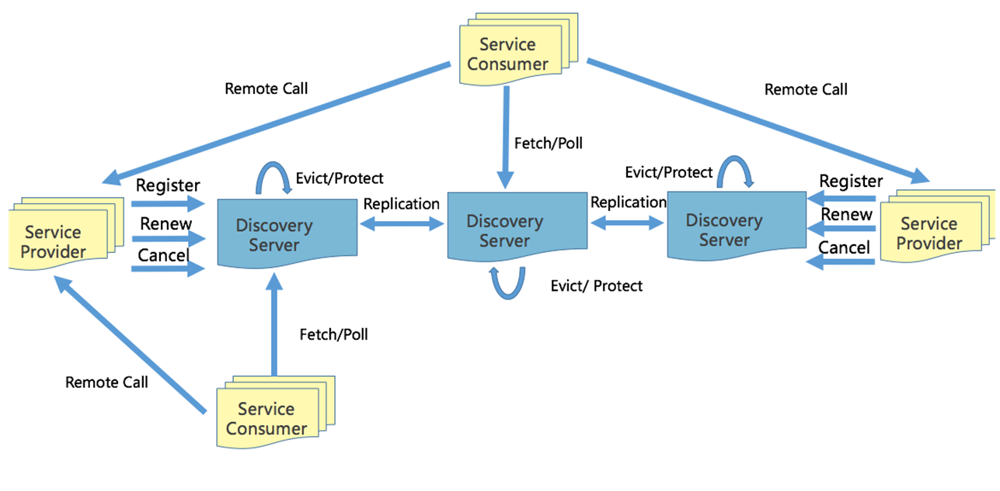

# 服务发现&多租户

## 服务间通信方式: gRPC

- 为什么采用 gRPC?

  - 多语言：语言中立，支持多种语言。

  - 轻量级、高性能：序列化支持 PB(Protocol Buffer)和 JSON，PB 是一种语言无关的高性能序列化框架。

  - 可插拔

  - IDL：基于文件定义服务，通过 proto3 工具生成指定语言的数据结构、服务端接口以及客户端 Stub。

  - 移动端：基于**标准的 HTTP2 设计，支持双向流、消息头压缩、单 TCP 的多路复用**、服务端推送等特性，这些特性使得 gRPC 在移动端设备上更加**省电和节省网络流量**。

  - 服务而非对象、消息而非引用：促进微服务的系统间粗粒度消息交互设计理念。

  - 负载无关的：不同的服务需要使用不同的消息类型和编码，例如 protocol buffers、JSON、XML 和 Thrift。

  - 流：Streaming API。

  - 阻塞式和非阻塞式：支持异步和同步处理在客户端和服务端间交互的消息序列。

  - 元数据交换：

    常见的横切关注点，如认证或跟踪，依赖数据交换。

    - metadata

  - 标准化状态码：客户端通常以有限的方式响应 API 调用返回的错误。

- 为什么不使用 restful

  - 每个客户端都需要单独写 SDK，复杂麻烦
  - 需要单独写文档，常常会因为代码更新了但是文档没更新陷入坑中
  - 性能不太好，json 传递相对于 pb 更耗流量，性能更低
  - http1.1 是一个单连接的请求，在内部网络环境，使用 http 比较浪费
  - restful 是一个松散约束的协议，非常灵活，每个人，每个团队出来的代码都不太一样，比较容易出错

## 优雅启动与优雅中止（健康检查）

### 优雅启动

[


1. Provider 启动，k8s 中的启动脚本会定时去检查服务的健康检查接口
2. 健康检查通过之后，服务注册脚本向注册中心注册服务（rpc://ip:port）
3. 消费者定时从服务注册中心获取服务方地址信息
4. 获取成功后，会定时的向服务方发起健康检查，健康检查通过后才会向这个地址发起请求
   1. 在运行过程中如果健康检查出现问题，会从消费者本地的负载均衡中移除

### 优雅中止


1. 触发下线操作: 首先用户在发布平台点击发版/下线按钮
2. 发布部署平台向注册中心发起服务注销请求，在注册中心下线服务的这个节点
   - 这里在发布部署平台实现有个好处，不用每个应用都去实现一遍相同的逻辑
   - 在应用受到退出信号之后由应用主动发起注销操作也是可以的

​		2.1 注册中心下线应用之后，消费者会获取到服务注销的事件，然后将服务方的节点从本地负载均衡当中移除

​			注意这一步操作会有一段时间，下面的第四步并不是这一步结束了才开始

3. 发布部署平台向应用发送 `SIGTERM` 信号，应用捕获到之后执行

   - 将健康检查接口设置为不健康，返回错误
      - 这个时候如果消费者还在调用应用程序，调用健康检查接口发现无法通过，也会将服务节点从本地负载均衡当中移除

   - 调用 grpc/http 的 shutdown 接口，并且传递超时时间，等待连接全部关闭后退出
      - 这个超时时间一般为 2 个心跳周期

4. 发布部署平台如果发现应用程序长时间没有完成退出，发送 `SIGKILL` 强制退出应用
   - 这个超时时间根据应用进行设置一般为 10 - 60s


### 实战-在 gin 中实现优雅启动和优雅中止

源码可以在这里找到
https://github.com/mohuishou/Go-000/tree/main/Week01

```go
package main

import (
	"context"
	"log"
	"net/http"
	"os"
	"os/signal"
	"syscall"
	"time"

	"github.com/gin-gonic/gin"
)

// 模拟慢请求
func sleep(ctx *gin.Context) {
	t := ctx.Query("t")
	s, err := strconv.Atoi(t)
	if err != nil {
		ctx.JSON(http.StatusBadRequest, gin.H{"msg": "参数错误: " + t})
		return
	}

	time.Sleep(time.Duration(s) * time.Second)
	ctx.JSON(http.StatusOK, gin.H{"msg": fmt.Sprintf("sleep %d s", s)})
}


const (
	stateHealth   = "health"
	stateUnHealth = "unhealth"
)

var state = stateHealth

func health(ctx *gin.Context) {
	status := http.StatusOK
	if state == stateUnHealth {
		status = http.StatusServiceUnavailable
	}
	ctx.JSON(status, gin.H{"data": state})
}


func main() {
	e := gin.Default()
	e.GET("/health", health)
	e.GET("/sleep", sleep)

	server := &http.Server{
		Addr:    ":8080",
		Handler: e,
	}

	go func() {
		if err := server.ListenAndServe(); err != nil && err != http.ErrServerClosed {
			log.Fatalf("server run err: %+v", err)
		}
	}()

	// 用于捕获退出信号
	quit := make(chan os.Signal)

	// kill (no param) default send syscall.SIGTERM
	// kill -2 is syscall.SIGINT
	// kill -9 is syscall.SIGKILL but can't be catch, so don't need add it
	signal.Notify(quit, syscall.SIGINT, syscall.SIGTERM)
	<-quit
	log.Println("Shutting down server...")

	// 捕获到退出信号之后将健康检查状态设置为 unhealth
	state = stateUnHealth
	log.Println("Shutting down state: ", state)

	// 设置超时时间，两个心跳周期，假设一次心跳 3s
	ctx, cancel := context.WithTimeout(context.Background(), 6*time.Second)
	defer cancel()

	// Shutdown 接口，如果没有新的连接了就会释放，传入超时 context
	// 调用这个接口会关闭服务，但是不会中断活动连接
	// 首先会将端口监听移除
	// 然后会关闭所有的空闲连接
	// 然后等待活动的连接变为空闲后关闭
	// 如果等待时间超过了传入的 context 的超时时间，就会强制退出
	// 调用这个接口 server 监听端口会返回 ErrServerClosed 错误
	// 注意，这个接口不会关闭和等待websocket这种被劫持的链接，如果做一些处理。可以使用 RegisterOnShutdown 注册一些清理的方法
	if err := server.Shutdown(ctx); err != nil {
		log.Fatal("Server forced to shutdown:", err)
	}

	log.Println("Server exiting")
}
```

## 服务发现


### 客户端发现

- 直连，比服务端服务发现少一次网络跳转
- Consumer 需要内置特定的服务发现客户端和发现逻辑
  - 可以将负载均衡逻辑下放到 sidecar 中进行解耦

### 服务端发现

- Consumer 无需关注服务发现具体细节，只需知道服务的 DNS 域名即可

- 支持异构语言开发，需要基础设施支撑，多了一次网络跳转，可能有性能损失，基础设施会比较复杂

  > B 站这边采用的是客户端发现的模式，我们公司用的更多的是服务端发现的模式

### 注册中心

**CP、CA、还是 AP**
实际场景是海量服务发现和注册，服务状态可以弱一致, 需要的是 AP 系统，只需最终一致性即可

- 注册的事件延迟
  - 高可用的服务在这方面问题不大
- 注销的事件延迟
  - 因为有上文提到的健康检查的机制，即使注销延迟，客户端也会主动的将节点移除
- 相关文档
  - 多个注册中心的对比：https://developer.aliyun.com/article/698930
  - https://nacos.io/zh-cn/index.html 阿里开源的注册中心，毛老师推荐 😂

**eureka 实现原理**

> b 站仿照用 go 写了一个 https://github.com/bilibili/discovery




- 服务注册
  - **注册：**服务方启动后向注册中心任意一个节点发送注册请求，然后这个节点会向其他节点进行广播同步
  - **心跳：**注册后定期（30s）向注册中心发送心跳
  - **下线：**下线时向注册中心发送下线请求
  - 注意：注册中心节点启动时需要加载缓存进行预热，所以不建议这个时候服务进行重启或者是发版
- 服务发现
  - 消费者定期向注册中心长轮训获取节点信息，获取到之后缓存到本地
- 网络故障
  - 服务方与注册中心
    - 注册中心会定期（60s）检测已失效（90s 未更新）的实例，失效之后就会移除，但是如果短时间内丢失大量心跳连接，（15min 内心跳低于期望值的 85%）就会开启自我保护模式，保留过期的服务不会进行删除
  - 注册中心与消费者
    - 消费者本地有缓存，问题不大
  - 服务方与消费者
    - 有健康检查，健康检查不通过时，会从消费者本地负载均衡中移除
- 注册中心故障
  - 不建议这个时候服务进行重启或者是发版，因为这个时候注册不上，会导致服务不可用，不发版短时间没有影响
  - 如果全部挂掉，启动时必须要等两到三个心跳周期，等所有的服务都注册上之后再开始提供服务运行消费者拉取数据
  - 如果挂掉一个，需要等其他的节点将信息同步到本机之后再提供服务
  - 数据同步时会对比时间戳，会保证当前节点的数据是最新的

## 多集群

> 注意这里的多集群都是单个机房内的

### 多集群需求从何而来？

对于类似账号服务的 L0 级别的服务，几乎所有的服务都有依赖，需要尽可能的提高服务的可用性

- 从单一集群考虑，多个节点保证可用性，我们通常使用 N+2 的方式来冗余节点。
  - N 一般通过压测得出
- 从单一集群故障带来的影响面角度考虑冗余多套集群。
  - 例如依赖的 redis 出现问题，整个集群挂掉了
- 单个机房内的机房故障导致的问题
  - 多机房部署，如果在云上可能是多个可用区

### 什么是多集群？

- 给某个服务部署多套，每一套都拥有独立的缓存，物理上相当于有多套资源，逻辑上划分为不同的集群，在服务注册的时候向注册中心注册的时候携带相关的集群标签

### 如何降低健康检查流量

对于账号这种大量服务依赖的服务，仅仅是健康检查流量就会导致 30%以上的资源占用（B 站之前的真实情况）
可以使用子集算法，将后端的节点均分给所有的客户端。

- 通常 20-100 个后端，部分场景需要大子集，比如大批量读写操作。
- 后端平均分给客户端。
- 客户端重启，保持重新均衡，同时对后端重启保持透明，同时连接的变动最小
  - 消费者变化的时候需要重新平衡。

```go
// from google sre
func Subset(backends []string, clientID, subsetSize int) []string {
	subsetCount := len(backends) / subsetSize

	// Group clients into rounds; each round uses the same shuffled list:
	round := clientID / subsetCount

	r := rand.New(rand.NewSource(int64(round)))
	r.Shuffle(len(backends), func(i, j int) { backends[i], backends[j] = backends[j], backends[i] })

	// The subset id corresponding to the current client:
	subsetID := clientID % subsetCount

	start := subsetID * subsetSize
	return backends[start : start+subsetSize]
}
```

**为什么上面这个算法可以保证可以均匀分布？**

首先，**shuffle 算法保证在 round 一致的情况下，backend 的排列一定是一致的。**

因为每个实例拥有从 0 开始的连续唯一的自增 id，且计算过程能够保证每个 round 内所有实例拿到的服务列表的排列一致，因此在同一个 round 内的 client 会分别 backend 排列的不同部分的切片作为选中的后端服务来建立连接。

所以只要 client id 是连续的，那么 client 发向后端的连接就一定是连续的。

**参考资料:**

https://sre.google/sre-book/load-balancing-datacenter/

https://xargin.com/limiting-conn-wih-subset/

## 多租户（如何解决多套测试环境的问题）

在一个微服务架构中**允许多系统共存**是利用微服务稳定性以及模块化最有效的方式之一，这种方式一般被称为多租户(multi-tenancy)。租户可以是测试，金丝雀发布，影子系统(shadow systems)，甚至服务层或者产品线，使用租户能够保证代码的隔离性并且能够基于流量租户做路由决策。

### 如何解决测试环境的问题

#### 场景

假设现在有一个服务调用链 A -> B -> C，如果 C 同时有多个同学开发，如果甲同学的代码正在测试中，但是乙同学不小心发了一个版本，就会导致甲同学的代码被冲掉，导致测试同学测着测着就出现 bug。测试同学无法得知这个问题是由于环境导致的还是代码缺陷。

#### 解决方案 1：多套物理环境（类似上文的多集群）

搭建多套测试环境，可以做到物理隔离，但是也会存在一些问题：

- 混用环境导致的不可靠测试。
- 多套环境带来的硬件成本。
- 难以做负载测试，仿真线上真实流量情况。
- 治标不治本，无法知道当前环境谁在使用，并且几套环境可以满足需求？万一又多几个人开发是不是又需要再来几套？

#### 解决方案 2：多租户，染色发布


- 注册流程
  - 假设我们现在有一套问题的 `FAT1` 测试环境，然后现在对应用 B 做了修改
  - 开发同学通过发布平台发布一个新的 B 应用 B`，并且带上环境标签，例如:`red`
  - 应用 B`向注册中心进行注册时候会带上`red` 标签
  - 消费者 A 在向注册中心获取服务节点数据的时候也会获取到这个标签，并且在本地的负载均衡当中使用 `map[string]pool` 的结构进行保存
- 调用流程
  - 测试同学通过 A 进行调用测试，如果是 http 就在 header 中打上这个 `red` 标签，如果是 grpc 就在 metadata 中加入这个标签
  - A 调用 B 的时候，发现 header 中存在 `red` 标签就会去本地负载均衡查询，发现负载均衡中有 red 标签的连接，这个之后就直接调用到 B`，并且在调用的时候 A 会将 header 的标签信息进行透传
  - B` 收到请求之后，需要调用 C、D 这时候也是一样的会去负载均衡中进行查询，发现没有就会退回到默认的连接池中
- 如何进行联调？
  - 需要联调的应用打上相同的标签就可以了
- 注意事项
  - 应用版本发布时数据结构，例如 db 中的表，redis 中的 key，必须保证向下兼容
  - 测试的时候需要使用不同的测试账号
  - 注意来自外网的请求中的 header 必须删除，确保安全
- 核心思路
  - 跨服务传递请求携带上下文(context)，数据隔离的流量路由方案。
    - 根据标签进行流量路由，并且要确保可以透传
  - 利用服务发现注册租户信息，注册成特定的租户。
    - 发布部署平台需要支持方便启动多套环境，以及标签注入
    - 对不同的环境做了隔离，可以保证对关键业务没有影响

### 如何进行全链路压测


和上面的测试环境的解决方案类似，但是我们需要搭建一套和线上一致的影子系统。


- 如何解决压测数据对线上数据的影响。
  - 基础设施需要做改造，采用同样的基础设施节点。
  - 缓存：影子应用存储的数据放到影子库中，使用不同的 db。
  - 数据库：自动将线上的数据结构复制一份到影子数据库中。里面的表结构保持一致，数据库名做一些变化，例如 db_shadow。
  - 消息队列: 推送消息的时候使用不同的 topic 或者是携带一些 metadata 信息。
- 需要提前做一些数据初始化的操作，提前进行准备。
- 压测时携带压测标签，将流量自动路由到影子服务进行压测。

这种方案同样可以用于灰度发版当中。