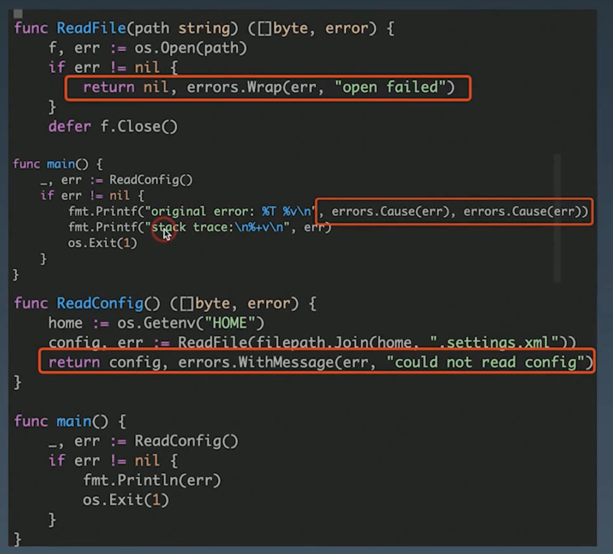
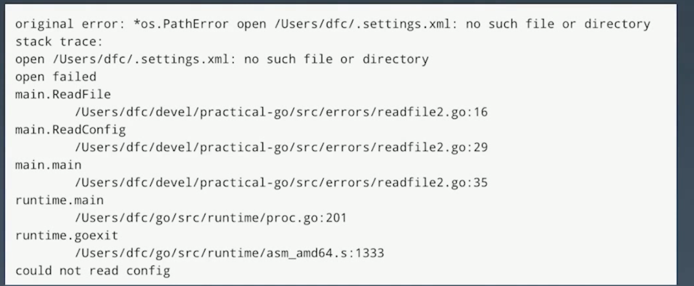

# 异常处理

## panic or error?

1. 在 Go 中 panic 会导致程序直接退出，是一个致命的错误，如果使用 `panic` `recover`进行处理的话，会存在很多问题


​		性能问题，频繁 panic recover 性能不好

​		容易导致程序异常退出，只要有一个地方没有处理到就会导致程序进程整个退出

​		不可控，一旦 panic 就将处理逻辑移交给了外部，我们并不能预设外部包一定会进行处理

2. 什么时候使用 panic 呢？

   对于真正意外的情况，那些表示不可恢复的程序错误，例如索引越界、不可恢复的环境问题、栈溢出，我们才使用 panic

3. 使用 error 处理有哪些好处？

​		简单。

​		考虑失败，而不是成功(Plan for failure, not success)。	

​		没有隐藏的控制流。

​		完全交给你来控制 error。

​		Error are values。

## 为什么标准库中 errors.New 会返回一个指针

翻看标准库的源代码我们可以发现， `errors` 库中的 `errorString` 结构体实现了 `error` 接口，为什么在 `New` 一个 error 的时候会返回一个结构体的指针呢？

```go
// New returns an error that formats as the given text.
// Each call to New returns a distinct error value even if the text is identical.
func New(text string) error {
	return &errorString{text}
}

// errorString is a trivial implementation of error.
type errorString struct {
	s string
}

func (e *errorString) Error() string {
	return e.s
}
```

我们先来看一个例子，我们同样创建了 errorString 的结构体，我们自定义的和标准库中的唯一不同就是，自建的这个返回的是值，而不是指针。

在 `main` 函数的对比中我们就可以发现，我们自定义的 `errorString` 在对比的时候只要对应的字符串相同就会返回 true，但是标准库的包不会。

这是因为，在对比两个 struct 是否相同的时候，会去对比，这两个 struct 里面的各个字段是否是相同的，如果相同就返回 true，但是对比指针的时候会去判断两个指针的地址是否一致。

**如果字符串相等就返回 true 会导致什么问题呢？**

如果我有两个包，定义了两个错误，他们其实是两个相同的字符串，在其他库调用对比的时候，可能会由于不同的书写顺序，走进不同的分支导致一些奇奇怪怪的错误

```go
type errorString struct {
	text string
}

func (e errorString) Error() string {
	return e.text
}

// New 创建一个自定义错误
func New(s string) error {
	return errorString{text: s}
}

var errorString1 = New("test a")
var err1 = errors.New("test b")

func main() {
	if errorString1 == New("test a") {
		fmt.Println("err string a") // 会输出
	}

	if err1 == errors.New("test b") {
		fmt.Println("err b") // 不会输出
	}
}
```

## error type: 错误定义与判断

### Sentinel Error

哨兵错误，就是定义一些包级别的错误变量，然后在调用的时候外部包可以直接对比变量进行判定，在标准库当中大量的使用了这种方式
例如下方 `io` 库中定义的错误

```go
// EOF is the error returned by Read when no more input is available.
// Functions should return EOF only to signal a graceful end of input.
// If the EOF occurs unexpectedly in a structured data stream,
// the appropriate error is either ErrUnexpectedEOF or some other error
// giving more detail.
var EOF = errors.New("EOF")

// ErrUnexpectedEOF means that EOF was encountered in the
// middle of reading a fixed-size block or data structure.
var ErrUnexpectedEOF = errors.New("unexpected EOF")

// ErrNoProgress is returned by some clients of an io.Reader when
// many calls to Read have failed to return any data or error,
// usually the sign of a broken io.Reader implementation.
var ErrNoProgress = errors.New("multiple Read calls return no data or error")
```

我们在外部判定的时候一般使用等值判定或者使用 `errors.Is` 进行判断

```go
if err == io.EOF {
	//...
}

if errors.Is(err, io.EOF){
	//...
}
```

这种错误处理方式有一个问题是，将 error 当做包的 API 暴露给了第三方，这样会导致在做重构或者升级的时候很麻烦，并且这种方式包含的错误信息会十分的有限

### error types

这个就类似我们前面定义的 `errorString` 一样实现了 `error` 的接口，然后在外部是否类型断言来判断是否是这种错误类型

```go
type MyStruct struct {
	s string
    name string
    path string
}


// 使用的时候
func f() {
    switch err.(type) {
        case *MyStruct:
        // ...
        case others:
        // ...
    }
}
```

这种方式相对于哨兵来说，可以包含更加丰富的信息，但是同样也将错误的类型暴露给了外部，例如标准库中的 `os.PathError`

### Opaque errors

不透明的错误处理，这种方式最大的特点就是只返回错误，暴露错误判定接口，不返回类型，这样可以减少 API 的暴露，后续的处理会比较灵活，这个一般用在公共库会比较好

```go
type temporary interface {
	Temporary() bool
}

func IsTemporary(err error) bool {
	te, ok := err.(temporary)
	return ok && te.Temporary()
}

```

这种方式我们可以断言错误实现了特定的行为，而不是断言错误是特定的类型或值

## error handle: 错误处理优化

在 go 中常常会存在大量的 `if err` 代码，下面介绍两种常见的减少这种代码的方式

### bufio.scan

对比下面两个函数的处理我们可以发现， `count2` 使用 `sc.Scan` 之后一个 `if err` 的判断都没有，极大的简化了代码，这是因为在 `sc.Scan` 做了很多处理，像很多类似的，需要循环读取的都可以考虑像这样包装之后进行处理，这样外部包调用的时候就会非常简洁

```go
// 统计文件行数
func count(r io.Reader) (int, error) {
	var (
		br    = bufio.NewReader(r)
		lines int
		err   error
	)

	for {
		// 读取到换行符就说明是一行
		_, err = br.ReadString('\n')
		lines++
		if err != nil {
			break
		}
	}

	// 当错误是 EOF 的时候说明文件读取完毕了
	if err != io.EOF {
		return 0, err
	}

	return lines, err
}

func count2(r io.Reader) (int, error) {
	var (
		sc    = bufio.NewScanner(r)
		lines int
	)

	for sc.Scan() {
		lines++
	}

	return lines, sc.Err()
}
```

### error writer

看一个来自 go blog 的例子：https://blog.golang.org/errors-are-values
一般代码

```go
_, err = fd.Write(p0[a:b])
if err != nil {
    return err
}
_, err = fd.Write(p1[c:d])
if err != nil {
    return err
}
_, err = fd.Write(p2[e:f])
if err != nil {
    return err
}
// and so on
```

errWriter

```go
type errWriter struct {
    w   io.Writer
    err error
}

func (ew *errWriter) write(buf []byte) {
    if ew.err != nil {
        return
    }
    _, ew.err = ew.w.Write(buf)
}

// 使用时
ew := &errWriter{w: fd}
ew.write(p0[a:b])
ew.write(p1[c:d])
ew.write(p2[e:f])
// and so on
if ew.err != nil {
    return ew.err
}

```

如果去翻 标准库中 bufio.Writer 的源代码，你会发现也有这种用法，这种就是将重复的逻辑进行了封装，然后把 error 暂存，然后我们就只需要在最后判断一下 error 就行了。


net/http的代码（可能是老版本的）：

```go
type Header struct {
  Key, Value string
}

type Status struct {
  Code int
  Reason string
}

func WriteResponse(w io.Writer, st Status, headers []Header, body io.Reader) error {
  _, err := fmt.Fprintf(w, "HTTP/1.1 %d %s\r\n", st.Code, st.Reason)
  if err != nil {
    return err
  }
  
  for _, h := range headers {
    _, err := fmt.Fprintf(w, "%s: %s\r\n", h.Key, h.Value)
    if err != nil {
      return err
    }
  }
  
  if _, err := fmt.Fprint(w, "\r\n"); err != nil {
    return err
  }
  
  _, err := io.Copy(w, body)
  return err
}

// fmt.Fprintf source code
// These routines end in 'f' and take a format string.

// Fprintf formats according to a format specifier and writes to w.
// It returns the number of bytes written and any write error encountered.
func Fprintf(w io.Writer, format string, a ...any) (n int, err error) {
	p := newPrinter()
	p.doPrintf(format, a)
	n, err = w.Write(p.buf)
	p.free()
	return
}
```

可以将 `error` 包装到 `errWriter` 中来优化 `if err != nil` 的代码，每次调用  `fmt.Fprintf` 其实都是在调用 `errWriter.Write` 方法，然后会将 `err` 暂存：

```go
type errWriter struct {
  io.Writer
  err error
}

func (e *errWriter) Write(buf []byte) (int, error) {
  if e.err != nil {
    return 0, e.err
  }
  
  var n int
  n, e.err = e.Writer.Write(buf)
  return n, nil
}


func WriteResponse(w io.Writer, st Status, headers []Header, body io.Reader) error {
  ew := &errWriter{Writer: w}
  fmt.Fprintf(ew, "HTTP/1.1 %d %s\r\n", st.Code, st.Reason)
  
  for _, h := range headers {
    fmt.Fprintf(ew, "%s: %s\r\n", h.Key, h.Value)
  }
  
  fmt.Fprintf(ew, "\r\n")
  io.Copy(ew, body)
  
  return ew.err
}
```


## wrap error: 错误包装

you should only handle errors once. Handling an error means inspecting the error value, and making a single decision.

意思就是碰到一个错误最好只处理一次，要么往上抛，要么打日志。

```go
// bad case
func WriteAll(w io.Writer, buf []byte) error {
  _, err := w.Write(buf)
  if err != nil {
    log.Println("unable to write:", err)
    return err
  }
  return nil
}
```

这样的处理方式不好，每个错误都会打个日志，造成冗余，而且打出来的日志可能在日志收集的地方会分割成多个部分。且有可能在写代码的时候只打印日志而忘记返回，这样可能会造成逻辑错误。

使用 `github.com/pkg/errors` 库来包装错误，优化后可以这么写：

```go
func WriteAll(w io.Writer, buf []byte) error {
  _, err := w.Write(buf)
  return errors.Wrap(err, "write failed")
}
```

`github.com/pkg/errors` 的常用方法：




errors.Wrap：会为错误添加堆栈信息，并添加需要的日志信息，而且其类型也是预定义类型，可以通过 == 来判断，也是一种 sentinel error。注意不要处处都用 errors.Wrap，因为那样会有大量的冗余堆栈。

errors.WithMessage：只为错误添加需要的日志信息，不添加堆栈信息。

errors.Cause：输出错误的根因。也可以通过 `%T` 来输出错误的类型，比如下图的 `*os.PathError` 类型：




为什么不用标准库的`fmt.Errorf("%w")`？因为它不附带堆栈信息，不知道是哪个文件哪一行报的错。


## 标准库 errors.Is / As 怎么判断错误

### errors.Is

其实就是判断一个 `error` 是否和 `target error` 相等（类似于 `if err == ErrNotFound`，判断是否是一种 sentinel error )。

```go
func Is(err, target error) bool {
	if target == nil {
		return err == target
	}
	// 通过反射判读 target 是否可以被比较
	isComparable := reflectlite.TypeOf(target).Comparable()
	for {
        // 循环判断是否相等
		if isComparable && err == target {
			return true
		}
        // 判断是否实现了 is 接口，如果有实现就直接判断
		if x, ok := err.(interface{ Is(error) bool }); ok && x.Is(target) {
			return true
		}

		// 去判断是否实现了 unwrap 的接口，如果实现了就进行 unwrap
		if err = Unwrap(err); err == nil {
			return false
		}
	}
}
```

### errors.As

就是判断一个 `error` 是否是和 `target` 一样的类型。

和 is 的逻辑类似，就是不断的进行 unwrap 进行比较，只要有一个相同就返回，如果一直到底都不行就返回 false。

```go
func As(err error, target interface{}) bool {
	if target == nil {
		panic("errors: target cannot be nil")
	}
	val := reflectlite.ValueOf(target)
	typ := val.Type()
	if typ.Kind() != reflectlite.Ptr || val.IsNil() {
		panic("errors: target must be a non-nil pointer")
	}
	if e := typ.Elem(); e.Kind() != reflectlite.Interface && !e.Implements(errorType) {
		panic("errors: *target must be interface or implement error")
	}
	targetType := typ.Elem()
	for err != nil {
		if reflectlite.TypeOf(err).AssignableTo(targetType) {
			val.Elem().Set(reflectlite.ValueOf(err))
			return true
		}
		if x, ok := err.(interface{ As(interface{}) bool }); ok && x.As(target) {
			return true
		}
		err = Unwrap(err)
	}
	return false
}
```


## 总结

### panic

1. 在程序启动的时候，如果有强依赖的服务出现故障时 `panic` 退出

2. 在程序启动的时候，如果发现有配置明显不符合要求， 可以 `panic` 退出（防御编程）

3. 其他情况下只要不是不可恢复的程序错误，都不应该直接 `panic` 应该返回 `error`

4. 在程序入口处，例如 `gin` 中间件需要使用 `recover` 预防 `panic` 程序退出

5. 在程序中我们应该避免使用野生的 `goroutine`
   1. 如果是在请求中需要执行异步任务，应该使用异步 `worker` ，消息通知的方式进行处理，避免请求量大时大量 `goroutine` 创建
   2. 如果需要使用 `goroutine` 时，应该使用同一的 `Go` 函数进行创建，这个函数中会进行 `recover` ，避免因为野生 `goroutine` panic 导致主进程退出

```go
func Go(f func()){
    go func(){
        defer func(){
            if err := recover(); err != nil {
                log.Printf("panic: %+v", err)
            }
        }()

        f()
    }()
}
```

### error

1. 我们在应用程序中使用 `github.com/pkg/errors` 处理应用错误，**注意在公共库当中，我们一般不使用这个**。基础库或公共库里一般使用官方自带的 `errors` 库，即直接返回错误，不附带任何堆栈信息。只有在自己的业务应用代码里才可能需要附带堆栈信息。

2. `error` 应该是函数的最后一个返回值，当`error` 不为 `nil` 时，函数的其他返回值是不可用的状态，不应该对其他返回值做任何期待。
   - 比如 `func f() (io.Reader, *S1, error)` 这里，我们不知道 `io.Reader` 中是否有数据，可能有，也有可能有一部分。
   
3. 错误处理的时候应该先判断错误， `if err != nil` 出现错误及时返回，使代码是一条流畅的直线，避免过多的嵌套.

```go
// good case
func f() error {
    a, err := A()
    if err != nil {
        return err
    }

    // ... 其他逻辑
    return nil
}

// bad case
func f() error {
    a, err := A()
    if err == nil {
    	// 其他逻辑
    }

    return err
}
```

4. 在**应用程序**中出现错误时，使用 `errors.New` 或者 `errors.Errorf` 返回错误（这里会附带堆栈信息），此时 errors 是 `github.com/pkg/errors` 这个库。

```go
func (u *usecese) usecase1() error {
    money := u.repo.getMoney(uid)
    if money < 10 {
        errors.Errorf("用户余额不足, uid: %d, money: %d", uid, money)
    }
    // 其他逻辑
    return nil
}
```

5. 如果是调用**应用程序的**其他函数出现错误，请直接返回，如果需要携带信息，请使用 `errors.WithMessage`。

```go
func (u *usecese) usecase2() error {
    name, err := u.repo.getUserName(uid)
    if err != nil {
        return errors.WithMessage(err, "其他附加信息")
    }

    // 其他逻辑
    return nil
}
```

6. 如果是调用其他库（标准库、企业公共库、开源第三方库等）获取到错误时，请使用  `errors.Wrap`添加堆栈信息（因为标准库里是不会带堆栈信息的）。

   - 切记，不要每个地方都是用 `errors.Wrap` ，只需要在错误第一次出现时进行 `errors.Wrap` 即可。

   - 根据场景进行判断是否需要将其他库的原始错误吞掉，例如可以把 `repository` 层的数据库相关错误吞掉，返回业务错误码，避免后续我们分割微服务或者更换 `ORM` 库时需要去修改上层代码。

   - 注意我们在基础库，被大量引入的第三方库编写时一般不使用 `errors.Wrap`， 避免堆栈信息重复。

```go
func f() error {
    err := json.Unmashal(&a, data)
    if err != nil {
        return errors.Wrap(err, "其他附加信息")
    }

    // 其他逻辑
    return nil
}
```

7. 不需要每个出错的地方都打日志，**只需要**在进程的最开始的地方使用 `%+v` 进行统一打印，比如：

```go
func main() {
  err := app.Run()
  if err != nil {
    fmt.Printf("FATAL: %+v\n", err)
    os.Exit(1)
  }
}
```

8. 错误判断使用 `errors.Is` 进行比较。

```go
func f() error {
    err := A()
    if errors.Is(err, io.EOF){
    	return nil
    }

    // 其他逻辑
    return nil
}
```

9. 错误类型判断，使用 `errors.As` 进行赋值。

```go
func f() error {
    err := A()

    var errA errorA
    if errors.As(err, &errA){
    	// ...
    }

    // 其他逻辑
    return nil
}
```

10. 如何判定错误的信息是否足够，想一想当你的代码出现问题需要排查的时候你的错误信息是否可以帮助你快速的定位问题，例如我们在请求中一般会输出参数信息，用于辅助判断错误。
11. 一旦函数/方法处理了错误，错误就不再是错误，如果函数/方法仍需要返回，则它不能返回错误值。它应该只能返回零（比如降级处理中，你返回了降级数据，然后需要 return nil）。
12. 对于业务错误，推荐在一个统一的地方创建一个错误字典，错误字典里面应该包含错误的 code，并且在日志中作为独立字段打印，方便做业务告警的判断，错误必须有清晰的错误文档。
13. 不需要返回，被忽略的错误**必须**输出日志信息。
14. 同一个地方不停的报错，最好不要不停输出错误日志，这样可能会导致被大量的错误日志信息淹没，无法排查问题，比较好的做法是打印一次错误详情，然后打印出错误出现的次数。
15. 对同一个类型的错误，采用相同的模式，例如参数错误，不要有的返回 404 有的返回 200。
16. 处理错误的时候，需要处理已分配的资源，使用 `defer` 进行清理，例如文件句柄。


