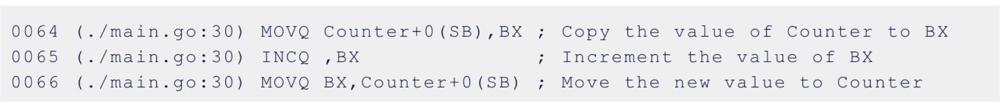
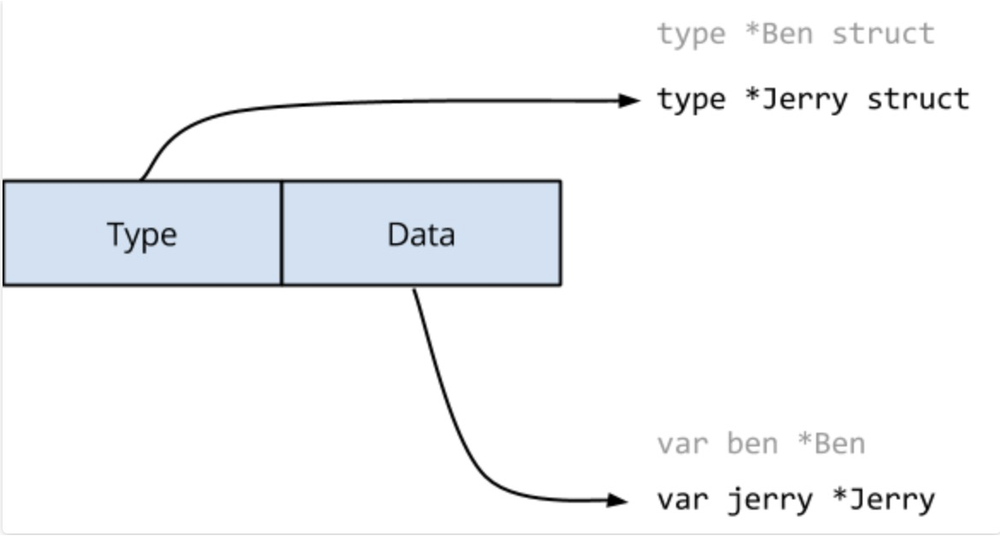
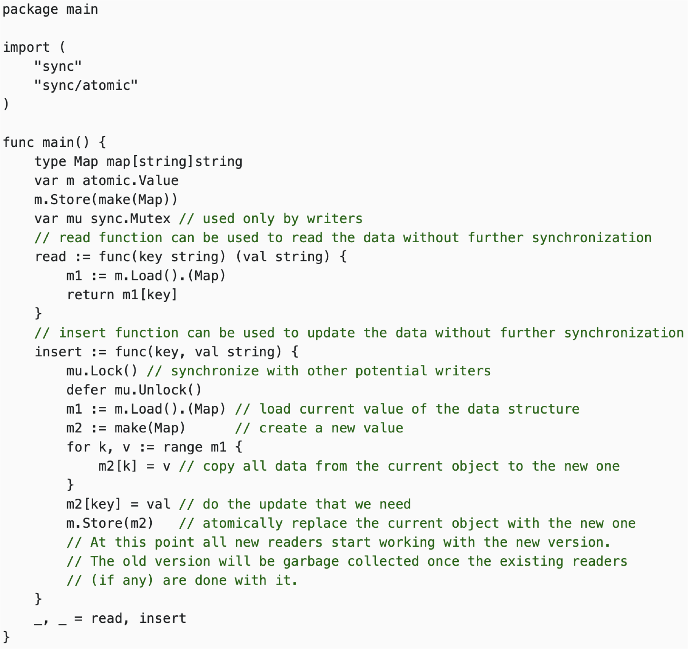
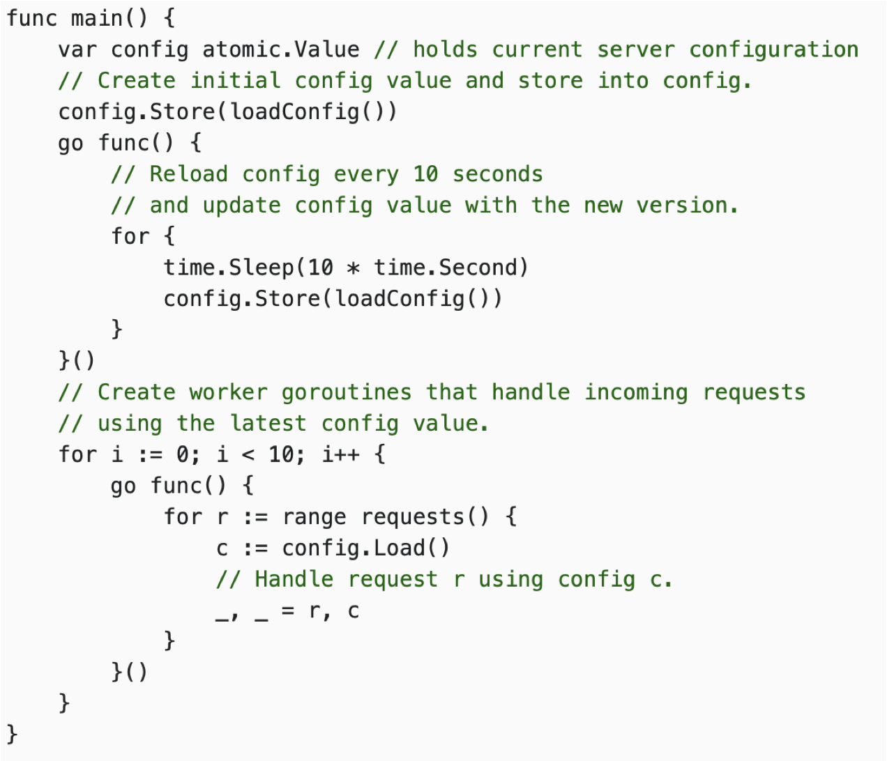
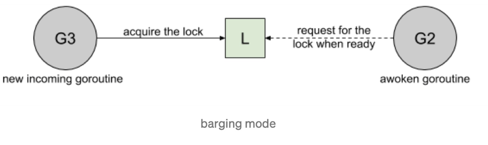
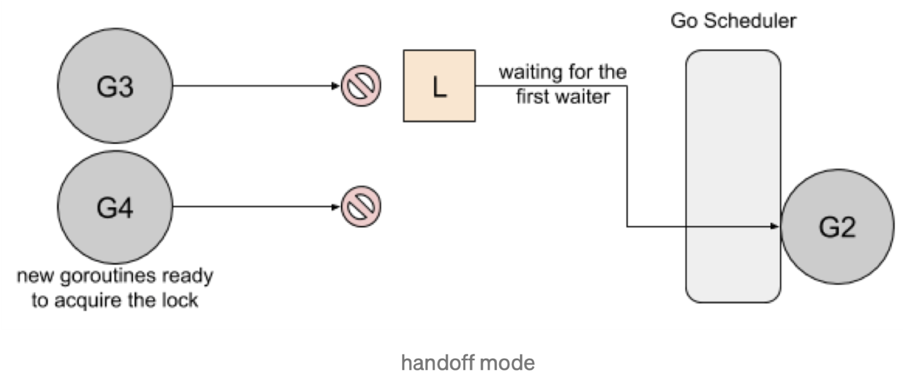
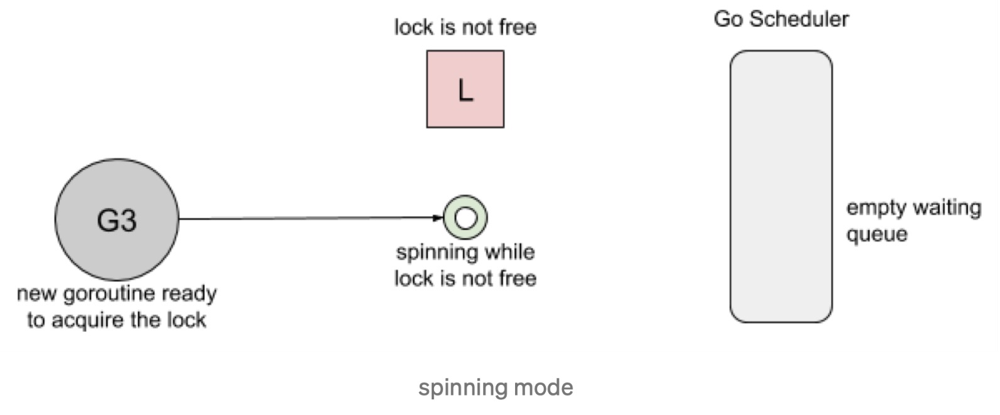
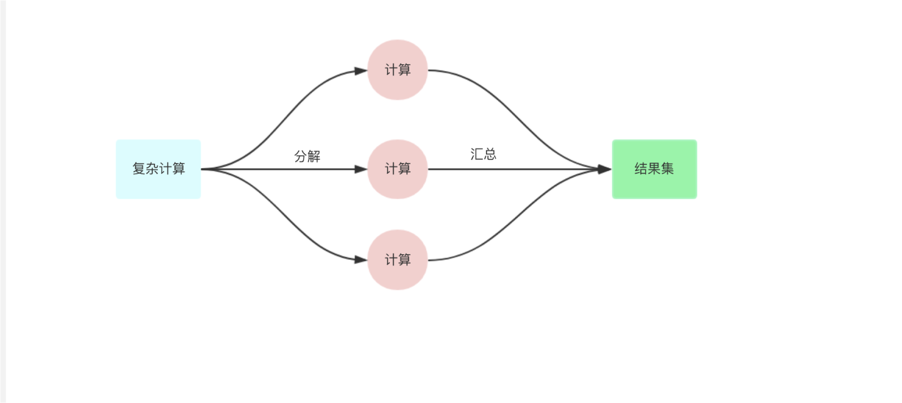
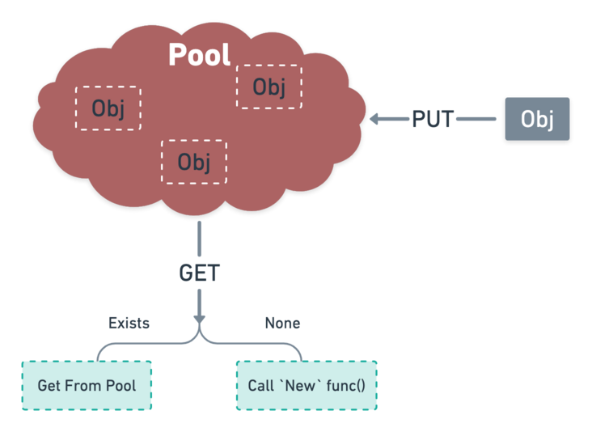
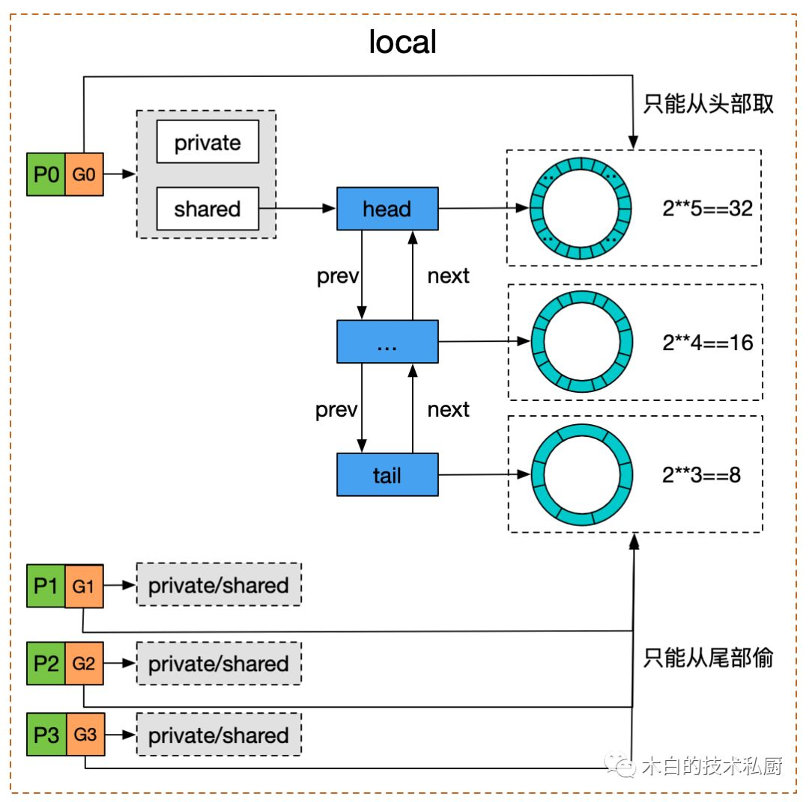

# Sync 包

## Data Race

可以使用以下命令来检测程序里是否会有数据竞争的现象发生：

```bash
go build -race
go test -race
```

>  不建议在生产环境 build 的时候开启数据竞争检测，因为这会带来一定的性能损失(一般内存5-10倍，执行时间2-20倍)，当然 必须要 debug 的时候除外。 建议在执行单元测试时始终开启数据竞争的检测。

`counter ++` 不是原子操作，它一般会被解析成 3 条指令：



这时我们应该使用 Go 同步语义: Mutex、Atomic。

对于一些**全局变量比如 map，或者不受保护的成员变量**，在多并发的条件下访问都会有 data race 的情况出现，这个时候就需要加锁来保护。

最后看一个例子：

dava 在博客中提到过一个很有趣的例子的 [Ice cream makers and data races](https://dave.cheney.net/2014/06/27/ice-cream-makers-and-data-races)

```go
package main

import "fmt"

type IceCreamMaker interface {
	// Great a customer.
	Hello()
}

type Ben struct {
	name string
}

func (b *Ben) Hello() {
	fmt.Printf("Ben says, \"Hello my name is %s\"\n", b.name)
}

type Jerry struct {
	name string
}

func (j *Jerry) Hello() {
	fmt.Printf("Jerry says, \"Hello my name is %s\"\n", j.name)
}

func main() {
	var ben = &Ben{name: "Ben"}
	var jerry = &Jerry{"Jerry"}
	var maker IceCreamMaker = ben

	var loop0, loop1 func()

	loop0 = func() {
		maker = ben
		go loop1()
	}

	loop1 = func() {
		maker = jerry
		go loop0()
	}

	go loop0()

	for {
		maker.Hello()
	}
}
```

这个例子有趣的点在于，最后输出的结果会有这种例子：

```
Ben says, "Hello my name is Jerry"
Ben says, "Hello my name is Jerry"
```

这是因为我们在 `maker = jerry` 或 `maker = ben` 这类赋值操作的时候并不是原子的，只有对 single machine word 进行赋值的时候才是原子的，但 interface 在 go 中其实是一个结构体，它包含了 type 和 data 两个部分， 内部是是两个 machine word 的值，所以它的复制也不是原子的，会出现问题。

```go
type interface struct {
       Type uintptr     // points to the type of the interface implementation
       Data uintptr     // holds the data for the interface's receiver
}
```



这个案例有趣的点还在于，这个案例的两个结构体的内存布局一模一样所以出现错误也不会 panic 退出。但如果在某一个结构体里面再加入一个 int 或 string 的字段，去读取就会导致 panic。所以这种错误在线上实在太难发现了，而且很有可能会很致命。

这个案例还有一个衍生案例，大家有兴趣可以点开查看一下，并不是说要看起来一样才不会 panic。

 https://www.ardanlabs.com/blog/2014/06/ice-cream-makers-and-data-races-part-ii.html


## sync.atomic

`atomic.Value` 这种适合配置文件这种读特别多，写特别少的场景，因为他是 COW（Copy On Write）写时复制的一种思想。

Copy-On-Write 思路在微服务降级或者 local cache 场景中经常使用。写时复制指的是，写操作时候复制全量老数据到一个新的对象中，携带上本次新写的数据，之后利用原子替换（atomic.Value），更新调用者的变量。来完成无锁访问共享数据。

比如以下两个使用 atomic 的例子，都是使用一个全新的变量去替换 atomic.Value 中的数据：





这种思路会有一个问题，就是可能有部分 goroutine 在使用老的对象，所以老的对象不会立即被回收，如果存在大量写入的话，会导致产生大量的副本，性能反而不一定好 。
这种方式的好处就是不用加锁，所以也不会有 goroutine 的上下文切换，并且在读取的时候大家都读取的相同的副本所以性能上回好一些。

### 引申

#### Redis bgsave 的 cow

Redis 服务器会在触发 BGSAVE 时调用 redis Fork 函数来创建子进程，并调用 rdbSave 在子进程中对数据进行持久化，通过 fork 生成的父子进程会共享包括内存空间。子进程的逻辑内存与父进程的逻辑内存映射到同一块物理内存。

kernel把父进程中所有的内存页的权限都设为read-only，然后子进程的地址空间指向父进程。当父子进程都只读内存时，相安无事。当其中某个进程写内存时，CPU硬件检测到内存页是read-only的，于是触发页异常中断（page-fault），陷入kernel的一个中断例程。

中断例程中，kernel就会把触发的异常的页复制一份，于是父子进程各自持有独立的一份。

因此，在父进程修改内存页（linux页4kb）时，内核才会将要更改的内存页实际拷贝到子进程里，他把拷贝延迟到实际需要拷贝的时候才真正进行拷贝。相对于没有COW时大大减少了内存的实际占用以及拷贝带来的性能消耗。复制出来的旧数据交给子进程使用，然后主进程该干啥就干啥。


### 底层原理

以下内容来自 [Go并发编程(五) 深入理解 sync/atomic](https://lailin.xyz/post/go-training-week3-atomic.html)

#### Store

我们先看看 store 方法，store 方法会将值存储为 x，这里需要注意，每次传入的 x 不能为 nil，并且他们类型必须是相同的，不然会导致 panic

```go
func (v *Value) Store(x interface{}) {
	if x == nil {
		panic("sync/atomic: store of nil value into Value")
	}
    // ifaceWords 其实就是定义了一下 interface 的结构，包含 data 和 type 两部分
    // 这里 vp 是原有值
    // xp 是传入的值
	vp := (*ifaceWords)(unsafe.Pointer(v))
	xp := (*ifaceWords)(unsafe.Pointer(&x))
    // for 循环不断尝试
	for {
        // 这里先用原子方法取一下老的类型值
		typ := LoadPointer(&vp.typ)
		if typ == nil {
            // 等于 nil 就说明这是第一次 store
            // 调用 runtime 的方法禁止抢占，避免操作完成一半就被抢占了
            // 同时可以避免 GC 的时候看到 unsafe.Pointer(^uintptr(0)) 这个中间状态的值
			runtime_procPin()
			if !CompareAndSwapPointer(&vp.typ, nil, unsafe.Pointer(^uintptr(0))) {
				runtime_procUnpin()
				continue
			}

			// 分别把值和类型保存下来
			StorePointer(&vp.data, xp.data)
			StorePointer(&vp.typ, xp.typ)
			runtime_procUnpin()
			return
		}

		if uintptr(typ) == ^uintptr(0) {
            // 如果判断发现这个类型是这个固定值，说明当前第一次赋值还没有完成，所以进入自旋等待
			continue
		}
		// 第一次赋值已经完成，判断新的赋值的类型和之前是否一致，如果不一致就直接 panic
		if typ != xp.typ {
			panic("sync/atomic: store of inconsistently typed value into Value")
		}
        // 保存值
		StorePointer(&vp.data, xp.data)
		return
	}
}
```

具体的逻辑都写在注释中了，这里面复杂逻辑在第一次写入，因为第一次写入的时候有两次原子写操作，所以这个时候用 typ 值作为一个判断，通过不同值判断当前所处的状态，这个在我们业务代码中其实也经常用到。然后因为引入了这个中间状态，所以又使用了 `runtime_procPin` 方法避免抢占。

```go
func sync_runtime_procPin() int {
	return procPin()
}

func procPin() int {
    // 获取到当前 goroutine 的 m
	_g_ := getg()
	mp := _g_.m

    // unpin 的时候就是 locks--
	mp.locks++
	return int(mp.p.ptr().id)
}
```

#### Load

```go
func (v *Value) Load() (x interface{}) {
	vp := (*ifaceWords)(unsafe.Pointer(v))
    // 先拿到类型值
	typ := LoadPointer(&vp.typ)
    // 这个说明还没有第一次 store 或者是第一次 store 还没有完成
	if typ == nil || uintptr(typ) == ^uintptr(0) {
		// First store not yet completed.
		return nil
	}
    // 获取值
	data := LoadPointer(&vp.data)
    // 构造 x 类型
	xp := (*ifaceWords)(unsafe.Pointer(&x))
	xp.typ = typ
	xp.data = data
	return
}
```


### CAS

`Mutex`由操作系统实现，而atomic包中的原子操作则由底层硬件直接提供支持。

在CPU实现的指令集里，有一些指令直接封装进atomic包，这些指令在执行过程中是不允许中断的，因此原子操作可以在`lock-free`的情况下保证并发安全，并且它的性能也能做到随CPU个数的增多而线性扩展。比如下面的 `CAS（CompareAndSwap)`。

在 `sync/atomic` 包中的源码除了 `Value` 之外其他的函数都是没有直接的源码的，需要去 `runtime/internal/atomic` 中找寻，这里以 `CAS` 函数为例，其他的比如上面的 `LoadPointer`、`StorePointer` 都是类似的，

```c
// bool Cas(int32 *val, int32 old, int32 new)
// Atomically:
//	if(*val == old){
//		*val = new;
//		return 1;
//	} else
//		return 0;
TEXT runtime∕internal∕atomic·Cas(SB),NOSPLIT,$0-17
	MOVQ	ptr+0(FP), BX
	MOVL	old+8(FP), AX
	MOVL	new+12(FP), CX
	LOCK
	CMPXCHGL	CX, 0(BX)
	SETEQ	ret+16(FP)
	RET
Copy
```

在注释部分写的非常清楚，这个函数主要就是先比较一下当前传入的地址的值是否和 old 值相等，如果相等，就赋值新值返回 true，如果不相等就返回 false
我们看这个具体汇编代码就可以发现，使用了 `LOCK` 来保证操作的原子性，《[Week03: Go 并发编程(二) Go 内存模型](https://lailin.xyz/post/go-training-week3-go-memory-model.html#内存重排)》提到过的一致性问题， `CMPXCHG` 指令其实就是 CPU 实现的 CAS 操作。

#### 什么操作叫做原子操作？

一个或者多个操作在CPU执行过程中不被中断的特性，称为原子性(atomicity)。这些操作对外表现成一个不可分割的整体，他们要么都执行，要么都不执行，外界不会看到他们只执行到一半的状态。而在现实世界中，CPU不可能不中断的执行一系列操作，但如果我们在执行多个操作时，能让他们的中间状态对外不可见，那我们就可以宣城他们拥有了“不可分割”的原子性。


## Mutex

mutex 使用基本例子：

```go
var mu sync.Mutex

func main() {
	for i := 1; i <= 2; i++ {
		wg.Add(1)
		go routine(i)
	}
	wg.Wait()
	fmt.Printf("Final Counter: %d\n", counter)
}

func routine(id int) {
	for i := 0; i < 2; i++ {
		mu.Lock()
		counter++
		mu.Unlock()
	}
	wg.Done()
}
```


### 底层原理

- Barging： 这种模式是为了提高吞吐量，当锁被释放时，它会马上唤醒第一个等待者，然后把锁给第一个等待者或者给第一个请求锁的人。由于等待者被唤醒之后还要等待调度器调度自己，这个时候如果有别的正在调度的 goroutine 也要获取锁就会马上获取到，然后等待者重新开始等待。所以可能这个等待者会一直等待下去，造成饥饿现象。

  

- Handsoff： 当锁释放时候，锁会一直持有直到第一个等待者**准备好获取锁**。它降低了吞吐量，因为锁被持有，即使另一个 goroutine 准备获取它。这种模式可以解决公平性的问题，因为在 Barging 模式下可能会存在被唤醒的 goroutine 永远也获取不到锁的情况，毕竟一直在 cpu 上跑着的 goroutine 没有上下文切换会更快一些。缺点就是性能会相对差一些。

  
  一个互斥锁的 handsoff 会完美地平衡两个goroutine 之间的锁分配，但是会降低性能，因为它会迫使第一个 goroutine 等待锁。

- Spinning：自旋在等待队列为空或者应用程序重度使用锁时效果不错。parking 和 unparking goroutines 有不低的性能成本开销，相比自旋来说要慢得多。

​		

Go 1.8 使用了 Barging 和 Spining 的结合实现。当试图获取已经被持有的锁时，如果本地队列为空并且 P 的数量大于1，goroutine 将自旋几次（用一个 P 旋转会阻塞程序）。自旋后，goroutine park（暂停）。在程序高频使用锁的情况下，它充当了一个快速路径。

Go 1.9 通过添加一个新的饥饿模式来解决先前解释的问题，该模式将会在释放时候触发 handsoff。所有等待锁超过一毫秒的 goroutine（也称为有界等待）将被诊断为饥饿。当被标记为饥饿状态时，unlock 方法会 handsoff 把锁直接扔给第一个等待者。

在饥饿模式下，自旋也被停用，因为传入的goroutines 将没有机会获取为下一个等待者。

以下内容来自 [Go并发编程(四) 深入理解 Mutex](https://lailin.xyz/post/go-training-week3-sync.html)

### Go Mutex 实现原理

#### 加锁

如下图所示，Go 在 1.15 的版本中锁的实现结合上面提到的三种模式，调用 Lock 方法的时候。

1. 首先如果当前锁处于初始化状态就直接用 CAS 方法尝试获取锁，这是**_ Fast Path_**。

2. 如果失败就进入*** Slow Path***。

   1. 会首先判断当前能不能进入自旋状态，如果可以就进入自旋，最多自旋 4 次。

   2. 自旋完成之后，就会去计算当前的锁的状态。

   3. 然后尝试通过 CAS 获取锁。

   4. 如果没有获取到就调用 `runtime_SemacquireMutex` 方法休眠当前 goroutine 并且尝试获取信号量。

   5. goroutine 被唤醒之后会先判断当前是否处在饥饿状态，（如果当前 goroutine 超过 1ms 都没有获取到锁就会进饥饿模式）。

      ​	 如果处在饥饿状态就会获得互斥锁，如果等待队列中只存在当前 Goroutine，互斥锁还会从饥饿模式中退出。

       	如果不在，就会设置唤醒和饥饿标记、重置迭代次数并重新执行获取锁的循环。

      > CAS 方法在这里指的是 `atomic.CompareAndSwapInt32(addr, old, new) bool` 方法，这个方法会先比较传入的地址的值是否是 old，如果是的话就尝试赋新值，如果不是的话就直接返回 false，返回 true 时表示赋值成功 饥饿模式是 Go 1.9 版本之后引入的优化，用于解决公平性的问题[10]


#### 解锁


代码分析可以看上面引用的文章。


## errgroup

我们把一个复杂的任务，尤其是依赖多个微服务 rpc 需要聚合数据的任务，分解为依赖和并行。

依赖的意思为: 需要上游 a 的数据才能访问下游 b 的数据进行组合。但是并行的意思为: 分解为多个小任务并行执行，最终等全部执行完毕。



[errgroup官方文档](https://pkg.go.dev/golang.org/x/sync/errgroup)

核心原理: 利用 sync.Waitgroup 管理并行执行的 goroutine。 

errgroup 就适合处理并行任务，可以设置如果有一个 goroutine 退出，其他的 goroutine 也会随之退出（调用自己的 cancel 方法）。有以下几点特性：

- 并行工作流
- 错误处理 或者 优雅降级
- context 传播和取消
- 利用局部变量+闭包

### 底层原理

```go
type Group struct {
    // context 的 cancel 方法
	cancel func()

    // 复用 WaitGroup
	wg sync.WaitGroup

	// 用来保证只会接受一次错误
	errOnce sync.Once
    // 保存第一个返回的错误
	err     error
}

func WithContext(ctx context.Context) (*Group, context.Context)
func (g *Group) Go(f func() error)
func (g *Group) Wait() error

// WithContext  就是使用 WithCancel  创建一个可以取消的 context 将 cancel 赋值给 Group 保存起来，然后再将 context 返回回去。注意不要复用这个返回的 ctx，因为可能已经被 errgroup 取消了。
func WithContext(ctx context.Context) (*Group, context.Context) {
	ctx, cancel := context.WithCancel(ctx)
	return &Group{cancel: cancel}, ctx
}

// Go  方法其实就类似于 go 关键字，会启动一个携程，然后利用 waitgroup 来控制是否结束，如果有一个非 nil 的 error 出现就会保存起来并且如果有 cancel 就会调用 cancel 取消掉，使 ctx 返回。
func (g *Group) Go(f func() error) {
	g.wg.Add(1)

	go func() {
		defer g.wg.Done()

		if err := f(); err != nil {
			g.errOnce.Do(func() {
				g.err = err
				if g.cancel != nil {
					g.cancel()
				}
			})
		}
	}()
}

func (g *Group) Wait() error {
	g.wg.Wait()
	if g.cancel != nil {
		g.cancel()
	}
	return g.err
}
```

整个包就一个 Group 结构体。

- 通过 `WithContext` 可以创建一个带取消的 `Group`。
- 当然除此之外零值的 Group 也可以直接使用，但是出错之后就不会取消其他的 goroutine 了。
- `Go` 方法传入一个 `func() error` 内部会启动一个 goroutine 去处理。
- `Wait` 类似 WaitGroup 的 Wait 方法，等待所有的 goroutine 结束后退出，返回的错误是一个出错的 err。


例子：

基于  errgroup 实现一个  http server 的启动和关闭  ，以及  linux signal 信号的注册和处理，要保证能够  一个退出，全部注销退出。

```go
func main() {
	g, ctx := errgroup.WithContext(context.Background())

	mux := http.NewServeMux()
	mux.HandleFunc("/ping", func(w http.ResponseWriter, r *http.Request) {
		w.Write([]byte("pong"))
	})

	// 模拟单个服务错误退出
	serverOut := make(chan struct{})
	mux.HandleFunc("/shutdown", func(w http.ResponseWriter, r *http.Request) {
		serverOut <- struct{}{}
	})

	server := http.Server{
		Handler: mux,
		Addr:    ":8080",
	}

	// g1
	// g1 退出了所有的协程都能退出么？
	// g1 退出后, context 将不再阻塞，g2, g3 都会随之退出
	// 然后 main 函数中的 g.Wait() 退出，所有协程都会退出
	g.Go(func() error {
		return server.ListenAndServe()
	})

	// g2
	// g2 退出了所有的协程都能退出么？
	// g2 退出时，调用了 shutdown，g1 会退出
	// g2 退出后, context 将不再阻塞，g3 会随之退出
	// 然后 main 函数中的 g.Wait() 退出，所有协程都会退出
	g.Go(func() error {
		select {
		case <-ctx.Done():
			log.Println("errgroup exit...")
		case <-serverOut:
			log.Println("server will out...")
		}

		timeoutCtx, cancel := context.WithTimeout(context.Background(), 3*time.Second)
		// 这里不是必须的，但是如果使用 _ 的话静态扫描工具会报错，加上也无伤大雅
		defer cancel()

		log.Println("shutting down server...")
		return server.Shutdown(timeoutCtx)
	})

	// g3
	// g3 捕获到 os 退出信号将会退出
	// g3 退出了所有的协程都能退出么？
	// g3 退出后, context 将不再阻塞，g2 会随之退出
	// g2 退出时，调用了 shutdown，g1 会退出
	// 然后 main 函数中的 g.Wait() 退出，所有协程都会退出
	g.Go(func() error {
		quit := make(chan os.Signal, 0)
		signal.Notify(quit, syscall.SIGINT, syscall.SIGTERM)

		select {
		case <-ctx.Done():
			return ctx.Err()
		case sig := <-quit:
			return errors.Errorf("get os signal: %v", sig)
		}
	})

	fmt.Printf("errgroup exiting: %+v\n", g.Wait())
}
```


## sync.Pool

sync.Pool 的场景是用来保存和复用临时对象，以减少内存分配，降低 GC 压力（Request-Driven 特别合适）。

Get 返回 Pool 中的任意一个对象。如果 Pool 为空，则调用 New 返回一个新创建的对象。

放进 Pool 中的对象，会在说不准什么时候被回收掉。所以如果事先 Put 进去 100 个对象，下次 Get 的时候发现 Pool 是空也是有可能的。不过这个特性的一个好处就在于不用担心 Pool 会一直增长，因为 Go 已经帮你在 Pool 中做了回收机制。

这个清理过程是在每次垃圾回收之前做的。之前每次GC 时都会清空 pool，而在1.13版本中引入了 victim cache，会将 pool 内数据拷贝一份，避免 GC 将其清空，即使没有引用的内容也可以保留最多两轮 GC。

所以并不适合内存池连接池的做法，因为里面的对象可能会被清空。

### 函数签名

```go
type Pool
  func (p *Pool) Get() interface{}
  func (p *Pool) Put(x interface{})
  New func() interface{}
```


底层原理实现可以查看（推荐看）：

[深度分析 Golang sync.Pool 底层原理](https://www.cyhone.com/articles/think-in-sync-pool/)

[sync.Pool原理解析](https://segmentfault.com/a/1190000040050469)






## Sync.Once

以下内容来自 [Go并发编程(八) 深入理解 sync.Once](https://lailin.xyz/post/go-training-week3-once.html)

### 案例

once 的使用很简单

```go
func main() {
	var (
		o  sync.Once
		wg sync.WaitGroup
	)

	for i := 0; i < 10; i++ {
		wg.Add(1)

		go func(i int) {
			defer wg.Done()
			o.Do(func() {
				fmt.Println("once", i)
			})
		}(i)
	}

	wg.Wait()
}
```

输出

```bash
❯ go run ./main.go
once 9
```

### 源码分析

```go
type Once struct {
	done uint32
	m    Mutex
}
```

done 用于判定函数是否执行，如果不为 0 会直接返回。

```go
func (o *Once) Do(f func()) {
	// Note: Here is an incorrect implementation of Do:
	//
	//	if atomic.CompareAndSwapUint32(&o.done, 0, 1) {
	//		f()
	//	}
	//
	// Do guarantees that when it returns, f has finished.
	// This implementation would not implement that guarantee:
	// given two simultaneous calls, the winner of the cas would
	// call f, and the second would return immediately, without
	// waiting for the first's call to f to complete.
	// This is why the slow path falls back to a mutex, and why
	// the atomic.StoreUint32 must be delayed until after f returns.

	if atomic.LoadUint32(&o.done) == 0 {
		// Outlined slow-path to allow inlining of the fast-path.
		o.doSlow(f)
	}
}
```

看 go 的源码真的可以学到很多东西，在这里还给出了很容易犯错的一种实现：

```go
if atomic.CompareAndSwapUint32(&o.done, 0, 1) {
	f()
}
```

Do 方法有一个 guarantee，要保证当它返回后，f 已经执行完成。

而如果按上面这么实现最大的问题是，如果并发调用，一个 goroutine 执行 f ，另外一个会直接返回，不会等待正在执行 f 的这个 goroutine 成功之后返回，这就不能满足这个 guarantee 了。

所以回头看官方的实现：

```go
if atomic.LoadUint32(&o.done) == 0 {
    // Outlined slow-path to allow inlining of the fast-path.
    o.doSlow(f)
}
```

会先判断 done 是否为 0，如果不为 0 说明还没执行过，就进入 `doSlow`。

```go
func (o *Once) doSlow(f func()) {
	o.m.Lock()
	defer o.m.Unlock()
	if o.done == 0 {
		defer atomic.StoreUint32(&o.done, 1)
		f()
	}
}
```

在 `doSlow` 当中使用了互斥锁来保证只会执行一次。

### 总结

- Once 保证了传入的函数只会执行一次，这常用在单例模式，配置文件加载，初始化这些场景下。
- 但是需要注意。Once 是不能复用的，只要执行过了，再传入其他的方法也不会再执行了。
- 并且 Once.Do 在执行的过程中如果 f 出现 panic，后面也不会再执行了。