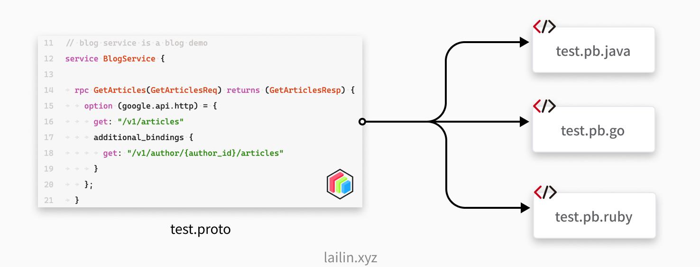

# API 设计

## gRPC

gRPC是什么可以用官网的一句话来概括：

“A high-performance, open-source universal RPC framework”

- 多语言：语言中立，支持多种语言。
- 轻量级、高性能：序列化支持 PB(Protocol Buffer)和 JSON，PB 是一种语言无关的高性能序列化框架。
- 可插拔：可以编写自己的中间件和拦截器加载到 gRPC 中。
- IDL：基于文件定义服务，通过 proto3 工具生成指定语言的数据结构、服务端接口以及客户端 Stub。
- 设计理念。
- 移动端：基于标准的 HTTP2 设计，支持双向流、消息头压缩、单 TCP 的多路复用、服务端推送等特性，这些特性使得 gRPC 在移动端设备上更加省电和节省网络流量。

- 服务而非对象、消息而非引用：促进微服务的系统间粗粒度消息交互设计理念。
- 负载无关的：不同的服务需要使用不同的消息类型和编码，例如 protocol buffers、JSON、XML和Thrift。
- 流: Streaming API。
- 阻塞式和非阻塞式：支持异步和同步处理在客户端和服务端间交互的消息序列。
- 元数据交换：常见的横切关注点，如认证或跟踪，依赖数据交换。
- 标准化状态码：客户端通常以有限的方式响应 API 调用返回的错误。



## API Project

为了统一检索和规范 API，我们内部建立了一个统一的 bapis 仓库，整合所有对内对外 API。

仿照 [googleapis/googleapis](https://github.com/googleapis/googleapis)，[istio/api](https://github.com/istio/api) 等知名项目在 b 站内部搞了一个 bapis 的仓库用于同一存放 api 定义文档，然后通过 ci/cd 生成对应的客户端代码放到各个语言的子仓库当中：


工作流程如上图所示。

- 开发同学修改了 proto 文件定义之后 push 到对应的业务应用仓库当中。
- 然后触发 cicd 流程将 proto 文件复制到 api project 当中。
  - 首先会对 proto 文件进行静态代码分析，查看是否符合规范。
  - 然后 clone api project 创建一个新的分支。
  - 然后 push 代码，创建一个 merge request 请求。
- 然后我们对应负责的同学收到 code review 的通知之后进行 code review，没有问题就会合并到 api project 的主分支当中了。
- 然后就会触发 cicd 生成对应语言的客户端代码，push 到对应的各个子仓库当中了。

### API Project Layout

 api 项目结构：


- 首先是在业务项目当中，我们顶层会有一个 api 目录。
  - 在 api 目录当中我们会按照 product name/app name/版本号/app.proto 的方式进行组织。
  - 具体怎么组织可能每个公司都不太一样，但是总的来说就是应用的 唯一名称+版本号 来进行一个区分。
- 在 api project 当中和业务应用类似，也有一个 api 目录，通过上图的两个框就可以发现这是一模一样的。
  - 除此之外 api project 还有用于注解的 annotations 文件夹。
  - 有一些第三方的引用，例如 googleapis 当中的一些 proto 文件。

## API 设计

### API 兼容性设计

随着应用的不断开发，业务的不断发展我们的 api 肯定会不断的进行修改，在修改 api 的时候考虑 api 的兼容性就会很重要了，如果我们做了一些破坏性的变更就有可能会导致依赖我们的服务或者是客户端报错，这样就会带来事故。

#### 向下兼容的变更

- 新增接口。
- 新增参数字段。
- 新增返回字段。
  - 在不改变其他响应字段的行为的前提下，非资源（例如，ListBooksResponse）的响应消息可以扩展而不必破坏客户端的兼容性。即使会引入冗余，先前在响应中填充的任何字段应继续使用相同的语义填充。

一般而言新增都是相对安全的，但是我们要注意的是新增字段不能改变我们原本的逻辑，如果改变了 api 的逻辑，那就不一定安全了。

#### 向下不兼容的变更（破坏性变更）

- 删除或重命名服务，字段，方法或枚举值。
  - 在做这种修改的时候需要修改我们 api 的版本号，常见有两种方式。
    - 如果只有很少的 api 变动可以创建一个 XXXV2 的方法。
    - 如果变动的 api 比较多，可以直接新启一个 v2 的包。
- 修改字段的类型。
  - 严禁修改字段的类型，修改字段的类型可能会导致客户端崩溃。
- 修改现有请求的可见行为
- 给资源消息添加 读取/写入 字段。

### API 命名规范

#### 包名

| 产品名   | product                     |
| -------- | --------------------------- |
| 应用名   | app                         |
| 版本号   | v1                          |
| 包名     | product.app.v1              |
| 目录结构 | api/product/app/v1/xx.proto |

#### API 定义

- 命名规则：方法 + 资源。
- 标准方法：参考 Google API 设计指南。

| **标准方法** | **HTTP 映射**  |
| ------------ | -------------- |
| List         | GET            |
| Get          | GET            |
| Update       | PUT 或者 PATCH |
| Create       | POST           |
| Delete       | DELETE         |

除了标准的也有一些非标准的，例如同步数据可能会用 `Sync` 等，不过大部分的 api 应该都是标准的。

##### ppt 上的示例

api Url 样例： /<package_name>.\<version\>.<service_name>/{method}


proto 文件示例：


#### 示例

```protobuf
// api/product/app/v1/blog.proto

syntax = "proto3";

package product.app.v1;

import "google/api/annotations.proto";

// blog service is a blog demo
service BlogService {

	rpc GetArticles(GetArticlesReq) returns (GetArticlesResp) {
		option (google.api.http) = {
			get: "/v1/articles"
			additional_bindings {
				get: "/v1/author/{author_id}/articles"
			}
		};
	}
}
```

注意，一般而言我们应该为每个接口都创建一个自定义的 message，为了后面扩展，如果我们用 Empty 的话后续就没有办法新增字段了。

### API Error

### 错误定义

先说我们当前的问题，我们一直用的 http 然后我们返回是使用的下面这种格式，然后 http code 统一返回 200。

```json
{
  "code": 1,
  "msg": "xxx",
  "data": {}
}
```

这种做法就存在一个比较大的问题，做监控的时候不太好做，很多现成的东西没有办法直接使用，因为我们都返回的成功。
参照 google 的错误定义，将 http code 和 grpc 错误码进行映射，返回对应的错误信息。


但是这样还是不行，因为这样很多业务错误信息无法区分，毛老师他们的 kratos v2 的做法是做了两层，使用下面的方式进行定义， kratos 错误定义在 [errors](https://github.com/go-kratos/kratos/tree/main/errors) 包。

```protobuf
message Status {
  // 错误码，跟 grpc-status 一致，并且在HTTP中可映射成 http-status
  int32 code = 1;
  // 错误原因，定义为业务判定错误码
  string reason = 2;
  // 错误信息，为用户可读的信息，可作为用户提示内容
  string message = 3;
  // 错误详细信息，可以附加自定义的信息列表
  map<string, string> metadata = 4;
}
```


### 错误传播

错误传播这一部分很容易出的问题就是，当前服务直接把上游服务的错误给返回了，这样会导致一些问题：

- 如果我调用了多个上游服务都报错了，我应该返回哪一个错误。
- 直接返回导致必须要有一个全局错误码，不然的话就会冲突，但是全局错误码是很难定义的。

正确的做法应该是把上游错误信息吞掉，返回当前服务自己定义的错误信息就可以了（即将上游错误翻译成自己定义的一个错误）。


### FieldMask

FieldMask 可以解决 api 部分更新字段的问题。

具体可以参考：

1. fieldmask 官方文档: https://developers.google.com/protocol-buffers/docs/reference/google.protobuf?hl=en#fieldmask[↩](https://lailin.xyz/post/undefined.html#fnref:2)
2. practical-api-design-at-netflix-part-1-using-protobuf-fieldmask: https://netflixtechblog.com/practical-api-design-at-netflix-part-1-using-protobuf-fieldmask-35cfdc606518[↩](https://lailin.xyz/post/undefined.html#fnref:1)


## 参考文献

1. [Go工程化(四) API 设计上: 项目结构 & 设计](https://lailin.xyz/post/go-training-week4-api-design.html)
2. [GitHub - istio/api: API definitions for the Istio project](https://github.com/istio/api)
3. [GitHub - envoyproxy/data-plane-api: [READ ONLY MIRROR\] Envoy REST/proto API definitions and documentation.](https://github.com/envoyproxy/data-plane-api)
4. [GitHub - googleapis/googleapis: Public interface definitions of Google APIs.](https://github.com/googleapis/googleapis)
5. [API 设计指南  | Google Cloud](https://cloud.google.com/apis/design?hl=zh-cn)