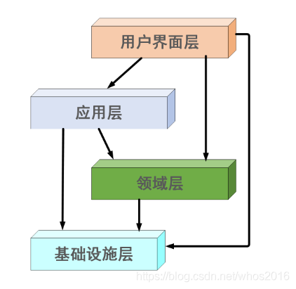
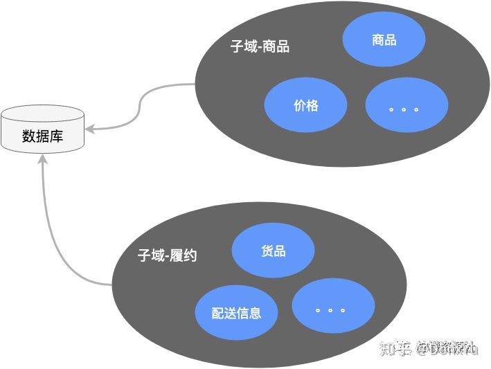
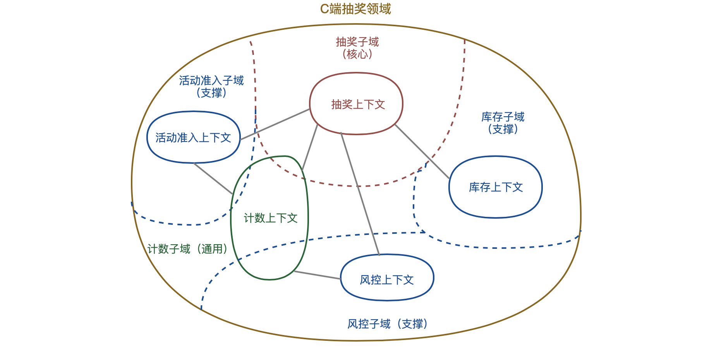
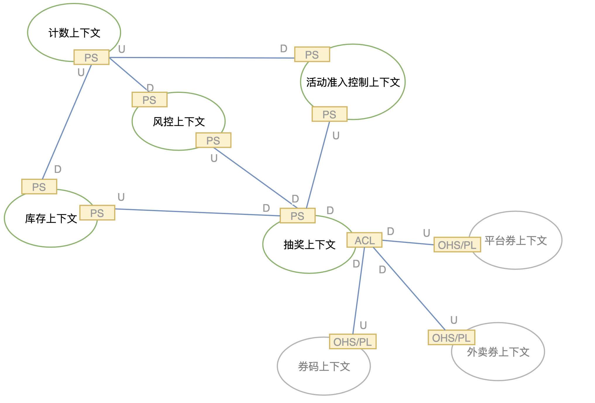
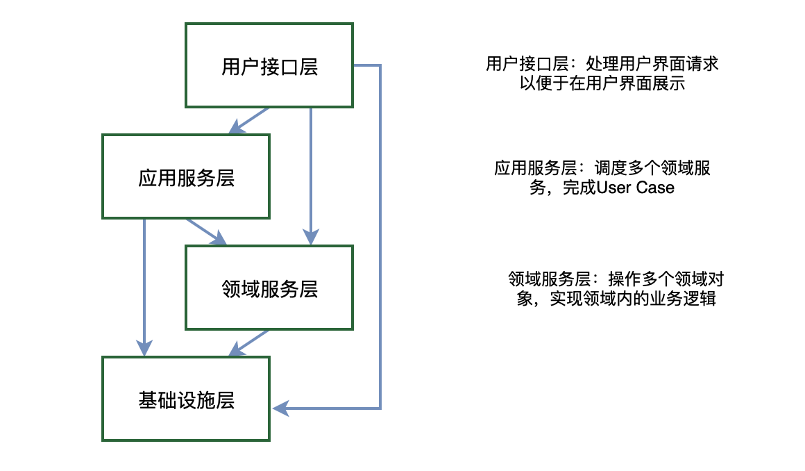
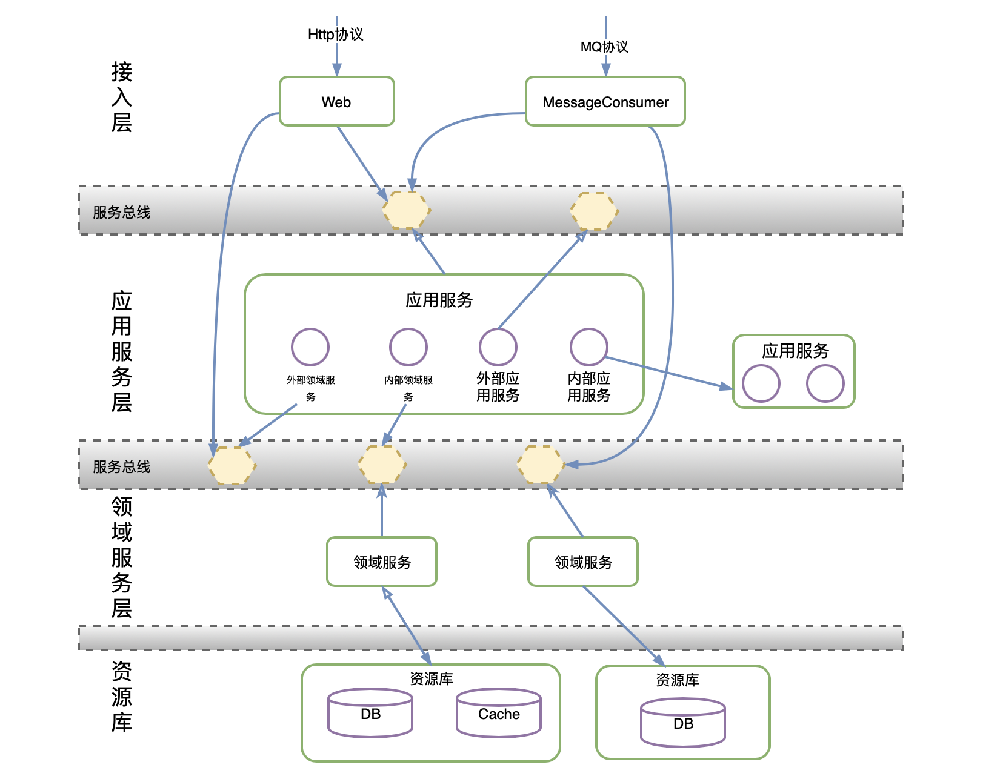

# 领域驱动设计简介

简单介绍下 DDD（Domain-Driven Design，领域驱动设计） 思想，之后课程里会频发使用到这里面的一些概念。

参考

https://tech.meituan.com/2017/12/22/ddd-in-practice.html

https://zhuanlan.zhihu.com/p/91525839


## DDD 介绍

DDD 全程是 Domain-Driven Design，中文叫领域驱动设计，是一套应对复杂软件系统分析和设计的面向对象建模方法论。

以前的系统分析和设计是分开的，导致需求和成品非常容易出现偏差，两者相对独立，还会导致沟通困难，DDD 则打破了这种隔阂，提出了领域模型概念，统一了分析和设计编程，使得软件能够更灵活快速跟随需求变化。

## **DDD分层详解**

### **四层架构图**



在该架构中，上层模块可以调用下层模块，反之不行。即

- `Interface` ——> `application` | `domain` | `infrastructure`
- `application` ——>`domain` | `infrastructure`
- `domain` ——>`infrastructure`

### **分层作用**

| 分层       | 英文                 | 描述                                                         |
| :--------- | :------------------- | :----------------------------------------------------------- |
| 表现层     | User Interface       | 用户界面层，或者表现层，负责向用户显示解释用户命令           |
| 应用层     | Application Layer    | 定义软件要完成的任务，并且指挥协调领域对象进行不同的操作。该层不包含业务领域知识。 |
| 领域层     | Domain Layer         | 或称为模型层，系统的核心，负责表达业务概念，业务状态信息以及业务规则。即包含了该领域（问题域）所有复杂的业务知识抽象和规则定义。该层主要精力要放在领域对象分析上，可以从实体，值对象，聚合（聚合根），领域服务，领域事件，仓储，工厂等方面入手 |
| 基础设施层 | Infrastructure Layer | 主要有2方面内容，一是为领域模型提供持久化机制，当软件需要持久化能力时候才需要进行规划；一是对其他层提供通用的技术支持能力，如消息通信，通用工具，配置等的实现； |

## DDD 的相关术语与基本概念

讨论完宏观概念以后，让我们来认识一下 DDD 的一些概念吧，每个概念我都为你找了一个 Spring 模式开发的映射概念，方便你理解，但要仅仅作为理解用，不要过于依赖。

另外，这里你可能需要结合后面的代码反复结合理解，才能融汇贯通到实际工作中。

### 领域

映射概念：切分的服务。

领域就是范围。范围的重点是边界。领域的核心思想是将问题逐级细分来减低业务和系统的复杂度，这也是 DDD 讨论的核心。

### 子域

映射概念：子服务。

领域可以进一步划分成子领域，即子域。这是处理高度复杂领域的设计思想，它试图分离技术实现的复杂性。这个拆分的里面在很多架构里都有，比如 C4。

### 核心域

映射概念：核心服务。

在领域划分过程中，会不断划分子域，子域按重要程度会被划分成三类：核心域、通用域、支撑域。

决定产品核心竞争力的子域就是核心域，没有太多个性化诉求。

桃树的例子，有根、茎、叶、花、果、种子等六个子域，不同人理解的核心域不同，比如在果园里，核心域就是果是核心域，在公园里，核心域则是花。有时为了核心域的营养供应，还会剪掉通用域和支撑域（茎、叶等）。

### 通用域

映射概念：中间件服务或第三方服务。

被多个子域使用的通用功能就是通用域，没有太多企业特征，比如权限认证。

### 支撑域

映射概念：企业公共服务。

对于功能来讲是必须存在的，但它不对产品核心竞争力产生影响，也不包含通用功能，有企业特征，不具有通用性，比如数据代码类的数字字典系统。

### 统一语言

映射概念：统一概念。

定义上下文的含义。它的价值是可以解决交流障碍，不管你是 RD、PM、QA 等什么角色，让每个团队使用统一的语言（概念）来交流，甚至可读性更好的代码。

通用语言包含属于和用例场景，并且能直接反应在代码中。

可以在事件风暴（开会）中来统一语言，甚至是中英文的映射、业务与代码模型的映射等。可以使用一个表格来记录。

### 限界上下文

映射概念：服务职责划分的边界。

定义上下文的边界。领域模型存在边界之内。对于同一个概念，不同上下文会有不同的理解，比如商品，在销售阶段叫商品，在运输阶段就叫货品。




理论上，限界上下文的边界就是微服务的边界，因此，理解限界上下文在设计中非常重要。

### 聚合

映射概念：包。

聚合概念类似于你理解的包的概念，每个包里包含一类实体或者行为，它有助于分散系统复杂性，也是一种高层次的抽象，可以简化对领域模型的理解。

拆分的实体不能都放在一个服务里，这就涉及到了拆分，那么有拆分就有聚合。聚合是为了保证领域内对象之间的一致性问题。

在定义聚合的时候，应该遵守不变形约束法则：

1. 聚合边界内必须具有哪些信息，如果没有这些信息就不能称为一个有效的聚合；
2. 聚合内的某些对象的状态必须满足某个业务规则：

- 一个聚合只有一个聚合根，聚合根是可以独立存在的，聚合中其他实体或值对象依赖与聚合根。
- 只有聚合根才能被外部访问到，聚合根维护聚合的内部一致性。

### 聚合根

映射概念：包。

一个上下文内可能包含多个聚合，每个聚合都有一个根实体，叫做聚合根，一个聚合只有一个聚合根。

### 实体

映射概念：Domain 或 entity。

《领域驱动设计模式、原理与实践》一书中讲到，实体是具有身份和连贯性的领域概念，可以看出，实体其实也是一种特殊的领域，这里我们需要注意两点：唯一标示（身份）、连续性。两者缺一不可。

你可以想象，文章可以是实体，作者也可以是，因为它们有 id 作为唯一标示。

### 值对象

映射概念：Domain 或 entity。

为了更好地展示领域模型之间的关系，制定的一个对象，本质上也是一种实体，但相对实体而言，它没有状态和身份标识，它存在的目的就是为了表示一个值，通常使用值对象来传达数量的形式来表示。

比如 money，让它具有 id 显然是不合理的，你也不可能通过 id 查询一个 money。

定义值对象要依照具体场景的区分来看，你甚至可以把 Article 中的 Author 当成一个值对象，但一定要清楚，Author 独立存在的时候是实体，或者要拿 Author 做复杂的业务逻辑，那么 Author 也会升级为聚合根。

## 四种模式示例

### 失血模型

Domain Object 只有属性的 getter/setter 方法的纯数据类，所有的业务逻辑完全由 business object 来完成。

```java
public class Article implements Serializable {
    private Integer id;
    private String title;
    private Integer classId;
    private Integer authorId;
    private String authorName;
    private String content;
    private Date pubDate;
    //getter/setter/toString
}

public interface ArticleDao {
     public Article getArticleById(Integer id);
     public Article findAll();
     public void updateArticle(Article article);
}
```

### 贫血模型

简单来说，就是 Domain Object 包含了不依赖于持久化的领域逻辑，而那些依赖持久化的领域逻辑被分离到 Service 层。

```java
public class Article implements Serializable {
    private Integer id;
    private String title;
    private Integer classId;
    private Integer authorId;
    private String authorName;
    private String content;
    private Date pubDate;
    //getter/setter/toString
    //判断是否是热门分类(假设等于57或102的类别的文章就是热门分类的文章)
    public boolean isHotClass(Article article){
        return Stream.of(57,102)
            .anyMatch(classId -> classId.equals(article.getClassId()));
    }
    //更新分类，但未持久化，这里不能依赖Dao去操作实体化
    public Article changeClass(Article article, ArticleClass ac){
        return article.setClassId(ac.getId());
    }
}

@Repository("articleDao")
public class ArticleDaoImpl implements ArticleDao{
    @Resource
    private ArticleDao articleDao;
    public void changeClass(Article article, ArticleClass ac){
        article.changeClass(article, ac);
        articleDao.update(article)
    }
}
```

注意这个模式不在 Domain 层里依赖 DAO。持久化的工作还需要在 DAO 或者 Service 中进行。

这样做的优缺点

优点：各层单向依赖，结构清晰。

缺点：

- Domain Object 的部分比较紧密依赖的持久化 Domain Logic 被分离到 Service 层，显得不够 OO
- Service 层过于厚重

### 充血模型

充血模型和第二种模型差不多，区别在于业务逻辑划分，将绝大多数业务逻辑放到 Domain 中，Service 是很薄的一层，封装少量业务逻辑，并且不和 DAO 打交道：

> Service (事务封装) —> Domain Object <—> DAO

```java
public class Article implements Serializable {
    @Resource
    private static ArticleDao articleDao;
    private Integer id;
    private String title;
    private Integer classId;
    private Integer authorId;
    private String authorName;
    private String content;
    private Date pubDate;
    //getter/setter/toString
    //使用articleDao进行持久化交互
    public List<Article> findAll(){
        return articleDao.findAll();
    }
    //判断是否是热门分类(假设等于57或102的类别的文章就是热门分类的文章)
    public boolean isHotClass(Article article){
        return Stream.of(57,102)
            .anyMatch(classId -> classId.equals(article.getClassId()));
    }
    //更新分类，但未持久化，这里不能依赖Dao去操作实体化
    public Article changeClass(Article article, ArticleClass ac){
        return article.setClassId(ac.getId());
    }
}
```

所有业务逻辑都在 Domain 中，事务管理也在 Item 中实现。这样做的优缺点如下。

优点：

- 更加符合 OO 的原则；
- Service 层很薄，只充当 Facade 的角色，不和 DAO 打交道。

缺点：

- DAO 和 Domain Object 形成了双向依赖，复杂的双向依赖会导致很多潜在的问题。
- 如何划分 Service 层逻辑和 Domain 层逻辑是非常含混的，在实际项目中，由于设计和开发人员的水平差异，可能 导致整个结构的混乱无序。

### 胀血模型

基于充血模型的第三个缺点，有同学提出，干脆取消 Service 层，只剩下 Domain Object 和 DAO 两层，在 Domain Object 的 Domain Logic 上面封装事务。

> Domain Object (事务封装，业务逻辑) <—> DAO

似乎 Ruby on rails 就是这种模型，它甚至把 Domain Object 和 DAO 都合并了。

这样做的优缺点：

- 简化了分层
- 也算符合 OO

该模型缺点：

- 很多不是 Domain Logic 的 Service 逻辑也被强行放入 Domain Object ，引起了 Domain Object 模型的不稳定；
- Domain Object 暴露给 Web 层过多的信息，可能引起意想不到的副作用。


## DDD 工程实现



**限界上下文之间的映射关系**

- 合作关系（Partnership）：两个上下文紧密合作的关系，一荣俱荣，一损俱损。
- 共享内核（Shared Kernel）：两个上下文依赖部分共享的模型。
- 客户方-供应方开发（Customer-Supplier Development）：上下文之间有组织的上下游依赖。
- 遵奉者（Conformist）：下游上下文只能盲目依赖上游上下文。
- 防腐层（Anticorruption Layer）：一个上下文通过一些适配和转换与另一个上下文交互。
- 开放主机服务（Open Host Service）：定义一种协议来让其他上下文来对本上下文进行访问。
- 发布语言（Published Language）：通常与OHS一起使用，用于定义开放主机的协议。
- 大泥球（Big Ball of Mud）：混杂在一起的上下文关系，边界不清晰。
- 另谋他路（SeparateWay）：两个完全没有任何联系的上下文。




由于抽奖，风控，活动准入，库存，计数五个上下文都处在抽奖领域的内部，所以它们之间符合“一荣俱荣，一损俱损”的合作关系（PartnerShip，简称PS）。

同时，抽奖上下文在进行发券动作时，会依赖券码、平台券、外卖券三个上下文。抽奖上下文通过防腐层（Anticorruption Layer，ACL）对三个上下文进行了隔离，而三个券上下文通过开放主机服务（Open Host Service）作为发布语言（Published Language）对抽奖上下文提供访问机制。

**通过上下文映射关系，我们明确的限制了限界上下文的耦合性，即在抽奖平台中，无论是上下文内部交互（合作关系）还是与外部上下文交互（防腐层），耦合度都限定在数据耦合（Data Coupling）的层级。**

### 模块

模块（Module）是DDD中明确提到的一种控制限界上下文的手段，在我们的工程中，一般尽量用一个模块来表示一个领域的限界上下文。

如代码中所示，一般的工程中包的组织方式为{com.公司名.组织架构.业务.上下文.*}，这样的组织结构能够明确的将一个上下文限定在包的内部。

```java
import com.company.team.bussiness.lottery.*;//抽奖上下文
import com.company.team.bussiness.riskcontrol.*;//风控上下文
import com.company.team.bussiness.counter.*;//计数上下文
import com.company.team.bussiness.condition.*;//活动准入上下文
import com.company.team.bussiness.stock.*;//库存上下文
```

代码演示1 模块的组织

对于模块内的组织结构，一般情况下我们是按照领域对象、领域服务、领域资源库、防腐层等组织方式定义的。

```java
import com.company.team.bussiness.lottery.domain.valobj.*;//领域对象-值对象
import com.company.team.bussiness.lottery.domain.entity.*;//领域对象-实体
import com.company.team.bussiness.lottery.domain.aggregate.*;//领域对象-聚合根
import com.company.team.bussiness.lottery.service.*;//领域服务
import com.company.team.bussiness.lottery.repo.*;//领域资源库
import com.company.team.bussiness.lottery.facade.*;//领域防腐层
```

代码演示2 模块的组织

每个模块的具体实现，我们将在下文中展开。

### 领域对象

前文提到，领域驱动要解决的一个重要的问题，就是解决对象的贫血问题。这里我们用之前定义的抽奖（DrawLottery）聚合根和奖池（AwardPool）值对象来具体说明。

抽奖聚合根持有了抽奖活动的id和该活动下的所有可用奖池列表，它的一个最主要的领域功能就是根据一个抽奖发生场景（DrawLotteryContext），选择出一个适配的奖池，即chooseAwardPool方法。

chooseAwardPool的逻辑是这样的：DrawLotteryContext会带有用户抽奖时的场景信息（抽奖得分或抽奖时所在的城市），DrawLottery会根据这个场景信息，匹配一个可以给用户发奖的AwardPool。

```java
package com.company.team.bussiness.lottery.domain.aggregate;
import ...;
  
public class DrawLottery {
    private int lotteryId; //抽奖id
    private List<AwardPool> awardPools; //奖池列表
  
    //getter & setter
    public void setLotteryId(int lotteryId) {
        if(id<=0){
            throw new IllegalArgumentException("非法的抽奖id"); 
        }
        this.lotteryId = lotteryId;
    }
  
    //根据抽奖入参context选择奖池
    public AwardPool chooseAwardPool(DrawLotteryContext context) {
        if(context.getMtCityInfo()!=null) {
            return chooseAwardPoolByCityInfo(awardPools, context.getMtCityInfo());
        } else {
            return chooseAwardPoolByScore(awardPools, context.getGameScore());
        }
    }
     
    //根据抽奖所在城市选择奖池
    private AwardPool chooseAwardPoolByCityInfo(List<AwardPool> awardPools, MtCifyInfo cityInfo) {
        for(AwardPool awardPool: awardPools) {
            if(awardPool.matchedCity(cityInfo.getCityId())) {
                return awardPool;
            }
        }
        return null;
    }
  
    //根据抽奖活动得分选择奖池
    private AwardPool chooseAwardPoolByScore(List<AwardPool> awardPools, int gameScore) {...}
}
```

代码演示3 DrawLottery

在匹配到一个具体的奖池之后，需要确定最后给用户的奖品是什么。这部分的领域功能在AwardPool内。

```java
package com.company.team.bussiness.lottery.domain.valobj;
import ...;
  
public class AwardPool {
    private String cityIds;//奖池支持的城市
    private String scores;//奖池支持的得分
    private int userGroupType;//奖池匹配的用户类型
    private List<Awrad> awards;//奖池中包含的奖品
  
    //当前奖池是否与城市匹配
    public boolean matchedCity(int cityId) {...}
  
    //当前奖池是否与用户得分匹配
    public boolean matchedScore(int score) {...}
  
    //根据概率选择奖池
    public Award randomGetAward() {
        int sumOfProbablity = 0;
        for(Award award: awards) {
            sumOfProbability += award.getAwardProbablity();
        }
        int randomNumber = ThreadLocalRandom.current().nextInt(sumOfProbablity);
        range = 0;
        for(Award award: awards) {
            range += award.getProbablity();
            if(randomNumber<range) {
                return award;
            }
        }
        return null;
    }
}
```

代码演示4 AwardPool

与以往的仅有getter、setter的业务对象不同，领域对象具有了行为，对象更加丰满。同时，比起将这些逻辑写在服务内（例如Service），领域功能的内聚性更强，职责更加明确。

### 资源库

领域对象需要资源存储，存储的手段可以是多样化的，常见的无非是数据库，分布式缓存，本地缓存等。资源库（Repository）的作用，就是对领域的存储和访问进行统一管理的对象。在抽奖平台中，我们是通过如下的方式组织资源库的。

```java
//数据库资源
import com.company.team.bussiness.lottery.repo.dao.AwardPoolDao;//数据库访问对象-奖池
import com.company.team.bussiness.lottery.repo.dao.AwardDao;//数据库访问对象-奖品
import com.company.team.bussiness.lottery.repo.dao.po.AwardPO;//数据库持久化对象-奖品
import com.company.team.bussiness.lottery.repo.dao.po.AwardPoolPO;//数据库持久化对象-奖池
  
import com.company.team.bussiness.lottery.repo.cache.DrawLotteryCacheAccessObj;//分布式缓存访问对象-抽奖缓存访问
import com.company.team.bussiness.lottery.repo.repository.DrawLotteryRepository;//资源库访问对象-抽奖资源库
```

代码演示5 Repository组织结构

资源库对外的整体访问由Repository提供，它聚合了各个资源库的数据信息，同时也承担了资源存储的逻辑（例如缓存更新机制等）。

在抽奖资源库中，我们屏蔽了对底层奖池和奖品的直接访问，而是仅对抽奖的聚合根进行资源管理。代码示例中展示了抽奖资源获取的方法（最常见的Cache Aside Pattern）。

比起以往将资源管理放在服务中的做法，由资源库对资源进行管理，职责更加明确，代码的可读性和可维护性也更强。

```java
package com.company.team.bussiness.lottery.repo;
import ...;
  
@Repository
public class DrawLotteryRepository {
    @Autowired
    private AwardDao awardDao;
    @Autowired
    private AwardPoolDao awardPoolDao;
    @AutoWired
    private DrawLotteryCacheAccessObj drawLotteryCacheAccessObj;
  
    public DrawLottery getDrawLotteryById(int lotteryId) {
        DrawLottery drawLottery = drawLotteryCacheAccessObj.get(lotteryId);
        if(drawLottery!=null){
            return drawLottery;
        }
        drawLottery = getDrawLotteyFromDB(lotteryId);
        drawLotteryCacheAccessObj.add(lotteryId, drawLottery);
        return drawLottery;
    }
  
    private DrawLottery getDrawLotteryFromDB(int lotteryId) {...}
}
```

代码演示6 DrawLotteryRepository

### 防腐层

亦称适配层。在一个上下文中，有时需要对外部上下文进行访问，通常会引入防腐层的概念来对外部上下文的访问进行一次转义。

有以下几种情况会考虑引入防腐层：

- 需要将外部上下文中的模型翻译成本上下文理解的模型。
- 不同上下文之间的团队协作关系，如果是供奉者关系，建议引入防腐层，避免外部上下文变化对本上下文的侵蚀。
- 该访问本上下文使用广泛，为了避免改动影响范围过大。

如果内部多个上下文对外部上下文需要访问，那么可以考虑将其放到通用上下文中。

在抽奖平台中，我们定义了用户城市信息防腐层(UserCityInfoFacade)，用于外部的用户城市信息上下文（微服务架构下表现为用户城市信息服务）。

以用户信息防腐层举例，它以抽奖请求参数(LotteryContext)为入参，以城市信息(MtCityInfo)为输出。

```java
package com.company.team.bussiness.lottery.facade;
import ...;
  
@Component
public class UserCityInfoFacade {
    @Autowired
    private LbsService lbsService;//外部用户城市信息RPC服务
     
    public MtCityInfo getMtCityInfo(LotteryContext context) {
        LbsReq lbsReq = new LbsReq();
        lbsReq.setLat(context.getLat());
        lbsReq.setLng(context.getLng());
        LbsResponse resp = lbsService.getLbsCityInfo(lbsReq);
        return buildMtCifyInfo(resp);
    }
  
    private MtCityInfo buildMtCityInfo(LbsResponse resp) {...}
}
```

代码演示7 UserCityInfoFacade

### 领域服务

上文中，我们将领域行为封装到领域对象中，将资源管理行为封装到资源库中，将外部上下文的交互行为封装到防腐层中。此时，我们再回过头来看领域服务时，能够发现领域服务本身所承载的职责也就更加清晰了，即就是通过串联领域对象、资源库和防腐层等一系列领域内的对象的行为，对其他上下文提供交互的接口。

我们以抽奖服务为例（issueLottery），可以看到在省略了一些防御性逻辑（异常处理，空值判断等）后，领域服务的逻辑已经足够清晰明了。

```java
package com.company.team.bussiness.lottery.service.impl
import ...;
  
@Service
public class LotteryServiceImpl implements LotteryService {
    @Autowired
    private DrawLotteryRepository drawLotteryRepo;
    @Autowired
    private UserCityInfoFacade UserCityInfoFacade;
    @Autowired
    private AwardSendService awardSendService;
    @Autowired
    private AwardCounterFacade awardCounterFacade;
  
    @Override
    public IssueResponse issueLottery(LotteryContext lotteryContext) {
        DrawLottery drawLottery = drawLotteryRepo.getDrawLotteryById(lotteryContext.getLotteryId());//获取抽奖配置聚合根
        awardCounterFacade.incrTryCount(lotteryContext);//增加抽奖计数信息
        AwardPool awardPool = lotteryConfig.chooseAwardPool(bulidDrawLotteryContext(drawLottery, lotteryContext));//选中奖池
        Award award = awardPool.randomChooseAward();//选中奖品
        return buildIssueResponse(awardSendService.sendAward(award, lotteryContext));//发出奖品实体
    }
  
    private IssueResponse buildIssueResponse(AwardSendResponse awardSendResponse) {...}
}
```

代码演示8 LotteryService

### 数据流转


数据流转


在抽奖平台的实践中，我们的数据流转如上图所示。 首先领域的开放服务通过信息传输对象（DTO）来完成与外界的数据交互；在领域内部，我们通过领域对象（DO）作为领域内部的数据和行为载体；在资源库内部，我们沿袭了原有的数据库持久化对象（PO）进行数据库资源的交互。同时，DTO与DO的转换发生在领域服务内，DO与PO的转换发生在资源库内。

与以往的业务服务相比，当前的编码规范可能多造成了一次数据转换，但每种数据对象职责明确，数据流转更加清晰。

### 上下文集成

通常集成上下文的手段有多种，常见的手段包括开放领域服务接口、开放HTTP服务以及消息发布-订阅机制。

在抽奖系统中，我们使用的是开放服务接口进行交互的。最明显的体现是计数上下文，它作为一个通用上下文，对抽奖、风控、活动准入等上下文都提供了访问接口。 同时，如果在一个上下文对另一个上下文进行集成时，若需要一定的隔离和适配，可以引入防腐层的概念。这一部分的示例可以参考前文的防腐层代码示例。

### 分离领域

接下来讲解在实施领域模型的过程中，如何应用到系统架构中。

我们采用的微服务架构风格，与Vernon在《实现领域驱动设计》并不太一致，更具体差异可阅读他的书体会。

如果我们维护一个从前到后的应用系统：

下图中领域服务是使用微服务技术剥离开来，独立部署，对外暴露的只能是服务接口，领域对外暴露的业务逻辑只能依托于领域服务。而在Vernon著作中，并未假定微服务架构风格，因此领域层暴露的除了领域服务外，还有聚合、实体和值对象等。此时的应用服务层是比较简单的，获取来自接口层的请求参数，调度多个领域服务以实现界面层功能。



DDD-分层


随着业务发展，业务系统快速膨胀，我们的系统属于核心时：

应用服务虽然没有领域逻辑，但涉及到了对多个领域服务的编排。当业务规模庞大到一定程度，编排本身就富含了业务逻辑（除此之外，应用服务在稳定性、性能上所做的措施也希望统一起来，而非散落各处），那么此时应用服务对于外部来说是一个领域服务，整体看起来则是一个独立的限界上下文。

此时应用服务对内还属于应用服务，对外已是领域服务的概念，需要将其暴露为微服务。



DDD-系统架构图

注：具体的架构实践可按照团队和业务的实际情况来，此处仅为作者自身的业务实践。除分层架构外，如CQRS架构也是不错的选择

以下是一个示例。我们定义了抽奖、活动准入、风险控制等多个领域服务。在本系统中，我们需要集成多个领域服务，为客户端提供一套功能完备的抽奖应用服务。这个应用服务的组织如下：

```java
package ...;
  
import ...;
  
@Service
public class LotteryApplicationService {
    @Autowired
    private LotteryRiskService riskService;
    @Autowired
    private LotteryConditionService conditionService;
    @Autowired
    private LotteryService lotteryService;
     
    //用户参与抽奖活动
    public Response<PrizeInfo, ErrorData> participateLottery(LotteryContext lotteryContext) {
        //校验用户登录信息
        validateLoginInfo(lotteryContext);
        //校验风控 
        RiskAccessToken riskToken = riskService.accquire(buildRiskReq(lotteryContext));
        ...
        //活动准入检查
        LotteryConditionResult conditionResult = conditionService.checkLotteryCondition(otteryContext.getLotteryId(),lotteryContext.getUserId());
        ...
        //抽奖并返回结果
        IssueResponse issueResponse = lotteryService.issurLottery(lotteryContext);
        if(issueResponse!=null && issueResponse.getCode()==IssueResponse.OK) {
            return buildSuccessResponse(issueResponse.getPrizeInfo());
        } else {   
            return buildErrorResponse(ResponseCode.ISSUE_LOTTERY_FAIL, ResponseMsg.ISSUE_LOTTERY_FAIL)
        }
    }
  
    private void validateLoginInfo(LotteryContext lotteryContext){...}
    private Response<PrizeInfo, ErrorData> buildErrorResponse (int code, String msg){...}
    private Response<PrizeInfo, ErrorData> buildSuccessResponse (PrizeInfo prizeInfo){...}
} 
```

代码演示9 LotteryApplicationService

在本文中，我们采用了分治的思想，从抽象到具体阐述了DDD在互联网真实业务系统中的实践。通过领域驱动设计这个强大的武器，我们将系统解构的更加合理。

但值得注意的是，如果你面临的系统很简单或者做一些SmartUI之类，那么你不一定需要DDD。尽管本文对贫血模型、演进式设计提出了些许看法，但它们在特定范围和具体场景下会更高效。读者需要针对自己的实际情况，做一定取舍，适合自己的才是最好的。

SOLID 原则可参考：

https://segmentfault.com/a/1190000023114300

https://chinese.freecodecamp.org/news/solid-principles/