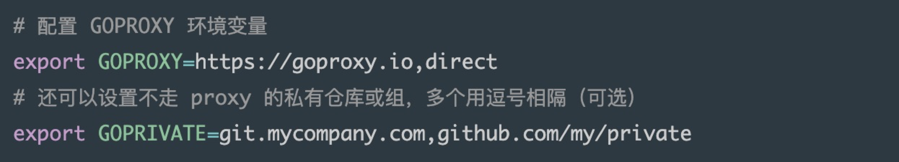
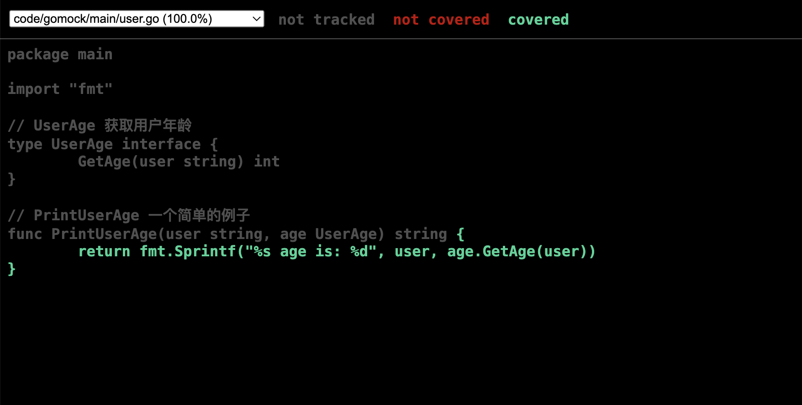

# Go Module & 单元测试

## Go Module

### Checksum

为了解决 Go Modules 的包被篡改安全隐患，Go 开发团队在引入 go.mod 的同时也引入了go.sum 文件，用于记录每个依赖包的哈希值，在构建时，如果本地的依赖包 hash 值与 go.sum 文件中记录得不一致，则会拒绝构建。

- go.sum 文件中每行记录由 module 名、版本和哈希组成，并由空格分开；
- 在引入新的依赖时，通常会使用 go get 命令获取该依赖，将会下载该依赖包下载到本地缓存目录 `$GOPATH/pkg/mod/cache/download`，该依赖包为一个后缀为 .zip 的压缩包，并且把哈希运算同步到 go.sum 文件中；
- 在构建应用时，会从本地缓存中查找所有 go.mod 中记录的依赖包，并计算本地依赖包的哈希值 ，然后与 go.sum 中的记录进行对比，当校验失败，go 命令将拒绝构建。（即如果本地的依赖包与 go.sum 记录的哈希值不一样，说明本地依赖包可能被篡改了。）

### Proxy



GOPRIVATE 用来控制 go 命令把哪些仓库看做是私有的仓库，这样的话，就可以跳过 proxy server 和校验检查，这个变量的值支持用逗号分隔，可以填写多个值，例如：

```shell
export GOPRIVATE=*.corp.example.com,rsc.io/private
```

这样 go 命令会把所有包含这个后缀的软件包，包括 git.corp.example.com/xyzzy , rsc.io/private, 和 rsc.io/private/quux 都以私有仓库来对待。

若所有需要配置的私有仓库都存在于一个组织下，如 github 下的组织 org_name，则直接填写组织名即可：

```shell
export GOPRIVATE=github.com/org_name
```

当配置 GOPRIVATE ，**它的值同时也将作为 GONOPROXY 和 GONOSUMDB 的默认值，所以当配置 GOPRIVATE 后将会跳过代理，以及 checksum 效验检查**。

通常推荐配置 GOPROXY 和 GOPRIVATE 进行使用，GOPRIVATE 也可以识别 Git SSH KEY 进行权限效验。

可参考 goproxy 官方文档：[GOPRIVATE 环境变量](https://goproxy.io/zh/docs/GOPRIVATE-env.html) [GOSUMDB 环境变量](https://goproxy.io/zh/docs/GOSUMDB-env.html) 。


## 单元测试

### 简单例子

Go 语言推荐测试文件和源代码文件放在一块，测试文件以 `_test.go` 结尾。比如，当前 package 有 `calc.go` 一个文件，我们想测试 `calc.go` 中的 `Add` 和 `Mul` 函数，那么应该新建 `calc_test.go` 作为测试文件。

```go
example/
   |--calc.go
   |--calc_test.go
```

假如 `calc.go` 的代码如下：

```go
package main

func Add(a int, b int) int {
    return a + b
}

func Mul(a int, b int) int {
    return a * b
}
```

那么 `calc_test.go` 中的测试用例可以这么写：

```go
package main

import "testing"

func TestAdd(t *testing.T) {
	if ans := Add(1, 2); ans != 3 {
		t.Errorf("1 + 2 expected be 3, but %d got", ans)
	}

	if ans := Add(-10, -20); ans != -30 {
		t.Errorf("-10 + -20 expected be -30, but %d got", ans)
	}
}
```

- 测试用例名称一般命名为 `Test` 加上待测试的方法名。
- 测试用的参数有且只有一个，在这里是 `t *testing.T`。
- 基准测试(benchmark)的参数是 `*testing.B`，TestMain 的参数是 `*testing.M` 类型。

运行 `go test`，该 package 下所有的测试用例都会被执行。

```shell
$ go test
ok      example 0.009s
```

或 `go test -v`，`-v` 参数会显示每个用例的测试结果，另外 `-cover` 参数可以查看覆盖率。

```shell
$ go test -v
=== RUN   TestAdd
--- PASS: TestAdd (0.00s)
=== RUN   TestMul
--- PASS: TestMul (0.00s)
PASS
ok      example 0.007s
```

如果只想运行其中的一个用例，例如 `TestAdd`，可以用 `-run` 参数指定，该参数支持通配符 `*`，和部分正则表达式，例如 `^`、`$`。

```shell
$ go test -run TestAdd -v
=== RUN   TestAdd
--- PASS: TestAdd (0.00s)
PASS
ok      example 0.007s
```

### 子测试（Subtests）

对于多个子测试的场景，更推荐如下的写法(table-driven tests)：

```go
//  calc_test.go
func TestMul(t *testing.T) {
	cases := []struct {
		Name           string
		A, B, Expected int
	}{
		{"pos", 2, 3, 6},
		{"neg", 2, -3, -6},
		{"zero", 2, 0, 0},
	}

	for _, c := range cases {
		t.Run(c.Name, func(t *testing.T) {
			if ans := Mul(c.A, c.B); ans != c.Expected {
				t.Fatalf("%d * %d expected %d, but %d got",
					c.A, c.B, c.Expected, ans)
			}
		})
	}
}
```

### 帮助函数(helpers)

Go 语言在 1.9 版本中引入了 `t.Helper()`，用于标注该函数是帮助函数，报错时将输出帮助函数调用者的信息，而不是帮助函数的内部信息。

```go
// calc_test.go
package main

import "testing"

type calcCase struct{ A, B, Expected int }

// 帮助函数
func createMulTestCase(t *testing.T, c *calcCase) {
  // 调用 Helper 函数
	t.Helper()
	if ans := Mul(c.A, c.B); ans != c.Expected {
		t.Fatalf("%d * %d expected %d, but %d got",
			c.A, c.B, c.Expected, ans)
	}

}

func TestMul(t *testing.T) {
	createMulTestCase(t, &calcCase{2, 3, 6})
	createMulTestCase(t, &calcCase{2, -3, -6})
	createMulTestCase(t, &calcCase{2, 0, 1}) // wrong case
}
```

运行 `go test`，报错信息如下，可以非常清晰地知道，错误发生在第 20 行。

```shell
$ go test
--- FAIL: TestMul (0.00s)
    calc_test.go:20: 2 * 0 expected 1, but 0 got
FAIL
exit status 1
FAIL    example 0.006s
```

关于 `helper` 函数的 2 个建议：

- 不要返回错误， 帮助函数内部直接使用 `t.Error` 或 `t.Fatal` 即可，在用例主逻辑中不会因为太多的错误处理代码，影响可读性。
- 调用 `t.Helper()` 让报错信息更准确，有助于定位。

### setup 和 teardown

```go
func setup() {
	fmt.Println("Before all tests")
}

func teardown() {
	fmt.Println("After all tests")
}

func Test1(t *testing.T) {
	fmt.Println("I'm test1")
}

func Test2(t *testing.T) {
	fmt.Println("I'm test2")
}

func TestMain(m *testing.M) {
	setup()
	code := m.Run()
	teardown()
	os.Exit(code)
}
```

- 在这个测试文件中，包含有2个测试用例，`Test1` 和 `Test2`。
- **如果测试文件中包含函数 `TestMain`，那么生成的测试将调用 TestMain(m)，而不是直接运行测试。**
- 调用 `m.Run()` 触发所有测试用例的执行，并使用 `os.Exit()` 处理返回的状态码，如果不为0，说明有用例失败。
- 因此可以在调用 `m.Run()` 前后做一些额外的准备(setup)和回收(teardown)工作。

执行 `go test`，将会输出

```shell
$ go test
Before all tests
I'm test1
I'm test2
PASS
After all tests
ok      example 0.006s
```

### 网络测试(Network)

针对 http 开发的场景，使用标准库 `net/http/httptest` 进行测试更为高效。

```go
// test code
import (
	"io/ioutil"
	"net/http"
	"net/http/httptest"
	"testing"
)

func TestConn(t *testing.T) {
	req := httptest.NewRequest("GET", "http://example.com/foo", nil)
	w := httptest.NewRecorder()
	helloHandler(w, req)
	bytes, _ := ioutil.ReadAll(w.Result().Body)

	if string(bytes) != "hello world" {
		t.Fatal("expected hello world, but got", string(bytes))
	}
}
```

### Benchmark 基准测试

基准测试用例的定义如下：

```go
func BenchmarkName(b *testing.B){
    // ...
}
```

- 函数名必须以 `Benchmark` 开头，后面一般跟待测试的函数名
- 参数为 `b *testing.B`。
- 执行基准测试时，需要添加 `-bench` 参数。

例如：

```go
func BenchmarkHello(b *testing.B) {
    for i := 0; i < b.N; i++ {
        fmt.Sprintf("hello")
    }
}
$ go test -benchmem -bench .
...
BenchmarkHello-16   15991854   71.6 ns/op   5 B/op   1 allocs/op
...
```

基准测试报告每一列值对应的含义如下：

```go
type BenchmarkResult struct {
    N         int           // 迭代次数
    T         time.Duration // 基准测试花费的时间
    Bytes     int64         // 一次迭代处理的字节数
    MemAllocs uint64        // 总的分配内存的次数
    MemBytes  uint64        // 总的分配内存的字节数
}
```

如果在运行前基准测试需要一些耗时的配置，则可以使用 `b.ResetTimer()` 先重置定时器，例如：

```go
func BenchmarkHello(b *testing.B) {
    ... // 耗时操作
    b.ResetTimer()
    for i := 0; i < b.N; i++ {
        fmt.Sprintf("hello")
    }
}
```

使用 `RunParallel` 测试并发性能

```go
func BenchmarkParallel(b *testing.B) {
	templ := template.Must(template.New("test").Parse("Hello, {{.}}!"))
	b.RunParallel(func(pb *testing.PB) {
		var buf bytes.Buffer
		for pb.Next() {
			// 所有 goroutine 一起，循环一共执行 b.N 次
			buf.Reset()
			templ.Execute(&buf, "World")
		}
	})
}
$ go test -benchmem -bench .
...
BenchmarkParallel-16   3325430     375 ns/op   272 B/op   8 allocs/op
...
```

### testfiy

上面的一些例子都是都是自己判断结果是否正确，但我们也可以使用断言的方法来判断。`testify` 包含了 断言、mock、suite 三个功能。

`testify/assert` 提供了非常多的方法，所有的方法可以访问 https://godoc.org/github.com/stretchr/testify/assert 查看。

```go
// 判断两个值是否相等
func Equal(t TestingT, expected, actual interface{}, msgAndArgs ...interface{}) bool
// 判断两个值不相等
func NotEqual(t TestingT, expected, actual interface{}, msgAndArgs ...interface{}) bool
// 测试失败，测试中断
func FailNow(t TestingT, failureMessage string, msgAndArgs ...interface{}) bool
// 判断值是否为nil，常用于 error 的判断
func Nil(t TestingT, object interface{}, msgAndArgs ...interface{}) bool
// 判断值是否不为nil，常用于 error 的判断
func NotNil(t TestingT, object interface{}, msgAndArgs ...interface{}) bool
```

断言方法都会返回一个 `bool` 值，我们可以通过这个返回值判断断言成功/失败，从而做一些处理。

一个例子：

```go
func TestInt_assert_fail(t *testing.T) {
	got := Int(1, 2)
	assert.Equal(t, 1, got)
}
```

执行结果, 可以看到输出十分的清晰：

```shell
=== RUN   TestInt_assert_fail
--- FAIL: TestInt_assert_fail (0.00s)
    max_test.go:62:
                Error Trace:    max_test.go:62
                Error:          Not equal:
                                expected: 1
                                actual  : 2
                Test:           TestInt_assert_fail
FAIL
FAIL    code/max        0.017s
```


## Go Mock

[gomock](https://github.com/golang/mock) 是官方提供的 mock 框架，同时还提供了 mockgen 工具用来辅助生成测试代码。

### 例子

一个例子， user.go：

```go
package main

import "fmt"

// UserAge 获取用户年龄
type UserAge interface {
	GetAge(user string) int
}

// PrintUserAge 一个简单的例子
func PrintUserAge(user string, age UserAge) string {
	return fmt.Sprintf("%s age is: %d", user, age.GetAge(user))
}
```

运行命令：`mockgen -source=user.go -destination=user_mock.go -package=main` 生成 user_mock.go ：

```go
// Code generated by MockGen. DO NOT EDIT.
// Source: user.go

// Package main is a generated GoMock package.
package main

import (
	reflect "reflect"

	gomock "github.com/golang/mock/gomock"
)

// MockUserAge is a mock of UserAge interface.
type MockUserAge struct {
	ctrl     *gomock.Controller
	recorder *MockUserAgeMockRecorder
}

// MockUserAgeMockRecorder is the mock recorder for MockUserAge.
type MockUserAgeMockRecorder struct {
	mock *MockUserAge
}

// NewMockUserAge creates a new mock instance.
func NewMockUserAge(ctrl *gomock.Controller) *MockUserAge {
	mock := &MockUserAge{ctrl: ctrl}
	mock.recorder = &MockUserAgeMockRecorder{mock}
	return mock
}

// EXPECT returns an object that allows the caller to indicate expected use.
func (m *MockUserAge) EXPECT() *MockUserAgeMockRecorder {
	return m.recorder
}

// GetAge mocks base method.
func (m *MockUserAge) GetAge(user string) int {
	m.ctrl.T.Helper()
	ret := m.ctrl.Call(m, "GetAge", user)
	ret0, _ := ret[0].(int)
	return ret0
}

// GetAge indicates an expected call of GetAge.
func (mr *MockUserAgeMockRecorder) GetAge(user interface{}) *gomock.Call {
	mr.mock.ctrl.T.Helper()
	return mr.mock.ctrl.RecordCallWithMethodType(mr.mock, "GetAge", reflect.TypeOf((*MockUserAge)(nil).GetAge), user)
}
```

编写测试用例 user_test.go：

```go
package main

import (
	"github.com/golang/mock/gomock"
	"github.com/stretchr/testify/assert"
	"testing"
)

func TestSimple(t *testing.T) {
	// 新建一个mock对象
	ctrl := gomock.NewController(t)
	age := NewMockUserAge(ctrl)

	// mock 返回值
	age.EXPECT().GetAge(gomock.Any()).Return(1).AnyTimes()

	assert.Equal(t, "a age is: 1", PrintUserAge("a", age))
}
```

测试用例代码解释：

- `gomock.NewController`：返回 `gomock.Controller`，它代表 mock 生态系统中的顶级控件。定义了 mock 对象的范围、生命周期和期待值。另外它在多个 goroutine 中是安全的。
- `NewMockUserAge`：创建一个新的 mock 实例。
- `age.EXPECT().GetAge(gomock.Any()).Return(1).AnyTimes()` ：意思是对 `GetAge` 方法传入任何参数( `gomock.Any()` )都会返回 1，任意次执行结果都一样。
- `assert.Equal(t, "a age is: 1", PrintUserAge("a", age))`：将 mock 对象 `age` 和任意一个用户 "a" 传入到 `PrintUserAge` 函数，断言返回的值是否相同。

运行测试命令，测试覆盖率：

```shell
go test . -cover -v
=== RUN   TestPrintUserAge
--- PASS: TestPrintUserAge (0.00s)
PASS
coverage: 100.0% of statements
ok      code/gomock/main        0.006s  coverage: 100.0% of statements
```

可通过设置 `-cover` 标志符来开启覆盖率的统计，展示内容为 `coverage: 100.0%`。

#### 可视化界面

1、 生成测试覆盖率的 profile 文件。

```shell
go test ./... -coverprofile=cover.out
```

2、 利用 profile 文件生成可视化界面。

```shell
go tool cover -html=cover.out
```

生成如下页面：




更复杂的项目单元测试可参考 [项目 “单元测试”](https://lailin.xyz/post/go-training-week4-unit-test.html#%E9%A1%B9%E7%9B%AE-%E2%80%9C%E5%8D%95%E5%85%83%E6%B5%8B%E8%AF%95%E2%80%9D)。


## 参考

1. [Go工程化(八) 单元测试](https://lailin.xyz/post/go-training-week4-unit-test.html)
2. [Go Test 单元测试简明教程](https://geektutu.com/post/quick-go-test.html)
3. [使用 Gomock 进行单元测试](https://segmentfault.com/a/1190000017132133)


## 更多工程化文章

- [Go工程化(九) 项目重构实践](https://lailin.xyz/post/go-training-week4-practice.html)
- [Go 工程化(十) 如何在整洁架构中使用事务?](https://lailin.xyz/post/clean-arch-transaction.html)
- [Go 工程化(十一) 如何优雅的写出 repo 层代码](https://lailin.xyz/post/graceful-repo-code.html)

