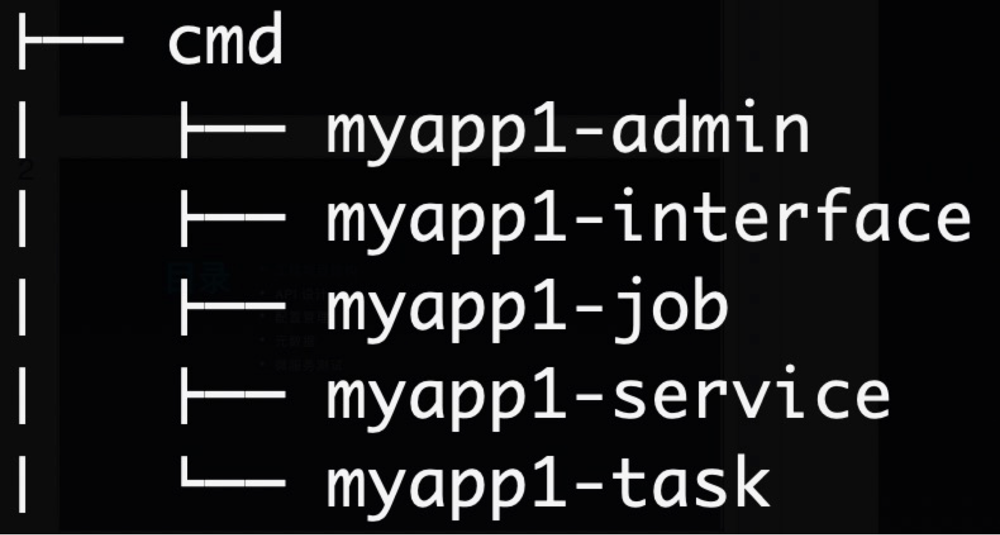
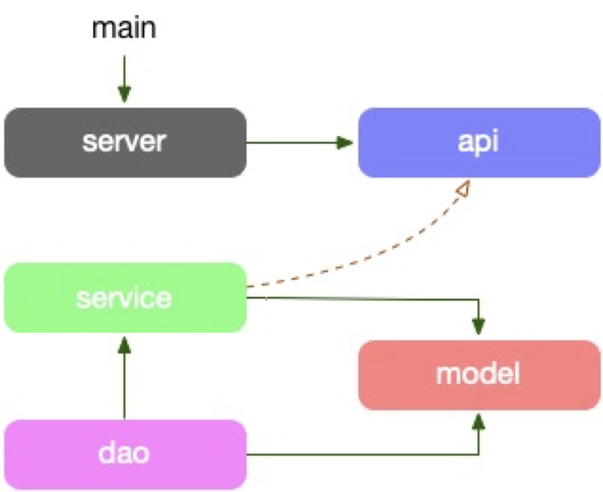
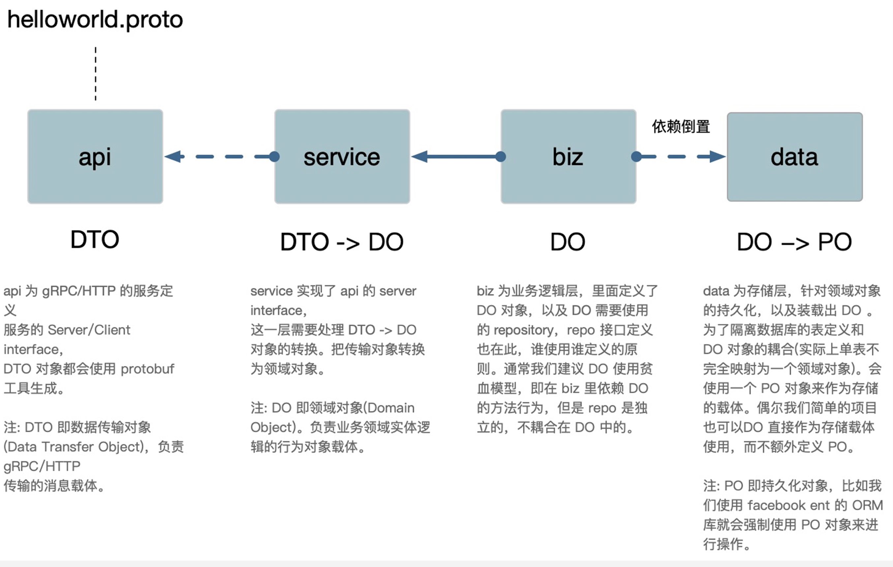
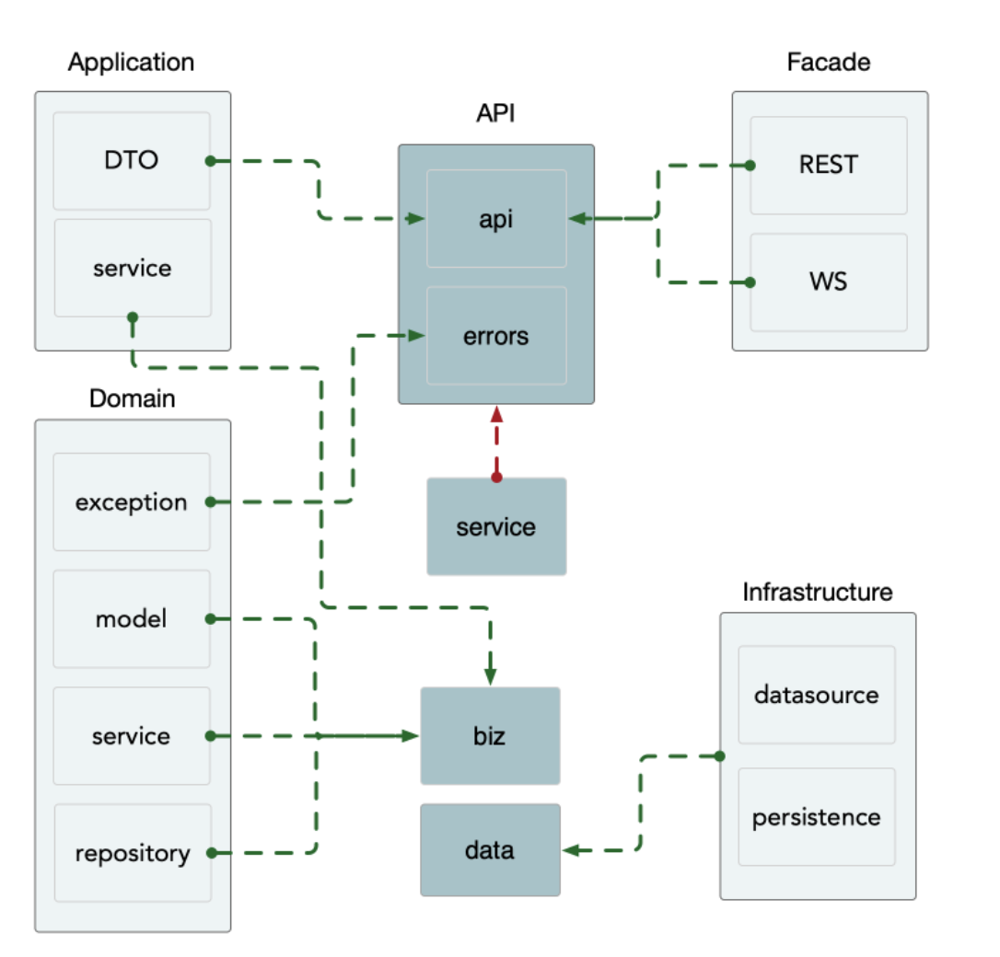
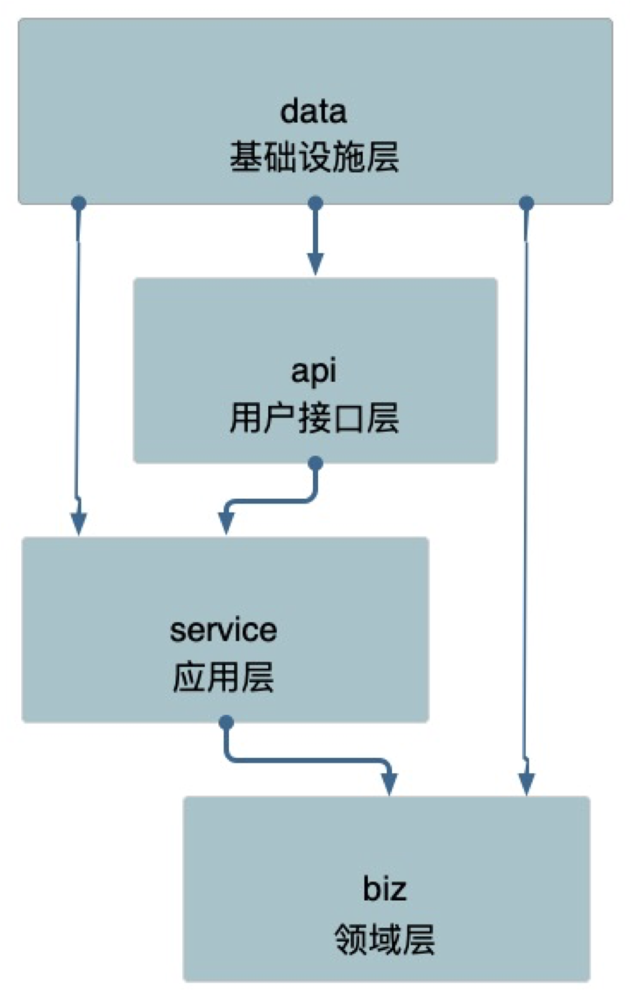

# 工程项目架构

## 项目目录结构

### 标准的 Go 项目结构

#### /cmd 

一般采用 `/cmd/appname/main.go` 的形式进行组织。

- 首先 cmd 目录下一般是项目的主干目录。
- 这个目录下的文件**不应该有太多的代码，不应该包含业务逻辑**。

#### /internal

internal 目录下的包，**不允许被其他项目导入**，这是在 Go 1.4 当中引入的 feature，会在编译时执行。

- 所以我们一般会把项目文件夹放置到 internal 当中，例如 `/internal/app`。
- 如果是**可以被其他项目导入的包我们一般会放到 /pkg 目录下**。
- 如果是我们项目内部进行共享的包，而不期望外部共享，我们可以放到 `/internal/pkg` 当中。
- 注意 internal 目录的限制并不局限于顶级目录，在任何目录当中都是生效的。

#### /pkg

一般而言，我们在 pkg 目录下放置**可以被外部程序安全导入的包**，对于不应该被外部程序依赖的包我们应该放置到 `internal` 目录下， `internal` 目录会有编译器进行强制验证。

- pkg 目录下的包一般会按照功能进行区分，例如 `/pkg/cache` 、 `/pkg/conf` 等。
- 如果你的目录结构比较简单，内容也比较少，其实也可以不使用 `pkg` 目录，直接把上面的这些包放在最上层即可。
- 一般而言我们应用程序 app 在最外层会包含很多文件，例如 `.gitlab-ci.yml` `makefile` `.gitignore` 等等，这种时候顶层目录会很多并且会有点杂乱，建议还是放到 `/pkg` 目录比较好。

可参考文章 [I'll take pkg over internal](https://travisjeffery.com/b/2019/11/i-ll-take-pkg-over-internal/)

#### Kit Project Layout

kit 库其实也就是一些基础库。

- 每一个公司正常来说应该**有且仅有一个基础库项目**。
- kit 库一般会包含一些常用的公共的方法，例如缓存，配置等等，比较典型的例子就是 [go-kit](https://github.com/go-kit/kit)。
- kit 库必须具有的特点：
  - 统一
  - 标准库方式布局
  - 高度抽象
  - 支持插件
  - 尽量减少依赖
  - 持续维护

### 服务目录结构

#### /api

API 协议定义目录，主要存放 `app_api.proto` protobuf 文件，以及生成的 go 文件。我们通常把 api 文档直接在 proto 文件中描述。

#### /configs

配置文件模板或默认配置。

#### /test

额外的外部测试应用程序和测试数据。你可以随时根据需求构造 /test 目录。对于较大的项目，有一个数据子目录是有意义的。例如，你可以使用 /test/data 或 /test/testdata (如果你需要忽略目录中的内容)。请注意，Go 还会忽略以“.”或“_”开头的目录或文件，因此在如何命名测试数据目录方面有更大的灵活性。

### 服务类型

微服务中的 app 服务类型分为 4 类：interface、service、job、admin。

- interface: 对外的 BFF 服务，接受来自用户的请求，比如暴露了 HTTP/gRPC 接口。
- service: 对内的微服务，仅接受来自内部其他服务或者网关的请求，比如暴露了 gRPC 接口只对内服务。
- admin：区别于 service，更多是面向运营测的服务，通常数据权限更高，隔离带来更好的代码级别安全。
- job: 流式任务处理的服务，上游一般依赖 message broker。
- task: 定时任务，类似 cronjob，部署到 task 托管平台中。



cmd 应用目录负责程序的: 启动、关闭、配置初始化等。

### 服务布局

#### 项目 v1 布局



项目的依赖路径为: model -> dao -> service -> api，model struct 串联各个层，直到 api 需要做 DTO 对象转换。

- model: 放对应“存储层”的结构体，是对存储的一一隐射。
- dao: 数据读写层，数据库和缓存全部在这层统一处理，包括 cache miss 处理。
- service: 组合各种数据访问来构建业务逻辑。
- server: 依赖 proto 定义的服务作为入参，提供快捷的启动服务全局方法。
- api: 定义了 API proto 文件，和生成的 stub 代码，它生成的 interface，其实现者在 service 中。
- service 的方法签名因为实现了 API 的 接口定义，DTO 直接在业务逻辑层直接使用了，更有 dao 直接使用，最简化代码。
- DO(Domain Object): 领域对象，就是从现实世界中抽象出来的有形或无形的业务实体。缺乏 DTO -> DO 的对象转换。
- DTO(Data Transfer Object)：数据传输对象，这个概念来源于J2EE 的设计模式。但在这里，泛指用于展示层/API 层与服务层(业务逻辑层)之间的数据传输对象。其实就是 api proto 文件里定义的 message，或者 api 接口的参数结构体。

##### v1 存在的问题

- 没有 DTO 对象，model 中的对象贯穿全局，所有层都有。
  - model 层的数据不是每个接口都需要的，这个时候会有一些问题。

#### 项目 v2 布局

```
  .
├── Dockerfile  
├── LICENSE
├── Makefile  
├── README.md
├── api // 下面维护了微服务使用的proto文件以及根据它们所生成的go文件
│   └── helloworld
│       └── v1
│           ├── error_reason.pb.go
│           ├── error_reason.proto
│           ├── error_reason.swagger.json
│           ├── greeter.pb.go
│           ├── greeter.proto
│           ├── greeter.swagger.json
│           ├── greeter_grpc.pb.go
│           └── greeter_http.pb.go
├── cmd  // 整个项目启动的入口文件
│   └── server
│       ├── main.go
│       ├── wire.go  // 我们使用wire来维护依赖注入
│       └── wire_gen.go
├── configs  // 这里通常维护一些本地调试用的样例配置文件
│   └── config.yaml
├── generate.go
├── go.mod
├── go.sum
├── internal  // 该服务所有不对外暴露的代码，通常的业务逻辑都在这下面，使用internal避免错误引用
│   ├── biz   // 业务逻辑的组装层，类似 DDD 的 domain 层，data 类似 DDD 的 repo，而 repo 接口在这里定义，使用依赖倒置的原则。
│   │   ├── README.md
│   │   ├── biz.go
│   │   └── greeter.go
│   ├── conf  // 内部使用的config的结构定义，使用proto格式生成
│   │   ├── conf.pb.go
│   │   └── conf.proto
│   ├── data  // 业务数据访问，包含 cache、db 等封装，实现了 biz 的 repo 接口。我们可能会把 data 与 dao 混淆在一起，data 偏重业务的含义，它所要做的是将领域对象重新拿出来，我们去掉了 DDD 的 infra层。
│   │   ├── README.md
│   │   ├── data.go
│   │   └── greeter.go
│   ├── server  // http和grpc实例的创建和配置
│   │   ├── grpc.go
│   │   ├── http.go
│   │   └── server.go
│   └── service  // 实现了 api 定义的服务层，类似 DDD 的 application 层，处理 DTO 到 biz 领域实体的转换(DTO -> DO)，同时协同各类 biz 交互，但是不应处理复杂逻辑
│       ├── README.md
│       ├── greeter.go
│       └── service.go
└── third_party  // api 依赖的第三方proto
    ├── README.md
    ├── google
    │   └── api
    │       ├── annotations.proto
    │       ├── http.proto
    │       └── httpbody.proto
    └── validate
        ├── README.md
        └── validate.proto
```


app 目录下有 api、cmd、configs、internal 目录，目录里一般还会放置 README、CHANGELOG、OWNERS。

internal: 是为了避免有同业务下有人跨目录引用了内部的 biz、data、service 等内部 struct。

- biz: 业务逻辑的组装层，类似 DDD 的 domain 层，data 类似 DDD 的 repo，repo 接口在这里定义，使用**依赖倒置**的原则。
- data: 业务数据访问，包含 cache、db 等封装，实现了 biz 的 repo 接口。我们可能会把 data 与 dao 混淆在一起，data 偏重业务的含义，它所要做的是将领域对象重新拿出来，我们去掉了 DDD 的 infra 层。
- service: 实现了 api 定义的服务层，类似 DDD 的 application 层，处理 DTO 到 biz 领域实体的转换 (DTO -> DO) ，同时协同各类 biz 交互，但是不应处理复杂逻辑。
- server: 为http和grpc实例的创建和配置，以及注册对应的 service 。

示例可以参考 [kratos v2 的 blog example](https://github.com/go-kratos/examples/tree/main/blog)

##### v2 布局流程图



共有如下层：

- api ：grpc/http 的服务接口定义，数据对象是 DTO，即 protobuf 定义的 message 结构体。
- service：实现了 api 层的服务接口定义。需要将 DTO 对象转化为 DO 即领域对象。
- biz：定义了 DO 和存储接口。一般使用贫血模型。
- data：存储层，会有 DO 到 PO 的转换，以及实现 biz 层定义的接口。

PO (Persistent Object) : 持久化对象，它跟持久层（通常是关系型数据库）的数据结构形成一一对应的映射关系，如果持久层是关系型数据库，那么数据表中的每个字段（或若干个）就对应 PO 的一个（或若干个）属性。可以使用 [ent](https://github.com/facebook/ent) 来做数据映射。

##### 四种模型

- 失血模型

  模型仅仅包含数据的定义和 getter/setter 方法，业务逻辑和应用逻辑都放到服务层中。这种类在 Java 中叫 POJO，在 .NET 中叫 POCO。

- 贫血模型

  贫血模型中**包含了一些业务逻辑，但不包含依赖持久层的业务逻辑**。这部分依赖于持久层的业务逻辑将会放到服务层中。可以看出，贫血模型中的领域对象是不依赖于持久层的。

- 充血模型

  充血模型中包含了所有的业务逻辑，包括依赖于持久层的业务逻辑。所以，使用充血模型的领域层是依赖于持久层，简单表示就是 UI层->服务层->领域层<->持久层。

- 胀血模型

  胀血模型就是把和业务逻辑不想关的其他应用逻辑（如授权、事务等）都放到领域模型中。我感觉胀血模型反而是另外一种的失血模型，因为服务层消失了，领域层干了服务层的事，到头来还是什么都没变。

### kratos 项目架构

参考 [kratos 文档架构图](https://go-kratos.dev/docs/intro/layout/) ：



我们根据 [kratos v2 的 blog example](https://github.com/go-kratos/examples/tree/main/blog) 这个项目来一步步分析这个架构图的含义。

#### api 层

blog/api/blog/v1/blog.proto：

```protobuf
service BlogService {
    rpc CreateArticle (CreateArticleRequest) returns (CreateArticleReply) {
        option (google.api.http) = {
            post: "/v1/article/"
            body: "*"
        };
    }
    rpc UpdateArticle (UpdateArticleRequest) returns (UpdateArticleReply) {
        option (google.api.http) = {
            put: "/v1/article/{id}"
            body: "*"
        };
    }
    rpc DeleteArticle (DeleteArticleRequest) returns (DeleteArticleReply) {
        option (google.api.http) = {
            delete: "/v1/article/{id}"
        };
    }
    rpc GetArticle (GetArticleRequest) returns (GetArticleReply) {
        option (google.api.http) = {
            get: "/v1/article/{id}"
        };
    }
    rpc ListArticle (ListArticleRequest) returns (ListArticleReply) {
        option (google.api.http) = {
            get: "/v1/article/"
        };
    }
}

// DTO
message Article {
    int64 id = 1;
    string title = 2;
    string content = 3;
    int64 like = 4;
}

message CreateArticleRequest {
    string title = 1 [(validate.rules).string = {min_len: 5, max_len: 50}]; // the title of string must be between 5 and 50 character
    string content = 2;
}

message CreateArticleReply {
    Article Article = 1;
}
...
```

api 层主要是一些服务接口定义，以及 DTO 对象的定义。这一层对应的就是 DDD 里防腐层和应用层的 DTO 对象定义。

#### biz 层

blog/internal/biz/article.go

```go
// DO
type Article struct {
	ID        int64
	Title     string
	Content   string
	CreatedAt time.Time
	UpdatedAt time.Time
	Like      int64
}

type ArticleRepo interface {
	// db
	ListArticle(ctx context.Context) ([]*Article, error)
	GetArticle(ctx context.Context, id int64) (*Article, error)
	CreateArticle(ctx context.Context, article *Article) error
	UpdateArticle(ctx context.Context, id int64, article *Article) error
	DeleteArticle(ctx context.Context, id int64) error

	// redis
	GetArticleLike(ctx context.Context, id int64) (rv int64, err error)
	IncArticleLike(ctx context.Context, id int64) error
}

type ArticleUsecase struct {
	repo ArticleRepo
}

func NewArticleUsecase(repo ArticleRepo, logger log.Logger) *ArticleUsecase {
	return &ArticleUsecase{repo: repo}
}

func (uc *ArticleUsecase) List(ctx context.Context) (ps []*Article, err error) {
	ps, err = uc.repo.ListArticle(ctx)
	if err != nil {
		return
	}
	return
}

func (uc *ArticleUsecase) Get(ctx context.Context, id int64) (p *Article, err error) {
	p, err = uc.repo.GetArticle(ctx, id)
	if err != nil {
		return
	}
	err = uc.repo.IncArticleLike(ctx, id)
	if err != nil {
		return
	}
	p.Like, err = uc.repo.GetArticleLike(ctx, id)
	if err != nil {
		return
	}
	return
}
...
```

biz 是业务逻辑的组装层，可以看做是 DDD 的领域层，包含了各种领域对象的定义及操作。

示例代码里定义了 DO 对象 Article、repository 接口 ArticleRepo、usecase ArticleUsecase。其中 ArticleRepo 接口会在 data 层被实现。而 ArticleUsecase 对象更像是对 DO 对象的一个操作封装对象，包含了对 Article 对象的增删改查。后面的 service 层会使用 ArticleUsecase 对象，而不是 Article 对象。

因此 biz 层对应的是 DDD domain 层的 model（DO 定义）、service（DO 的操作）、repository（DO 的存储接口定义）。而图中 DDD 应用层的 service 应该是各种 DO 对象的业务编排，指挥协调领域对象进行不同的操作，我理解应该不是对应的 biz 层，而是 kratos 的 service 层，不知道对不对。

#### service 层

实现了 api 定义的服务层，处理 DTO 到 biz 领域实体的转换（DTO -> DO），同时协同各类 biz 交互。

blog/internal/service/article.go：

```go
func NewBlogService(article *biz.ArticleUsecase, logger log.Logger) *BlogService {
	return &BlogService{
		article: article,
		log:     log.NewHelper(logger),
	}
}

func (s *BlogService) CreateArticle(ctx context.Context, req *pb.CreateArticleRequest) (*pb.CreateArticleReply, error) {
	s.log.Infof("input data %v", req)
	err := s.article.Create(ctx, &biz.Article{
		Title:   req.Title,
		Content: req.Content,
	})
	return &pb.CreateArticleReply{}, err
}

func (s *BlogService) UpdateArticle(ctx context.Context, req *pb.UpdateArticleRequest) (*pb.UpdateArticleReply, error) {
	s.log.Infof("input data %v", req)
	err := s.article.Update(ctx, req.Id, &biz.Article{
		Title:   req.Title,
		Content: req.Content,
	})
	return &pb.UpdateArticleReply{}, err
}
...
```

这一层就是使用 biz 层的 ArticleUsecase 来实现 api 层定义的接口。也就是使用 biz 定义的各种领域对象进行业务编排，更类似于 DDD 应用层的 service。

#### data 层

业务数据访问，包含 cache、db 等封装，实现了 biz 的 repo 接口。data 偏重业务的含义，它所要做的是将领域对象重新拿出来。

blog/internal/data/article.go：

```go
type articleRepo struct {
	data *Data
	log  *log.Helper
}

// Data .
type Data struct {
	db  *ent.Client
	rdb *redis.Client
}

// NewArticleRepo .
func NewArticleRepo(data *Data, logger log.Logger) biz.ArticleRepo  {
	return &articleRepo{
		data: data,
		log:  log.NewHelper(logger),
	}
}

func (ar *articleRepo) ListArticle(ctx context.Context) ([]*biz.Article, error) {
	ps, err := ar.data.db.Article.Query().All(ctx)
	if err != nil {
		return nil, err
	}
	rv := make([]*biz.Article, 0)
  // 这个 p 即 PO，ent 定义的 Article 对象，和数据表字段一致
	for _, p := range ps {
		rv = append(rv, &biz.Article{
			ID:        p.ID,
			Title:     p.Title,
			Content:   p.Content,
			CreatedAt: p.CreatedAt,
			UpdatedAt: p.UpdatedAt,
		})
	}
	return rv, nil
}
...
```

blog/internal/data/ent/article.go：

```go
// Article is the model entity for the Article schema.
type Article struct {
	config `json:"-"`
	// ID of the ent.
	ID int64 `json:"id,omitempty"`
	// Title holds the value of the "title" field.
	Title string `json:"title,omitempty"`
	// Content holds the value of the "content" field.
	Content string `json:"content,omitempty"`
	// CreatedAt holds the value of the "created_at" field.
	CreatedAt time.Time `json:"created_at,omitempty"`
	// UpdatedAt holds the value of the "updated_at" field.
	UpdatedAt time.Time `json:"updated_at,omitempty"`
	// Edges holds the relations/edges for other nodes in the graph.
	// The values are being populated by the ArticleQuery when eager-loading is set.
	Edges ArticleEdges `json:"edges"`
}

```

data 层就是实现了 biz 层定义的 repository 接口 ArticleRepo 里的各种方法。可以看到这个示例代码里，就是进行一个将 ent 生成的 Article 对象（即 PO ）转化成 biz 的 Article 对象（即 DO ）的操作。

#### 小结

DDD 的继承分层架构（Layering Through Inheritance）：高层继承并实现低层接口。从图中可以看出 biz 层是最底层，不依赖于任何层，而其它层都会某种程度的依赖于它，和上面代码分析是一样的。

注意：继承分层架构依然是单向依赖，这也意味着领域层、应用层、表现层将不能依赖基础设施层，相反基础设施层可以依赖它们。



## 依赖注入

**依赖注入**就是将实例变量传入到一个对象中去(Dependency injection means giving an object its instance variables)。

比如以下例子：

```java
public class Human {
    ...
    Father father;
    ...
    public Human() {
        father = new Father();
    }
}
```

仔细看这段代码我们会发现存在一些问题：

1. 如果现在要改变 father 生成方式，如需要用new Father(String name)初始化 father，需要修改 Human 代码；
2. 如果想测试不同 Father 对象对 Human 的影响很困难，因为 father 的初始化被写死在了 Human 的构造函数中；
3. 如果new Father()过程非常缓慢，单测时我们希望用已经初始化好的 father 对象 Mock 掉这个过程也很困难。

依赖注入方式：

上面将依赖在构造函数中直接初始化是一种 Hard init 方式，弊端在于两个类不够独立，不方便测试。我们还有另外一种 Init 方式，如下：

```cpp
public class Human {
    ...
    Father father;
    ...
    public Human(Father father) {
        this.father = father;
    }
}
```

上面代码中，我们将 father 对象作为构造函数的一个参数传入。在调用 Human 的构造方法之前外部就已经初始化好了 Father 对象。像这种非自己主动初始化依赖，而通过外部来传入依赖的方式，我们就称为依赖注入。
 现在我们发现上面 1 中存在的两个问题都很好解决了，简单的说依赖注入主要有两个好处：

1. 解耦，将依赖之间解耦。
2. 因为已经解耦，所以方便做单元测试，尤其是 Mock 测试。

更多详细内容参考 [控制反转（IoC）与依赖注入（DI）](https://www.jianshu.com/p/07af9dbbbc4b) 。

### wire

Wire 等依赖注入工具旨在简化初始化代码的管理，可以帮助完成为整个依赖关系图生成初始化代码的繁琐工作。其实就是帮助我们把一些有依赖关系的模块的初始化工作给做了。

在 kratos 框架里使用了 [wire](https://github.com/google/wire) 来做依赖注入。Wire可以生成 Go 源码并在编译期完成依赖注入。 它不需要反射机制或 [Service Locators](https://en.wikipedia.org/wiki/Service_locator_pattern) 。而 Uber 的 [dig](https://github.com/uber-go/dig) 、来自Facebook 的 [inject](https://github.com/facebookgo/inject) 都是通过反射机制实现了运行时依赖注入。

使用 wire 的好处：

1. 方便debug，若有依赖缺失编译时会报错
2. 因为不需要 Service Locators， 所以对命名没有特殊要求
3. 避免依赖膨胀。 生成的代码只包含被依赖的代码，而运行时依赖注入则无法作到这一点
4. 依赖关系静态存于源码之中， 便于工具分析与可视化

#### Provider

了解一下 wire 当中的两个概念：provider 和 injector。

Provider 是一个普通的函数，这个函数会返回构建依赖关系所需的组件。如下所示，就是一个 provider 函数，在实际使用的时候，往往是一些简单的工厂函数，这个函数不会太复杂。

```go
// NewPostRepo 创建文章 Repo
func NewPostRepo() IPostRepo {}
```

不过需要注意的是**在 wire 中不能存在两个 provider 返回相同的组件类型**。

#### Injector

injector 也是一个普通函数，我们常常在 `wire.go` 文件中定义 injector 函数签名，然后通过 `wire` 命令自动生成一个完整的函数

```go
//+build wireinject

func GetBlogService() *Blog {
    panic(wire.Build(NewBlogService, NewPostUsecase, NewPostRepo))
}

```

第一行的 `//+build wireinject` 注释确保了这个文件在我们正常编译的时候不会被引用，而 `wire .` 生成的文件 `wire_gen.go` 会包含 `//+build !wireinject` 注释，正常编译的时候，不指定 tag 的情况下会引用这个文件。

`wire.Build` 在 `injector` 函数中使用，用于表名这个 `injector` 由哪些 `provider` 提供依赖， `injector` 函数本身只是一个函数签名。

更详细内容参考 

[Go 每日一库之 wire](https://zhuanlan.zhihu.com/p/110453784) （通俗易懂）

[一文读懂Wire](https://medium.com/@dche423/master-wire-cn-d57de86caa1b)

### Kratos blog example

在上面看过的代码示例中，用到 wire 的地方：

#### Provider

```go
// NewArticleRepo .
func NewArticleRepo(data *Data, logger log.Logger) biz.ArticleRepo {
	return &articleRepo{
		data: data,
		log:  log.NewHelper(logger),
	}
}

func NewArticleUsecase(repo ArticleRepo, logger log.Logger) *ArticleUsecase {
	return &ArticleUsecase{repo: repo}
}

func NewBlogService(article *biz.ArticleUsecase, logger log.Logger) *BlogService {
	return &BlogService{
		article: article,
		log:     log.NewHelper(logger),
	}
}
```

这里列出了 3 个 provider，依赖顺序是：service -> usecase -> repo，因此如果我们要手动写初始化代码时，就需要按照先初始化 repo，再初始化 usecase，最后初始化 service 的顺序来。

#### ProviderSet

blog/internal/biz/biz.go

```go
// ProviderSet is biz providers.
var ProviderSet = wire.NewSet(NewArticleUsecase)
```

#### Injector 签名

blog/cmd/blog/wire.go

```go
//go:build wireinject
// +build wireinject

// The build tag makes sure the stub is not built in the final build.

package main

import (
	"github.com/go-kratos/examples/blog/internal/biz"
	"github.com/go-kratos/examples/blog/internal/conf"
	"github.com/go-kratos/examples/blog/internal/data"
	"github.com/go-kratos/examples/blog/internal/server"
	"github.com/go-kratos/examples/blog/internal/service"
	"github.com/go-kratos/kratos/v2"
	"github.com/go-kratos/kratos/v2/log"
	"github.com/google/wire"
)

// initApp init kratos application.
func initApp(*conf.Server, *conf.Data, log.Logger) (*kratos.App, func(), error) {
	panic(wire.Build(server.ProviderSet, data.ProviderSet, biz.ProviderSet, service.ProviderSet, newApp))
}
```

注意这里 wire.Build 里的顺序如果改成下面这样：

```go
wire.Build(data.ProviderSet, service.ProviderSet, biz.ProviderSet, server.ProviderSet, newApp)
```

即和依赖的顺序不一致，使用 `wire .` 生成的 `wire_gen.go` 文件也是和下面一样的，因此我们不需要去管理模块依赖的顺序，wire 会帮我们做好。

#### wire 生成的 Injector 函数

blog/cmd/blog/wire_gen.go

```go
// Code generated by Wire. DO NOT EDIT.

//go:generate go run github.com/google/wire/cmd/wire
//go:build !wireinject
// +build !wireinject

package main

import (
	"github.com/go-kratos/examples/blog/internal/biz"
	"github.com/go-kratos/examples/blog/internal/conf"
	"github.com/go-kratos/examples/blog/internal/data"
	"github.com/go-kratos/examples/blog/internal/server"
	"github.com/go-kratos/examples/blog/internal/service"
	"github.com/go-kratos/kratos/v2"
	"github.com/go-kratos/kratos/v2/log"
)

// Injectors from wire.go:

// initApp init kratos application.
func initApp(confServer *conf.Server, confData *conf.Data, logger log.Logger) (*kratos.App, func(), error) {
	dataData, cleanup, err := data.NewData(confData, logger)
	if err != nil {
		return nil, nil, err
	}
	articleRepo := data.NewArticleRepo(dataData, logger)
	articleUsecase := biz.NewArticleUsecase(articleRepo, logger)
	blogService := service.NewBlogService(articleUsecase, logger)
	httpServer := server.NewHTTPServer(confServer, logger, blogService)
	grpcServer := server.NewGRPCServer(confServer, logger, blogService)
	app := newApp(logger, httpServer, grpcServer)
	return app, func() {
		cleanup()
	}, nil
}
```

wire 会按照模块依赖顺序，生成初始化各个模块正确顺序的代码。


## 参考文献

1. [Go工程化(二) 项目目录结构](https://lailin.xyz/post/go-training-week4-project-layout.html)
1. [Go工程化(三) 依赖注入框架 wire](https://lailin.xyz/post/go-training-week4-wire.html#Provider)
1. [Go 进阶训练营-极客时间](https://u.geekbang.org/subject/go?utm_source=lailin.xyz&utm_medium=lailin.xyz)
2. [golang-standards/project-layout · GitHub](https://github.com/golang-standards/project-layout/blob/master/README_zh.md)
3. [Package Oriented Design](https://www.ardanlabs.com/blog/2017/02/package-oriented-design.html)
4. [Go 1.4 Release Notes - The Go Programming Language](https://golang.org/doc/go1.4#internalpackages)
5. [I’ll take pkg over internal](https://travisjeffery.com/b/2019/11/i-ll-take-pkg-over-internal/)
6. https://medium.com/@benbjohnson/standard-package-layout-7cdbc8391fc1