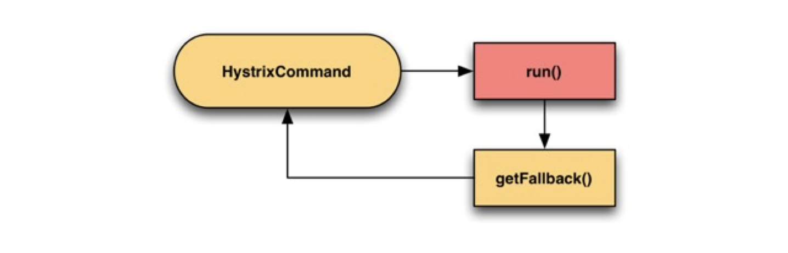
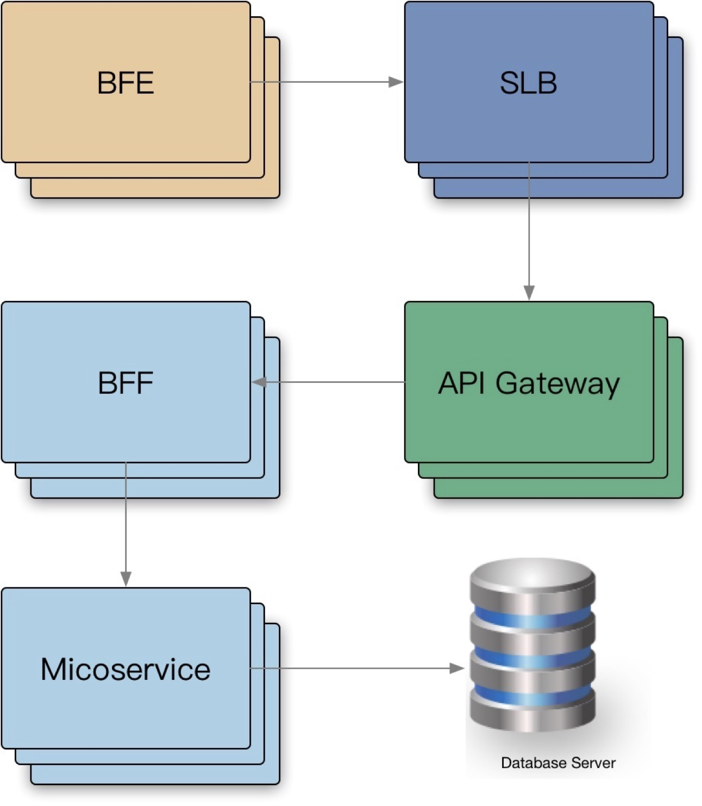

# 降级&重试

## 降级

通过降级回复来减少工作量，或者丢弃不重要的请求。而且需要了解哪些流量可以降级，并且有能力区分不同的请求。我们通常提供降低回复的质量来答复减少所需的计算量或者时间。通常在 BFF 层或者客户端页面做一些降级操作。

自动降级通常需要考虑几个点：

- 优雅降级不应该被经常触发 - 通常触发条件现实了容量规划的失误，或者是意外的负载。
- 演练，代码平时不会触发和使用，需要定期针对一小部分的流量进行演练，保证模式的正常。
- 应该足够简单。

### 降级实现

降级本质为: 提供有损服务。主要有以下实现方式：

- UI 模块化，非核心模块降级。
- BFF 层聚合 API，模块降级。
- 页面上一次缓存副本。
- 默认值、热门推荐等。
- 流量拦截 + 定期数据缓存(过期副本策略)。

#### 处理策略

- 页面降级、延迟服务、写/读降级、缓存降级。
- 抛异常、返回约定协议、Mock 数据、Fallback 处理。

在 hystrix 框架里，有一个正常的 run() 函数，如果调用失败会调用 fallback() 来返回降级数据：

### Case Study

- 客户端解析协议失败，app 崩溃。（设置降级数据比如 nil、零值时需要跟客户端沟通好，避免出现客户端不认的字段导致出现异常或者是白屏。）

- local cache 数据源缓存，发版失效 + 依赖接口故障，引起的白屏。（local cache 可能会失效，这时可以再存一份到 redis 中进行备份。）
- 没有 playbook，导致的 MTTR 上升。（要有操作手册，SOP 即 Standard Operating Procedure，标准操作程序，减少故障发生时所需要的恢复的时间，即 MTTR。MTBF：平均无故障时间，即预测系统在下一次故障发生之前可以运行多长时间。）

## 重试

当请求返回错误（例: 配额不足、超时、内部错误等），对于 backend 部分节点过载的情况下，倾向于立刻重试，但是需要留意重试带来的流量放大:

- 限制重试次数和基于重试分布的策略（重试比率: 10%，比如最多放大 1.1 倍的请求）。
- 随机化、指数型递增的重试周期: exponential ackoff + jitter。
- client 测记录重试次数直方图，传递到 server，进行分布判定，交由 server 判定拒绝。
- **只应该在失败的这层进行重试**，当重试仍然失败，全局约定错误码“过载，无须重试”，避免级联重试。

级联重试的意思是比如上图中的微服务调用 db 失败，重试三次，BFF 调用微服务也失败也重试三次，这样一层一层叠加，最后重试的次数越来越多。这个时候可以在全局定义一个状态码，比如 503，微服务调用 db 失败就会返回 503，BFF 或者其它层收到 503 了就会直接放行，不会再重试，只要出现这个 code 我们就知道下游已经尝试过重试了，我们就不要再重试了。最后返回给客户端一个其他的错误码。这样就避免了级联重试。

#### Case Study

- Nginx upstream retry 过大，导致服务雪崩。

- 业务不幂等，导致的重试，数据重复（一般读操作才会重试，写操作不重试）。

  幂等实现：

  - 全局唯一 ID：根据业务生成一个全局唯一 ID，在调用接口时会传入该 ID，接口提供方会从相应的存储系统比如 redis 中去检索这个全局 ID 是否存在，如果存在则说明该操作已经执行过了，将拒绝本次服务请求；否则将相应该服务请求并将全局 ID 存入存储系统中，之后包含相同业务 ID 参数的请求将被拒绝。
  - 去重表：这种方法适用于在业务中有唯一标识的插入场景。比如在支付场景中，一个订单只会支付一次，可以建立一张去重表,将订单 ID 作为唯一索引。把支付并且写入支付单据到去重表放入一个事务中了，这样当出现重复支付时，数据库就会抛出唯一约束异常，操作就会回滚。这样保证了订单只会被支付一次。
  - 多版本并发控制：适合对更新请求作幂等性控制。比如要更新商品的名字，这时就可以在更新的接口中增加一个版本号来做幂等性控制。

- 多层级重试传递，放大流量引起雪崩。