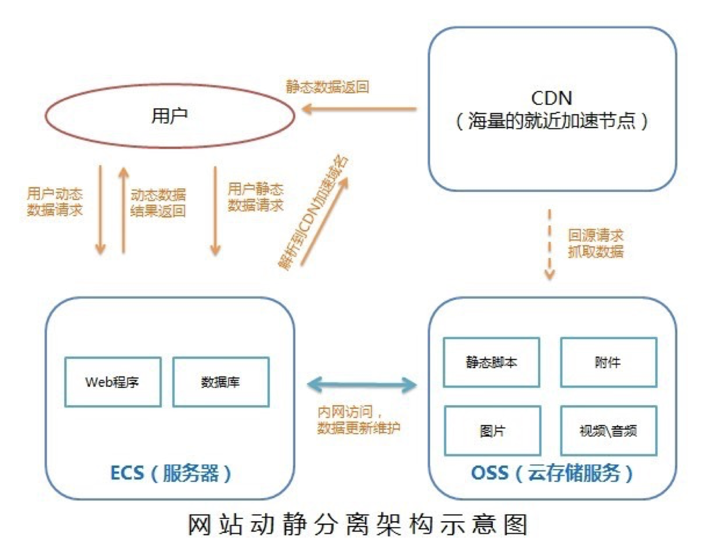
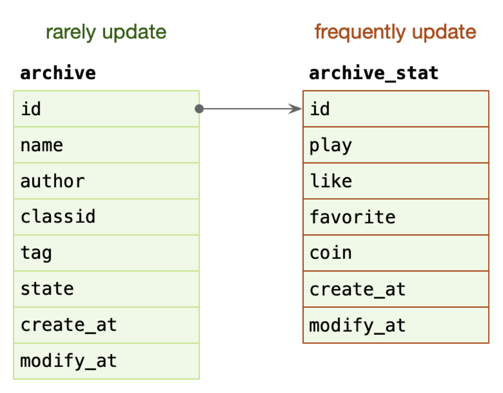
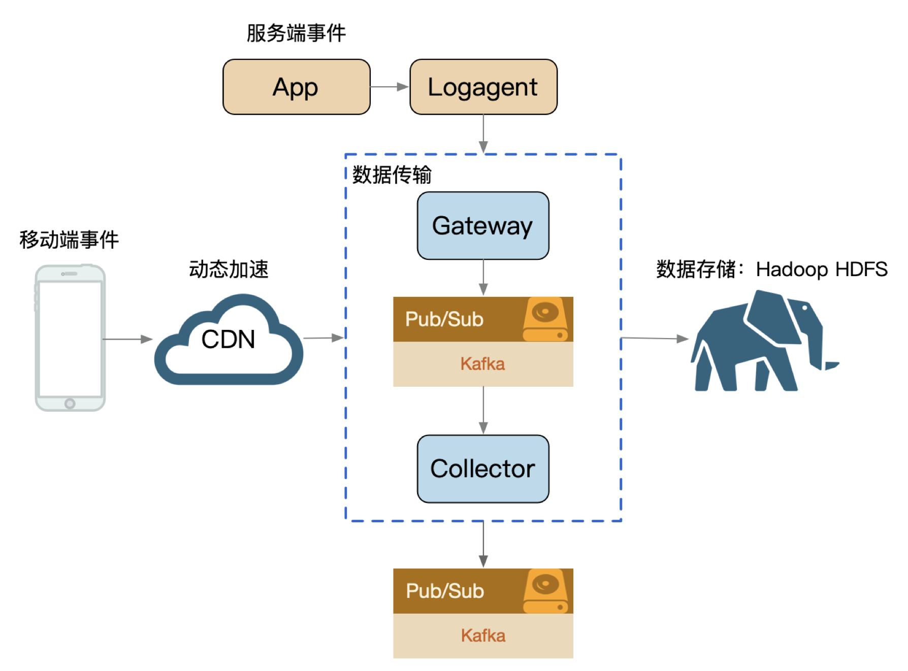
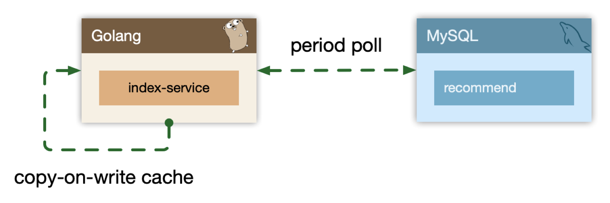
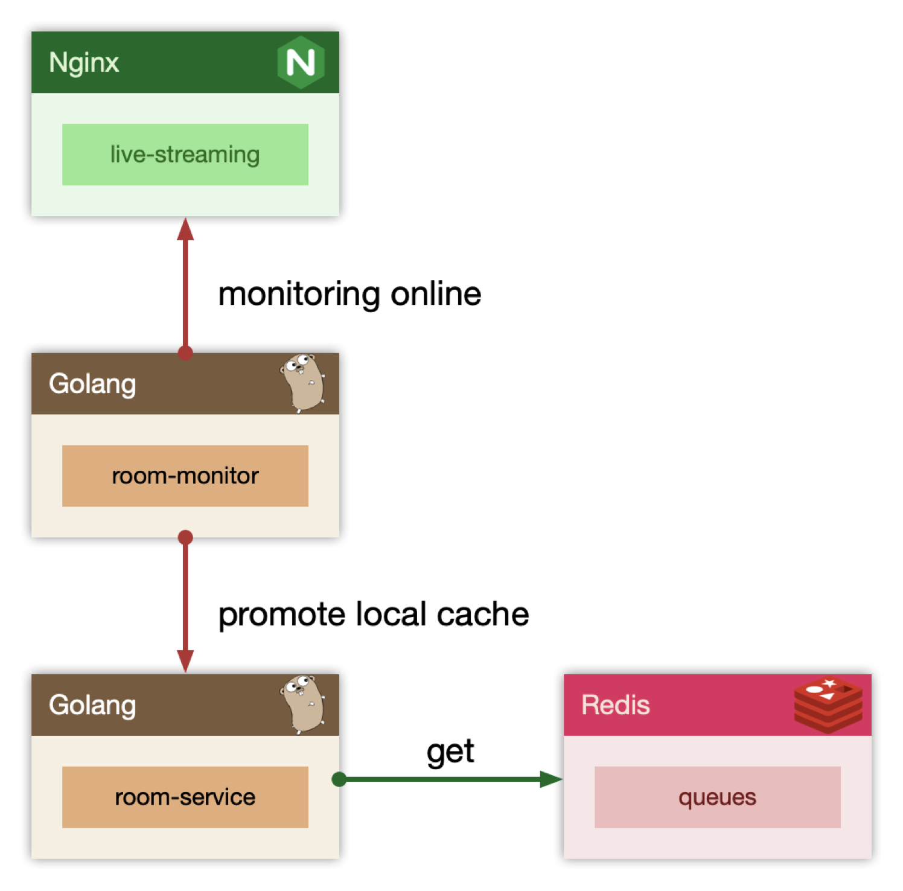
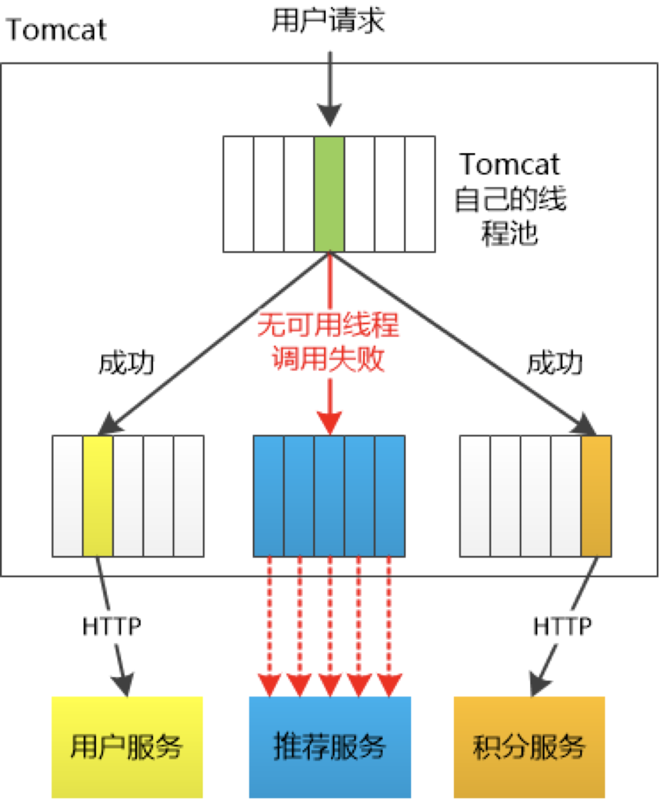

# 隔离

隔离，本质上是对系统或资源进行分割，从而实现当系统发生故障时能限定传播范围和影响范围，即发生故障后只有出问题的服务不可用，保证其他服务仍然可用。

- 服务隔离
  - 动静分离、读写分离
- 轻重隔离
  - 核心、快慢、热点
- 物理隔离
  - 线程、进程、集群、机房

## 服务隔离

### 动静隔离

小到 CPU 的 cacheline [false sharing](https://www.cnblogs.com/cyfonly/p/5800758.html)、数据库 mysql 表设计中避免 bufferpool 频繁过期，隔离动静表，大到架构设计中的图片、静态资源等缓存加速。本质上都体现的一样的思路，即加速/缓存访问变换频次小的。

静态资源与动态 API 进行隔离。静态 API 使用 CDN 加速。

另外，对于 mysql 表设计来说，可以将一些修改频次高的数据和频次低的数据分成两张表来存储。比如一张稿件表，存储稿件的一些基本信息，再分出一张稿件统计表，存储稿件的点赞、播放、投币、收藏等信息，如下图所示：

这两张表通过 id 做关联，archive 表是主表，archive_stat 表是统计表（可以通过订阅其他服务比如点赞服务的数据库的 binlog 来更新数据）。这样做是因为 mysql 有一个 BufferPool 的缓存，用于缓存 DataPage，DataPage 可以理解为缓存了表的行。那么如果**频繁更新 DataPage， DataPage 就会不断从磁盘置换，会发生命中率下降的问题**。所以我们把这两个表分开设计，主表就能利用 BufferPool 的缓存进行更快的访问，不至于被频繁更新的统计数据拖慢查询速度。

### 读写隔离

主从（主数据库进行修改，从数据库查询数据）、Replicaset（多副本）、CQRS（查询和修改分成两个服务去做）、分库分表。

## 轻重隔离

### 核心隔离

业务按照 Level 进行资源池划分（L0/L1/L2）。对核心和非核心业务进行资源的划分，核心业务的机器性能更好、副本更多。

- ​	核心/非核心的故障域的差异隔离（机器资源、依赖资源）。
- ​	多集群，通过冗余资源来提升吞吐和容灾能力

### 快慢隔离

比如有一个日志传输系统，所有日志信息同时会有多个消费者来消费，比如 HDFS、ES 等等，它们消费的都是同一个 kafka topic（为了更好的顺序 io，如果 topic 太多可能会变成随机 io）。但这样做的坏处就是不同的消费者有消费的差速，如果某个 consumer 消费得太慢，就会导致 kafka 的消息堆积，全局数据就会整体反压。

我们可以按照各种纬度隔离：sink、部门、业务、logid、重要性（S/A/B/C）。比如不同部门可以使用不同的 topic 或者 kafka 进行隔离。或者多个 consumer 使用 kafka offset 来进行区分，不同的消费者根据位置来获取不同的消息即可。

### 热点隔离

热点即经常访问的数据。很多时候我们希望统计某个热点数据中访问频次最高的 Top K 数据，并对其访问进行缓存。比如：

- 小表广播: 从 remotecache 提升为 localcache，app 定时更新，甚至可以让运营平台支持广播刷新 localcache。比如将 mysql 中的热点数据定时 load 到内存里，使用 COW 方式的缓存来进行存储。

  > 写时复制指的是，写操作时候复制全量老数据到一个新的对象中，携带上本次新写的数据，之后利用原子替换（atomic.Value），更新调用者的变量。来完成无锁访问共享数据。atomic.Value 内部使用 CAS 的指令来做，性能很高。 

  

  

- 主动预热: 比如直播房间页高在线情况下使用旁路监控主动防御，当在线人数超过某个阈值时就广播给服务，让服务主动将数据 load 到本地缓存。

## 物理隔离

### 线程隔离

主要通过线程池进行隔离，也是实现服务隔离的基础。把业务进行分类并交给不同的线程池进行处理，当某个线程池处理一种业务请求发生问题时，不会讲故障扩散和影响到其他线程池，保证服务可用。

不过对于 Go 来说，一般不用过多考虑。所有 IO 都是 Nonblocking，且托管给了 Runtime，只会阻塞 Goroutine，不阻塞 M，我们只需要考虑 Goroutine 总量的控制，不需要线程模型语言的线程隔离。

### 进程隔离

现在一般使用容器化服务，跑在 k8s 上这就是一种进程级别的隔离。

### 集群隔离

多集群方案，即逻辑上是一个应用，物理上部署多套应用，通过 cluster 区分。或者异地部署。

## Case Study

- 早期转码集群被超大视频攻击，导致转码大量延迟（可以根据视频大小进行机器分类，超大视频只会阻塞大视频转码的一些机器）。
- 缩略图服务，被大图实时缩略吃完所有 CPU，导致正常的小图缩略被丢弃，大量503（同上）。
- 数据库实例 [cgroup](https://tech.meituan.com/2015/03/31/cgroups.html) 未隔离，导致大 SQL 引起的集体故障（多个数据库在一台机器上运行，一个数据库的故障会引起所有数据库的集体故障。可以将数据库分别部署在不同机器上）。
- INFO 日志量过大，导致异常 ERROR 日志采集延迟（将不同类型的日志分在不同的 topic 里，这样 error 日志不会因为 info 日志的消息堆积而迟迟收不到）。