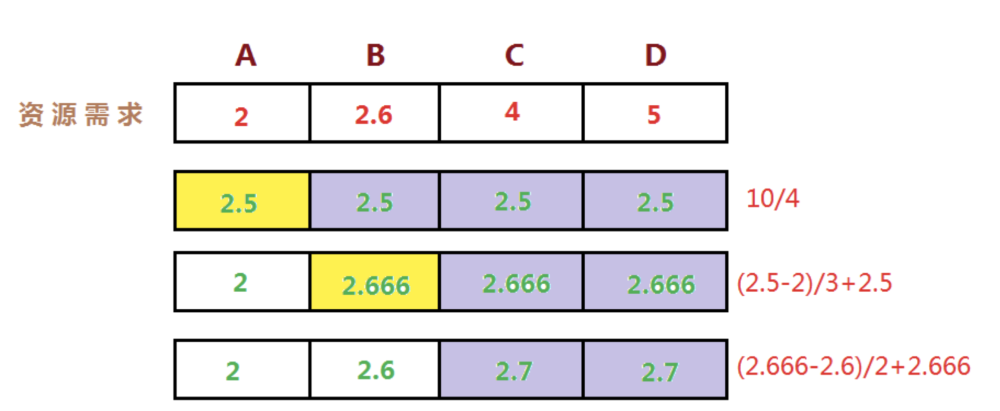

# 过载保护、限流与熔断

## 过载保护

### 普通的限流算法

单机限流：[令牌桶](https://lailin.xyz/post/go-training-week6-2-token-bucket-1.html)、[漏桶](https://lailin.xyz/post/go-training-week6-4-leaky-bucket.html)。

问题：

- 集群增加机器或者减少机器限流阈值是否要重新设置?
- 设置限流阈值的依据是什么?
- 人力运维成本是否过高?
- 当调用方反馈429时, 这个时候重新设置限流, 其实流量高峰已经过了重新评估限流是否有意义?

### 过载保护

自适应限流：根据系统当前的负载自动丢弃流量。

#### 实现

计算系统**临近过载时的峰值吞吐作为限流的阈值**来进行流量控制，达到系统保护。

- 服务器临近过载时，主动抛弃一定量的负载，目标是自保。
- 在系统稳定的前提下，保持系统的吞吐量。

常见做法：利特尔法则 

- CPU、内存作为信号量进行节流。
- 队列管理: 队列长度、LIFO。
- 可控延迟算法: [CoDel](https://blog.csdn.net/dog250/article/details/72849893)。

**计算吞吐量：利特尔法则 L = λ * W**


如上图所示，如果我们开一个小店，平均每分钟进店 2 个客人(λ)，每位客人从等待到完成交易需要 4 分钟(W)，那我们店里能承载的客人数量就是 2 * 4 = 8 个人

同理，我们可以将 `λ` 当做 QPS， `W` 是每个请求需要花费的时间，那我们的系统的吞吐就是 `L = λ * W` ，所以我们可以使用利特尔法则来计算系统的吞吐量。

#### 如何计算接近峰值时的系统吞吐？

首先我们可以通过统计过去一段时间的数据，获取到平均每秒的请求量，也就是 QPS，以及请求的耗时时间，为了避免出现前面 900ms 一个请求都没有最后 100ms 请求特别多的情况，我们可以使用滑动窗口算法来进行统计。

最容易想到的就是我们从系统启动开始，就把这些值给保存下来，然后计算一个吞吐的最大值，用这个来表示我们的最大吞吐量就可以了。但是这样存在一个问题是，我们很多系统其实都不是独占一台机器的，一个物理机上面往往有很多服务，并且一般还存在一些超卖，所以可能第一个小时最大处理能力是 100，但是这台节点上其他服务实例同时都在抢占资源的时候，这个处理能力最多就只能到 80 了

所以我们需要一个数据来做启发阈值，只要这个指标达到了阈值那我们就进入流控当中。常见的选择一般是 CPU、Memory、System Load，这里我们以 CPU 为例

只要我们的 CPU 负载超过 80% 的时候，获取过去 5s 的最大吞吐数据，然后再统计当前系统中的请求数量，只要当前系统中的请求数大于最大吞吐那么我们就丢弃这个请求。

### kratos 自适应限流分析

采样窗口：


#### 限流公式

```go
(cpu > 800 OR (Now - PrevDrop) < 5s) AND (MaxPass * MinRt * windows / 1000) < InFlight
```

- `cpu > 800` 表示 CPU 负载大于 80% 进入限流。

- `(Now - PrevDrop) < 5s` 这个表示只要触发过 1 次限流，那么 5s 内都会去做限流的判定，这是为了避免反复出现限流恢复导致请求时间和系统负载产生大量毛刺。这个 5s 就是下面的冷却时间。

- `(MaxPass * MinRt * windows / 1000) < InFlight` 判断当前负载是否大于最大负载。
  - `InFlight` 表示当前系统中有多少请求。
  - `(MaxPass * MinRt * windows / 1000)` 表示过去一段时间的最大负载。
  - `MaxPass` 表示最近 5s 内，单个采样窗口中最大的请求数。
  - `MinRt` 表示最近 5s 内，单个采样窗口中最小的响应时间。
  - `windows` 表示一秒内采样窗口的数量，默认配置中是 5s 50 个采样，那么 windows 的值为 10。

#### 具体实现

- 我们使用 CPU 的滑动均值（CPU > 800）作为启发阈值，一旦触发进入到过载保护阶段。

- 限流效果生效后，CPU 会在临界值（800）附近抖动，如果不使用冷却时间，那么一个短时间的 CPU 下降就可能导致大量请求被放行，严重时会打满 CPU。

  > 冷却时间一般设置为 5 秒，即如果进入到过载保护阶段了，接下来的 5 秒会沿用这个策略，而不会因为 cpu  使用率突然下降导致过载保护消失，然后更大的流量直接打满 CPU，这 5 秒过后会重新评估 CPU 的使用率看情况是否继续过载保护。

- 在冷却时间后，重新判断阈值（CPU > 800 ），是否持续进入过载保护。

kratos 限流源码更详细内容笔记可以直接查看 [Go可用性(五) 自适应限流](https://lailin.xyz/post/go-training-week6-4-auto-limiter.html) 。


## 限流

单机限流：令牌桶、漏桶。

### 分布式限流

可以使用 redis 来实现分布式限流。每次来一个请求就在 redis 对 key 使用 INCR 加 1，如果超过某个值就将多的请求丢弃。如下图：


但是这样也有问题：

- 单个大流量的接口，使用 redis 容易产生热点。
- pre-request 模式对性能有一定影响，高频的网络往返。

所以可以考虑从获取单个 quota 升级成批量 quota。quota: 表示速率，获取后使用令牌桶算法来限制。比如每秒异步从 redis 拿 100 个令牌放到本地的令牌桶里，然后服务从该令牌桶里消费令牌。

- 每次心跳后，**异步批量获取 quota**，可以大大减少请求 redis 的频次，获取完以后本地消费，基于令牌桶拦截。
- 但是每次申请的配额需要手动设定静态值略欠灵活，比如每次要20，还是50。这个情况我们可以初次使用默认值，一旦有过去历史窗口的数据，可以基于历史窗口数据进行 quota 请求。比如在过去一个窗口里我统计了 QPS 为 50，那么下次我去获取 quota 时就拿 50 个令牌即可。即根据过去的数据来预测当下的 quota。


go-zero 使用 redis + lua 脚本实现的分布式限流：[periodlimit](https://go-zero.dev/cn/periodlimit.html)、[tokenlimit](https://go-zero.dev/cn/tokenlimit.html) 。

#### 如何基于单个节点按需申请，并且避免出现不公平的现象？

一种在实际中广泛使用的分享技术称作**最大最小公平分享（Max-Min Fairness**）。

直观上，公平分享分配给每个用户想要的可以满足的最小需求，然后将没有使用的资源均匀的分配给需要‘大资源’的用户。

最大最小公平分配算法的形式化定义如下：

- 资源按照需求递增的顺序进行分配。
- 不存在用户得到的资源超过自己的需求。
- 未得到满足的用户等价的分享资源。



比如上图中，A、B、C、D 的资源需求来源是根据过去的窗口 QPS 数据预测出来当前需要的资源。假设我们总的 quota 最大为 10，那么最开始每台机器都分了 2.5 个配额，然后 A 发现多了，就把自己的配额均分给别的机器，接下来 B 也是一样。这样就是最大最小公平分享。

### 重要性

如果对接口粒度配置 quota 则太繁琐，对服务配置粒度又太粗，此时可以引入**重要性（criticality）**指标:

- 最重要 CRITICAL_PLUS，为最终的要求预留的类型，拒绝这些请求会造成非常严重的用户可见的问题。
- 重要 CRITICAL，生产任务发出的默认请求类型。拒绝这些请求也会造成用户可见的问题。但是可能没那么严重。
- 可丢弃的 SHEDDABLE_PLUS 这些流量可以容忍某种程度的不可用性。这是批量任务发出的请求的默认值。这些请求通常可以过几分钟、几小时后重试。
- 可丢弃的 SHEDDABLE 这些流量可能会经常遇到部分不可用情况，偶尔会完全不可用。

**重要性传递**：gRPC 系统之间，需要自动传递重要性信息。如果后端接受到请求 A，在处理过程中发出了请求 B 和 C 给其他后端，请求 B 和 C 会使用与 A 相同的重要性属性。

根据优先级拒绝请求：

- 全局配额不足时，优先拒绝低优先级的。
- 全局配额，可以按照重要性分别设置。
- 过载保护时，低优先级的请求先被拒绝。

另外限流思想也可以在单个服务里设置，比如账号服务设置对每个租户的限流，可以使用 ak 来配置，根据需求而定。


## 熔断

属于在客户端做限流的方案。

需要熔断的几种场景：

- 服务依赖的资源出现大量错误。
- 某个用户超过资源配额时，后端任务会快速拒绝请求，返回“配额不足”的错误，但是拒绝回复仍然会消耗一定资源。有可能后端忙着不停发送拒绝请求，导致过载。


如上图所示，熔断器存在三个状态:

1. **关闭(closed)**: 关闭状态下没有触发断路保护，所有的请求都正常通行。
2. **打开(open)**: 当错误阈值触发之后，就进入开启状态，这个时候所有的流量都会被节流，不进行通行。
3. **半打开(half-open)**: 处于打开状态一段时间之后，会尝试尝试放行一个流量来探测当前 server 端是否可以接收新流量，如果这个没有问题就会进入关闭状态，如果有问题又会回到打开状态

要注意的是熔断器打开可能有两个条件：QPS 超过多少以及错误率达到多少才会打开熔断器。如果 QPS 特别低，只有 2，错了 1 个请求错误率就 50% 了，这个时候肯定是不能打开熔断器的。所以要同时判断错误率和 QPS。

### Google SRE 过载保护算法

该算法的原理如下：

- 请求数量(requests)：调用方发起请求的数量总和
- 请求接受数量(accepts)：被调用方正常处理的请求数量

在正常情况下，这两个值是相等的，随着被调用方服务出现异常开始拒绝请求，请求接受数量(accepts)的值开始逐渐小于请求数量(requests)，这个时候调用方可以继续发送请求，直到requests = K * accepts，一旦超过这个限制，熔断器就会打开，新的请求会在本地以一定的概率被抛弃直接返回错误，概率的计算公式如下：

*max(0, (requests* *-* *K\*accepts) / (requests + 1))*

这个公式计算的是**请求被丢弃的概率**。

- requests: 一段时间的请求数量。
- accepts: 成功的请求数量。
- K: 倍率，K 越小表示越激进，越小表示越容易被丢弃请求。

这个算法的好处是不会直接一刀切的丢弃所有请求，而是计算出一个概率来进行判断，当成功的请求数量越少，K越小的时候 requests−K\*accepts 的值就越大，计算出的概率也就越大，表示这个请求被丢弃的概率越大。

> 引申：
>
> 滑动窗口统计请求数算法实现：可以将 1 秒划分为 10 个格子，每个格子 100 ms，比如在 0 ~ 100 ms 里来了一个请求就在第一个格子里 + 1，然后到了第 1 s ~ 1.1 s 时就会**覆盖**第一个格子的数据，后面以此类推。相当于是一个环形数组，只需要统计这个数组里所有的数据就是一个滑动窗口的所有请求数。


### Gutter

基于熔断的 gutter kafka ，用于接管自动修复系统运行过程中的负载，这样只需要付出 10% 的资源就能解决部分系统可用性问题。

我们经常使用 failover 的思路，但是完整的 failover 需要翻倍的机器资源，平常不接受流量时，资源浪费。高负载情况下接管流量又不一定完整能接住。所以这里核心利用熔断的思路，是把抛弃的流量转移到 gutter 集群，如果 gutter 也接受不住的流量，重新回抛到主集群，最大力度来接受。

比如下图左边的 kafka 集群是主集群，右边是只有 10% 资源的 gutter 集群。


### 客户端流控

positive feedback: 用户总是积极重试，访问一个不可达的服务。

- 客户端需要限制请求频次，retry backoff 做一定的请求退让。
- 可以通过接口级别的 error_details，挂载到每个 API 返回的响应里。

grpc 的请求退让：

```go
// 在DialContext函数中,当没有设置bs自定义参数时,会默认设置为DefaultExponential.
	if cc.dopts.bs == nil {
		cc.dopts.bs = backoff.DefaultExponential
    }
    
// internal/backoffG/backoff.go
var DefaultExponential = Exponential{Config: grpcbackoff.DefaultConfig}

// backoff/backoff.go
// DefaultConfig is a backoff configuration with the default values specfied
// at https://github.com/grpc/grpc/blob/master/doc/connection-backoff.md.
//
// This should be useful for callers who want to configure backoff with
// non-default values only for a subset of the options.
var DefaultConfig = Config{
    // 第一次失败之后的延迟时间.
    BaseDelay:  1.0 * time.Second,
    // 多次失败之后的时间乘数.
    Multiplier: 1.6,
    // 随机因子.
    Jitter:     0.2,
    // 最大延迟时间.
	MaxDelay:   120 * time.Second,
}

// Backoff returns the amount of time to wait before the next retry given the
// number of retries.
func (bc Exponential) Backoff(retries int) time.Duration {
    // 当重试次数为0时直接返回BaseDelay,为1秒.
	if retries == 0 {
		return bc.Config.BaseDelay
	}
	backoff, max := float64(bc.Config.BaseDelay), float64(bc.Config.MaxDelay)
	for backoff < max && retries > 0 {
        // 当backoff小于max且重试次数大于0时不断的乘以Multiplier.
		backoff *= bc.Config.Multiplier
		retries--
	}
	if backoff > max {
		backoff = max
    }
    // 对时间加上一个随机数.
	// Randomize backoff delays so that if a cluster of requests start at
	// the same time, they won't operate in lockstep.
	backoff *= 1 + bc.Config.Jitter*(grpcrand.Float64()*2-1)
	if backoff < 0 {
		return 0
	}
	return time.Duration(backoff)
}

```

当连接失败后会等待一段时间之后再尝试重连，时间间隔的算法依赖于 backoff 方法。

默认的 backoff 策略：第一次重试间隔为1秒，第二次为1\*1.6+随机数，第N次为1\*1.6^N +随机数（最大不能超过120秒）。


也可以通过接口返回的数据来给客户端下发重试策略：


其实，不仅微服务调用之间需要熔断器，在调用依赖资源的时候，比如mysql、redis等也可以引入熔断器的机制。比如 mysql 也可以设计一套分布式限流熔断的方案来保证 mysql 服务可用性。

关于 hystrix-go 和 kratos 熔断源码的实现可以查看 [Go可用性(六) 熔断](https://lailin.xyz/post/go-training-week6-6-breaker.html) 。

go-zero 熔断实现参考 [熔断原理与实现](https://go-zero.dev/cn/breaker-algorithms.html) 。
