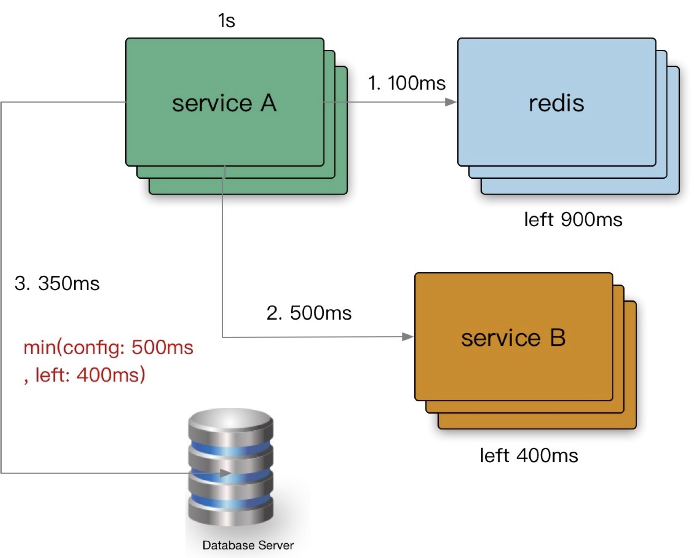
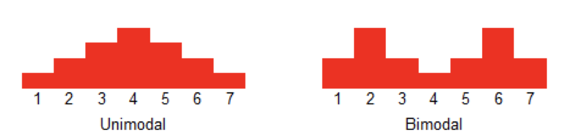

# 超时控制

超时控制，我们的组件能够快速失效（fail fast），因为我们不希望等到断开的实例直到超时。没有什么比挂起的请求和无响应的界面更令人失望。这不仅浪费资源，而且还会让用户体验变得更差。我们的服务是互相调用的，所以在这些延迟叠加前，应该特别注意防止那些超时的操作。

**超时决定着服务线程耗尽**。如果应用没有做超时控制，一个服务的超时可能会造成大量请求堆积，而引发整个系统的不可用。

可能造成超时的几种情况：

- 网络传递具有不确定性。比如机房的一些意外情况造成网络不稳定。
- 客户端和服务端不一致的超时策略导致资源浪费。比如客户端设置了超时 1 秒，而服务端设置超时 3 秒，此时客户端已经返回超时了服务端还在执行请求，造成资源的浪费。
- “默认值”策略。基础库有些超时默认值可能为 0，即永不超时，如果不手动设置超时时间的话很可能造成请求一直卡住，造成请求堆积。
- 高延迟服务导致 client 浪费资源等待。使用超时传递: 进程间传递 + 跨进程传递。

超时控制是微服务可用性的第一道关，良好的超时策略，可以尽可能让服务不堆积请求，尽快清空高延迟的请求，释放 Goroutine。

一般内网的 rpc 响应时间不能超过 100 ms，特殊情况 300 ms - 500 ms 。最终公网对用户的请求响应时间不能超过 1 秒。


## 超时策略

### 定义 SLO

实际业务开发中，我们不清楚依赖的微服务的超时策略，或者随着业务迭代耗时超生了变化，意外的导致依赖者出现了超时。

解决方法：

- 服务提供者定义好 latency [SLO(Service-level objective，服务级别目标)](https://zh.wikipedia.org/wiki/%E6%9C%8D%E5%8A%A1%E7%BA%A7%E5%88%AB%E7%9B%AE%E6%A0%87)，更新到 gRPC Proto 定义中，服务后续迭代，都应保证 SLO。如果后续服务迭代延迟增加了，也需要马上更新 protobuf 文件，并通知所有调用方，让他们把超时时间更新。

```protobuf
package google.example.library.v1;

service LibraryService {
    // Lagency SLO: 95th in 100ms, 99th in 150ms.
    rpc CreateBook(CreateBookRequest) returns (Book); 
    rpc GetBook(GetBookRequest) returns Book);
    rpc ListBooks(ListBooksRequest) returns (ListBooksResponse);
}

```

避免出现意外的默认超时策略，或者意外的配置超时策略。

解决方法：

- kit 基础库兜底默认超时，比如 100ms，进行配置防御保护，避免出现类似 60s 之类的超大超时策略。
- 配置中心公共模版，对于未配置的服务使用公共配置。


### 超时传递

当上游服务已经超时返回 504，但下游服务仍然在执行，会导致浪费资源做无用功。超时传递指的是把当前服务的剩余 Quota 传递到下游服务中，继承超时策略，控制请求级别的全局超时控制。

比如下图所示，一个请求调用超时时间为 1 s，第一步调用 redis 花了 100 ms，那么到了第二步调用服务时只剩下 900 ms 的 Quota，接着到第三步只剩下 400 ms，在这每一步都需要在本身配置的调用超时时间和 Quota 里取个最小值，比如最后一步去数据库查询，数据库查询的超时时间为 500 ms，Quota 400 ms，应该取 400 ms 作为超时时间。



#### 进程内部超时传递实现

  一个请求在每个阶段(**网络请求**)开始前，就要检查是否还有足够的剩余来处理请求，以及继承他的超时策略，使用 Go标准库的 [context.WithTimeout](https://pkg.go.dev/context)。

```go
func (c *asiiConn) Get(ctx context.Context, key string) (result *Item, err error) {
  // 取 ctx 的 timeout 和自己配置的超时时间的最小值来设置
	c.conn.SetWriteDeadline(shrinkDeadline(ctx, c.writeTimeout))
	if _, err = fmt.Fprintf(c.rw, "gets %s\r\n", key); err != nil {

```

#### 服务间超时传递实现

在 gRPC 框架中，会依赖 gRPC Metadata Exchange，基于 HTTP2 的 Headers 传递 grpc-timeout 字段，自动传递到下游，构建带 timeout 的 context。

grpc server 会自动将 client `request context` 中的 timeout 通过 header 传递给 server 端, server 端则会将这个超时时间设置为当前请求处理器的超时时间。

```go
// server 端, 拿到 header 中的 timeout 并设置
if v := r.Header.Get("grpc-timeout"); v != "" {
  to, err := decodeTimeout(v)
  if err != nil {
    return nil, status.Errorf(codes.Internal, "malformed time-out: %v", err)
  }
  st.timeoutSet = true
  st.timeout = to
}
```

[internal/transport/handler_server.go#L79](https://github.com/grpc/grpc-go/blob/4757d0249e2d5d16f259ce4224f7ec5fb7f284ee/internal/transport/handler_server.go#L79)

```go
// client 如果 ctx 参数有 deadline, 将超时通过 header 传递出去
if dl, ok := ctx.Deadline(); ok {
  // Send out timeout regardless its value. The server can detect timeout context by itself.
  // TODO(mmukhi): Perhaps this field should be updated when actually writing out to the wire.
  timeout := time.Until(dl)
  headerFields = append(headerFields, hpack.HeaderField{Name: "grpc-timeout", Value: 	grpcutil.EncodeDuration(timeout)})
}
```

[internal/transport/http2_client.go#L512](https://github.com/grpc/grpc-go/blob/4757d0249e2d5d16f259ce4224f7ec5fb7f284ee/internal/transport/http2_client.go#L512)

[internal/transport/http2_client.go#L512](https://github.com/grpc/grpc-go/blob/4757d0249e2d5d16f259ce4224f7ec5fb7f284ee/internal/transport/http2_client.go#L512)

但是也可以实现一个 `timeout interceptor`, 例如 go-zero 框架:

https://github.com/zeromicro/go-zero/blob/265b1f2459eb77c7dd03d0d3fbb109ca7f19a94d/zrpc/internal/serverinterceptors/timeoutinterceptor.go#L16

也是一个很经典的 go 语言超时处理。

### 监控

单峰分布（unimodal distribution）& 双峰分布 （bimodal distribution）：

数据分布会有一个或者很多个峰值（peaks），数据分布中只有一个明显峰值的叫做单峰，有两个明显峰值的叫做双峰，同样，具有多个峰值的就是多峰。



注意的点：

- 双峰分布: 95%的请求耗时在100ms内，5%的请求可能永远不会完成（长超时）。我们要注意这 5% 的请求，是不是会永远无法完成，最好能保证 99% 甚至 99.9% 的请求的耗时都在控制范围内。
- 对于监控不要只看平均值，可以看看耗时分布统计，比如 95th（95 分位值），99th。
- 设置合理的超时，拒绝超长请求，或者当Server 不可用要主动失败。

> 95 分位值：
>
> 收集100个数据，从小到大排列，95分位值就是取出第95个用户的数据做统计。 50分位值就是第50个人的数据。
>
> 如果能够保证95分位值的稳定性，就能很好的体现系统的稳定性。
>
> 99 分位值也是如此。
>
> 健康系统的 99 分位值的响应时间通常需要控制在 200ms 之内，而不超过 1s 的请求占比要在 99.99% 以上。