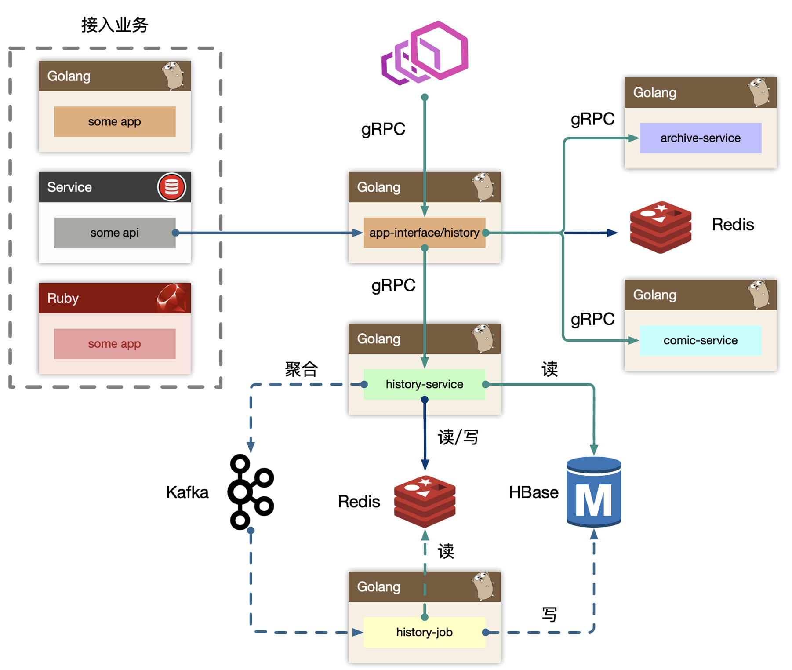
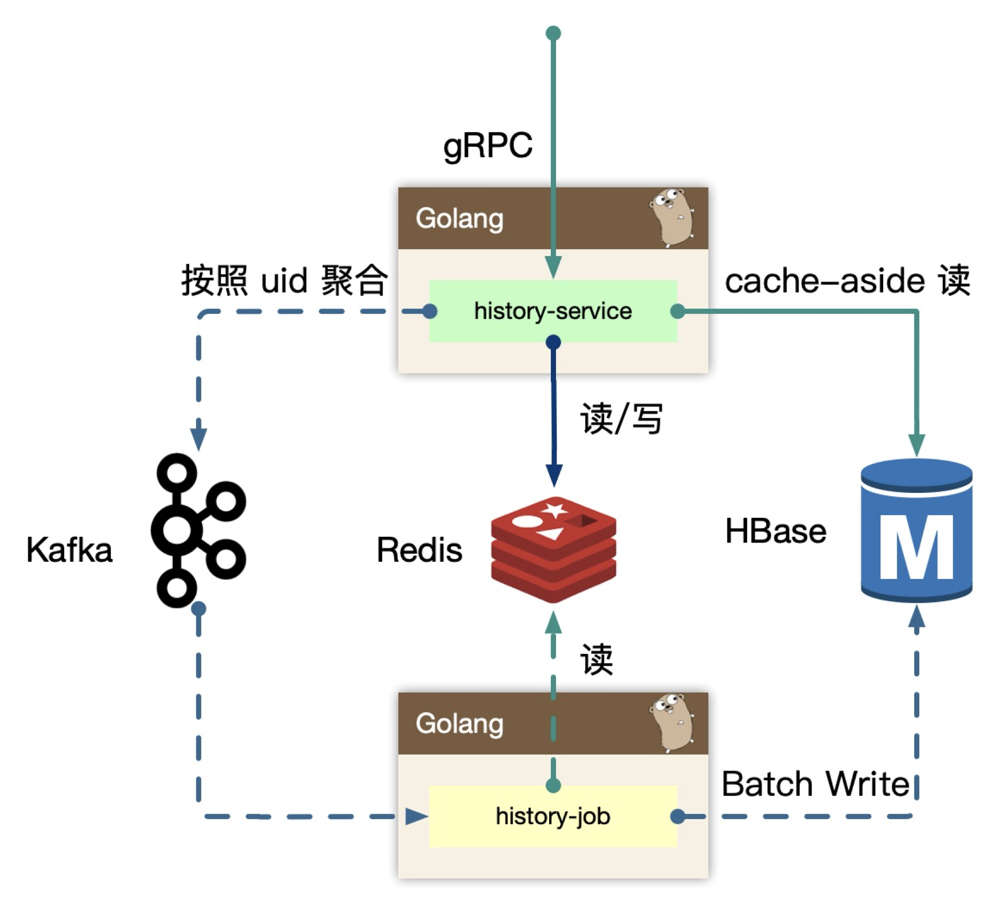

# 历史记录架构设计

## 功能模块

历史记录页面：

主要有以下需求：播放历史记录查看、播放进度同步等。同时还要考虑平台化，视频、文章、漫画等业务扩展接入。

功能点：

- 变更功能：添加记录、删除记录、清空历史。
- 读取功能：按照 timeline 返回 top N，点查获取进度信息。
- 其他功能：暂停/恢复记录（暂停记录历史播放，类似于无痕浏览，也可以恢复记录历史播放），首次观察增加经验等。

系统特性：**极高 tps 写入，高 qps 读取的业务服务**。

因此要分析清楚系统的 hot path（热点路径），投入优化，而不是哪哪都去优化。

## 架构设计

整体架构图如下：

主要分为 BFF 层、service 层、job 及存储层和接入业务层。接入业务层是内网的一些服务将自己的播放记录或者播放进度数据上报到 BFF 层，所以 BFF 层也充当了内网的 gRPC Provider，这些上游服务使用历史服务的写接口，把自己业务的数据进行持久化。

### BFF

BFF 层接受来自外部用户的读请求，依赖其他例如稿件、漫画服务来组装完整的面向历史业务（页面）需要的数据的组合。同时接受来自内部其他业务线的写请求，通常都是业务方自己进行业务 ID 的判定，然后投递到历史服务的 BFF 写接口中。最终 BFF 是打包在 app-interface 大杂烩 BFF 中，考虑到隔离性，读写流量很大，独立成 history BFF 服务。

如果业务场景中不存在统一的用户入口访问历史记录，可以去掉 BFF 层，直接使用 history-service 提供读接口，这样需要每个业务方自己实现自己的数据组装。

### history-service

服务层，去平台业务的逻辑，专注在历史数据的持久化上（因为对于播放类业务，BFF 专注平台业务数据组织，service 负责数据的读、写、删、清理等操作。播放进度是非常高频同步的，可能视频每播放 5 秒就要同步一次，需要考虑性能优化）。

使用 **write-back** 的思路，**把状态数据先入分布式缓存，再回写数据库**。无论是操作系统层面的 Page Cache，还是日志的异步刷盘，亦或是消息队列中消息的异步写入磁盘，大多采用了这种策略。（同时还有 write-through 策略等，可参考 [Cache写机制：Write-through与Write-back](https://blog.csdn.net/wyzxg/article/details/7254458) ）

### Job 

job 消费上游 kafka 的数据，利用消息队列的堆积能力，对于存储层的差速（消费能力跟不上生产速度时），可以进行一定的数据反压。配合上游 service 批量打包过来的数据持久化。

## 核心逻辑

历史服务最重要的设计，就是**批量打包（pipeline）聚合数据**。将高频、密集的写请求先入缓存（write-back），批量消费减少对存储的直接压力。

### 写流程

#### 播放场景问题

假设每个用户每 5 秒都需要记录一次视频播放的进度数据，那么如果每次都把这些数据放到 kafka，数据量太大而且最后一次记录播放进度之前的数据其实都是没有用的。

所以用户观看的稿件、漫画等，带有进度信息的数据，需要做一个 **last-write win** 的策略。即高频的用户端同步逻辑，只需要最后一次数据持久化即可。

#### 流程

1. 在 history-service 内存中，**定时定量来聚合不同用户（即 uid） 的“同一个对象的最后一次进度”**。（比如每 30 秒的数据或者每 1000 条数据，对每个用户的播放进度进行一次聚合，将同一个用户同一个视频最后一次进度覆盖前面的进度）。为了节约传输 IO，以及 history-service 的 in-process cache 的内存使用，我们在内存里**只维护了用户的 uid 以及对应的视频 id 列表，将这些数据发送到 kafka，最小化存储和传输**。
2. 同时我们需要保证用户数据**可以实时被观察到**，不能出现上报进度后，需要一阵子才能体现进度变化。所以我们**既在内存中打包数据，同时实时写入到 redis 中，这样即保证了实时，又避免海量写入冲击存储**（写 redis 是将每个用户每个视频的播放记录的详细数据实时写入）。
3. 将聚合好的数据发送到 kafka，使用 kafka 消息队列来消除写入峰值。
4. history-job 消费 kafka 消息，同时**从 redis 里通过消息里的 id 拿到详细数据**，从原来的 N 条记录变为一个用户一条记录。
5. 将上一步组装好的数据**批量写入**到 HBase 里。

#### 优化

按照每个用户的 uid 来 sharding 数据，写放大仍然很大。比如说有 1000 万用户同时在线，那么根据用户 id 来打包消息，就需要在短时间内向 kafka 发送 1000 万个消息。而 kafka 是为高吞吐设计，超高频的写入并不是最优，内存聚合和分片算法比较重要。所以可以使用 **region sharding** 策略，**打包一组数据当作一个 kafka message**。比如 uid % 100 进行数据打包，这样同一类用户 id 都在一个消息里，写入频率降低了很多，同时因为消息里只存了 uid 与 id 列表信息，就算聚合了 100 个用户的数据，数据量也不会特别大。

#### 总结

流程：

详细数据实时写 redis -> 内存维护用户数据 -> 定时/定量写入到 kafka -> job 消费数据并从 redis 里将数据填充组装好 -> 批量写入到 HBase 。

### 读流程

读流程比较简单。先从缓存 redis sortedset 读数据，读不到会触发 **cache-aside** 模式，从存储中回捞数据，**但是不会重新回填缓存**，因为拉取过去更久远的数据，属于用户纬度的低频度行为，所以并不需要回填缓存，缓存数据应该存储更热点更实时的数据。

历史数据通常是按照 timeline 来组织。历史数据实时写入 redis 后，不会无限制的存储，会按量截断（比如只保存用户的前 10 条记录），所以分布式缓存中数据不是完整数据。

### BFF

history 作为 BFF，对用户端提供统一的用户记录记录入口接口，同时也对内提供 gRPC 写入历史接口。如果业务场景中不存在统一的用户入口访问历史记录，可以去掉 BFF 层，直接使用 history-service 提供读接口，这样需要每个业务方自己实现自己的数据组装。

我们也有类似用户首次播放、观看等加经验或者奖励积分类似的操作，所以这里也依赖了 redis，进行判定用户当天是否是首次访问，比较容易想到使用 **bitmap 或者 bloom filter** 来进行判断，然后往下游 kafka 投递消息，而不直接依赖业务的某个服务。

## 课程问题

因为我们有关闭历史记录的功能，这样每次写入操作都需要前置读取一次，看是否打开了历史记录的开关，同样的每天首次发送奖励也是一样每次都需要判断一下是否是首次，你有更好的办法吗？

