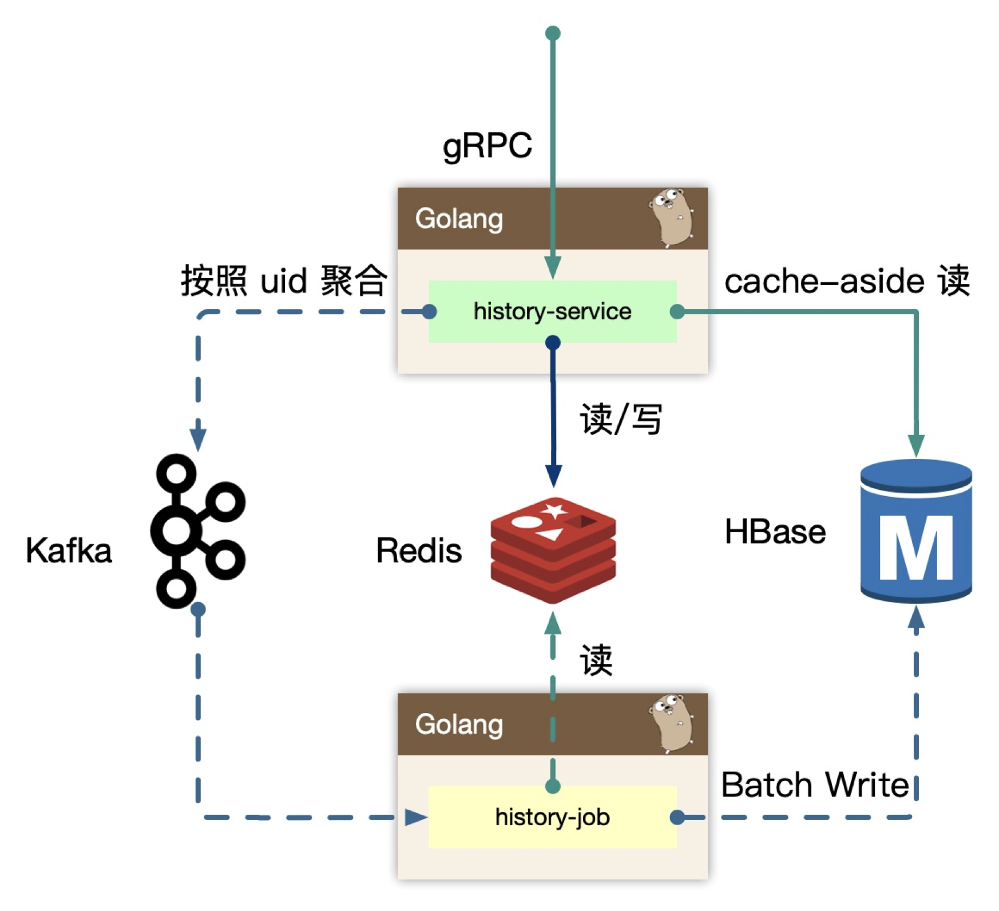

# 存储和可用性设计

## 存储设计

### 数据库设计

数据库设计图：

#### HBase 表设计

##### history

- rowkey：用户 id md5 以后的头两位 + 用户，避免 rowkey 热点密集到一个 region 中，导致写/读热点。
- column_family: info 列簇。

##### info

- column： 存储列 obj_id + obj_type，例如稿件ID: 100，稿件业务:1，100_1 作为列名。
-  value： 使用 protobuf 序列化一个结构体接入。另外我们使用 HBase TTL 的能力，只需要保存90天的用户数据即可。(删除同理)

##### protobuf: history

存储历史记录的详细数据，可以由 info 表的 value 反序列化出来。

#### 数据写入

用户 id 和播放记录数据 values 插入到 history 表，再更新 info 列簇，已经详细数据表。

#### 数据读取

获取某个用户历史记录，即列表获取数据， 通过用户 id 直接获取前 1000 条，**在内存中排序和翻页**。

如果要获取某一个用户某一个视频的进度，即点查 GET mid columns，如果缓存 redis 查不到即 cache miss 了，那么也不再回源请求 HBase。因为在茫茫多视频查看当前视频的阅读进度，cache miss 会非常常见，如果都去透传查 HBase，那么 HBase 压力会很大。

基于业务场景来分析，一般来说会产生 redis cache miss 可能有以下几种情况：

- 查看一个很久之前看过的视频，在 redis 里没有存储播放进度了， cache miss。
- 查看一个没看过的视频，redis 没有播放进度，cache miss。

以上几种情况在实际场景中，查不到播放进度其实就没必要去透传到存储层去查了。

### 缓存设计

缓存设计图：

基于 redis zset 来设计，key 是用户 id，member 是业务唯一 id，score 就是产生时间，可以按照历史时间排序得到用户 id 与业务唯一 id 的映射关系列表。再将业务唯一 id 作为 key 去批量查询历史记录的详细数据，数据以 protobuf 序列化存储。（其实 history_content 的 key 我觉得应该再加上一个用户 id，用户 id + 业务唯一 id 才能唯一标识每个用户每个视频的历史播放信息）

#### 数据写入

每次产生的历史数据，需要立马更新 redis，使用 sorted set 基于时间排序的列表。

同时存储一份数据到 redis string 中，使用 protobuf 序列化完整的数据内容。为了避免 redis 中单个用户数据无限增长，需要超过一定量后对数据进行截断。

#### 数据读取

分为两个场景：

- 历史页面场景，这时候使用 sorted set，排序查找即可，拿到列表后，使用 mget 批量获取 history_content 内容。
- 点查播放进度，比如我们点击进入一个视频详情页，这时候直接查找 history_content 进行点查，不再回源 HBase，因为命中率太低。

#### 缓存加速

我们在缓存设计中，经常使用 bitmap(roaring bitmap)、bloom filter 缓存加速访问。

比如要判断这个用户在今天有没有登录过，那么可以使用布隆过滤器来判断，登录时使用多个 hash 函数来对他的用户名字或 id 进行 hash，如果 hash 出来的位有是 0 的，那么就说明这次是首次登录，然后将对应的 bit 置为 1。

##### 热点问题

现在我们在 redis 里实现一个用 bitmap 或 bloom filter，来记录用户是否是首次登陆，key 假设是 "bm"，value 就是一个 bitmap，value 里存储了全量用户的首次登录信息。这个 key 可能被存在某一个 redis 节点中，那么所有登录的用户都会去访问这个 redis 节点的 bm key，这个节点就成了一个热点。

##### 解决方法

我们可以构建多组 bitmap 或 bloom filter，来进行打散 key 的分配。比如新建 1000 个 bitmap，key 假设为 "bm_1", "bm_2" 等，这些 key 会被均分打散到所有的 redis 节点中，这样热点就消除了。

实现：

prefix_key = hash(uid) % 1000

将用户 id hash 然后对 1000 求余，得到 bitmap 的 prefix_key，找到对应的 redis 节点，再拼接成完整的 key 去这个节点访问 bitmap ，这样 1000 个 key 尽可能均匀的分布到更小集合的 node，而不会产生数据热点。

## 可用性设计

再来看这个架构图：

### Write Back

回顾一下写回流程：

1. 在 history-service 中实时写入 redis 数据，因此只需要重点优化缓存架构中，扛住峰值的流量写入。
2. 之后在服务内存中，使用 map[int]map[int]struct{} 聚合数据（ map[用户id]map[业务id]数据 ）。
3. 利用 channel 在内部发送一个个小消息（就是上面的 map），再将一类用户数据聚合成一个大 map。
4. 在发送消息过程中，使用 timer 和 定量判定逻辑，发送到下游 kafka 中。
5. 在 history-job 中，获取消息后，重新去 redis 中回捞数据，即 history-content，然后构建完整的数据批量写入到 HBase 中。

这里存在两个风险：

1. history-service 重启过程中，内存里预聚合的消息丢失；
2. history-job 读取 redis 构建数据，但 redis 挂了读不到数据了；

对于第 1 点，内存里的数据丢失，这部分数据就不会发到 kafka 也不会持久化到 HBase 里，但是这部分数据会提前存储到 redis 里，在短时间内用户去查进度是正常的。等到服务恢复了，**会再重新定时上报数据**，这个时候新的播放进度数据就会正常发到 kafka ，然后更新到 HBase 了。所以这个问题影响不大。

对于第 2 点，redis 集群全部挂掉是会丢失部分数据，对于历史记录的场景，非 L0 的业务服务/数据，我们认为极端情况下可接受。主要看业务场景对数据一致性的要求多高。

### 聚合

经过 BFF history 的流量 per-request 都会发送给 history-service，我们最容易想到的优化就是聚合上移来减少发送给下游的 rpc。但是按照 mid region sharding 的思路非常具有业务的耦合性，所以不应该把逻辑上移，而只是数据上移，所以可以考虑简单 batch put 请求，做一个无逻辑的数据聚合再发送给 history-service，这样可以大大的减少内网的流量，节约资源。

我们发现经过 API Gateway 的流量都会触发高频的 per-rpc auth，给内网的 identify-service 带来了不少压力。我们认为大部分历史行为通过心跳的方式同步进度，为何不连接一个长连接，长连接服务再握手后先进行用户级的身份验证，之后维持身份信息，而不是每次发送 request 都进行验证，这样可以大大减少内网的 identify-service 的流量。

我们内网使用 boardcast(goim) 服务维护长连接，长连接一次验证，不断使用。

### 广播

前面有个思考的问题，用户首次触发的行为，需要发送消息给下游系统进行触发其他奖励等。如何**减少这类一天只用一次的标记位缓存请求**？

方法：

使用 in-process local cache，只有高频的用户访问，带来的收益就越大，我们很容易想到使用 LRU 维护这个集合，但用户分布很广，很难覆盖，命中率很低。

一个原则：**越源头解决架构问题，通常越简单，效率越高。**

更好的方法：

我们在写操作（高频请求）中，把当前的是否是首次触发的 flag 返回到 API 协议中，**作为一个日期值，客户端保存到本地，下次请求的时候带上**。如果发现请求里该值存在，获取以后判断是否要请求缓存。

例如：请求的 flag 值为 2021-1-1，发现当前时间还是 2021-1-1，不再请求 redis，直接判定不是首次触发。如果发现当前时间是2021-1-2，判定是首次触发，需要触发一次 redis 访问，返回新的 flag 到客户端，这样就可以通过请求参数把状态广播同步到任何其他设备，可以大大减少判定缓存。

## 参考

https://en.wikipedia.org/wiki/Cache#Writing_Policies

https://blog.csdn.net/jiaomeng/article/details/1495500

https://blog.csdn.net/yizishou/article/details/78342499

https://blog.csdn.net/caoshangpa/article/details/78783749