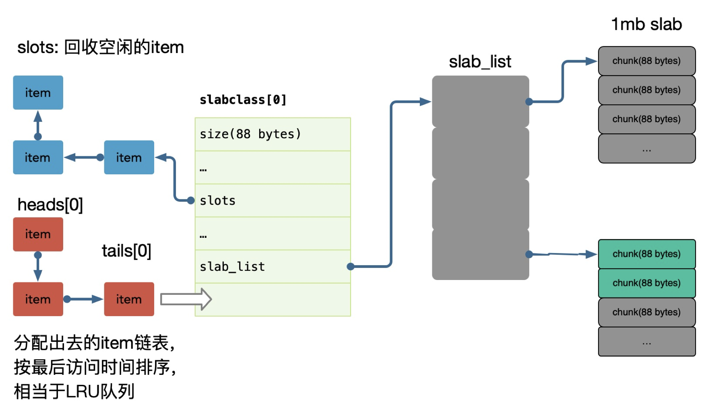
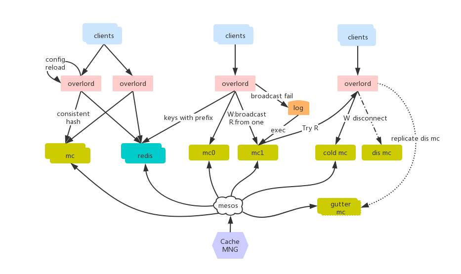
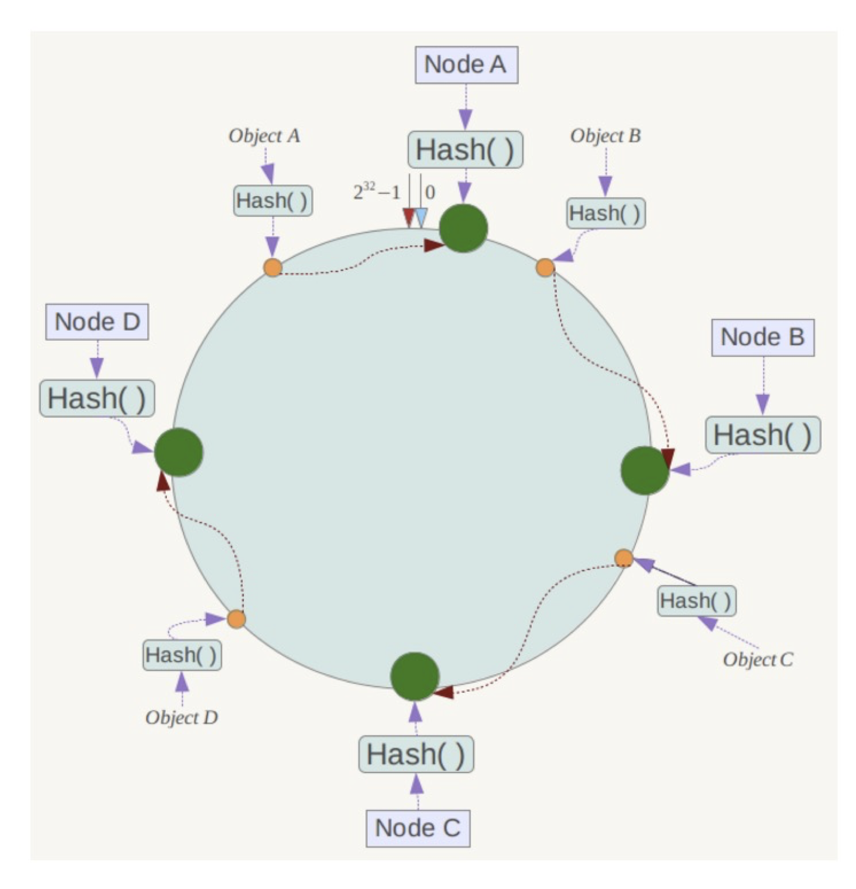
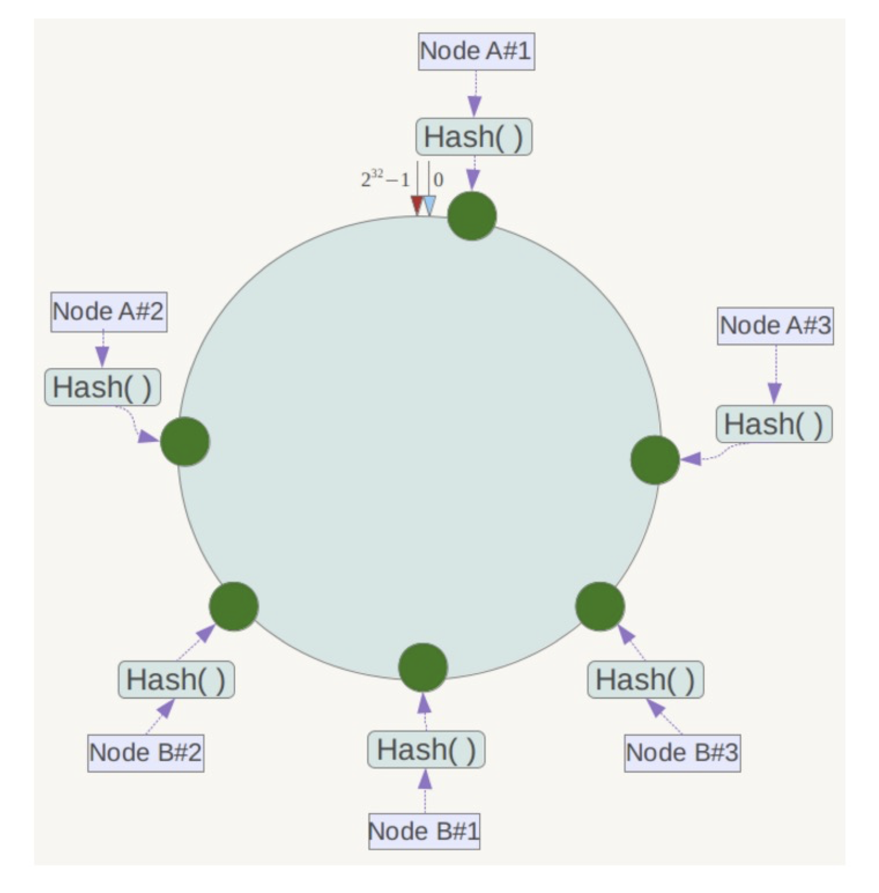
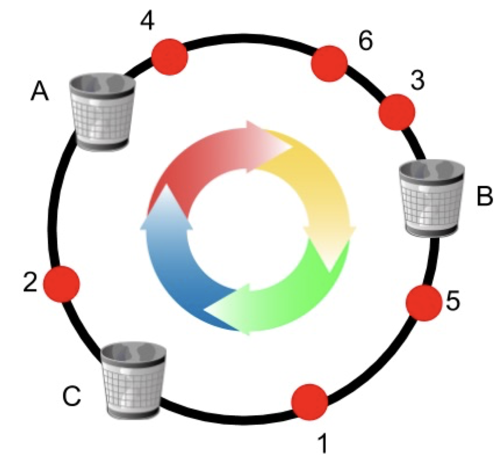
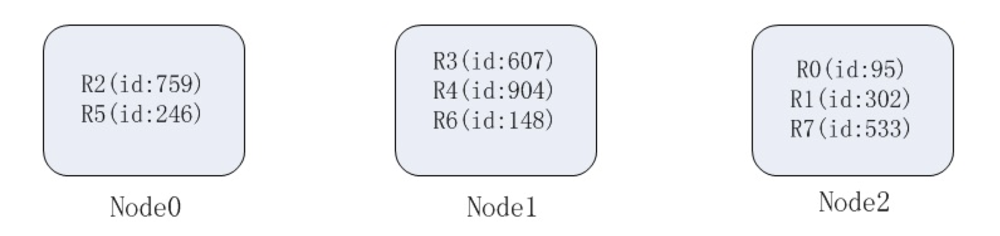
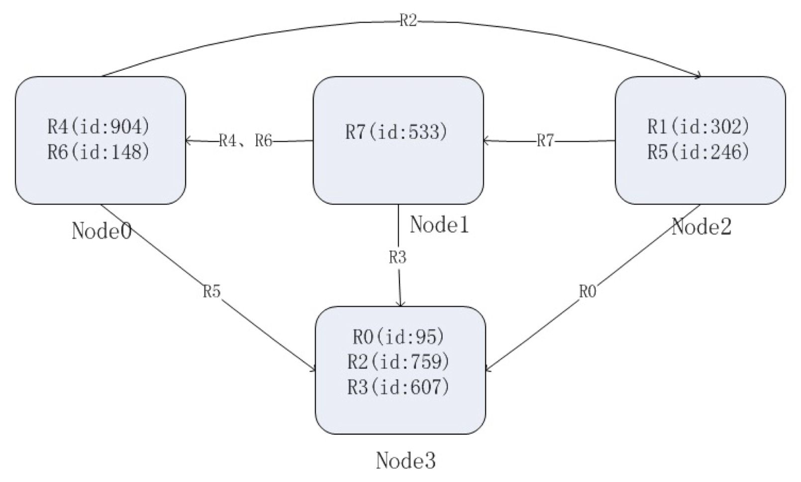
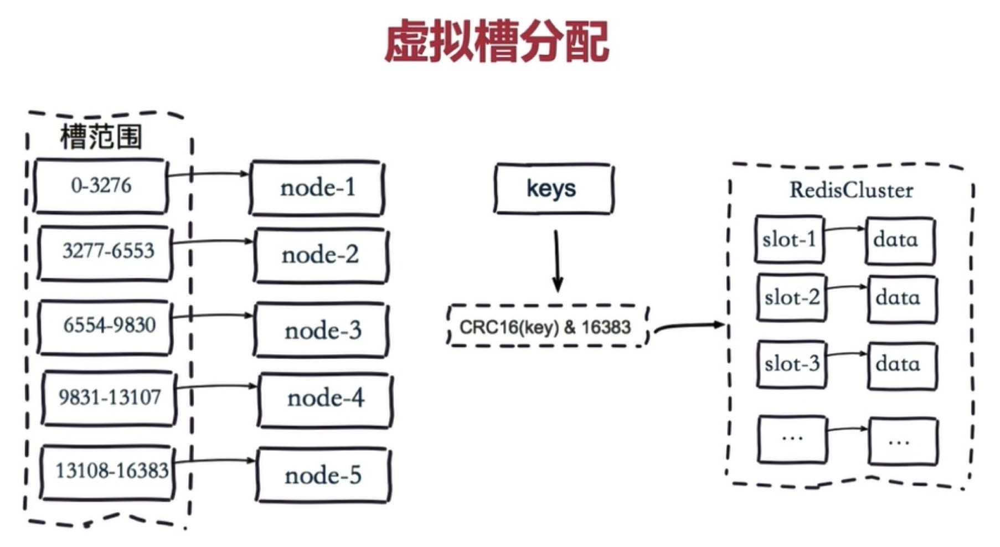
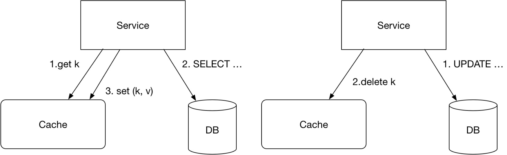
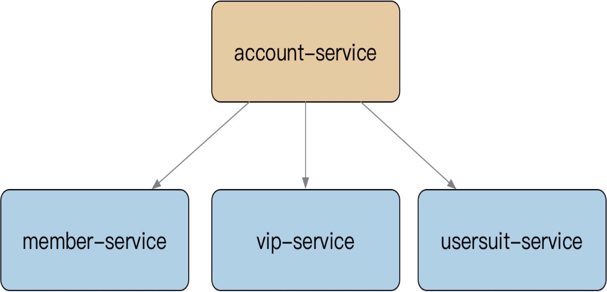

# 分布式缓存

## 缓存选型

### memcache

Memcache 提供简单的 kv cache 存储，value 大小不超过1mb。可以作为大文本或者简单的 kv结构使用。

Memcache 使用了slab 方式做内存管理，存在一定的浪费，如果有大量 size 接近的 item，建议调整 Memcache 参数来优化每一个 slab 增长的 ratio。并且可以通过设置 slab_automove & slab_reassign 开启 Memcache 的动态/手动 move slab，防止某些 slab 热点导致内存足够的情况下引发 LRU。

大部分情况下，简单 KV 推荐使用 Memcache，吞吐和相应都足够好。

#### 底层

每个 slab 包含若干大小为1M的内存页，这些内存又被分割成多个 chunk，每个 chunk 存储一个 item；

在 Memcache 启动初始化时，每个 slab 都预分配一个 1M 的内存页，由slabs_preallocate 完成（也可将相应代码注释掉关闭预分配功能）。

chunk 的增长因子由 -f 指定，默认1.25，起始大小为48字节。

内存池有很多种设计，可以参考下: nginx ngx_pool_t，tcmalloc 的设计等等。

### Redis

Redis 和 Memcache 最大的区别其实是 redis 单线程（新版本双线程，一个线程处理网络 IO，一个线程处理数据存储），memcache 多线程，所以 QPS 可能两者差异不大。但是吞吐会有很大的差别，比如大数据 value 返回的时候，redis qps 会抖动下降的的很厉害，因为单线程工作，其他查询进不来（新版本有不少的改善）。

所以建议纯 kv 都走 memcache，比如我们的关系链服务中用了 hashs 存储双向关系，但是我们也会使用 memcache 挡一层来避免hgetall 导致的吞吐下降问题。

#### 缓存 Proxy

[overload](https://github.com/bilibili) 是 B 站基于Go语言编写的memcache和redis&cluster的代理及集群管理功能，致力于提供自动化高可用的缓存服务解决方案。主要包括以下组件:

- [proxy](https://github.com/bilibili/overlord/blob/master/doc/wiki-cn/proxy-usage.md)：轻量高可用的缓存代理模块，支持memcache和redis的代理，相当于twemproxy，不同在于支持redis-cluster及能将自己伪装为cluster模式。
- [platform](https://github.com/bilibili/overlord/blob/master/doc/wiki-cn/platform-deploy.md)：包含apiserver、mesos framework&executor、集群节点任务管理job等。
- [GUI](https://github.com/bilibili/overlord/blob/master/doc/wiki-cn/platform-usage.md)：web管理界面，通过dashboard可视化方便用于集群管理，包括创建删除、扩缩容、加减节点等。
- [anzi](https://github.com/bilibili/overlord/blob/master/doc/wiki-cn/tools.md)：redis-cluster的数据同步工具，可服务化与apiserver进行配合工作。
- [enri](https://github.com/bilibili/overlord/blob/master/doc/wiki-cn/tools.md)：redis-cluster的集群管理工具，可灵活的创建集群、迁移slot等。

具体可以查看[官方文档](https://github.com/bilibili/overlord/blob/master/doc/wiki-cn/SUMMARY.md)

### 一致性 Hash

- 一致性 hash 是将数据按照特征值映射到一个首尾相接的 hash 环上，同时也将节点（按照 IP 地址或者机器名 hash）映射到这个环上。
- 对于数据，从数据在环上的位置开始，顺时针找到的第一个节点即为数据的存储节点。
- 增加一个节点在一致性哈希中，只有在圆（continuum）上增加服务器的地点逆时针方向的第一台服务器上的键会受到影响。影响较小。

哈希算法需要满足的特性：

- 平衡性（Balance）：尽可能分布到所有的缓冲区中。
- 单调性（Monotonicity）：单调性是指如果已经有一些内容通过哈希分派到了相应的缓冲中，又有新的缓冲区加入到系统中，那么哈希的结果应能够保证原有已分配的内容可以被映射到新的缓冲区中去，而不会被映射到旧的缓冲集合中的其他缓冲区。
- 分散性（Spread）：相同内容被存储到不同缓冲中去，降低了系统存储的效率，需要尽量降低分散性。
- 负载（Load）：哈希算法应能够尽量降低缓冲的负荷。
- 平滑性（Smoothness）：缓存服务器的数目平滑改变和缓存对象的平滑改变是一致的。

#### 虚拟节点

一致性哈希算法在服务节点太少时，容易因为节点分部不均匀而造成数据倾斜问题。

此时必然造成大量数据集中到 Node A 上，而只有极少量会定位到 Node B 上。为了解决这种数据倾斜问题，一致性哈希算法引入了虚拟节点机制，即对每一个服务节点计算多个哈希，每个计算结果位置都放置一个此服务节点，称为虚拟节点。

#### 案例

参考 [微信红包系统架构的设计和优化分享](https://www.cnblogs.com/chinanetwind/articles/9460820.html)

一致性哈希在这里主要解决并发抢的问题：

> 如何解决并发抢
>
> 群里红包的规则是金额随机抢，在一个大群发一个红包出去，抢并发请求量高，在同一个资源上操作，需要增加锁操作，避免一个抢总数超过发送红包总数，众所周知，mysql的加锁操作，很多抢在一个锁上等，性能损耗大，吞吐量下降，对于海量服务的操作，是不能满足要求。
>
> 在set模块的基础上，我们把发/抢的资源请求都会落到同一个资源set，在最外层，cache红包的状态，如果红包已经被抢完了，即刻返回，如果红包未接完，对于一个红包进去抢环节还有限流，这是第一级保护，通过一致性hash算法，一个订单到dao层都会路由到同一个机器的同一个进程，dao到mysql在现一个连接上完成抢操作，把并发抢修改成串行化，mysql可以无锁等待，性能明显提升。

简单来说就是，在网关层，使用一致性 hash，对红包 ID 进行分片，命中到某一个逻辑服务器处理，这样同一个红包的所有请求都会在一个服务器的进程中处理，从而能在进程内做写操作的合并，减少存储层的单行锁争用。

一致性 hash 的演进版本：**有界负载一致性 hash**。

有界负载一致性 hash 算法会监控每个节点的负载情况，如果某个节点负载超过限度，则数据会飘到下个节点进行存储。比如上图的 B 节点超负载了，那么数据 3 可能会存储到 C 节点中。这个算法可以很好地解决，普通一致性 hash 算法可能发生的热点问题。

### Hash 取余

数据分片的 hash 方式也是这个思想，即按照数据的某一特征（key）来计算哈希值，并将哈希值与系统中的节点建立映射关系,从而将哈希值不同的数据分布到不同的节点上。

按照 hash 方式做数据分片，映射关系非常简单；需要管理的元数据也非常之少，只需要记录节点的数目以及 hash 方式就行了。

当加入或者删除一个节点的时候，大量的数据需要移动。比如在这里增加一个节点 N3，因此 hash 方式变为了 mod 4。这样会造成大量数据重新迁移，如果节点数量能够保持稳定可以选择这种方式，毕竟实现比较简单。

### Slot

典型案例就是 redis-cluster 的实现，它把16384 个槽按照节点数量进行平均分配，由节点进行管理对应的槽位。

对每个 key 按照 CRC16 规则进行 hash 运算，把 hash 结果对16383进行取余计算自己是在哪个槽位，然后存储到对应的 redis 节点中。

Redis Cluster 的节点之间会共享消息，每个节点都会知道是哪个节点负责哪个范围内的数据槽。

如果需要新增一个节点，就需要每个节点把一部分槽和数据迁移到新的节点。这样比 Hash 求余新增节点的处理方式要简单很多。

## 缓存模式

### 数据一致性

#### Cache Aside

我们一般使用的 Cache Aside 模式，也会出现存储和缓存数据不一致的问题。

比如上图左边的操作，读取缓存读取不到，然后去 db 里拿数据，再把数据 set 到缓存，假设这个取出来的数据版本是 v1。然后同时右边对同一个 key 有个更新操作，db 此时的数据是 v2，同时删除缓存的 key，假设右边的 2 发生在左边的 3 之前，那么最终缓存里的数据还是 v1，即老版本的脏数据，没有被删掉。这时候存储和缓存的数据就不一致了。

课程里并没有讲这个问题的解决方法，这里引入网上的一个说法：

这个case理论上会出现，不过，实际上出现的概率可能非常低，因为这个条件需要发生在读缓存时缓存失效，而且并发着有一个写操作。而实际上数据库的写操作会比读操作慢得多，而且还要锁表，而读操作必需在写操作前进入数据库操作，而又要晚于写操作更新缓存，所有的这些条件都具备的概率基本并不大。

#### 同步更新缓存

这个方案和 cache aside 模式唯一不同的是，更新操作会将更新好的数据写入到缓存中，这种模式在一些场景下也会使用到。同样会产生数据不一致的问题，主要有以下两点：

1. A 先把数据库更新为 123，由于网络问题，更新缓存的动作慢了。这时，B 去更新数据库了，改为了 456，紧接着把缓存也更新为 456。现在 A 更新缓存的请求到了，把缓存更新为了 123。那么这时数据就不一致了，数据库里是最新的 456，而缓存是 123，是旧数据。
2. 和 cache aside 遇到的问题类似，写操作将新数据先写到缓存，读数据读到老数据后更新缓存，将老数据写入到缓存中。

解决方法：

- 对于第 1 个问题，写操作 SET Cache，使用 SETEX 操作，设置一个有效期，这样短时间内可能会从缓存中读到老数据，但最终会保持一致。
- 对于第 2 个问题，读操作，Redis 使用 SETNX 操作，即如果这个 key 不存在则设置值。读操作一般是 key 不存在再去 set 值，如果 set 值的时候发现这个 key 存在了，说明是其他写操作写进去了，写操作的数据版本肯定更新，所以这时候就不覆盖写操作的值，从而缓存的值时最新的。

总结：写操作使用 SET 操作命令，覆盖写缓存；读操作，使用 ADD 操作回写 MISS 数据，从而保证写操作的最新数据不会被读操作的回写数据覆盖。

### 多级缓存

比如有一个账号服务依赖了下游的好几个服务：

账号服务用于提供粗粒度的接口，以及二级缓存加速，减少扇出的 RPC 网络请求，减少延迟。账号服务作为上游服务，下面的成员服务、vip 服务等作为下游服务，都有自己的缓存。这就会出现这两级缓存不一致的问题。

要保证多级缓存的一致性：

- 清理的优先级是有要求的，先优先清理下游再上游；（如果先清理上游，那么上游再从下游拿数据，拿到的缓存数据还是老数据，所以得先清理下游缓存数据。）
- 下游的缓存 expire 要大于上游，避免穿透回源到数据库查询；（如果上游服务 cache miss，此时下游缓存 expire 小于上游，那么直接就穿透到 db 了，所以下游的缓存过期时间一般都要大于上游，做一个兜底。）

但是这种多级缓存的架构比较复杂，最好是根据 DDD 的思想将这几个服务整合到账号服务里。

### 热点缓存

对于热点缓存 Key，按照如下思路解决：

- 小表广播，从 RemoteCache 提升为LocalCache，App 定时更新，甚至可以让运营平台支持广播刷新 LocalCache；
- 主动监控防御预热，比如直播房间页高在线情况下直接外挂服务主动防御；
- 基础库框架支持热点发现，自动短时的 short-live cache；
- 多 Cluster 支持，即将同一个 key 冗余到多个集群中，这样热点 key 就会被分散；
- 多 Key 设计: 使用多副本，减小节点热点的问题：
  - 使用多副本 key_1,key_2,key_3，这些 key 保存的都是同一份数据， 每个节点保存一份数据。要查 key 的时候可以通过哈希求余或轮询，将请求分散到不同节点，避免单点热点问题。

使用多集群或多 key 解决热点问题，同样会有数据不一致的问题存在，我们可以利用 MySQL Binlog 消息广播到不同集群的节点清理或者更新缓存，来尽量保证数据一致性。

#### 频繁更新问题

当业务频繁更新时候，缓存会被不断删除，cache 频繁过期，会导致命中率低的情况发生，从而很多请求会透传到 db 去查询，对 db 的压力很大。

解决方法：

如果应用程序层可以**忍受稍微过期一点**的数据，针对这点可以进一步降低系统负载。当一个 key 被删除的时候（delete 请求或者内存不够清理空间），它不会被真正删除，而是会被放到一个临时的数据结构里，会再续上比较短的一段时间，比如 10 秒。

当有请求进来的时候会返回这个数据并标记为 “Stale”，即过期数据。应用收到这个过期数据可以选择继续使用，或者抛弃，然后透传到数据库里查询新数据，更新到缓存里。对于大部分应用场景而言，Stale Value 是可以忍受的。(需要改 memcache、Redis 源码，或者基础库支持）。

### 缓存穿透

- singleflight
  - 可参考 [Go并发编程(十二) Singleflight](https://lailin.xyz/post/go-training-week5-singleflight.html) 。

- 分布式锁
  - 可以通过 `SET lock $uuid EX 20 NX` 加 lua 脚本实现一个简单的分布式锁。

- 队列
  - 通过消息队列来异步写。如果 cache miss，使用 singleflight 组合相同的请求去 db 读出数据，然后交由队列聚合一个 key，来 load 数据回写缓存，具体可参考评论架构实现。
- lease
  - 通过加入 lease 机制，lease 是 64-bit 的 token，与客户端请求的 key 绑定，对于过时设置，在写入时验证 lease；对于 thundering herd 问题，每个 key 10s 分配一次，当 client 在没有获取到 lease 时，可以稍微等一下再访问 cache，这时往往 cache 中已有数据。（基础库支持 & 修改 cache 源码）；

## 缓存技巧

### Incast Congestion

如果在网路中的包太多，就会发生 Incast Congestion 的问题（可以理解为，network 有很多交换机，路由器等，一旦一次性发一堆包，这些包同时到达交换机，这些交换机就会忙不过来）。

对于缓存查询也是如此，如果有一个大批量的请求查询缓存，可能会造成大量的 cache miss，但如果将这个批量请求打散成一个个小请求又会对网络造成压力。所以我们可以在 cache proxy 层设置一个 window size，每次发送 window size 大小的批量请求去查询， 调试出一个两方面达到均衡的 size 大小。

### 技巧

- 易读性的前提下，key 设置尽可能小，减少资源的占用。

- redis value 可以用 int 就不要用 string，对于数字大小小于 N（一般是 9999） 的 value，redis 内部有 **shared_object** 缓存。

  > 目前来说， Redis 会在初始化服务器时， 创建一万个字符串对象， 这些对象包含了从 `0` 到 `9999` 的所有**整数值**， 当服务器需要用到值为 `0` 到 `9999` 的字符串对象时， 服务器就会使用这些共享对象， 而不是新创建对象。注意这一万个字符串对象其实存储的是整数值，而不是字符串，因此只有当 value 是 int 时才能复用节省内存。具体可查看 [对象共享](http://redisbook.com/preview/object/share_object.html)。

- 拆分 key。主要是用在 redis 使用 hashes 情况下。同一个 hashes key 会落到同一个 redis 节点，hashes 过大的情况下会导致内存及请求分布的不均匀。考虑对 hash 进行拆分为小的 hash，使得节点内存均匀及避免单节点请求热点。可以使用 region sharding 或者对 key 哈希取余的方式将这个大 key 分成多个小 key 存储。

- 空缓存设置。对于部分数据，可能数据库始终为空，这时应该设置空缓存，避免每次请求都缓存 miss 直接打到 DB。或者使用布隆过滤器。

- 缓存读取超时，去 db 读到数据后第一次不触发回写缓存，因为这个时候缓存大概率什么操作都会超时，就不继续给它加负担了。

- 序列化使用 protobuf，尽可能减少 size。

- 对于设置了过期时间的 zset 或 hash，需要对它做增量更新时，可以先将 key 延长一个过期时间，再增量更新。即先 Expire，再 ZADD/HSet。如果没有设置过期时间，可以先判断是否存在，即 Exist，保证索引结构体务必存在的情况下去操作新增数据。

- BITSET: 存储每日登陆用户，单个标记位置（boolean），为了避免单个 BITSET 过大或者热点，需要使用 region sharding，比如按照 id 对 bitset key 的数量求余，再 /10000，商为 KEY、余数作为 offset；

- Sortedset: 翻页、排序、有序的集合，杜绝 zrange 或者 zrevrange 返回的集合过大。

- Hashs: 过小的时候会使用压缩列表、过大的情况容易导致 rehash 内存浪费，也杜绝返回hgetall，对于小结构体，建议直接使用 memcache KV。

- 尽可能的 PIPELINE 指令，但是避免集合过大。

- 避免超大 Value。

## 参考

[Redis 集群中的纪元(epoch)](https://blog.csdn.net/chen_kkw/article/details/82724330)

[一万字详解 Redis Cluster Gossip 协议](https://zhuanlan.zhihu.com/p/328728595)

[微信红包系统架构的设计和优化分享](https://www.cnblogs.com/chinanetwind/articles/9460820.html)

[Improving load balancing with a new consistent-hashing algorithm](https://medium.com/vimeo-engineering-blog/improving-load-balancing-with-a-new-consistent-hashing-algorithm-9f1bd75709ed)

[浅谈分布式存储系统数据分布方法](https://www.jianshu.com/p/5fa447c60327)

[一致性哈希算法（一）- 问题的提出](https://writings.sh/post/consistent-hashing-algorithms-part-1-the-problem-and-the-concept)

[高可用Redis(十二)：Redis Cluster ](https://www.cnblogs.com/renpingsheng/p/9862485.html)

[CRDT 简介](https://juejin.cn/post/7049939780477386759)

[CRDT 算法](https://jzwdsb.github.io/2019/01/CRDT/)