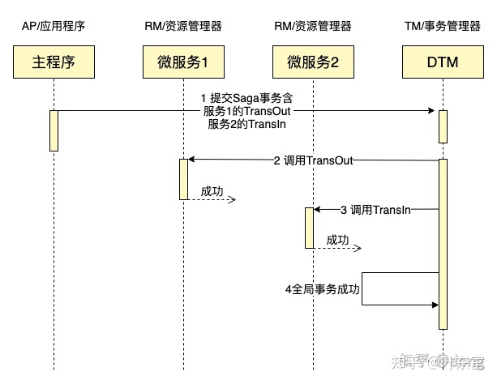
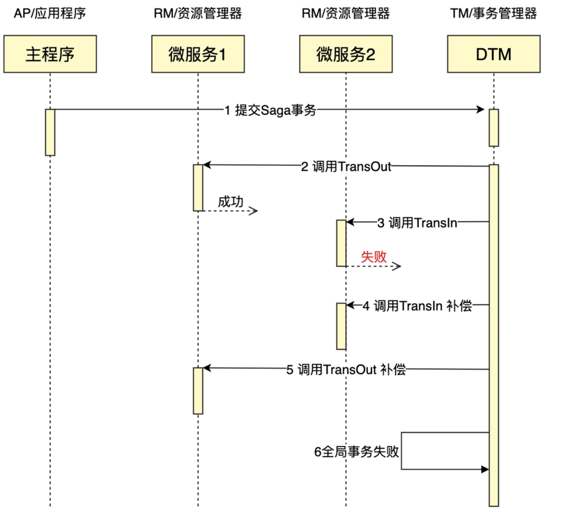
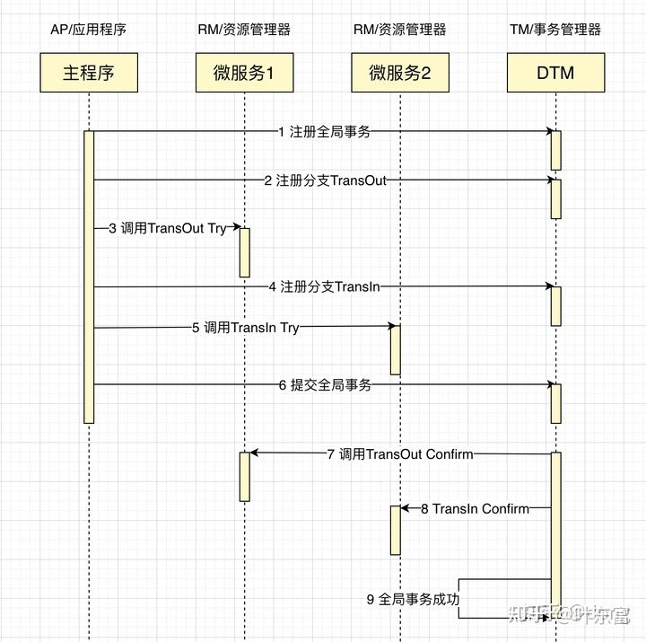
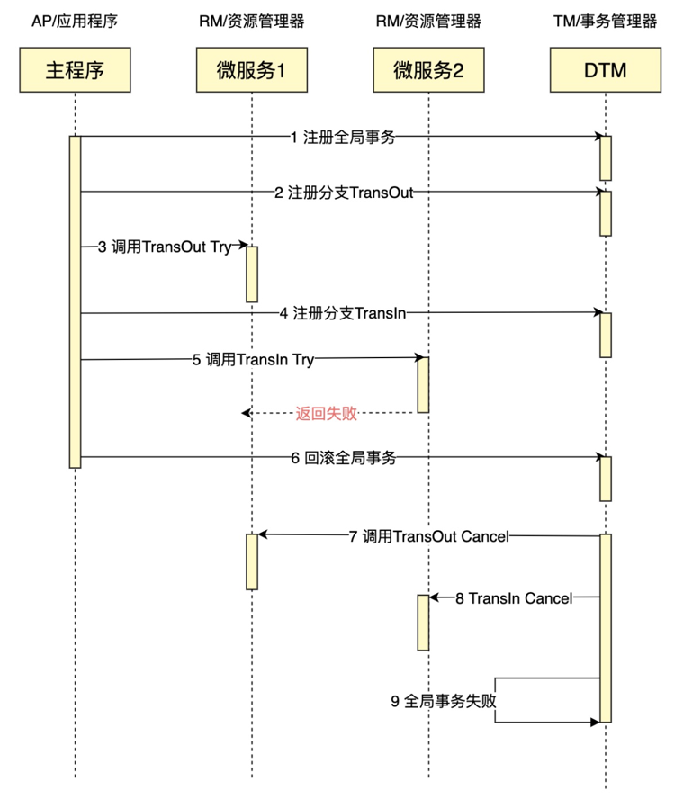
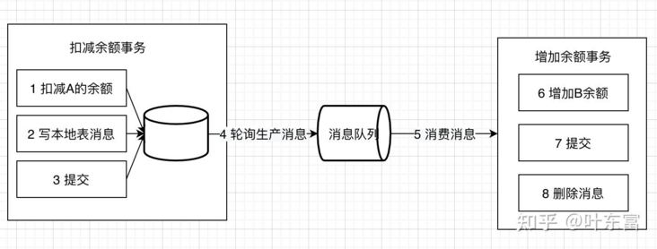
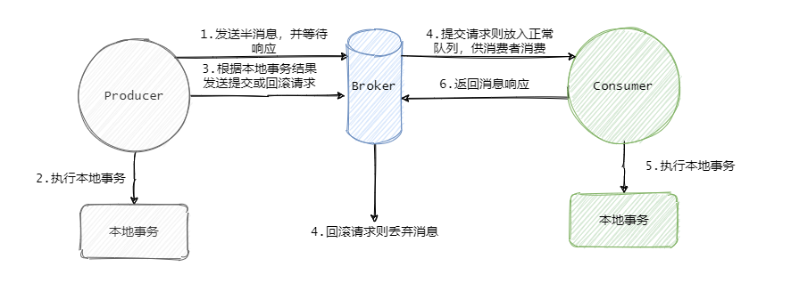
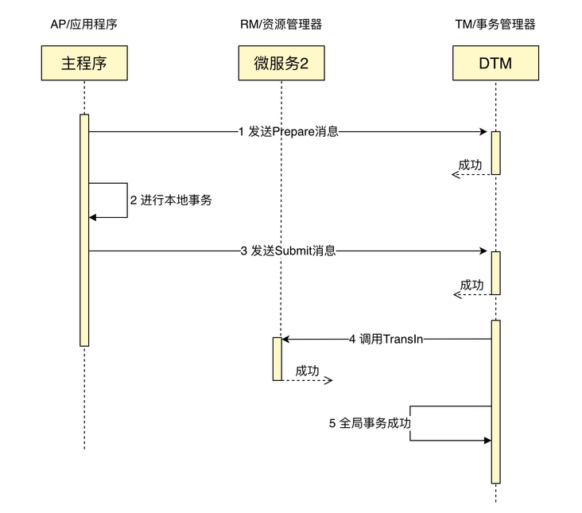
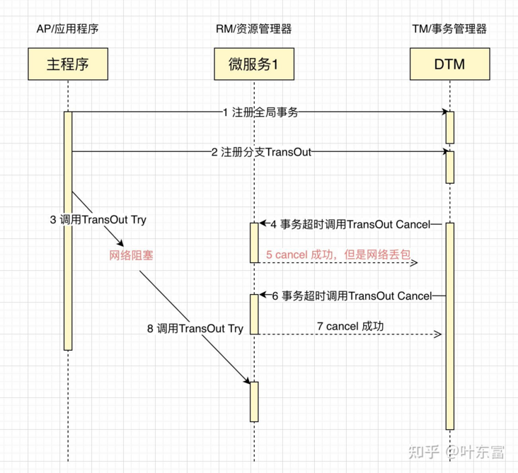
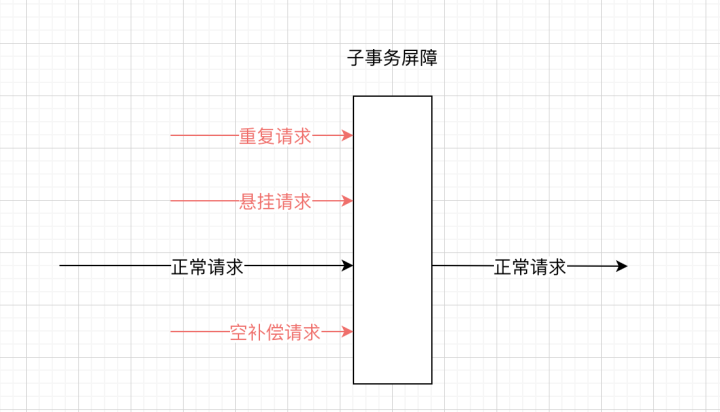

# 分布式事务

课程中介绍的分布式事务不够全面，而网上一些文章说得更详细，就不按照课程来记录了。

以下内容转载修改自[分布式事务最经典的七种解决方案](https://segmentfault.com/a/1190000040321750) ，侵删。

随着业务的快速发展、业务复杂度越来越高，几乎每个公司的系统都会从单体走向分布式，特别是转向微服务架构。随之而来就必然遇到分布式事务这个难题。

这篇文章首先介绍了相关的基础理论，然后总结了最经典的事务方案，最后给出了子事务乱序执行（**幂等、空补偿、悬挂问题**）的解决方案，分享给大家。

## 基础理论

在讲解具体方案之前，我们先了解一下分布式事务所涉及到的基础理论知识。

我们拿转账作为例子，A需要转100元给B，那么需要给A的余额-100元，给B的余额+100元，整个转账要保证，A-100和B+100同时成功，或者同时失败。看看在各种场景下，是如何解决这个问题的。

### 事务

把多条语句作为一个整体进行操作的功能，被称为数据库事务。数据库事务可以确保该事务范围内的所有操作都可以全部成功或者全部失败。

事务具有 4 个属性：原子性、一致性、隔离性、持久性。这四个属性通常称为 ACID 特性。

- Atomicity（原子性）：一个事务中的所有操作，要么全部完成，要么全部不完成，不会结束在中间某个环节。事务在执行过程中发生错误，会被恢复到事务开始前的状态，就像这个事务从来没有执行过一样。
- Consistency（一致性）：在事务开始之前和事务结束以后，数据库的完整性没有被破坏。完整性包括外键约束、应用定义的等约束不会被破坏。
- Isolation（隔离性）：数据库允许多个并发事务同时对其数据进行读写和修改的能力，隔离性可以防止多个事务并发执行时由于交叉执行而导致数据的不一致。
- Durability（持久性）：事务处理结束后，对数据的修改就是永久的，即便系统故障也不会丢失。

假如我们的业务系统不复杂，可以在一个数据库、一个服务内对数据进行修改，完成转账，那么，我们可以利用数据库事务，保证转账业务的正确完成。

### 分布式事务

银行跨行转账业务是一个典型分布式事务场景，假设A需要跨行转账给B，那么就涉及两个银行的数据，无法通过一个数据库的本地事务保证转账的ACID，只能够通过分布式事务来解决。

**分布式事务就是指事务的发起者、资源及资源管理器和事务协调者分别位于分布式系统的不同节点之上**。在上述转账的业务中，用户A-100操作和用户B+100操作不是位于同一个节点上。本质上来说，分布式事务就是为了保证在分布式场景下，数据操作的正确执行。

### CP+HA

分布式事务是在分布式环境下，遵循CAP理论，在CAP三者中只能够三选二，那么分布式事务是那种的组合呢？分布式事务是CP+HA，其中A是没有完全符合，但是能够达到Highly-Available，即高可用。

近些年分布式理论进一步发展，产生了Paxos、Raft等CP的协议，在这基础上，加上硬件稳定性升级，可以在保证CP的情况下，做到高可用。谷歌分布式锁Chubby的公开数据显示，集群能提供99.99958％的平均可用性，一年也就130s的运行中断，已经能够满足非常严苛的应用要求。现在的SQL类数据库软件，都是走CP+HA，只是HA会比谷歌的这个极致数据更低一些，但一般都能够达到4个9。

CP+HA意味着不是BASE，意味着你只要写入成功，那么接下来的读，能够读取到最新的结果，开发人员不用担心读取到的不是最新数据，在多副本读写上面，与单机是一致的。

### ACID

分布式事务会部分遵循 ACID 规范：

- 原子性：严格遵循
- 一致性：事务完成后的一致性严格遵循；事务中的一致性可适当放宽zx
- 隔离性：并行事务间不可影响；事务中间结果可见性允许安全放宽
- 持久性：严格遵循

因为事务过程中，不是一致的，但事务会最终完成，最终达到一致，所以我们把分布式事务称为“最终一致”。

## 分布式事务的解决方案

由于分布式事务方案，无法做到完全的ACID的保证，没有一种完美的方案，能够解决掉所有业务问题。因此在实际应用中，会根据业务的不同特性，选择最适合的分布式事务方案。

### 两阶段提交/XA

XA是由X/Open组织提出的分布式事务的规范，XA规范主要定义了(全局)事务管理器(TM)和(局部)资源管理器(RM)之间的接口。本地的数据库如mysql在XA中扮演的是RM角色。

XA一共分为两阶段：

- 第一阶段（prepare）：即所有的参与者RM准备执行事务并锁住需要的资源。参与者ready时，向TM报告已准备就绪。
- 第二阶段 (commit/rollback)：当事务管理者(TM)确认所有参与者(RM)都ready后，向所有参与者发送commit命令。

目前主流的数据库基本都支持XA事务，包括mysql、oracle、sqlserver、postgres。

XA 事务由一个或多个资源管理器（RM）、一个事务管理器（TM）和一个应用程序（ApplicationProgram）组成。

> 这里的RM、TM、AP三个角色是经典的角色划分，会贯穿后续Saga、Tcc等事务模式。

把上面的转账作为例子，一个成功完成的XA事务时序图如下：


如果有任何一个参与者prepare失败，那么TM会通知所有完成prepare的参与者进行回滚。

XA事务的特点是：

- 简单易理解，开发较容易
- 对资源进行了长时间的锁定，并发度低

如果读者想要进一步研究XA，go语言以及PHP、Python、Java、C#、Node等都可参考[DTM](https://github.com/dtm-labs/dtm)

### SAGA

1987年普林斯顿大学的Hector Garcia-Molina和Kenneth Salem发表了一篇Paper Sagas，讲述的是如何处理long lived transaction（长活事务）。**其核心思想是将长事务拆分为多个本地短事务，由Saga事务协调器协调，如果正常结束那就正常完成，如果某个步骤失败，则根据相反顺序一次调用补偿操作。**

整个SAGA事务的逻辑是：

执行转出成功=>执行转入成功=>全局事务完成。

如果在中间发生错误，例如转入B发生错误，则会调用已执行分支的补偿操作，即：

执行转出成功=>执行转入失败=>执行转入补偿成功=>执行转出补偿成功=>全局事务回滚完成。

把上面的转账作为例子，一个成功完成的SAGA事务时序图如下：



Saga事务的特点：

- 并发度高，不用像XA事务那样长期锁定资源。
- 需要定义正常操作以及补偿操作，开发量比XA大。
- 一致性较弱，对于转账，可能发生A用户已扣款，最后转账又失败的情况。

SAGA 事务失败流程：



SAGA适用的场景较多，长事务适用，对中间结果不敏感的业务场景适用。

#### 总结

首先Saga是针对分布式长活事务的解决方案，针对事务长、多、复杂的情况，特别是服务由多个公司开发具有不可控性，可以使用Saga模式进行分布式事务的处理。Saga在处理事务一致性方面采取了向前恢复和向后恢复策略，前者通过不断重试的方式保证事务完成，而后者通过子事务的补偿事务，逐一回滚的方式让事务标记失败。在分布式协调方面，Saga采用了两种模式：编排和控制。前者让参与者（服务）之间通过消息进行沟通，根据事件出发事务的执行流程，是一种去中心化的模式。后者通过中心控制类，处理事务的执行和回滚步骤，统一调用服务和接受服务的反馈。

更多内容可参考 [10分钟说透Saga分布式事务](https://cloud.tencent.com/developer/article/1839642) 。

如果读者想要进一步研究SAGA，可参考[DTM](https://github.com/dtm-labs/dtm)，里面包括了SAGA成功、失败回滚的例子，还包括各类网络异常的处理。

### TCC

关于 TCC（Try-Confirm-Cancel）的概念，最早是由 Pat Helland 于 2007 年发表的一篇名为《Life beyond Distributed Transactions:an Apostate’s Opinion》的论文提出。

TCC分为3个阶段：

- Try 阶段：尝试执行，完成所有业务检查（一致性）, 预留必须业务资源（准隔离性）。
- Confirm 阶段：确认执行真正执行业务，不作任何业务检查，只使用 Try 阶段预留的业务资源，Confirm 操作要求具备幂等设计，Confirm 失败后需要进行重试。
- Cancel 阶段：取消执行，释放 Try 阶段预留的业务资源。Cancel 阶段的异常和 Confirm 阶段异常处理方案基本上一致，要求满足幂等设计。

把上面的转账作为例子，通常会在Try里面冻结金额，但不扣款，Confirm里面扣款，Cancel里面解冻金额，一个成功完成的TCC事务时序图如下：



TCC的Confirm/Cancel阶段在业务逻辑上是不允许返回失败的，如果因为网络或者其他临时故障，导致不能返回成功，TM会不断的重试，直到Confirm/Cancel返回成功。

TCC 事务失败流程：



TCC特点如下：

- 并发度较高，无长期资源锁定。
- 开发量较大，需要提供Try/Confirm/Cancel接口。
- 一致性较好，不会发生SAGA已扣款最后又转账失败的情况。
- TCC适用于订单类业务，对中间状态有约束的业务。

如果读者想要进一步研究TCC，可参考[DTM](https://github.com/dtm-labs/dtm)。

### 本地消息表

本地消息表这个方案最初是 ebay 架构师 Dan Pritchett 在 2008 年发表给 ACM 的文章。设计核心是将需要分布式处理的任务通过消息的方式来异步确保执行。

大致流程如下：


**写本地消息和业务操作放在一个事务里，保证了业务和发消息的原子性，要么他们全都成功，要么全都失败。**

容错机制：

- 扣减余额事务失败时，事务直接回滚，无后续步骤。
- 轮序生产消息失败， 增加余额事务失败都会进行重试。

本地消息表的特点：

- 不支持整个事务回滚。
- 轮询生产消息难实现，如果定时轮询会延长事务总时长，如果订阅binlog则开发维护困难。

适用于可异步执行的业务，且后续操作无需回滚的业务。

### 事务消息

在上述的本地消息表方案中，生产者需要额外创建消息表，还需要对本地消息表进行轮询，业务负担较重。阿里开源的RocketMQ 4.3之后的版本正式支持事务消息，该事务消息本质上是把本地消息表放到RocketMQ上，解决生产端的消息发送与本地事务执行的原子性问题。

半消息的意思就是这个消息此时对 Consumer 是不可见的，而且也不是存在真正要发送的队列中，而是一个特殊队列。

发送完半消息之后再执行本地事务，再根据本地事务的执行结果来决定是向 Broker 发送提交消息，还是发送回滚消息。

正常发送的流程图如下：



补偿流程：

- 如果发送提交或者回滚消息失败了，Broker 会定时的向 Producer 来反查这个事务是否成功，具体的就是 Producer 需要暴露一个接口，通过这个接口 Broker 可以得知事务到底有没有执行成功，没成功就返回未知，因为有可能事务还在执行，会进行多次查询。
- Producer收到回查消息，返回消息对应的本地事务的状态，为Commit或者Rollback。
- 事务消息方案与本地消息表机制非常类似，区别主要在于原先相关的本地表操作替换成了一个反查接口。

事务消息特点如下：

- 长事务仅需要分拆成多个任务，并提供一个反查接口，使用简单。
- 事务消息的回查没有好的方案，极端情况可能出现数据错误。

适用于可异步执行的业务，后续操作无需回滚的业务，并且对数据实时性要求不高的地方。

更深入可参考 [消息队列之事务消息，RocketMQ 和 Kafka 是如何做的？](https://xie.infoq.cn/article/53240651a2ef7c173f50a3194) （好文推荐）

如果读者想要进一步研究事务消息，可参考[DTM](https://github.com/dtm-labs/dtm)，也可以参考[Rocketmq](https://github.com/apache/rocketmq)

###  二阶段消息（首创）

[DTM](https://github.com/dtm-labs/dtm)首创了一种二阶段消息架构，该架构大大优于本地消息表和事务消息，可以完美替代本地消息表和事务消息。

二阶段消息的工作时序图如下：


对比本地消息表和事务消息，二阶段消息有以下优点：

- 不需要队列，因此不需要消费者，用户就是简单的调用API。
- 二阶段消息也有回查，但是回查是框架自动处理，且保证数据正确。

关于二阶段消息的详情可以参考这里 [二阶段消息](https://dtm.pub/practice/msg.html) 。

### 最大努力通知

发起通知方通过一定的机制最大努力将业务处理结果通知到接收方。具体包括：

有一定的消息重复通知机制。因为接收通知方可能没有接收到通知，此时要有一定的机制对消息重复通知。

消息校对机制。如果尽最大努力也没有通知到接收方，或者接收方消费消息后要再次消费，此时可由接收方主动向通知方查询消息信息来满足需求。

前面介绍的的本地消息表和事务消息都属于可靠消息，与这里介绍的最大努力通知有什么不同？

可靠消息一致性，发起通知方需要保证将消息发出去，并且将消息发到接收通知方，消息的可靠性关键由发起通知方来保证。

最大努力通知，发起通知方尽最大的努力将业务处理结果通知为接收通知方，但是可能消息接收不到，此时需要接收通知方主动调用发起通知方的接口查询业务处理结果，通知的可靠性关键在接收通知方。

解决方案上，最大努力通知需要：

- 提供接口，让接受通知放能够通过接口查询业务处理结果。
- 消息队列ACK机制，消息队列按照间隔1min、5min、10min、30min、1h、2h、5h、10h的方式，逐步拉大通知间隔 ，直到达到通知要求的时间窗口上限。之后不再通知。

最大努力通知适用于业务通知类型，例如微信交易的结果，就是通过最大努力通知方式通知各个商户，既有回调通知，也有交易查询接口。

### AT事务模式

这是阿里开源项目[seata](https://github.com/seata/seata)中的一种事务模式，在蚂蚁金服也被称为FMT。优点是该事务模式使用方式，类似XA模式，业务无需编写各类补偿操作，回滚由框架自动完成，缺点也类似XA，存在较长时间的锁，不满足高并发的场景。从性能的角度看，AT模式会比XA更高一些，但也带来了脏回滚这样的新问题。有兴趣的同学可以参考[seata-AT](http://seata.io/zh-cn/docs/dev/mode/xa-mode.html) 。

## 异常处理

在分布式事务的各个环节都有可能出现网络以及业务故障等问题，这些问题需要分布式事务的业务方做到**防空回滚，幂等，防悬挂**三个特性。

### 异常情况

下面以TCC事务说明这些异常情况：

**空回滚：**

在没有调用 TCC 资源 Try 方法的情况下，调用了二阶段的 Cancel 方法，Cancel 方法需要识别出这是一个空回滚，然后直接返回成功。

出现原因是当一个分支事务所在服务宕机或网络异常，分支事务调用记录为失败，这个时候其实是没有执行Try阶段，当故障恢复后，分布式事务进行回滚则会调用二阶段的Cancel方法，从而形成空回滚。

**幂等**：

由于任何一个请求都可能出现网络异常，出现重复请求，所以所有的分布式事务分支，都需要保证幂等性。

**悬挂：**

悬挂就是对于一个分布式事务，其二阶段 Cancel 接口比 Try 接口先执行。

出现原因是在 RPC 调用分支事务try时，先注册分支事务，再执行RPC调用，如果此时 RPC 调用的网络发生拥堵，RPC 超时以后，TM就会通知RM回滚该分布式事务，可能回滚完成后，Try 的 RPC 请求才到达参与者真正执行。

下面看一个网络异常的时序图，更好的理解上述几种问题


- 业务处理请求4的时候，Cancel在Try之前执行，需要处理空回滚。
- 业务处理请求6的时候，Cancel重复执行，需要幂等。
- 业务处理请求8的时候，Try在Cancel后执行，需要处理悬挂。

面对上述复杂的网络异常情况，目前看到各家建议的方案都是业务方通过唯一键，去查询相关联的操作是否已完成，如果已完成则直接返回成功。相关的判断逻辑较复杂，易出错，业务负担重。幂等处理可以查看 [答面试官问：怎么实现接口幂等性](https://learnku.com/articles/50902)

### 子事务屏障

在项目 DTM 中，出现了一种子事务屏障技术，使用该技术，能够达到这个效果，看示意图：


所有这些请求，到了子事务屏障后：不正常的请求，会被过滤；正常请求，通过屏障。开发者使用子事务屏障之后，前面所说的各种异常全部被妥善处理，业务开发人员只需要关注实际的业务逻辑，负担大大降低。

子事务屏障提供了方法CallWithDB，方法的原型为：

```go
func (bb *BranchBarrier) CallWithDB(db *sql.DB, busiCall BusiFunc) error
```

业务开发人员，在busiCall里面编写自己的相关逻辑，调用该函数。CallWithDB保证，在空回滚、悬挂等场景下，busiCall不会被调用；在业务被重复调用时，有幂等控制，保证只被提交一次。

子事务屏障会管理TCC、SAGA等，也可以扩展到其他领域。

### 子事务屏障原理

子事务屏障技术的原理是，在本地数据库，建立分支事务状态表sub_trans_barrier，唯一键为全局事务id-子事务id-子事务分支名称（try|confirm|cancel），即 gid-branchid-op （globalId-branchId-operation)。

1. 开启本地事务。
2. 对于当前操作op(try|confirm|cancel)，insert ignore一条数据gid-branchid-op，如果插入不成功，提交事务返回成功（常见的幂等控制方法）。（如果插入不成功，说明
3. 如果当前操作是cancel，那么在insert ignore一条数据gid-branchid-try，如果插入成功（注意是成功），则提交事务返回成功。
4. 调用屏障内的业务逻辑，如果业务返回成功，则提交事务返回成功；如果业务返回失败，则回滚事务返回失败。

在此机制下，解决了网络异常相关的问题：

- 空补偿控制--如果Try没有执行，直接执行了Cancel，那么Cancel插入gid-branchid-try会成功，不走屏障内的逻辑，保证了空补偿控制。
- 幂等控制--任何一个分支都无法重复插入唯一键，保证了不会重复执行。
- 防悬挂控制--Try在Cancel之后执行，那么插入的gid-branchid-try不成功，就不执行，保证了防悬挂控制。

对于SAGA等，也是类似的机制。

### 子事务屏障小结

子事务屏障技术，为 DTM 首创，它的意义在于设计简单易实现的算法，提供了简单易用的接口，在首创，它的意义在于设计简单易实现的算法，提供了简单易用的接口，在这两项的帮助下，开发人员彻底的从网络异常的处理中解放出来。

该技术目前需要搭配 DTM 务管理器，目前SDK已经提供给Go、Python、C#、Java语言的开发者。其他语言的sdk正在规划中。对于其他的分布式事务框架，只要提供了合适的分布式事务信息，能够按照上述原理，快速实现该技术。

dtm不仅实现了基于SQL数据库的子事务屏障，还实现了基于Redis、Mongo的子事务屏障，因而能够组合Redis、Mongo、SQL数据库，以及其他支持事务的存储引擎，形成一个全局事务，提供非常大的灵活性。

## 分布式事务实践

我们还有很多文章，通过一个个实际的例子，带您快速上手开发一个分布式事务，其中包括各种语言的版本，如果您有兴趣，可以访问：[dtm 教程](https://dtm.pub/guide/start.html)。

## 总结

本文介绍了分布式事务的一些基础理论，并对常用的分布式事务方案进行了讲解；在文章的后半部分还给出了事务异常的原因、分类以及优雅的解决方案；最后以一个可运行的分布式事务例子，将前面介绍的内容以简短的程序进行演示。

DTM 支持了TCC、XA、SAGA、二阶段消息、最大努力通知（二阶段消息），提供了HTTP、gRPC协议支持，非常容易接入。

DTM 已支持了Python、Java、PHP、C#、Node等语言的客户端，参见：[各语言SDK](https://dtm.pub/summary/code.html#go)。

另外可以参考 [如何选择最适合你的分布式事务方案](https://segmentfault.com/a/1190000040468762) 。