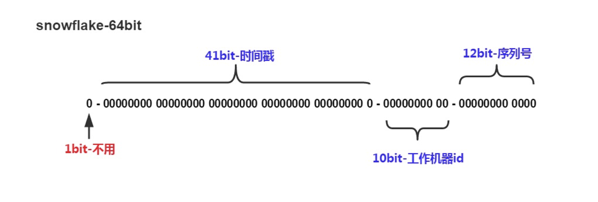
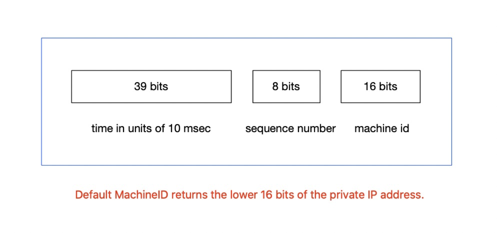
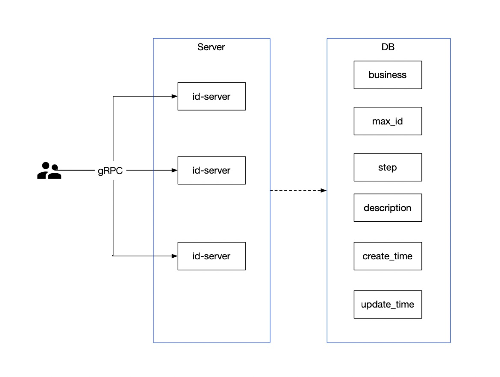
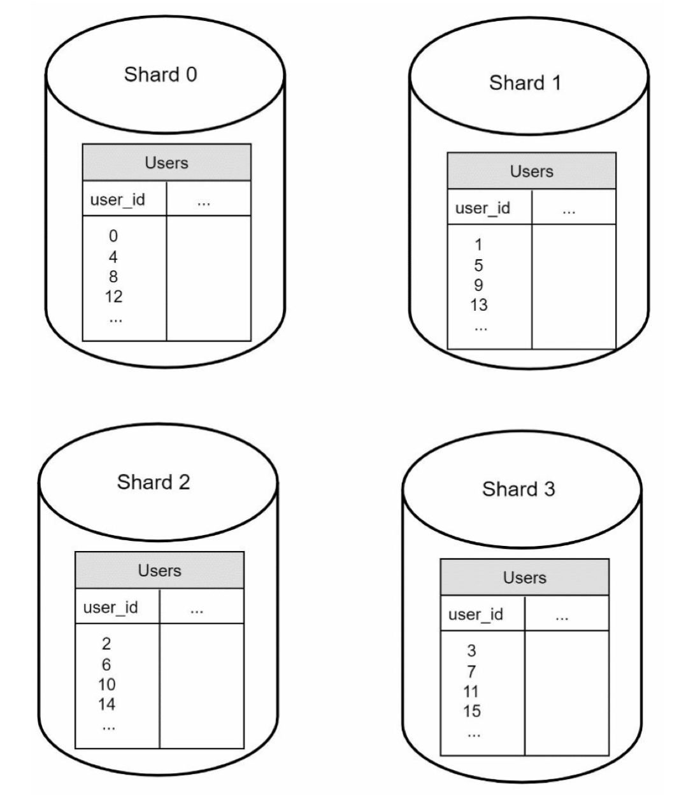
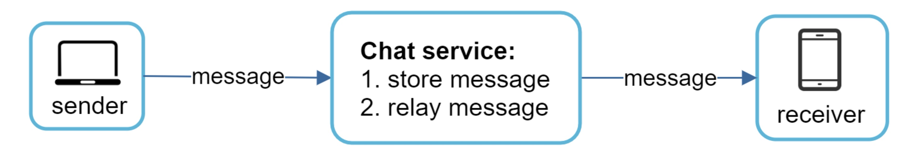
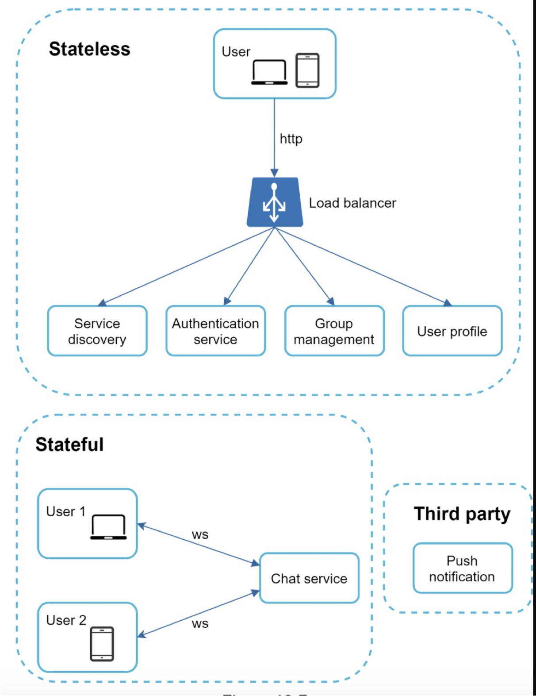
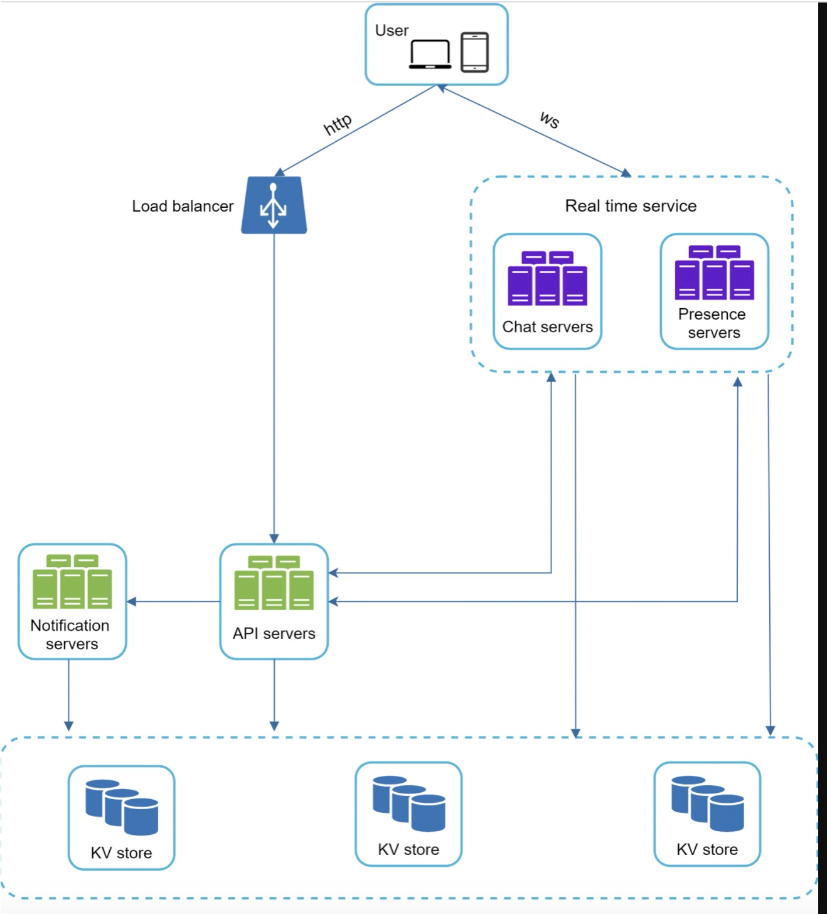
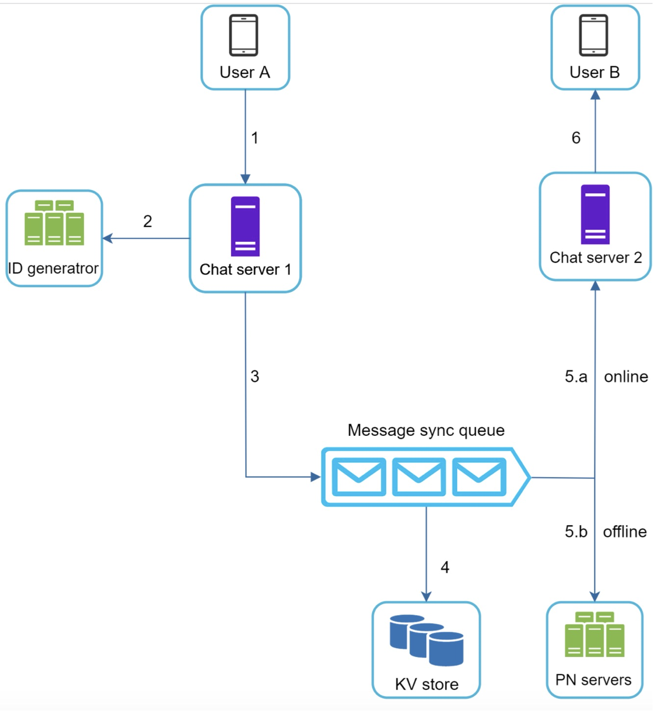
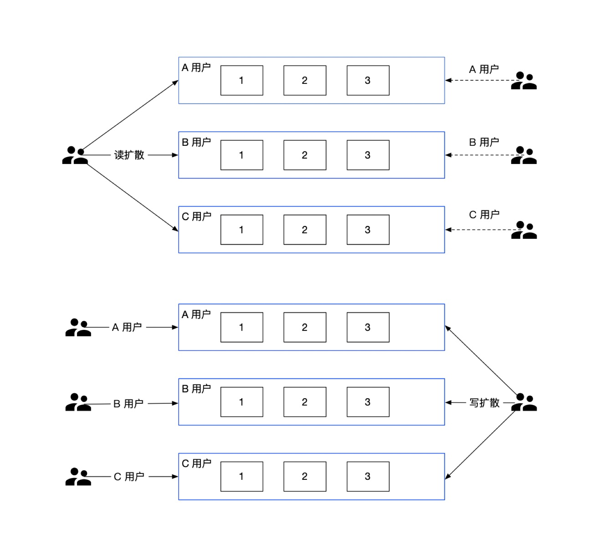
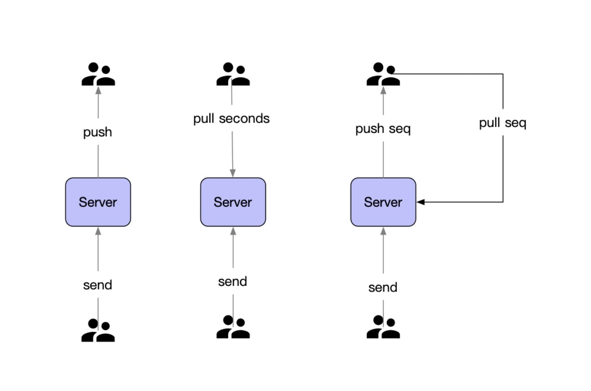

# 发号器& IM 私信系统设计

## 发号器

唯一 ID，需要保证全局唯一，绝对不会出现重复的 ID，且 ID 整体趋势递增。

通常情况下，ID 的设计主要有以下几大类：

- UUID
- 基于 Snowflake 的 ID 生成方式
- 基于申请 DB 步长的生成方式
- 基于数据库多主集群模式
- 基于 Redis 或者 DB 的自增 ID生成方式
- 特殊的规则生成唯一 ID

### snowflake

Snowflake ID组成结构：`正数位`（占1比特）+ `时间戳`（占41比特）+ `机器ID`（占5比特）+ `数据中心`（占5比特）+ `自增值`（占12比特），总共64比特组成的一个Long类型。

- 第一个bit位（1bit）：Java中long的最高位是符号位代表正负，正数是0，负数是1，一般生成ID都为正数，所以默认为0。
- 时间戳部分（41bit）：毫秒级的时间，不建议存当前时间戳，而是用（当前时间戳 - 固定开始时间戳）的差值，可以使产生的ID从更小的值开始；41位的时间戳可以使用69年，(1L << 41) / (1000L * 60 * 60 * 24 * 365) = 69年。
- 工作机器id（10bit）：也被叫做`workId`，这个可以灵活配置，机房或者机器号组合都可以。
- 序列号部分（12bit），自增值支持同一毫秒内同一个节点可以生成4096个ID。

### sonyflake

基本原理和 snowflake 差不多，只是分配给各个位置的位数量不一样。

- 可用时间（174年）比雪花（69年）长。
- 它可以在比 Snowflake (2^10) 更多的分布式机器上工作 (2^16)。
- 它可以在单个机器/线程中每 10 毫秒最多生成 2^8（256） 个 ID（比 Snowflake 慢）。

### 基于步长递增

基于步长递增的分布式 ID 生成器，可以生成基于递增，并且比较小的唯一 ID；

服务主要分为:

- 通过 gRPC 通信，提供 ID 生成接口，并且携带业务标记，为不同业务分配 ID；
- 部署多个 id-server 服务，通过数据库进行申请 ID步长，并且持久化最大的 ID，例如，每次批量取1000到内存中，可减少对 DB 的压力；
- 数据库记录分配的业务 MAX_ID 和对应 Step ，供Sequence 请求获取；

### 基于数据库集群

基于数据库集群模式，在 MySQL 中的双主集群模式采用的是这个方案；

服务主要分为:

- 两个 MySQL 实例都能单独的生产自增ID；
- 设置 ID 起始值和自增步长；

MySQL_1 配置：

- set @@auto_increment_offset = 1;         -- 起始值
- set @@auto_increment_increment = 2;  -- 步长

MySQL_2 配置：

- set @@auto_increment_offset = 2;         -- 起始值

- set @@auto_increment_increment = 2;  -- 步长

  

## IM 私信系统设计

### 基本概念

聊天系统需要满足的功能：

- 1 on 1 （1对1）
- Group chat（群聊）
- Online presence（在线状态）
- Multiple device support（多端同步）
- Push notifications（消息通知）

在聊天系统中，主要是客户端和服务端之间进行通信；

客户端可以是 Android、iOS、Web 应用；

通常客户端之间不会进行直接通信，而是客户端连接到服务端进行通信；

服务端需要支持：

- 接收各个客户端消息
- 消息转发到对应的人
- 用户不在线，存储新消息
- 用户上线，同步所有新消息

#### 实时通信协议

一般来看，移动端基本都是通过长连方式实现，而 Web 端可以使用 HTTP、Websocket 实现实时通信；

常用通信方式：

- TCP
- WebSocket
- HTTP 长轮询
- HTTP 定时轮询

#### 服务类型

如上图，在聊天系统中，有着很多用户、消息功能，比如：

- 登录、注册、用户信息，可以通过 HTTP API 方式；
- 消息、群聊、用户状态，可以通过 实时通信 方式；
- 可能集群一些三方的服务，比如 小米、华为推送、APNs等；

所以，主要服务可为三大类：

- 无状态服务
- 有状态服务
- 第三方集成

### 模块功能

在聊天系统中，Goim 主要角色是 Real time service，实现对 **连接** 和 **状态** 的管理：

可以通过 API servers 进行系统之间的解耦；

各个服务的主要功能为：

- 聊天服务，进行消息的 发送 和 接收。
- 在线状态服务，管理用户 在线 和 离线。
- API 服务处理，用户登录、注册、修改信息。
- 通知服务器，发送推送通知（Notification）。
- 存储服务，通过 KV 进行 存储、查询 聊天信息。

#### 消息发送流程

一对一聊天，主要的消息发送流程：

- 用户 A 向 聊天服务 发送消息给 用户 B
- 聊天服务从生成器获取消息 ID
- 聊天服务将消息发到消息队列
- 消费保存在 KV 存储中
- 如果用户在线，则转发消息给用户
- 如果用户不在线，则转发到通知服务（Notification）

### 设计实现

#### 存储

关系数据库主要进行存储用户信息，好友列表，群组信息，通过主从、分片基本满足；

由于消息存储比较单一，可以通过 KV 存储；

KV 存储消息的好处：

- 水平扩展
- 延迟低
- 访问成本低

比如 RocksDB 等 LSM 树相关的 db。

#### 同步模型

消息同步模型中，有 **写扩散** 和 读扩散 这两种模型。

主要有这两种概念：

- 收件箱（inbox）：该用户收到的消息。
- 发件箱（outbox）：该用户发出的消息。

Timeline 模型：

- 每个消息拥有一个唯一的顺序ID（SequenceID），消息按 SequenceID 排序。
- 新消息写入能自动分配递增的顺序 ID，保证永远插入队尾。
- 支持根据顺序 ID 的随机定位，可根据 SequenceID 随机定位到 Timeline 中的某个位置。因为 id 有序，就可以通过最近的消息 id 去查询后面更新的消息了。

在不同场景，可能选择不同的方式：

读扩散，在 IM 系统里的读扩散通常是每两个相关联的人就有一个信箱，或者每个群一个信箱。

- 优点：写操作（发消息）很轻量，只用写自己信箱。
- 缺点：读操作（读消息）很重，需要读所有人信箱。

写扩散，每个人都只从自己的信箱里读取消息，但写（发消息）的时候需要所有人写一份。

- 优点：读操作很轻量。
- 缺点：写操作很重，尤其是对于群聊来说。

比如说微博的场景，每个人的粉丝没有上限，几百上千万都可以，而关注的人数有上限。这种情况就适合用读扩散方式，大 V 只需要给自己的发件箱里写一条消息，粉丝去自己关注的人发件箱里主动拉消息即可。如果使用写扩散，就需要给几百万粉丝的收件箱都发一条消息，这样必然延迟会很高，而且存储成本也会高很多。

#### 推拉模式

读写扩散其实相对应的就是消息通知的”推拉“模式。

在 IM 系统中，通常会有三种可能的做法：

- 推模式：有新消息时服务器主动推给所有端（iOS、Android、PC 等）。比如说微信私聊，发送消息就可以将消息直接推到对方的收件箱里。
- 拉模式：由前端主动发起拉取消息的请求。比如微博场景，或者微信群聊场景，主动去拉取消息。
- 推拉结合模式：有新消息时服务器会先推一个有新消息的通知给前端，前端接收到通知后就向服务器拉取消息。

以上这些模式可以结合自身业务场景来综合考虑选取。

## 参考

[Leaf：美团分布式ID生成服务开源](https://tech.meituan.com/2019/03/07/open-source-project-leaf.html)

[如何设计一个亿级消息量的 IM 系统](https://xie.infoq.cn/article/19e95a78e2f5389588debfb1c)

[现代IM系统中的消息系统架构 - 模型篇](https://developer.aliyun.com/article/701593)

[现代IM系统中的消息系统架构 - 架构篇](https://developer.aliyun.com/article/698301?spm=a2c6h.12873639.article-detail.67.5f231e8ci7oJsy)

[从无到有：微信后台系统的演进之路](https://www.infoq.cn/article/the-road-of-the-growth-weixin-background)

[Flannel: An Application-Level Edge Cache to Make Slack Scale](https://slack.engineering/flannel-an-application-level-edge-cache-to-make-slack-scale/)

