# Goim 长连接网关项目

## Goim 项目运行

看项目文档里完整部署运行的流程不够清晰，于是参考 [goim编译——bilibili开源聊天室，支持百万用户在线](https://blog.csdn.net/xmcy001122/article/details/106551567) 文章，自己搭建一下编译运行环境。

下载项目：

```shell
git clone https://github.com/Terry-Mao/goim.git
```

### 前置依赖

需要先运行 kafka、redis 中间件，编译注册中心 [Discovery](https://github.com/bilibili/discovery) 。

#### kafka & zookeeper

参考 [Apache Kafka® Quick Start](https://developer.confluent.io/quickstart/kafka-docker/)

##### docker-compose.yaml

```yaml
version: '3'
services:
  zookeeper:
    image: confluentinc/cp-zookeeper:7.0.1
    container_name: zookeeper
    environment:
      ZOOKEEPER_CLIENT_PORT: 2181
      ZOOKEEPER_TICK_TIME: 2000

  broker:
    image: confluentinc/cp-kafka:7.0.1
    container_name: broker
    ports:
    # To learn about configuring Kafka for access across networks see
    # https://www.confluent.io/blog/kafka-client-cannot-connect-to-broker-on-aws-on-docker-etc/
      - "9092:9092"
    depends_on:
      - zookeeper
    environment:
      KAFKA_BROKER_ID: 1
      KAFKA_ZOOKEEPER_CONNECT: 'zookeeper:2181'
      KAFKA_LISTENER_SECURITY_PROTOCOL_MAP: PLAINTEXT:PLAINTEXT,PLAINTEXT_INTERNAL:PLAINTEXT
      KAFKA_ADVERTISED_LISTENERS: PLAINTEXT://localhost:9092,PLAINTEXT_INTERNAL://broker:29092
      KAFKA_OFFSETS_TOPIC_REPLICATION_FACTOR: 1
      KAFKA_TRANSACTION_STATE_LOG_MIN_ISR: 1
      KAFKA_TRANSACTION_STATE_LOG_REPLICATION_FACTOR: 1
```

##### 运行

```shell
docker-compose up -d
```

##### 创建 kafka topic 

goim 配置默认 topic 是 ”goim-push-topic“。

```shell
docker exec broker \
kafka-topics --bootstrap-server broker:9092 \
             --create \
             --topic goim-push-topic
```

##### 测试 kafka

###### 生产者

```shell
docker exec --interactive --tty broker \
kafka-console-producer --bootstrap-server broker:9092 \
                       --topic goim-push-topic
```

###### 消费者

```shell
docker exec --interactive --tty broker \
kafka-console-consumer --bootstrap-server broker:9092 \
                       --topic goim-push-topic \
                       --from-beginning
```

#### redis

```shell
docker run -p 6379:6379 -d redis:latest redis-server
```

#### discovery

还依赖注册中心 [Discovery](https://github.com/bilibili/discovery) 。

##### 编译

```shell
cd $GOPATH/src
git clone https://github.com/bilibili/discovery.git
cd discovery/cmd/discovery
go build
```

build 出来的二进制文件之后会在 Makefile 里拷贝到我们的运行目录里。参考文章里说要将 discover.toml 改成 discover-example.toml 才行，我看代码指定的是 discover.toml ，改成 discover-example.toml 反而报错了，反正不需要这一步。

### 运行 Goim

#### 编译

##### 修改文件

cmd/comet/comet-example.toml（部分修改）：

```toml
    certFile = "examples/cert.pem"
    privateFile = "examples/private.pem"
```

examples/javascript/client.js（部分修改）:

```js
 // var ws = new WebSocket('ws://sh.tony.wiki:3102/sub');
 var ws = new WebSocket('ws://127.0.0.1:3102/sub');
```

examples/javascript/index.html（部分修改）:

```html
<p>curl -d 'mid message' 'http://127.0.0.1:3111/goim/push/mids?operation=1000&mids=123'</p>
<p>curl -d 'room message' 'http://127.0.0.1:3111/goim/push/room?operation=1000&type=live&room=1000'</p>
<p>curl -d 'broadcast message' 'http://127.0.0.1:3111/goim/push/all?operation=1000'</p>
```

Makefile（全部修改）:

```makefile
# Go parameters
GOCMD=GO111MODULE=on go
GOBUILD=$(GOCMD) build
GOTEST=$(GOCMD) test

all: test build
build:
	rm -rf target/
	mkdir target/
	cp cmd/comet/comet-example.toml target/comet.toml
	cp cmd/logic/logic-example.toml target/logic.toml
	cp cmd/job/job-example.toml target/job.toml
	$(GOBUILD) -o target/comet cmd/comet/main.go
	$(GOBUILD) -o target/logic cmd/logic/main.go
	$(GOBUILD) -o target/job cmd/job/main.go
	$(GOBUILD) -o target/examples/javascript/httpd-ws examples/javascript/main.go
	cp $(GOPATH)/src/discovery/cmd/discovery/discovery target/
	cp $(GOPATH)/src/discovery/cmd/discovery/discovery.toml target/discovery.toml
	cp -r examples target/


test:
	$(GOTEST) -v ./...

clean:
	rm -rf target/

run:
	mkdir -p target/log
	nohup target/discovery -conf target/discovery.toml -log.dir="log/discovery"  > target/log/discovery.log &
	nohup target/examples/javascript/httpd-ws > target/log/httpd-ws.log &
	sleep 3
	nohup target/logic -conf=target/logic.toml -region=sh -zone=sh001 -deploy.env=dev -weight=10 2>&1 > target/log/logic.log &
	nohup target/comet -conf=target/comet.toml -region=sh -zone=sh001 -deploy.env=dev -weight=10 -addrs=127.0.0.1 -debug=true 2>&1 > target/log/comet.log &
	nohup target/job -conf=target/job.toml -region=sh -zone=sh001 -deploy.env=dev 2>&1 > target/log/job.log &

stop:
	pkill -f target/examples/javascript/httpd-ws
	rm -rf target/log
	pkill -f target/logic
	pkill -f target/job
	pkill -f target/comet
	pkill -f target/discovery
```

##### 执行命令

```shell
make build
```

之后会生成 target 文件夹：

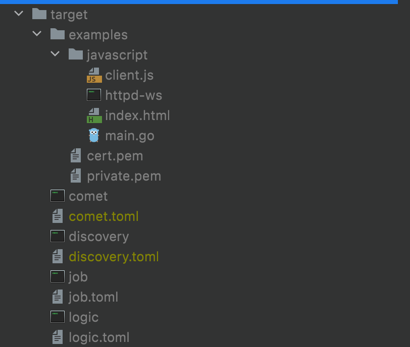

#### 执行

```shell
make run
```

可以使用 ` ps aux|grep target` 查看进程情况。

运行后会创建 target/log 文件夹：

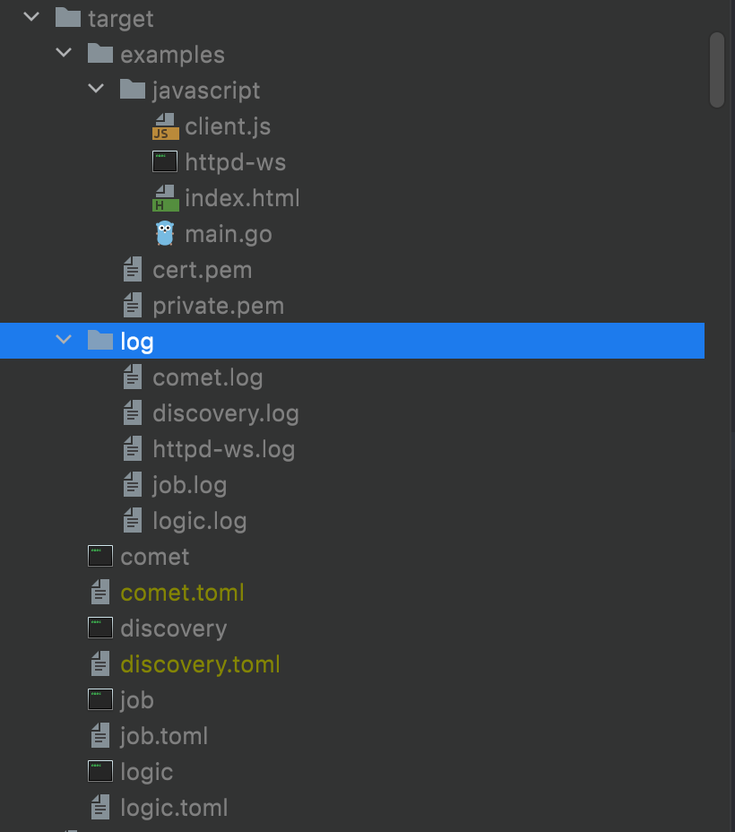

浏览器打开 http://localhost:1999/examples/javascript/ ，可以看到如下页面：

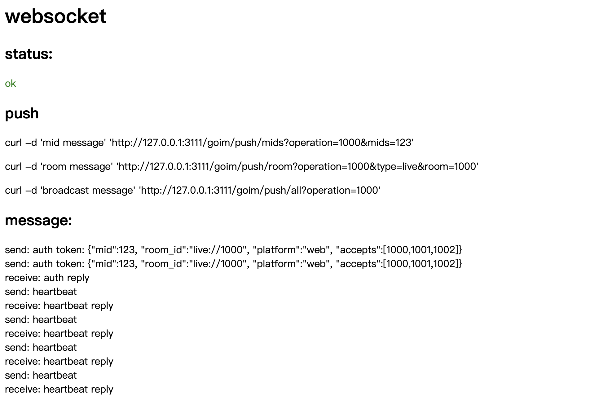

> 如果 status 是 failed ，那么可能是连接 ws 超时，等待一会儿就好了。

运行页面上的命令：

```shell
curl -d 'room message' 'http://127.0.0.1:3111/goim/push/room?operation=1000&type=live&room=1000'
```

页面上会看到如下结果：


再跑一个更复杂的参数请求：

```shell
curl -d '{
    "msg": "hello",
    "msgType": "text",
    "fromId": "123",
    "room": 1000
}' 'http://127.0.0.1:3111/goim/push/room?operation=1000&type=live&room=1000'
```

能看到页面上的结果：


证明已经部署成功。


## Goim 项目解析

### 架构

整体项目架构图：

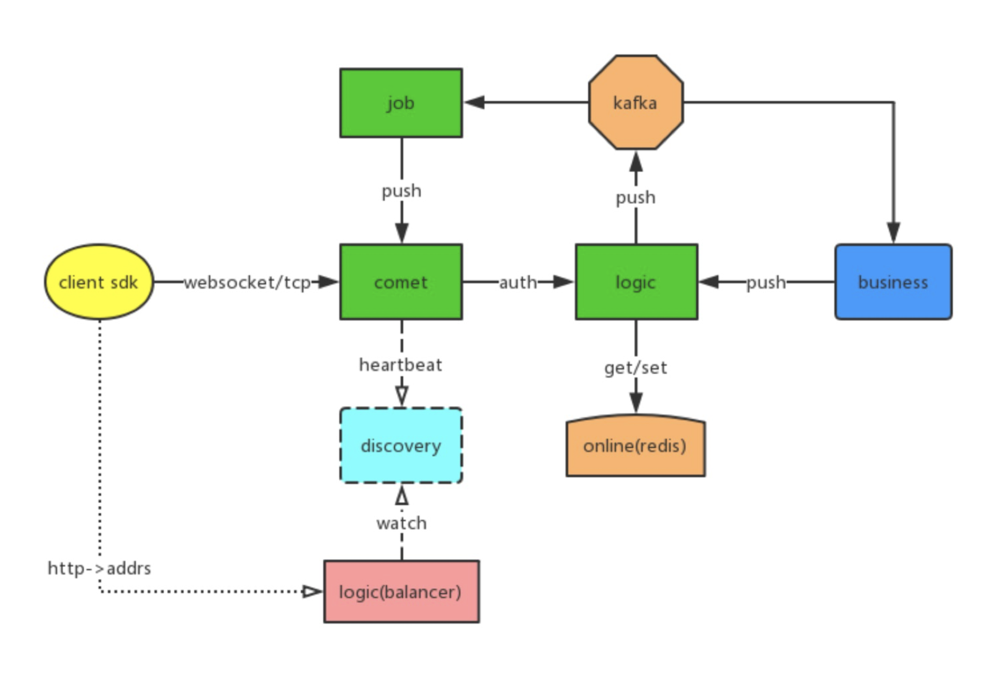

- Comet

  长连接层，主要是监控外网 TCP/Websocket 端口，并且通过设备 ID 进行绑定 Channel 实现，以及实现了 Room 直播等大房间消息广播。

- Logic

  逻辑层，监控连接 Connect、Disconnect 事件，可自定义鉴权，进行记录 Session 信息（设备 ID、ServerID、用户 ID），业务可通过设备 ID、用户 ID、RoomID、全局广播进行消息推送。

- Job

  通过消息队列的进行推送削峰处理，并把消息推送到对应 Comet 节点。

各个模块之间通过 gRPC 进行通信。

api proto 文件定义：

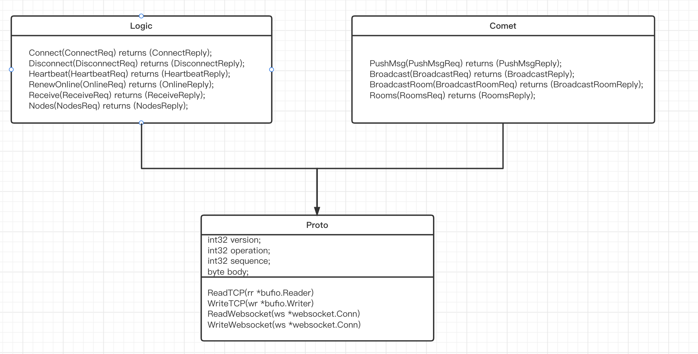

#### Comet

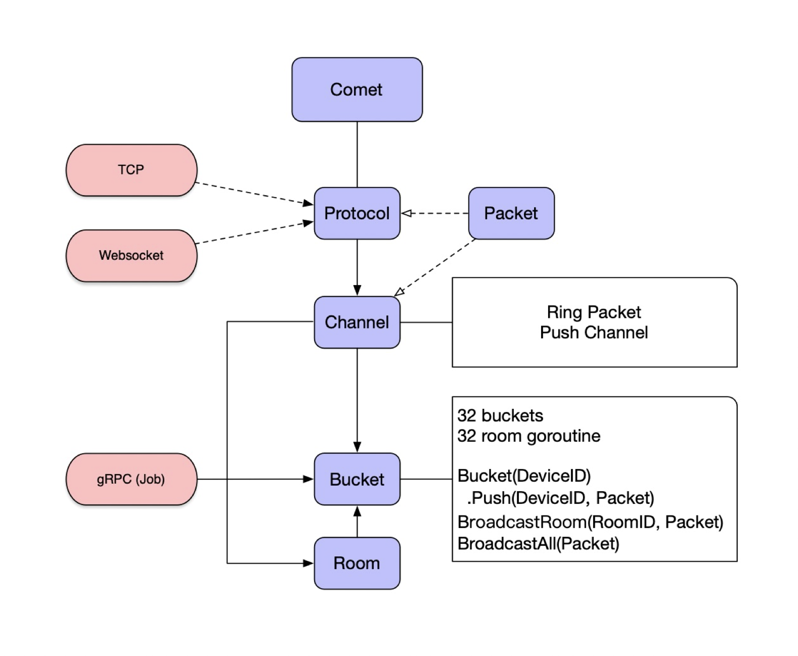

Comet 长连接层，实现连接管理和消息推送：

- Protocol，TCP/Websocket 协议监听；
- Packet，长连接消息包，每个包都有固定长度；
- Channel，消息管道相当于每个连接抽象，最终在 TCP/Websocket 中的封装，进行消息包的读写分发；
- Bucket，连接通过 DeviceID 进行管理，用于读写锁拆散，并且实现房间消息推送，类似 Nginx Worker；
- Room，房间管理通过 RoomID 进行管理，通过链表进行 Channel 遍历推送消息；

##### Protocol 协议设计

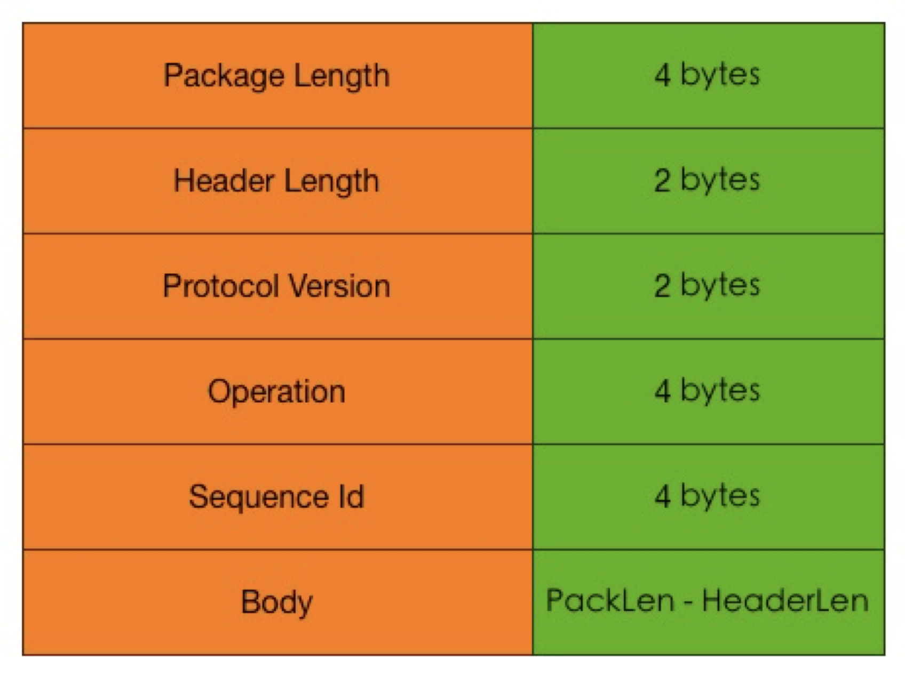

主要以包方式：

- Package Length，包长度
- Header Length，头长度
- Protocol Version，协议版本
- Operation，操作码
- Sequence 请求序号 ID
- Body，包内容

Operation：

- Auth
- Heartbeat
- Message

Sequence：

- 按请求、响应对应递增 ID

##### 节点

Comet 长连接连续节点，通常部署在距离用户比较近，通过 TCP 或者 Websocket 建立连接，并且通过应用层 Heartbeat 进行保活检测，保证连接可用性。

节点之间通过云 VPC 专线通信，按地区部署分布。

国内：

- 华北（北京）
- 华中（上海、杭州）
- 华南（广州、深圳）
- 华西（四川）

国外：

- 香港、日本、美国、欧洲

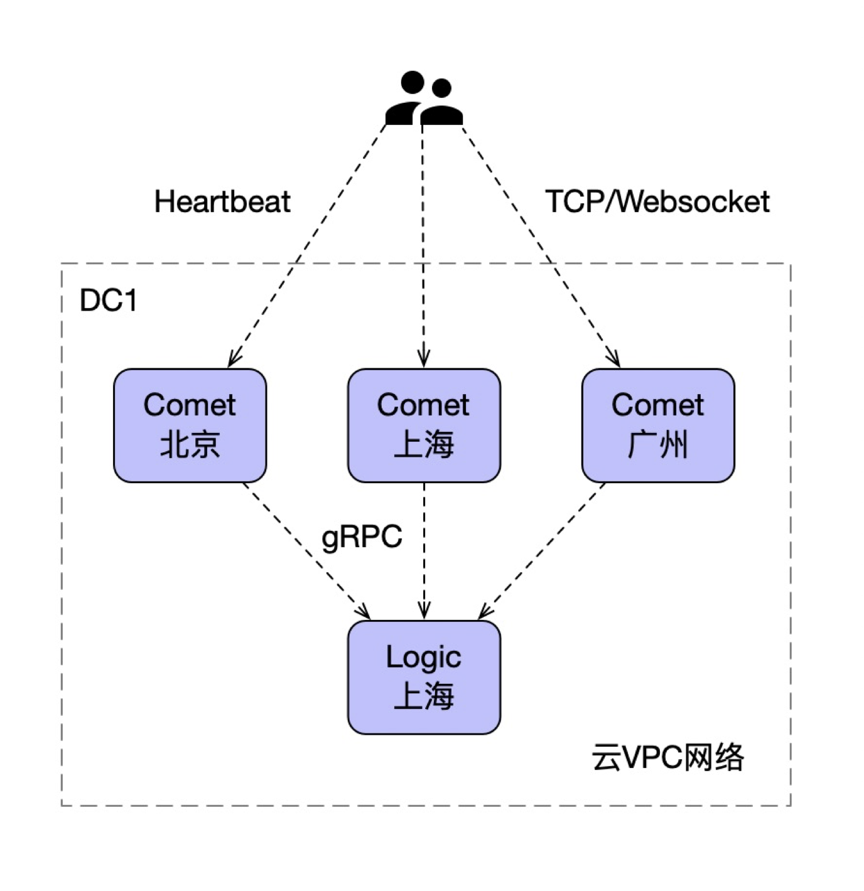

##### 内部实现

```go
// Bucket is a channel holder.
type Bucket struct {
	c     *conf.Bucket
	cLock sync.RWMutex        // protect the channels for chs
	chs   map[string]*Channel // Channel key -> Channel
	// room
	rooms       map[string]*Room // Room id -> Room
	routines    []chan *pb.BroadcastRoomReq // 对所有 room 广播消息的通道数组，默认长度 32
	routinesNum uint64				// 遍历 routines 的索引

	ipCnts map[string]int32		// ip 统计
}

// Room is a room and store channel room info.
type Room struct {
	ID        string
	rLock     sync.RWMutex
	next      *Channel
	drop      bool
	Online    int32 // dirty read is ok
	AllOnline int32
}

// Channel used by message pusher send msg to write goroutine.
type Channel struct {
	Room     *Room
	CliProto Ring
	signal   chan *protocol.Proto
	Writer   bufio.Writer
	Reader   bufio.Reader
	Next     *Channel
	Prev     *Channel

	Mid      int64
	Key      string
	IP       string
	watchOps map[int32]struct{}
	mutex    sync.RWMutex
}
```

- Bucket

  维护当前消息通道和房间的信息，有独立的 Goroutine 和 读写锁优化，用户可以自定义配置对应的 buckets 数量，在大并发业务上尤其明显。

- Room

  结构也比较简单，维护了的房间的双向链表结构的通道 Channel， 推送消息进行了合并写，即 Batch Write, 如果不合并写，每来一个小的消息都通过长连接写出去，系统 Syscall 调用的开销会非常大，Pprof 的时候会看到网络 Syscall 是大头。

- Channel

  一个连接通道。Writer/Reader 就是对网络 Conn 的封装，cliProto 是一个 Ring Buffer，保存 Room 广播或是直接发送过来的消息体。

#### Logic

##### 架构

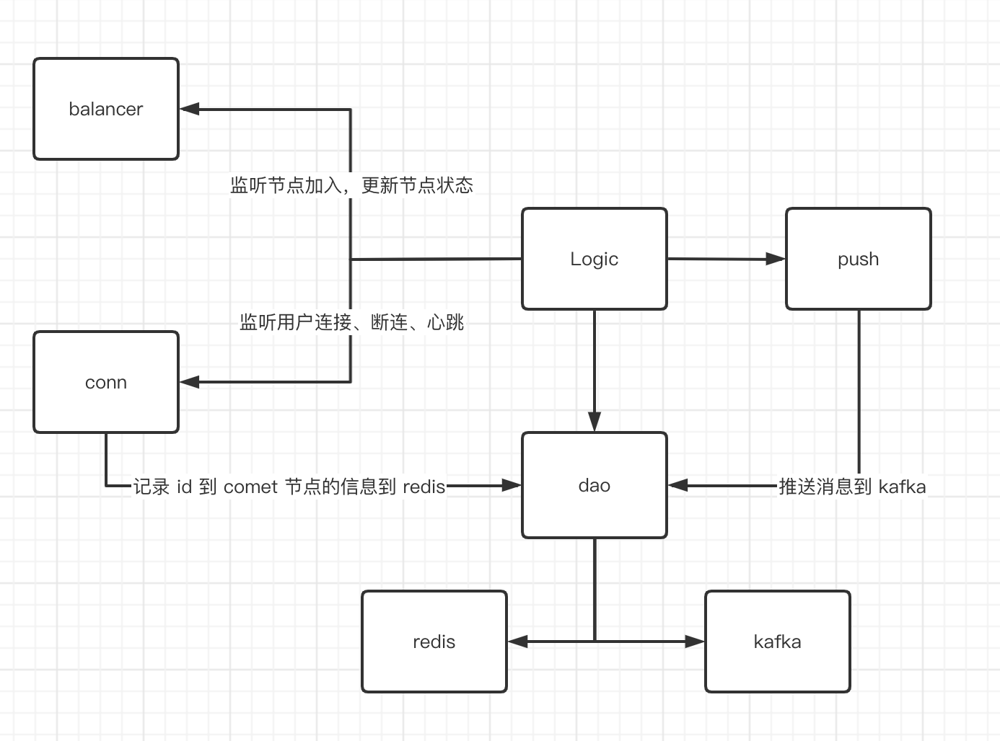

Logic 业务逻辑层，处理连接鉴权、消息路由，用户会话管理。监控连接 Connect、Disconnect 事件，可自定义鉴权，进行记录 Session 信息（设备 ID、ServerID、用户 ID），业务可通过设备 ID、用户 ID、RoomID、全局广播进行消息推送。

##### 负载均衡

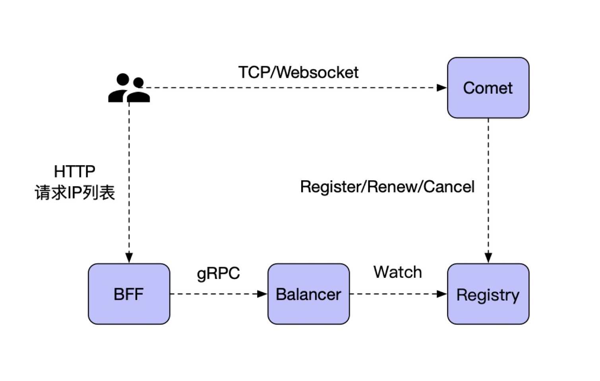

长连接负载均衡比较特殊，需要按一定的负载算法进行分配节点，可以通过 HTTPDNS 方式，请求获致到对应的节点 IP 列表，例如，返回固定数量 IP，按一定的权重或者最少连接数进行排序，客户端通过 IP 逐个重试连接；

- Comet 注册 IP 地址，以及节点权重，定时更新当前节点连接数量；
- Balancer 按地区经纬度计算，按最近地区（经纬度）提供 Comet 节点 IP 列表，以及权重计算排序；
- BFF 返回对应的长连接节点 IP，客户端可以通过 IP直接连；
- 客户端按返回 IP 列表顺序，逐个连接尝试建立长连接。

##### 心跳保活机制

长连接断开的原因：

- 长连接所在进程被杀死
- NAT 超时
- 网络状态发生变化，如移动网络 & Wifi 切换、断开、重连
- 其他不可抗因素（网络状态差、DHCP 的租期等等 ）

高效维持长连接方案:

- 进程保活（防止进程被杀死）
- 心跳保活（阻止 NAT 超时）
- 断线重连（断网以后重新连接网络）

自适应心跳时间:

- 心跳可选区间，[min=60s，max=300s]
- 心跳增加步长，step=30s
- 心跳周期探测，success=current + step、fail=current - step


##### 用户鉴权和 Session 信息

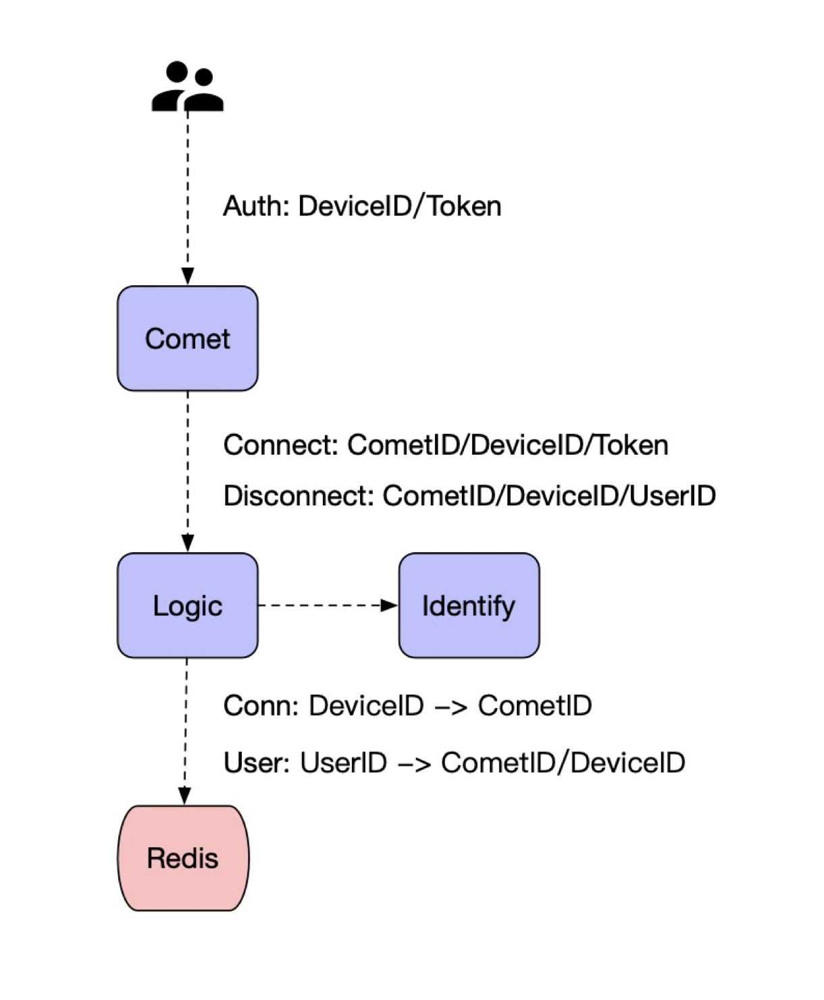

用户鉴权，在长连接建立成功后，需要先进行连接鉴权，并且绑定对应的会话信息；

Connect，建立连接进行鉴权，保存 Session 信息：

- DeviceID，设备唯一 ID
- Token，用户鉴权 Token，认证得到用户 ID
- CometID，连接所在 comet 节点

Disconnect，断开连接，删除对应 Session 信息：

- DeviceID，设备唯一 ID
- CometID，连接所在 Comet 节点
- UserID，用户 ID

Session，会话信息通过 Redis 保存连接路由信息：

- 连接维度，通过 设备 ID 找到所在 Comet 节点
- 用户维度，通过 用户 ID 找到对应的连接和 Comet 所在节点

##### 内部实现

```go
// Logic struct
type Logic struct {
	c   *conf.Config
	dis *naming.Discovery		// 注册中心
	dao *dao.Dao						// kafka、redis 集成
	// online
	totalIPs   int64
	totalConns int64
	roomCount  map[string]int32
	// load balancer 通过 discovery 来做负载均衡
	nodes        []*naming.Instance
	loadBalancer *LoadBalancer
	regions      map[string]string // province -> region
}
```


#### Job

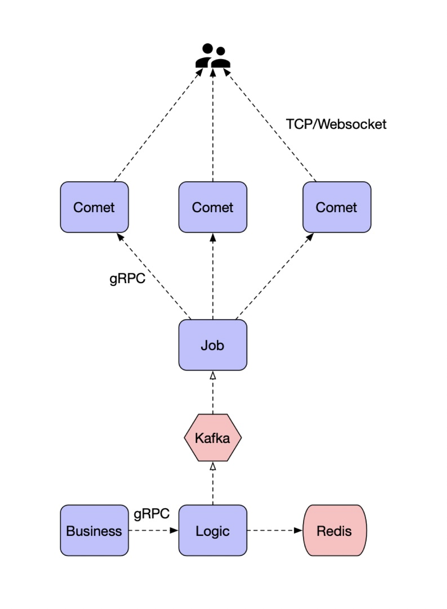

业务通过对应的推送方式，可以对连接设备、房间、用户 ID 进行推送，通过 Session 信息定位到所在的 Comet 连接节点，并通过 Job 推送消息；

通过 Kafka 进行推送削峰，保证消息逐步推送成功；

支持的多种推送方式：

- Push(DeviceID, Message)
- Push(UserID, Message)
- Push(RoomID, Message)
- Push(Message)


### 优化

1. 模块优化，尽可能的拆分锁的粒度，来减少资源竞态。
2. 内存管理方面，通过申请一个大内存，然后拆成所需的数据类型，自己进行管理，来减少频繁申请与销毁内存操作对性能的损耗。
3. 充分利用 goroutine 和 channel 实现高并发。
4. 合理应用缓冲，提供读写性能。


#### 模块优化

模块优化也分为以下几个方面

- 消息分发一定是并行的并且互不干扰：

  要保证到每一个 Comet 的通讯通道必须是相互独立的，保证消息分发必须是完全并列的，并且彼此之间互不干扰。

- 并发数一定是可以进行控制的：

  每个需要异步处理开启的 Goroutine（Go 协程）都必须预先创建好固定的个数，如果不提前进行控制，那么 Goroutine 就随时存在爆发的可能。

- 全局锁一定是被打散的：

  Socket 链接池管理、用户在线数据管理都是多把锁；打散的个数通常取决于 CPU，往往需要考虑 CPU 切换时造成的负担，并非是越多越好。

比如通过 bucket 来拆分 TCP 链接，每个 TCP 连接根据一定的规则划分到不同的 bucket 中进行管理，而不是集中到单个bucket 中，这样锁的粒度更小，资源竞态几率就更低，性能也能更好的提升，不需要将时间花费在等锁上。用户可以自定义配置对应的 buckets 数量，在大并发业务上尤其明显。

```go
//internal/comet/server.go
//初始化 Server，生成多个 bucket.
func NewServer(c *conf.Config) *Server {
....
	s.buckets = make([]*Bucket, c.Bucket.Size)
	s.bucketIdx = uint32(c.Bucket.Size)
	for i := 0; i < c.Bucket.Size; i++ {//生成多个bucket
		s.buckets[i] = NewBucket(c.Bucket)
	}
	...
}
//根据 subKey 获取 bucket，将不同的 TCP 分配到不同的 bucket 进行管理。 
func (s *Server) Bucket(subKey string) *Bucket {
	idx := cityhash.CityHash32([]byte(subKey), uint32(len(subKey))) % s.bucketIdx
	if conf.Conf.Debug {
		log.Infof("%s hit channel bucket index: %d use cityhash", subKey, idx)
	}
	return s.buckets[idx]
}
/*
 广播消息通过循环 Buckets, 每个 bucket 有自己的锁，通过拆分锁的粒度，来减少锁的竞态，提高性能。
*/
func (s *server) Broadcast(ctx context.Context, req *pb.BroadcastReq) (*pb.BroadcastReply, error) {
....
	go func() {
		for _, bucket := range s.srv.Buckets() {
			bucket.Broadcast(req.GetProto(), req.ProtoOp)
			if req.Speed > 0 {
				t := bucket.ChannelCount() / int(req.Speed)
				time.Sleep(time.Duration(t) * time.Second)
			}
		}
	}()
	...
}
```

#### 内存管理

内存优化主要几个方面

- 一个消息一定只有一块内存：

  使用 Job 聚合消息，Comet 指针引用。

- 一个用户的内存尽量放到栈上：

  内存创建在对应的用户 Goroutine 中。

- 内存由自己控制：

  主要是针对 Comet 模块所做的优化，可以查看模块中各个分配内存的地方，都使用了内存池。

在 comet 模块， round(internal/comet/round.go) 中，会一次性申请足够的读缓冲和写缓存以及定时器，通过一个空闲链表中进行维护。每个 TCP 连接需要的时候，就从这些空闲链表获得，使用完之后放回去。对于 TCP 读 goroutine 中，每个 TCP 有一个 proto 缓冲(ring)，通过环形数组实现。

```go
// internal/comet/server.go

// NewRound 根据配置，提前申请各种数据类型，以备使用。
func NewServer(c *conf.Config) *Server {
	s := &Server{
		c:         c,
		round:     NewRound(c),
		rpcClient: newLogicClient(c.RPCClient),
	}
...
}

// internal/comet/server_tcp.go

// 每个 tcp 连接从 round 获取一个 Timer、Reader、Writer
func serveTCP(s *Server, conn *net.TCPConn, r int) {
	var (
		tr = s.round.Timer(r)
		rp = s.round.Reader(r)
		wp = s.round.Writer(r)
...
	)
	s.ServeTCP(conn, rp, wp, tr)
}

// 每个 tcp 连接通过 ring(internal/comet/ring.go) 生成一个 proto 类型的环形数组，用于读取数据。
func (s *Server) ServeTCP(conn *net.TCPConn, rp, wp *bytes.Pool, tr *xtime.Timer) {
  ...
  var (	
    ch      = NewChannel(s.c.Protocol.CliProto, s.c.Protocol.SvrProto) // 环形数组
  )
  ...
  // 读取数据过程，先从环形数组中获得一个 proto，然后将数据写入 proto
  if p, err = ch.CliProto.Set(); err != nil {
    break
  }
  if err = p.ReadTCP(rr); err != nil {
    break
  }
}

// internal/comet/ring.go

// Set get a proto to write.
func (r *Ring) Set() (proto *protocol.Proto, err error) {
	if r.wp-r.rp >= r.num {
		return nil, errors.ErrRingFull
	}
	proto = &r.data[r.wp&r.mask]
	return
}


// internal/comet/round.go
type Round struct {
	readers []bytes.Pool
	writers []bytes.Pool
	timers  []time.Timer
	options RoundOptions
}

func NewRound(c *conf.Config) (r *Round) {
....
	// reader
	r.readers = make([]bytes.Pool, r.options.Reader) //生成 N 个缓存池
	for i = 0; i < r.options.Reader; i++ { 
		r.readers[i].Init(r.options.ReadBuf, r.options.ReadBufSize)
	}
	// writer
	r.writers = make([]bytes.Pool, r.options.Writer)
	for i = 0; i < r.options.Writer; i++ {
		r.writers[i].Init(r.options.WriteBuf, r.options.WriteBufSize)
	}
	// timer
	r.timers = make([]time.Timer, r.options.Timer)
	for i = 0; i < r.options.Timer; i++ {
		r.timers[i].Init(r.options.TimerSize)
	}
	...
}


// pkg/bytes/buffer.go

// Pool is a buffer pool.
type Pool struct {
	lock sync.Mutex
	free *Buffer
	max  int
	num  int
	size int
}

// Buffer buffer.
type Buffer struct {
	buf  []byte
	next *Buffer // next free buffer
}

// Bytes bytes.
func (b *Buffer) Bytes() []byte {
	return b.buf
}

// grow grow the memory buffer size, and update free pointer.
func (p *Pool) grow() {
	var (
		i   int
		b   *Buffer
		bs  []Buffer
		buf []byte
	)
  // 每次都会重新分配一大块内存，将 p.free 指向链表头结点
	buf = make([]byte, p.max)
	bs = make([]Buffer, p.num)
	p.free = &bs[0]
	b = p.free
	for i = 1; i < p.num; i++ {
		b.buf = buf[(i-1)*p.size : i*p.size]
		b.next = &bs[i]
		b = b.next
	}
	b.buf = buf[(i-1)*p.size : i*p.size]
	b.next = nil
}

// Get get a free memory buffer.
func (p *Pool) Get() (b *Buffer) {
	p.lock.Lock()
	if b = p.free; b == nil {
		p.grow()
		b = p.free
	}
  // 将 p.free 移到链表的下一个节点
	p.free = b.next
	p.lock.Unlock()
	return
}

// Put put back a memory buffer to free.
func (p *Pool) Put(b *Buffer) {
	p.lock.Lock()
	b.next = p.free
	p.free = b
	p.lock.Unlock()
}
```

#### goroutine 和 channel 实现高并发

##### comet-bucket

比如 comet 对于推送 room 消息， 每个 bucket 将推送通道分成 32（RoutineAmount） 个，每个通道 1024（RoutineSize） 长度。每个通道由一个 goroutine 进行消费处理。

推送 room  消息的时候，依次推送到这 32 个通道中。这样做能提高 bucket 内部的并发度，不至于一个通道堵塞，导致全部都在等待。 

```go
//internal/comet/bucket.go
//每个bucket 生成 RoutineAmount 个 Channel, 每个 Channel 由一个 roomproc 处理。
func NewBucket(c *conf.Bucket) (b *Bucket) {
	b.routines = make([]chan *pb.BroadcastRoomReq, c.RoutineAmount)
	for i := uint64(0); i < c.RoutineAmount; i++ {
		c := make(chan *pb.BroadcastRoomReq, c.RoutineSize)
		b.routines[i] = c
		go b.roomproc(c)
	}
	return
}
func (b *Bucket) roomproc(c chan *pb.BroadcastRoomReq) {
	for {
		arg := <-c
		if room := b.Room(arg.RoomID); room != nil {
			room.Push(arg.Proto)
		}
	}
}

//将消息轮询发送到 routines 中。
func (b *Bucket) BroadcastRoom(arg *pb.BroadcastRoomReq) {
	num := atomic.AddUint64(&b.routinesNum, 1) % b.c.RoutineAmount
	b.routines[num] <- arg
}
```

##### job-comet

同时 job comet 中也充分利用 goroutine 和 channel，在 Job 中 通过 grpcClient，将每个 comet 区分不同的消息推送通道。

```go
// internal/job/comet.go

// NewComet new a comet.
func NewComet(in *naming.Instance, c *conf.Comet) (*Comet, error) {
	cmt := &Comet{
		serverID:      in.Hostname,
		pushChan:      make([]chan *comet.PushMsgReq, c.RoutineSize),
		roomChan:      make([]chan *comet.BroadcastRoomReq, c.RoutineSize),
		broadcastChan: make(chan *comet.BroadcastReq, c.RoutineSize),
		routineSize:   uint64(c.RoutineSize),
	}
	var grpcAddr string
	for _, addrs := range in.Addrs {
		u, err := url.Parse(addrs)
		if err == nil && u.Scheme == "grpc" {
			grpcAddr = u.Host
		}
	}
	if grpcAddr == "" {
		return nil, fmt.Errorf("invalid grpc address:%v", in.Addrs)
	}
	var err error
	if cmt.client, err = newCometClient(grpcAddr); err != nil {
		return nil, err
	}
	cmt.ctx, cmt.cancel = context.WithCancel(context.Background())

	for i := 0; i < c.RoutineSize; i++ {
		cmt.pushChan[i] = make(chan *comet.PushMsgReq, c.RoutineChan)
		cmt.roomChan[i] = make(chan *comet.BroadcastRoomReq, c.RoutineChan)
		go cmt.process(cmt.pushChan[i], cmt.roomChan[i], cmt.broadcastChan)
	}
	return cmt, nil
}


// Push push a user message.
func (c *Comet) Push(arg *comet.PushMsgReq) (err error) {
	idx := atomic.AddUint64(&c.pushChanNum, 1) % c.routineSize
	c.pushChan[idx] <- arg
	return
}

// BroadcastRoom broadcast a room message.
func (c *Comet) BroadcastRoom(arg *comet.BroadcastRoomReq) (err error) {
	idx := atomic.AddUint64(&c.roomChanNum, 1) % c.routineSize
	c.roomChan[idx] <- arg
	return
}

// Broadcast broadcast a message.
func (c *Comet) Broadcast(arg *comet.BroadcastReq) (err error) {
	c.broadcastChan <- arg
	return
}

```

- pushChan：推送单聊消息的通道，分为 RoutineChan 组，依次将消息推送到这些组中，每个组有自己的 goroutine, 来提高并发性。
- roomChan：推送群聊消息的通道，分为 RoutineChan 组，依次将消息推送的这些组中，每个组有自己的 goroutine, 来提高并发性。

- broadcastChan：广播消息。


开启 RoutineSize 个 goroutine, 每个 goroutine 分别处理单聊、群聊和广播消息。

#### 合理应用缓冲，提高读写性能

在 job 推送 room 消息时，并非在收到消息的时候就推送到 comet，是是通过一定的策略实现批量推送，来提高读写性能。 推送消息进行了合并写，即 Batch Write，如果不合并写，每来一个小的消息都通过长连接写出去，系统 Syscall 调用的开销会非常大，Pprof 的时候会看到网络 Syscall 是大头。

对于某个 room 消息而言，会开启一个 goroutine 来处理并开启了写缓冲机制，按批次进行发送。接收到消息之后，不是马上发送，而是进行缓冲，等待一段时间，看看还有没有消息。推送的条件一是已经达到了最大批次数（即接收到的消息个数到达了最大批次数），二是超时。如果长时间没有消息，会销毁这个 room。

```go
// internal/job/room.go

// NewRoom new a room struct, store channel room info.
func NewRoom(job *Job, id string, c *conf.Room) (r *Room) {
	r = &Room{
		c:     c,
		id:    id,
		job:   job,
    // 消息缓冲通道
		proto: make(chan *protocol.Proto, c.Batch*2),
	}
	go r.pushproc(c.Batch, time.Duration(c.Signal))
	return
}

// pushproc merge proto and push msgs in batch.
func (r *Room) pushproc(batch int, sigTime time.Duration) {
	var (
    // 接收到的消息数目，也是批次数目
		n    int
		last time.Time
		p    *protocol.Proto
    // 构造一个 4096 字节大小的缓冲区
		buf  = bytes.NewWriterSize(int(protocol.MaxBodySize))
	)
	log.Infof("start room:%s goroutine", r.id)
	td := time.AfterFunc(sigTime, func() {
		select {
		case r.proto <- roomReadyProto:
		default:
		}
	})
	defer td.Stop()
	for {
    // 终止循环信号
		if p = <-r.proto; p == nil {
			break // exit
		} else if p != roomReadyProto {
			// merge buffer ignore error, always nil
			p.WriteTo(buf)
      // n == 1 就是重新开始写一个缓冲区
			if n++; n == 1 {
        // 记录第一次写到缓冲区的时间
				last = time.Now()
        // 重置 sigTime 的等待时间
				td.Reset(sigTime)
				continue
			} else if n < batch {
				if sigTime > time.Since(last) {
					continue
				}
			}
      // 如果 n >= batch，即超过最大批次数，或者 sigTime <= time.Since(last)，即超时，就会批量推送消息。
		} else {
      // 如果一段时间内没有任何消息到来，那么就终止循环删掉 room，可能这个 room 没什么人，就不一直占用资源了
			if n == 0 {
				break
			}
		}
    // 广播消息到 room
		_ = r.job.broadcastRoomRawBytes(r.id, buf.Buffer())
		// TODO use reset buffer
		// after push to room channel, renew a buffer, let old buffer gc
		buf = bytes.NewWriterSize(buf.Size())
		n = 0
    // 设置一个空闲时间，之后发送 roomReady 的消息，如果发送了这个消息 n 还是等于 0，即上面 if n == 0 的条件，那么就销毁 room
		if r.c.Idle != 0 {
			td.Reset(time.Duration(r.c.Idle))
		} else {
			td.Reset(time.Minute)
		}
	}
	r.job.delRoom(r.id)
	log.Infof("room:%s goroutine exit", r.id)
}

```

#### 总结

优化项：

1. 拆分职能、可以做到各个模块的扩缩容。拆分粒度，减少竞态和性能损耗。
2. 更巧妙的方式去使用内存来减少频繁申请和销毁内存的性能损耗。
3. 充分利用语言特性实现高并发。
4. 合理应用缓冲提高读写性能。

