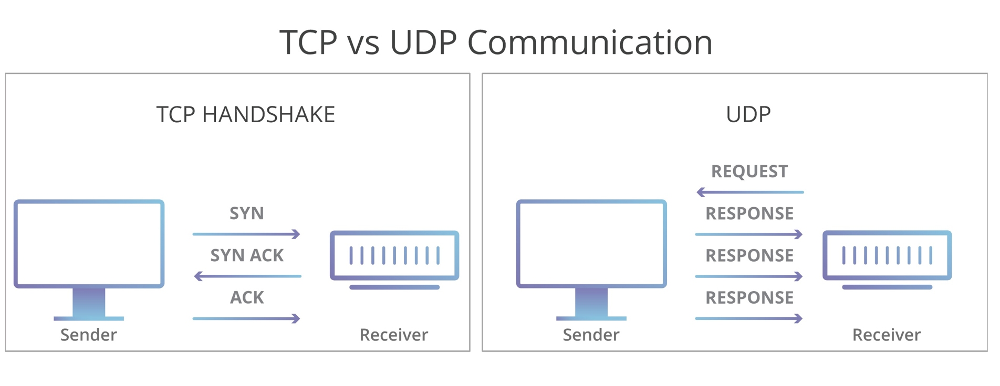

# 网络通信协议

本节课主要是快速过一下一些基本的网络协议和概念，具体更深层的底层原理还需要单独去学习。

## 网络通信协议

互联网的核心是一系列协议，总称为”互联网协议”（Internet Protocol Suite），正是这一些协议规定了电脑如何连接和组网。

主要协议分为：

- Socket

  ​	接口抽象层。

- TCP / UDP

  ​	面向连接(可靠) / 无连接(不可靠)。

- HTTP1.1 / HTTP2 / QUIC（HTTP3）

  ​	超文本传输协议。

### Socket 抽象层


应用程序通常通过“套接字”向网络发出请求或者应答网络请求。是一种通用的面向流的网络接口。

主要操作：

- 建立、接受连接。
- 读写、关闭、超时。
- 获取地址、端口。

### TCP

TCP/IP 即传输控制协议/网间协议，是一种面向连接（连接导向）的、可靠的、基于字节流的传输层（Transport layer）通信协议，因为是面向连接的协议。


服务端流程：

- 监听端口。
- 接收客户端请求建立连接。
- 创建 goroutine 处理连接。

客户端流程：

- 建立与服务端的连接。
- 进行数据收发
- 关闭连接。

### UDP

UDP 协议（User Datagram Protocol）中文名称是用户数据报协议，是 OSI（Open System Interconnection，开放式系统互联）参考模型中一种无连接的传输层协议。允许广播或多播。



一个简单的传输层协议：

- 不需要建立连接。
- 不可靠的、没有时序的通信。
- 数据报有长度（65535-20=65515）。
- 支持多播和广播。
- 低延迟，实时性比较好。
- 应用于用于视频直播、游戏同步。

### HTTP

HTTP(HyperText Transfer Protocol) 超文本传输协议，是互联网上应用最为广泛的一种网络协议，它详细规定了浏览器和万维网服务器之间互相通信的规则，通过因特网传送万维网文档的数据传送协议。

请求报文：

- Method: HEAD/GET/POST/PUT/DELETE
- Accept：text/html、application/json
- Content-Type: 
  - application/json
  - application/x-www-form-urlencoded
- 请求正文

响应报文：

- 状态行(200/400/500)
- 响应头(Response Header)
- 响应正文

常用 shell 命令：

- nload
- tcpflow
- ss
- netstat
- nmon
- top

#### HTTP2 如何提升网络速度 

HTTP/1.1 为网络效率做了几点优化：

- 增加了持久连接，每个请求进行串行请求。
- 浏览器为每个域名最多同时维护 6 个 TCP 持久连接。
- 使用 CDN 的实现域名分片机制。

HTTP/2 的多路复用：

- 请求数据二进制分帧层处理之后，会转换成**请求 ID 编号**的帧，通过协议栈将这些帧发送给服务器。
- 服务器接收到所有帧之后，会**将所有相同 ID 的帧合并为一条完整的请求信息**。
- 然后服务器处理该条请求，并将处理的响应行、响应头和响应体分别发送至二进制分帧层。
- 同样，二进制分帧层会将这些响应数据转换为一个个带有请求 ID 编号的帧，经过协议栈发送给浏览器。
- 浏览器接收到响应帧之后，会根据 ID 编号将帧的数据提交给对应的请求。

所以，HTTP2 通过引入二进制分帧层，就实现了 HTTP 的多路复用。


在 Go runtime 源码 src/net/rpc/client.go 里，也用到了类似的思路，在一个客户端内部通过序列号 seq 来区分不同 RPC 请求：

```go
func (client *Client) send(call *Call) {
	client.reqMutex.Lock()
	defer client.reqMutex.Unlock()

	// Register this call.
	client.mutex.Lock()
	if client.shutdown || client.closing {
		client.mutex.Unlock()
		call.Error = ErrShutdown
		call.done()
		return
	}
	seq := client.seq
  // 每次来一个 rpc call seq 就加 1，并以 seq 为 key， call 为 value 记录在 map 里
	client.seq++
	client.pending[seq] = call
	client.mutex.Unlock()

	// Encode and send the request.
	client.request.Seq = seq
	client.request.ServiceMethod = call.ServiceMethod
	err := client.codec.WriteRequest(&client.request, call.Args)
	if err != nil {
		client.mutex.Lock()
		call = client.pending[seq]
		delete(client.pending, seq)
		client.mutex.Unlock()
		if call != nil {
			call.Error = err
			call.done()
		}
	}
}
```

#### HTTP 超文本传输协议-演进


HTTP 发展史：

- 1991 年发布初代 HTTP/0.9 版。
- 1996 年发布 HTTP/1.0 版。
- 1997 年是 HTTP/1.1 版，是到今天为止传输最广泛的版本。
- 2015 年发布了 HTTP/2.0 版，优化了 HTTP/1.1 的性能和安全性。
- 2018 年发布的 HTTP/3.0 版，使用 UDP 取代 TCP 协议。

HTTP2：

- 二进制分帧，按帧方式传输。
- 多路复用，代替原来的序列和阻塞机制。
- 头部压缩，通过 HPACK 压缩格式。
- 服务器推送，服务端可以主动推送资源。

HTTP3：

- 连接建立延时低，一次往返可建立HTTPS连接。
- 改进的拥塞控制，高效的重传确认机制。
- 切换网络保持连接，从4G切换到WIFI不用重建连接。

#### HTTPS

HTTPS 超文本传输安全协议。常称为 HTTP over TLS、HTTP over SSL 或 HTTP Secure，是一种通过计算机网络进行安全通信的传输协议。

- SSL 1.0、2.0 和 3.0：

  ​	SSL（Secure Sockets Layer）是网景公司（Netscape）设计的主要用于Web的安全传输协议，这种协议在Web上获得了广泛的应用。

- TLS 1.0：

  ​	IETF将SSL标准化，即 RFC 2246 ，并将其称为 TLS（Transport Layer Security）。

- TLS 1.1：

  ​	添加对CBC攻击的保护、支持IANA登记的参数。

- TLS 1.2：

  ​	增加 SHA-2 密码散列函数、增加 AEAD 加密算法，如 GCM 模式、添加 TLS 扩展定义和 AES 密码组合。

- TLS 1.3：

  ​	较 TLS 1.2 速度更快，性能更好、更加安全。

SSL/TLS 协议提供主要的作用有：

- 认证用户和服务器，确保数据发送到正确的客户端和服务器。
- 加密数据以防止数据中途被窃取。
- 维护数据的完整性，确保数据在传输过程中不被改变。

哈希算法：

- CA 用自己的私钥对指纹签名，浏览器通过内置 CA 跟证书公钥进行解密，如果解密成功就确定证书是 CA 颁发的。

对称加密：

- 指的就是加、解密使用的同是一串密钥，所以被称做对称加密。对称加密只有一个密钥作为私钥。

非对称加密：

- 指的是加、解密使用不同的密钥，一把作为公开的公钥，另一把作为私钥。公钥加密的信息，只有私钥才能解密。

CA 证书机构：

- CA 是负责签发证书、认证证书、管理已颁发证书的机关；

- 通常内置在操作系统，或者浏览器中，防止。

  

## Go 网络编程基础

基础概念：

- Socket：数据传输
- Encoding：内容编码
- Session：连接会话状态
- C/S模式：通过客户端实现双端通信
- B/S模式：通过浏览器即可完成数据的传输

简单例子：

- 通过TCP/UDP实现网络通信

网络轮询器：

- 多路复用模型
- 多路复用模块
- 文件描述符
- Goroutine 唤醒

### TCP 例子

监听一个 tcp 端口，等待连接，将收到的消息加上 ”hello “ 发送回去：

```go
package main

import (
	"bufio"
	"log"
	"net"
)

func main() {
	listen, err := net.Listen("tcp", "127.0.0.1:10000")
	if err != nil {
		log.Fatalf("listen error: %v\n", err)
	}
	for {
		conn, err := listen.Accept()
		if err != nil {
			log.Printf("accept error: %v\n", err)
			continue
		}
		// 开始goroutine监听连接
		go handleConn(conn)
	}
}

func handleConn(conn net.Conn) {
	defer conn.Close()
	// 读写缓冲区
	rd := bufio.NewReader(conn)
	wr := bufio.NewWriter(conn)
	for {
		line, _, err := rd.ReadLine()
		if err != nil {
			log.Printf("read error: %v\n", err)
			return
		}
		wr.WriteString("hello ")
		wr.Write(line)
		wr.Flush() // 一次性syscall
	}
}
```

通过 telnet 连接到 `127.0.0.1:10000` ，输入 world，会返回 hello world ：

```shell
➜  code git:(main) ✗ telnet 127.0.0.1 10000
Trying 127.0.0.1...
Connected to localhost.
Escape character is '^]'.
world
hello world
```

### UDP 例子

同样监听一个端口，将收到的信息加上 ”hello “ 发送回去：

```go
package main

import (
	"log"
	"net"
)

func main() {
	listen, err := net.ListenUDP("udp", &net.UDPAddr{Port: 20000})
	if err != nil {
		log.Fatalf("listen error: %v\n", err)
	}
	defer listen.Close()
	for {
		var buf [1024]byte
		n, addr, err := listen.ReadFromUDP(buf[:])
		if err != nil {
			log.Printf("read udp error: %v\n", err)
			continue
		}
		data := append([]byte("hello "), buf[:n]...)
		listen.WriteToUDP(data, addr)
	}
}
```

使用 netcat 命令连接到 udp 服务：

```shell
➜  code git:(main) ✗ echo -n "haha" | nc -u -w1 127.0.0.1 20000
hello haha%    
```

### HTTP 例子

server：

```go
package main

import (
	"fmt"
	"log"
	"net/http"
	"time"
)

// HTTPServer
func main() {
	mux := http.NewServeMux()
	mux.HandleFunc("/", func(w http.ResponseWriter, req *http.Request) {
		if req.URL.Path != "/" {
			http.NotFound(w, req)
			return
		}
		fmt.Fprintf(w, "Welcome to the home page!")
	})
	s := &http.Server{
		Addr:           ":8080",
		Handler:        mux,
		ReadTimeout:    1 * time.Second,
		WriteTimeout:   1 * time.Second,
		MaxHeaderBytes: 1 << 20,
	}
	log.Fatal(s.ListenAndServe())
}
```

client:

```go
package main

import (
	"fmt"
	"io/ioutil"
	"net/http"
	"time"
)

// HTTPClient
func main() {
	tr := &http.Transport{
		MaxIdleConns:       10,
		IdleConnTimeout:    30 * time.Second,
		DisableCompression: true,
	}
	client := &http.Client{Transport: tr, Timeout: 1 * time.Second}
	resp, err := client.Get("http://127.0.0.1:8080/")
	if err != nil {
		return
	}
	defer resp.Body.Close()
	b, _ := ioutil.ReadAll(resp.Body)
	fmt.Println(string(b))
}
```

运行 server 和 client， client 连接到 server 会收到 "Welcome to the home page!" 的消息：

```shell
➜  client git:(main) ✗ go run main.go
Welcome to the home page!
```

### I/O 模型

Linux下主要的IO模型分为:

- Blocking IO - 阻塞I O
- Nonblocking IO - 非阻塞IO
- IO multiplexing - IO 多路复用
- Signal-driven IO - 信号驱动式IO（异步阻塞）
- Asynchronous IO - 异步IO


同步：调用端会一直等待服务端响应，直到返回结果。

阻塞：服务端返回结果之前，客户端线程会被挂起，此时线程不可被 CPU 调度，线程暂停运行。

非阻塞：在服务端返回前，函数不会阻塞调用端线程，而会立刻返回。

异步：调用端发起调用之后不会立刻返回，不会等待服务端响应，直到产生一个信号或执行一个基于线程的回调函数来完成这次 I/O 处理过程。

具体可以查看 [Linux IO模式及 select、poll、epoll详解](https://segmentfault.com/a/1190000003063859)

为了提高 I/O 多路复用的性能，不同的操作系统也都实现了自己的 I/O 多路复用函数，例如：epoll、kqueue 和 evport 等。

Go 语言为了提高在不同操作系统上的 I/O 操作性能，使用平台特定的函数实现了多个版本的网络轮询模块：

- src/runtime/netpoll_epoll.go
- src/runtime/netpoll_kqueue.go
- src/runtime/netpoll_solaris.go
- src/runtime/netpoll_windows.go
- src/runtime/netpoll_aix.go
- src/runtime/netpoll_fake.go


## 参考

[网络轮询器](https://draveness.me/golang/docs/part3-runtime/ch06-concurrency/golang-netpoller/)

[Go语言基础之网络编程](https://www.liwenzhou.com/posts/Go/15_socket/)

[HTTP 的特性](https://hit-alibaba.github.io/interview/basic/network/HTTP.html)

[DNS 一般概览](https://cloud.google.com/dns/docs/dns-overview?hl=zh-cn)

[系统调优，你所不知道的TIME_WAIT和CLOSE_WAIT](https://mp.weixin.qq.com/s/8WmASie_DjDDMQRdQi1FDg)