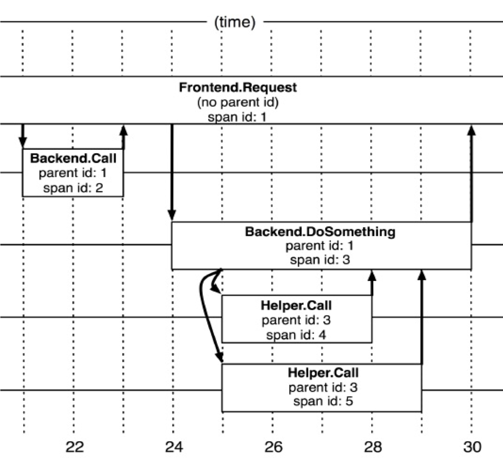
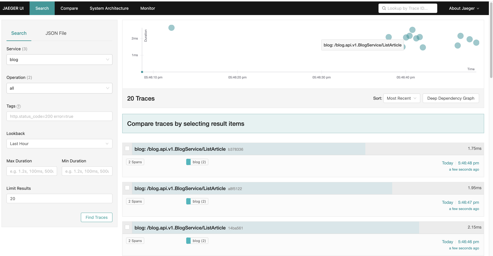
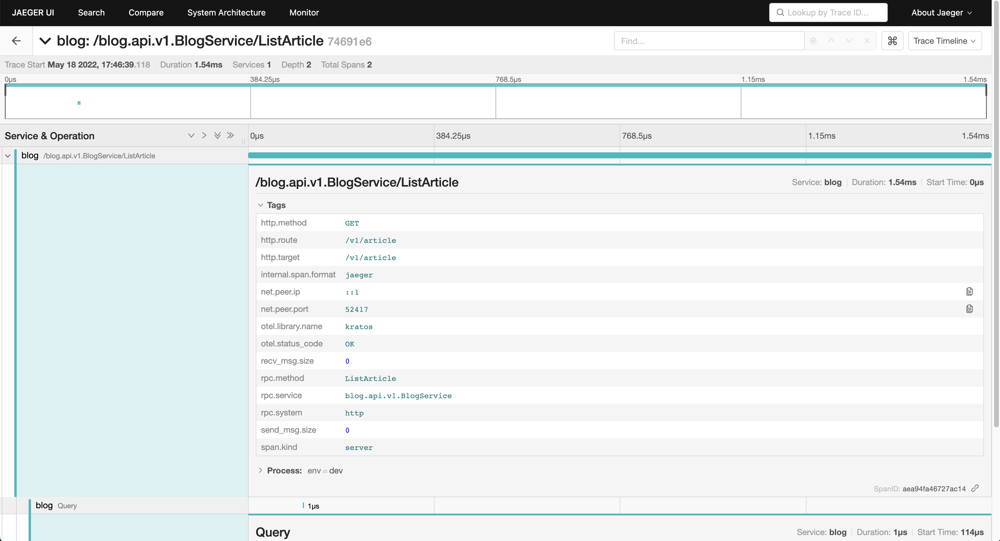
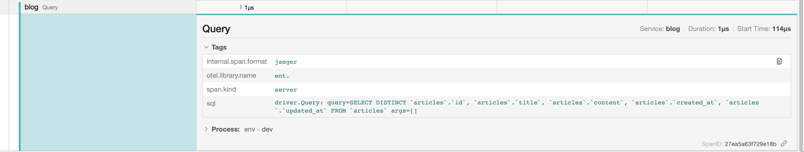

# 链路追踪

本文先根据课程介绍链路追踪的原理，由于 kratos 的链路追踪模块使用了 OpenTelementry 库来实现，所以会再先介绍下 OpenTelementry，最后介绍下 kratos 的实现。

## 原理

现代分布式链路追踪公认的起源是 Google 在 2010 年发表的论文《[Dapper : a Large-Scale Distributed Systems Tracing Infrastructure](https://static.googleusercontent.com/media/research.google.com/zh-CN//archive/papers/dapper-2010-1.pdf)》，这篇论文介绍了 Google 从 2004 年开始使用的分布式追踪系统 Dapper 的实现原理。广义的追踪系统又常被称为“APM 系统”（Application Performance Management）。

设计目标

- 无处不在的部署
- 持续的监控
- 低消耗
- 应用级的透明
- 延展性
- 低延迟

### 实现

参考论文实现，每个请求对应一个 traceId，每一层一个 spanId，在跟踪树结构中，树节点是整个架构的基本单元，而每一个节点又是对 span 的引用。Span 的数据结构应该足够简单，以便于能放在日志或者网络协议的报文头里；也应该足够完备，起码应含有时间戳、起止时间、Trace 的 ID、当前 Span 的 ID、父 Span 的 ID 等能够满足追踪需要的信息。每一次 Trace 实际上都是由若干个有顺序、有层级关系的 Span 所组成一颗“追踪树”（Trace Tree）。



核心概念：

- TraceID（一个请求）
- SpanID（一次调用）
- ParentID （该 span 的上级 spanId）
-  Family & Title（比如上图的 Backend.Call，就是 Family.Title ）

### 植入点

Dapper 可以以对应用开发者近乎零浸入的成本对分布式控制路径进行跟踪，几乎完全依赖于基于少量通用组件库的改造。如下：

当一个线程在处理跟踪控制路径的过程中，Dapper 把这次跟踪的上下文的在 ThreadLocal中进行存储，在 Go 语言中，约定每个方法首参数为 context（上下文）。可以使用 Context.WithValue 等方法传递。如果需要在 rpc 间传递，那么可以使用 grpc 的元数据传递方法。

覆盖通用的中间件&通讯框架、不限于：redis、memcache、rpc、http、database、queue。

### 跟踪消耗

处理跟踪消耗：

- 正在被监控的系统在生成追踪和收集追踪数据的消耗导致系统性能下降，
- 需要使用一部分资源来存储和分析跟踪数据，是Dapper性能影响中最关键的部分：
  - 因为收集和分析可以更容易在紧急情况下被关闭，ID生成耗时、创建Span等；
  - 修改agent nice值（权重值，可以降低权重），以防在一台高负载的服务器上发生cpu竞争；

#### 采样

如果一个显着的操作在系统中出现一次，他就会出现上千次，基于这个事情我们不全量收集数据。

- 固定采样，1/1024：

​       这个简单的方案是对我们的高吞吐量的线上服务来说是非常有用，因为那些感兴趣的事件(在大吞吐量的情况下)仍然很有可能经常出现，并且通常足以被捕捉到。然而，在较低的采样率和较低的传输负载下可能会导致错过重要事件，而想用较高的采样率就需要能接受的性能损耗。对于这样的系统的解决方案就是覆盖默认的采样率，这需要手动干预的，这种情况是我们试图避免在 Dapper 中出现的。

- 应对积极采样：

  我们理解为单位时间期望采集样本的条目，在高 QPS 下，采样率自然下降，在低 QPS 下，采样率自然增加；比如 1s 内某个接口采集 1 条。

- 二级采样：

  容器节点数量多，即使使用积极采样仍然会导致采样样本非常多，所以需要控制写入中央仓库的数据的总规模，利用所有 span 都来自一个特定的跟踪并分享同一个 traceid 这个事实，虽然这些 span 有可能横跨了数千个主机。

  对于在收集系统中的每一个 span，我们用hash算法把 traceid 转成一个标量Z ，这里0<=Z<=1，我们选择了运行期采样率，这样就可以优雅的去掉我们无法写入到仓库中的多余数据，我们还可以通过调节收集系统中的二级采样率系数来调整这个运行期采样率，最终我们通过后端存储压力把策略下发给 agent采集系统，实现精准的二级采样。（这个没懂啥意思）

- 下游采样：

  越被依赖多的服务，网关层使用积极采样以后，对于 downstream 的服务采样率仍然很高。在下游服务再进行固定采样或者其他采样方式。

### 经验&优化

- 性能优化：
  - 不必要的串行调用（可以使用异步并发来做）；
  - 缓存读放大；数据库写放大（使用 batch 批量执行查询；或者类似在 goim 里，使用缓冲区合并多条消息一次发送，而不是来了一条消息就发一次）；
  - 服务接口聚合调用（可以使用二级缓存记录最近的 rpc 请求结果，减少 rpc 请求；或者将多个微服务合并成一个，减少网络的耗时）。

- 异常日志系统集成：
  - 如果这些异常发生在 Dapper 跟踪采样的上下文中，那么相应的 traceid 和 spanid 也会作为元数据记录在异常日志中。异常监测服务的前端会提供一个链接，从特定的异常信息的报告直接导向到他们各自的分布式跟踪；

- 用户日志集成：
  - 加入用户白名单，对于一些 vip 用户或者高级用户调用的请求日志可以全部记录，遇到问题可以快速定位问题。
  - 在请求的头中返回 traceid，当用户遇到故障或者上报客服我们可以根据 traceid 作为整个请求链路的关键字，再根据接口级的服务依赖接口所涉及的服务并行搜索 ES Index，聚合排序数据，就比较直观的诊断问题了；

- 容量预估：
  - 根据入口网关服务，推断整体下游服务的调用扇出来精确预估流量再各个系统的占比；

- 网络热点&易故障点：

  - 我们内部 RPC 框架还不够统一，以及基础库的组件部分还没解决拿到应用层协议大小，如果我们收集起来，可以很简单的实现流量热点、机房热点、异常流量等情况。同理容易失败的 span，很容易统计出来，方便我们辨识服务的易故障点；

- opentraceing：

  - 标准化的推广，上面几个特性，都依赖 span TAG 来进行计算，因此我们会逐步完成标准化协议，也更方便我们开源，而不是一个内部“特殊系统”；

  

## OpenTelementry 简介

[OpenTelementry](https://opentelemetry.io/) 是一组 API、SDK、工具和集成，旨在创建和管理遥测数据，例如 traces、 metrics 和 logs。 该项目提供了一个与供应商无关的实现，可以将其配置为将遥测数据发送到您选择的后端。 它支持各种流行的开源项目，包括 Jaeger 和 Prometheus。具体可以查看[官方文档](https://opentelemetry.io/docs/concepts/)。

简单点说，otel 就是提供了一个服务可观测性所需要的各种实现库。

### OpenTelementry-Go

[OpenTelemetry-Go](https://github.com/open-telemetry/opentelemetry-go)，这里基于 [Getting Startted](https://opentelemetry.io/docs/instrumentation/go/getting-started/) 官方文档以及 [fib example](https://github.com/open-telemetry/opentelemetry-go/tree/main/example/fib) 来简单介绍一些 api。

#### fib example

##### Trace

example/fib/app.go：

```go
// name is the Tracer name used to identify this instrumentation library.
const name = "fib"
// Run starts polling users for Fibonacci number requests and writes results.
func (a *App) Run(ctx context.Context) error {
	for {
		// Each execution of the run loop, we should get a new "root" span and context.
		newCtx, span := otel.Tracer(name).Start(ctx, "Run")

		n, err := a.Poll(newCtx)
		if err != nil {
			span.End()
			return err
		}

		a.Write(newCtx, n)
		span.End()
	}
}
```

Run 函数里就通过 otel 库植入了 tracer 和 span，通过 `otel.Tracer(name).Start(ctx, "Run")` 生成一个新的 `context` 和 `span`。`name` 就是 tracer 的名称，这个 tracer 在 `Run` 函数里创建了一个名叫 "Run" 的 `span`，最后这个 `span` 会被手动关闭： `span.End()`。

同样在其它函数里也是通过相同名称的 tracer 创建了不同名称的 span ，不同的 span 有层级关系，层级关系通过一起创建的 `newCtx` 来关联。比如在 `Run` 函数里，会给 `Poll` 函数传入新的 `newCtx`，这就表示 `Poll` 里的 `span` 的 parent 就是 `Run` 函数的 `span`。

> In OpenTelemetry Go the span relationships are defined explicitly with a `context.Context`. When a span is created a context is returned alongside the span. That context will contain a reference to the created span. If that context is used when creating another span the two spans will be related. The original span will become the new span’s parent, and as a corollary, the new span is said to be a child of the original. 

例子中 span 的层级关系：

```go
Run
├── Poll
└── Write
    └── Fibonacci
```

##### Console Exporter

exporter 允许将观测数据发送到某处 - 发送到控制台（比如这个例子），或者发送到远程系统或收集器以进行进一步分析和丰富。可以支持 [Jaeger](https://pkg.go.dev/go.opentelemetry.io/otel/exporters/jaeger), [Zipkin](https://pkg.go.dev/go.opentelemetry.io/otel/exporters/zipkin), and [Prometheus](https://pkg.go.dev/go.opentelemetry.io/otel/exporters/prometheus)。

example/fib/main.go：

```go
// newExporter returns a console exporter.
func newExporter(w io.Writer) (trace.SpanExporter, error) {
	return stdouttrace.New(
		stdouttrace.WithWriter(w),
		// Use human-readable output.
		stdouttrace.WithPrettyPrint(),
		// Do not print timestamps for the demo.
		stdouttrace.WithoutTimestamps(),
	)
}
```

通过 `go.opentelemetry.io/otel/exporters/stdout/stdouttrace`包里的方法，可以将 trace 数据发送到控制台。

##### Resource

resource 就是在观测数据里注明服务的一些信息以及当前的环境。

example/fib/main.go：

```go
// newResource returns a resource describing this application.
func newResource() *resource.Resource {
	r, _ := resource.Merge(
		resource.Default(),
		resource.NewWithAttributes(
			semconv.SchemaURL,
			semconv.ServiceNameKey.String("fib"),
			semconv.ServiceVersionKey.String("v0.1.0"),
			attribute.String("environment", "demo"),
		),
	)
	return r
}
```

##### Trace Provider

trace provider 可以将之前的观测数据连接到 exporter 里进行批量输出。

example/fib/main.go：

```go
func main() {
	l := log.New(os.Stdout, "", 0)

	// Write telemetry data to a file.
	f, err := os.Create("traces.txt")
	if err != nil {
		l.Fatal(err)
	}
	defer f.Close()

	exp, err := newExporter(f)
	if err != nil {
		l.Fatal(err)
	}

	tp := trace.NewTracerProvider(
		trace.WithBatcher(exp),
		trace.WithResource(newResource()),
	)
	defer func() {
		if err := tp.Shutdown(context.Background()); err != nil {
			l.Fatal(err)
		}
	}()
	otel.SetTracerProvider(tp)

    /* … */
}
```

#### 运行

```shell
➜  fib git:(main) go run .      
What Fibonacci number would you like to know: 
10
Fibonacci(10) = 55
```

同时会生成 tracing.txt，这里贴出部分数据信息：

```json
{
	"Name": "Poll",
	"SpanContext": {
		"TraceID": "072292866c10a7dd6d9bbd9fa0481616",
		"SpanID": "cbcccc876b7bdaf4",
		"TraceFlags": "01",
		"TraceState": "",
		"Remote": false
	},
	"Parent": {
		"TraceID": "072292866c10a7dd6d9bbd9fa0481616",
		"SpanID": "a69a586077e6cc3e",
		"TraceFlags": "01",
		"TraceState": "",
		"Remote": false
	},
	"SpanKind": 1,
	"StartTime": "0001-01-01T00:00:00Z",
	"EndTime": "0001-01-01T00:00:00Z",
	"Attributes": [
		{
			"Key": "request.n",
			"Value": {
				"Type": "STRING",
				"Value": "10"
			}
		}
	],
	"Events": null,
	"Links": null,
	"Status": {
		"Code": "Unset",
		"Description": ""
	},
	"DroppedAttributes": 0,
	"DroppedEvents": 0,
	"DroppedLinks": 0,
	"ChildSpanCount": 0,
	"Resource": [
		{
			"Key": "environment",
			"Value": {
				"Type": "STRING",
				"Value": "demo"
			}
		},
    ...
  ]
}
```

该文件记录了所有 span 的数据信息，这里只贴出 `Poll` 的 span 数据。

更多内容请参考官方文档。


## Kratos 链路追踪

### 使用

以 [blog example](https://github.com/go-kratos/examples/tree/main/blog) 为例，需要先启动 jaeger、redis、mysql，docker 命令如下：

```shell
docker run -p 6379:6379 -d redis:latest redis-server

docker run --name mysql -p 3306:3306 -e MYSQL_ROOT_PASSWORD=123 -d mysql:latest

docker run -d --name jaeger \            
  -e COLLECTOR_ZIPKIN_HOST_PORT=:9411 \
  -p 5775:5775/udp \
  -p 6831:6831/udp \
  -p 6832:6832/udp \
  -p 5778:5778 \
  -p 16686:16686 \
  -p 14250:14250 \
  -p 14268:14268 \
  -p 14269:14269 \
  -p 9411:9411 \
  jaegertracing/all-in-one:1.33
```

将 configs/config.yaml 里的数据库连接密码改一下，然后编译运行：

```shell
go build -ldflags "-X main.Name=blog" .
./blog
```

注意这里编译时传入了 Name 参数，这个 Name 会作为 tracer 的 name，如果按照 README 里那样运行的话 jaeger 里的服务名就是 unknown_service:blog ，不太好看。

jaeger ui：http://localhost:16686/search

我这里测试发送了一些 Get 请求，在 jaeger 里就能看到 trace 数据：



点进去一个小圆点查看详情：



可以看到详细的请求信息以及响应时间等，下面还有 Query 部分：



在这里还可以看到查询语句。

可以看到这样实在是太方便了，对每个请求的详细信息以及内部的 sql 都能清晰地看到，排查问题也更方便了。

### 实现

在 [blog example](https://github.com/go-kratos/examples/tree/main/blog)  里，初始化 trace 的代码都在 main.go 里：

blog/cmd/blog/main.go：

```go
import (
  tracesdk "go.opentelemetry.io/otel/sdk/trace"
  ...
)

// Set global trace provider
func setTracerProvider(url string) error {
	// Create the Jaeger exporter
	exp, err := jaeger.New(jaeger.WithCollectorEndpoint(jaeger.WithEndpoint(url)))
	if err != nil {
		return err
	}
	tp := tracesdk.NewTracerProvider(
		// Set the sampling rate based on the parent span to 100%
		tracesdk.WithSampler(tracesdk.ParentBased(tracesdk.TraceIDRatioBased(1.0))),
		// Always be sure to batch in production.
		tracesdk.WithBatcher(exp),
		// Record information about this application in an Resource.
		tracesdk.WithResource(resource.NewSchemaless(
			semconv.ServiceNameKey.String(Name),
			attribute.String("env", "dev"),
		)),
	)
	otel.SetTracerProvider(tp)
	return nil
}


func main() {
	flag.Parse()
	logger := log.NewStdLogger(os.Stdout)
	...
  // 这里设置 traceProvider
	if err := setTracerProvider(bc.Trace.Endpoint); err != nil {
		panic(err)
	}
	...
	// start and wait for stop signal
	if err := app.Run(); err != nil {
		panic(err)
	}
}
```

可以看到其实就是直接调用了 otel SDK 的 trace 的 api，跟之前介绍的用法差不多，只不过 exporter 改成 jaeger 了，然后在 main 函数里设置一下 jaeger 的 url 就行了，比较简单。

而上面看到 Query 里的 sql 语句，这部分 span 是在 blog/internal/data/data.go 里设置的：

```go
// NewData .
func NewData(conf *conf.Data, logger log.Logger) (*Data, func(), error) {
	log := log.NewHelper(logger)
	drv, err := sql.Open(
		conf.Database.Driver,
		conf.Database.Source,
	)
  // 在 sqlDrv 里将要执行的 sql 作为 span 的属性设置进去
	sqlDrv := dialect.DebugWithContext(drv, func(ctx context.Context, i ...interface{}) {
		log.WithContext(ctx).Info(i...)
		tracer := otel.Tracer("ent.")
		kind := trace.SpanKindServer
    // 设置 Query span
		_, span := tracer.Start(ctx,
			"Query",
			trace.WithAttributes(
				attribute.String("sql", fmt.Sprint(i...)),
			),
			trace.WithSpanKind(kind),
		)
		span.End()
	})
  
	client := ent.NewClient(ent.Driver(sqlDrv))
	if err != nil {
		log.Errorf("failed opening connection to sqlite: %v", err)
		return nil, nil, err
	}
  
	...
}
```

这里使用了 facebook 的 ent 库，在 sqlDrv 里，将 sql 作为 span 的属性设置进去，这样之后每次进行数据库操作时，都会自动将 sql 语句放到 span 中展示出来。

kratos 的链路追踪源码实现在 **[middleware/tracing](https://github.com/go-kratos/kratos/tree/main/middleware/tracing)** 这里，其实大部分就是封装了 otel 的 api ，有兴趣可以去看看。


## 参考

[链路追踪](https://go-kratos.dev/docs/component/middleware/tracing/)

[blog example](https://github.com/go-kratos/examples/tree/main/blog)

[Kratos 学习笔记 - 基于 OpenTelemetry 的链路追踪](https://go-kratos.dev/blog/go-kratos-opentelemetry-practice/)

[OpenTelemetry 文档](https://opentelemetry.io/docs/)

[Jaeger 教程](https://pjw.io/articles/2018/05/18/jaeger-tutorial/)