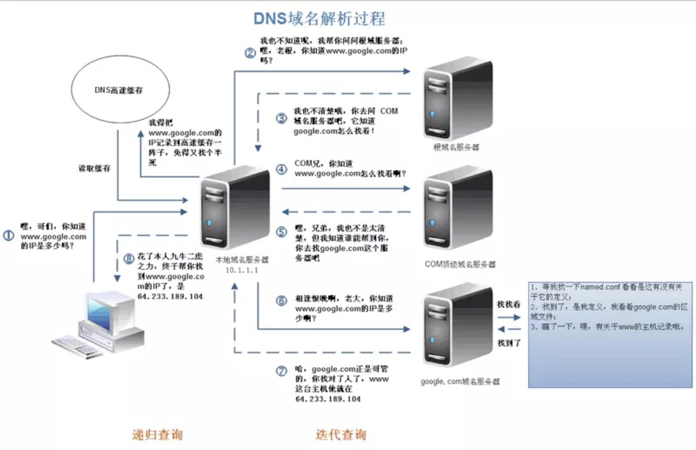
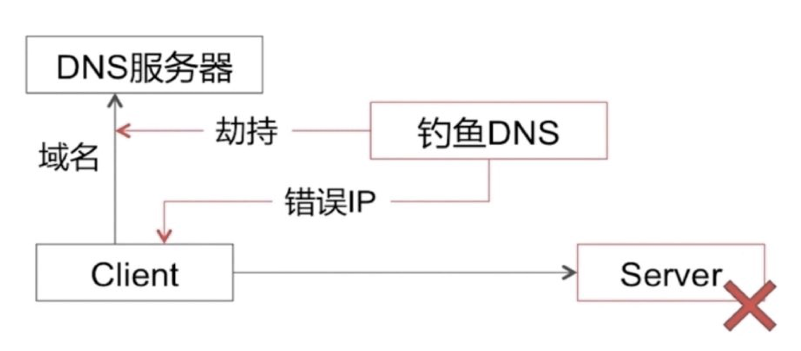
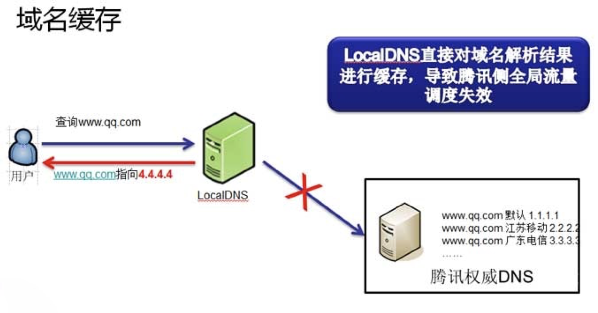
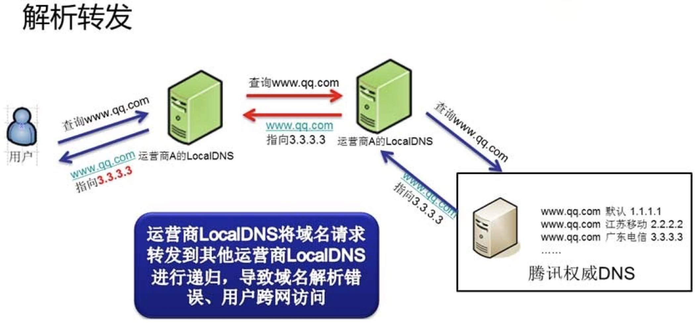
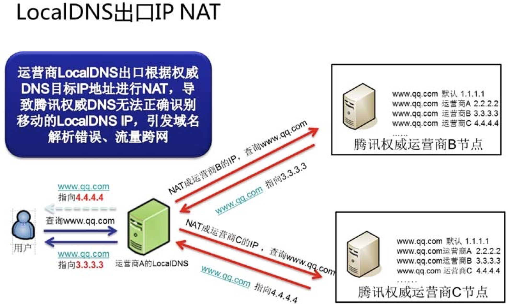
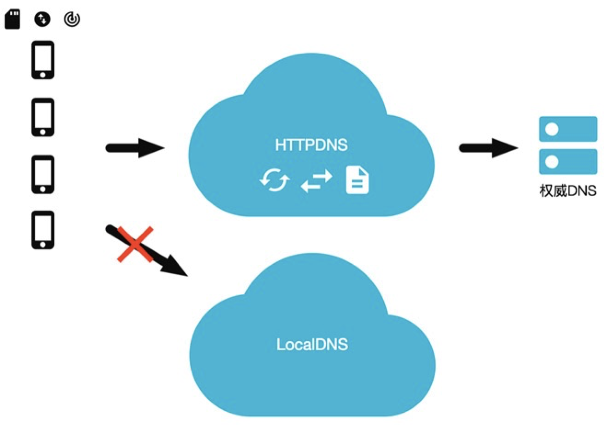
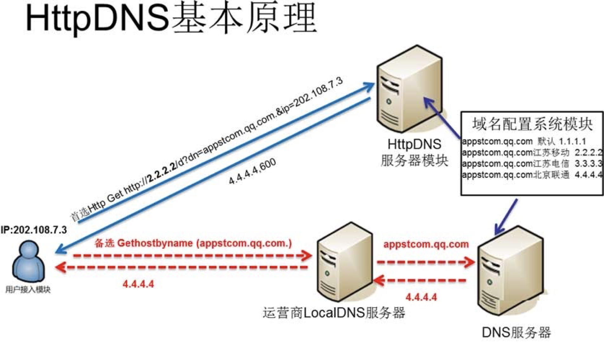
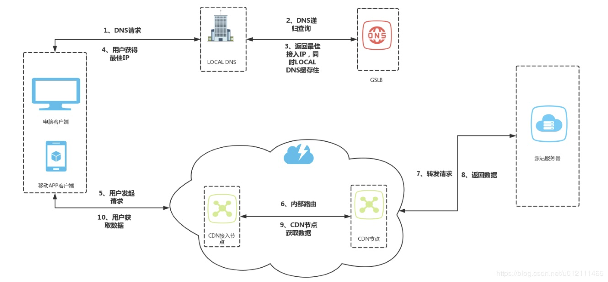
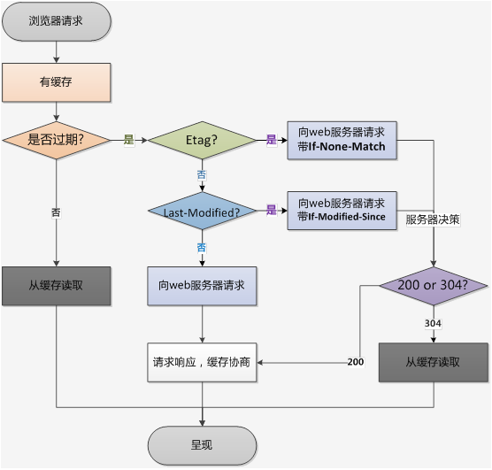

# DNS & CDN

## 名词解释

DNS（Domain Name System，域名系统）。DNS 服务用于在网络请求时，将域名转为 IP 地址。能够使用户更方便的访问互联网，而不用去记住能够被机器直接读取的 IP 数串。

IDC （Internet Data Center）互联网数据中心。就是电信部门利用已有的互联网通信线路、带宽资源，建立标准化的电信专业级机房环境，为企业、政府提供服务器托管、租用以及相关增值等方面的全方位服务。

NAT （Network address translation）网络地址转换。网络地址转换在计算机网络中是一种在IP数据包通过路由器或防火墙时重写来源IP地址或目的IP地址的技术。这种技术被普遍使用在有多台主机但只通过一个公有IP地址访问互联网的私有网络中。它是一个方便且得到了广泛应用的技术。当然，NAT也让主机之间的通信变得复杂，导致了通信效率的降低。

CDN  (Content delivery network) 内容分发网络。内容分发网络是指一种透过互联网互相连接的电脑网络系统，利用最靠近每位用户的服务器，更快、更可靠地将音乐、图片、视频、应用程序及其他文件发送给用户，来提供高性能、可扩展性及低成本的网络内容传递给用户。

## DNS

### 域名解析

- 递归查询

  如果主机所询问的本地域名服务器不知道被查询域名的 IP 地址，那么本地域名服务器就以 DNS 客户的身份，向其他根域名服务器继续发出查询请求报文，而不是让该主机自己进行下一步的查询。

- 迭代查询

  当根域名服务器收到本地域名服务器发出的迭代查询请求报文时，要么给出所要查询的 IP 地址，要么告诉本地域名服务器：你下一步应当向哪一个域名服务器进行查询。然后让本地域名服务器进行后续的查询，而不是替本地域名服务器进行后续的查询。
  由此可见，客户端到 Local DNS 服务器，Local DNS 与上级 DNS 服务器之间属于递归查询；DNS 服务器与根 DNS 服务器之前属于迭代查询。

### DNS 问题

#### Local DNS 劫持

Local DNS 把域名劫持到其他域名，实现其不可告人的目的。

#### 域名缓存

域名缓存就是 LocalDNS 缓存了业务的域名的解析结果，不向权威 DNS 发起递归。

- 保证用户访问流量在本网内消化：国内的各互联网接入运营商的带宽资源、网间结算费用、IDC 机房分布、网内 ICP 资源分布等存在较大差异。为了保证网内用户的访问质量，同时减少跨网结算，运营商在网内搭建了内容缓存服务器，通过把域名强行指向内容缓存服务器的 IP 地址，就实现了把本地本网流量完全留在了本地的目的。
- 推送广告：有部分 LocalDNS 会把部分域名解析结果的所指向的内容缓存，并替换成第三方广告联盟的广告。

#### 解析转发

部分小运营商为了节省资源，就直接将解析请求转发到了其它运营的递归 LocalDNS 上去了。

这样的直接后果就是权威 DNS 收到的域名解析请求的来源 IP 就成了其它运营商的 IP，最终导致用户流量被导向了错误的 IDC，用户访问变慢。

#### LocalDNS 出口 NAT

LocalDNS 递归出口 NAT 指的是运营商的 LocalDNS 按照标准的 DNS 协议进行递归，但是因为在网络上存在多出口且配置了目标路由 NAT，结果导致 LocalDNS 最终进行递归解析的时候的出口 IP 就有概率不为本网的 IP 地址。

这样的直接后果就是 DNS 收到的域名解析请求的来源 IP 还是成了其它运营商的 IP，最终导致用户流量被导向了错误的 IDC，用户访问变慢。

### 高可用 DNS 设计

HTTPDNS 利用 HTTP 协议与 DNS 服务器交互，代替了传统的基于 UDP 协议的 DNS 交互，绕开了运营商的 Local DNS，有效防止了域名劫持，提高域名解析效率。

另外，由于 DNS 服务器端获取的是真实客户端 IP 而非 Local DNS 的 IP，能够精确定位客户端地理位置、运营商信息，从而有效改进调度精确性。

#### 原理

由于 HTTP DNS 是通过 ip 直接请求 http获取服务器 A 记录地址，不存在向本地运营商询问 domain 解析过程，所以从根本避免了劫持问题。 

平均访问延迟下降：

- 由于是 ip 直接访问省掉了一次 domain 解析过程。

用户连接失败率下降：

- 通过算法降低以往失败率过高的服务器排序
- 通过时间近期访问过的数据提高服务器排序
- 通过历史访问成功记录提高服务器排序

根治域名解析异常：

- 由于绕过了运营商的LocalDNS，用户解析域名的请求通过 HTTP 协议直接透传到了 HTTPDNS 服务器 IP 上，用户在客户端的域名解析请求将不会遭受到域名解析异常的困扰。

调度精准：

- HTTPDNS 能直接获取到用户 IP，通过结合 IP 地址库以及测速系统，可以保证将用户引导的访问最快的 IDC 节点上；

实现成本低廉：

- 接入 HTTPDNS 的业务仅需要对客户端接入层做少量改造，无需用户手机进行 root 或越狱；而且由于 HTTP 协议请求构造非常简单，兼容各版本的移动操作系统更不成问题；另外 HTTPDNS 的后端配置完全复用现有权威 DNS 配置，管理成本也非常低。

## CDN

### 架构

- 缓存代理

  通过智能 DNS 的筛选，用户的请求被透明地指向离他最近的省内骨干节点，最大限度的缩短用户信息的传输距离。

- 路由加速

  利用接入节点和中继节点或者多线节点互联互通。

- 安全保护

  无论面对是渗透还是 DDoS攻击，攻击的目标大都会被指向到了 CDN，进而保护了用户源站。

- 节省成本

  CDN 节点机房只需要在当地运营商的单线机房，或者带宽相对便宜的城市，采购成本低。

- 内容路由

  DNS系统、应用层重定向，传输层重定向。

- 内容分发

  PUSH：主动分发，内容管理系统发起，将内容从源分发到 CDN 的 Cache 节点。

  PULL：被动分发技术，用户请求驱动，用户请求内容中 miss，从源中或者其他 CDN 节点中实时获取内容。

- 内容存储

  随机读、顺序写、小文件的分布式存储。

- 内容管理

  提高内容服务的效率，提高 CDN 的缓存利用率。

### 数据一致性

- PUSH

  不存在数据一致性问题。

- PULL

  缓存更新不及时，数据一致性问题，可设置缓存的失效时间，可以达到最终一致性。如果用户对一致性要求比较高也可以使用 ?version=xx 的技术，也可以每次上传图片返回的url是不同的方式来代替版本号。
  CDN 存储的资源复本指定过期时间，因而缓存图像文件可在一个小时，一个月有效的。任何资源缓存在 CDN 上，是潜在历史版本，因为在源数据与副本之间总是有一个更新与传输的延迟。

http 缓存：

- Expires

  即在 HTTP 头中指明具体失效的时间(HTTP/1.0)

- Cache Control

  max-age 在 HTTP 头中按秒指定失效的时间，优先级高于Expires(HTTP/1.1)

- Last-Modified / If-Modified-Since

  文件最后一次修改的时间（精度是秒，HTTP/1.0），需要 Cache-Control 过期。

- Etag

  当前资源在服务器的唯一标识（生成规则由服务器决定）优先级高于 Last-Modified

### 静动态 CDN 加速

- 静态内容（静态资源）

静态内容是指在不同请求中访问到的数据都相同的静态文件。例如：图片、视频、网站中的文件（html、css、js）、软件安装包、apk文件、压缩包文件等。

CDN加速的本质是缓存加速。将您服务器上存储的静态内容缓存在 CDN 节点上，当访问这些静态内容时，无需访问服务器源站，就近访问 CDN 节点即可获取相同内容。从而达到加速的效果，同时减轻服务器源站的压力。

- 动态内容（动态资源）

动态内容是指在不同请求中访问到的数据不相同的动态内容。例如：网站中的文件（asp、jsp、php、perl、cgi）、API接口、数据库交互请求等。

当您访问这些动态内容时，每次都需要访问服务器，由服务器动态生成实时的数据并返回。因此CDN的缓存加速不适用于加速动态内容，CDN无法缓存实时变化的动态内容。对于动态内容请求，CDN节点只能转发回您的服务器源站。

#### 静态 CDN 加速

地理位置分散的用户最小化接收静态内容所需的跳数，直接从附近边缘的缓存中获取内容。 结果是显着降低了延迟和数据包丢失，加快了页面加载速度，并大大降低了原始基础架构的负载。

- 静态域名非主域名
- 静态多域名和收敛
- 静态资源版本化管理

#### 动态 CDN 加速

动态资源 (如POST请求) 需要回源站获取响应内容，因网络拥塞、链路过长等导致加载时间过长。CDN无法缓存动态内容，因此动态内容可以通过动态 CDN 加速技术获取。有以下方法加速：

- TCP 优化

  设计算法来处理网络拥堵和包丢失，加快这些情况下的数据从 CDN 的恢复以及一些常见的 TCP 瓶颈。

- Route optimization

  就是优化从源到用户端的请求的线路，以及可靠性，就是不断的测量计算得到更快更可靠的路线。

- Connection management

  就是边缘和源之间，包括 CDN 之前的线路，采用长连接，而不是每一个请求一个连接

- On-the-fly compression

  就是数据在刚刚离开源的时候就进行压缩，可以缩短在整个网络之中的流通时间。或者回源时聚合请求，一次请求，填充多个返回，类似 singleflight。

- SSL offload

  加速或者说减少一些安全监测，减少原服务器执行这种计算密集型的压力。

  