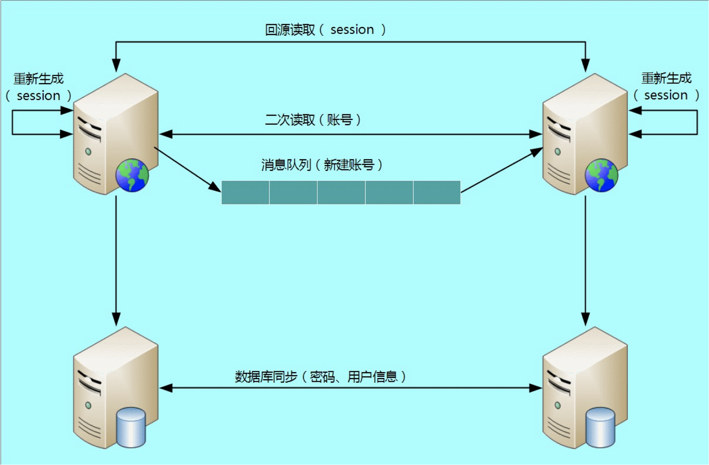

# 多活

## 多活系统

这里会介绍多活系统的一些基本概念，然后会分别介绍各大厂商的一些多活系统的设计方案。

### 基础

- 业务分级

  按照一定的标准将业务进行分级，挑选出核心的业务，只为核心业务核心场景设计异地多活，降低方案整体复杂度和实现成本。例如：1、访问量；2、核心场景；3、收入；避免进入所有业务都要全部多活，分阶段分场景推进。

- 数据分类

  挑选出核心业务后，需要对核心业务相关的数据进一步分析，目的在于识别所有的数据及数据特征，这些数据特征会影响后面的方案设计。常见的数据特征分析维度有：1、数据量；2、唯一性；3、实时性；4、可丢失性；5、可恢复性；

- 数据同步

  确定数据的特点后，我们可以根据不同的数据设计不同的同步方案。常见的数据同步方案有：1、存储系统同步；2、消息队列同步；3、重复生成；

- 异常处理

  无论数据同步方案如何设计，一旦出现极端异常的情况，总是会有部分数据出现异常的。例如，同步延迟、数据丢失、数据不一致等。异常处理就是假设在出现这些问题时，系统将采取什么措施来应对。常见的异常处理措施：1、多通道同步；2、同步和异步访问；3、日志记录；4、补偿；

多活不是整个体系业务的多活，而是**分成不同维度，不同重要性的多活**，比如我们业务观看体验为主（淘宝以交易单元，买家为维度），那么第一大前提就是浏览、观看上的多活。我们将资源分为三类：

- Global 资源：多个 Zone（机房）共享访问的资源，每个 Zone 访问本 Zone 的资源，但是 Global 层面来说是单写 Core Zone（核心机房），即：单写+多读、利用数据复制（写Zone 单向）实现最终一致性方案实现；
- Multi Zone 资源：多个 Zone 分片部署，每个 Zone 拥有部分的 Shard 数据，比如我们按照用户维度拆分，用户 A 可能在 ZoneA，用户 B 可能在 ZoneB，即：多写+多读、利用数据复制（写 Zone 双向复制）方案实现；
  Single Zone 资源：单机房部署业务；
- 核心主要围绕：PC/APP 首页可观看、视频详情页可打开、账号可登陆、鉴权来开展，我们认为最合适我们观看类业务最合适的场景就是采用 Global 资源策略，对于社区类（评论、弹幕）可能会采用 Multi Zone 的策略。

#### 指标

- RPO(Recovery Point Object)：表示机房级别故障时，未被同步的数据时长。考虑到 MySQL 在特殊情况下复制延迟较大情况下，RPO 设置为分钟级别，正常情况下 RPO 为秒级
- RTO(Recovery Target Object)：表示机房故障情况下，关键流程或系统切换恢复时间，一般为分钟级别
- WRT(Work Recovery Time)：表示故障时，由于 RPO 导致的未同步异常数据修复完成时长，一般为小时级别。

#### 架构示例

以蚂蚁金服单元化架构设计为例：

整体架构包含RZone、GZone和CZone。

其中GZone部署的是无法拆分的数据和业务，GZone的数据和业务被RZone依赖，GZone全局只部署一份。

RZone部署的是可拆分的业务和对应的数据。每个RZone内的数据分片如图所示有五副本，实现三地五中心部署，每个分片内只有一个可写入的主副本，**其余副本按照 Paxos 协议做数据强一致**。每个RZone内实现业务单元封闭，独立完成自己的所有业务。

CZone的出现是因为GZone全局只有一份，不同城市的RZone可能依赖GZone服务和数据的时候需要远距离调用，延迟比较大，所以在每个城市部署一个CZone作为GZone的只读副本，为本城市的RZone提供服务。

### 饿了么多活

#### 需求分析

业务过程中包含3个最重要的角色，分别是用户、商家和骑手，一个订单包含3个步骤：

- 用户打开我们的APP，系统会推荐出用户位置附近的各种美食，推荐顺序中结合了用户习惯，推荐排序，商户的推广等。用户找到中意的食物 ，下单并支付，订单会流转到商家。
- 商家接单并开始制作食物，制作完成后，系统调度骑手赶到店面，取走食物。
- 骑手按照配送地址，把食物送到客户手中。

#### 特性

基于以上需求，因此饿了么多活有以下特性：

- 业务内聚：

​		单个订单的旅单过程，要在一个机房中完成，不允许跨机房调用。这个原则是为了保证实时性，旅单过程中不依赖另外一个机房的服务，才能保证没有延迟。我们称每个机房为一个 ezone，一个 ezone 包含了饿了么需要的各种服务。一笔业务能够内聚在一个 ezone 中，那么一个定单涉及的用户，商家，骑手，都会在相同的机房，这样订单在各个角色之间流转速度最快，不会因为各种异常情况导致延时。恰好我们的业务是地域化的，通过合理的地域划分，也能够实现业务内聚。

- 可用性优先：

​		当发生故障切换机房时，优先保证系统可用，首先让用户可以下单吃饭，容忍有限时间段内的数据不一致，在事后修复。每个 ezone 都会有全量的业务数据，当一个 ezone 失效后，其他的 ezone 可以接管用户。用户在一个ezone的下单数据，会实时的复制到其他ezone。

- 保证数据正确：

​		在确保可用的情况下，需要对数据做保护以避免错误，在切换和故障时，如果发现某些订单的状态在两个机房不一致，会锁定该笔订单，阻止对它进行更改，保证数据的正确。

- 业务可感：

​		因为基础设施还没有强大到可以抹去跨机房的差异，需要让业务感知多活逻辑，业务代码要做一些改造，包括：需要业务代码能够识别出业务数据的归属，只处理本 ezone 的数据，过滤掉无关的数据。完善业务状态机，能够在数据出现不一致的时候，通过状态机发现和纠正。

#### 实现

为了实现业务内聚，我们首先要选择一个划分方法（Sharding Key），对服务进行分区，让用户，商户，骑手能够正确的内聚到同一个 ezone 中。分区方案是整个多活的基础，它决定了之后的所有逻辑。

根据饿了么的业务特点，我们自然的选择地理位置（地理围栏，地理围栏主体按照省界划分，再加上局部微调）作为划分业务的单元，把地理位置上接近的用户，商户，骑手划分到同一个ezone，这样一个订单的履单流程就会在一个机房完成，能够保证最小的延时，在某个机房出现问题的时候，也可以按照地理位置把用户，商户，骑手打包迁移到别的机房即可。

基于地理位置划分规则，开发了统一的流量路由层（API Router），这一层负责对客户端过来的 API 调用进行路由，把流量导向到正确的 ezone。API Router 部署在多个公有云机房中，用户就近接入到公有云的API Router，还可以提升接入质量。

最基础的分流标签是地理位置，有了地理位置，AR 就能计算出正确的 shard 归属。但业务是很复杂的，并不是所有的调用都能直接关联到某个地理位置上，我们使用了一种分层的路由方案，核心的路由逻辑是地理位置，但是也支持其他的一些 High Level Sharding Key，这些 Sharding Key 由 APIRouter 转换为核心的 Sharding Key，具体如下图。这样既减少了业务的改造工作量，也可以扩展出更多的分区方法。除了入口处的路由，我们还开发了 SOA Proxy，用于路由SOA调用的，和API Router基于相同的路由规则。

### 阿里多活

#### 基本原则

- 按买家维度来进行数据切分。
- 只取与买家链路相关的业务（单元）做多活。
- 单元内最大限度的封闭。（即每个单元都可以独立完成业务场景，不需要依赖其他单元）
- 不接受数据最终一致的跨单元单点写。（由于是金融系统，所以不能跨单元写数据保证最终一致性，一定是本单元强一致性）

#### 业务架构

根据业务架构图可以看出，淘宝下单会根据买家维度，将买家数据分成多个单元，每个单元会独立处理本单元的交易下单流程。而且每个单元都会保存全量商品及卖家数据，这些数据都是由中心单元同步过来，每个单元写入的买家数据也会同步到中心单元，保存所有数据。

#### 技术架构

技术架构上，会借助边缘 CDN 节点，将用户分流至不同的机房去处理请求，和业务架构一样，也有一个中心机房供所有机房依赖。

#### 容灾

- 

- 同城容灾

  RZone1出现故障先看同城容灾能力，我们目标将RZone1切换至同城容灾RZone2。先做数据库分片切换，RZone1对应的分片为分片1，把分片1在RZone2的副本提升为主副本，数据库副本提升完毕后将RZone1的流量切换至RZone2，实现同城容灾RPO=0、RTO<1min。

- 异地容灾

  同样以RZone1故障为例。目标切换至RZone3，先做数据库切换，分片1在RZone3的副本切换成主副本，完成后将RZone1的流量切换至RZone3，实现异地容灾，该过程RPO=0、RTO<1min。

蚂蚁使用自研的分布式关系数据库 OceanBase，每个分片的数据库做5副本部署，部署地域实现三地五中心部署，5副本中有3副本实现强一致，如图所示可以实现同城、IDC 容灾和异地容灾。

### 苏宁多活

#### 基本概念

- Cell：业务可封闭收敛最小执行分片；业务对请求空间按一定维度（比如会员、门店等）划分分片。
- LDC：逻辑数据中心，是由多个业务可封闭 cell 组成的集合单元，拥有独立的基础中间件系统（包括 RPC， MQ， DNS 等），以及出口网络等。
- PDC：物理数据中心，指物理上独立的一栋建筑，一般每栋有好几层, 存放一系列机柜和上千和上万服务器, 构成一个 PDC。
- AZ（Available Zone）：可用区，具有独立的故障隔离空间，拥有独立网络设施或电力设备，由相邻的单个或多个 PDC 组成。
- Region：地理区域，有多可用区所组成的集合，区域之间故障域完全隔离。

#### 架构

- 分片服务：对应的数据仅在某个 Cell 存在，其它 Cell 不与交叉或共享，比如会员服务、订单服务等。
- 共享服务：所有 Cell 拥有相同的数据，相互共享，比如价格服务、商品服务等。
- 索引服务：用于索引数据提供服务，类似共享服务。
- 竞争 (控制) 服务：各个 Cell 相互操作同一个数据，为了保证数据一致性，需要在同一个数据中心进行控制，比如库存的扣减、用户注册等。
- 竞争 Proxy 服务：用于竞争服务前置服务，比如库存前置调拨服务（比如一次向主数据中心的控制服务申请一批库存供使用，减少了不同数据中心的网络调用次数，类似批量获取 quota）。

为了确保数据高可用以及任何一个机房故障都可被接管，所有数据中心都包含全量数据，当主数据中心的变更将会实时同步到各个从数据中心。
数据中心之间延迟相对数据中心内部延迟较大，数据中心之间的同步一般采用异步复制方式。在机房故障等极端情况，将出现少量数据未同步到其它数据中心，针对此类故障场景，在机房恢复后，需要对未同步的数据进行人工修复。（这里就为了保证可用性而牺牲了强一致性，而像阿里的 OceanBase 分布式数据库系统架构就使用了 Paxos 算法来保证了强一致性，就牺牲了一些可用性。）

#### 缓存一致性

回到下面这张图，可以看到 APP 会将数据都写入到中心数据库，然后中心数据库再将数据复制到本 AZ 的数据库中。这样有个问题就是缓存无法得到及时更新，AZ2 如果不做一些特殊处理，从缓存里读的数据可能会是脏数据。

这时可以引入 Facebook 的缓存一致性处理方法：

有以下步骤来保证缓存和数据库一致性：

1. 对缓存数据设置一个远程标记。
2. 将数据写入到主库。
3. 从缓存读取该数据时发现有一个远程标记存在，那么此时就会去主数据库读取对应数据，然后删除该缓存数据。
4. 主数据库将数据同步到副本数据库。
5. 订阅副本数据库的 binlog，将缓存的远程标记删除，表示之后可以从从数据库读取数据了，之后再将数据 set 到缓存中，就不会有缓存数据库不一致的问题了。如果此时数据又更新了，那么对该数据又加上远程标记，重复以上步骤即可。

### 微信朋友圈多活

#### 基本架构

如下图所示，微信朋友圈数据会在各个地方架设机房，不同机房的数据会相互同步。微信分布在全球四地的数据中心，可知用户小王有两个朋友：Mary、Kate，分别在不同的区域下（数据中心），所以他们要看到彼此朋友圈的内容时，必须等到相关的数据在不同数据中心间的副本同步到用户所在的IDC完成之后才能看到。

#### 因果关系概念

因果关系对事件施加了一种顺序：因在果之前，消息发送在消息收取之前。而且就像现实生活中一样，一件事会顺序地导致另一件事发生：某个节点读取了一些数据然后写入一些结果，另一个节点读取其写入的内容，并依次写入一些其他内容等等。这些因果依赖的操作链定义了系统中的因果顺序，即什么在什么之前发生。从而我们也引出了分布式系统的因果一致性，如果一个系统服从因果关系所规定的顺序，我们说它是因果一致性的。

微信朋友圈某条状态的评论以及对评论的答复（也是评论）所构成的因果关系。

需要保证不同数据中心间的因果一致性来保证一个用户在刷朋友圈的时候不会出现看到评论所对应的答复，却看不到答复对应的评论。

##### 问题

由于网络在不同副本间复制数据时的延迟、中断等分布式系统中常见的场景，导致两条消息在同步到用户 Kate（加拿大）所在数据中心上的副本时已经乱序了。

即原先顺序是这样的：

> “Mary：这是哪里？”->
> 	“小王：Mary，这是梅里雪山”，

然而 Kate 去数据库中查到的消息却是这样的顺序：

>  “小王：Mary，这是梅里雪山”->
> 		“Mary：这是哪里？”，

或者中间的某个时刻只能查询到“

小王：Mary，这是梅里雪山” 这一条消息，你说 Kate 会不会懵逼。

我们可以将 Mary 对小王所发布的朋友圈状态的评论 “Mary：这是哪里？”当成因，而把小王对 Mary 评论的答复“小王：Mary，这是梅里雪山” 当成果。

按照这样的约定，当这两条数据同步到 Kate 所在的数据中心副本时，即使发生乱序，Kate根据在刷朋友圈时，根据因果关系也可以将这个评论、答复的顺序调整到正确的、可阅读的方式。

#### 解决方案

- 每条评论都有一个唯一的且递增的数字 ID。

  那么背后肯定是一个ID生成器，各个数据中心都有一个这样的入口来获取本IDC内唯一、递增的ID。

- **每条新评论的 ID 都必须比本地已经见过的全局最大的 ID 大**，确保因果关系。

  比如在香港的数据中心，当发表完2的评论，并且已经同步上海数据中心过来的1 4 7等 ID 的评论之后，如果再有香港地域下的用户发表新评论时，那么一定要大于当前香港数据中心能看到的全局最大 ID，此时是7，所以香港地域此时用户最新发表的评论的 ID 必须大于7。

- 广播本地看到的所有评论和新评论到其它IDC；相同 ID 的评论合并排重。

例子：

本地域下的用户针对同一条朋友圈状态有评论时，该地域就负责申请一个全局 ID，然后将这个评论的事件广播给其他的数据中心。

注意这个过程需要合并所有看到的序列，例如香港数据中心就合并1 2 4 7 8等针对同一条朋友圈状态的一系列评论事件 IDs，然后再整体广播出去，这样才能保证针对同一条状态的所有当前最新的事件整体被广播出去，如果此时香港IDC 只广播8的话，如果前面的事件序列在广播的中途丢失了，那么其他节点比如加拿大IDC 就会漏掉部分评论事件，这也是数据多重补位的措施。

当然这个方法有一个前提就是：因为同一个朋友圈的发布状态，一般的评论不会很多，所以造成的数据冗余交互不会很大，否则是不行的。至于相同 ID 的评论合并排重，加拿大 IDC 会收到来自上海 IDC 的1 4 7事件系列，也会收到来自香港 IDC 同步过来的1 4 7 8 事件系列，这两个广播的事件系列有重复，所以需要去重。

### B 站多活

#### 账号多活

A 中心注册了用户，数据还未同步到 B 中心，此时 A 中心宕机，为了支持注册业务多活，那我们可以挑选 B 中心让用户去重新注册。

看起来很容易就支持多活了，但仔细思考一下会发现这样做会有问题：一个手机号只能注册一个账号，A 中心的数据没有同步过来，B 中心无法判断这个手机号是否重复，如果 B 中心让用户注册，后来 A 中心恢复了，发现数据有冲突，怎么解决？实际上是无法解决的，因为注册账号不能说挑选最后一个生效；而如果 B 中心不支持本来属于 A 中心的业务进行注册，注册业务的双活又成了空谈。

但很多朋友在考虑这个“业务”的时候，会不自觉的陷入一个思维误区：我要保证所有业务的“异地多活”！其实像账号注册这样的业务，就不需要也无法保证异地多活，都访问一个中心数据系统即可。

##### 同步实现细节

- 减少数据同步

  - 用户登录所产生的 token 或者 session 信息，数据量很大，但其实并不需要同步到其它业务中心，因为这些数据丢失后重新登录就可以了。

  - 某些情况下可能出现消息队列同步也延迟了，用户在 A 中心注册，然后访问 B 中心的业务，此时 B 中心本地拿不到用户的账号数据。为了解决这个问题，B 中心在读取本地数据失败的时候，可以根据路由规则，再去 A 中心访问一次（这就是所谓的二次读取，第一次读取本地，本地失败后第二次读取对端）。

  - 对于登录的 session 数据，由于数据量很大，我们可以不同步数据；但当用户在 A 中心登录后，然后又在 B 中心登录，B 中心拿到用户上传的 session id 后，根据路由判断 session 属于 A 中心，直接去 A 中心请求session数据即可，反之亦然，A 中心也可以到 B 中心去拿取session 数据。

- 最终一致性

  - A 机房注册了一个用户，业务上不要求能够在50ms内就同步到所有机房，正常情况下要求5分钟同步到所有机房即可，异常情况下甚至可以允许1小时或者1天后能够一致。
  - 最终一致性在具体实现的时候，还需要根据不同的数据特征，进行差异化的处理，以满足业务需要。例如对“账号”信息来说，如果在 A 机房新注册的用户5分钟内正好跑到 B 机房了，此时 B 机房还没有这个用户的信息，为了保证业务的正确，B 机房就需要根据路由规则到 A 机房请求数据。
  - 而对“用户信息”来说，5分钟后同步也没有问题，也不需要采取其它措施来弥补，但还是会影响用户体验，即用户看到了旧的用户信息，这种情况只能牺牲掉一部分的用户体验。

#### 稿件多活

##### 架构

这部分课程里介绍得不是很清楚，我也没完全理解，之后有机会再完善吧。

## 参考

饿了么

[分布式系统 - 关于异地多活的一点笔记 ](http://afghl.github.io/2018/02/11/distributed-system-multi-datacenter-1.html)

[饿了么异地多活技术实现（一）总体介绍](https://zhuanlan.zhihu.com/p/32009822)

[饿了么异地多活技术实现（二）API-Router的设计与实现](https://zhuanlan.zhihu.com/p/32587960)

[饿了么异地多活技术实现（三）GZS&DAL](https://zhuanlan.zhihu.com/p/33430869)

[饿了么异地多活技术实现（四）- 实时双向复制工具（DRC）](https://zhuanlan.zhihu.com/p/34958596)

OPPO

[OPPO互联网业务多活架构演进和实践](https://mp.weixin.qq.com/s/RQiurTi_pLkmIg_PSpZtvA)

[OPPO异地多活实践——缓存篇](https://mp.weixin.qq.com/s/LCn71j3hgm5Ij5tHYe8uoA)

Facebook

[Scaling Memcache in Facebook 笔记（三）](https://zhuanlan.zhihu.com/p/20827183)

阿里

[异地多活的单元化设计](https://mp.weixin.qq.com/s/jd9Os1OAyCXZ8rXw8ZIQmg)

[阿里异地多活与同城双活的架构演进](https://www.cnblogs.com/davidwang456/articles/8192860.html)

[多中心容灾实践：如何实现真正的异地多活？](https://mp.weixin.qq.com/s/ty5GltO9M648OXSWgLe_Sg)

[异地多活设计辣么难？其实是你想多了！](https://developer.aliyun.com/article/57715)[]

[一个理论，三个原则，多个步骤：阿里游戏异地多活设计之道](https://toutiao.io/posts/y8qekd/preview)

[异地多活数据流基础设施DRC 双11支持571亿交易额背后的武器](https://mp.weixin.qq.com/s/ooPLV039BAGBsiDZagWNHw)

[阿里异地多活与同城双活的架构演进](https://mp.weixin.qq.com/s/VPkQhJLl_ULwklP1sqF79g)

[多中心容灾实践：如何实现真正的异地多活？](https://mp.weixin.qq.com/s/ty5GltO9M648OXSWgLe_Sg)

苏宁

[历时三年，苏宁如何建设多数据中心多活的实践项目？](https://mp.weixin.qq.com/s/WK8N4xFxCoUvSpXOwCVIXw)

微信

[从微信朋友圈的评论可见性，谈因果一致性在分布式系统中的应用](https://www.cnblogs.com/king0101/p/11908305.html)