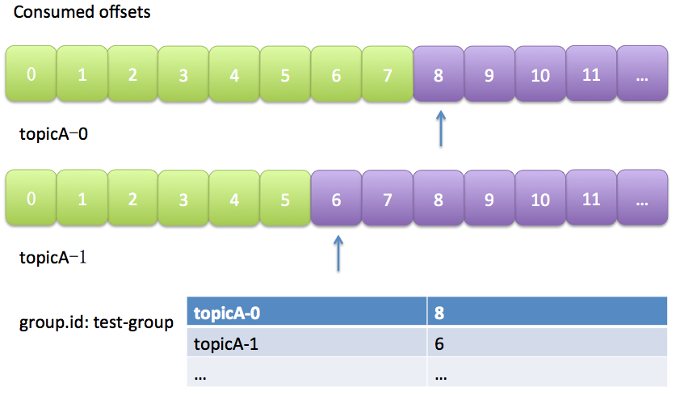

# Producer&Consumer

## Producer

Producer 发送消息到 Broker 时，会根据Paritition 机制选择将其存储到哪一个Partition。如果 Partition 机制设置合理，所有消息可以均匀分布到不同的 Partition里，这样就实现了负载均衡。

- 指明 Partition 的情况下，直接将给定的 Value 作为 Partition 的值。
- 没有指明 Partition 但有 Key 的情况下，将 Key 的 Hash 值与分区数取余得到 Partition 值。
- 既没有 Partition 也没有 Key 的情况下，第一次调用时随机生成一个整数（后面每次调用都在这个整数上自增），将这个值与可用的分区数取余，得到 Partition 值，也就是常说的 Round-Robin 轮询算法。

## Consumer

### 消费者与消费者组

消费者负责订阅 Kafka 中的主题（Topic），并且从订阅的主题上拉取消息。与其他一些消息中间件不同的是：在 Kafka 的消费理念中还有一层消费组的概念，每个消费者都有一个对应的消费组。当消息发布到主题后，只会被投递给订阅它的每个消费组中的一个消费者。

如上图所示，某个主题中共有4个分区（Partition）：P0、P1、P2、P3。有两个消费组A和B都订阅了这个主题，消费组A中有4个消费者（C0、C1、C2和C3），消费组B中有2个消费者（C4和C5）。按照 Kafka 默认的规则，最后的分配结果是消费组A中的每一个消费者分配到1个分区，消费组B中的每一个消费者分配到2个分区，两个消费组之间互不影响，两个消费者组可以消费分区中相同的消息。每个消费者只能消费所分配到的分区中的消息。换言之，**每一个分区只能被一个消费组中的一个消费者所消费**。

我们再来看一下消费组内的消费者个数变化时所对应的分区分配的演变。假设目前某消费组内只有一个消费者C0，订阅了一个主题，这个主题包含7个分区：P0、P1、P2、P3、P4、P5、P6。也就是说，这个消费者C0订阅了7个分区，具体分配情形参考上图。

此时消费组内又加入了一个新的消费者C1，按照既定的逻辑，需要将原来消费者C0的部分分区分配给消费者C1消费，如上图所示。消费者C0和C1各自负责消费所分配到的分区，彼此之间并无逻辑上的干扰。

消费者与消费组这种模型可以让整体的消费能力具备横向伸缩性，我们可以增加（或减少）消费者的个数来提高（或降低）整体的消费能力。对于分区数固定的情况，一味地增加消费者并不会让消费能力一直得到提升，如果消费者过多，出现了消费者的个数大于分区个数的情况，就会有消费者分配不到任何分区。参考下图，一共有8个消费者，7个分区，那么最后的消费者C7由于分配不到任何分区而无法消费任何消息。

以上分配逻辑都是基于默认的分区分配策略进行分析的，可以通过消费者客户端参数 partition.assignment.strategy 来设置消费者与订阅主题之间的分区分配策略。

对于消息中间件而言，一般有两种消息投递模式：点对点（P2P，Point-to-Point）模式和发布/订阅（Pub/Sub）模式。点对点模式是基于队列的，消息生产者发送消息到队列，消息消费者从队列中接收消息。

发布订阅模式定义了如何向一个内容节点发布和订阅消息，这个内容节点称为主题（Topic），主题可以认为是消息传递的中介，消息发布者将消息发布到某个主题，而消息订阅者从主题中订阅消息。主题使得消息的订阅者和发布者互相保持独立，不需要进行接触即可保证消息的传递，发布/订阅模式在消息的一对多广播时采用。Kafka 同时支持两种消息投递模式，而这正是得益于消费者与消费组模型的契合：

- 如果所有的消费者都隶属于同一个消费组，那么所有的消息都会被均衡地投递给每一个消费者，即每条消息只会被一个消费者处理，这就相当于点对点模式的应用。
- 如果所有的消费者都隶属于不同的消费组，那么所有的消息都会被广播给所有的消费者，即每条消息会被所有的消费者处理，这就相当于发布/订阅模式的应用。

消费组是一个逻辑上的概念，它将旗下的消费者归为一类，每一个消费者只隶属于一个消费组。每一个消费组都会有一个固定的名称，消费者在进行消费前需要指定其所属消费组的名称，这个可以通过消费者客户端参数 group.id 来配置，默认值为空字符串。

消费者并非逻辑上的概念，它是实际的应用实例，它可以是一个线程，也可以是一个进程。同一个消费组内的消费者既可以部署在同一台机器上，也可以部署在不同的机器上。

消费者组特性总结：

- consumer group下可以有一个或多个consumer instance，consumer instance可以是一个进程，也可以是一个线程。
- group.id是一个字符串，唯一标识一个consumer group。
- consumer group下订阅的topic下的每个分区只能分配给某个group下的一个consumer(当然该分区还可以被分配给其他group)。

### 位移

#### 消费者位置(consumer position)

消费者在消费的过程中需要记录自己消费了多少数据，即消费位置信息。一份数据，不同的消费者根据位置来获取不同的消息即可。

在Kafka中这个位置信息有个专门的术语：位移 (offset) 。很多消息引擎都把这部分信息保存在服务器端(broker端)。这样做的好处当然是实现简单，但会有三个主要的问题：1. broker从此变成有状态的，会影响伸缩性；2. 需要引入应答机制(acknowledgement)来确认消费成功。3. 由于要保存很多consumer的offset信息，必然引入复杂的数据结构，造成资源浪费。

而Kafka选择了不同的方式：每个consumer group保存自己的位移信息，那么只需要简单的一个整数表示位置就够了；同时可以引入checkpoint机制定期持久化，简化了应答机制的实现。

#### 位移管理(offset management)

##### 自动VS手动

Kafka默认是定期帮你自动提交位移的(enable.auto.commit = true)，你当然可以选择手动提交位移实现自己控制。另外kafka会定期把group消费情况保存起来，做成一个offset map，如下图所示：

上图中表明了test-group这个组当前的消费情况。

##### 位移提交

老版本的位移是提交到zookeeper中的，图就不画了，总之目录结构是：`/consumers/<[group.id](http://group.id/)>/offsets/<topic>/<partitionId>`，但是zookeeper其实并不适合进行大批量的读写操作，尤其是写操作。

因此kafka提供了另一种解决方案：增加`__consumer_offset` topic，将offset信息写入这个topic，摆脱对zookeeper的依赖(指保存offset这件事情)。`__consumer_offset`中的消息保存了每个consumer group某一时刻提交的offset信息。

这个topic会在第一个消费者启动的时候自动创建，默认50个分区，3个副本。依然以上图中的consumer group为例，格式大概如下：

自动提交的策略是consumer默认每隔5秒提交一次位移，如果consumer在接下来的很长时间内都没有数据消费，那么自动提交策略就会一直提交重复的位移，导致_consumer_offset有很多重复的消息。

这样可能会有大量的、重复的位移消息占用存储空间，只要把重复的去掉即可，kafka提供一种类似redis的aofrewrite的功能，叫compact策略，compact是由一个logCleaner线程来完成的，它会把重复的、并且较老的消息清除掉。

compact策略使得它总是能够保存最新的位移信息，既控制了该topic总体的日志容量，也能实现保存最新offset的目的。

如果consumer自动重启了，位移没来的及提交，可能会造成重复消费，一般业务上需要配合做**幂等**。消费者提交消费位移时提交的是当前消费到的最新消息的offset+1。

compact的具体原理请参见：[Log Compaction](https://kafka.apache.org/documentation/#compaction)

至于每个group保存到__consumers_offsets的哪个分区，如何查看的问题请参见这篇文章：[Kafka 如何读取offset topic内容 (consumer_offsets)](https://www.cnblogs.com/huxi2b/p/6061110.html)

### Rebalance

#### 什么是rebalance？

rebalance本质上是一种协议，规定了一个consumer group下的所有consumer如何达成一致来分配订阅topic的每个分区。比如某个group下有20个consumer，它订阅了一个具有100个分区的topic。正常情况下，Kafka平均会为每个consumer分配5个分区。这个分配的过程就叫rebalance。

#### 什么时候rebalance？

这也是经常被提及的一个问题。rebalance的触发条件有三种：

- 组成员发生变更(新consumer加入组、已有consumer主动离开组或已有consumer崩溃了——这两者的区别后面会谈到)
- 订阅主题数发生变更——这当然是可能的，如果你使用了正则表达式的方式进行订阅，那么新建匹配正则表达式的topic就会触发rebalance
- 订阅主题的分区数发生变更

#### 如何进行组内分区分配？

之前提到了group下的所有consumer都会协调在一起共同参与分配，这是如何完成的？Kafka新版本consumer默认提供了两种分配策略：range和round-robin。当然Kafka采用了可插拔式的分配策略，你可以创建自己的分配器以实现不同的分配策略。实际上，由于目前range和round-robin两种分配器都有一些弊端，Kafka社区已经提出第三种分配器来实现更加公平的分配策略，只是目前还在开发中。我们这里只需要知道consumer group默认已经帮我们把订阅topic的分区分配工作做好了就行了。

简单举个例子，假设目前某个consumer group下有两个consumer： A和B，当第三个成员加入时，kafka会触发rebalance并根据默认的分配策略重新为A、B和C分配分区，如下图所示：

#### 谁来执行rebalance和consumer group管理？

Kafka提供了一个角色：coordinator，来执行对于consumer group的管理。坦率说kafka对于coordinator的设计与修改是一个很长的故事。最新版本的coordinator也与最初的设计有了很大的不同。这里我只想提及两次比较大的改变。

首先是0.8版本的coordinator，那时候的coordinator是依赖zookeeper来实现对于consumer group的管理的。Coordinator监听`zookeeper的/consumers/<group>/ids`的子节点变化以及`/brokers/topics/<topic>`数据变化来判断是否需要进行rebalance。group下的每个consumer都自己决定要消费哪些分区，并把自己的决定抢先在zookeeper中的`/consumers/<group>/owners/<topic>/<partition>`下注册。很明显，这种方案要依赖于zookeeper的帮助，而且每个consumer是单独做决定的，没有那种“大家属于一个组，要协商做事情”的精神。

基于这些潜在的弊端，0.9版本的kafka改进了coordinator的设计，提出了group coordinator——每个consumer group都会被分配一个这样的coordinator用于组管理和位移管理。这个group coordinator比原来承担了更多的责任，比如组成员管理、位移提交保护机制等。

**kafka 会选举出一个 broker 来做 coordinator，而 coordinator 会从 consumer group 中选取一个 consumer 作为 leader。leader 负责消费分配方案的制定。**

可以查看

[Apache Kafka Foundation Course - Consumer Groups](https://www.learningjournal.guru/courses/kafka/kafka-foundation-training/consumer-groups/)

[What is the difference in Kafka between a Consumer Group Coordinator and a Consumer Group Leader?](https://stackoverflow.com/questions/42015158/what-is-the-difference-in-kafka-between-a-consumer-group-coordinator-and-a-consu)

当新版本consumer group的第一个consumer启动的时候，它会去和kafka server确定谁是它们组的coordinator。之后该group内的所有成员都会和该coordinator进行协调通信。显而易见，这种coordinator设计不再需要zookeeper了，性能上可以得到很大的提升。后面的所有部分我们都将讨论最新版本的coordinator设计。

#### 如何确定coordinator

上面简单讨论了新版coordinator的设计，那么consumer group如何确定自己的coordinator是谁呢？ 简单来说分为两步：

- 确定consumer group位移信息写入__consumers_offsets的哪个分区。具体计算公式：
  - __consumers_offsets partition# = Math.abs(groupId.hashCode() % groupMetadataTopicPartitionCount)  注意：groupMetadataTopicPartitionCount由offsets.topic.num.partitions指定，默认是50个分区。
- 该分区leader所在的broker就是被选定的coordinator

#### Rebalance Generation

JVM GC的分代收集就是这个词(严格来说是generational)，我这里把它翻译成“届”好了，它表示了rebalance之后的一届成员，主要是用于保护consumer group，隔离无效offset提交的。

比如上一届的consumer成员是无法提交位移到新一届的consumer group中。我们有时候可以看到ILLEGAL_GENERATION的错误，就是kafka在抱怨这件事情。每次group进行rebalance之后，generation号都会加1，表示group进入到了一个新的版本，如下图所示： Generation 1时group有3个成员，随后成员2退出组，coordinator触发rebalance，consumer group进入Generation 2，之后成员4加入，再次触发rebalance，group进入Generation 3.

#### 协议(protocol)

前面说过了， rebalance本质上是一组协议。group与coordinator共同使用它来完成group的rebalance。目前kafka提供了5个协议来处理与consumer group coordination相关的问题：

- Heartbeat请求：consumer需要定期给coordinator发送心跳来表明自己还活着
- LeaveGroup请求：主动告诉coordinator我要离开consumer group
- SyncGroup请求：group leader把分配方案告诉组内所有成员
- JoinGroup请求：成员请求加入组
- DescribeGroup请求：显示组的所有信息，包括成员信息，协议名称，分配方案，订阅信息等。通常该请求是给管理员使用

Coordinator在rebalance的时候主要用到了前面4种请求。

#### liveness

consumer如何向coordinator证明自己还活着？ 

通过定时向coordinator发送Heartbeat请求。如果超过了设定的超时时间，那么coordinator就认为这个consumer已经挂了。一旦coordinator认为某个consumer挂了，那么它就会开启新一轮rebalance，并且在当前其他consumer的心跳response中添加“REBALANCE_IN_PROGRESS”，告诉其他consumer：不好意思各位，你们重新申请加入组吧！

活锁，是指应用没有故障但是由于某些原因不能进一步消费。出现“活锁” 的情况，是它持续的发送心跳， 但是没有处理。

为了预防消费者在这种情况下一直持有分区，我们使用max.poll.interval.ms 活跃检测机制。在此基础上如果你调用的 poll 的频率大于最大间隔， 则客户端将主动地离开组， 以便其他消费者接管该分区。发生这种情况时， 你会看到offset 提交失败（调用
commitSync() 引发的CommitFailedException）。这是一种安全机制，保障只有活动成员能够提交offset。所以要留在组中，你必须持续调用poll。

#### Rebalance过程

终于说到consumer group执行rebalance的具体流程了。很多用户估计对consumer内部的工作机制也很感兴趣。下面就跟大家一起讨论一下。当然我必须要明确表示，rebalance的前提是coordinator已经确定了。

总体而言，rebalance分为2步：Join和Sync .

1. Join， 顾名思义就是加入组。这一步中，所有成员都向coordinator发送JoinGroup请求，请求入组。一旦所有成员都发送了JoinGroup请求，coordinator会从中选择一个consumer担任leader的角色，并把组成员信息以及订阅信息发给leader——注意leader和coordinator不是一个概念。leader负责消费分配方案的制定。

2. Sync，这一步leader开始分配消费方案，即哪个consumer负责消费哪些topic的哪些partition。一旦完成分配，leader会将这个方案封装进SyncGroup请求中发给coordinator，非leader也会发SyncGroup请求，只是内容为空。coordinator接收到分配方案之后会把方案塞进SyncGroup的response中发给各个consumer。这样组内的所有成员就都知道自己应该消费哪些分区了。

还是拿几张图来说明吧，首先是加入组的过程:

值得注意的是， 在coordinator收集到所有成员请求前，它会把已收到请求放入一个叫purgatory(炼狱)的地方。记得国内有篇文章以此来证明kafka开发人员都是很有文艺范的，写得也是比较有趣，有兴趣可以去搜搜。

然后是分发分配方案的过程，即SyncGroup请求：

注意！！ consumer group的分区分配方案是在客户端执行的！Kafka将这个权利下放给客户端主要是因为这样做可以有更好的灵活性。比如这种机制下我可以实现类似于Hadoop那样的机架感知(rack-aware)分配方案，即为consumer挑选同一个机架下的分区数据，减少网络传输的开销。Kafka默认为你提供了两种分配策略：range和round-robin。由于这不是本文的重点，这里就不再详细展开了，你只需要记住你可以覆盖consumer的参数：partition.assignment.strategy来实现自己分配策略就好了。

#### consumer group状态机

和很多kafka组件一样，group也做了个状态机来表明组状态的流转。coordinator根据这个状态机会对consumer group做不同的处理，如下图所示(完全是根据代码注释手动画的，多见谅吧)

简单说明下图中的各个状态：

- Dead：组内已经没有任何成员的最终状态，组的元数据也已经被coordinator移除了。这种状态响应各种请求都是一个response： UNKNOWN_MEMBER_ID
- Empty：组内无成员，但是位移信息还没有过期。这种状态只能响应JoinGroup请求
- PreparingRebalance：组准备开启新的rebalance，等待成员加入
- AwaitingSync：正在等待leader consumer将分配方案传给各个成员
- Stable：rebalance完成！可以开始消费了~

至于各个状态之间的流程条件以及action，这里就不具体展开了。

### rebalance场景剖析

上面详细阐述了consumer group是如何执行rebalance的，可能依然有些云里雾里。这部分对其中的三个重要的场景做详尽的时序展开，进一步加深对于consumer group内部原理的理解。由于图比较直观，所有的描述都将以图的方式给出，不做过多的文字化描述了。

#### 新成员加入组(member join)

****

#### 组成员崩溃(member failure)

前面说过了，组成员崩溃和组成员主动离开是两个不同的场景。因为在崩溃时成员并不会主动地告知coordinator此事，coordinator有可能需要一个完整的session.timeout周期才能检测到这种崩溃，这必然会造成consumer的滞后。可以说离开组是主动地发起rebalance；而崩溃则是被动地发起rebalance。okay，直接上图： 

#### 组成员主动离组（member leave group)

#### 提交位移(member commit offset)

 

总结一下，本文着重讨论了一下新版本的consumer group的内部设计原理，特别是consumer group与coordinator之间的交互过程，希望对各位有所帮助。 

## 参考

[怎么理解 Kafka 消费者与消费组之间的关系?](https://segmentfault.com/a/1190000039125247)

[Kafka消费组(consumer group)](https://www.cnblogs.com/huxi2b/p/6223228.html)