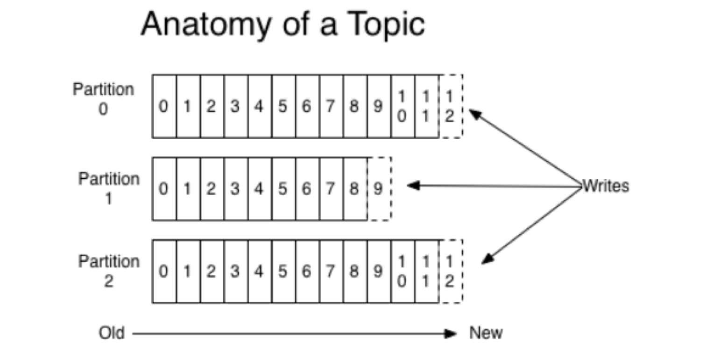
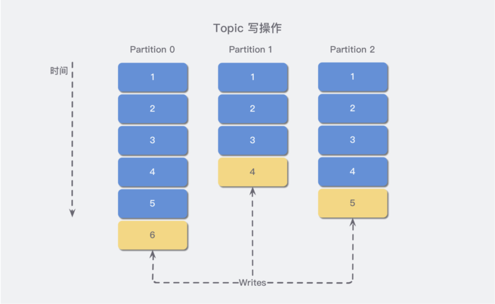
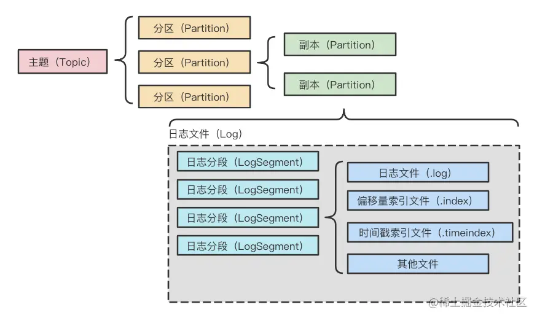
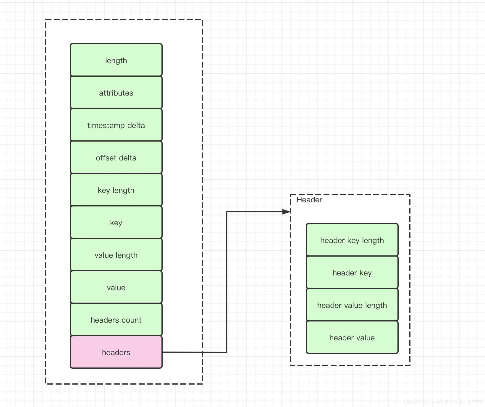
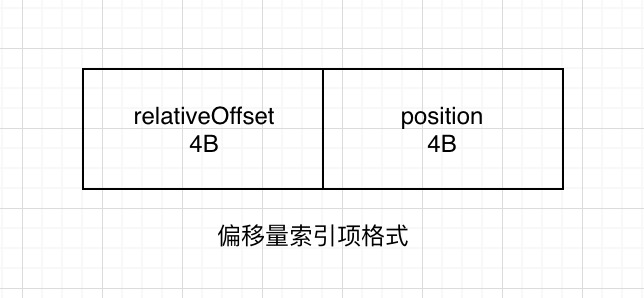
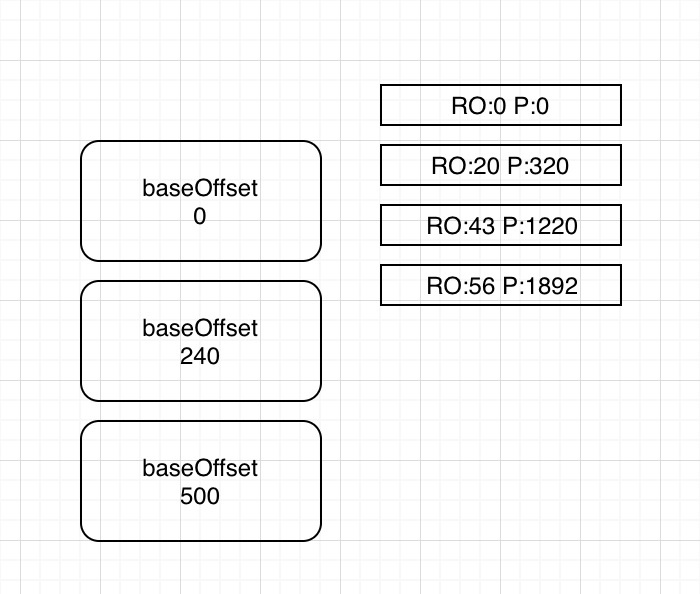
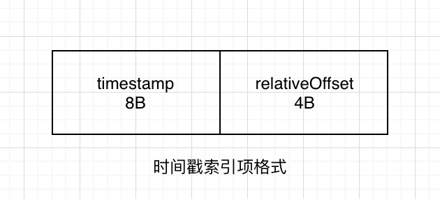
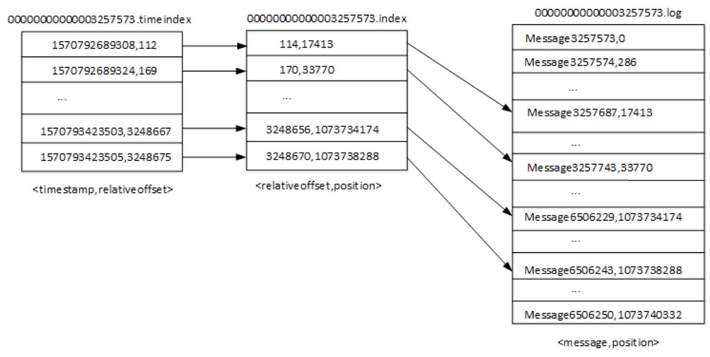
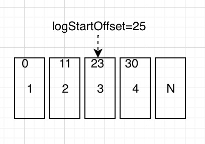

# Topic & Partition

## Kafka 基础概念

Kafka 是由 LinkedIn 开发并开源的分布式消息系统，因其分布式及高吞吐率而被广泛使用，现已与 Cloudera Hadoop，Apache Storm，Apache Spark，Flink 集成。

Kafka 是一种分布式的，基于发布/订阅的消息系统。主要设计目标如下：

- 以时间复杂度为 O(1) 的方式提供消息持久化能力，即使对 TB 级以上数据也能保证常数时间复杂度的访问性能；
- 高吞吐率。即使在非常廉价的商用机器上也能做到单机支持每秒 100K 条以上消息的传输；
- 支持 Kafka Server 间的消息分区，及分布式消费，同时保证每个 Partition 内的消息顺序传输；
- 同时支持离线数据处理和实时数据处理；
- Scale out：支持在线水平扩展；

### 为什么要使用 Kafka

- 解耦

  消息系统在处理过程中间插入了一个隐含的、基于数据的接口层，两边的处理过程都要实现这一接口。这允许你独立的扩展或修改两边的处理过程，只要确保它们遵守同样的接口约束。

  而基于消息发布订阅的机制，可以联动多个业务下游子系统，能够不侵入的情况下分步编排和开发，来保证数据一致性。

- 冗余

  有些情况下，处理数据的过程会失败。除非数据被持久化，否则将造成丢失。消息队列把数据进行持久化直到它们已经被完全处理，通过这一方式规避了数据丢失风险。许多消息队列所采用的”插入-获取-删除”范式中，在把一个消息从队列中删除之前，需要你的处理系统明确的指出该消息已经被处理完毕，从而确保你的数据被安全的保存直到你使用完毕。

- 扩展性

  因为消息队列解耦了你的处理过程，所以增大消息入队和处理的频率是很容易的，只要另外增加处理过程即可。不需要改变代码、不需要调节参数。扩展就像调大电力按钮一样简单。

- 灵活性 & 峰值处理能力

  在访问量剧增的情况下，应用仍然需要继续发挥作用，但是这样的突发流量并不常见；如果为以能处理这类峰值访问为标准来投入资源随时待命无疑是巨大的浪费。使用消息队列能够使关键组件顶住突发的访问压力，而不会因为突发的超负荷的请求而完全崩溃。

- 可恢复性

  系统的一部分组件失效时，不会影响到整个系统。消息队列降低了进程间的耦合度，所以即使一个处理消息的进程挂掉，加入队列中的消息仍然可以在系统恢复后被处理。

- 顺序保证

  在大多使用场景下，数据处理的顺序都很重要。大部分消息队列本来就是排序的，并且能保证数据会按照特定的顺序来处理。Kafka 保证一个 Partition 内的消息的有序性。

- 缓冲

  在任何重要的系统中，都会有需要不同的处理时间的元素。消息队列通过一个缓冲层来帮助任务最高效率的执行———写入队列的处理会尽可能的快速。该缓冲有助于控制和优化数据流经过系统的速度。

- 异步通讯

  很多时候，用户不想也不需要立即处理消息。消息队列提供了异步处理机制，允许用户把一个消息放入队列，但并不立即处理它。想向队列中放入多少消息就放多少，然后在需要的时候再去处理它们。

## Kafka 角色

### Topic & Partiton

Topic 在逻辑上可以被认为是一个 queue，每条消费都必须指定它的 Topic，可以简单理解为必须指明把这条消息放进哪个queue 里。我们把一类消息按照主题来分类，有点类似于数据库中的表。

为了使得 Kafka 的吞吐率可以线性提高，物理上把 Topic 分成一个或多个 Partition。对应到系统上就是一个或若干个目录。



### Broker

Broker：Kafka 集群包含一个或多个服务器，每个服务器节点称为一个 Broker。

Broker 存储 Topic 的数据。如果某 Topic 有 N 个 Partition，集群有 N 个 Broker，那么**每个 Broker 存储该 Topic 的一个 Partition**。

从 scale out 的性能角度思考，通过 Broker Kafka server 的更多节点，带更多的存储，建立更多的 Partition 把 IO 负载到更多的物理节点，提高总吞吐 IOPS。

从 scale up 的角度思考，一个 Node 拥有越多的 Physical Disk，也可以负载更多的 Partition，提升总吞吐 IOPS。

#### partition 与 broker 

Topic 只是一个逻辑概念，真正在 Broker 间分布的是 Partition。每一条消息被发送到 Broker 中，会根据 Partition 规则选择被存储到哪一个 Partition。如果 Partition 规则设置的合理，所有消息可以均匀分布到不同的 Partition中。

Kafka 会将所有 Partition 均匀分布到所有Broker 上，所以当只有2个 Partition 时，会有2个 Broker 为该 Topic 服务。3个 Partition 时同理会有3个 Broker 为该 Topic 服务。

当 Partition 数量多于 Broker 个数时，总吞吐量并未有所提升，甚至还有所下降。可能的原因是，当 Partition 数量为4和5时，不同 Broker 上的 Partition 数量不同，而 Producer 会将数据均匀发送到各 Partition 上，这就造成各Broker 的负载不同，不能最大化集群吞吐量。


## 存储原理

Kafka 的消息是存在于文件系统之上的。Kafka 高度依赖文件系统来存储和缓存消息。

操作系统还会将主内存剩余的所有空闲内存空间都用作磁盘缓存，所有的磁盘读写操作都会经过统一的磁盘缓存（除了直接 I/O 会绕过磁盘缓存）。

Kafka 正是利用**顺序 IO**，以及 **Page Cache** 达成的超高吞吐。

任何发布到 Partition 的消息都会被追加到 Partition 数据文件的尾部，这样的顺序写磁盘操作让 Kafka 的效率非常高。



### 日志存储

以下内容来自：

[kafka之深入理解日志存储](https://juejin.cn/post/7002062647684235301#heading-7)

[Kafka 日志存储](https://segmentfault.com/a/1190000019147699)

[kafka日志详解](https://blog.csdn.net/huxiaodong1994/article/details/117482620)

#### 文件目录布局

**每个副本都是以日志（Log）的形式存储消息的**。同时，**为了解决单一日志文件过大的问题，kafka采用了日志分段（LogSegment）的形式进行存储**。所谓日志分段，就是当一个日志文件大小到达一定条件之后，就新建一个新的日志分段，然后在新的日志分段写入数据。

为了加快消息的检索，每个日志分段除了真实的数据日志文件(`.log`后缀)之外，还有对应的2个索引文件：偏移量索引文件(`.index`)和时间戳索引文件(`.timeindex`)。整个主题、分区、副本、日志关系如下：



每个日志分段都有一个基准偏移量（baseOffset，20位数字），表示当前日志分段的**第一条消息的offset**。**日志分段相关文件名就用基准偏移量进行命名**。比如：

```
00000000000000000000.log
00000000000000000000.index
00000000000000000000.timeindex

00000000000000000121.log
00000000000000000121.index
00000000000000000121.timeindex
```

如果日志文件名为 `00000000000000000121.log` ，则当前日志文件的第一条数据偏移量就是 121。

2.0 中可以使用 `kafka-dump-log.sh` 查 看`.index` 文件

```shell
/data/kafka/bin/kafka-dump-log.sh --files ./00000000000000000000.index
```


#### 日志格式



各字段描述如下

- length:消息总长度。
- attributes：弃用，但还存在消息中，以备未来扩展使用。
- timestamp delta：时间戳增量。
- offset delta：位移偏移量。
- key length：表示key的长度。
- key：表示key的值。
- value length：表示value的长度。
- value：表示value的值
- headers count：消息中headers的数量。
- headers：用来支持应用级别的扩展。

一个日志文件，会包含多个日志分段（logSegment），那么日志的分段策略如下，只要满足其中一条，日志就会进行分段操作：

1. 当前日志分段文件大小超过了broker端参数log.segment.bytes配置的值。参数默认值为1073741824，即1GB。
2. 当前日志分段中消息的最大时间戳与当前系统的时间戳的差值大于log.roll.ms或log.roll.hours参数配置的值。如果同时配置了log.roll.ms和log.roll.hours参数，log,roll.ms优先级高。默认情况下，只配置了log.roll.hours，值为168，即7天。
3. 偏移量索引文件或时间戳索引文件的大小达到了broker端参数。log.index.size.max.bytes配置的值。默认值为10485760，即10MB。
4. 追加的消息的偏移量与当前日志分段的偏移量之间的差值大于Integer.MAX_VALUE，即要追加的消息的偏移量不能转变为相对偏移量。

##### 为什么是 `Integer.MAX_VALUE` ？

在偏移量索引文件中，每个索引项共占用 8 个字节，并分为两部分。相对偏移量和物理地址（具体见下面 ”偏移量索引“）。

相对偏移量：表示消息相对与基准偏移量的偏移量，占 4 个字节

物理地址：消息在日志分段文件中对应的物理位置，也占 4 个字节

4 个字节刚好对应 `Integer.MAX_VALUE` ，如果大于 `Integer.MAX_VALUE` ，则不能用 4 个字节进行表示了。

##### 索引文件切分过程

索引文件会根据 `log.index.size.max.bytes` 值进行预先分配空间，即文件创建的时候就是最大值，当真正的进行索引文件切分的时候，才会将其裁剪到实际数据大小的文件。这一点是跟日志文件有所区别的地方。其意义降低了代码逻辑的复杂性。

### 日志索引

日志分段文件包括了2个索引文件：偏移量索引文件和时间戳索引文件。其中，**偏移量索引文件用来建立消息偏移量与物理地址之间的映射关系，时间戳索引文件则是用来建立时间戳与偏移量的映射关系**。索引文件是以稀疏索引的方式构建的。稀疏索引是一个折中的方案，既不占用太多空间，也提供了一定的快速检索能力。

#### 偏移量索引

 

偏移量索引项格式如上所示。每个索引项占用8个字节，分为两部分：

1. relativeOffset：相对偏移量，4字节，表示消息相对于baseOffset的偏移量。当前文件的文件名即为baseOffset的值。
2. position：物理地址，4字节，表示消息在分段日志文件的物理位置。

根据偏移量索引查找消息过程如下：

1. 使用**跳跃表**快速定位偏移量索引文件。跳跃表的节点就是每个日志分段（logSegment）的段号，根据跳跃表就可以快速定位到目标数据段。
2. 使用**二分法**快速定位索引项。具体来说就是在索引文件中找到**小于当前偏移量的最大偏移量**的索引项。
3. 从上一步中索引项的物理地址开始，顺序查找出对应偏移量的消息。

##### 例子

可以通过如下命令解析`.index` 文件

```gradle
/data/kafka/bin/kafka-dump-log.sh --files ./00000000000000000000.index
offset:0 position:0
offset:20 position:320
offset:43 position:1220
```

> 注意：offset 与 position 没有直接关系哦，由于存在数据删除和日志清理。



上图的 baseOffset 就是基准偏移量，表示当前日志分段的**第一条消息的offset**。日志文件以此来命名。

**e.g. 如何查看 偏移量为 23 的消息？**

Kafka 中存在一个 `ConcurrentSkipListMap` 来保存在每个日志分段，通过**跳跃表**方式，定位到 `00000000000000000000.index` ，通过**二分法**在偏移量索引文件中找到不大于 23 的最大索引项，即 offset 20 那栏，然后从日志分段文件中的物理位置为 320 开始顺序查找偏移量为 23 的消息。

#### 时间戳索引



 时间戳索引项格式如上所示。每个索引项占用12个字节，分为两部分：

1. timestamp：当前日志分段的最大时间戳。
2. relativeOffset：时间戳对应消息的相对偏移量。

根据时间戳查找对应消息的过程如下：

1. 根据时间戳到每个日志分段文件中最大的时间戳逐一比较，定位到时间戳索引文件。
2. 使用二分法快速定位时间戳索引项。
3. 根据上一步中的偏移量，通过偏移量索引查出对应的消息。

##### 例子



**e.g. 查找时间戳为 1570793423504 开始的消息？**

- 将 1570793423504 和每个日志分段中最大时间戳 largestTimeStamp 逐一对比，直到找到不小于 1570793423504 所对应的日志分段。日志分段中的 largestTimeStamp 的计算是先查询该日志分段所对应时间戳索引文件，找到最后一条索引项，若最后一条索引项的时间戳字段值大于 0 ，则取该值，否则取该日志分段的最近修改时间。所以这一步就找到 00000000000003257573.timeindex 。
- 找到相应日志分段之后，使用二分法进行定位，与偏移量索引方式类似，找到小于等于 1570793423504 最大索引项，也就是 [1570793423503,3248667]。
- 拿着偏移量为 3248667 到偏移量索引文件中使用二分法找到不大于 3248667 最大索引项，即 [3248656,1073734174] 。
- 日志文件中从 1073734174 的物理位置开始查找大于等于 1570793423504 数据。

#### 总结

偏移量索引查找：跳表找到 xxx.index 日志分段 -> 在该日志分段索引文件中用二分法找到索引项，得到物理地址 -> 通过物理地址顺序查找对应偏移量。

时间戳索引查找：与所有日志分段的最大时间戳对比，找到 xxx.timeindex  -> 二分法找到 xxx.index 日志分段 -> 重复后续偏移量索引查找方法。

### 日志清理

Kafka将消息存在磁盘中，为了控制占用磁盘空间不断增加，Kafka支持了日志清理功能。kafka提供了两种日志清理策略：

1. 日志删除（Log Retention）：按照一定的保留策略直接删除不符合条件的日志分段。
2. 日志压缩（Log Compaction）：针对每个消息的key进行整合，对于相同key的不同value值，只保留最后一个版本。

#### 日志删除

| 配置                            | 默认值         | 说明                   |
| ------------------------------- | -------------- | ---------------------- |
| log.retention.check.interval.ms | 300000 (5分钟) | 检测频率               |
| log.retention.hours             | 168 (7天)      | 日志保留时间小时       |
| log.retention.minutes           |                | 日志保留时间分钟       |
| log.retention.ms                |                | 日志保留时间毫秒       |
| file.delete.delay.ms            | 60000 (1分钟)  | 延迟执行删除时间       |
| log.retention.bytes             | -1 无穷大      | 运行保留日志文件最大值 |

Kafka会周期性的检测并删除不符合保留条件的日志分段文件。这个周期可以通过broker端参数`log.tetention.check.interval.ms`配置，默认5分钟。

当前日志分段的保留策略有三种：基于时间的保留策略、基于日志大小的保留策略和基于日志起始偏移量的保留策略。

##### 基于时间

日志删除任务会检查当前日志文件**保留时间超过设置阈值**的日志分段集合，然后对应的所有文件加上`.deleted`后缀，最后由一个延迟任务来删除这些文件。阈值可以通过broker端参数`log.retention.ms`、`log.retention.minutes`和`log.retention.hours`设置，默认是7天。

##### 基于日志大小

日志删除任务会检查当前**日志大小超过设置阈值**的日志分段集合，然后对应的所有文件加上`.deleted`后缀，最后由一个延迟任务来删除这些文件。阈值可以通过broker端参数`log.retention.bytes`设置，默认值为-1，表示无穷大。

##### 基于日志起始偏移量

日志删除任务会检查当前日志分段的下一个日志分段的`baseOffset`小于等于`logStartOffset`的日志分段集合，然后对应的所有文件加上`.deleted`后缀，最后由一个延迟任务来删除这些文件。



##### 删除过程

假设 logStartOffset 等于 25，日志分段 1 的起始偏移量为 0，日志分段 2 的起始偏移量为 11， 日志分段 3 的起始偏移量为 23。

- 从头开始遍历每一个日志分段，日志分段 1 的下一个日志分段的起始偏移量为 11，小于 logStartOffset，将 日志分段 1 加入到删除队列中。
- 日志分段 2 的下一个日志分段的起始偏移量为 23，小于 logStartOffset，将 日志分段 2 加入到删除队列中。
- 日志分段 3 的下一个日志分段的起始偏移量为 30，大于 logStartOffset，则不进行删除。

其实这个 logStartOffset 我还没搞懂啥意思，网上看了一些也没看懂，等后续再来补充。

#### 日志压缩

日志压缩是在默认日志删除规则之外提供的一种清理数据的方式。日志压缩对于相同key的不同value值，只保留最后一个版本。

进行日志压缩时，首先将日志文件中的每条消息的key的哈希值和最后的偏移量offset存入SkimpyOffsetMap中，然后在遍历一边日志文件，将每个key对应的offset的大小与SkimpyOffsetMap中大小进行比较，小于SkimpyOffsetMap的偏移量就进行删除，大于等于这个偏移量就保留。

当进行了日志压缩后，原来的大日志文件，就会变的很小，为了避免过多的小文件，kakfa会将多个小文件进行合并，重新生成一个日志分段文件。

### 磁盘存储

kafka使用磁盘来存储消息。大家都知道，磁盘的读写性能是相对比较差的，那么使用磁盘的kafka做到高性能的呢？

#### 顺序写盘

实际上，顺序写盘的性能并不差，是随机写盘的6000倍以上。kafka在设计时采用了文件追加的方式来写入消息，就是使用了顺序写盘来保证高性能。

#### 页缓存

页缓存是操作系统支持的磁盘缓存，以此来减少磁盘`I/O`操作。简单来说，就是操作系统基于页为单位把磁盘中的热点数据缓存在内存中，进而将大量的`I/O`操作转换为内存操作，大大提高了整体性能。kafka中大量使用了页缓存，消息都是先写入页缓存中，然后才由操作系统写入到磁盘中。

#### 零拷贝

零拷贝是指将数据直接从磁盘文件复制到网卡设备中，不需要经过应用程序。零拷贝大大提高了应用程序的性能，减少了内核和用户模式的上下文切换。kafka采用了零拷贝技术来进一步提升性能。

