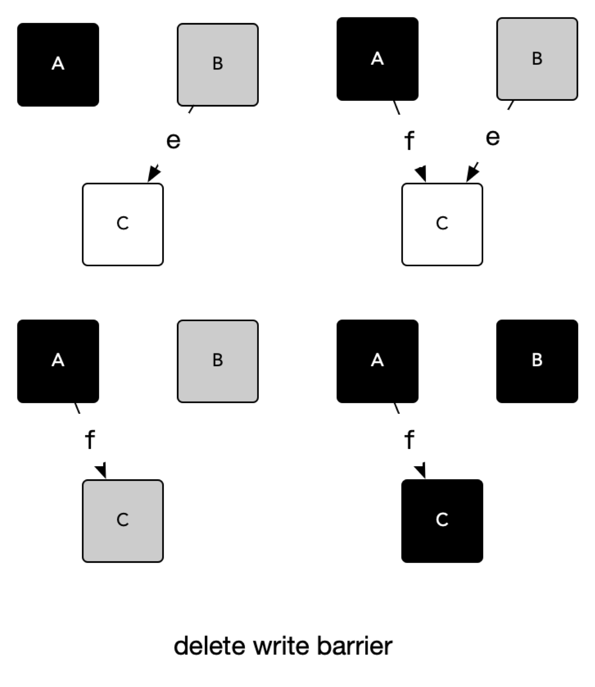

# GC 原理

## 标记&清除

现代高级编程语言管理内存的方式分为两种：自动和手动，像 C、C++ 等编程语言使用手动管理内存的方式，工程师编写代码过程中需要主动申请或者释放内存；而 PHP、Java 和 Go 等语言使用自动的内存管理系统，有内存分配器和垃圾收集器来代为分配和回收内存，其中垃圾收集器就是我们常说的 GC。主流的垃圾回收算法：

- 引用计数
- 追踪式垃圾回收

Go 现在用的三色标记法就属于追踪式垃圾回收算法的一种。

- STW

  stop the world, GC 的一些阶段需要停止所有的 mutator 以确定当前的引用关系。这便是很多人对 GC 担心的来源，这也是 GC 算法优化的重点。

- Root

  根对象是 mutator 不需要通过其他对象就可以直接访问到的对象。比如全局对象，栈对象中的数据等。通过Root 对象，可以追踪到其他存活的对象。

Mark Sweep 两个阶段：标记(Mark)和 清除(Sweep)两个阶段，所以也叫 Mark-Sweep 垃圾回收算法。

## 三色标记法

三色标记是对标记清除法的改进，标记清除法在整个执行时要求长时间 STW，Go 从1.5 版本开始改为三色标记法，初始将所有内存标记为白色，然后将 roots 加入待扫描队列(进入队列即被视为变成灰色)，然后使用并发 goroutine 扫描队列中的指针，如果指针还引用了其他指针，那么被引用的也进入队列，被扫描的对象视为黑色。

- 白色对象：潜在的垃圾，其内存可能会被垃圾收集器回收。
- 黑色对象：活跃的对象，包括不存在任何引用外部指针的对象以及从根对象可达的对象，垃圾回收器不会扫描这些对象的子对象。
- 灰色对象 ：活跃的对象，因为存在指向白色对象的外部指针，垃圾收集器会扫描这些对象的子对象。

垃圾收集器从 root 开始然后跟随指针递归整个内存空间。分配于 noscan 的 span 的对象, 不会进行扫描。然而，此过程不是由同一个 goroutine 完成的，每个指针都排队在工作池中 然后，先看到的被标记为工作协程的后台协程从该池中出队，扫描对象，然后将在其中找到的指针排入队列。

染色流程：

- 一开始所有对象被认为是白色
- 根节点(stacks，heap，global variables)被染色为灰色

一旦主流程走完，gc 会：

- 选一个灰色对象，标记为黑色
- 遍历这个对象的所有指针，标记所有其引用的对象为灰色

最终直到所有对象需要被染色。

## 写屏障

1.5版本在标记过程中使用三色标记法。回收过程主要有四个阶段，其中，标记和清扫都并发执行的，但标记阶段的前后需要 STW 一定时间来做GC 的准备工作和栈的 re-scan。

使用并发的垃圾回收，也就是多个 Mutator 与 Mark 并发执行，想要在并发或者增量的标记算法中保证正确性，我们需要达成以下两种三色不变性(Tri-color invariant)中的任意一种：

- 强三色不变性：黑色对象不会指向白色对象，只会指向灰色对象或者黑色对象。
- 弱三色不变性 ：黑色对象指向的白色对象必须包含一条从灰色对象经由多个白色对象的可达路径。

### 插入写屏障

插入屏障拦截将白色指针插入黑色对象的操作，标记其对应对象为灰色状态，这样就不存在黑色对象引用白色对象的情况了，满足强三色不变式，在插入指针 f 时将 C 对象标记为灰色。

如果对栈上的写做拦截，那么流程代码会非常复杂，并且性能下降会非常大，得不偿失。根据局部性的原理来说，其实我们程序跑起来，大部分的其实都是操作在栈上，函数参数啊、函数调用导致的压栈出栈、局部变量啊，协程栈，这些如果也弄起写屏障，那么可想而知了，根本就不现实，复杂度和性能就是越不过去的坎。

所以 Go 选择仅对堆上的指针插入增加写屏障，这样就会出现在扫描结束后，栈上仍存在引用白色对象的情况，这时的栈是灰色的，不满足三色不变式，所以需要对栈进行重新扫描使其变黑，完成剩余对象的标记，这个过程需要 STW。

初始化 GC 任务，包括开启写屏障(write barrier)和开启辅助 GC(mutator assist)，统计 root 对象的任务数量等，这个过程需要 STW。

扫描所有 root 对象，包括全局指针和 goroutine(G) 栈上的指针(扫描对应 G 栈时需停止该 G)，将其加入标记队列(灰色队列)，并循环处理灰色队列的对象，直到灰色队列为空，该过程后台并行执行。

完成标记工作，重新扫描(re-scan)全局指针和栈。因为 Mark 和 mutator 是并行的，所以在 Mark 过程中可能会有新的对象分配和指针赋值，这个时候就需要通过写屏障(write barrier)记录下来，re-scan 再检查一下，这个过程也是会 STW 的。按照标记结果回收所有的白色对象，该过程后台并行执行。

### 删除写屏障

删除屏障也是拦截写操作的，但是是通过保护灰色对象到白色对象的路径不会断来实现的。如上图例中，在删除指针 e 时将对象 C 标记为灰色，这样 C 下游的所有白色对象，即使会被黑色对象引用，最终也还是会被扫描标记的，满足了弱三色不变式。这种方式的回收精度低，一个对象即使被删除了最后一个指向它的指针也依旧可以活过这一轮，在下一轮 GC 中被清理掉。

插入屏障和删除屏障各有优缺点，Dijkstra 的插入写屏障在标记开始时无需 STW，可直接开始，并发进行，但结束时需要 STW 来重新扫描栈，标记栈上引用的白色对象的存活；Yuasa 的删除写屏障则需要在 GC 开始时 STW 扫描堆栈来记录初始快照，这个过程会保护开始时刻的所有存活对象，但结束时无需 STW。

Golang 中的混合写屏障满足的是变形的弱三色不变式，同样允许黑色对象引用白色对象，白色对象处于灰色保护状态，但是只由堆上的灰色对象保护。

### 混合写屏障

由于结合了 Yuasa 的删除写屏障和 Dijkstra 的插入写屏障的优点，只需要在开始时并发扫描各个goroutine 的栈，使其变黑并一直保持，这个过程不需要 STW，而标记结束后，因为栈在扫描后始终是黑色的，也无需再进行 re-scan 操作了，减少了 STW 的时间。

为了移除栈的重扫描过程，除了引入混合写屏障之外，在垃圾收集的标记阶段，我们还需要将创建的所有堆上新对象都标记成黑色，防止新分配的栈内存和堆内存中的对象被错误地回收，因为栈内存在标记阶段最终都会变为黑色，所以不再需要重新扫描栈空间。

## 参考文献

[Golang三色标记+混合写屏障GC模式全分析](https://zhuanlan.zhihu.com/p/334999060)

[golang 垃圾回收（五）混合写屏障](https://liqingqiya.github.io/golang/gc/垃圾回收/写屏障/2020/07/24/gc5.html)

[关于Golang GC的一些误解--真的比Java GC更领先吗？](https://zhuanlan.zhihu.com/p/77943973)