# 内存分配原理

## 堆栈&逃逸分析

Go 有两个地方可以分配内存：一个全局堆空间用来动态分配内存，另一个是每个 goroutine 都有的自身栈空间。

- 栈

  栈区的内存一般由编译器自动进行分配和释放，其中存储着函数的入参以及局部变量，这些参数会随着函数的创建而创建，函数的返回而销毁（通过 CPU push & release）。

- 堆

  堆区的内存一般由编译器和工程师自己共同进行管理分配，交给 Runtime GC 来释放。堆上分配必须找到一块足够大的内存来存放新的变量数据。后续释放时，垃圾回收器扫描堆空间寻找不再被使用的对象。

  每当一个值在函数的栈范围之外共享时，它将被放置（或分配）在堆上。

  栈分配廉价，堆分配昂贵。

#### 逃逸分析

逃逸分析是，“通过检查变量的作用域是否超出了它所在的栈来决定是否将它分配在堆上”的技术。其中“变量的作用域超出了它所在的栈”这种行为即被称为逃逸。逃逸分析在大多数语言里属于静态分析：在编译期由静态代码分析来决定一个值是否能被分配在栈帧上，还是需要“逃逸”到堆上。

作用：

- 减少 GC 压力，栈上的变量，随着函数退出后系统直接回收，不需要标记后再清除。
- 减少内存碎片的产生。
- 减轻分配堆内存的开销，提高程序的运行速度。

例子：

```go
package main

import (
	"fmt"
	"math/rand"
)

func main() {
	num := getRandom()
	fmt.Println(*num)
}

//go:noinline
func getRandom() *int {
	tmp := rand.Intn(100)
	return &tmp
}
```

运行 go build:

```shell
go build -gcflags '-m'
```

结果：

```shell
...
./main.go:15:2: moved to heap: tmp
./main.go:10:14: *num escapes to heap
...
```

结果指示 tmp 逃逸到堆上了，getRandom 函数执行完成之后 tmp 变量也不会被回收，还会被继续引用。其中 //go:noinline 的意思是禁止内联，关于内联可以查看这篇文章：[Go 内联优化：如何让我们的程序更快？](https://mp.weixin.qq.com/s/fKxITKsBct9GLRYk4HLdKA)

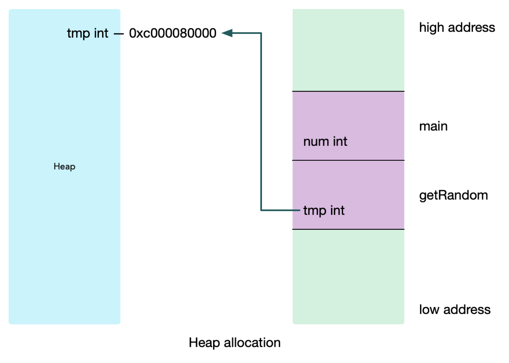

Go 查找所有变量超过当前函数栈侦的，把它们分配到堆上，避免 outlive 变量。

变量 tmp 在栈上分配，但是它**包含了指向堆内存的地址**，所以可以安全的从一个函数的栈侦复制到另外一个函数的栈帧。

##### 逃逸案例

还存在大量其他的 case 会出现逃逸，比较典型的就是 “多级间接赋值容易导致逃逸”，这里的多级间接指的是，对某个引用类对象中的引用类成员进行赋值（记住公式 Data.Field = Value，如果 Data, Field 都是引用类的数据类型，则会导致 Value 逃逸。这里的等号 = 不单单只赋值，也表示参数传递）。Go 语言中的引用类数据类型有 func, interface, slice, map, chan, *Type ：

- 一个值被分享到函数栈帧范围之外
- 在 for 循环外申明，在 for 循环内分配，同理闭包
- 发送指针或者带有指针的值到 channel 中
- 在一个切片上存储指针或带指针的值
- slice 的背后数组被重新分配了
- 在 interface 类型上调用方法
- .... go build -gcflags '-m'


## 连续栈

### 分段栈

Go 应用程序运行时，每个 goroutine 都维护着一个自己的栈区，这个栈区只能自己使用，不能被其他 goroutine 使用。栈区的初始大小是2KB(比 x86_64 架构下线程的默认栈2M 要小很多)，在 goroutine 运行的时候栈区会按照需要增长和收缩，占用的内存最大限制的默认值在64位系统上是1GB。

- v1.0 ~ v1.1 — 最小栈内存空间为 4KB
- v1.2 — 将最小栈内存提升到了 8KB
- v1.3 — 使用连续栈替换之前版本的分段栈
- v1.4 — 将最小栈内存降低到了 2KB

分段栈示意图：

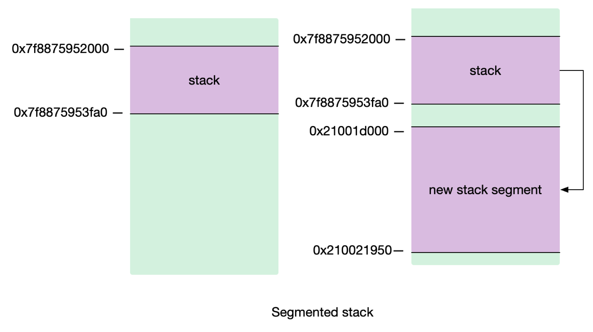

当栈空间不够时，会新分配一段内存空间作为新的栈分段，老的栈再通过指针连接到新栈分段，这就是分段栈的实现方式。

#### Hot Split 问题

分段栈的实现方式存在 “hot split” 问题，如果栈快满了，那么下一次的函数调用会强制触发栈扩容。

当函数返回时，新分配的 “stack chunk” 会被清理掉。如果这个函数调用产生的范围是在一个循环中，会导致严重的性能问题，频繁的 alloc/free。如下图所示：

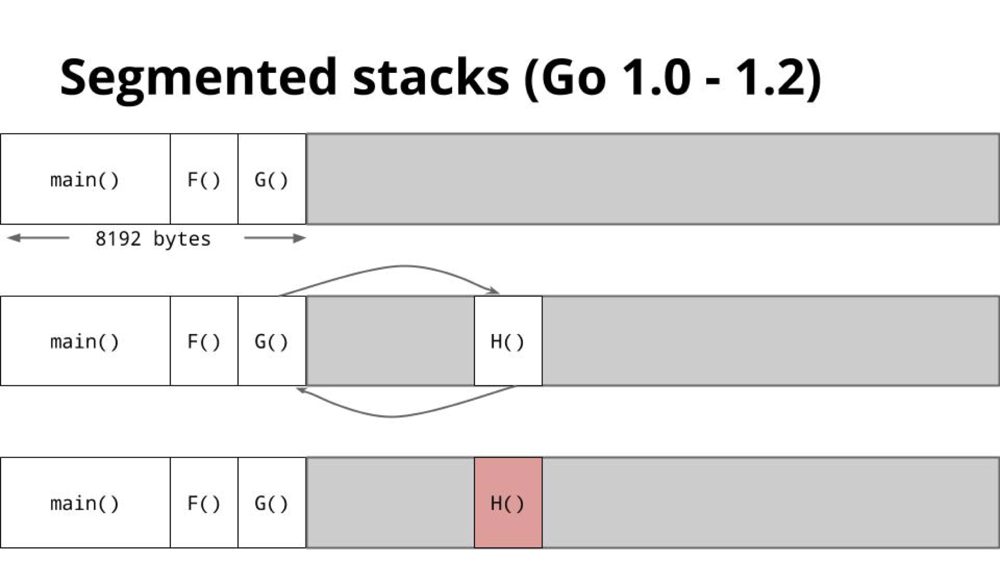

mian 函数调用 F 和 G ，此时栈空间满了，而 G 又要循环调用 H，此时会发生频繁创建栈空间和销毁栈空间的问题。

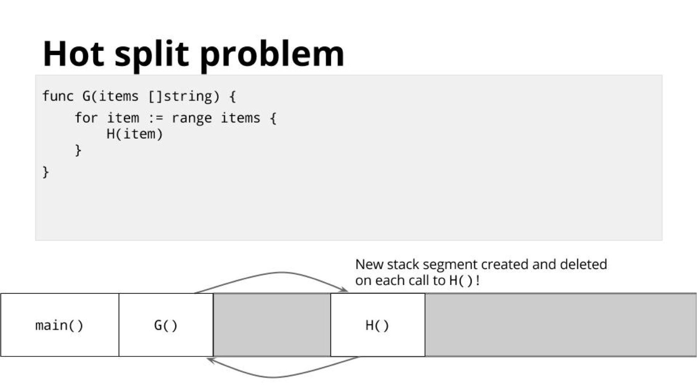

Go 不得不在1.2 版本把栈默认大小改为 8KB，降低触发热分裂的问题，但是每个 goroutine 内存开销就比较大了。直到实现了连续栈(contiguous stack)，栈大小才改为 2KB。

### 连续栈

采用复制栈的实现方式，在热分裂场景中不会频发释放内存，即不像分配一个新的内存块并链接到老的栈内存块，而是会分配一个**两倍大的内存块并把老的内存块内容复制到新的内存块里**，当栈缩减回之前大小时，我们不需要做任何事情。

- runtime.newstack 分配更大的栈内存空间。
- runtime.copystack 将旧栈中的内容复制到新栈中。
- 将指向旧栈对应变量的指针重新指向新栈。
- runtime.stackfree 销毁并回收旧栈的内存空间。

如果栈区的空间使用率不超过1/4，那么在垃圾回收的时候使用 runtime.shrinkstack 进行栈缩容，同样使用 copystack。

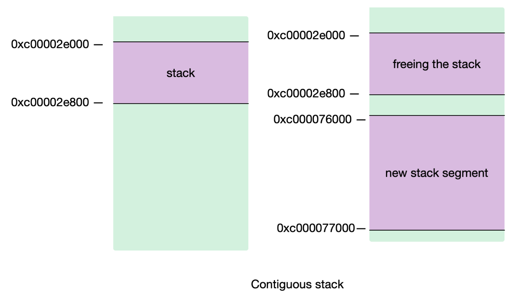

#### 栈扩容

Go 运行时判断栈空间是否足够，所以在 call function 中会插入 runtime.morestack，但每个函数调用都判定的话，成本比较高。在编译期间通过计算 sp、func stack framesize 确定需要哪个函数调用中插入 runtime.morestack。


## 内存结构

TCMalloc 是 Thread Cache Malloc 的简称，是Go 内存管理的起源，Go的内存管理是借鉴了TCMalloc，但有以下问题：

- 内存碎片

  随着内存不断的申请和释放，内存上会存在大量的碎片，降低内存的使用率。为了解决内存碎片，可以将 2 个连续的未使用的内存块合并，减少碎片。

- 大锁

  同一进程下的所有线程共享相同的内存空间，它们申请内存时需要加锁，如果不加锁就存在同一块内存被2个线程同时访问的问题。

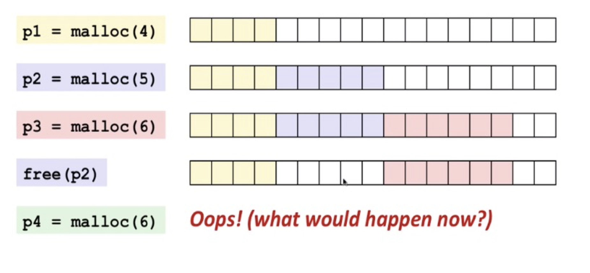

### 概念

- page: 内存页，一块 8K 大小的内存空间。Go 与操作系统之间的内存申请和释放，都是以 page 为单位的。
- span: 内存块，一个或多个连续的 page 组成一个 span。
- sizeclass: 空间规格，每个 span 都带有一个 sizeclass，标记着该 span 中的 page 应该如何使用。
- object: 对象，用来存储一个变量数据内存空间，一个 span 在初始化时，会被切割成一堆等大的 object。假设 object 的大小是 16B，span 大小是 8K，那么就会把 span 中的 page 就会被初始化 8K / 16B = 512 个 object。

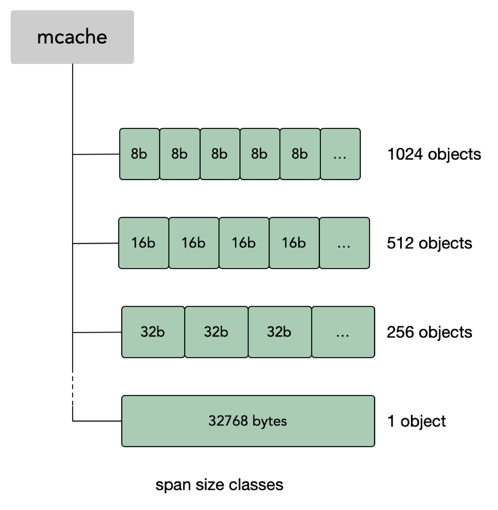

### **小于** **32kb** 内存分配

当程序里发生了 32kb 以下的小块内存申请时，Go 会从一个叫做的 **mcache** 的本地缓存给程序分配内存。这样的一个内存块里叫做 mspan，它是要给程序分配内存时的分配单元。

在 Go 的调度器模型里，每个线程  M 会绑定给一个处理器 P，在单一粒度的时间里只能做多处理运行一个 goroutine，**每个 P 都会绑定一个上面说的本地缓存 mcache**。当需要进行内存分配时，当前运行的 goroutine 会从 mcache 中查找可用的 mspan。从本地 mcache 里分配内存时不需要加锁，这种分配策略效率更高。

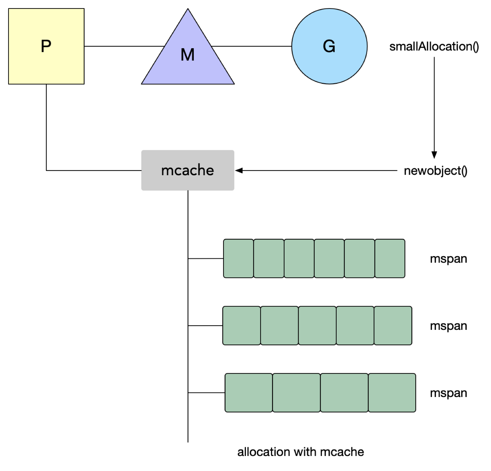

申请内存时都分给他们一个 mspan 这样的单元会不会产生浪费。其实 mcache 持有的这一系列的 mspan 并不都是统一大小的，而是按照大小，分了大概 67*2 类的 mspan。为什么有一个两倍的关系？为了加速之后内存回收的速度，数组里一半的 mspan 中分配的对象不包含指针，另一半则包含指针。对于无指针对象的 mspan 在进行垃圾回收的时候无需进一步扫描它是否引用了其他活跃的对象。

每个内存页分为多级固定大小的“空闲列表”，这有助于减少碎片。类似的思路在 Linux Kernel、Memcache 都可以见到 Slab-Allactor。

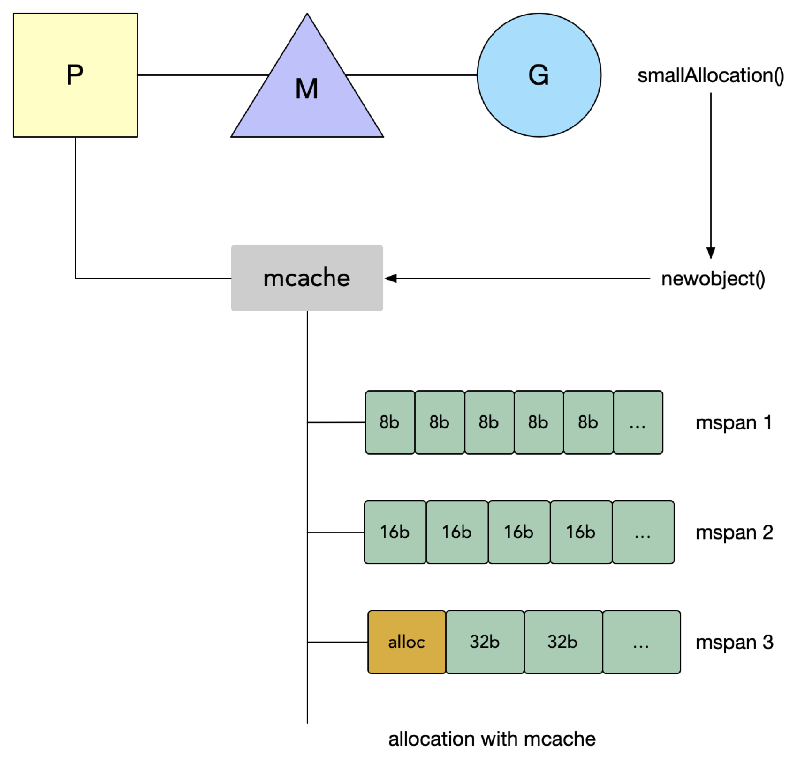

如果分配内存时 mcachce 里没有空闲的对口 sizeclass 的 mspan 了，Go 里还为每种类别的 mspan 维护着一个 **mcentral**。

mcentral 的作用是为所有 mcache 提供切分好的 mspan 资源。每个 central 会持有一种特定大小的全局 mspan 列表，包括已分配出去的和未分配出去的。 每个 mcentral 对应一种 mspan，当工作线程的 mcache 中没有合适(也就是特定大小的)的mspan 时就会从 mcentral 去获取。

mcentral 被所有的工作线程共同享有，存在多个 goroutine 竞争的情况，因此从 mcentral 获取资源时需要加锁。mcentral 里维护着两个双向链表，nonempty 表示链表里还有空闲的 mspan 待分配。empty 表示这条链表里的 mspan 都被分配了object 或缓存 mcache 中。

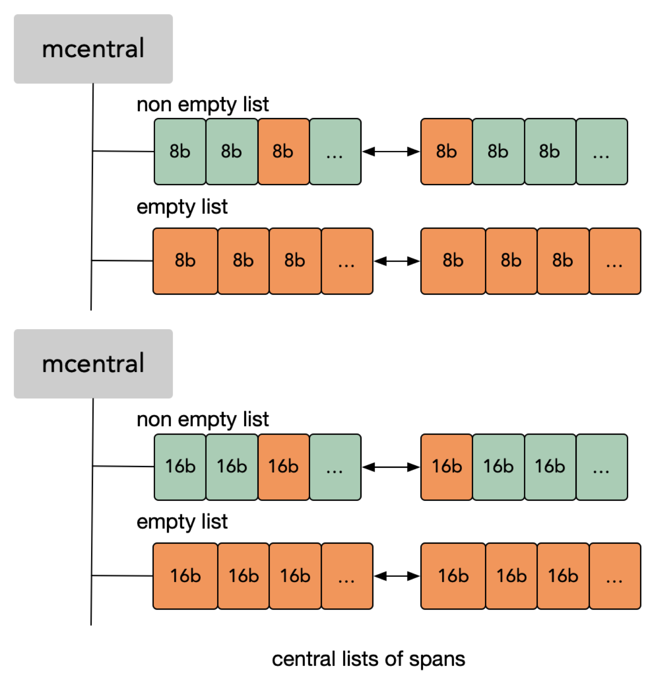

程序申请内存的时候，mcache 里已经没有合适的空闲 mspan了，那么工作线程就会像下图这样去 mcentral 里去申请。

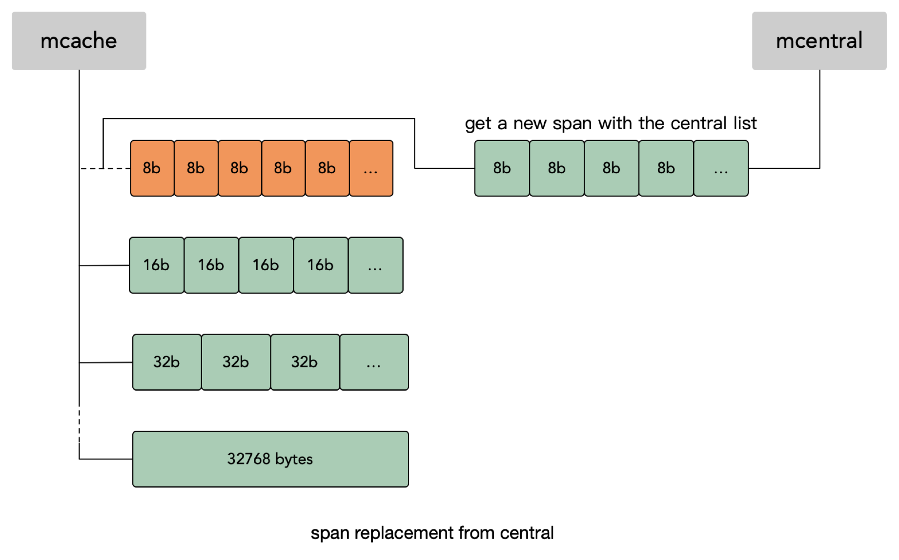

mcache 从 mcentral 获取和归还 mspan 的流程：

- 获取 加锁；从 nonempty 链表找到一个可用的mspan；并将其从 nonempty 链表删除；将取出的 mspan 加入到 empty 链表；将mspan 返回给工作线程；解锁。
- 归还 加锁；将 mspan 从 empty 链表删除；将mspan 加入到 nonempty 链表；解锁。

mcentral 是 sizeclass 相同的 span 会以链表的形式组织在一起, 就是指该 span 用来存储哪种大小的对象。

当 mcentral 没有空闲的 mspan 时，会向 mheap 申请。而 mheap 没有资源时，会向操作系统申请新内存。mheap 主要用于大对象的内存分配，以及管理未切割的 mspan，用于给 mcentral 切割成小对象。

mheap 中含有所有规格的 mcentral，所以当一个 mcache 从 mcentral 申请 mspan 时，只需要在独立的 mcentral 中使用锁，并不会影响申请其他规格的 mspan。

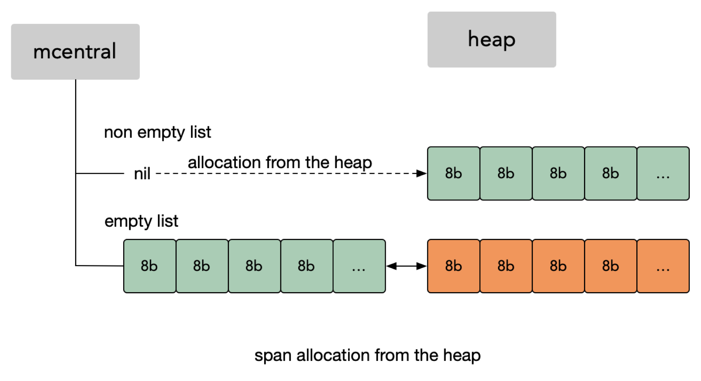

小细节：runtime/mheap.go 里包含了一个 pad 字段，为了防止 CPU cache line 伪共享：

```go
// Main malloc heap.
// The heap itself is the "free" and "scav" treaps,
// but all the other global data is here too.
//
// mheap must not be heap-allocated because it contains mSpanLists,
// which must not be heap-allocated.
//
//go:notinheap
type mheap struct {
  ...
  // central free lists for small size classes.
  // the padding makes sure that the mcentrals are
  // spaced CacheLinePadSize bytes apart, so that each mcentral.lock
  // gets its own cache line.
  // central is indexed by spanClass.
  central [numSpanClasses]struct {
     mcentral mcentral
     pad      [cpu.CacheLinePadSize - unsafe.Sizeof(mcentral{})%cpu.CacheLinePadSize]byte
  }
  ...
}
```

所有 mcentral 的集合则是存放于 mheap 中的。 mheap 里的 arena 区域是真正的堆区，运行时会将 8KB 看做一页，这些内存页中存储了所有在堆上初始化的对象。运行时使用二维的 runtime.heapArena 数组管理所有的内存，每个 runtime.heapArena 都会管理 64MB 的内存。

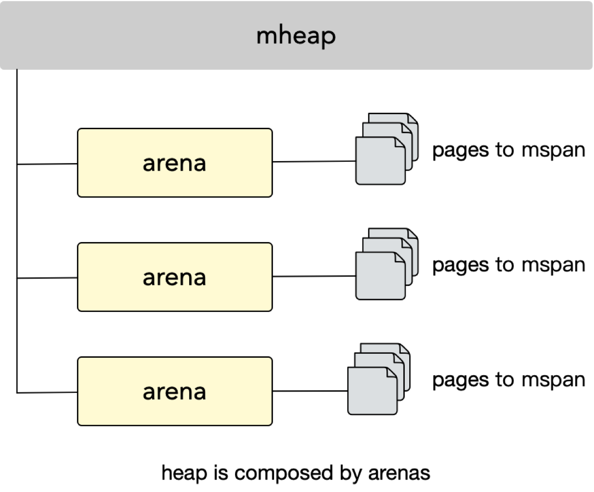

### **小于** 16 字节内存分配

对于小于16 字节的对象(且无指针)，Go 语言将其划分为了 tiny 对象。划分 tiny 对象的主要目的是为了处理极小的字符串和独立的转义变量。对 json 的基准测试表明，使用 tiny 对象减少了12% 的分配次数和 20% 的堆大小。tiny 对象会被放入 class 为 2 的 span 中。

- 首先查看之前分配的元素中是否有空余的空间。
- 如果当前要分配的大小不够，例如要分配16字节的大小，这时就需要找到下一个空闲的元素。

tiny 分配的第一步是尝试利用分配过的前一个元素的空间，达到节约内存的目的。

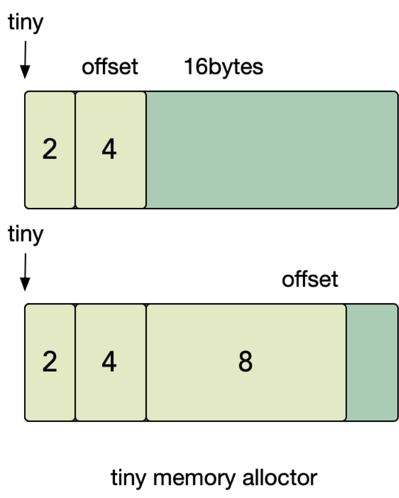

### 大于 32kb 内存分配

Go 没法使用工作线程的本地缓存 mcache 和全局中心缓存 mcentral 上管理超过 32KB 的内存分配，所以对于那些超过 32KB 的内存申请，会直接从堆上(mheap)上分配对应的数量的内存页(每页大小是 8KB)给程序。

- freelist
- treap
- radix tree + pagecache

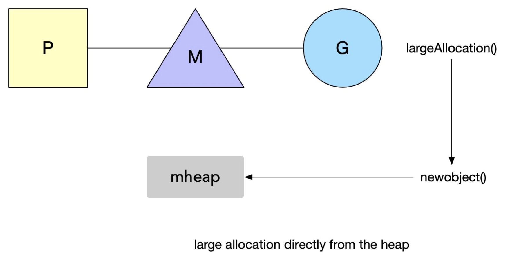

### 内存分配

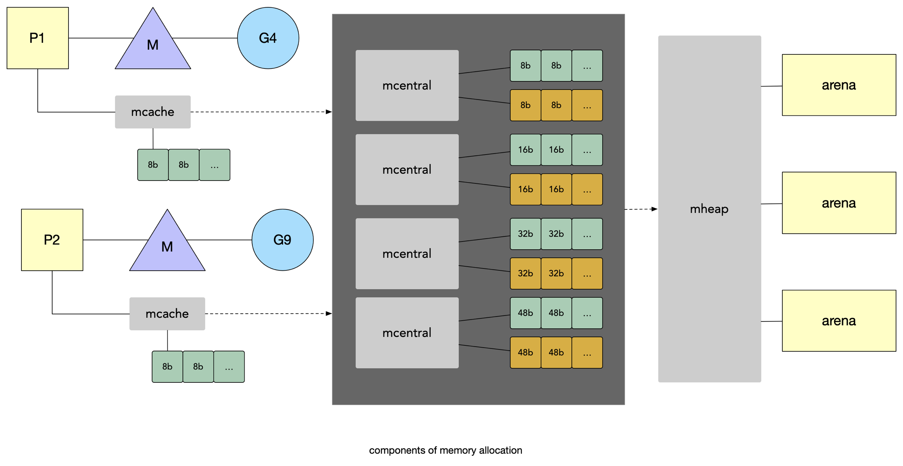

一般小对象通过 mspan 分配内存；大对象则直接由 mheap 分配内存。

- Go 在程序启动时，会向操作系统申请一大块内存，由 mheap 结构全局管理(现在 Go 版本不需要连续地址了，所以不会申请一大堆地址)。
- Go 内存管理的基本单元是 mspan，每种 mspan 可以分配特定大小的 object。
- mcache, mcentral, mheap 是 Go 内存管理的三大组件，mcache 管理线程在本地缓存的 mspan；mcentral 管理全局的 mspan 供所有线程。


## 参考文献

[Go内存分配那些事，就这么简单！](https://segmentfault.com/a/1190000020338427)

[内存分配器](https://draveness.me/golang/docs/part3-runtime/ch07-memory/golang-memory-allocator/#71-内存分配器)

[栈空间管理](https://draveness.me/golang/docs/part3-runtime/ch07-memory/golang-stack-management/)

[图解Go语言内存分配](https://juejin.cn/post/6844903795739082760)