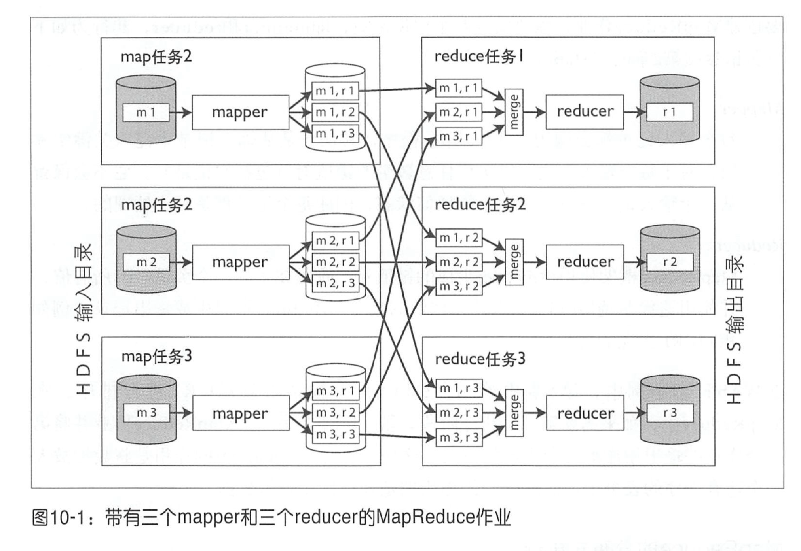
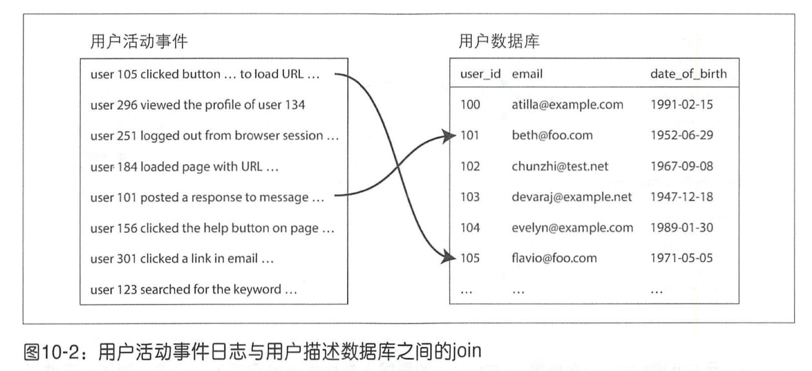
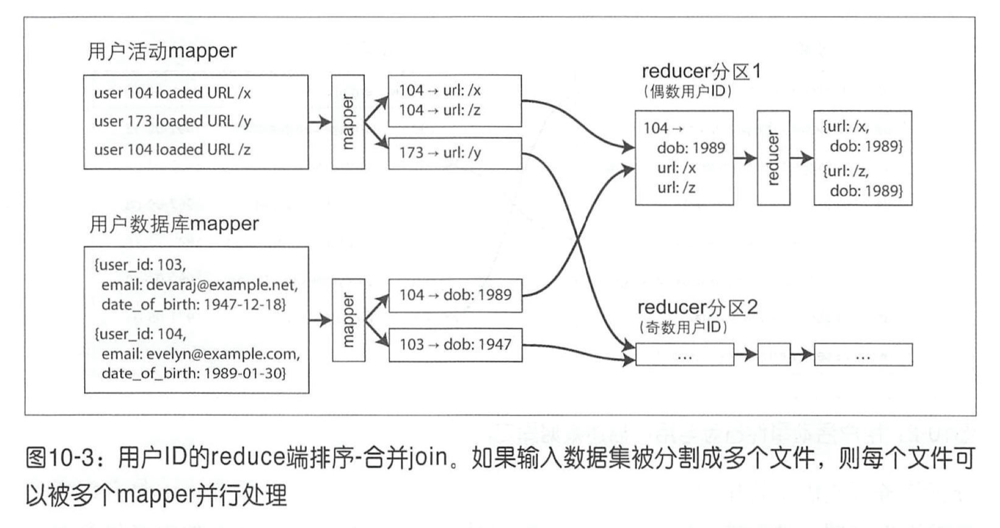

# 第十章：批处理系统

- 在线服务（或称在线系统）

  服务等待客户请求或指令的到达。当收到请求或指令时，服务试图尽可能快地处理它，并发回一个晌应。响应时间通常是服务性能的主要衡量指标，而可用性同样非常重要。

- 批处理系统（或称离线系统） 

  批处理系统接收大量的输入数据，运行一个作业来处理数据，井产生输出数据。作业往往需要执行一段时间（从几分钟到几天），所以用户通常不会等待作业完成。相反，批量作业通常会定期运行（例如，每天一次）。 批处理作业的主要性能衡量标准通常是吞吐量 （处理一定大小的输入数据集所需的时间）。

- 流处理系统（或称近实时系统）

  流处理介于在线与离线／批处理之间（所以有时称为近实时或近线处理）。与批处理系统类似，流处理系统处理输入井产生输出（而不是响应请求）。但是，流式作业在事件发生后不久即可对事件进行处理，而批处理作业则使用固定的一组输入数据进行操作。这种差异使得流处理系统比批处理系统具有更低的延迟。

## 使用 UNIX工具进行批处理

### 简单日志分析

```shell
cat /var/log/nginx/access.log | #1
  awk '{print $7}' | #2
  sort             | #3
  uniq -c          | #4
  sort -r -n       | #5
  head -n 5          #6
```

1. 读取日志文件。
2. 将每一行按空格分割成不同的字段，每行只输出第七个字段，恰好是请求的 URL。在我们的例子中是 `/css/typography.css`。
3. 按字母顺序排列请求的 URL 列表。如果某个 URL 被请求过 n 次，那么排序后，文件将包含连续重复出现 n 次的该 URL。
4. `uniq` 命令通过检查两个相邻的行是否相同来过滤掉输入中的重复行。 `-c` 则表示还要输出一个计数器：对于每个不同的 URL，它会报告输入中出现该 URL 的次数。
5. 第二种排序按每行起始处的数字（`-n`）排序，这是 URL 的请求次数。然后逆序（`-r`）返回结果，大的数字在前。
6. 最后，只输出前五行（`-n 5`），并丢弃其余的。该系列命令的输出如下所示：

```
    4189 /favicon.ico
    3631 /2013/05/24/improving-security-of-ssh-private-keys.html
    2124 /2012/12/05/schema-evolution-in-avro-protocol-buffers-thrift.html
    1369 /
     915 /css/typography.css
```

如果要从报告中省略 CSS 文件，可以将 awk 参数更改为 `'$7 !~ /\.css$/ {print $7}'`, 如果想统计最多的客户端 IP 地址，可以把 awk 参数改为 `'{print $1}'` 等等。


## MapReduce与分布式文件系统

HDFS，Hadoop Distributed File System，一个Google文件系统（ GFS ）的开源实现版本[19]。

HDFS 包含一个在每台机器上运行的守护进程， 并会开放一个网络服务以允许其他节点访问存储在该机器上的文件（假设数据中心的每台节点都附带一些本地磁盘）。名为 NameNode 的中央服务器会跟踪哪个文件块存储在哪台机器上。

### MapReduce作业执行

- Mapper

  每个输入记录都会调用 一次 mapper 程序，其任务是从输入记录中提取关键字和值。对于每个输入，它可以生成任意数量的健值对（包括空记录）。它不会保留从一个输入记录到下一个记录的任何状态，因此每个记录都是独立处理的。

- Reducer

  MapReduce 框架使用由 mapper 生成的键值对， 收集属于同一个关键字的所有值， 并使用迭代器调用 reducer 以使用该值的集合。Reducer 可以生成输出记录（例如相同 URL 出现的次数）。

一个输入文件的大小通常是几百兆字节。只要有足够的空闲内存和 CPU 资源，MapReduce 调度器会尝试在输入文件副本的某台机器上运行 mapper 任务 [26]。这个原理被称为将计算靠近数据 [27]：它避免将输入文件通过网络进行复制，减少了网络负载，提高了访问局部性。



过程：

1. MapReduce 框架复制代码到分配运行任务的节点上。然后启动 map 任务并开始读取输入文件，每次将一条记录传递给回调函数 mapper。mapper 的输出是键值对。Map 任务的数量由输入文件块的数量决定。
2. 对键值对分阶段排序。每个 map 任务都基于关键字哈希值，按照 reducer 对输出进行分块。每一个分区都被写入 mapper 程序所在本地磁盘上的已排序文件。
3. reducer 与每个 mapper 相连接，并按照其分区从 mapper 中下载排序后的键值对文件。（按照 reducer 分区，排序并将数据分区从 mapper 复制到 reducer， 这样一个过程被称为 shuffle [26]）
4. reduce 任务从 mapper 中获取文件并将它们合并在一起，同时保持数据的排序。通过迭代器扫描所有相同关键字的记录，可以以任意逻辑来处理这些记录，井且生成任意数量的输出记录。这些输出记录被写入分布式文件系统中的文件 （通常是在运行 reducer 机器的本地磁盘中的一个拷贝，在其他机器上存在副本） 。reduce 任务的数量由作业的作者来配置。

### Reduce端的join与分组

图 10-2 给出了批处理作业中典型的 join 示例。需要将左边的用户活动事件与用户数据库通过 user_id 进行 join。



可以将用户数据库放在 HDFS 中的一组文件中，井将用户活动记录放在另一组文件中，使用 MapReduce 将所有相关记录集中到一起，进行排序合并 join。



用户活动 mapper 以用户 ID 作为 key， 活动事件作为 value，用户数据库 mapper 则是以用户 ID 作为 key，用户出生日期为 value。对键值对进行排序，让用户 ID 相同的数据彼此相邻。然后也可以按时间戳顺序查看活动事件，这种技术称为次级排序[26]。

然后 reducer 可以很容易地执行真正的 join 逻辑：为每个用户 ID 调用一次 reducer 函数。由于次级排序，第一个值应该是来自用户数据库的出生日期记录。 Reducer 将出生日期存储在局部变量中，然后使用相同的用户 ID 遍历活动事件，输出相应的已观看网址和观看者年龄。随后的 MapReduce 作业可以计算每个 URL 的查看者年龄分布，并按年龄组进行聚类。

由于 reducer 每次处理一个特定用户 ID 的所有记录，因此只需要将用户记录在内存中保存一次，而不需要通过网络发出任何请求。这个算法被称为排序－合并 join ，因为 mapper 的输出是按关键字排序的，然后 reducer 将来自 join 两侧的已排序记录列表合并在一起。

#### 处理数据倾斜

如果某个关键字相关的数据量非常大，比如拥有几百万粉丝的博主。这种不成比例的活跃数据库记录被称为关键对象[38]或热键。

使用热键对记录进行分组井汇总时，可以分两个阶段进行分组。

- 第一个 MapReduce 阶段将记录**随机**（而不是通过关键字哈希）发送到 reducer ，以便每个 reducer 对热键的记录子集执行分组，并为每个键输出更紧凑的聚合值。

- MapReduce 作业将来自所有第一阶段 reducer 的值合并为每个键的单一值。

### map端join操作

上一节描述的 join 算法在 reducer 中执行实际的 join 逻辑，因此被称为 reduce 端 join。mapper 负责准备输入数据：从每个输入记录中提取关键字和值，将键值对分配给 reducer 分区，并按关键字排序。

Reduce 端 join 方法的优点是不需要对输入数据做任何假设：无论其属性与结构如何，mapper 都可以将数据处理好以准备 join。然而所有这些排序，复制至 reducer 以及合并 reducer 输入可能会是非常昂贵的操作，这取决于可用的内存缓冲区，当数据通过 MapReduce 阶段时，数据可能需要写入磁盘若干次 [37]。

map 端 join 使用了一个缩减版本的 MapReduce 作业，其中没有 reducer，也没有排序；相反，每个 mapper 只需从分布式文件系统中读取输入文件块，然后将输出文件写入文件系统即可。

#### 广播哈希 join

广播哈希 join 特别适合大数据集与小数据集 join，尤其是小数据集能够全部加载到每个 mapper 的内存中。比如图 10-2 的例子，每个 mapper 先将用户数据库读取到内存，用哈希表存储，然后 mapper 程序扫描用户活动事件，并通过用户 ID 去查找哈希表的出生日期。广播主要是指大数据集每个分区的 mapper 还读取整个小数据集。

#### 分区哈希 join

对 map 端 join 的输入进行分区，比如 Mapper3 首先将所有用户 ID 以 3 结尾的用户数据加载到哈希表中，然后扫描 ID 以 3 结尾的每个用户的所有活动事件。这样所有要 join 的记录都位于相同编号的分区中，因此每个 mapper 只需读取一个分区的输入就足够了。这样的优点是每个 mapper 可以将较少的数据加载到其哈希表中。

分区哈希 join 在Hive [37] 中称为 bucketed map join 。


## 超越 MapReduce

### 数据流引擎

Spark、Tez、Flink 这些数据流引擎有一个共同点：它们把整个工作流作为一个作业来处理，而不是把它分解成独立的子作业。

由于通过若干个处理阶段明确地建模数据流，所以这些系统被称为数据流引擎。像 MapReduce 一样，它们通过反复调用用户定义的函数来在单个线程上一次处理一条记录。它们通过对输入进行分区来并行工作， 并将一个功能的输出复制到网络上，成为另一个功能的输入。

简单总结一下，数据流对 MapReduce 的改进是，不需要自己将所有中间状态写入文件系统。

### 高级 API 和语言

重写 mapper 和 reducer 很麻烦，所以有了很多高级API简化开发；随着使用场景的扩展，一些可重复使用的算法，模式被固化下来，类似于三方库可以直接使用。比如 Hive、Pig 等高级语言和API，。 Spark 和 Flink 也包含他们自己的高级数据流 API ， 其中很多灵感来自 FlumeJava [34]。


## 小结

UNIX 系统允许多个程序组合在一起的统一接口是文件和管道；在Map Reduce 中，该接口是分布式文件系统。数据流引擎添加了自己的管道式数据传输机制，以避免在分布式文件系统中将中间状态实体化，而作业的初始输入和最终输出通常仍然是HDFS 。

分布式批处理框架需要解决的两个主要问题是：

- 分区

在 MapReduce 中， mapper 根据输入文件块进行分区。 mapper 的输出被重新分区、排序，合并成一个可配置数量的 reducer 分区。这个过程的目的是把所有的相关数据，例如，具有相同关键字的所有记录都放在同一个地方。

除非必需，后 MapReduce 的数据流引擎都尽量避免排序，但它们采取了大致类似的分区方法。

- 容错


MapReduce 需要频繁写入磁盘，这使得可以从单个失败任务中轻松恢复，而无需重新启动整个作业，但在无故障情况下则会减慢执行速度。数据流引擎执行较少的中间状态实体化并保留更多的内存，这意味着如果节点出现故障，他们需要重新计算更多的数据。确定性运算符减少了需要重新计算的数据量。

> 确定性运算符：如果给定相同的输入数据，那么运算符始会终产生相同的输出。

几种 MapReduce 的 join 算法：

- 排序 - 合并 join：

每个将要 join 的输入都会由一个 join 关键字的 mapper 来处理。通过分区、排序与合井，具有相同关键字的所有记录最终都会进入对 reducer 的同一个调用。 然后这个函数输出 join 记录。

- 广播哈希 join


两个 join 输入中的某一个数据集很小，所以不需要分区，而完全加载到哈希表中。因此，可以为大数据集的每个分区启动一个 mapper，将小数据集的哈希表加载到每个 mapper 中，然后一 次扫描大数据集的一条记录，对每条记录进行哈希表查询。

- 分区哈希 join


如果两个 join 的输入以相同的方式分区（使用相同的关键字，相同的哈希函数和相同数量的分区），则哈希表方法可以独立用于每个分区。


## 参考文献

1. Jeffrey Dean and Sanjay Ghemawat: “[MapReduce: Simplified Data Processing on Large Clusters](http://research.google.com/archive/mapreduce.html),” at *6th USENIX Symposium on Operating System Design and Implementation* (OSDI), December 2004.
2. Joel Spolsky: “[The Perils of JavaSchools](http://www.joelonsoftware.com/articles/ThePerilsofJavaSchools.html),” *joelonsoftware.com*, December 25, 2005.
3. Shivnath Babu and Herodotos Herodotou: “[Massively Parallel Databases and MapReduce Systems](http://research.microsoft.com/pubs/206464/db-mr-survey-final.pdf),” *Foundations and Trends in Databases*, volume 5, number 1, pages 1–104, November 2013. [doi:10.1561/1900000036](http://dx.doi.org/10.1561/1900000036)
4. David J. DeWitt and Michael Stonebraker: “[MapReduce: A Major Step Backwards](https://homes.cs.washington.edu/~billhowe/mapreduce_a_major_step_backwards.html),” originally published at *databasecolumn.vertica.com*, January 17, 2008.
5. Henry Robinson: “[The Elephant Was a Trojan Horse: On the Death of Map-Reduce at Google](http://the-paper-trail.org/blog/the-elephant-was-a-trojan-horse-on-the-death-of-map-reduce-at-google/),” *the-paper-trail.org*, June 25, 2014.
6. “[The Hollerith Machine](https://www.census.gov/history/www/innovations/technology/the_hollerith_tabulator.html),” United States Census Bureau, *census.gov*.
7. “[IBM 82, 83, and 84 Sorters Reference Manual](http://www.textfiles.com/bitsavers/pdf/ibm/punchedCard/Sorter/A24-1034-1_82-83-84_sorters.pdf),” Edition A24-1034-1, International Business Machines Corporation, July 1962.
8. Adam Drake: “[Command-Line Tools Can Be 235x Faster than Your Hadoop Cluster](https://adamdrake.com/command-line-tools-can-be-235x-faster-than-your-hadoop-cluster.html),” *aadrake.com*, January 25, 2014.
9. “[GNU Coreutils 8.23 Documentation](http://www.gnu.org/software/coreutils/manual/html_node/index.html),” Free Software Foundation, Inc., 2014.
10. Martin Kleppmann: “[Kafka, Samza, and the Unix Philosophy of Distributed Data](http://martin.kleppmann.com/2015/08/05/kafka-samza-unix-philosophy-distributed-data.html),” *martin.kleppmann.com*, August 5, 2015.
11. Doug McIlroy:[Internal Bell Labs memo](http://cm.bell-labs.com/cm/cs/who/dmr/mdmpipe.pdf), October 1964. Cited in: Dennis M. Richie: “[Advice from Doug McIlroy](https://www.bell-labs.com/usr/dmr/www/mdmpipe.html),” *cm.bell-labs.com*.
12. M. D. McIlroy, E. N. Pinson, and B. A. Tague: “[UNIX Time-Sharing System: Foreword](https://archive.org/details/bstj57-6-1899),” *The Bell System Technical Journal*, volume 57, number 6, pages 1899–1904, July 1978.
13. Eric S. Raymond: [*The Art of UNIX Programming*](http://www.catb.org/~esr/writings/taoup/html/). Addison-Wesley, 2003. ISBN: 978-0-13-142901-7
14. Ronald Duncan: “[Text File Formats – ASCII Delimited Text – Not CSV or TAB Delimited Text](https://ronaldduncan.wordpress.com/2009/10/31/text-file-formats-ascii-delimited-text-not-csv-or-tab-delimited-text/),” *ronaldduncan.wordpress.com*, October 31, 2009.
15. Alan Kay: “[Is 'Software Engineering' an Oxymoron?](http://tinlizzie.org/~takashi/IsSoftwareEngineeringAnOxymoron.pdf),” *tinlizzie.org*.
16. Martin Fowler: “[InversionOfControl](http://martinfowler.com/bliki/InversionOfControl.html),” *martinfowler.com*, June 26, 2005.
17. Daniel J. Bernstein: “[Two File Descriptors for Sockets](http://cr.yp.to/tcpip/twofd.html),” *cr.yp.to*.
18. Rob Pike and Dennis M. Ritchie: “[The Styx Architecture for Distributed Systems](http://doc.cat-v.org/inferno/4th_edition/styx),” *Bell Labs Technical Journal*, volume 4, number 2, pages 146–152, April 1999.
19. Sanjay Ghemawat, Howard Gobioff, and Shun-Tak Leung: “[The Google File System](http://research.google.com/archive/gfs-sosp2003.pdf),” at *19th ACM Symposium on Operating Systems Principles* (SOSP), October 2003. [doi:10.1145/945445.945450](http://dx.doi.org/10.1145/945445.945450)
20. Michael Ovsiannikov, Silvius Rus, Damian Reeves, et al.: “[The Quantcast File System](http://db.disi.unitn.eu/pages/VLDBProgram/pdf/industry/p808-ovsiannikov.pdf),” *Proceedings of the VLDB Endowment*, volume 6, number 11, pages 1092–1101, August 2013. [doi:10.14778/2536222.2536234](http://dx.doi.org/10.14778/2536222.2536234)
21. “[OpenStack Swift 2.6.1 Developer Documentation](http://docs.openstack.org/developer/swift/),” OpenStack Foundation, *docs.openstack.org*, March 2016.
22. Zhe Zhang, Andrew Wang, Kai Zheng, et al.: “[Introduction to HDFS Erasure Coding in Apache Hadoop](http://blog.cloudera.com/blog/2015/09/introduction-to-hdfs-erasure-coding-in-apache-hadoop/),” *blog.cloudera.com*, September 23, 2015.
23. Peter Cnudde: “[Hadoop Turns 10](http://yahoohadoop.tumblr.com/post/138739227316/hadoop-turns-10),” *yahoohadoop.tumblr.com*, February 5, 2016.
24. Eric Baldeschwieler: “[Thinking About the HDFS vs. Other Storage Technologies](http://hortonworks.com/blog/thinking-about-the-hdfs-vs-other-storage-technologies/),” *hortonworks.com*, July 25, 2012.
25. Brendan Gregg: “[Manta: Unix Meets Map Reduce](http://dtrace.org/blogs/brendan/2013/06/25/manta-unix-meets-map-reduce/),” *dtrace.org*, June 25, 2013.
26. Tom White: *Hadoop: The Definitive Guide*, 4th edition. O'Reilly Media, 2015. ISBN: 978-1-491-90163-2
27. Jim N. Gray: “[Distributed Computing Economics](http://arxiv.org/pdf/cs/0403019.pdf),” Microsoft Research Tech Report MSR-TR-2003-24, March 2003.
28. Márton Trencséni: “[Luigi vs Airflow vs Pinball](http://bytepawn.com/luigi-airflow-pinball.html),” *bytepawn.com*, February 6, 2016.
29. Roshan Sumbaly, Jay Kreps, and Sam Shah: “[The 'Big Data' Ecosystem at LinkedIn](http://www.slideshare.net/s_shah/the-big-data-ecosystem-at-linkedin-23512853),” at *ACM International Conference on Management of Data (SIGMOD)*, July 2013. [doi:10.1145/2463676.2463707](http://dx.doi.org/10.1145/2463676.2463707)
30. Alan F. Gates, Olga Natkovich, Shubham Chopra, et al.: “[Building a High-Level Dataflow System on Top of Map-Reduce: The Pig Experience](http://www.vldb.org/pvldb/2/vldb09-1074.pdf),” at *35th International Conference on Very Large Data Bases* (VLDB), August 2009.
31. Ashish Thusoo, Joydeep Sen Sarma, Namit Jain, et al.: “[Hive – A Petabyte Scale Data Warehouse Using Hadoop](http://i.stanford.edu/~ragho/hive-icde2010.pdf),” at *26th IEEE International Conference on Data Engineering* (ICDE), March 2010. [doi:10.1109/ICDE.2010.5447738](http://dx.doi.org/10.1109/ICDE.2010.5447738)
32. “[Cascading 3.0 User Guide](http://docs.cascading.org/cascading/3.0/userguide/),” Concurrent, Inc., *docs.cascading.org*, January 2016.
33. “[Apache Crunch User Guide](https://crunch.apache.org/user-guide.html),” Apache Software Foundation, *crunch.apache.org*.
34. Craig Chambers, Ashish Raniwala, Frances Perry, et al.: “[FlumeJava: Easy, Efficient Data-Parallel Pipelines](https://research.google.com/pubs/archive/35650.pdf),” at *31st ACM SIGPLAN Conference on Programming Language Design and Implementation* (PLDI), June 2010. [doi:10.1145/1806596.1806638](http://dx.doi.org/10.1145/1806596.1806638)
35. Jay Kreps: “[Why Local State is a Fundamental Primitive in Stream Processing](https://www.oreilly.com/ideas/why-local-state-is-a-fundamental-primitive-in-stream-processing),” *oreilly.com*, July 31, 2014.
36. Martin Kleppmann: “[Rethinking Caching in Web Apps](http://martin.kleppmann.com/2012/10/01/rethinking-caching-in-web-apps.html),” *martin.kleppmann.com*, October 1, 2012.
37. Mark Grover, Ted Malaska, Jonathan Seidman, and Gwen Shapira: *[Hadoop Application Architectures](http://shop.oreilly.com/product/0636920033196.do)*. O'Reilly Media, 2015. ISBN: 978-1-491-90004-8
38. Philippe Ajoux, Nathan Bronson, Sanjeev Kumar, et al.: “[Challenges to Adopting Stronger Consistency at Scale](https://www.usenix.org/system/files/conference/hotos15/hotos15-paper-ajoux.pdf),” at *15th USENIX Workshop on Hot Topics in Operating Systems* (HotOS), May 2015.
39. Sriranjan Manjunath: “[Skewed Join](https://wiki.apache.org/pig/PigSkewedJoinSpec),” *wiki.apache.org*, 2009.
40. David J. DeWitt, Jeffrey F. Naughton, Donovan A.Schneider, and S. Seshadri: “[Practical Skew Handling in Parallel Joins](http://www.vldb.org/conf/1992/P027.PDF),” at *18th International Conference on Very Large Data Bases* (VLDB), August 1992.
41. Marcel Kornacker, Alexander Behm, Victor Bittorf, et al.: “[Impala: A Modern, Open-Source SQL Engine for Hadoop](http://pandis.net/resources/cidr15impala.pdf),” at *7th Biennial Conference on Innovative Data Systems Research* (CIDR), January 2015.
42. Matthieu Monsch: “[Open-Sourcing PalDB, a Lightweight Companion for Storing Side Data](https://engineering.linkedin.com/blog/2015/10/open-sourcing-paldb--a-lightweight-companion-for-storing-side-da),” *engineering.linkedin.com*, October 26, 2015.
43. Daniel Peng and Frank Dabek: “[Large-Scale Incremental Processing Using Distributed Transactions and Notifications](https://www.usenix.org/legacy/event/osdi10/tech/full_papers/Peng.pdf),” at *9th USENIX conference on Operating Systems Design and Implementation* (OSDI), October 2010.
44. “["Cloudera Search User Guide,"](http://www.cloudera.com/documentation/cdh/5-1-x/Search/Cloudera-Search-User-Guide/Cloudera-Search-User-Guide.html) Cloudera, Inc., September 2015.
45. Lili Wu, Sam Shah, Sean Choi, et al.: “[The Browsemaps: Collaborative Filtering at LinkedIn](http://ls13-www.cs.uni-dortmund.de/homepage/rsweb2014/papers/rsweb2014_submission_3.pdf),” at *6th Workshop on Recommender Systems and the Social Web* (RSWeb), October 2014.
46. Roshan Sumbaly, Jay Kreps, Lei Gao, et al.: “[Serving Large-Scale Batch Computed Data with Project Voldemort](http://static.usenix.org/events/fast12/tech/full_papers/Sumbaly.pdf),” at *10th USENIX Conference on File and Storage Technologies* (FAST), February 2012.
47. Varun Sharma: “[Open-Sourcing Terrapin: A Serving System for Batch Generated Data](https://engineering.pinterest.com/blog/open-sourcing-terrapin-serving-system-batch-generated-data-0),” *engineering.pinterest.com*, September 14, 2015.
48. Nathan Marz: “[ElephantDB](http://www.slideshare.net/nathanmarz/elephantdb),” *slideshare.net*, May 30, 2011.
49. Jean-Daniel (JD) Cryans: “[How-to: Use HBase Bulk Loading, and Why](http://blog.cloudera.com/blog/2013/09/how-to-use-hbase-bulk-loading-and-why/),” *blog.cloudera.com*, September 27, 2013.
50. Nathan Marz: “[How to Beat the CAP Theorem](http://nathanmarz.com/blog/how-to-beat-the-cap-theorem.html),” *nathanmarz.com*, October 13, 2011.
51. Molly Bartlett Dishman and Martin Fowler: “[Agile Architecture](http://conferences.oreilly.com/software-architecture/sa2015/public/schedule/detail/40388),” at *O'Reilly Software Architecture Conference*, March 2015.
52. David J. DeWitt and Jim N. Gray: “[Parallel Database Systems: The Future of High Performance Database Systems](http://www.cs.cmu.edu/~pavlo/courses/fall2013/static/papers/dewittgray92.pdf),” *Communications of the ACM*, volume 35, number 6, pages 85–98, June 1992. [doi:10.1145/129888.129894](http://dx.doi.org/10.1145/129888.129894)
53. Jay Kreps: “[But the multi-tenancy thing is actually really really hard](https://twitter.com/jaykreps/status/528235702480142336),” tweetstorm, *twitter.com*, October 31, 2014.
54. Jeffrey Cohen, Brian Dolan, Mark Dunlap, et al.: “[MAD Skills: New Analysis Practices for Big Data](http://www.vldb.org/pvldb/2/vldb09-219.pdf),” *Proceedings of the VLDB Endowment*, volume 2, number 2, pages 1481–1492, August 2009. [doi:10.14778/1687553.1687576](http://dx.doi.org/10.14778/1687553.1687576)
55. Ignacio Terrizzano, Peter Schwarz, Mary Roth, and John E. Colino: “[Data Wrangling: The Challenging Journey from the Wild to the Lake](http://cidrdb.org/cidr2015/Papers/CIDR15_Paper2.pdf),” at *7th Biennial Conference on Innovative Data Systems Research* (CIDR), January 2015.
56. Paige Roberts: “[To Schema on Read or to Schema on Write, That Is the Hadoop Data Lake Question](http://adaptivesystemsinc.com/blog/to-schema-on-read-or-to-schema-on-write-that-is-the-hadoop-data-lake-question/),” *adaptivesystemsinc.com*, July 2, 2015.
57. Bobby Johnson and Joseph Adler: “[The Sushi Principle: Raw Data Is Better](https://vimeo.com/123985284),” at *Strata+Hadoop World*, February 2015.
58. Vinod Kumar Vavilapalli, Arun C. Murthy, Chris Douglas, et al.: “[Apache Hadoop YARN: Yet Another Resource Negotiator](http://www.socc2013.org/home/program/a5-vavilapalli.pdf),” at *4th ACM Symposium on Cloud Computing* (SoCC), October 2013. [doi:10.1145/2523616.2523633](http://dx.doi.org/10.1145/2523616.2523633)
59. Abhishek Verma, Luis Pedrosa, Madhukar Korupolu, et al.: “[Large-Scale Cluster Management at Google with Borg](http://research.google.com/pubs/pub43438.html),” at *10th European Conference on Computer Systems* (EuroSys), April 2015. [doi:10.1145/2741948.2741964](http://dx.doi.org/10.1145/2741948.2741964)
60. Malte Schwarzkopf: “[The Evolution of Cluster Scheduler Architectures](http://www.firmament.io/blog/scheduler-architectures.html),” *firmament.io*, March 9, 2016.
61. Matei Zaharia, Mosharaf Chowdhury, Tathagata Das, et al.: “[Resilient Distributed Datasets: A Fault-Tolerant Abstraction for In-Memory Cluster Computing](https://www.usenix.org/system/files/conference/nsdi12/nsdi12-final138.pdf),” at *9th USENIX Symposium on Networked Systems Design and Implementation* (NSDI), April 2012.
62. Holden Karau, Andy Konwinski, Patrick Wendell, and Matei Zaharia: *Learning Spark*. O'Reilly Media, 2015. ISBN: 978-1-449-35904-1
63. Bikas Saha and Hitesh Shah: “[Apache Tez: Accelerating Hadoop Query Processing](http://www.slideshare.net/Hadoop_Summit/w-1205phall1saha),” at *Hadoop Summit*, June 2014.
64. Bikas Saha, Hitesh Shah, Siddharth Seth, et al.: “[Apache Tez: A Unifying Framework for Modeling and Building Data Processing Applications](http://home.cse.ust.hk/~weiwa/teaching/Fall15-COMP6611B/reading_list/Tez.pdf),” at *ACM International Conference on Management of Data* (SIGMOD), June 2015. [doi:10.1145/2723372.2742790](http://dx.doi.org/10.1145/2723372.2742790)
65. Kostas Tzoumas: “[Apache Flink: API, Runtime, and Project Roadmap](http://www.slideshare.net/KostasTzoumas/apache-flink-api-runtime-and-project-roadmap),” *slideshare.net*, January 14, 2015.
66. Alexander Alexandrov, Rico Bergmann, Stephan Ewen, et al.: “[The Stratosphere Platform for Big Data Analytics](https://ssc.io/pdf/2014-VLDBJ_Stratosphere_Overview.pdf),” *The VLDB Journal*, volume 23, number 6, pages 939–964, May 2014. [doi:10.1007/s00778-014-0357-y](http://dx.doi.org/10.1007/s00778-014-0357-y)
67. Michael Isard, Mihai Budiu, Yuan Yu, et al.: “[Dryad: Distributed Data-Parallel Programs from Sequential Building Blocks](http://research.microsoft.com/en-us/projects/dryad/eurosys07.pdf),” at *European Conference on Computer Systems* (EuroSys), March 2007. [doi:10.1145/1272996.1273005](http://dx.doi.org/10.1145/1272996.1273005)
68. Daniel Warneke and Odej Kao: “[Nephele: Efficient Parallel Data Processing in the Cloud](https://stratosphere2.dima.tu-berlin.de/assets/papers/Nephele_09.pdf),” at *2nd Workshop on Many-Task Computing on Grids and Supercomputers* (MTAGS), November 2009. [doi:10.1145/1646468.1646476](http://dx.doi.org/10.1145/1646468.1646476)
69. Lawrence Page, Sergey Brin, Rajeev Motwani, and Terry Winograd: ["The PageRank"](http://ilpubs.stanford.edu:8090/422/)
70. Leslie G. Valiant: “[A Bridging Model for Parallel Computation](http://dl.acm.org/citation.cfm?id=79181),” *Communications of the ACM*, volume 33, number 8, pages 103–111, August 1990. [doi:10.1145/79173.79181](http://dx.doi.org/10.1145/79173.79181)
71. Stephan Ewen, Kostas Tzoumas, Moritz Kaufmann, and Volker Markl: “[Spinning Fast Iterative Data Flows](http://vldb.org/pvldb/vol5/p1268_stephanewen_vldb2012.pdf),” *Proceedings of the VLDB Endowment*, volume 5, number 11, pages 1268-1279, July 2012. [doi:10.14778/2350229.2350245](http://dx.doi.org/10.14778/2350229.2350245)
72. Grzegorz Malewicz, Matthew H.Austern, Aart J. C. Bik, et al.: “[Pregel: A System for Large-Scale Graph Processing](https://kowshik.github.io/JPregel/pregel_paper.pdf),” at *ACM International Conference on Management of Data* (SIGMOD), June 2010. [doi:10.1145/1807167.1807184](http://dx.doi.org/10.1145/1807167.1807184)
73. Frank McSherry, Michael Isard, and Derek G. Murray: “[Scalability! But at What COST?](http://www.frankmcsherry.org/assets/COST.pdf),” at *15th USENIX Workshop on Hot Topics in Operating Systems* (HotOS), May 2015.
74. Ionel Gog, Malte Schwarzkopf, Natacha Crooks, et al.: “[Musketeer: All for One, One for All in Data Processing Systems](http://www.cl.cam.ac.uk/research/srg/netos/camsas/pubs/eurosys15-musketeer.pdf),” at *10th European Conference on Computer Systems* (EuroSys), April 2015. [doi:10.1145/2741948.2741968](http://dx.doi.org/10.1145/2741948.2741968)
75. Aapo Kyrola, Guy Blelloch, and Carlos Guestrin: “[GraphChi: Large-Scale Graph Computation on Just a PC](https://www.usenix.org/system/files/conference/osdi12/osdi12-final-126.pdf),” at *10th USENIX Symposium on Operating Systems Design and Implementation* (OSDI), October 2012.
76. Andrew Lenharth, Donald Nguyen, and Keshav Pingali: “[Parallel Graph Analytics](http://cacm.acm.org/magazines/2016/5/201591-parallel-graph-analytics/fulltext),” *Communications of the ACM*, volume 59, number 5, pages 78–87, May [doi:10.1145/2901919](http://dx.doi.org/10.1145/2901919)
77. Fabian Hüske: “[Peeking into Apache Flink's Engine Room](http://flink.apache.org/news/2015/03/13/peeking-into-Apache-Flinks-Engine-Room.html),” *flink.apache.org*, March 13, 2015.
78. Mostafa Mokhtar: “[Hive 0.14 Cost Based Optimizer (CBO) Technical Overview](http://hortonworks.com/blog/hive-0-14-cost-based-optimizer-cbo-technical-overview/),” *hortonworks.com*, March 2, 2015.
79. Michael Armbrust, Reynold S Xin, Cheng Lian, et al.: “[Spark SQL: Relational Data Processing in Spark](http://people.csail.mit.edu/matei/papers/2015/sigmod_spark_sql.pdf),” at *ACM International Conference on Management of Data* (SIGMOD), June 2015. [doi:10.1145/2723372.2742797](http://dx.doi.org/10.1145/2723372.2742797)
80. Daniel Blazevski: “[Planting Quadtrees for Apache Flink](http://insightdataengineering.com/blog/flink-knn/),” *insightdataengineering.com*, March 25, 2016.
81. Tom White: “[Genome Analysis Toolkit: Now Using Apache Spark for Data Processing](http://blog.cloudera.com/blog/2016/04/genome-analysis-toolkit-now-using-apache-spark-for-data-processing/),” *blog.cloudera.com*, April 6, 2016.
