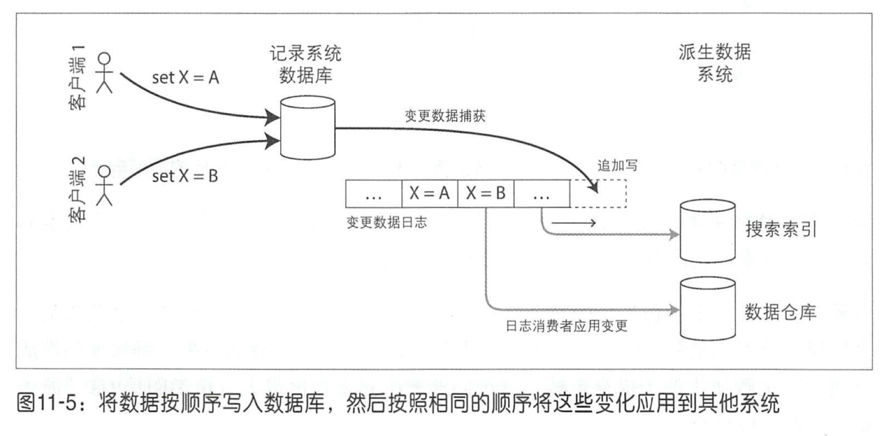

# 第十一章：流处理系统

批处理的输入是有界的，比如 MapReduce 核心的排序操作需要读取整个输入才能产生输出。如果一直有数据产生，批处理必须人为低将数据划分为固定时间段的数据块。而流处理是一种无界的、持续增量处理的方式。可以看成是加速批处理的一种方法；输入是无界的，一直输入数据；当有数据产生就开始处理。

## 发送事件流

### 消息系统

为了区分不同的消息系统，可以提出两个问题：

1. 如果生产者发送消息的速度比消费者所能处理的快，会发生什么？ 一般来说，有三种选择：系统丢弃消息；将消息缓存在队列中；或者激活背压， 也称为流量控制（即阻止生产者发送更多消息）。例如，UNIX 管道和 TCP 使用背压：他们有 一个固定大小的小缓冲区，如果它被填满，发送者将被阻塞，直到接收方将数据 从缓冲区中取出（请参阅第8章“网络拥塞与排队”）

   如果消息被缓存在队列中，那么了解队列增长时会发生什么非常重要。如果内存无法容纳所有队列，系统是否会崩溃？还是会将消息写入磁盘？如果是这样，磁盘出问题又会如何影响消息传递系统的性能 [6] ？

2. 如果节点崩溃或者暂时离线，是否会有消息丢失？ 与数据库一样，持久性可能需要写入磁盘和／或结合复制方案（请参阅第7章“复制与持久性”），而这都是有成本的。如果能够接受有时候会丢失消息，那么在同样的硬件上可能获得更高的吞吐量和更低的延迟。

### 消息代理

当多个消费者读取同一个主题中的消息时，有两种主要的消息传递模式。如图所示。

负载均衡：每个消息都只传递给一个消费者。

扇出：每条消息传递给所有的消费者。

这两种模式可以结合使用，比如 kafka 中的消费者组概念，每个消费者组订阅所有主题，即所有消息扇出到所有消费者组，但是在每个组内，每一条信息只有一个节点接收。

### 分区日志

生产者通过将消息追加到日志的末尾来发送消息，消费者通过依次读取日志来接收消息。不同的节点负责不同的分区，使每个分区成为一个单独的日志，并且可以独立于其他分区读取和写入。

在每个分区中，代理为每个消息分配一个单调递增的序列号或偏移量 （在图 11-3 中， 框中的数字是消息偏移量）。因为分区只能追加，所以分区内的消息是完全有序的。不同分区之间则没有顺序保证。

Apache Kafka [17,18], Amazon Kinesis Streams [19] 和 Twitter DistributedLog [20,21] 都是这种基于日志的消息代理系统。这样

#### 对比日志与传统消息系统

在消息处理的代价很高，希望在逐个消息的基础上井行处理，而且消息排序又不那么重要的情况下 ，JMS/AMQP 类型的传统消息代理更可取。另一方面，在消息吞吐量高的情况下，每个消息处理速度快，消息顺序又很重要的情况下，基于日志的方法工作得很好。

## 数据库与流

### 保持系统同步

数据库、缓存、搜索索引和数据仓库的数据需要保持相互同步：如果数据库中的某个项更新，则也需要在缓存、搜索索引和数据仓库中进行更新。对于数据仓库，这种同步通常由 ETL 进程执行（请参阅第3章的“数据仓库”） ，一般通过获取数据库的完整副本，对其进行转换并将其批量加载到数据仓库中，也就是批处理。对于缓存或者索引也可以使用双重写入的方式来更新，但可能会导致数据不一致的情况发生。

#### 变更数据捕获

变更数据捕获（ Change Data Capture, CDC ），可以捕获数据库中的更改并不断将相同的更改应用于搜索索引。如果以相同顺序应用于更改日志，那么可以预期搜索索引中的数据与数据库中的数据匹配。搜索索引和任何其他派生的数据系统只是变更流的消费者，如图 11-5 所示。

LinkedIn 的 Databus【25】，Facebook 的 Wormhole【26】和 Yahoo! 的 Sherpa【27】大规模地应用这个思路。 Bottled Water 使用解码 WAL 的 API 实现了 PostgreSQL 的 CDC【28】，Maxwell 和 Debezium 通过解析 binlog 对 MySQL 做了类似的事情【29,30,31】，Mongoriver 读取 MongoDB oplog【32,33】，而 GoldenGate 为 Oracle 提供类似的功能【34,35】。

像消息代理一样，变更数据捕获通常是异步的：记录数据库系统不会在提交更改之前等待应用于消费者。这种设计具有的操作上的优势是，添加缓慢的消费者不会对记录系统造成太大影响，但是它的缺点是所有复制滞后导致的问题（请参阅第5章 “复制滞后问题”）。

#### 日志压缩

CDC系统对一个特定的key，仅保留最近一次写入就足够了。日志确保包含数据库中每个 key 的最新值（也可能是一些较旧的值）。Apache Kafka支持此日志压缩功能。

### 状态、流与不可变性

将数据写入形式与读取形式分开，并允许多个不同的读取视图，可以获得很大的灵活性。被称为命令查询责任分离（ Command Query Responsibility Segregation, CQRS) [42,58,59]。

## 流处理

流的来源（用户活动事件，传感器以及数据库的写操作），流是如何传输的（通过直接消息传递，通过消息代理和事件日志）。

### 流处理的适用场景

- 复杂事件处理（ Complex Event Processing, CEP ）：可以使用 SQL 来指定规则，在流中搜索特定模式的事件。查询是长期存储的，来自输入流的事件不断流过他们以匹配事件模式 [68]。
- 流分析：大量事件的累计效果和统计指标，比如过去 5min 内每秒对服务的平均查询次数是多少，以及在此期间的第 99 个百分位的 响应时间。流分析系统也会使用概率算法，比如布隆过滤器，基于基数估计的 HyperLogLog，以及各种百分比估值计算法。
- 在流上搜索：查询条件先保存下来，所有文档流过查询条件，就像CEP一样。

### 流的时间问题

流处理系统经常需要和时间打交道，尤其是在用于分析目的时，这些分析通常使用时间窗口，例如“最近五分钟内的平均值”。许多流处理框架使用处理节点上的本地系统时钟（处理时间）来确定窗口 [79]，但是当事件发生与事件处理之间存在明显的间隔时这种方式就不再有效。

为了调整不正确的设备时钟，一种方法是记录三个时间戳 [82] :

- 根据设备的时钟，记录事件发生的时间。

- 根据设备的时钟，记录将事件发送到服务器的时间 。

- 根据服务器时钟，记录服务器收到事件的时间。

通过从第三个时间戳中减去第二个时间戳，可以估计出设备时钟和服务器时钟之间的偏移量（假设网络延迟与所需的时间戳精度相比可以忽略不计）。然后，可以将该偏移量应用于事件时间戳，从而估计事件实际发生的真实时间（假设设备时钟偏移量在事件发生的时间与发送到服务器的时间之间没有发生变化）。（这个意思应该是 offset = t3 - t2，那么 t1 + offset 就是基于服务器时钟的事件发生的时间）

#### 窗口类型

一旦明确了如何确定事件的时间戳，下一步就是决定如何定义时间段即窗口了。然后窗口就可用于聚合分析，例如计数事件，或计算窗口内的所有值的平均值。有以下几 种常见的窗口类型 [79,83] :

- **轮转窗口**：长度固定，每个事件都属于一个窗口。比如 10:03:00 和 10:03:59 之间的事件都会被分组到一个窗口中，10:04:00 和 10:04:59 之间的事件被分组到下一个窗口。可以通过获取每个事件时间戳并将其四舍五入到最接近的分钟来确定它所属的窗口， 从而实现1分钟的轮转窗口 。
- **跳跃窗口**：长度固定，但允许窗口重叠以提供平滑过渡；10:03:00-10:07:59；10:04:00-10:08:59；通过计算1分钟的滚动窗口，然后聚合相邻的窗口来实现跳跃窗口。
- **滑动窗口**：滑动窗口包含在彼此的某个间隔内发生的所有事件。两个事件的时间小于 5 分钟，则两个事件之间的所有事件属于一个窗口；滑动窗口没有固定的边界时间点。滑动窗口可以通过保留按时间排序的事件缓冲区井且在从窗口过期时移除旧事件来实现。
- **会话窗口**：没有固定的持续时间，它是通过将同一用户在时间上紧密相关的所有事件分组在一起而定义的，一旦用户在一段时间内处于非活动状态（例如，如果 30 分钟内没有事件）， 则窗口结束。

### 流式 join

#### 流和流 join（窗口 join)

假设某网站支持搜索功能 ，井且想要检测网址搜索的最新趋势。为了计算搜索结果中每个网址的单击率，需要将搜索操作和单击操作的事件组合在一起，这些事件通过具有相同的会话 ID 进行 join 。这就是流和流 join。可以定义合适的 join 窗口，例如，如果搜索和单击 的间隔不超过一小时， 则可以 join 它们 。

#### 流和表 join

比如用户活动事件是一个流，用户数据库是表，需要将这两个进行 join。即输入是包含用户 ID 的活动事件流，输出是在用户 ID 上追加了用户的资料信息的活动事件流。可以将数据库副本加载到流处理器中，以便在本地进行查询而无需经过网络往返。

与批处理任务的区别在于，批处理任务使用数据库的时间点快照作为输入，而流处理 器是长时间运行的，并且数据库的内容可能随时间而改变，所以流处理器数据库的本地副本需要保持最新。这个问题可以通过变更数据捕获手段来解决 ：流处理器可以订阅用户资料数据库的更新日志以及活动事件流。在创建或修改资料时，流处理器会更新其本地副本。这也可以看做是两个流之间的 join 。

#### 表和表 join（物化视图维护）

考虑在第 1 章 “描述负载”时 Twitter 时间线的例子。可以使用一个时间线缓存：基于收件箱，实现和维护这个缓存需要以下事件处理：

- 用户发推文时会把该推文添加到所有关注他的用户的时间线上。
- 删除推文就在所有用户时间线删除。
- 新增关注和取消关注与上面类似。

要在流处理中实现这种缓存维护，需要用于推文（发送和删除）和关注关系（关注和 取消关注）的事件流。流过程需要维护一个包含每个用户的关注者集合的数据库， 以便知道当一个新的推文到达时需要更新哪些时间线 [86]。

### 流处理的容错

批处理框架可以比较容易实现容错 ：如果 MapReduce 作业中的任务失败， 可以简单地在另一台机器上重新启动，并丢弃失败任务的输出。批处理容错方法可以确保批处理作业的输出与没有出错时的最终结果相同，即使事实上某些任务失败了 。

在流处理过程中 也会出现同样的容错问题，但是处理起来并不那么简单：在使输出结果可见之前等待某个任务完成是不可行的， 由于流是无限的，因此几乎永远无法完成这个任务。

#### 微批处理和校验点

微批处理：将流分解成多个小块，井像小型批处理一样处理每个块，用于 Spark Streaming [91]。批处理大小通常约为 1s ，这是一个性能折中的考虑 ：较小的批处理会导致更大的调度和协调开销，而较大的批处理意味着流处理器的结果需要更长的延迟才能可见。

校验点：定期生成状态滚动检查点并将其写入持久化存储，用于 Apache Flink。如果流操作发生崩溃，它可以从最近的检查点重新启动，并丢弃在上一个检查点和崩溃之间生成的所有输出。检查点是由消息流中的 barrier 触发，类似于微批处理之间的边界，但并不强制特定的窗口大小。

在流处理框架的范围内，微批处理和检查点的方法提供了与批处理一样的**恰好一次语义** [90]。但是，一旦输出脱离了流处理系统（例如， 通过写入数据库，向外部消息代理发送消息或发送电子邮件），框架将无法丢弃失败批处理的输出。

## 小结

较两种类型的消息代理 ：

- AMQP / JMS 风格的消息代理：

代理将单个消息分配给消费者，消费者在成功处理后确认每条消息。消息被确认后从代理中删除。这种方法适合作为一种异步RPC，例如，在任务队列中，消息处理的确切顺序并不重要，并且不需要在他们处理完后返回井再次读取旧消息。

- 基于日志的消息代理

代理将分区中的所有消息分配给相同的消费者节点，井始终以相同的顺序发送消息。通过分区机制来实现井行，消费者通过检查他们处理的最后一条消息的偏移量来跟踪进度。代理将消息保存在磁盘上，因此如果有必要，可以回退井重新读取旧消息。

三种类型的 join:

- 流和流 join 

两个输入流都由活动事件组成，采用 join 操作用来搜索在特定时间窗口内发生的相关事件。例如，它可以匹配相同用户在 30min 内采取的两个动作。如果想要在一个流中查找相关事件 ，则两个join输入可以是相同的流。

- 流和表 join

一个输入流由活动事件组成， 而另一个则是数据库变更日志。更新日志维护了数据库的本地最新副本。对于每个活动事件，join 操作用来查询数据库并输出一个包含更多信息的事件。

- 表和表 join

两个输入流都是数据库更新日志。在这种情况下，一方的每一个变化都与另一方的最新状态相 join。结果是对两个表之间 join 的物化视图进行持续的更新。

## 参考文献

1. Tyler Akidau, Robert Bradshaw, Craig Chambers, et al.: “[The Dataflow Model: A Practical Approach to Balancing Correctness, Latency, and Cost in Massive-Scale, Unbounded, Out-of-Order Data Processing](http://www.vldb.org/pvldb/vol8/p1792-Akidau.pdf),” *Proceedings of the VLDB Endowment*, volume 8, number 12, pages 1792–1803, August 2015. [doi:10.14778/2824032.2824076](http://dx.doi.org/10.14778/2824032.2824076)
2. Harold Abelson, Gerald Jay Sussman, and Julie Sussman: [*Structure and Interpretation of Computer Programs*](https://mitpress.mit.edu/sicp/), 2nd edition. MIT Press, 1996. ISBN: 978-0-262-51087-5, available online at *mitpress.mit.edu*
3. Patrick Th. Eugster, Pascal A. Felber, Rachid Guerraoui, and Anne-Marie Kermarrec: “[The Many Faces of Publish/Subscribe](http://www.cs.ru.nl/~pieter/oss/manyfaces.pdf),” *ACM Computing Surveys*, volume 35, number 2, pages 114–131, June 2003. [doi:10.1145/857076.857078](http://dx.doi.org/10.1145/857076.857078)
4. Joseph M. Hellerstein and Michael Stonebraker: [*Readings in Database Systems*](http://redbook.cs.berkeley.edu/), 4th edition. MIT Press, 2005. ISBN: 978-0-262-69314-1, available online at *redbook.cs.berkeley.edu*
5. Don Carney, Uğur Çetintemel, Mitch Cherniack, et al.: “[Monitoring Streams – A New Class of Data Management Applications](http://www.vldb.org/conf/2002/S07P02.pdf),” at *28th International Conference on Very Large Data Bases* (VLDB), August 2002.
6. Matthew Sackman: “[Pushing Back](http://www.lshift.net/blog/2016/05/05/pushing-back/),” *lshift.net*, May 5, 2016. Vicent Martí: “[Brubeck, a statsd-Compatible Metrics Aggregator](http://githubengineering.com/brubeck/),” *githubengineering.com*, June 15, 2015. Seth Lowenberger: “[MoldUDP64 Protocol Specification V 1.00](http://www.nasdaqtrader.com/content/technicalsupport/specifications/dataproducts/moldudp64.pdf),” *nasdaqtrader.com*, July 2009.
7. Pieter Hintjens: [*ZeroMQ – The Guide*](http://zguide.zeromq.org/page:all). O'Reilly Media, 2013. ISBN: 978-1-449-33404-8
8. Ian Malpass: “[Measure Anything, Measure Everything](https://codeascraft.com/2011/02/15/measure-anything-measure-everything/),” *codeascraft.com*, February 15, 2011.
9. Dieter Plaetinck: “[25 Graphite, Grafana and statsd Gotchas](https://blog.raintank.io/25-graphite-grafana-and-statsd-gotchas/),” *blog.raintank.io*, March 3, 2016.
10. Jeff Lindsay: “[Web Hooks to Revolutionize the Web](http://progrium.com/blog/2007/05/03/web-hooks-to-revolutionize-the-web/),” *progrium.com*, May 3, 2007.
11. Jim N. Gray: “[Queues Are Databases](http://research.microsoft.com/pubs/69641/tr-95-56.pdf),” Microsoft Research Technical Report MSR-TR-95-56, December 1995.
12. Mark Hapner, Rich Burridge, Rahul Sharma, et al.: “[JSR-343 Java Message Service (JMS) 2.0 Specification](https://jcp.org/en/jsr/detail?id=343),” *jms-spec.java.net*, March 2013.
13. Sanjay Aiyagari, Matthew Arrott, Mark Atwell, et al.: “[AMQP: Advanced Message Queuing Protocol Specification](http://www.rabbitmq.com/resources/specs/amqp0-9-1.pdf),” Version 0-9-1, November 2008.
14. “[Google Cloud Pub/Sub: A Google-Scale Messaging Service](https://cloud.google.com/pubsub/architecture),” *cloud.google.com*, 2016.
15. “[Apache Kafka 0.9 Documentation](http://kafka.apache.org/documentation.html),” *kafka.apache.org*, November 2015.
16. Jay Kreps, Neha Narkhede, and Jun Rao: “[Kafka: A Distributed Messaging System for Log Processing](http://www.longyu23.com/doc/Kafka.pdf),” at *6th International Workshop on Networking Meets Databases* (NetDB), June 2011.
17. “[Amazon Kinesis Streams Developer Guide](http://docs.aws.amazon.com/streams/latest/dev/introduction.html),” *docs.aws.amazon.com*, April 2016.
18. Leigh Stewart and Sijie Guo: “[Building DistributedLog: Twitter’s High-Performance Replicated Log Service](https://blog.twitter.com/2015/building-distributedlog-twitter-s-high-performance-replicated-log-service),” *blog.twitter.com*, September 16, 2015.
19. “[DistributedLog Documentation](http://distributedlog.incubator.apache.org/docs/latest/),” Twitter, Inc., *distributedlog.io*, May 2016. Jay Kreps: “[Benchmarking Apache Kafka: 2 Million Writes Per Second (On Three Cheap Machines)](https://engineering.linkedin.com/kafka/benchmarking-apache-kafka-2-million-writes-second-three-cheap-machines),” *engineering.linkedin.com*, April 27, 2014.
20. Kartik Paramasivam: “[How We’re Improving and Advancing Kafka at LinkedIn](https://engineering.linkedin.com/apache-kafka/how-we_re-improving-and-advancing-kafka-linkedin),” *engineering.linkedin.com*, September 2, 2015.
21. Jay Kreps: “[The Log: What Every Software Engineer Should Know About Real-Time Data's Unifying Abstraction](http://engineering.linkedin.com/distributed-systems/log-what-every-software-engineer-should-know-about-real-time-datas-unifying),” *engineering.linkedin.com*, December 16, 2013.
22. Shirshanka Das, Chavdar Botev, Kapil Surlaker, et al.: “[All Aboard the Databus!](http://www.socc2012.org/s18-das.pdf),” at *3rd ACM Symposium on Cloud Computing* (SoCC), October 2012.
23. Yogeshwer Sharma, Philippe Ajoux, Petchean Ang, et al.: “[Wormhole: Reliable Pub-Sub to Support Geo-Replicated Internet Services](https://www.usenix.org/system/files/conference/nsdi15/nsdi15-paper-sharma.pdf),” at *12th USENIX Symposium on Networked Systems Design and Implementation* (NSDI), May 2015.
24. P. P. S. Narayan: “[Sherpa Update](http://web.archive.org/web/20160801221400/https://developer.yahoo.com/blogs/ydn/sherpa-7992.html),” *developer.yahoo.com*, June 8, .
25. Martin Kleppmann: “[Bottled Water: Real-Time Integration of PostgreSQL and Kafka](http://martin.kleppmann.com/2015/04/23/bottled-water-real-time-postgresql-kafka.html),” *martin.kleppmann.com*, April 23, 2015.
26. Ben Osheroff: “[Introducing Maxwell, a mysql-to-kafka Binlog Processor](https://developer.zendesk.com/blog/introducing-maxwell-a-mysql-to-kafka-binlog-processor),” *developer.zendesk.com*, August 20, 2015.
27. Randall Hauch: “[Debezium 0.2.1 Released](http://debezium.io/blog/2016/06/10/Debezium-0/),” *debezium.io*, June 10, 2016.
28. Prem Santosh Udaya Shankar: “[Streaming MySQL Tables in Real-Time to Kafka](https://engineeringblog.yelp.com/2016/08/streaming-mysql-tables-in-real-time-to-kafka.html),” *engineeringblog.yelp.com*, August 1, 2016.
29. “[Mongoriver](https://github.com/stripe/mongoriver),” Stripe, Inc., *github.com*, September 2014.
30. Dan Harvey: “[Change Data Capture with Mongo + Kafka](http://www.slideshare.net/danharvey/change-data-capture-with-mongodb-and-kafka),” at *Hadoop Users Group UK*, August 2015.
31. “[Oracle GoldenGate 12c: Real-Time Access to Real-Time Information](http://www.oracle.com/us/products/middleware/data-integration/oracle-goldengate-realtime-access-2031152.pdf),” Oracle White Paper, March 2015.
32. “[Oracle GoldenGate Fundamentals: How Oracle GoldenGate Works](https://www.youtube.com/watch?v=6H9NibIiPQE),” Oracle Corporation, *youtube.com*, November 2012.
33. Slava Akhmechet: “[Advancing the Realtime Web](http://rethinkdb.com/blog/realtime-web/),” *rethinkdb.com*, January 27, 2015.
34. “[Firebase Realtime Database Documentation](https://firebase.google.com/docs/database/),” Google, Inc., *firebase.google.com*, May 2016.
35. “[Apache CouchDB 1.6 Documentation](http://docs.couchdb.org/en/latest/),” *docs.couchdb.org*, 2014.
36. Matt DeBergalis: “[Meteor 0.7.0: Scalable Database Queries Using MongoDB Oplog Instead of Poll-and-Diff](http://info.meteor.com/blog/meteor-070-scalable-database-queries-using-mongodb-oplog-instead-of-poll-and-diff),” *info.meteor.com*, December 17, 2013.
37. “[Chapter 15. Importing and Exporting Live Data](https://docs.voltdb.com/UsingVoltDB/ChapExport.php),” VoltDB 6.4 User Manual, *docs.voltdb.com*, June 2016.
38. Neha Narkhede: “[Announcing Kafka Connect: Building Large-Scale Low-Latency Data Pipelines](http://www.confluent.io/blog/announcing-kafka-connect-building-large-scale-low-latency-data-pipelines),” *confluent.io*, February 18, 2016.
39. Greg Young: “[CQRS and Event Sourcing](https://www.youtube.com/watch?v=JHGkaShoyNs),” at *Code on the Beach*, August 2014.
40. Martin Fowler: “[Event Sourcing](http://martinfowler.com/eaaDev/EventSourcing.html),” *martinfowler.com*, December 12, 2005.
41. Vaughn Vernon: [*Implementing Domain-Driven Design*](https://vaughnvernon.co/?page_id=168). Addison-Wesley Professional, 2013. ISBN: 978-0-321-83457-7
42. H. V. Jagadish, Inderpal Singh Mumick, and Abraham Silberschatz: “[View Maintenance Issues for the Chronicle Data Model](http://www.mathcs.emory.edu/~cheung/papers/StreamDB/Histogram/1995-Jagadish-Histo.pdf),” at *14th ACM SIGACT-SIGMOD-SIGART Symposium on Principles of Database Systems* (PODS), May 1995. [doi:10.1145/212433.220201](http://dx.doi.org/10.1145/212433.220201)
43. “[Event Store 3.5.0 Documentation](http://docs.geteventstore.com/),” Event Store LLP, *docs.geteventstore.com*, February 2016.
44. Martin Kleppmann: [*Making Sense of Stream Processing*](http://www.oreilly.com/data/free/stream-processing.csp). Report, O'Reilly Media, May 2016.
45. Sander Mak: “[Event-Sourced Architectures with Akka](http://www.slideshare.net/SanderMak/eventsourced-architectures-with-akka),” at *JavaOne*, September 2014.
46. Julian Hyde: [personal communication](https://twitter.com/julianhyde/status/743374145006641153), June 2016.
47. Ashish Gupta and Inderpal Singh Mumick: *Materialized Views: Techniques, Implementations, and Applications*. MIT Press, 1999. ISBN: 978-0-262-57122-7
48. Timothy Griffin and Leonid Libkin: “[Incremental Maintenance of Views with Duplicates](http://homepages.inf.ed.ac.uk/libkin/papers/sigmod95.pdf),” at *ACM International Conference on Management of Data* (SIGMOD), May 1995. [doi:10.1145/223784.223849](http://dx.doi.org/10.1145/223784.223849)
49. Pat Helland: “[Immutability Changes Everything](http://www.cidrdb.org/cidr2015/Papers/CIDR15_Paper16.pdf),” at *7th Biennial Conference on Innovative Data Systems Research* (CIDR), January 2015.
50. Martin Kleppmann: “[Accounting for Computer Scientists](http://martin.kleppmann.com/2011/03/07/accounting-for-computer-scientists.html),” *martin.kleppmann.com*, March 7, 2011.
51. Pat Helland: “[Accountants Don't Use Erasers](https://blogs.msdn.microsoft.com/pathelland/2007/06/14/accountants-dont-use-erasers/),” *blogs.msdn.com*, June 14, 2007.
52. Fangjin Yang: “[Dogfooding with Druid, Samza, and Kafka: Metametrics at Metamarkets](https://metamarkets.com/2015/dogfooding-with-druid-samza-and-kafka-metametrics-at-metamarkets/),” *metamarkets.com*, June 3, 2015.
53. Gavin Li, Jianqiu Lv, and Hang Qi: “[Pistachio: Co-Locate the Data and Compute for Fastest Cloud Compute](http://yahoohadoop.tumblr.com/post/116365275781/pistachio-co-locate-the-data-and-compute-for),” *yahoohadoop.tumblr.com*, April 13, 2015.
54. Kartik Paramasivam: “[Stream Processing Hard Problems – Part 1: Killing Lambda](https://engineering.linkedin.com/blog/2016/06/stream-processing-hard-problems-part-1-killing-lambda),” *engineering.linkedin.com*, June 27, 2016.
55. Martin Fowler: “[CQRS](http://martinfowler.com/bliki/CQRS.html),” *martinfowler.com*, July 14, 2011.
56. Greg Young: “[CQRS Documents](https://cqrs.files.wordpress.com/2010/11/cqrs_documents.pdf),” *cqrs.files.wordpress.com*, November 2010.
57. Baron Schwartz: “[Immutability, MVCC, and Garbage Collection](http://www.xaprb.com/blog/2013/12/28/immutability-mvcc-and-garbage-collection/),” *xaprb.com*, December 28, 2013.
58. Daniel Eloff, Slava Akhmechet, Jay Kreps, et al.: ["Re: Turning the Database Inside-out with Apache Samza](https://news.ycombinator.com/item?id=9145197)," *Hacker News discussion, news.ycombinator.com*, March 4, 2015.
59. “[Datomic Development Resources: Excision](http://docs.datomic.com/excision.html),” Cognitect, Inc., *docs.datomic.com*.
60. “[Fossil Documentation: Deleting Content from Fossil](http://fossil-scm.org/index.html/doc/trunk/www/shunning.wiki),” *fossil-scm.org*, 2016.
61. Jay Kreps: “[The irony of distributed systems is that data loss is really easy but deleting data is surprisingly hard,](https://twitter.com/jaykreps/status/582580836425330688)” *twitter.com*, March 30, 2015.
62. David C. Luckham: “[What’s the Difference Between ESP and CEP?](http://www.complexevents.com/2006/08/01/what’s-the-difference-between-esp-and-cep/),” *complexevents.com*, August 1, 2006.
63. Srinath Perera: “[How Is Stream Processing and Complex Event Processing (CEP) Different?](https://www.quora.com/How-is-stream-processing-and-complex-event-processing-CEP-different),” *quora.com*, December 3, 2015.
64. Arvind Arasu, Shivnath Babu, and Jennifer Widom: “[The CQL Continuous Query Language: Semantic Foundations and Query Execution](http://research.microsoft.com/pubs/77607/cql.pdf),” *The VLDB Journal*, volume 15, number 2, pages 121–142, June 2006. [doi:10.1007/s00778-004-0147-z](http://dx.doi.org/10.1007/s00778-004-0147-z)
65. Julian Hyde: “[Data in Flight: How Streaming SQL Technology Can Help Solve the Web 2.0 Data Crunch](http://queue.acm.org/detail.cfm?id=1667562),” *ACM Queue*, volume 7, number 11, December 2009. [doi:10.1145/1661785.1667562](http://dx.doi.org/10.1145/1661785.1667562)
66. “[Esper Reference, Version 5.4.0](http://www.espertech.com/esper/release-5.4.0/esper-reference/html_single/index.html),” EsperTech, Inc., *espertech.com*, April 2016.
67. Zubair Nabi, Eric Bouillet, Andrew Bainbridge, and Chris Thomas: “[Of Streams and Storms](https://developer.ibm.com/streamsdev/wp-content/uploads/sites/15/2014/04/Streams-and-Storm-April-2014-Final.pdf),” IBM technical report, *developer.ibm.com*, April 2014.
68. Milinda Pathirage, Julian Hyde, Yi Pan, and Beth Plale: “[SamzaSQL: Scalable Fast Data Management with Streaming SQL](https://github.com/milinda/samzasql-hpbdc2016/blob/master/samzasql-hpbdc2016.pdf),” at *IEEE International Workshop on High-Performance Big Data Computing* (HPBDC), May 2016. [doi:10.1109/IPDPSW.2016.141](http://dx.doi.org/10.1109/IPDPSW.2016.141)
69. Philippe Flajolet, Éric Fusy, Olivier Gandouet, and Frédéric Meunier: “[HyperLo⁠gLog: The Analysis of a Near-Optimal Cardinality Estimation Algorithm](http://algo.inria.fr/flajolet/Publications/FlFuGaMe07.pdf),” at *Conference on Analysis of Algorithms* (AofA), June 2007.
70. Jay Kreps: “[Questioning the Lambda Architecture](https://www.oreilly.com/ideas/questioning-the-lambda-architecture),” *oreilly.com*, July 2, 2014.
71. Ian Hellström: “[An Overview of Apache Streaming Technologies](https://databaseline.wordpress.com/2016/03/12/an-overview-of-apache-streaming-technologies/),” *databaseline.wordpress.com*, March 12, 2016.
72. Jay Kreps: “[Why Local State Is a Fundamental Primitive in Stream Processing](https://www.oreilly.com/ideas/why-local-state-is-a-fundamental-primitive-in-stream-processing),” *oreilly.com*, July 31, 2014.
73. Shay Banon: “[Percolator](https://www.elastic.co/blog/percolator),” *elastic.co*, February 8, 2011.
74. Alan Woodward and Martin Kleppmann: “[Real-Time Full-Text Search with Luwak and Samza](http://martin.kleppmann.com/2015/04/13/real-time-full-text-search-luwak-samza.html),” *martin.kleppmann.com*, April 13, 2015.
75. “[Apache Storm 1.0.1 Documentation](https://storm.apache.org/releases/1.0.1/index.html),” *storm.apache.org*, May 2016.
76. Tyler Akidau: “[The World Beyond Batch: Streaming 102](https://www.oreilly.com/ideas/the-world-beyond-batch-streaming-102),” *oreilly.com*, January 20, 2016.
77. Stephan Ewen: “[Streaming Analytics with Apache Flink](http://www.confluent.io/kafka-summit-2016-systems-advanced-streaming-analytics-with-apache-flink-and-apache-kafka),” at *Kafka Summit*, April 2016.
78. Tyler Akidau, Alex Balikov, Kaya Bekiroğlu, et al.: “[MillWheel: Fault-Tolerant Stream Processing at Internet Scale](http://research.google.com/pubs/pub41378.html),” at *39th International Conference on Very Large Data Bases* (VLDB), August 2013.
79. Alex Dean: “[Improving Snowplow's Understanding of Time](http://snowplowanalytics.com/blog/2015/09/15/improving-snowplows-understanding-of-time/),” *snowplowanalytics.com*, September 15, 2015.
80. “[Windowing (Azure Stream Analytics)](https://msdn.microsoft.com/en-us/library/azure/dn835019.aspx),” Microsoft Azure Reference, *msdn.microsoft.com*, April 2016.
81. “[State Management](http://samza.apache.org/learn/documentation/0.10/container/state-management.html),” Apache Samza 0.10 Documentation, *samza.apache.org*, December 2015.
82. Rajagopal Ananthanarayanan, Venkatesh Basker, Sumit Das, et al.: “[Photon: Fault-Tolerant and Scalable Joining of Continuous Data Streams](http://research.google.com/pubs/pub41318.html),” at *ACM International Conference on Management of Data* (SIGMOD), June 2013. [doi:10.1145/2463676.2465272](http://dx.doi.org/10.1145/2463676.2465272)
83. Martin Kleppmann: “[Samza Newsfeed Demo](https://github.com/ept/newsfeed),” *github.com*, September 2014.
84. Ben Kirwin: “[Doing the Impossible: Exactly-Once Messaging Patterns in Kafka](http://ben.kirw.in/2014/11/28/kafka-patterns/),” *ben.kirw.in*, November 28, 2014.
85. Pat Helland: “[Data on the Outside Versus Data on the Inside](http://cidrdb.org/cidr2005/papers/P12.pdf),” at *2nd Biennial Conference on Innovative Data Systems Research* (CIDR), January 2005.
86. Ralph Kimball and Margy Ross: *The Data Warehouse Toolkit: The Definitive Guide to Dimensional Modeling*, 3rd edition. John Wiley & Sons, 2013. ISBN: 978-1-118-53080-1
87. Viktor Klang: “[I'm coining the phrase 'effectively-once' for message processing with at-least-once + idempotent operations](https://twitter.com/viktorklang/status/789036133434978304),” *twitter.com*, October 20, 2016.
88. Matei Zaharia, Tathagata Das, Haoyuan Li, et al.: “[Discretized Streams: An Efficient and Fault-Tolerant Model for Stream Processing on Large Clusters](https://www.usenix.org/system/files/conference/hotcloud12/hotcloud12-final28.pdf),” at *4th USENIX Conference in Hot Topics in Cloud Computing* (HotCloud), June 2012.
89. Kostas Tzoumas, Stephan Ewen, and Robert Metzger: “[High-Throughput, Low-Latency, and Exactly-Once Stream Processing with Apache Flink](http://data-artisans.com/high-throughput-low-latency-and-exactly-once-stream-processing-with-apache-flink/),” *data-artisans.com*, August 5, 2015.
90. Paris Carbone, Gyula Fóra, Stephan Ewen, et al.: “[Lightweight Asynchronous Snapshots for Distributed Dataflows](http://arxiv.org/abs/1506.08603),” arXiv:1506.08603 [cs.DC], June 29, 2015.
91. Ryan Betts and John Hugg: [*Fast Data: Smart and at Scale*](http://www.oreilly.com/data/free/fast-data-smart-and-at-scale.csp). Report, O'Reilly Media, October 2015.
92. Flavio Junqueira: “[Making Sense of Exactly-Once Semantics](http://conferences.oreilly.com/strata/hadoop-big-data-eu/public/schedule/detail/49690),” at *Strata+Hadoop World London*, June 2016.
93. Jason Gustafson, Flavio Junqueira, Apurva Mehta, Sriram Subramanian, and Guozhang Wang: “[KIP-98 – Exactly Once Delivery and Transactional Messaging](https://cwiki.apache.org/confluence/display/KAFKA/KIP-98+-+Exactly+Once+Delivery+and+Transactional+Messaging),” *cwiki.apache.org*, November 2016.
94. Pat Helland: “[Idempotence Is Not a Medical Condition](http://citeseerx.ist.psu.edu/viewdoc/download?doi=10.1.1.401.1539&rep=rep1&type=pdf),” *Communications of the ACM*, volume 55, number 5, page 56, May 2012. [doi:10.1145/2160718.2160734](http://dx.doi.org/10.1145/2160718.2160734)
95. Jay Kreps: “[Re: Trying to Achieve Deterministic Behavior on Recovery/Rewind](http://mail-archives.apache.org/mod_mbox/samza-dev/201409.mbox/),” email to *samza-dev* mailing list, September 9, 2014.
96. E. N. (Mootaz) Elnozahy, Lorenzo Alvisi, Yi-Min Wang, and David B. Johnson: “[A Survey of Rollback-Recovery Protocols in Message-Passing Systems](http://www.cs.utexas.edu/~lorenzo/papers/SurveyFinal.pdf),” *ACM Computing Surveys*, volume 34, number 3, pages 375–408, September 2002. [doi:10.1145/568522.568525](http://dx.doi.org/10.1145/568522.568525)
97. Adam Warski: “[Kafka Streams – How Does It Fit the Stream Processing Landscape?](https://softwaremill.com/kafka-streams-how-does-it-fit-stream-landscape/),” *softwaremill.com*, June 1, 2016.