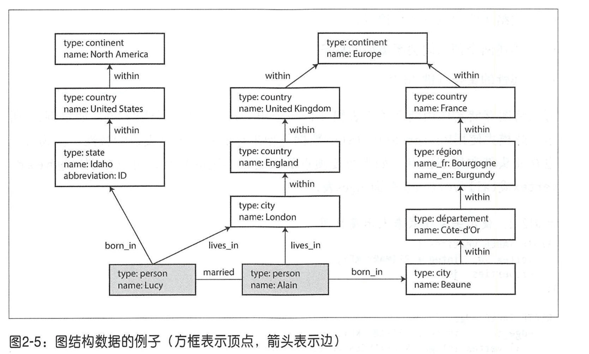

# 第二章：数据模型与查询语言

## 关系模型与文档模型

关系模型：主要是传统的关系型数据库。

文档模型：主要是NoSQL，非关系型数据库。

比如像简历这样的数据结构，主要是一个自包含的文档，用 JSON 表示非常方便：

```json
{
  "user_id": 251,
  "first_name": "Bill",
  "last_name": "Gates",
  "summary": "Co-chair of the Bill & Melinda Gates... Active blogger.",
  "region_id": "us:91",
  "industry_id": 131,
  "photo_url": "/p/7/000/253/05b/308dd6e.jpg",
  "positions": [
    {
      "job_title": "Co-chair",
      "organization": "Bill & Melinda Gates Foundation"
    },
    {
      "job_title": "Co-founder, Chairman",
      "organization": "Microsoft"
    }
  ],
  "education": [
    {
      "school_name": "Harvard University",
      "start": 1973,
      "end": 1975
    },
    {
      "school_name": "Lakeside School, Seattle",
      "start": null,
      "end": null
    }
  ],
  "contact_info": {
    "blog": "http://thegatesnotes.com",
    "twitter": "http://twitter.com/BillGates"
  }
}
```

面向文档的数据库，比如 MongoDB、RethinkDB、CounDB、Espresso 等存储这样的数据非常方便。而如果用关系型数据库，可能需要将其工作经历、教育经历、联系方式等都单独作为一个表，然后用 user_id 作为外键进行关联。这样要读取一份简历可能需要执行多个查询，而对于 JSON 表示的方法，只需要一次查询。

不过我们可以将公司、学校作为一份实例来存储，并使用 ID 来表示它们，这样可以在多个地方引用它，这样当这个实例内容改变时，引用的 ID 也不需要改变。

然而这种数据规范需要多对一的关系（许多人生活在一个特定的地区，许多人在一个特定的行业工作）或者多对多的关系，这不适合文档模型，而在关系数据库中可以很方便地通过 ID 来进行联结。RethinkDB 支持联结， MongoDB 不支持联结，在CouchDB 中，只有预先声明的视图支持联结。

支持文档数据模型的主要论点是模式灵活性，由于局部性而带来较好的性能 ，对于某些应用来说，它更接近于应用程序所使用的数据结构。关系模型则强在联结操作、多对一和多对多关系更简洁的表达上，与文档模型抗衡。

### 文档模型中的模式灵活性

文档数据库是读时模式（数据的结构是隐式的，只有在读取时才解释），与写时模式（关系数据库的一种传统方法，模式是显式的，并且数据库确保数据写入时都必须遵循）相对应。读时模式类似编程语言中的动态（运行时） 类型检查，而写时模式类似于静态（编译时）类型检查 。

当应用程序需要改变数据格式时，比如当前用户的全名存储在一个字段中，而现在想分别存储名字和姓氏：

- 在文档数据库中，只需使用新字段来编写新文档，井在应用层来处理读取旧文档的情况。

```go
if (user && user.name && !user.first_name) {
  // Documents written before Dec 8, 2013 don't have first_name
  user.first_name = user.name.split(" ")[0];
}
```

- 而对于关系型数据库，一般都需要经过 ALTER TABLE 添加字段、 UPDATE 所有行等操作：

```sql
ALTER TABLE users ADD COLUMN first_name text;
UPDATE users SET first_name = split_part(name, ' ', 1);      -- PostgreSQL
UPDATE users SET first_name = substring_index(name, ' ', 1);      -- MySQL
```

大多数关系数据库系统可以在几毫秒内执行 ALTER TABLE 语句。 MySQL则需要注意， 它执行ALTER TABLE时会把现在的整张表复制，从旧表中把数据取出来插入到新表中，再删除旧表。因而当表很大时可能会需要几分钟甚至几小时的停机时间，尽管现在有各种辅助工具可以解决这个限制 [24-26]。

 在大表上运行UPDATE语句， 对于任何数据库都可能会很慢，因为每一行都需要重写。 如果这是不可接受的，应用程序可以将first_name置为默认值NULL ， 并在读取时填充它，就像使用文档数据库一样。

### 文挡数据库与关系数据库的融合

PostgreSQL 版本 9.3 版本 [8]、 MySQL 版本 5.7 以及 IBM DB2 10.5 [30] ，都对 JSON 文档提供了相应支持。RethinkDB 的查询接口支持和关系型类似的联结，而一些 MongoDB 驱动程序可以自动解析数据库的引用关系。


## 图状数据模型

多对多关系是不同数据模型之间的重要区别特征 。 如果数据大多是一 对多关系（树结构数据）或者记录之间没有关系，那么文档模型是最合适的 。而关系模型能处理简单的多对多关系，但是随着数据之间的关联越来越复杂，将数据建模转化为图模型会更加自然。

图由两种对象组成：顶点（也称为结点或实体）和边（也称为关系或弧），例子：

- 社交网络 

顶点是人，边指示哪些人彼此认识。

- Web 图


顶点是网页，边表示与其他页面的HTML链接。

- 公路或铁路网 

顶点是交叉路口， 边表示他们之间的公路或铁路线。

图更为强大的用途在于， 提供了单个数据存储区中保存完全不同类型对象的一致性方式。



属性图模型 (property graph ，以Neo4j 、 Titan和InfiniteGraph为代表）和三元存储模型 （ triple-store，以 Datomic、 AllegroGraph等为代表）。三种声明式查询语言：Cypher，SPARQL 和 Datalog。除此之外，还有像 Gremlin [36] 这样的图形查询语言和像 Pregel 这样的图形处理框架。

三元存储：（主体，谓语，客体）。例如，在三元组 （吉姆， 喜欢 ， 香蕉）中，吉姆是主体， 喜欢是谓语 （动词），香蕉是客体。

语义网，资源描述框架（RDF），SPARQL是一种采用 RDF数据模型的三元存储查询语言。

DataLog 的数据模型类似于三元存储模式 ， 但更为通用 一些。它采用“ 谓语 （主体， 客体 ）” 的表达方式而不是三元组 （ 主体，谓语 ，客体） 。比如 within ( idaho, usa) . name(lucy ,’ Lucy' ) . born_in(lucy, idaho).

## 小结

历史上，数据最初被表示为一棵大树（层次模型），但是这不利于表示多对多关系， 所以发明了关系模型来解决这个问题。最近，开发人员发现一些应用程序也不太适合关系模型。新的非关系“NoSQL”数据存储在两个主要方向上存在分歧 ：

1. 文档数据库的目标用例是数据来自于**自包含文挡**，且一个文档与其他文档之间的关联很少。
2. 图数据库则针对相反的场景，目标用例是所有数据都可能会互相关联。

所有这三种模型（文档模型、关系模型和图模型），如今都有广泛使用，并且在各自的目标领域都足够优秀。我们观察到，一个模型可以用另一个模型来模拟。例如，图数据可以在关系数据库中表示，虽然处理起来比较笨拙。这就是为什么不同的系统用于不同的目的，而不是一个万能的解决方案。


## 参考文献

1. Edgar F. Codd: “[A Relational Model of Data for Large Shared Data Banks](https://www.seas.upenn.edu/~zives/03f/cis550/codd.pdf),” *Communications of the ACM*, volume 13, number 6, pages 377–387, June 1970. [doi:10.1145/362384.362685](http://dx.doi.org/10.1145/362384.362685)
2. Michael Stonebraker and Joseph M. Hellerstein: “[What Goes Around Comes Around](http://mitpress2.mit.edu/books/chapters/0262693143chapm1.pdf),” in *Readings in Database Systems*, 4th edition, MIT Press, pages 2–41, 2005. ISBN: 978-0-262-69314-1
3. Pramod J. Sadalage and Martin Fowler: *NoSQL Distilled*. Addison-Wesley, August 2012. ISBN: 978-0-321-82662-6
4. Eric Evans: “[NoSQL: What's in a Name?](http://blog.sym-link.com/2009/10/30/nosql_whats_in_a_name.html),” *blog.sym-link.com*, October 30, 2009.
5. James Phillips: “[Surprises in Our NoSQL Adoption Survey](http://blog.couchbase.com/nosql-adoption-survey-surprises),” *blog.couchbase.com*, February 8, 2012.
6. Michael Wagner: *SQL/XML:2006 – Evaluierung der Standardkonformität ausgewählter Datenbanksysteme*. Diplomica Verlag, Hamburg, 2010. ISBN: 978-3-836-64609-3
7. “[XML Data in SQL Server](http://technet.microsoft.com/en-us/library/bb522446.aspx),” SQL Server 2012 documentation, *technet.microsoft.com*, 2013.
8. “[PostgreSQL 9.3.1 Documentation](http://www.postgresql.org/docs/9.3/static/index.html),” The PostgreSQL Global Development Group, 2013.
9. “[The MongoDB 2.4 Manual](http://docs.mongodb.org/manual/),” MongoDB, Inc., 2013.
10. “[RethinkDB 1.11 Documentation](http://www.rethinkdb.com/docs/),” *rethinkdb.com*, 2013.
11. “[Apache CouchDB 1.6 Documentation](http://docs.couchdb.org/en/latest/),” *docs.couchdb.org*, 2014.
12. Lin Qiao, Kapil Surlaker, Shirshanka Das, et al.: “[On Brewing Fresh Espresso: LinkedIn’s Distributed Data Serving Platform](http://www.slideshare.net/amywtang/espresso-20952131),” at *ACM International Conference on Management of Data* (SIGMOD), June 2013.
13. Rick Long, Mark Harrington, Robert Hain, and Geoff Nicholls: [*IMS Primer*](http://www.redbooks.ibm.com/redbooks/pdfs/sg245352.pdf). IBM Redbook SG24-5352-00, IBM International Technical Support Organization, January 2000.
14. Stephen D. Bartlett: “[IBM’s IMS—Myths, Realities, and Opportunities](ftp://public.dhe.ibm.com/software/data/ims/pdf/TCG2013015LI.pdf),” The Clipper Group Navigator, TCG2013015LI, July 2013.
15. Sarah Mei: “[Why You Should Never Use MongoDB](http://www.sarahmei.com/blog/2013/11/11/why-you-should-never-use-mongodb/),” *sarahmei.com*, November 11, 2013.
16. J. S. Knowles and D. M. R. Bell: “The CODASYL Model,” in *Databases—Role and Structure: An Advanced Course*, edited by P. M. Stocker, P. M. D. Gray, and M. P. Atkinson, pages 19–56, Cambridge University Press, 1984. ISBN: 978-0-521-25430-4
17. Charles W. Bachman: “[The Programmer as Navigator](http://dl.acm.org/citation.cfm?id=362534),” *Communications of the ACM*, volume 16, number 11, pages 653–658, November 1973. [doi:10.1145/355611.362534](http://dx.doi.org/10.1145/355611.362534)
18. Joseph M. Hellerstein, Michael Stonebraker, and James Hamilton: “[Architecture of a Database System](http://db.cs.berkeley.edu/papers/fntdb07-architecture.pdf),” *Foundations and Trends in Databases*, volume 1, number 2, pages 141–259, November 2007. [doi:10.1561/1900000002](http://dx.doi.org/10.1561/1900000002)
19. Sandeep Parikh and Kelly Stirman: “[Schema Design for Time Series Data in MongoDB](http://blog.mongodb.org/post/65517193370/schema-design-for-time-series-data-in-mongodb),” *blog.mongodb.org*, October 30, 2013.
20. Martin Fowler: “[Schemaless Data Structures](http://martinfowler.com/articles/schemaless/),” *martinfowler.com*, January 7, 2013.
21. Amr Awadallah: “[Schema-on-Read vs. Schema-on-Write](http://www.slideshare.net/awadallah/schemaonread-vs-schemaonwrite),” at *Berkeley EECS RAD Lab Retreat*, Santa Cruz, CA, May 2009.
22. Martin Odersky: “[The Trouble with Types](http://www.infoq.com/presentations/data-types-issues),” at *Strange Loop*, September 2013.
23. Conrad Irwin: “[MongoDB—Confessions of a PostgreSQL Lover](https://speakerdeck.com/conradirwin/mongodb-confessions-of-a-postgresql-lover),” at *HTML5DevConf*, October 2013.
24. “[Percona Toolkit Documentation: pt-online-schema-change](http://www.percona.com/doc/percona-toolkit/2.2/pt-online-schema-change.html),” Percona Ireland Ltd., 2013.
25. Rany Keddo, Tobias Bielohlawek, and Tobias Schmidt: “[Large Hadron Migrator](https://github.com/soundcloud/lhm),” SoundCloud, 2013. Shlomi Noach: “[gh-ost: GitHub's Online Schema Migration Tool for MySQL](http://githubengineering.com/gh-ost-github-s-online-migration-tool-for-mysql/),” *githubengineering.com*, August 1, 2016.
26. James C. Corbett, Jeffrey Dean, Michael Epstein, et al.: “[Spanner: Google’s Globally-Distributed Database](http://research.google.com/archive/spanner.html),” at *10th USENIX Symposium on Operating System Design and Implementation* (OSDI), October 2012.
27. Donald K. Burleson: “[Reduce I/O with Oracle Cluster Tables](http://www.dba-oracle.com/oracle_tip_hash_index_cluster_table.htm),” *dba-oracle.com*.
28. Fay Chang, Jeffrey Dean, Sanjay Ghemawat, et al.: “[Bigtable: A Distributed Storage System for Structured Data](http://research.google.com/archive/bigtable.html),” at *7th USENIX Symposium on Operating System Design and Implementation* (OSDI), November 2006.
29. Bobbie J. Cochrane and Kathy A. McKnight: “[DB2 JSON Capabilities, Part 1: Introduction to DB2 JSON](http://www.ibm.com/developerworks/data/library/techarticle/dm-1306nosqlforjson1/),” IBM developerWorks, June 20, 2013.
30. Herb Sutter: “[The Free Lunch Is Over: A Fundamental Turn Toward Concurrency in Software](http://www.gotw.ca/publications/concurrency-ddj.htm),” *Dr. Dobb's Journal*, volume 30, number 3, pages 202-210, March 2005.
31. Joseph M. Hellerstein: “[The Declarative Imperative: Experiences and Conjectures in Distributed Logic](http://www.eecs.berkeley.edu/Pubs/TechRpts/2010/EECS-2010-90.pdf),” Electrical Engineering and Computer Sciences, University of California at Berkeley, Tech report UCB/EECS-2010-90, June 2010.
32. Jeffrey Dean and Sanjay Ghemawat: “[MapReduce: Simplified Data Processing on Large Clusters](http://research.google.com/archive/mapreduce.html),” at *6th USENIX Symposium on Operating System Design and Implementation* (OSDI), December 2004.
33. Craig Kerstiens: “[JavaScript in Your Postgres](https://blog.heroku.com/javascript_in_your_postgres),” *blog.heroku.com*, June 5, 2013.
34. Nathan Bronson, Zach Amsden, George Cabrera, et al.: “[TAO: Facebook’s Distributed Data Store for the Social Graph](https://www.usenix.org/conference/atc13/technical-sessions/presentation/bronson),” at *USENIX Annual Technical Conference* (USENIX ATC), June 2013.
35. “[Apache TinkerPop3.2.3 Documentation](http://tinkerpop.apache.org/docs/3.2.3/reference/),” *tinkerpop.apache.org*, October 2016.
36. “[The Neo4j Manual v2.0.0](http://docs.neo4j.org/chunked/2.0.0/index.html),” Neo Technology, 2013. Emil Eifrem: [Twitter correspondence](https://twitter.com/emileifrem/status/419107961512804352), January 3, 2014.
37. David Beckett and Tim Berners-Lee: “[Turtle – Terse RDF Triple Language](http://www.w3.org/TeamSubmission/turtle/),” W3C Team Submission, March 28, 2011.
38. “[Datomic Development Resources](http://docs.datomic.com/),” Metadata Partners, LLC, 2013. W3C RDF Working Group: “[Resource Description Framework (RDF)](http://www.w3.org/RDF/),” *w3.org*, 10 February 2004.
39. “[Apache Jena](http://jena.apache.org/),” Apache Software Foundation.
40. Steve Harris, Andy Seaborne, and Eric Prud'hommeaux: “[SPARQL 1.1 Query Language](http://www.w3.org/TR/sparql11-query/),” W3C Recommendation, March 2013.
41. Todd J. Green, Shan Shan Huang, Boon Thau Loo, and Wenchao Zhou: “[Datalog and Recursive Query Processing](http://blogs.evergreen.edu/sosw/files/2014/04/Green-Vol5-DBS-017.pdf),” *Foundations and Trends in Databases*, volume 5, number 2, pages 105–195, November 2013. [doi:10.1561/1900000017](http://dx.doi.org/10.1561/1900000017)
42. Stefano Ceri, Georg Gottlob, and Letizia Tanca: “[What You Always Wanted to Know About Datalog (And Never Dared to Ask)](https://www.researchgate.net/profile/Letizia_Tanca/publication/3296132_What_you_always_wanted_to_know_about_Datalog_and_never_dared_to_ask/links/0fcfd50ca2d20473ca000000.pdf),” *IEEE Transactions on Knowledge and Data Engineering*, volume 1, number 1, pages 146–166, March 1989. [doi:10.1109/69.43410](http://dx.doi.org/10.1109/69.43410)
43. Serge Abiteboul, Richard Hull, and Victor Vianu: [*Foundations of Databases*](http://webdam.inria.fr/Alice/). Addison-Wesley, 1995. ISBN: 978-0-201-53771-0, available online at *webdam.inria.fr/Alice*
44. Nathan Marz: “[Cascalog](http://cascalog.org/)," *cascalog.org*. Dennis A. Benson, Ilene Karsch-Mizrachi, David J. Lipman, et al.: “[GenBank](http://nar.oxfordjournals.org/content/36/suppl_1/D25.full-text-lowres.pdf),” *Nucleic Acids Research*, volume 36, Database issue, pages D25–D30, December 2007. [doi:10.1093/nar/gkm929](http://dx.doi.org/10.1093/nar/gkm929)
45. Fons Rademakers: “[ROOT for Big Data Analysis](http://indico.cern.ch/getFile.py/access?contribId=13&resId=0&materialId=slides&confId=246453),” at *Workshop on the Future of Big Data Management*, London, UK, June 2013.