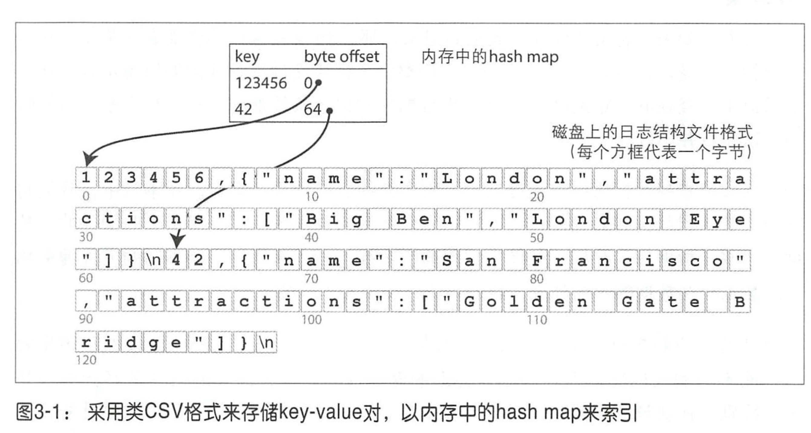
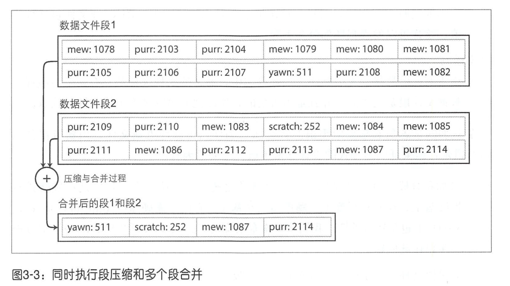
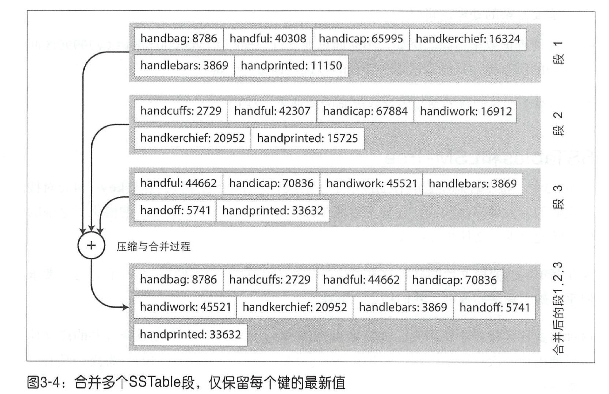
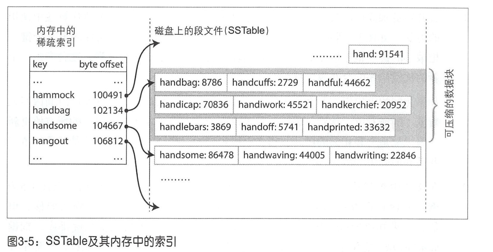
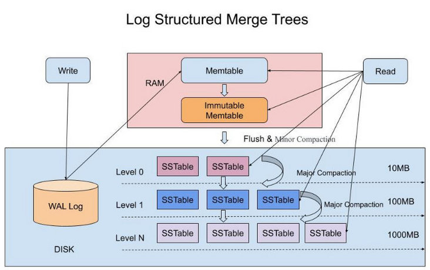
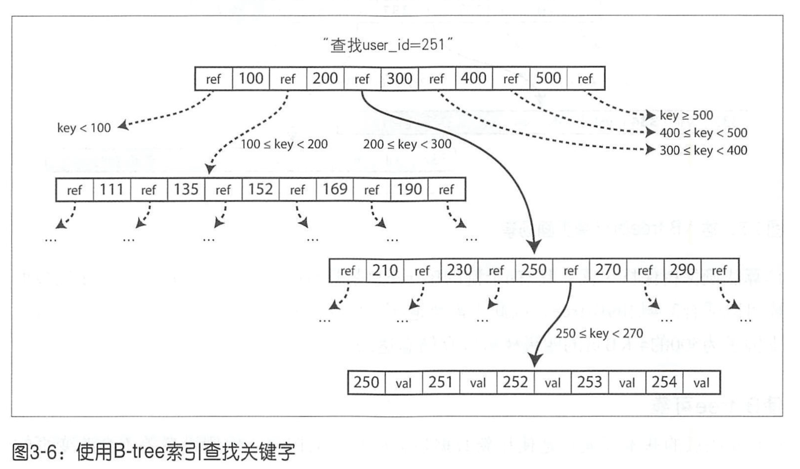
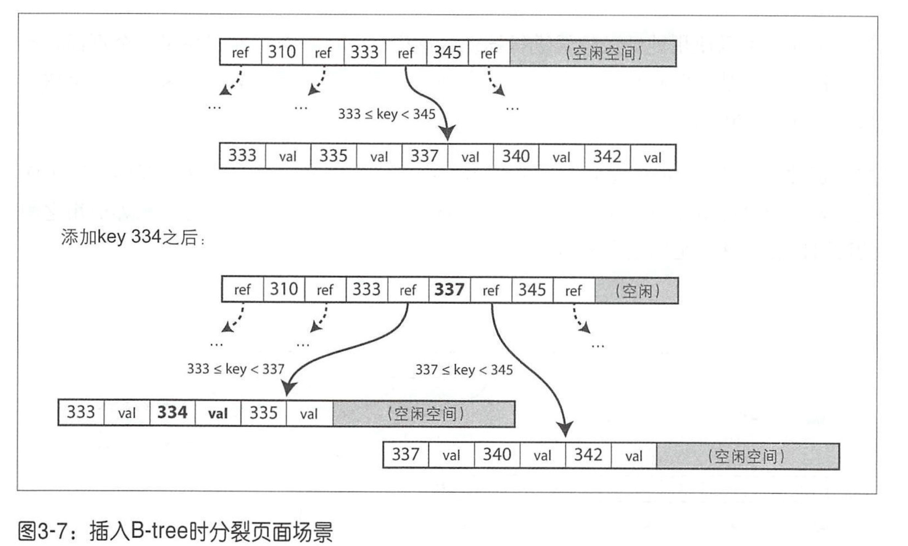
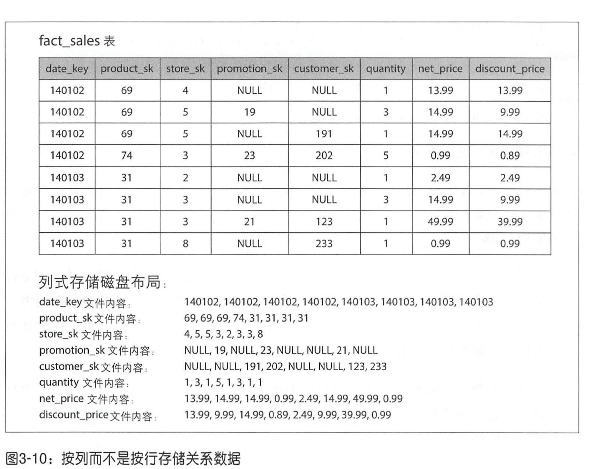

# 第三章：数据存储与检索

最简单的数据库可以用两个 Bash 函数实现：

```bash
#!/bin/bash
db_set () {
  echo "$1,$2" >> database
}

db_get () {
  grep "^$1," database | sed -e "s/^$1,//" | tail -n 1
}
```

该数据库会将所有记录追加存储到日志文件中。如果文件越来越大，那么 db_get 的性能也会越来越差，因为每次都要从头到尾扫描整个数据库文件来查找键的出现位置。

## 索引

索引：保留一些额外的元数据，这些元数据作为路标，帮助定位想要的数据。

每次写操作都需要更新索引。适当的索引可以加速读取查询，但每个索引都会减慢写速度。

### 哈希索引

保存内存中的 hash map ，把每个键一一映射到数据文件中特定的字节偏移量 ， 这样就可以找到每个值的位置。



采用追加方式，将日志分解成一定大小的段，当段文件到达一定大小后就关闭它，将日志写入新的段文件中。这样追加写入的方式可以充分利用磁盘的顺序写入特性，性能非常快。

对于关闭冻结的段，可以使用压缩（在日志中丢弃重复的键，只保留最新的键）及合并（将多个压段合并到一起）的方式减少段日志文件的大小和数量，这个过程可以使用后台线程处理。运行时，仍然可以用旧的段文件继续正常读取和写请求。当合并过程完成后，将读取请求切换到新的合并段上，而旧的段文件可以安全删除 。



哈希表索引的局限性：

- 哈希表必须全部放到内存，如果键特别多会很占用内存。而如果存储到磁盘上，需要大量的随机 IO，速度又特别慢。而且哈希冲突需要复杂的处理逻辑。
- 区间查询的效率不高。

### SSTables 与 LSM-Tree

SSTable（Sorted String Table），排序字符串表。和上面的压缩合并类似，SSTable 也会对多个 SSTable 段进行压缩合并，保证每个键在每个合并的段文件中只能出现一次，当多个段包含相同的键时，可以保留最新段的值，井丢弃旧段中的值。并将 key-value 对的顺序**按键排序**。按键排序的好处是可以在查询的时候将某一块数据用一个稀疏索引来加快查询速度，索引查到这块数据的开头，然后顺序遍历这块数据查询即可。



在内存中使用稀疏索引来保存某些键的偏移，加快查询速度。



并且如上图所示，可以将某一块的数据进行压缩再写入磁盘中，然后稀疏索引的每个条目指向这个块的开头。这样除了节省磁盘空间，还减少了 IO 带宽的占用。

#### 构建和维护 SSTables

存储引擎的基本工作流程如下 ：

- 当写入时，将其添加到内存中的平衡树数据结构中（例如红黑树）。这个内存中的树有时被称为内存表。

- 当内存表大于某个阈值（通常为几兆字节）时，将其作为 SSTable 文件写入磁盘。由于树已经维护了按键排序的 key - value 对， 写 磁盘可以比较高效。新的 SSTable 文件成为数据库的最新部分。当 SSTable 写磁盘的同时 ，新写入的数据可以继续添加到一个新的内存表实例（SSTable 段）。

- 处理读请求，首先尝试在内存表中查找键，然后是最新的磁盘段文件，接下来是次新的磁盘段文件，以此类推，直到找到目标（或为空）。 
- 后台进程周期性地执行段合并与压缩过程，以合并多个段文件，并丢弃那些已被覆盖或删除的值 。

另外数据在写入内存表之前，会先将数据写入到磁盘上的一个日志文件，该文件不需要任何排序，只是为了当数据库崩溃时可以使用该文件恢复内存表。这也就是 WAL（Write-Ahead Logging）。

#### 从 SSTables 到 LSM -Tree

LevelDB[6] 和 RocksDB[7] 都是使用了上述的算法。类似的存储引擎还被用于 Cassandra 和 HBase[8]。

日志结构的合井树（ Log-Structured Merge-Tree ，或LSM-Tree)，基于**合井和压缩排序文件原理**的存储引擎通常都被称为LSM存储引擎。在 Lucene 中，从词条到 posting list 的映射关系保存在类 SSTable 的排序文件中，这些文件可以根据需要在后台合并[14]。

#### 性能优化

- 当查找数据库中不存在的数据时，LSM-Tree 算法可能会很慢，因为需要遍历内存表以及磁盘里所有的段文件才能确定键不存在。因此我们可以引入布隆过滤器来直接排除一定不存在的 key 。

- 一般有大小分级和分层压缩这两种策略来决定 SSTable 压缩和合并 时的具体顺序和时机。LevelDB 和Rocks DB 使用分层压缩（因此名称为 LevelDB)。分层压缩如下图所示：

  

  HBase 使用大小分级， Cassandra 则同时支持这两种压缩［16］。

  在大小分级的压缩中，较新的和较小的 SSTables 被连续合并到较旧和较大的 SSTables 。在分层压缩中，键的范围分裂成多个更小的SSTables ，旧数据被移动到单独的“层级”，这样压缩可以逐步进行并节省磁盘空间。

#### 小结

LSM-Tree 算法即使数据集远远大于可用内存，它仍然能够正常工 。 由于数据按排序存储，因此可以有效地执行区间查询（从最小值到最大值扫描所有的键），并且由于磁盘是顺序写入的，所以 LSM-tree 可以支持非常高的写入吞吐量。

### B-Trees

LSM-Tree 将数据库分解为可变大小的段，通常大小为几兆字节或更大，并且始终按顺序写入段。相比之下， B -tree将数据库分解成固定大小的块或页， 传统上大小为 4 KB（有时更大），页是内部读／写的最小单元。这种设计更接近底层硬件，因为磁盘也是以固定大小的块排列。

每个页面都可以使用地址或位置进行标识，这样可以让一个页面引用另一个页面，类似指针，不过是指向磁盘地址，而不是内存。可以使用这些页面引用来构造一个树状 页面，如图所示。



B-tree 中一个页所包含的子页引用数量称为分支因子。如上图的 B-tree 的分支因子为 6 。在实际中， 分支因素取决于存储页面引用和范围边界所需的空间总量， 通常为几百个。



该插入分裂算法确保树保持平衡 ： 具有 n 个键的 B-tree 总是具有 O (log n）的深度。 大多数数据库可以适合 3~4 层的 B-tree ，因此不需要遍历非常深的页面层次即可找到所需的页（分支因子为 500 的 4KB 页的四级树可以存储高达 256 TB ）。

B-Tree 使用 WAL redo log 来保证能从崩溃中恢复。此外 B+ 树里还有一些优化 B-Tree 的点，这里就不细说了。

### 对比 B-tree 和 LSM-tree

LSM-tree 优点：

- LSM-tree 一般比 B-tree 拥有更好的写入吞吐量。
- LSM-tree 支持更好的压缩，而且由于 B-tree 会频繁的分裂，可能会导致一些磁盘空间无法使用，因此一般 LSM-tree 的磁盘文件要小一些。

LSM-tree 缺点：

- 压缩过程有时会干扰正在进行的读写操作，容易发生读写请求等待的情况。这样 LSM-tree 的查询晌应时间有时会相当高，而B-tree的响应延迟则更具确定性[28]。
- 如果写入吞吐量很高井且压缩没有仔细配置，那么就会发生压缩无法匹配新数据写入速率的情况。这时磁盘上未合并段的数量不断增加，直到磁盘空间不足，并且读的速度也会受影响。
- B-tree 索引可以提供更好的事务语义，因为一个 key 只会出现一个 Page 页里面；由于 LSM 树只能追加写，并且在 L0 层的 SSTable 中会重叠，所以对事务支持较弱，只能在 compaction 的时候进行真正地更新和删除。

### 其他索引结构

聚集索引（在索引中直接保存行数据 ）和非聚集索引（仅存储索引中的数据的引用） 之间有一 种折中设计称为覆盖索引或包含列的索 引，它在索引中保存一些表的列值［33］。它可以支持只通过索引即可回答某些简单查询（在这种情况下，称索引覆盖了查询）[32］。

#### 多列索引

也叫联合索引，符合最左匹配原则。

空间索引，PostGIS使用PostgreSQL 的广义搜索树索引［35］实现了地理空间索引作为R树 。

### 内存数据库

内存数据库的性能优势并不是因为它们不需要从磁盘读取。如果有足够的内存，即使是基于磁盘的存储引 擎 ，也可能永远不需要从磁盘读取，因为操作系统将最近使用的磁盘块缓存在内存中。相反，内存数据库可以更快，是因为它们**避免使用写磁盘的格式对内存数据结构编码的开销**［44］。而且内存数据库的一些数据结构也都进行了相应的优化，比如 Redis。

关注内存型数据库的持久化方案，以及非易失性存储技术的发展（如额外电池供电）。

- 

## 事务处理与分析处理

**OLTP（online transaction processing）**：在线事务处理，交互式的，每次读取少量数据返回用户；上面说的一些 B-tree 、LSM-tree 以及内存数据库都属于该类型。

**OLAP（online analytic processing）**：在线分析处理，不是直接面向客户，每次扫描大量数据，进行分析处理。数据仓库、列式存储都属于该类型。

### 数据仓库

针对OLAP的场景对存储引擎进行优化。有星型与雪花型分析模式。一般使用星型模式，也称为维度建模［55］，比较简单。

### 列式存储

数据分析时通常扫描大量数据，但只取其中几列数据，如果面向行存储，则每次需要扫描全部数据，如果改成列存储，则只需要取出相应的列文件即可，可以节省大量工作。面向列的存储布局依赖一组列文件，每个文件以相同的顺序保存着数据行。



由于每列可能存在大量的重复数据，如产品id，userId等。可以对列数据进行压缩。列存储可以采用不同的压缩技术。在数据仓库中特别有效的一种技术是位图编码。

对列数据进行排序，首个排序键一般可以得到很好的压缩率，随着排序优先级的下降，列数据基本会呈现接近随机的情况，不易压缩。

这部分没怎么看懂，以后再说。

#### 内存带宽和矢量化处理

分析数据库的开发人员还要关心如何高效地将内存的带宽用于CPU缓存，避免分支错误预测和CPU指令处理流水线中的气泡，并利用现代CPU 中的单指令多数据（ SIMD ）指令［59,60]。

除了减少需要从磁盘加载的数据量之外，面向列的存储布局也有利于高效利用 CPU周期。例如，查询引擎可以将一大块压缩列数据放入CPU 的 L1 缓存 中，并以紧凑循环（即没有函数调用）进行迭代。对于每个被处理的记录，CPU能够比基于很多函数调用和条件判断的代码更快地执行这种循环。列压缩使得列中更多的行可以加载到 L1 缓 存。诸如先前描述的按位AND和OR的运算符，可被设计成直接对这样的列压缩数据块进行操作。这种技术被称为矢量化处理［49,58］。


## 参考

Alfred V. Aho, John E. Hopcroft, and Jeffrey D. Ullman: *Data Structures and Algorithms*. Addison-Wesley, 1983. ISBN: 978-0-201-00023-8

Thomas H. Cormen, Charles E. Leiserson, Ronald L. Rivest, and Clifford Stein: *Introduction to Algorithms*, 3rd edition. MIT Press, 2009. ISBN: 978-0-262-53305-8

Justin Sheehy and David Smith: “[Bitcask: A Log-Structured Hash Table for Fast Key/Value Data](http://basho.com/wp-content/uploads/2015/05/bitcask-intro.pdf),” Basho Technologies, April 2010.

Yinan Li, Bingsheng He, Robin Jun Yang, et al.: “[Tree Indexing on Solid State Drives](http://www.vldb.org/pvldb/vldb2010/papers/R106.pdf),” *Proceedings of the VLDB Endowment*, volume 3, number 1, pages 1195–1206, September 2010.

Goetz Graefe: “[Modern B-Tree Techniques](http://citeseerx.ist.psu.edu/viewdoc/download?doi=10.1.1.219.7269&rep=rep1&type=pdf),” *Foundations and Trends in Databases*, volume 3, number 4, pages 203–402, August 2011. [doi:10.1561/1900000028](http://dx.doi.org/10.1561/1900000028)

Jeffrey Dean and Sanjay Ghemawat: “[LevelDB Implementation Notes](https://github.com/google/leveldb/blob/master/doc/impl.html),” *leveldb.googlecode.com*.

Dhruba Borthakur: “[The History of RocksDB](http://rocksdb.blogspot.com/),” *rocksdb.blogspot.com*, November 24, 2013.

Matteo Bertozzi: “[Apache HBase I/O – HFile](http://blog.cloudera.com/blog/2012/06/hbase-io-hfile-input-output/),” *blog.cloudera.com*, June, 29 2012.

Fay Chang, Jeffrey Dean, Sanjay Ghemawat, et al.: “[Bigtable: A Distributed Storage System for Structured Data](http://research.google.com/archive/bigtable.html),” at *7th USENIX Symposium on Operating System Design and Implementation* (OSDI), November 2006.

Patrick O'Neil, Edward Cheng, Dieter Gawlick, and Elizabeth O'Neil: “[The Log-Structured Merge-Tree (LSM-Tree)](http://www.cs.umb.edu/~poneil/lsmtree.pdf),” *Acta Informatica*, volume 33, number 4, pages 351–385, June 1996. [doi:10.1007/s002360050048](http://dx.doi.org/10.1007/s002360050048)

Mendel Rosenblum and John K. Ousterhout: “[The Design and Implementation of a Log-Structured File System](http://research.cs.wisc.edu/areas/os/Qual/papers/lfs.pdf),” *ACM Transactions on Computer Systems*, volume 10, number 1, pages 26–52, February 1992. [doi:10.1145/146941.146943](http://dx.doi.org/10.1145/146941.146943)

Adrien Grand: “[What Is in a Lucene Index?](http://www.slideshare.net/lucenerevolution/what-is-inaluceneagrandfinal),” at *Lucene/Solr Revolution*, November 14, 2013.

Deepak Kandepet: “[Hacking Lucene—The Index Format](http://hackerlabs.github.io/blog/2011/10/01/hacking-lucene-the-index-format/index.html),” *hackerlabs.org*, October 1, 2011.

Michael McCandless: “[Visualizing Lucene's Segment Merges](http://blog.mikemccandless.com/2011/02/visualizing-lucenes-segment-merges.html),” *blog.mikemccandless.com*, February 11, 2011.

Burton H. Bloom: “[Space/Time Trade-offs in Hash Coding with Allowable Errors](http://www.cs.upc.edu/~diaz/p422-bloom.pdf),” *Communications of the ACM*, volume 13, number 7, pages 422–426, July 1970. [doi:10.1145/362686.362692](http://dx.doi.org/10.1145/362686.362692)

“[Operating Cassandra: Compaction](https://cassandra.apache.org/doc/latest/operating/compaction.html),” Apache Cassandra Documentation v4.0, 2016.

Rudolf Bayer and Edward M. McCreight: “[Organization and Maintenance of Large Ordered Indices](http://www.dtic.mil/cgi-bin/GetTRDoc?AD=AD0712079),” Boeing Scientific Research Laboratories, Mathematical and Information Sciences Laboratory, report no. 20, July 1970.

Douglas Comer: “[The Ubiquitous B-Tree](http://citeseerx.ist.psu.edu/viewdoc/download?doi=10.1.1.96.6637&rep=rep1&type=pdf),” *ACM Computing Surveys*, volume 11, number 2, pages 121–137, June 1979. [doi:10.1145/356770.356776](http://dx.doi.org/10.1145/356770.356776)

Emmanuel Goossaert: “[Coding for SSDs](http://codecapsule.com/2014/02/12/coding-for-ssds-part-1-introduction-and-table-of-contents/),” *codecapsule.com*, February 12, 2014.

C. Mohan and Frank Levine: “[ARIES/IM: An Efficient and High Concurrency Index Management Method Using Write-Ahead Logging](http://www.ics.uci.edu/~cs223/papers/p371-mohan.pdf),” at *ACM International Conference on Management of Data* (SIGMOD), June 1992. [doi:10.1145/130283.130338](http://dx.doi.org/10.1145/130283.130338)

Howard Chu: “[LDAP at Lightning Speed](https://buildstuff14.sched.com/event/08a1a368e272eb599a52e08b4c3c779d),” at *Build Stuff '14*, November 2014.

Bradley C. Kuszmaul: “[A Comparison of Fractal Trees to Log-Structured Merge (LSM) Trees](http://insideanalysis.com/wp-content/uploads/2014/08/Tokutek_lsm-vs-fractal.pdf),” *tokutek.com*, April 22, 2014.

Manos Athanassoulis, Michael S. Kester, Lukas M. Maas, et al.: “[Designing Access Methods: The RUM Conjecture](http://openproceedings.org/2016/conf/edbt/paper-12.pdf),” at *19th International Conference on Extending Database Technology* (EDBT), March 2016. [doi:10.5441/002/edbt.2016.42](http://dx.doi.org/10.5441/002/edbt.2016.42)

Peter Zaitsev: “[Innodb Double Write](https://www.percona.com/blog/2006/08/04/innodb-double-write/),” *percona.com*, August 4, 2006.

Tomas Vondra: “[On the Impact of Full-Page Writes](http://blog.2ndquadrant.com/on-the-impact-of-full-page-writes/),” *blog.2ndquadrant.com*, November 23, 2016.

Mark Callaghan: “[The Advantages of an LSM vs a B-Tree](http://smalldatum.blogspot.co.uk/2016/01/summary-of-advantages-of-lsm-vs-b-tree.html),” *smalldatum.blogspot.co.uk*, January 19, 2016.

Mark Callaghan: “[Choosing Between Efficiency and Performance with RocksDB](http://www.codemesh.io/codemesh/mark-callaghan),” at *Code Mesh*, November 4, 2016.

Michi Mutsuzaki: “[MySQL vs. LevelDB](https://github.com/m1ch1/mapkeeper/wiki/MySQL-vs.-LevelDB),” *github.com*, August 2011.

Benjamin Coverston, Jonathan Ellis, et al.: “[CASSANDRA-1608: Redesigned Compaction](https://issues.apache.org/jira/browse/CASSANDRA-1608), *issues.apache.org*, July 2011.

Igor Canadi, Siying Dong, and Mark Callaghan: “[RocksDB Tuning Guide](https://github.com/facebook/rocksdb/wiki/RocksDB-Tuning-Guide),” *github.com*, 2016.

[*MySQL 5.7 Reference Manual*](http://dev.mysql.com/doc/refman/5.7/en/index.html). Oracle, 2014.

[*Books Online for SQL Server 2012*](http://msdn.microsoft.com/en-us/library/ms130214.aspx). Microsoft, 2012.

Joe Webb: “[Using Covering Indexes to Improve Query Performance](https://www.simple-talk.com/sql/learn-sql-server/using-covering-indexes-to-improve-query-performance/),” *simple-talk.com*, 29 September 2008.

Frank Ramsak, Volker Markl, Robert Fenk, et al.: “[Integrating the UB-Tree into a Database System Kernel](http://www.vldb.org/conf/2000/P263.pdf),” at *26th International Conference on Very Large Data Bases* (VLDB), September 2000.

The PostGIS Development Group: “[PostGIS 2.1.2dev Manual](http://postgis.net/docs/manual-2.1/),” *postgis.net*, 2014.

Robert Escriva, Bernard Wong, and Emin Gün Sirer: “[HyperDex: A Distributed, Searchable Key-Value Store](http://www.cs.princeton.edu/courses/archive/fall13/cos518/papers/hyperdex.pdf),” at *ACM SIGCOMM Conference*, August 2012. [doi:10.1145/2377677.2377681](http://dx.doi.org/10.1145/2377677.2377681)

Michael McCandless: “[Lucene's FuzzyQuery Is 100 Times Faster in 4.0](http://blog.mikemccandless.com/2011/03/lucenes-fuzzyquery-is-100-times-faster.html),” *blog.mikemccandless.com*, March 24, 2011.

Steffen Heinz, Justin Zobel, and Hugh E. Williams: “[Burst Tries: A Fast, Efficient Data Structure for String Keys](http://citeseer.ist.psu.edu/viewdoc/summary?doi=10.1.1.18.3499),” *ACM Transactions on Information Systems*, volume 20, number 2, pages 192–223, April 2002. [doi:10.1145/506309.506312](http://dx.doi.org/10.1145/506309.506312)

Klaus U. Schulz and Stoyan Mihov: “[Fast String Correction with Levenshtein Automata](http://citeseerx.ist.psu.edu/viewdoc/summary?doi=10.1.1.16.652),” *International Journal on Document Analysis and Recognition*, volume 5, number 1, pages 67–85, November 2002. [doi:10.1007/s10032-002-0082-8](http://dx.doi.org/10.1007/s10032-002-0082-8)

Christopher D. Manning, Prabhakar Raghavan, and Hinrich Schütze: [*Introduction to Information Retrieval*](http://nlp.stanford.edu/IR-book/). Cambridge University Press, 2008. ISBN: 978-0-521-86571-5, available online at *nlp.stanford.edu/IR-book*

Michael Stonebraker, Samuel Madden, Daniel J. Abadi, et al.: “[The End of an Architectural Era (It’s Time for a Complete Rewrite)](http://citeseerx.ist.psu.edu/viewdoc/download?doi=10.1.1.137.3697&rep=rep1&type=pdf),” at *33rd International Conference on Very Large Data Bases* (VLDB), September 2007.

“[VoltDB Technical Overview White Paper](https://www.voltdb.com/wptechnicaloverview),” VoltDB, 2014.

Stephen M. Rumble, Ankita Kejriwal, and John K. Ousterhout: “[Log-Structured Memory for DRAM-Based Storage](https://www.usenix.org/system/files/conference/fast14/fast14-paper_rumble.pdf),” at *12th USENIX Conference on File and Storage Technologies* (FAST), February 2014.

Stavros Harizopoulos, Daniel J. Abadi, Samuel Madden, and Michael Stonebraker: “[OLTP Through the Looking Glass, and What We Found There](http://hstore.cs.brown.edu/papers/hstore-lookingglass.pdf),” at *ACM International Conference on Management of Data* (SIGMOD), June 2008. [doi:10.1145/1376616.1376713](http://dx.doi.org/10.1145/1376616.1376713)

Justin DeBrabant, Andrew Pavlo, Stephen Tu, et al.: “[Anti-Caching: A New Approach to Database Management System Architecture](http://www.vldb.org/pvldb/vol6/p1942-debrabant.pdf),” *Proceedings of the VLDB Endowment*, volume 6, number 14, pages 1942–1953, September 2013.

Joy Arulraj, Andrew Pavlo, and Subramanya R. Dulloor: “[Let's Talk About Storage & Recovery Methods for Non-Volatile Memory Database Systems](http://www.pdl.cmu.edu/PDL-FTP/NVM/storage.pdf),” at *ACM International Conference on Management of Data* (SIGMOD), June 2015. [doi:10.1145/2723372.2749441](http://dx.doi.org/10.1145/2723372.2749441)

Edgar F. Codd, S. B. Codd, and C. T. Salley: “[Providing OLAP to User-Analysts: An IT Mandate](http://www.minet.uni-jena.de/dbis/lehre/ss2005/sem_dwh/lit/Cod93.pdf),” E. F. Codd Associates, 1993.

Surajit Chaudhuri and Umeshwar Dayal: “[An Overview of Data Warehousing and OLAP Technology](https://www.microsoft.com/en-us/research/wp-content/uploads/2016/02/sigrecord.pdf),” *ACM SIGMOD Record*, volume 26, number 1, pages 65–74, March 1997. [doi:10.1145/248603.248616](http://dx.doi.org/10.1145/248603.248616)

Per-Åke Larson, Cipri Clinciu, Campbell Fraser, et al.: “[Enhancements to SQL Server Column Stores](http://research.microsoft.com/pubs/193599/Apollo3 - Sigmod 2013 - final.pdf),” at *ACM International Conference on Management of Data* (SIGMOD), June 2013.

Franz Färber, Norman May, Wolfgang Lehner, et al.: “[The SAP HANA Database – An Architecture Overview](http://sites.computer.org/debull/A12mar/hana.pdf),” *IEEE Data Engineering Bulletin*, volume 35, number 1, pages 28–33, March 2012.

Michael Stonebraker: “[The Traditional RDBMS Wisdom Is (Almost Certainly) All Wrong](http://slideshot.epfl.ch/talks/166),” presentation at *EPFL*, May 2013.

Daniel J. Abadi: “[Classifying the SQL-on-Hadoop Solutions](https://web.archive.org/web/20150622074951/http://hadapt.com/blog/2013/10/02/classifying-the-sql-on-hadoop-solutions/),” *hadapt.com*, October 2, 2013.

Marcel Kornacker, Alexander Behm, Victor Bittorf, et al.: “[Impala: A Modern, Open-Source SQL Engine for Hadoop](http://pandis.net/resources/cidr15impala.pdf),” at *7th Biennial Conference on Innovative Data Systems Research* (CIDR), January 2015.

Sergey Melnik, Andrey Gubarev, Jing Jing Long, et al.: “[Dremel: Interactive Analysis of Web-Scale Datasets](http://research.google.com/pubs/pub36632.html),” at *36th International Conference on Very Large Data Bases* (VLDB), pages 330–339, September 2010.

Ralph Kimball and Margy Ross: *The Data Warehouse Toolkit: The Definitive Guide to Dimensional Modeling*, 3rd edition. John Wiley & Sons, July 2013. ISBN: 978-1-118-53080-1

Derrick Harris: “[Why Apple, eBay, and Walmart Have Some of the Biggest Data Warehouses You’ve Ever Seen](http://gigaom.com/2013/03/27/why-apple-ebay-and-walmart-have-some-of-the-biggest-data-warehouses-youve-ever-seen/),” *gigaom.com*, March 27, 2013.

Julien Le Dem: “[Dremel Made Simple with Parquet](https://blog.twitter.com/2013/dremel-made-simple-with-parquet),” *blog.twitter.com*, September 11, 2013.

Daniel J. Abadi, Peter Boncz, Stavros Harizopoulos, et al.: “[The Design and Implementation of Modern Column-Oriented Database Systems](http://cs-www.cs.yale.edu/homes/dna/papers/abadi-column-stores.pdf),” *Foundations and Trends in Databases*, volume 5, number 3, pages 197–280, December 2013. [doi:10.1561/1900000024](http://dx.doi.org/10.1561/1900000024)

Peter Boncz, Marcin Zukowski, and Niels Nes: “[MonetDB/X100: Hyper-Pipelining Query Execution](http://www.cidrdb.org/cidr2005/papers/P19.pdf),” at *2nd Biennial Conference on Innovative Data Systems Research* (CIDR), January 2005.

Jingren Zhou and Kenneth A. Ross: “[Implementing Database Operations Using SIMD Instructions](http://www1.cs.columbia.edu/~kar/pubsk/simd.pdf),” at *ACM International Conference on Management of Data* (SIGMOD), pages 145–156, June 2002. [doi:10.1145/564691.564709](http://dx.doi.org/10.1145/564691.564709)

Michael Stonebraker, Daniel J. Abadi, Adam Batkin, et al.: “[C-Store: A Column-oriented DBMS](http://www.vldb2005.org/program/paper/thu/p553-stonebraker.pdf),” at *31st International Conference on Very Large Data Bases* (VLDB), pages 553–564, September 2005.

Andrew Lamb, Matt Fuller, Ramakrishna Varadarajan, et al.: “[The Vertica Analytic Database: C-Store 7 Years Later](http://vldb.org/pvldb/vol5/p1790_andrewlamb_vldb2012.pdf),” *Proceedings of the VLDB Endowment*, volume 5, number 12, pages 1790–1801, August 2012.

Julien Le Dem and Nong Li: “[Efficient Data Storage for Analytics with Apache Parquet 2.0](http://www.slideshare.net/julienledem/th-210pledem),” at *Hadoop Summit*, San Jose, June 2014.

Jim Gray, Surajit Chaudhuri, Adam Bosworth, et al.: “[Data Cube: A Relational Aggregation Operator Generalizing Group-By, Cross-Tab, and Sub-Totals](http://arxiv.org/pdf/cs/0701155.pdf),” *Data Mining and Knowledge Discovery*, volume 1, number 1, pages 29–53, March 2007. [doi:10.1023/A:1009726021843](http://dx.doi.org/10.1023/A:1009726021843)