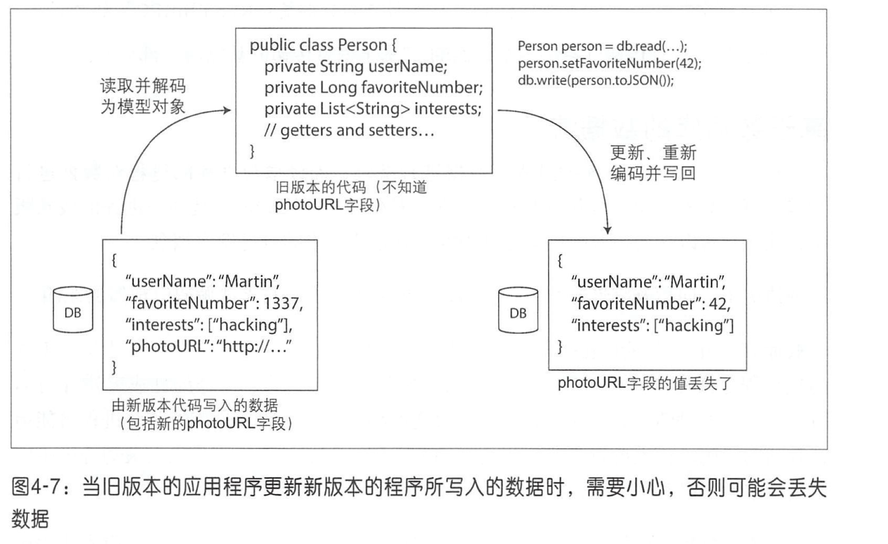

# 第四章：数据编码与演化

新旧版本的代码，以及新旧数据格式可能会在系统中同时共处。系统想要继续顺利运行，就需要保持**双向兼容性**：

- 向后兼容 (backward compatibility)

  新代码可以读旧数据。

- 向前兼容 (forward compatibility)

  旧代码可以读新数据。

## 数据编码格式

从内存中的表示到字节序列的转化称为编码（或序列化等），相反的过程称为解码（或解析，反序列化）。

### Thrift 与 Protocol Buffers

```c
struct Person {
    1: required string       userName,
    2: optional i64          favoriteNumber,
    3: optional list<string> interests
}
```

```protobuf
message Person {
    required string user_name       = 1;
    optional int64  favorite_number = 2;
    repeated string interests       = 3;
}
```

#### 字段标签和模式演变

从示例中可以看出，编码的记录就是其编码字段的拼接。每个字段由其标签号码（样本模式中的数字 1,2,3）标识，并用数据类型（例如字符串或整数）注释。如果没有设置字段值，则简单地从编码记录中省略。从中可以看到，字段标记对编码数据的含义至关重要。你可以更改架构中字段的名称，因为编码的数据永远不会引用字段名称，但不能更改字段的标记，因为这会使所有现有的编码数据无效。

你可以添加新的字段到架构，只要你给每个字段一个新的标签号码。如果旧的代码（不知道你添加的新的标签号码）试图读取新代码写入的数据，包括一个新的字段，其标签号码不能识别，它可以简单地忽略该字段。数据类型注释允许解析器确定需要跳过的字节数。这保持了向前兼容性：旧代码可以读取由新代码编写的记录。

向后兼容性呢？只要每个字段都有一个唯一的标签号码，新的代码总是可以读取旧的数据，因为标签号码仍然具有相同的含义。唯一的细节是，如果你添加一个新的字段，你不能设置为必需。如果你要添加一个字段并将其设置为必需，那么如果新代码读取旧代码写入的数据，则该检查将失败，因为旧代码不会写入你添加的新字段。因此，为了保持向后兼容性，在模式的初始部署之后 **添加的每个字段必须是可选的或具有默认值**。

删除一个字段就像添加一个字段，只是这回要考虑的是向前兼容性。这意味着你只能删除一个可选的字段（必需字段永远不能删除），而且你不能再次使用相同的标签号码（因为你可能仍然有数据写在包含旧标签号码的地方，而该字段必须被新代码忽略）。

### Avro

Avro也使用模式来指定编码的数据结构。它有两种模式语言 : 一种（ Avro IDL ）用于 人工编辑，另一种（基于 JSON ）更易于机器读取。

IDL 示例：

```c
record Person {
    string                userName;
    union { null, long }  favoriteNumber = null;
    array<string>         interests;
}
```

## 数据流模式

### 基于数据库的数据流

假设在记录模式中添加了 一个字段，并且较新的代码将该新字段的值写入数据库。随后，旧版本的代码（尚不知道该新字段）将读取、更新记录井将其写回。在这种情况下，理想的行为通常是旧代码保持新字段不变，即使它无法解释。

之前讨论的编码格式支持未知字段的保存，但是有时候还需要注意应用程序层面的影响，如图 4-7 所示。 例如，如果将数据库值解码为应用程序中的模型对象，然后重新编码这些模型对象，则在该转换过程中可能会丢失未知字段。解决这个问题并不困难，重要的是首先要有这方面的意识。



### 远程过程调用（ Remote Procedure Call , RPC ）

Thrift和Avro带有RPC支持， gRPC是使用 Protocol Buffers的RPC实现， Finagle也使用 Thrift , Rest.Ii 使用 HTTP上的 JSON 。

新一代的RPC框架更加明确了远程请求与本地函数调用不同的事实。例如， Finagle和 Rest.Ii使用Futures (Promises ）来封装可能失败的异步操作。 Futures还简化了需要并行请求多项服务的情况，并将其结果合并［45］。 gRPC支持流，其中调用不仅包括一个请求和一个响应，还包括一段时间内一系列的请求和响应［46］。

其中一些框架还提供了服务发现， 即允许客户端查询在哪个IP地址和端口号上获得特定的服务。

RPC框架主要侧重于同一组织内多项服务之间的请求， 通常发生在同一数据中心内。

RPC方案的向后和向前兼容性属性取决于它所使用的具体编码技术：

- Thrift 、 gRPC (Protocol Buffers）和Avro RPC可以根据各自编码格式的兼容性规则进行演化。

- RESTful API通常使用 JSON （没有正式指定的模式）用于响应， 而请求则采用 JSON或URI编码／表单编码的请求参数。 为了保持兼容性， 通常考虑的更改包括添加可选的请求参数和在响应中添加新的字段。

### 消息队列

与直接 RPC 相比，使用消息代理有以下几个优点 ：

- 如果接收方不可用或过载，它可以充当缓冲区，从而提高系统的可靠性。
- 它可以自动将消息重新发送到崩溃的进程，从而防止消息丢失 。

- 它避免了发送方需要知道接收方的IP地址和端口号（这在虚拟机经常容易起起停停的云部署中特别有用）。

- 它支持将一条消息发送给多个接收方。

- 它在逻辑上将发送方与接收方分离（发送方只是发布消息，并不关心谁使用它们） 。


然而，与RPC的差异在于，消息传递通信通常是单向的：发送方通常不期望收到对其消息的回复 。进程可能发送一个响应，但这通常是在一个独立的通道上完成的。这种通信模式是异步的 ：发送者不会等待消息被传递，而只是发送然后忘记它。

### 分布式Actor框架

Actor模型是用于单个进程中并发的编程模型。逻辑被封装在Actor 中，而不是直接处理线程（以及竞争条件、锁定和死锁的相关问题） 。每个Actor通常代表一个客户端或实体，它可能具有某些本地状态（不与其他任何Actor共享），并且它通过发送和接收异步消息与其他Actor通信 。不保证消息传送 ： 在某些错误情况下，消息将丢失。由于每个Actor一次只处理一条消息，因此不需要担心线程，每个Actor都可以由框架独立调度。


## 小结

许多服务需要支持滚动升级， 即每次将新版本的服务逐步部署到几个节点， 而不是同时部署到所有节点。 该动升级允许在不停机的情况下发布新版本的服务（因此鼓励频繁地发布小版本而不是大版本），并降低部署风险（允许错误版本在影响大量用户之前检测井回滚）。 这些特性非常有利于应用程序的模化和更改。在滚动升级期间， 或者由于各种其他原因， 必须假设不同的节点正在运行应用代码的不同版本。 因此， 在系统内流动的所有数据都以提供向后兼容性（新代码可以读取旧数据）和向前兼容性（旧代码可以读取新数据）的方式进行编码显得非常重要。


## 参考文献

1. “[Java Object Serialization Specification](http://docs.oracle.com/javase/7/docs/platform/serialization/spec/serialTOC.html),” *docs.oracle.com*, 2010.
2. “[Ruby 2.2.0 API Documentation](http://ruby-doc.org/core-2.2.0/),” *ruby-doc.org*, Dec 2014.
3. “[The Python 3.4.3 Standard Library Reference Manual](https://docs.python.org/3/library/pickle.html),” *docs.python.org*, February 2015.
4. “[EsotericSoftware/kryo](https://github.com/EsotericSoftware/kryo),” *github.com*, October 2014.
5. “[CWE-502: Deserialization of Untrusted Data](http://cwe.mitre.org/data/definitions/502.html),” Common Weakness Enumeration, *cwe.mitre.org*, July 30, 2014.
6. Steve Breen: “[What Do WebLogic, WebSphere, JBoss, Jenkins, OpenNMS, and Your Application Have in Common? This Vulnerability](http://foxglovesecurity.com/2015/11/06/what-do-weblogic-websphere-jboss-jenkins-opennms-and-your-application-have-in-common-this-vulnerability/),” *foxglovesecurity.com*, November 6, 2015.
7. Patrick McKenzie: “[What the Rails Security Issue Means for Your Startup](http://www.kalzumeus.com/2013/01/31/what-the-rails-security-issue-means-for-your-startup/),” *kalzumeus.com*, January 31, 2013.
8. Eishay Smith: “[jvm-serializers wiki](https://github.com/eishay/jvm-serializers/wiki),” *github.com*, November 2014.
9. “[XML Is a Poor Copy of S-Expressions](http://c2.com/cgi/wiki?XmlIsaPoorCopyOfEssExpressions),” *c2.com* wiki.
10. Matt Harris: “[Snowflake: An Update and Some Very Important Information](https://groups.google.com/forum/#!topic/twitter-development-talk/ahbvo3VTIYI),” email to *Twitter Development Talk* mailing list, October 19, 2010.
11. Shudi (Sandy) Gao, C. M. Sperberg-McQueen, and Henry S. Thompson: “[XML Schema 1.1](http://www.w3.org/XML/Schema),” W3C Recommendation, May 2001.
12. Francis Galiegue, Kris Zyp, and Gary Court: “[JSON Schema](http://json-schema.org/),” IETF Internet-Draft, February 2013.
13. Yakov Shafranovich: “[RFC 4180: Common Format and MIME Type for Comma-Separated Values (CSV) Files](https://tools.ietf.org/html/rfc4180),” October 2005.
14. “[MessagePack Specification](http://msgpack.org/),” *msgpack.org*. Mark Slee, Aditya Agarwal, and Marc Kwiatkowski: “[Thrift: Scalable Cross-Language Services Implementation](http://thrift.apache.org/static/files/thrift-20070401.pdf),” Facebook technical report, April 2007.
15. “[Protocol Buffers Developer Guide](https://developers.google.com/protocol-buffers/docs/overview),” Google, Inc., *developers.google.com*.
16. Igor Anishchenko: “[Thrift vs Protocol Buffers vs Avro - Biased Comparison](http://www.slideshare.net/IgorAnishchenko/pb-vs-thrift-vs-avro),” *slideshare.net*, September 17, 2012.
17. “[A Matrix of the Features Each Individual Language Library Supports](http://wiki.apache.org/thrift/LibraryFeatures),” *wiki.apache.org*.
18. Martin Kleppmann: “[Schema Evolution in Avro, Protocol Buffers and Thrift](http://martin.kleppmann.com/2012/12/05/schema-evolution-in-avro-protocol-buffers-thrift.html),” *martin.kleppmann.com*, December 5, 2012.
19. “[Apache Avro 1.7.7 Documentation](http://avro.apache.org/docs/1.7.7/),” *avro.apache.org*, July 2014.
20. Doug Cutting, Chad Walters, Jim Kellerman, et al.: “[[PROPOSAL\] New Subproject: Avro](http://mail-archives.apache.org/mod_mbox/hadoop-general/200904.mbox/<49D53694.1050906@apache.org>),” email thread on *hadoop-general* mailing list, *mail-archives.apache.org*, April 2009.
21. Tony Hoare: “[Null References: The Billion Dollar Mistake](http://www.infoq.com/presentations/Null-References-The-Billion-Dollar-Mistake-Tony-Hoare),” at *QCon London*, March 2009.
22. Aditya Auradkar and Tom Quiggle: “[Introducing Espresso—LinkedIn's Hot New Distributed Document Store](https://engineering.linkedin.com/espresso/introducing-espresso-linkedins-hot-new-distributed-document-store),” *engineering.linkedin.com*, January 21, 2015.
23. Jay Kreps: “[Putting Apache Kafka to Use: A Practical Guide to Building a Stream Data Platform (Part 2)](http://blog.confluent.io/2015/02/25/stream-data-platform-2/),” *blog.confluent.io*, February 25, 2015.
24. Gwen Shapira: “[The Problem of Managing Schemas](http://radar.oreilly.com/2014/11/the-problem-of-managing-schemas.html),” *radar.oreilly.com*, November 4, 2014.
25. “[Apache Pig 0.14.0 Documentation](http://pig.apache.org/docs/r0.14.0/),” *pig.apache.org*, November 2014.
26. John Larmouth: [*ASN.1Complete*](http://www.oss.com/asn1/resources/books-whitepapers-pubs/larmouth-asn1-book.pdf). Morgan Kaufmann, 1999. ISBN: 978-0-122-33435-1
27. Russell Housley, Warwick Ford, Tim Polk, and David Solo: “[RFC 2459: Internet X.509 Public Key Infrastructure: Certificate and CRL Profile](https://www.ietf.org/rfc/rfc2459.txt),” IETF Network Working Group, Standards Track, January 1999.
28. Lev Walkin: “[Question: Extensibility and Dropping Fields](http://lionet.info/asn1c/blog/2010/09/21/question-extensibility-removing-fields/),” *lionet.info*, September 21, 2010.
29. Jesse James Garrett: “[Ajax: A New Approach to Web Applications](http://www.adaptivepath.com/ideas/ajax-new-approach-web-applications/),” *adaptivepath.com*, February 18, 2005.
30. Sam Newman: *Building Microservices*. O'Reilly Media, 2015. ISBN: 978-1-491-95035-7
31. Chris Richardson: “[Microservices: Decomposing Applications for Deployability and Scalability](http://www.infoq.com/articles/microservices-intro),” *infoq.com*, May 25, 2014.
32. Pat Helland: “[Data on the Outside Versus Data on the Inside](http://cidrdb.org/cidr2005/papers/P12.pdf),” at *2nd Biennial Conference on Innovative Data Systems Research* (CIDR), January 2005.
33. Roy Thomas Fielding: “[Architectural Styles and the Design of Network-Based Software Architectures](https://www.ics.uci.edu/~fielding/pubs/dissertation/fielding_dissertation.pdf),” PhD Thesis, University of California, Irvine, 2000.
34. Roy Thomas Fielding: “[REST APIs Must Be Hypertext-Driven](http://roy.gbiv.com/untangled/2008/rest-apis-must-be-hypertext-driven),” *roy.gbiv.com*, October 20 2008.
35. “[REST in Peace, SOAP](http://royal.pingdom.com/2010/10/15/rest-in-peace-soap/),” *royal.pingdom.com*, October 15, 2010.
36. “[Web Services Standards as of Q1 2007](https://www.innoq.com/resources/ws-standards-poster/),” *innoq.com*, February 2007.
37. Pete Lacey: “[The S Stands for Simple](http://harmful.cat-v.org/software/xml/soap/simple),” *harmful.cat-v.org*, November 15, 2006.
38. Stefan Tilkov: “[Interview: Pete Lacey Criticizes Web Services](http://www.infoq.com/articles/pete-lacey-ws-criticism),” *infoq.com*, December 12, 2006.
39. “[OpenAPI Specification (fka Swagger RESTful API Documentation Specification) Version 2.0](http://swagger.io/specification/),” *swagger.io*, September 8, 2014.
40. Michi Henning: “[The Rise and Fall of CORBA](http://queue.acm.org/detail.cfm?id=1142044),” *ACM Queue*, volume 4, number 5, pages 28–34, June 2006. [doi:10.1145/1142031.1142044](http://dx.doi.org/10.1145/1142031.1142044)
41. Andrew D. Birrell and Bruce Jay Nelson: “[Implementing Remote Procedure Calls](http://www.cs.princeton.edu/courses/archive/fall03/cs518/papers/rpc.pdf),” *ACM Transactions on Computer Systems* (TOCS), volume 2, number 1, pages 39–59, February 1984. [doi:10.1145/2080.357392](http://dx.doi.org/10.1145/2080.357392)
42. Jim Waldo, Geoff Wyant, Ann Wollrath, and Sam Kendall: “[A Note on Distributed Computing](http://m.mirror.facebook.net/kde/devel/smli_tr-94-29.pdf),” Sun Microsystems Laboratories, Inc., Technical Report TR-94-29, November 1994.
43. Steve Vinoski: “[Convenience over Correctness](http://steve.vinoski.net/pdf/IEEE-Convenience_Over_Correctness.pdf),” *IEEE Internet Computing*, volume 12, number 4, pages 89–92, July 2008. [doi:10.1109/MIC.2008.75](http://dx.doi.org/10.1109/MIC.2008.75)
44. Marius Eriksen: “[Your Server as a Function](http://monkey.org/~marius/funsrv.pdf),” at *7th Workshop on Programming Languages and Operating Systems* (PLOS), November 2013. [doi:10.1145/2525528.2525538](http://dx.doi.org/10.1145/2525528.2525538)
45. “[grpc-common Documentation](https://github.com/grpc/grpc-common),” Google, Inc., *github.com*, February 2015.
46. Aditya Narayan and Irina Singh: “[Designing and Versioning Compatible Web Services](http://www.ibm.com/developerworks/websphere/library/techarticles/0705_narayan/0705_narayan.html),” *ibm.com*, March 28, 2007.
47. Troy Hunt: “[Your API Versioning Is Wrong, Which Is Why I Decided to Do It 3 Different Wrong Ways](http://www.troyhunt.com/2014/02/your-api-versioning-is-wrong-which-is.html),” *troyhunt.com*, February 10, 2014.
48. “[API Upgrades](https://stripe.com/docs/upgrades),” Stripe, Inc., April 2015.
49. Jonas Bonér: “[Upgrade in an Akka Cluster](http://grokbase.com/t/gg/akka-user/138wd8j9e3/upgrade-in-an-akka-cluster),” email to *akka-user* mailing list, *grokbase.com*, August 28, 2013.
50. Philip A. Bernstein, Sergey Bykov, Alan Geller, et al.: “[Orleans: Distributed Virtual Actors for Programmability and Scalability](http://research.microsoft.com/pubs/210931/Orleans-MSR-TR-2014-41.pdf),” Microsoft Research Technical Report MSR-TR-2014-41, March 2014.
51. “[Microsoft Project Orleans Documentation](http://dotnet.github.io/orleans/),” Microsoft Research, *dotnet.github.io*, 2015.
52. David Mercer, Sean Hinde, Yinso Chen, and Richard A O'Keefe: “[beginner: Updating Data Structures](http://erlang.org/pipermail/erlang-questions/2007-October/030318.html),” email thread on *erlang-questions* mailing list, *erlang.com*, October 29, 2007.
53. Fred Hebert: “[Postscript: Maps](http://learnyousomeerlang.com/maps),” *learnyousomeerlang.com*, April 9, 2014.