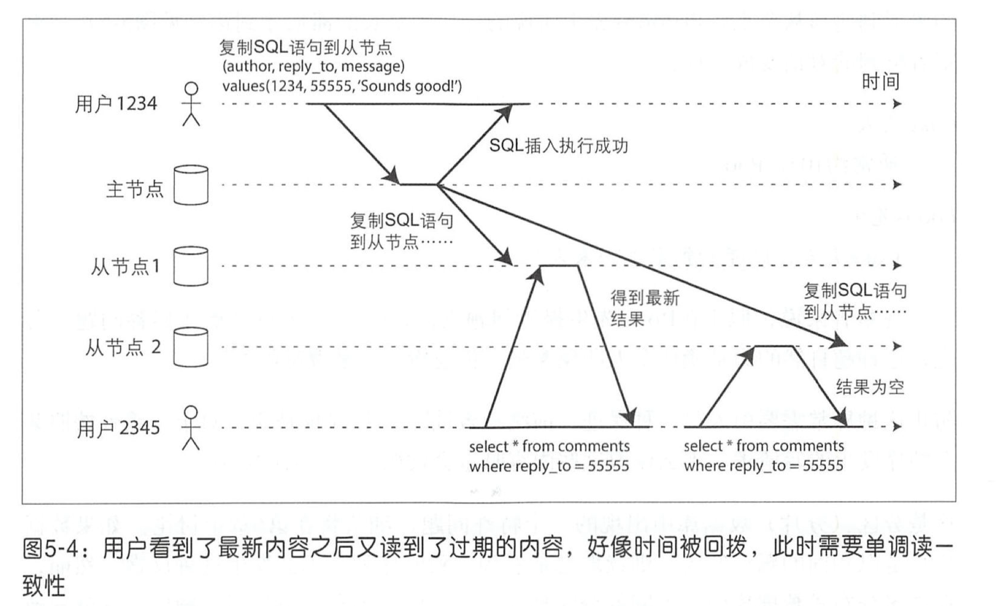
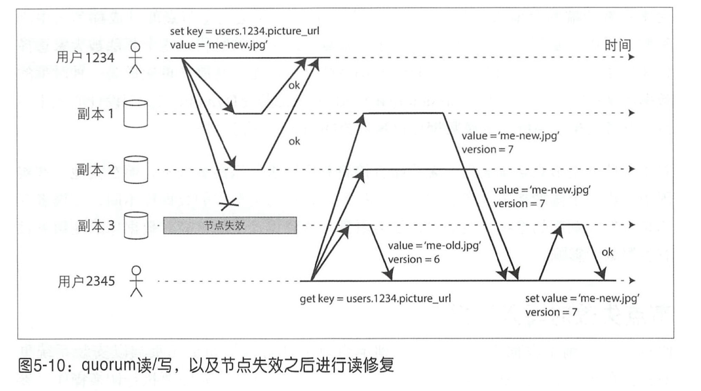
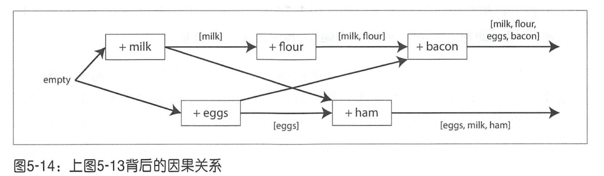

# 第五章：数据复制

复制主要指通过互联网络在多台机器上保存相同数据的副本。通过数据复制方案，人们通常希望达到以下目的 ：

- 使数据在地理位置上更接近用户，从而降低访问延迟 。
- 当部分组件出现位障，系统依然可以继续工作，从而提高可用性。
- 扩展至多台机器以同时提供数据访问服务，从而提高读吞吐量。

## 主从复制

主从复制的工作原理如下 ：

1. 指定某一个副本为主副本（或称为主节点） 。当客户写数据库时，必须将写请求首先发送给主副本，主副本首先将新数据写入本地存储。

2. 其他副本则全部称为从副本（或称为从节点）。主副本把新数据写入本地存储后，然后将数据更改作为复制的日志或更改流发送给所有从副本。每个从副本获得更改日志之后将其应用到本地，且严格保持与主副本相同的写入顺序。 
3. 客户端从数据库中读数据时 ，可以在主副本或者从副本上执行查询。再次强调， 只有主副本才可以接受写请求。从客户端的角度来看，从副本都是只读的。

### 同步复制与异步复制

图 5-2 中， 从节点 1 的复制是同步的， 即主节点需等待直到从节点 1 确认完成了写入， 然后才会向用户报告完成， 井且将最新的写入对其他客户端可见。 而从节点 2 的复制是异步的 ： 主节点发送完消息之后立即返回， 不用等待从节点 2 的完成确认。

链式复制（CRAQ）［8,9］是同步复制的一种变体。

### 配置新的从节点

新的从节点同步主节点数据的过程如下：

1. 对主节点做一个一致性快照。如MySQL的innobackupex[12]。
2. 将快照拷贝到从节点。
3. 从节点连接到主节点请求快照位置之后的数据日志。这个位置在 PostgreSQL 将其称为 “ log sequence number ” （日志序列号），而 MySQL 将其称为 “ binlog coordinates ”。
4. 从节点应用变更，称为追赶。它可以继续处理主节点上新的数据变化。井重复步骤 1～步骤4。

### 处理节点失效

#### 从节点失效 ：追赶式恢复

根据副本的复制日志，从节点可以知道在发生故障之前所处理的最后一笔事务，然后连接 到主节点，并请求自那笔事务之后中断期间内所有的数据变更。在收到这些数据变更日志之后，将其应用到本地来追赶主节点。之后就和正常情况一样持续接收来自主节点数据流的变化。

#### 主节点失效：节点切换

选择某个从节点将其提升为主节点；客户端也需要更新，这样之后的写请求会发送给新的主节点，然后其他从节点要接受来自新的主节点上的变更数据，这一过程称之为切换。

自动切换的步骤：

1. 确认主节点失效。基于超时的机制判定：节点间频繁地互相发生发送心跳存活消息，如果发现某一个节点在一段比较长时间内（例如30s ）没有响应，即认为该节点发生失效。
2. 选举新的主节点。共识问题会在第 9 章讨论。
3. 重新配置系统使新主节点生效。客户端现在需要将写请求发送给新的主节点（细节将在第6章的“请求路由”中讨论）。如果原主节点之后重新上线，可能仍然自认为是主节点，而没有意识到其他节点已经达成共识迫使其下台。这时系统要确保原主节点降级为从节点，并认可新的主节点。

但上述过程依然存在很多问题：

1. 如果使用异步复制，且失效之前，新主节点没有同步完成原主节点的所有数据，选举之后，原主节点很快重新上线并加入集群，此时常见的解决方案是将原主节点上未完成复制的写请求就此丢弃， 但这可能会违背数据更新持久化的承诺。
2. 如果在数据库之外有其他系统依赖于数据库的内容并在一起协同使用， 丢弃数据的方案就特别危险。例如， 在GitHub的一个事故中[13]，从节点没有同步完成主节点的数据就提升为主节点，它重新使用了已被原主节点分配出去的某些主键， 而恰好这些主键已被外部 Redis 所引用， 结果出现 MySQL 和 Redis 之间的 不一致， 最后导致了某些私有数据被错误地泄露给了其他用户。
3. 在某些故障情况下（参见第 8 章）， 可能会发生两个节点同时都自认为是主节点。 这种情况被称为脑裂。
4. 很难设置合适的超时时间来检测主节点失效。太长总体恢复的时间就越长。太短可能会由于网络拥堵而频繁切换，导致总体情况更糟。

因此很多运维团队选择手动切换主节点的方式来控制整个切换过程。

### 复制日志的实现

#### 基于语句的复制

这种基于 SQL 语句复制的方式有很多局限性，比如：

- 一些非确定函数的语句，NOW()、RAND() 会产生不同的值；
- 如果有自增列或强依赖关系的语句必须得顺序执行，不然可能会出错；
- 有副作用的语句（例如，触发器、存储过程、用户定义的函数等），可能会在每个副本上产生不同的副作用 。

#### 基于预写日志（ WAL）传输

所有对数据库写入的字节序列都被记入日志。主节点可以把日志传输给从节点进行复制。

PostgreSQL、 Oracle以及其他系统［16］等支持这种复制方式。其主要缺点是日志描述的数据结果非常底层 ： 一个WAL包含了哪些磁盘块的哪些字节发生改变， 诸如此类的细节。这就使得复制方案和存储引擎紧密耦合。换一个存储引擎或者数据库版本可能就无法支持。如果节点上的不同版本是兼容的可以滚动升级，如果要求强一致，则只能停机升级。

#### 基于行的逻辑日志复制

复制和存储引擎采用不同的日志格式， 这样复制与存储逻辑剥离。 这种复制日志称为逻辑日志， 以区分物理存储引擎的数据表示。

如果一条事务涉及多行的修改，则会产生多个这样的日志记录， 并在后面跟着一条记录 ，指出该事务已经提交。 MySQL 的 binlog 就是用的这种方式。具体可以参考 [带你了解 MySQL Binlog 不为人知的秘密](https://www.cnblogs.com/rickiyang/p/13841811.html)  [MySQL 主从复制原理不再难](https://www.cnblogs.com/rickiyang/p/13856388.html)

由于逻辑日志与存储引擎逻辑解耦， 因此可以更容易地保持向后兼容，从而使主从节点能够运行不同版本的软件甚至是不同的存储引擎。

对于外部应用程序来说， 逻辑日志格式也更容易解析。 如果要将数据库的内容发送到外部系统（如用于离线分析的数据仓库），或构建自定义索引和缓存[18] 等， 基于逻辑日志的复制更有优势。 该技术也被称为**变更数据捕获**， 我们将在第 11 章中继续讨论。

#### 基于触发器的复制

触发器支持注册自己的应用层代码，使得当数据库系统发生数据更改（写事务）时自动执行上述的自定义代码。通过触发器技术，可以将数据更改记录到一个单独的表中， 然后外部处理逻辑访问该表，实施必要的自定义应用层逻辑，例如将数据更改复制到另一个系统。 

Oracle的Databus[20J和Postgres的Bucardo 就是这种技术的典型代表。

基于触发器的复制通常比其他复制方式开销更高， 也比数据库内置复制更容易出错， 或者暴露一些限制。然而，其高度灵活性仍有用武之地。

### 复制滞后问题

对于多副本的情况下，一般只能使用异步复制，因为同步复制如果出现单个节点故障或网络中断就会使整个系统无法写入，而这种故障概率很高。但是异步复制的问题是从副本的数据可能落后于主副本，这就会导致对主副本和从副本同时发起请求得到的数据不一致。

这种不一致只是一个暂时的状态，如果停止写数据库，经过一段时间之后，从节点最终会赶上并与主节点保持一致。这种效应也被称为最终一致性[22,23] 。

复制滞后可能出现的问题可以用以下一致性模型来帮助处理。

#### 写后读一致性

**保证用户总能看到自己所提交的最新数据。**

用户发起读请求，然后在滞后的副本上读取数据，新数据可能尚未到达从节点。对用户来讲， 看起来似乎是刚刚提交的数据丢失了，显然用户不会高兴。

对于这种情况，我们需要“写后读一致性”，也称为读写一致性[24]。 该机制保证如果用户重新加载页面，他们总能看到自己最近提交的更新。但对其他用户则没有任何保证，这些用户的更新可能会在稍后才能刷新看到。

方案：

- 如果用户访问可能会被修改的内容，从主节点读取；否则，在从节点读取。比如社交网络的用户首页信息只能由所有者编辑，而其他人无法编辑。因此，这就形成一个简单的规则：总是从主节点读取用户自己的首页配置文件， 而在从节点读取其他用户的配置文件。
- 如果应用的大部分内容都可能被所有用户修改，此时可以跟踪最近更新的时间 ，如果更新后一分钟之内，则总是在主节点读取；井监控从节点的复制滞后程度 ，避免从那些滞后时间超过一分钟的从节点读取 。
- 客户端还可以记住最近更新时的时间戳 ，井附带在读请求中。这样系统就可以根据该时间戳在副本中轮询找到一个最近的更新。时间 戳可以是逻辑时间戳（例如用来指示写入顺序的日志序列号）或实际系统时钟（在这 种情况下，时钟同步又称为一个关键点 ， 请参阅第8章“不可靠的时钟”）。
- 如果副本分布在多数据中心（例如考虑与用户的地理接近，以及高可用性），情况会更复杂些。必须先把请求路由到主节点所在的数据中心（该数据中心可能离用户很远）。

#### 单调读

**用户在某个时间点读到数据之后，保证此后不会出现比该时间点更早的数据。**

复制滞后还可能出现用户数据向后回滚的情况，比如下图的用户 2345 先访问少量滞后的节点， 然后是滞后很大的从节点，就会出现这种情况。

单调读［23］一致性可以确保不会发生这种异常。这是一个比强一致性弱 ，但比最终一致性强的保证 。当读取数据时， 单调读保证， 如果某个用户依次进行多次读取， 则不会看到回滚现象， 即在读取较新值之后又发生读旧值的情况。

实现单调读的一种方式是， **确保每个用户总是从固定的同一副本执行读取（而不同的用户可以从不同的副本读取）**。例如， 基于用户 ID 的**哈希的方法**而不是随机选择副本。 但如果该副本发生失效， 则用户的查询必须重新路由到另一个副本。

#### 前缀一致读

**保证数据之间的因果关系，在应用层处理数据，总是以正确的顺序返回。**

由于复制滞后导致因果反常的例子。

可以通过版本确定 happens-before 的因果关系决定先后顺序。实际例子可以参考这篇文章 [从微信朋友圈的评论可见性，谈因果一致性在分布式系统中的应用](https://www.cnblogs.com/king0101/p/11908305.html) 。 happens-before 更多内容可以参考后面检测并发写模块。

### 复制滞后的解决方案

使用最终一致性系统时，最好事先就思考这样的问题：如果复制延迟增加到几分钟甚至几小时，那么应用层的行为会是什么样子？如果答案是“没问题”， 那没得说。但是，如果带来糟糕的用户体验，那么在设计系统肘，就要考虑提供一个更强的一致性保证，比如写后读；如果系统设计时假定是同步复制，但最终它事实上成为了异步复制，就可能会导致灾难性后果。

开发人员可以在应用层处理这些问题，但是这样会非常复杂且容易出错。最好是不必担心这么多底层的复制问题，而是假定数据库在“做正确的事情”，情况就变得很简单。而这也是事务存在的原因，事务是数据库提供更强保证的一种方式。但是在分布式系统中，事务的实现也比较复杂，会在后续章节中介绍。

## 多主节点复制

首先，主从复制存在一个明显的缺点：系统只有一个主节点，而所有写人都必须经由主节点。如果由于某种原因，例如与主节点之间的网络中断而导致主节点无法连接，主从复制方案就会影响所有的写入操作。

对主从复制模型进行自然的扩展，则可以配置多个主节点，每个主节点都可以接受写操作，后面复制的流程类似：处理写的每个主节点都必须将该数据更改转发到所有其他节点 。这就是多主节点（ 也称为主－主，或主动／主动）复制。 此时，每个主节点还同时扮演其他主节点的从节点。

### 适用场景

在一个数据中心内部使用多主节点基本没有太大意义，其复杂性已经超过所能带来的好处。但是，在以下场景这种配置则是合理的。

#### 多数据中心

在每个数据中心内，采用常规的主从复制方案；而在数据中心之间，由各个数据中心的主节点来负责同其他数据中心的主节点进行数据的交换、更新。

在多数据中心环境下， 部署单主节点的主从复制方案与多主复制方案之间的差异：

- 性能：单主方案中每个写请求都必须传输到主节点在的数据中心，延迟会非常大。而多主方案每个写操作都可以在本地数据中心快速响应，对上层应用有效屏蔽了数据中心之间的网络延迟， 使得终端用户所体验到的性能更好。

- 容忍数据中心失效：对于单主方案， 如果主节点所在的数据中心发生故障， 必须切换至另一个数据中心，将其中的一个从节点被提升为主节点。 在多主节点模型中， 每个数据中心则可以独立于其他数据中心继续运行。
- 容忍网络问题：数据中心之间的通信通常经由广域网， 它往往不如数据中心内的本地网络可靠。多主节点模型通常采用异步复制， 可以更好地容忍网络问题， 例如临时网络闪断不会妨碍写请求最终成功。

有些数据库已内嵌支持了多主复制， 但有些则借助外部工具来实现， 例如MySQL的 Tungsten Replicator[26], PostgreSQL的BDR[27]以及Oracle的GoldenGate[19]。

类似的场景还有离线客户端操作和协作编辑，不细说。

### 处理写冲突

多主复制的最大问题是可能发生写冲突，如下图所示，用户 1 在主节点 1 将 A 改为 B，用户 2 在主节点 2 将 A 改为 C。每个用户的更改者都顺利地提交到本地主节点。但是，当更改被异步复制到对方时，却发现存在冲突 [33］ 。

#### 避免冲突

如果应用层可以保证对特定记录的写请求总是通过同一个主节点， 这样就不会发生写冲突。比如同一类请求或者同一个用户的请求都在同一个数据中心的主节点进行处理。但是这样依然会有合并数据冲突的问题。

#### 收敛于一致状态

实现收敛的冲突解决有以下可能的方式 ：

- 给每个写入分配唯一的 ID ，例如，一个时间戳， 一个足够长的随机数， 一个 UUID或者一个基于键－值的哈希， 挑选最高ID的写入作为胜利者，并将其他写入丢弃。 如果基于时间戳，这种技术被称为最后写入者获胜 。虽然这种方式很流行 ，但是很容易造成数据丢失[35]。
- 为每个副本分配一个唯一的ID ，井制定规则， 例如序号高的副本写入始终优先于序号低的副本 。这种方法也可能会导致数据丢失。这个方案的实现例子可以参考上面的”微信朋友圈的评论“文章链接。
- 以某种方式将这些冲突值合并在一起。 如字符串拼接（图 5-7 中，合并的标题可能类似于“B/C”）。
- 利用预定义好的格式来记录和保留冲突相关的所有信息， 然后依靠应用层的逻辑，事后解决冲突（可能会提示用户） 。

> 自动冲突解决方式：无冲突的复制数据类型（Conflict free Replicated Datatypes, CRDT）[32,38]，可合并的持久数据结构（Mergeable persistent data）[41]，操作转换（Operational transformation）[42]。

书中并没有给出一个完美的解决方案，可参考

### 拓扑结构

最常见的拓扑结构是全部－至－全部，见图 5-8(c) ，每个主节点将其写入同步到其他所有主节点。 环形拓扑接收前序节点的写入再转发至下个节点，而星型拓扑则依赖一个根节点将写入转发给其他所有节点。

这几种拓扑结构各有优劣，比如环形和星形如果有一个节点挂了，那么整个复制流程就会受到影响，而全链接拓扑容错更高。但全链接拓扑也存在某些网络链路比其他链路更快的情况（例如由于不同网络拥塞），从而导致复制日志之间的覆盖。

比如主节点 1 收到插入数据的请求，主节点 3 收到对该数据更新的请求，而主节点 2 此时收到日志复制，但它可能先收到 3 然后再收到 1   的日志，这样就会导致在节点 2 数据不一致的情况。

为了使得日志消息正确有序，可以使用一种称为版本向量的技术，本章稍后将讨论这种技术（参见本章后面的“检测并发写入”）。

## 无主节点复制

放弃主节点，允许任何副本直接接受来自客户端的写请求。这类数据库也被称为 Dynamo 风格数据库。

### 节点失效时写入数据库

如下图所示，副本 3 节点失效，此时用户 1234 更新数据，副本 1、2 更新数据成功，就表示该数据写入成功。随后用户 2345 读取该数据，此时副本 3 恢复但是保存的是老数据，这样读请求可以去所有副本（不一定要所有副本）中取数据，看哪个数据版本最新，则返回那个数据。

Dynamo 风格的数据存储系统经常使用以下两种机制：

- 读修复：如上图 5-10 所示，当客户端井行读取多个副本时，可以检测到过期的返回值。过期的副本会根据最新的数据进行修复。

- 反熵过程：启动后台进程不断查找副本之间数据的差异，将任何缺少的数据从一个副本复制到另 一个副本。这个方式原因在于读时修复只在发生读取时才可能执行修复，那些很少访问的数据有可能在某些副本中已经丢失而无法检测到，从而降低了写的持久性。

#### 读写 quorum

**如果有 n 个副本，写入需要 w 个节点确认，读取必须至少查询 r 个节点， 则只要 w + r > n ，读取的节点中 一定会包含最新值**。例如在前面的例子中，n = 3, w = 2, r = 2 。满足上述这些 r、 w 值的读／写操作称之为法定票数读（或仲裁读）或法定票数写（或仲裁写） [44]。

一个常见的选择是设置 n 为某奇数（通常为 3 或 5 ),  w = r = (n + 1) / 2 （向上舍入）。

但是即使在 w + r > n 的情况下，还是会在一些边界条件下发生返回旧值的情况。比如：

- 多个写请求同时到达无法保证顺序性。

- 读写同时发生，写只在部分副本生效，此时读取的数据不确定。
- 某些副本上已经写入成功， 而其他一些副本发生写入失败，且总的成功副本数少于w ，那些已成功的副本上不会做回滚。

因此 quorum 设计上似乎可以保证读取最新值， 但现实情况却往往更加复杂。 Dynamo 风格的数据库通常是针对最终一致性场景而优化的 。我们建议最好不要把参数 w 和 r 视为绝对的保证， 而是一种灵活可调的读取新值的概率。

#### sloppy quorum

另外还有一种放松的仲裁[37]：写入和读取仍然需要 w 和 r 个成功的响应，但包含了那些并不在先前指定的 n 个节点。比如 n 个节点中部分宕机，不满足 w 个节点要求，而此时还有一些临时节点可以写入，那么就先写入到这些临时节点。等到网络问题得到解决，临时节点需要把接收到的写入全部发送到原始主节点上。这就是所谓的数据回传（或暗示移交）。这种方式也叫 sloppy quorum 。

## 检测并发写

对于之前的“处理写冲突”更进一步的讨论。

### 最后写入者获胜（丢弃并发写入）

强制对所有写请求排序，比如每个写请求自带一个时间戳，选择最大的时间戳写入，丢弃较早时间戳的写入。这个冲突解决算被称为最后写入者获胜（ last write wins, LWW ）。

LWW 可以实现最终收敛，但是会丢弃部分请求。比如对同一个主键进行并发写，最后只会有一个写请求被持久化，其他的都会被抛弃。

一种 LWW 适用的场景是，只写入一次然后写入值视为不可变，这样就避免了对同一个主键的并发（覆盖）写。 例如， Cassandra 的一个推荐使用方法就是采用 UUID 作为主键，这样每个写操作都针对的不同的、系统唯一的主键[53]。

### Happens-before关系和并发

假设有写入 A 和写入 B，如果B知道A ，或者依赖于 A ，或者以某种方式在 A 基础上构建，则称操作 A 在操作 B 之前发生 。这是定义何为并发的关键 。也就是说，**如果两个操作都不在另一个之前发生，那么操作是井发的（或者两者都不知道对方）** [54］。

如果一个操作发生在另一个操作之前，则后面的操作可以覆盖较早的操作。如果属于井发，就需要解决潜在的冲突问题。

#### 确定前后关系

图 5-13 的例子是两个客户端同时向同一个购物车加商品。以该例来介绍，如何确定操作是并发还是依赖的算法。

步骤：

1. 客户端 1 往购物车里加入牛奶，数据库写入主键的值（即购物车的值）成功并分配版本号 1 ，将版本号 version 与购物车的值 value 返回给客户端 1。
2. 客户端 2 往购物车里加入鸡蛋，但此时它还没有看到客户端 1 添加的牛奶，只能在购物车里看到自己的鸡蛋，但是服务器知道牛奶的存在，于是它将 [牛奶] 和 [鸡蛋] 分成两个值，然后版本号加 1 返回给客户端 2 。
3. 客户端 1 往购物车里加入面粉，此时他只能在购物车里看到自己的 [牛奶，面粉]，然后他将 [牛奶, 面粉] 和版本号 1 发送给服务器，服务器就知道这个新值是要覆盖之前的版本号 1 的值（即 [牛奶]），版本号加 1，但客户端 2 的鸡蛋此时也存在了，属于并发操作。于是服务器将 [牛奶，面粉] 和 [鸡蛋] 这两个值和版本号 3 返回给客户端 1 。
4. 同时，客户端 2 加入火腿，此时会**合并第 2 步收到的 [牛奶] 和 [鸡蛋] 这两个值并加入新值火腿**，成为 [鸡蛋，牛奶，火腿] 这个值然后和之前的版本号 2 一起发送给服务器，服务器收到后会覆盖原来的版本号 2 的值（即 [鸡蛋]），并检测到与 [牛奶，面粉] 是并发操作，于是将 [鸡蛋，牛奶，火腿] 和 [牛奶，面粉] 以及版本号 4 返回给客户端 2 。
5. 最后客户端 1 加入培根，与之前它收到版本号 3 的两个值 [牛奶，面粉] 和 [鸡蛋] 合并，并将最终值 [牛奶，面粉，鸡蛋，培根] 连同版本号 3 来覆盖 [牛奶，面粉]，但与 [鸡蛋，牛奶，火腿] 并发，所以服务器会保留这些井发值。此时客户端 1 看到的购物车就是

最后的最后，客户端合并这两个值，并去掉重复的值成为最终结果 [牛奶，面粉，鸡蛋，培根，火腿] 。

这里去掉重复的值有个问题是如果客户端 1 和 2 加入同样的商品会不会只保留一份？

我理解是可以假设每个客户端有一个唯一的 UUID，往购物车里加入的商品都会带上这个值，这样如果客户端 1 和客户端 2 同时加入牛奶，那么就会判定这是两个不同的值，不会去掉，而是合并这两个值，即两份牛奶。而在最后合并值得时候发现牛奶这个值是同一份 UUID，那么就会去掉重复值。

例子背后的因果关系：

算法的工作流程如下：

- 服务器为每个主键（即上面的购物车的值）维护一个版本号，每当主键新值写入时递增版本号，井将新版本号与写入的值一起保存 。
- 当客户端读取主键时，服务器将返回所有（ 未被覆盖的）当前值以及最新的版本号。且要求写之前， 客户必须先发送读请求。
- 客户端写主键 ，写请求必须包含之前读到的版本号、读到的值和新值合并后的集合。写请求的响应可以像读操作一样 ，会返回所有当前值，这样就可以像购物车例子那样一步步链接起多个写入的值。
- 当服务器收到带有特定版本号的写入时， 覆盖该版本号或更低版本的所有值（因为知道这些值已经被合并到新传入的值集合中），但必须保存更高版本号的所有值（因为这些值与当前的写操作属于并发）。

然而，设想一下人们也可以在购物车中删除商品，此时把井发值都合井起来可能会导致错误的结果：如果合并了两个客户端的值，且其中有一个商品被某客户端删除掉，则被删除的项目会再次出现在合并的终值中［37］。为了防止该问题，项目在删除时不能简单地从数据库中删除 ，系统必须保留一个对应的版本号以恰当的标记该项目需要在合井时被剔除。这种删除标记被称为墓碑。

考虑到在应用代码中合并非常复杂且容易出错，因此可以设计一些专门的数据结构来自动执行合井，例如，Riak 支持称为 CRDT 一系列数据结构［38,39,55] （具体参见本章前面的“自动冲突解决”），以合理的方式高效自动合井，包括支持删除标记。

这部分的例子还是可以看这篇文章 [从微信朋友圈的评论可见性，谈因果一致性在分布式系统中的应用](https://www.cnblogs.com/king0101/p/11908305.html) 。 

#### 版本矢量

图 5-13 中的示例只有一个副本。如果存在多个副本但没有主节点，我们需要为每个副本和每个主键均定义一个版本号。每个副本在处理 写入时增加自己的版本号，并且跟踪从其他副本看到的版本号。通过这些信息来指示要覆盖哪些值、该保留哪些并发值。

所有副本的版本号集合称为版本矢量［56］ 。这种思路还有一些变体，但最有趣的可能是 在Riak 2.0 [58,59] 中使用的虚线版本矢量[57] 。我们无法在此深入其细节，但是它的工作方式与购物车例子所展示的非常相似。

与图 5-13 中版本号类似，当读取数据时，数据库副本会返回版本矢量给客户端，而在随后写入时需要将版本信息包含在请求当中一起发送到数据库。 Riak 将版本矢量编码为一个称之为因果上下文的字符串。版本矢量技术使数据库可以区分究竟应该覆盖写还是保留并发值。

## 小结

复制的目的：

- 高可用性：即使某台机器（或多台机器，或整个数据中心）出现故障，系统也能保持正常运行。

- 连接断开与容错：允许应用程序在出现网络中断时继续工作。

- 低延迟：将数据放置在距离用户较近的地方，从而实现更快地交互。

- 可扩展性：采用多副本读取，大幅提高系统读操作的吞吐量 。

三种多副本方案：主从复制，多主节点复制，无主节点复制。

主从复制非常流行，主要是因为它很容易理解，也不需要担心冲突问题。而万一出现节点失效、网络中断或者延迟抖动等情况，多主节点和无主节点复制方案会更加可靠，不过背后的代价则是系统的复杂性和弱一致性保证。

一致性模型：

- 写后读一致性

保证用户总能看到自己所提交的最新数据。

- 单调读

用户在某个时间点读到数据之后，保证此后不会出现比该时间点更早的数据 。

- 前缀一致读

保证数据之间的因果关系，例如，总是以正确的顺序先读取问题，然后看到回答。

## 参考文献

1. Bruce G. Lindsay, Patricia Griffiths Selinger, C. Galtieri, et al.: “[Notes on Distributed Databases](http://domino.research.ibm.com/library/cyberdig.nsf/papers/A776EC17FC2FCE73852579F100578964/$File/RJ2571.pdf),” IBM Research, Research Report RJ2571(33471), July 1979.
2. “[Oracle Active Data Guard Real-Time Data Protection and Availability](http://www.oracle.com/technetwork/database/availability/active-data-guard-wp-12c-1896127.pdf),” Oracle White Paper, June 2013.
3. “[AlwaysOn Availability Groups](http://msdn.microsoft.com/en-us/library/hh510230.aspx),” in *SQL Server Books Online*, Microsoft, 2012.
4. Lin Qiao, Kapil Surlaker, Shirshanka Das, et al.: “[On Brewing Fresh Espresso: LinkedIn’s Distributed Data Serving Platform](http://www.slideshare.net/amywtang/espresso-20952131),” at *ACM International Conference on Management of Data* (SIGMOD), June 2013.
5. Jun Rao: “[Intra-Cluster Replication for Apache Kafka](http://www.slideshare.net/junrao/kafka-replication-apachecon2013),” at *ApacheCon North America*, February 2013.
6. “[Highly Available Queues](https://www.rabbitmq.com/ha.html),” in *RabbitMQ Server Documentation*, Pivotal Software, Inc., 2014.
7. Yoshinori Matsunobu: “[Semi-Synchronous Replication at Facebook](http://yoshinorimatsunobu.blogspot.co.uk/2014/04/semi-synchronous-replication-at-facebook.html),” *yoshinorimatsunobu.blogspot.co.uk*, April 1, 2014.
8. Robbert van Renesse and Fred B. Schneider: “[Chain Replication for Supporting High Throughput and Availability](http://static.usenix.org/legacy/events/osdi04/tech/full_papers/renesse/renesse.pdf),” at *6th USENIX Symposium on Operating System Design and Implementation* (OSDI), December 2004.
9. Jeff Terrace and Michael J. Freedman: “[Object Storage on CRAQ: High-Throughput Chain Replication for Read-Mostly Workloads](https://www.usenix.org/legacy/event/usenix09/tech/full_papers/terrace/terrace.pdf),” at *USENIX Annual Technical Conference* (ATC), June 2009.
10. Brad Calder, Ju Wang, Aaron Ogus, et al.: “[Windows Azure Storage: A Highly Available Cloud Storage Service with Strong Consistency](http://sigops.org/sosp/sosp11/current/2011-Cascais/printable/11-calder.pdf),” at *23rd ACM Symposium on Operating Systems Principles* (SOSP), October 2011.
11. Andrew Wang: “[Windows Azure Storage](http://umbrant.com/blog/2016/windows_azure_storage.html),” *umbrant.com*, February 4, 2016.
12. “[Percona Xtrabackup - Documentation](https://www.percona.com/doc/percona-xtrabackup/2.1/index.html),” Percona LLC, 2014.
13. Jesse Newland: “[GitHub Availability This Week](https://github.com/blog/1261-github-availability-this-week),” *github.com*, September 14, 2012.
14. Mark Imbriaco: “[Downtime Last Saturday](https://github.com/blog/1364-downtime-last-saturday),” *github.com*, December 26, 2012.
15. John Hugg: “[‘All in’ with Determinism for Performance and Testing in Distributed Systems](https://www.youtube.com/watch?v=gJRj3vJL4wE),” at *Strange Loop*, September 2015. Amit Kapila: “[WAL Internals of PostgreSQL](http://www.pgcon.org/2012/schedule/attachments/258_212_Internals Of PostgreSQL Wal.pdf),” at *PostgreSQL Conference* (PGCon), May 2012.
16. [*MySQL Internals Manual*](http://dev.mysql.com/doc/internals/en/index.html). Oracle, 2014.
17. Yogeshwer Sharma, Philippe Ajoux, Petchean Ang, et al.: “[Wormhole: Reliable Pub-Sub to Support Geo-Replicated Internet Services](https://www.usenix.org/system/files/conference/nsdi15/nsdi15-paper-sharma.pdf),” at *12th USENIX Symposium on Networked Systems Design and Implementation* (NSDI), May 2015.
18. “[Oracle GoldenGate 12c: Real-Time Access to Real-Time Information](http://www.oracle.com/us/products/middleware/data-integration/oracle-goldengate-realtime-access-2031152.pdf),” Oracle White Paper, October 2013.
19. Shirshanka Das, Chavdar Botev, Kapil Surlaker, et al.: “[All Aboard the Databus!](http://www.socc2012.org/s18-das.pdf),” at *ACM Symposium on Cloud Computing* (SoCC), October 2012.
20. Greg Sabino Mullane: “[Version 5 of Bucardo Database Replication System](http://blog.endpoint.com/2014/06/bucardo-5-multimaster-postgres-released.html),” *blog.endpoint.com*, June 23, 2014.
21. Werner Vogels: “[Eventually Consistent](http://queue.acm.org/detail.cfm?id=1466448),” *ACM Queue*, volume 6, number 6, pages 14–19, October 2008. [doi:10.1145/1466443.1466448](http://dx.doi.org/10.1145/1466443.1466448)
22. Douglas B. Terry: “[Replicated Data Consistency Explained Through Baseball](http://research.microsoft.com/pubs/157411/ConsistencyAndBaseballReport.pdf),” Microsoft Research, Technical Report MSR-TR-2011-137, October 2011.
23. Douglas B. Terry, Alan J. Demers, Karin Petersen, et al.: “[Session Guarantees for Weakly Consistent Replicated Data](http://citeseerx.ist.psu.edu/viewdoc/download?doi=10.1.1.71.2269&rep=rep1&type=pdf),” at *3rd International Conference on Parallel and Distributed Information Systems* (PDIS), September 1994. [doi:10.1109/PDIS.1994.331722](http://dx.doi.org/10.1109/PDIS.1994.331722)
24. Terry Pratchett: *Reaper Man: A Discworld Novel*. Victor Gollancz, 1991. ISBN: 978-0-575-04979-6
25. “[Tungsten Replicator](http://tungsten-replicator.org/),” Continuent, Inc., 2014.
26. “[BDR 0.10.0 Documentation](http://bdr-project.org/docs/next/index.html),” The PostgreSQL Global Development Group, *bdr-project.org*, 2015.
27. Robert Hodges: “[If You *Must* Deploy Multi-Master Replication, Read This First](http://scale-out-blog.blogspot.co.uk/2012/04/if-you-must-deploy-multi-master.html),” *scale-out-blog.blogspot.co.uk*, March 30, 2012.
28. J. Chris Anderson, Jan Lehnardt, and Noah Slater: *CouchDB: The Definitive Guide*. O'Reilly Media, 2010. ISBN: 978-0-596-15589-6
29. AppJet, Inc.: “[Etherpad and EasySync Technical Manual](https://github.com/ether/etherpad-lite/blob/e2ce9dc/doc/easysync/easysync-full-description.pdf),” *github.com*, March 26, 2011.
30. John Day-Richter: “[What’s Different About the New Google Docs: Making Collaboration Fast](http://googledrive.blogspot.com/2010/09/whats-different-about-new-google-docs.html),” *googledrive.blogspot.com*, 23 September 2010.
31. Martin Kleppmann and Alastair R. Beresford: “[A Conflict-Free Replicated JSON Datatype](http://arxiv.org/abs/1608.03960),” arXiv:1608.03960, August 13, 2016.
32. Frazer Clement: “[Eventual Consistency – Detecting Conflicts](http://messagepassing.blogspot.co.uk/2011/10/eventual-consistency-detecting.html),” *messagepassing.blogspot.co.uk*, October 20, 2011.
33. Robert Hodges: “[State of the Art for MySQL Multi-Master Replication](https://www.percona.com/live/mysql-conference-2013/sessions/state-art-mysql-multi-master-replication),” at *Percona Live: MySQL Conference & Expo*, April 2013.
34. John Daily: “[Clocks Are Bad, or, Welcome to the Wonderful World of Distributed Systems](http://basho.com/clocks-are-bad-or-welcome-to-distributed-systems/),” *basho.com*, November 12, 2013.
35. Riley Berton: “[Is Bi-Directional Replication (BDR) in Postgres Transactional?](http://sdf.org/~riley/blog/2016/01/04/is-bi-directional-replication-bdr-in-postgres-transactional/),” *sdf.org*, January 4, 2016.
36. Giuseppe DeCandia, Deniz Hastorun, Madan Jampani, et al.: “[Dynamo: Amazon's Highly Available Key-Value Store](http://www.allthingsdistributed.com/files/amazon-dynamo-sosp2007.pdf),” at *21st ACM Symposium on Operating Systems Principles* (SOSP), October 2007.
37. Marc Shapiro, Nuno Preguiça, Carlos Baquero, and Marek Zawirski: “[A Comprehensive Study of Convergent and Commutative Replicated Data Types](http://hal.inria.fr/inria-00555588/),” INRIA Research Report no. 7506, January 2011.
38. Sam Elliott: “[CRDTs: An UPDATE (or Maybe Just a PUT)](https://speakerdeck.com/lenary/crdts-an-update-or-just-a-put),” at *RICON West*, October 2013.
39. Russell Brown: “[A Bluffers Guide to CRDTs in Riak](https://gist.github.com/russelldb/f92f44bdfb619e089a4d),” *gist.github.com*, October 28, 2013.
40. Benjamin Farinier, Thomas Gazagnaire, and Anil Madhavapeddy: “[Mergeable Persistent Data Structures](http://gazagnaire.org/pub/FGM15.pdf),” at *26es Journées Francophones des Langages Applicatifs* (JFLA), January 2015.
41. Chengzheng Sun and Clarence Ellis: “[Operational Transformation in Real-Time Group Editors: Issues, Algorithms, and Achievements](http://citeseerx.ist.psu.edu/viewdoc/download?doi=10.1.1.53.933&rep=rep1&type=pdf),” at *ACM Conference on Computer Supported Cooperative Work* (CSCW), November 1998.
42. Lars Hofhansl: “[HBASE-7709: Infinite Loop Possible in Master/Master Replication](https://issues.apache.org/jira/browse/HBASE-7709),” *issues.apache.org*, January 29, 2013.
43. David K. Gifford: “[Weighted Voting for Replicated Data](http://citeseerx.ist.psu.edu/viewdoc/summary?doi=10.1.1.84.7698),” at *7th ACM Symposium on Operating Systems Principles* (SOSP), December 1979. [doi:10.1145/800215.806583](http://dx.doi.org/10.1145/800215.806583)
44. Heidi Howard, Dahlia Malkhi, and Alexander Spiegelman: “[Flexible Paxos: Quorum Intersection Revisited](https://arxiv.org/abs/1608.06696),” *arXiv:1608.06696*, August 24, 2016.
45. Joseph Blomstedt: “[Re: Absolute Consistency](http://lists.basho.com/pipermail/riak-users_lists.basho.com/2012-January/007157.html),” email to *riak-users* mailing list, *lists.basho.com*, January 11, 2012.
46. Joseph Blomstedt: “[Bringing Consistency to Riak](https://vimeo.com/51973001),” at *RICON West*, October 2012.
47. Peter Bailis, Shivaram Venkataraman, Michael J. Franklin, et al.: “[Quantifying Eventual Consistency with PBS](http://www.bailis.org/papers/pbs-cacm2014.pdf),” *Communications of the ACM*, volume 57, number 8, pages 93–102, August 2014. [doi:10.1145/2632792](http://dx.doi.org/10.1145/2632792)
48. Jonathan Ellis: “[Modern Hinted Handoff](http://www.datastax.com/dev/blog/modern-hinted-handoff),” *datastax.com*, December 11, 2012.
49. “[Project Voldemort Wiki](https://github.com/voldemort/voldemort/wiki),” *github.com*, 2013.
50. “[Apache Cassandra 2.0 Documentation](http://www.datastax.com/documentation/cassandra/2.0/index.html),” DataStax, Inc., 2014.
51. “[Riak Enterprise: Multi-Datacenter Replication](http://basho.com/assets/MultiDatacenter_Replication.pdf).” Technical whitepaper, Basho Technologies, Inc., September 2014.
52. Jonathan Ellis: “[Why Cassandra Doesn't Need Vector Clocks](http://www.datastax.com/dev/blog/why-cassandra-doesnt-need-vector-clocks),” *datastax.com*, September 2, 2013.
53. Leslie Lamport: “[Time, Clocks, and the Ordering of Events in a Distributed System](http://research.microsoft.com/en-US/um/people/Lamport/pubs/time-clocks.pdf),” *Communications of the ACM*, volume 21, number 7, pages 558–565, July 1978. [doi:10.1145/359545.359563](http://dx.doi.org/10.1145/359545.359563)
54. Joel Jacobson: “[Riak 2.0: Data Types](http://blog.joeljacobson.com/riak-2-0-data-types/),” *blog.joeljacobson.com*, March 23, 2014.
55. D. Stott Parker Jr., Gerald J. Popek, Gerard Rudisin, et al.: “[Detection of Mutual Inconsistency in Distributed Systems](http://zoo.cs.yale.edu/classes/cs426/2013/bib/parker83detection.pdf),” *IEEE Transactions on Software Engineering*, volume 9, number 3, pages 240–247, May 1983. [doi:10.1109/TSE.1983.236733](http://dx.doi.org/10.1109/TSE.1983.236733)
56. Nuno Preguiça, Carlos Baquero, Paulo Sérgio Almeida, et al.: “[Dotted Version Vectors: Logical Clocks for Optimistic Replication](http://arxiv.org/pdf/1011.5808v1.pdf),” arXiv:1011.5808, November 26, 2010.
57. Sean Cribbs: “[A Brief History of Time in Riak](https://www.youtube.com/watch?v=HHkKPdOi-ZU),” at *RICON*, October 2014.
58. Russell Brown: “[Vector Clocks Revisited Part 2: Dotted Version Vectors](http://basho.com/posts/technical/vector-clocks-revisited-part-2-dotted-version-vectors/),” *basho.com*, November 10, 2015.
59. Carlos Baquero: “[Version Vectors Are Not Vector Clocks](https://haslab.wordpress.com/2011/07/08/version-vectors-are-not-vector-clocks/),” *haslab.wordpress.com*, July 8, 2011.
60. Reinhard Schwarz and Friedemann Mattern: “[Detecting Causal Relationships in Distributed Computations: In Search of the Holy Grail](http://dcg.ethz.ch/lectures/hs08/seminar/papers/mattern4.pdf),” *Distributed Computing*, volume 7, number 3, pages 149–174, March 1994. [doi:10.1007/BF02277859](http://dx.doi.org/10.1007/BF02277859)