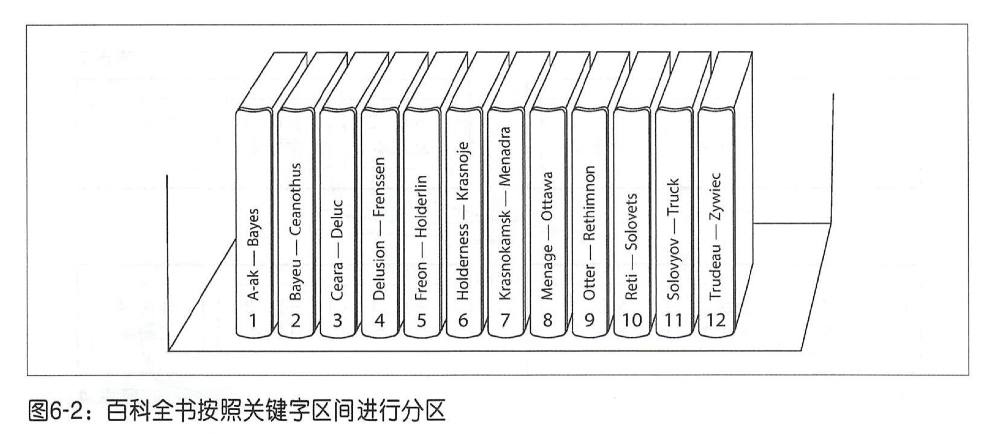
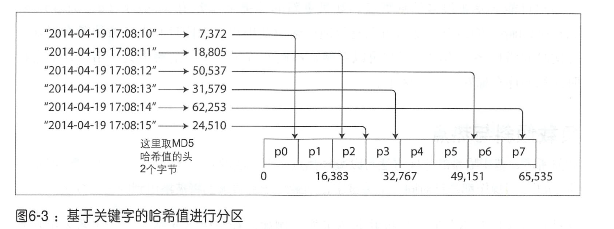
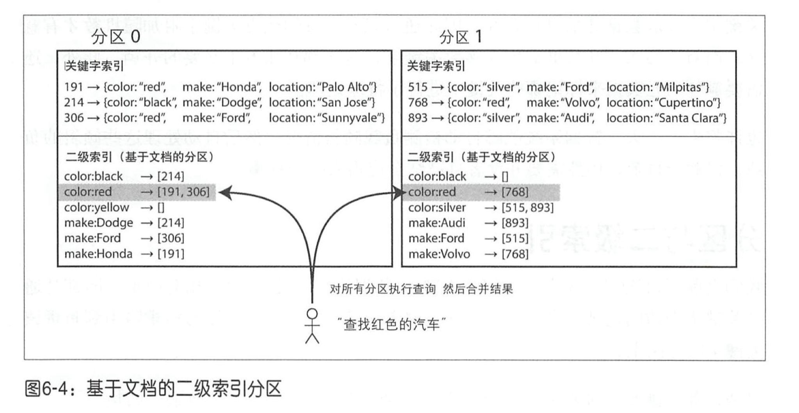
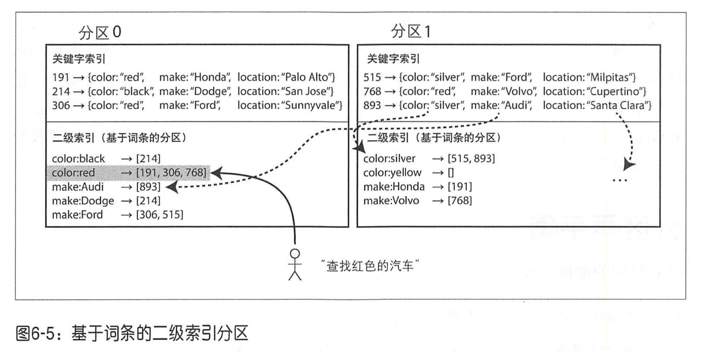
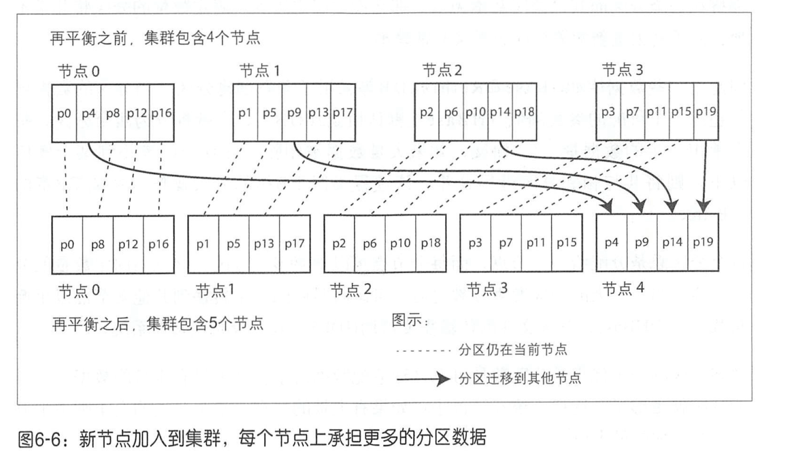
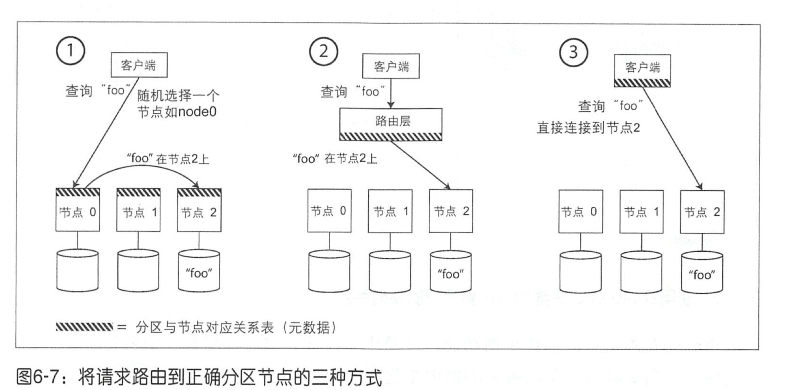
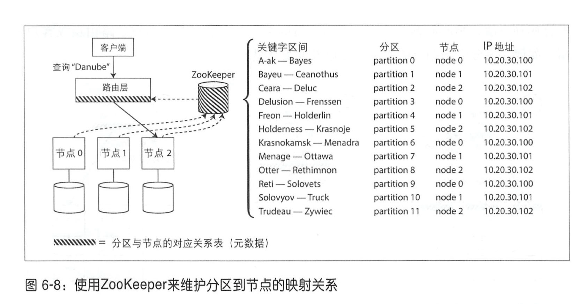

# 第六章：数据分区

分区的定义：每一条数据（或者每条记录，每行或每个文档）只属于某个特定分区。每个分区都可以视为一 个完整的小型数据库 ，虽然数据库可能存在一些跨分区的操作。

## 数据分区与数据复制

分区通常与复制结合使用，即每个分区在多个节点都存有副本。副本可能存储在不同的节点上来保证可用性（类似于 kafka 的 partition，每个 partition 的副本分布在不同的 broker 上）。

## 键－值数据的分区

如果分区不均匀，就会出现某些分区节点比其他分区承担更多的数据量或查询负载，称之为倾斜。这种分区节点就成为了系统热点。下面介绍一些分区方法。

### 基于关键字区间分区

分配一段连续的关键字，只要知道关键字的上下限，那么就很容易确定哪些分区包含哪些关键字。比如百科全书按字母排序，a-b 的部分在第一个分区，b-c 在第二个分区。如图所示：

因为每个分区都根据关键字进行**排序**了，所以可以很轻松支持区间查询。比如选择测量的时间戳作为关键字，就可以快速获取某个月份内的所有数据。

但是这样容易造成热点问题，比如一天一个分区，那么当天的分区一定是写入操作最频繁的分区，其他的分区则比较空闲。解决方法是可以在时间戳前面加上名称，先根据名称再按时间来分区，这样写入就会分布到不同的分区中。

### 基于关键字哈希值分区

许多分布式系统采用了基于关键字哈希函数的方式来分区。

一个好的哈希函数可以处理数据倾斜并使其均匀分布。例如一个处理字符串的 32 位哈希函数，当输入某个字符串，它会返回一个 0 到2^32-1 之间近似随机分布的数值。即使输入的字符串非常相似，返回的哈希值也会在上述数字范围内均匀分布。

关键字根据其哈希值的范围划分到不同的分区中：

虽然哈希分区可以减轻数据倾斜的问题，但是无法支持很好的区间查询。

可以使用组合索引混合这两种分区策略。比如在社交网站上，一个用户可能会发布很多消息更新。如果更新的关键字设置为（ user_id, update_ timestamp ）的组合，那么可以有效地检索由某用户在一段时间内所做的所有更新，且按时间戳排序。不同的用户可以存储在不同的分区上，但是对于某一用户，消息按时间戳顺序存储在一个分区上。也就是说先按 user_id 进行哈希分区，然后在该分区使用时间戳进行排序。

### 负载倾斜与热点

一些极端情况下哈希分区的方法也无法避免热点问题。比如社交网络上一个名人发布一个热点事件，会有很多人对这件事情评论，也就是写入操作，这个事件 ID 所在的分区就会存在热点。

此时只能通过应用层来减轻倾斜程度，比如给这个关键字的开头或结尾加上一个两位数的随机的十进制数，比如 00、01 等，就可以将关键字的写操作分布到 100 个不同的关键字上，从而分配到不同的分区上。但是随之而来还有其它问题，比如读取时需要合并这些分区，还要额外的元数据来标记哪些关键字进行了特殊处理。

## 分区与二级索引

二级索引在关系型数据库中也叫非主键索引，在文档数据库中应用也非常普遍，二级索引技术也是 Solr 和 Elasticsearch 等全文索引服务器存在之根本。二级索引带来的主要挑战是它 们不能规整的地映射到分区中。有两种主要的方法来支持对二级索引进行分区：基于文档的分区和基于词条的分区。

### 基于文档分区的二级索引

一般会先根据文档 ID 来进行分区，比如下图的分区 0 和 1，然后在颜色和制造商上建立二级索引。

基于文档的索引方法中，每个分区完全独立，各自维护自己的二级索引，此时也叫本地索引。写入时先通过文档 ID 找到分区，然后再在该分区中更新二级索引中。但是如果想要查找所有红色汽车，那就需要将查询发送到所有的分区，然后合并所有返回的结果。

这种查询分区数据库的方法有时也称为分散／聚集，显然这种二级索引的查询代价高昂。

### 基于词条分区的二级索引

对所有的数据构建全局索引，全局索引也必须进行分区，且可以与数据关键字采用不同的分区策略。如下图所示：

此时所有颜色为红色的汽车都被收录到 color:red 中，而索引也是分区的，比如从 a 到 r 开始的颜色放在分区 0 中，其他的在分区 1 中。

这种索引方案称为词条分区，它以待查找的关键字本身作为索引，也成为全局索引。这个好处是读取的时候非常高效，但是写入会很复杂，因为单个文档的写入可能会涉及到多个二级索引，且这些二级索引可能分布在不同的节点上，由此势必引入显著的写放大。因此对全局二级索引的更新往往都是异步的，即更新后不能马上利用索引来查到该数据。

## 分区再平衡

迁移负载的过程称为再平衡（或动态平衡）。再平衡应该满足以下几点：

- 平衡之后，负载、数据存储、读写请求等应该在集群范围更均匀地分布。
- 平衡过程中，数据库应该能正常提供读写服务。
- 避免不必要的负载迁移，以加快动态再平衡，井尽量减少网络和磁盘 IO 影响。

### 策略

#### 为什么不用取模？

之前说通过哈希求值来分片，为什么不直接用取模来划分？比如 key mod 10 会返回 0 到 9 之间的数字。这是因为如果使用取模来分片，那么如果节点数变化了，会导致很多 key 的分片位置都会被改变，也就会造成大量的数据迁移。而用哈希就不会有这个问题，哈希值和节点数没关系，只和 key 有关系。

#### 固定数量的分区

方案：首先， 创建远超实际节点数的分区数 ，然后为每个节点分配多个分区。例如，对于一个 10 节点的集群， 数据库可以从一开始就逻辑划分为 1000个分区， 这样大约每个节点承担 100 个分区。如果有新节点加入，那么可以从原有的节点里匀走几个分区，直到分区再次达到全局平衡。 该过程如图 6 -6 所示。如果从集群中删除节点，则采取相反的均衡措施。（这个就很像 redis cluster slot 结构。）

这样 key 到分区的映射关系不会变，只是需要调整分区到节点的对应关系。分区数量一开始就要设置好，根据实际情况而定。

#### 动态分区

根据分区容量大小来动态分区。比如一些数据库如 HBase 和 RethinkDB 等采用了动态创建分区。当分区的数据增长超过一个可配的参数阈值（HBase 上默认值是 10GB），它就拆分为两个分区，每个承担一半的数据量 [26]。相反，如果大量数据被删除，并且分区缩小到某个阈值以下，则将其与相邻分区进行合井。该过程类似于B 树的分裂操作。

如果一开始没有手动设置分区，从一个分区开始，那么所有请求都只会被一个节点处理，其他节点空闲，这样就会产生热点问题。因此 HBase 和 MongoDB 允许在一个空的数据库上配置一组初始分区（这被称为预分裂）。对于关键字区间分区，预分裂要求已经知道一些关键字的分布情况[4,26]。

#### 按节点比例分区

Cassandra 和 Ketama 采用了第三种方式，使分区数与集群节点数成正比关系。即每个节点具有固定数量的分区[23,27,28]。当节点数不变时，分区大小与数据集大小成正比关系。当节点数增加时，分区则会被调整得更小。比如当一个新节点加入集群时，它随机选择固定数量的现有分区进行分裂，然后拿走这些分区的一半数据量，将另一半数据留在原节点。

随机选择分区边界的前提要求采用基于哈希分区，这种方法也最符合本章开头所定义一致性哈希[7] 。一些新设计的哈希函数也可以以较低的元数据开销达到类似的效果[8]。

## 请求路由

前面说了再平衡之后 key 和分区的对应关系没变，但是分区与节点的关系变了，那么有哪些方法可以让客户端通过分区找到正确的节点访问呢？

策略：

1. 允许客户端链接任意的节点（例如采用循环式的负载均衡器）。如果某节点恰好拥有所请求的分区，则直接处理该请求。否则，将请求转发到下一个合适的节点，接收答复，并将答复返回给客户端。
2. 将所有客户端的请求都发送到一个路由层，由后者负责将请求转发到对应的分区节点上。路由层仅充当一个分区感知的负载均衡器。
3. 客户端感知分区和节点分配关系。此时，客户端可以直接连接到目标节点，而不需要任何中介。

一般的解决方案是依赖 ZooKeeper 来跟踪集群范围内的元数据，如图 6-8 所示。 每个节点都向 ZooKeeper 注册自己， **ZooKeeper 维护了分区到节点的最终映射关系**。 其他参与者（比如路由层或分区感知的客户端 ）可以向 ZooKeeper 订阅此信息。 一旦分区发生了改变， 或者添加、删除节点， ZooKeeper 就会主动通知路由层，这样使路由信息保持最新状态。

HBase、SolrCloud、Kafka 就是使用 ZooKeeper 来跟踪分区分配情况。MongoDB 有类似的设计， 但它依赖于自己的配置服务器和mangos守护进程来充当路由层。Cassandra 和 Riak 则采用了不同的方法，它们在节点之间使用 gossip 协议来同步群集状态的变化。

## 小结

两种主要的分区方法 ：

- 基于关键字区间的分区。

  先对关键字进行排序，每个分区只负责一段包含最小到最大关键字范围的一段关键字。优点是可以支持高效的区间查询，但是如果应用程序经常访问与排序一致的某段关键字，就会存在热点的风险。采用这种方法，当分区太大时，通常将其分裂为两个子区间，从而动态地再平衡分区。

- 哈希分区。

  将哈希函数作用于每个关键字，每个分区负责一定范围的哈希值。这种方法打破了原关键字的顺序关系，它的区间查询效率比较低，但可以更均匀地分配负载。采用哈希分区时，通常事先创建好足够多（但固定数量）的分区，让每个节点承担多个分区，当添加或删除节点时将某些分区从一个节点迁移到另一个节点，也可以支持动态分区。

混合上述两种基本方法也是可行的，例如使用复合键：键的一部分来标识分区，而另一部分来记录排序后的顺序 。

二级索引：本地索引、全局索引。

## 参考文献

1. David J. DeWitt and Jim N. Gray: “[Parallel Database Systems: The Future of High Performance Database Systems](http://ddia.vonng.com/#/),” *Communications of the ACM*, volume 35, number 6, pages 85–98, June 1992. [doi:10.1145/129888.129894](http://dx.doi.org/10.1145/129888.129894)
2. Lars George: “[HBase vs. BigTable Comparison](http://www.larsgeorge.com/2009/11/hbase-vs-bigtable-comparison.html),” *larsgeorge.com*, November 2009.
3. “[The Apache HBase Reference Guide](https://hbase.apache.org/book/book.html),” Apache Software Foundation, *hbase.apache.org*, 2014.
4. MongoDB, Inc.: “[New Hash-Based Sharding Feature in MongoDB 2.4](http://blog.mongodb.org/post/47633823714/new-hash-based-sharding-feature-in-mongodb-24),” *blog.mongodb.org*, April 10, 2013.
5. Ikai Lan: “[App Engine Datastore Tip: Monotonically Increasing Values Are Bad](http://ikaisays.com/2011/01/25/app-engine-datastore-tip-monotonically-increasing-values-are-bad/),” *ikaisays.com*, January 25, 2011.
6. Martin Kleppmann: “[Java's hashCode Is Not Safe for Distributed Systems](http://martin.kleppmann.com/2012/06/18/java-hashcode-unsafe-for-distributed-systems.html),” *martin.kleppmann.com*, June 18, 2012.
7. David Karger, Eric Lehman, Tom Leighton, et al.: “[Consistent Hashing and Random Trees: Distributed Caching Protocols for Relieving Hot Spots on the World Wide Web](http://www.akamai.com/dl/technical_publications/ConsistenHashingandRandomTreesDistributedCachingprotocolsforrelievingHotSpotsontheworldwideweb.pdf),” at *29th Annual ACM Symposium on Theory of Computing* (STOC), pages 654–663, 1997. [doi:10.1145/258533.258660](http://dx.doi.org/10.1145/258533.258660)
8. John Lamping and Eric Veach: “[A Fast, Minimal Memory, Consistent Hash Algorithm](http://arxiv.org/pdf/1406.2294v1.pdf),” *arxiv.org*, June 2014.
9. Eric Redmond: “[A Little Riak Book](http://littleriakbook.com/),” Version 1.4.0, Basho Technologies, September 2013.
10. “[Couchbase 2.5 Administrator Guide](http://docs.couchbase.com/couchbase-manual-2.5/cb-admin/),” Couchbase, Inc., 2014.
11. Avinash Lakshman and Prashant Malik: “[Cassandra – A Decentralized Structured Storage System](http://www.cs.cornell.edu/Projects/ladis2009/papers/Lakshman-ladis2009.PDF),” at *3rd ACM SIGOPS International Workshop on Large Scale Distributed Systems and Middleware* (LADIS), October 2009.
12. Jonathan Ellis: “[Facebook’s Cassandra Paper, Annotated and Compared to Apache Cassandra 2.0](http://www.datastax.com/documentation/articles/cassandra/cassandrathenandnow.html),” *datastax.com*, September 12, 2013.
13. “[Introduction to Cassandra Query Language](http://www.datastax.com/documentation/cql/3.1/cql/cql_intro_c.html),” DataStax, Inc., 2014.
14. Samuel Axon: “[3% of Twitter's Servers Dedicated to Justin Bieber](http://mashable.com/2010/09/07/justin-bieber-twitter/),” *mashable.com*, September 7, 2010.
15. “[Riak 1.4.8 Docs](http://docs.basho.com/riak/1.4.8/),” Basho Technologies, Inc., 2014.
16. Richard Low: “[The Sweet Spot for Cassandra Secondary Indexing](http://www.wentnet.com/blog/?p=77),” *wentnet.com*, October 21, 2013.
17. Zachary Tong: “[Customizing Your Document Routing](http://www.elasticsearch.org/blog/customizing-your-document-routing/),” *elasticsearch.org*, June 3, 2013.
18. “[Apache Solr Reference Guide](https://cwiki.apache.org/confluence/display/solr/Apache+Solr+Reference+Guide),” Apache Software Foundation, 2014.
19. Andrew Pavlo: “[H-Store Frequently Asked Questions](http://hstore.cs.brown.edu/documentation/faq/),” *hstore.cs.brown.edu*, October 2013.
20. “[Amazon DynamoDB Developer Guide](http://docs.aws.amazon.com/amazondynamodb/latest/developerguide/),” Amazon Web Services, Inc., 2014.
21. Rusty Klophaus: “[Difference Between 2I and Search](http://lists.basho.com/pipermail/riak-users_lists.basho.com/2011-October/006220.html),” email to *riak-users* mailing list, *lists.basho.com*, October 25, 2011.
22. Donald K. Burleson: “[Object Partitioning in Oracle](http://www.dba-oracle.com/art_partit.htm),”*dba-oracle.com*, November 8, 2000.
23. Eric Evans: “[Rethinking Topology in Cassandra](http://www.slideshare.net/jericevans/virtual-nodes-rethinking-topology-in-cassandra),” at *ApacheCon Europe*, November 2012.
24. Rafał Kuć: “[Reroute API Explained](http://elasticsearchserverbook.com/reroute-api-explained/),” *elasticsearchserverbook.com*, September 30, 2013.
25. “[Project Voldemort Documentation](http://www.project-voldemort.com/voldemort/),” *project-voldemort.com*.
26. Enis Soztutar: “[Apache HBase Region Splitting and Merging](http://hortonworks.com/blog/apache-hbase-region-splitting-and-merging/),” *hortonworks.com*, February 1, 2013.
27. Brandon Williams: “[Virtual Nodes in Cassandra 1.2](http://www.datastax.com/dev/blog/virtual-nodes-in-cassandra-1-2),” *datastax.com*, December 4, 2012.
28. Richard Jones: “[libketama: Consistent Hashing Library for Memcached Clients](https://www.metabrew.com/article/libketama-consistent-hashing-algo-memcached-clients),” *metabrew.com*, April 10, 2007.
29. Branimir Lambov: “[New Token Allocation Algorithm in Cassandra 3.0](http://www.datastax.com/dev/blog/token-allocation-algorithm),” *datastax.com*, January 28, 2016.
30. Jason Wilder: “[Open-Source Service Discovery](http://jasonwilder.com/blog/2014/02/04/service-discovery-in-the-cloud/),” *jasonwilder.com*, February 2014.
31. Kishore Gopalakrishna, Shi Lu, Zhen Zhang, et al.: “[Untangling Cluster Management with Helix](http://www.socc2012.org/helix_onecol.pdf?attredirects=0),” at *ACM Symposium on Cloud Computing* (SoCC), October 2012. [doi:10.1145/2391229.2391248](http://dx.doi.org/10.1145/2391229.2391248)
32. “[Moxi 1.8 Manual](http://docs.couchbase.com/moxi-manual-1.8/),” Couchbase, Inc., 2014.
33. Shivnath Babu and Herodotos Herodotou: “[Massively Parallel Databases and MapReduce Systems](http://research.microsoft.com/pubs/206464/db-mr-survey-final.pdf),” *Foundations and Trends in Databases*, volume 5, number 1, pages 1–104, November 2013.[doi:10.1561/1900000036](http://dx.doi.org/10.1561/1900000036)

