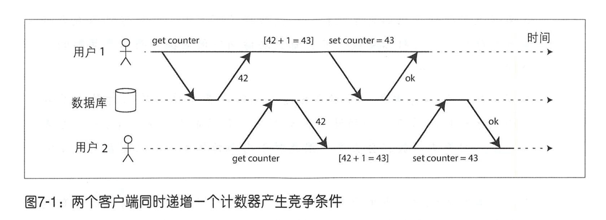
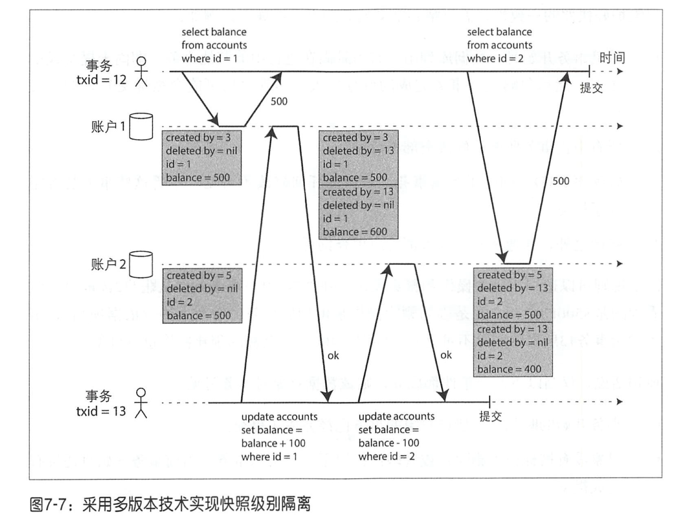
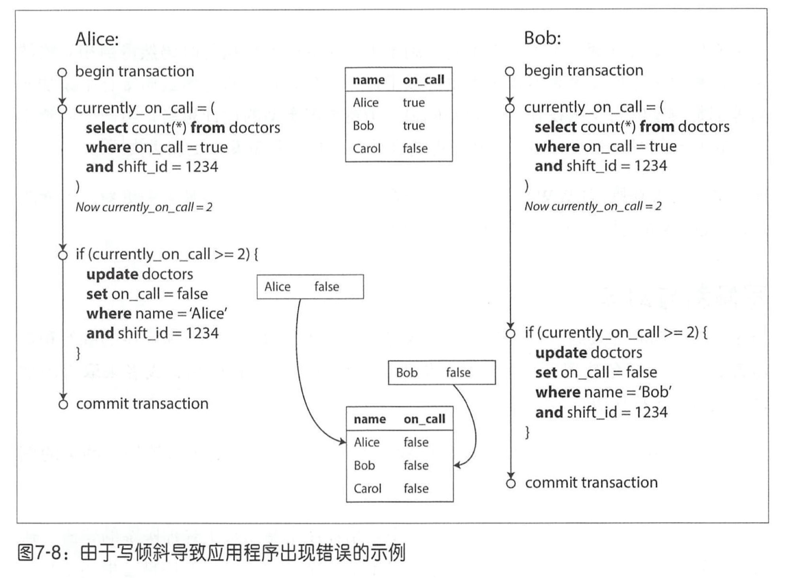
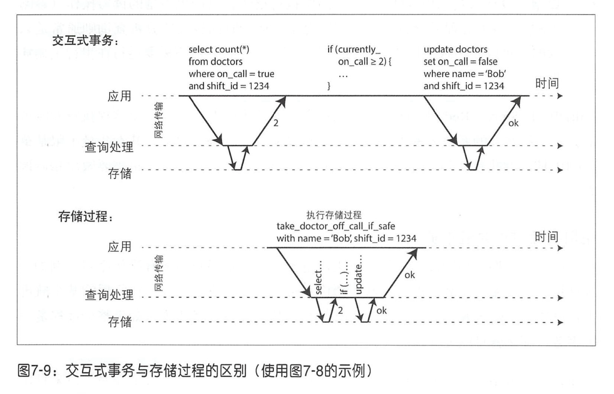
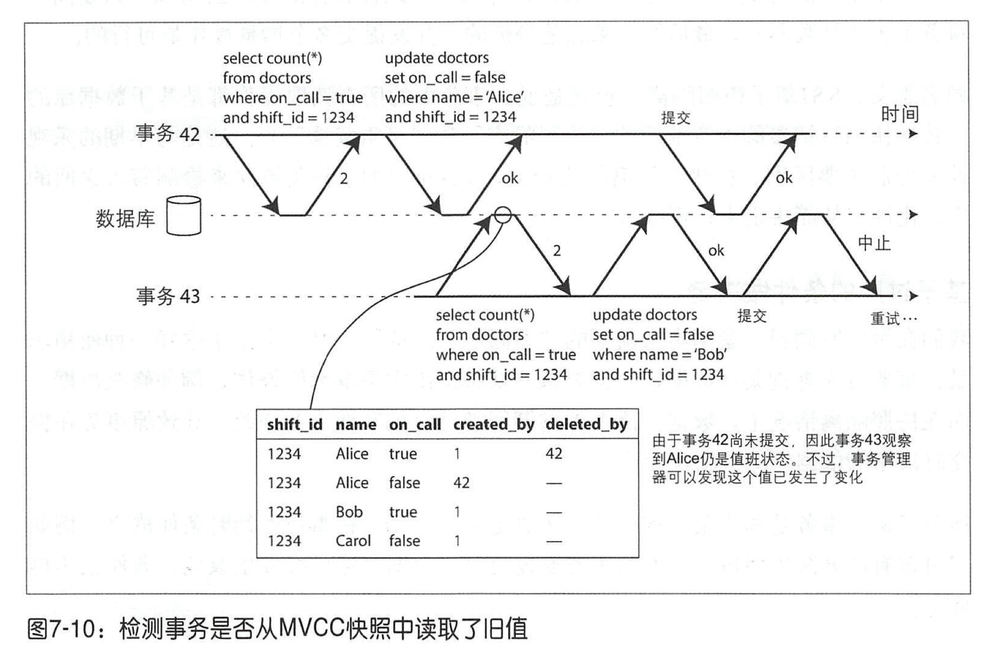
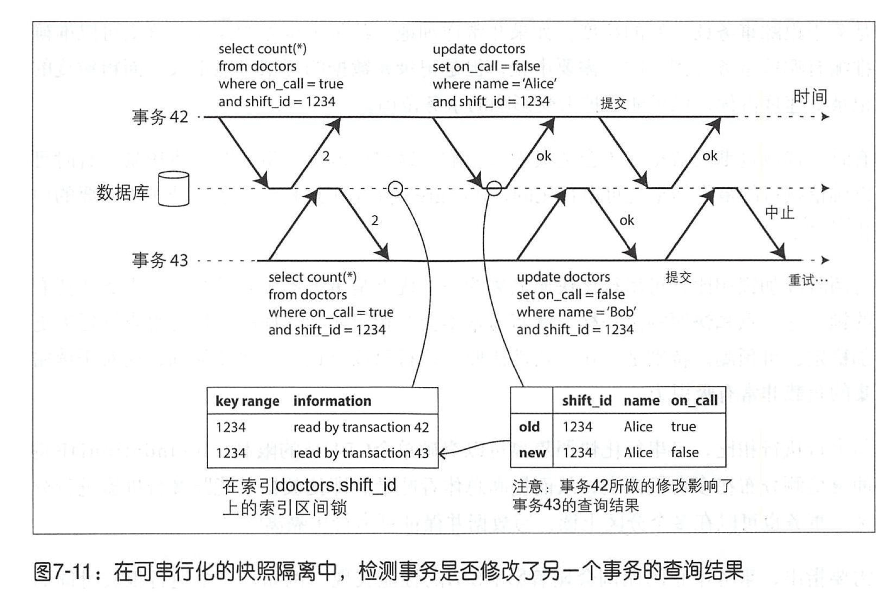

# 第七章：事务

事务中的所有读写是一个执行的整体， 整个事务要么成功（提交）、要么失败（中止或回擦）。如果失败，应用程序可以安全地重试。 这样，由于不需要担心部分失败的情况（无论出于何种原因），应用层的错误处理就变得简单很多。

## 深入理解事务

### ACID 的含义

原子性（ Atomicity ），一致 性（ Consistency ），隔离性（ Isolation ）与持久性（ Durability ）。

而不符合 ACID 标准的系统有时被冠以 BASE ，即基本可用性（ Basically Available ），软状态（ Soft state ）和最终一致性（ Eventual consistency ）[9]。听下来它似乎比 ACID更加模棱两可。BASE唯一可以确定的是“它不是ACID ”，此外它几乎没有承诺任何东西。

#### 原子性

原子是指不可分解为更小粒度的东西。ACID 中原子性的特性：在出错时中止事务， 并将部分完成的写入全部丢弃。

保证原子性的好处：如果事务已经中止， 应用程序可以确定没有实质发生任何更改，所以可以安全地重试。

#### 一致性

ACID 中的一致性主要是指对数据有特定的预期状态，任何数据更改必须满足这些状态约束（或者恒等条件）。

这种一致性本质上要求应用层来维护状态一致，应用程序有责任正确地定义事务来保持一致性。 这不是数据库可以保证的事情。应用程序可能借助数据库提供的原子性和隔离性，以达到一致性，但一致性本身并不源于数据库。因此，字母 C 其实并不应该属于ACID（Joe Hellerstein 曾经在文献[7]中评论，字母C只是为了使ACID这个缩略词听起来更为顺口 ，当时并非觉得这是件很重要的事情）。

#### 隔离性

ACID 语义中的隔离性意味着并发执行的多个事务相互隔离，它们不能互相交叉。

主要是为了解决数据竞争问题，即多个客户端同时读写相同数据，如下图所示：



#### 持久性

ACID 的持久性保证一且事务提交成功，即使存在硬件故障或数据库崩溃， 事务所写入的任何数据也不会消失。

对于单节点数据库 ，持久性通常意味着数据已被写入非易失性存储设备，如硬盘或SSD 。 在写入执行过程中，通常还涉及预写日志等（参阅第3章 “可靠的B-tree”）。而对于支持远程复制的数据库，持久性则意味着数据已成功复制到多个节点。

> 现实情况是，没有哪一项技术可以提供绝对的持久性保证 。这些都是帮助降低风险的手段，应该组合使用它们，包括写入磁盘、复制到远程机器以及备份等 。 因此对任何理论上的 “保证”一定妥谨慎对待。

### 

## 弱隔离级别

### 读-提交

读－提交是最基本的的事务隔离级别，它只提供以下两个保证 ：

1. 读数据库时，只能看到已成功提交的数据（防止“脏读”）。 

2. 写数据库时，只会覆盖已成功提交的数据（防止“脏写”）。

> 有些数据库甚至提供更弱的隔离级别，称为读－未提交 。它只防止脏写，而不防止脏读 。
>

脏读：一个事务可以看到另一个事务尚未提交的数据。

脏写：一个事务可以覆盖另一个事务尚未提交的数据。

#### 实现读－提交

防止脏写：数据库通常采用行级锁来实现。当事务想修改某个对象（例如行或文档）时，它必须首先获得该对象的锁；然后一直持有锁直到事务提交（或中止）。

防止脏读：对于每个待更新的对象，数据库都会维护其旧值和当前持锁事务将要设置的新值两个版本。在事务提交之前，所有其他读操作都读取旧值；仅当写事务提交之后，才会切换到读取新值。

### 快照级别隔离与可重复读

不可重复读取（ nonrepeatable read ）或读倾斜（ read skew ）：在一个事务中，同一行记录被访问了两次却得到了不同的结果。

有些场景无法容忍不可重复读，比如：

- 备份场景

  备份任务要复制整个数据库，这可能需要数小时才能完成。在备份过程中，可以继续写入数据库。因此，得到镜像里可能包含部分旧版本数据和部分新版本数据。如果从这样的备份进行恢复，最终就导致了永久性的不一致（例如那些消失的存款）。

- 分析查询与完整性检查场景

  有时查询可能会扫描几乎大半个数据库。这类查询在分析业务中很常见（参阅第3章“事务处理或分析”），亦或定期的数据完整性检查（ 即监视数据损坏情况）。如果这些查询在不同时间点观察数据库，可能会返回无意义的结果。

解决方法：**快照级别隔离**（也叫可重复读隔离）。每个事务都从数据库的一致性快照中读取，事务一开始所看到是最近提交的数据，即使数据随后可能被另一个事务更改，但保证每个事务都只看到该特定时间点的旧数据。

#### 实现快照级别隔离

使用多版本并发控制 (Multi-Version Concurrency Control , MVCC ）来实现快照级别隔离。但也可以使用 MVCC 实现读-提交隔离。在读－提交级别下，**对每一个不同的查询单独创建一个快照**；而**快照级别隔离则是使用一个快照来运行整个事务**。

图 7-7说明了PostgreSQL 如何实现基于 MVCC 的快照级别隔离[31]（其他实现基本类似）。当事务开始时， 首先赋予一个唯一的、单调递增的事务 ID (txid)。每当事务向数据库写入新内容时，所写的数据都会被标记写入者的事务 ID 。



上图中的 created_by 字段的值是创建该行的事务 ID，deleted_by 是删除该行的事务 ID。首先创建 账户1 和 账户2 两行数据，balance = 500。然后事务 13 将账户 1 的余额加 100，更新操作被转换成删除再创建，也就是 deleted_by = 13 然后 created_by = 13 ，之后再在账户 2 的余额扣除 100，提交事务。事务 13 会创建账户1余额为 600 的版本和账户2余额为 400 的版本，由于事务 13 晚于事务 12，所以事务 13 做的修改对事务 12 完全不可见，不管事务 13 是否提交。因此事务 12 读到的账户1和2的余额一直都是 500。

> 上面的过程中，如果事务要删除某行， 该行实际上并未从数据库中删除，而只是将 deleted_by 字段设置为请求删除的事务ID （仅仅标记为删除）。事后，当确定没有其他事务引用该标记删除的行时，数据库的垃圾回收进程才去真正删除井释放存储空间。

快照级别隔离情况下，当以下两个条件都成立，数据对象对事务可见：

- 事务开始的时刻，创建该对象的事务已经完成了提交。

- 对象没有被标记为删除；或者即使标记了，但删除事务在当前事务开始时还没有完成提交。

长时间运行的事务可能会使用快照很长时间，从其他事务的角度来看，它可能在持续访问正在被覆盖或删除的内容。由于没有就地更新，而是每次修改总创建一个新版本，因此数据库可以以较小的运行代价来维护一致性快照。

#### 索引与快照级别隔离

一种方案是索引直接指向对象的所有版本， 然后想办法过滤对当前事务不可见的那些版本。当后台的垃圾回收进程决定删除某个旧对象版本时，对应的索引条目也需要随之删除。

PostgreSQL 把同一对象的不同版本放在一个内存页面上来避免更新索引[31]。

CouchDB 、Datomic和LMDB 使用另一种方法。它们主体结构是B-tree。采用了一种追加／写时复制的技术，当需要更新时，不会修改现有的页面， 而总是创建一个新的修改副本，拷贝必要的内容，然后让父结点，或者递归向上直到树的 root 结点都指向新创建的结点。那些不受更新影响的页面都不需要复制，保持不变并被父结点所指向[33-35]。

这种采用追加式的 B-tree ，每个写入事务（或一批事务）都会创建一个新的 B-tree root ，代表该时刻数据库的一致性快照。 这时就没有必要根据事务 ID 再去过滤掉某些对象，每笔写入都会修改现有的 B-tree， 因为之后的查询可以直接作用于特定快照 B-tree（有利于查询性能）。 采用这种方法依然需要后台进程来执行压缩和垃圾回收。

（这部分没太明白，每个事务都创建自己的树来修改，那么修改完了之后怎么合并到原来的树呢？是根据事务 ID 直接进行覆盖还是怎么样？）

### 防止更新丢失

更新丢失可能发生的场景：应用程序从数据库读取某些值，根据应用逻辑做出修改，然后写回新值 （ read modify－ write过程）。当有两个事务在同样的数据对象上执行类似操作时，由于隔离性，第二个写操作并不包括第一个事务修改后的值，最终会导致第一个事务的修改值可能会丢失。比如：

- 递增计数器。
- 对JSON文档中一个列表添加新元素（需要读取并解析文档，执行更改井写回修改后的文档）。
- 两个用户同时编辑wiki页面，且每个用户都尝试将整个页面发送到服务器，覆盖数据库中现有内容以使更改生效。

#### 原子写操作

许多数据库提供了原子更新操作，以避免在应用层代码完成“读－修改－写回”操作， 如果支持的话，通常这就是最好的解决方案。例如，以下指令在多数关系数据库中都是井发安全的：

```sql
UPDATE counters SET value = value + 1 WHERE key = 'foo';
```

原子操作通常采用对读取对象加独占锁的方式来实现，这样在更新被提交之前不会有其他事务可以读它。这种技术有时被称为游标稳定性［36,37］。 另 一种实现方式是强制所有的原子操作都在单线程上执行。

#### 显示加锁

即 FOR UPDATE 指令。但需要仔细考虑清楚应用层的逻辑，很多代码会忘记在必要的地方加锁，结果很容易引入竞争冲突。

#### 自动检测更新丢失

**原子操作和锁都是通过强制“读－修改－写回”操作序列串行执行来防止丢失更新**。这种方式会让操作并发执行，如果事务管理器检测到了更新丢失风险，则会中止当前事务，并强制回退到安全的“读－修改－写回”方式。

PostgreSQL的可重复读， Oracle的可串行化以及SQL Server的快照级别隔离等，都可以自动检测何时发生了更新丢失，然后会中止违规的那个事务。而 MySQL 的 InnoDB 的可重复读却并不支持检测更新丢失[23] ，[28,30]。

#### 原子比较和设置

即 CAS （Compare And Set），只有在上次读取的数据没有发生变化时才允许更新；如果已经发生了变化，则回退到“读－修改－写回“方式。

```sql
-- 根据数据库的实现情况，这可能安全也可能不安全
UPDATE wiki_pages SET content = '新内容'
  WHERE id = 1234 AND content = '旧内容';
```

#### 冲突解决与复制

在多副本环境下的并发写，加锁和原子比较将不再适用，此时需要应用层来解决合并多个版本。

### 写倾斜与幻读

如下图所示，假设值班室至少需要一名医生在，Alice 和 Bob 两位值班医生同时更新自己的值班记录为离开，由于使用快照级别隔离，事务开始的检查都返回了两名医生，因此可以继续执行，最后两个事务都成功提交，然而已经不符合开始设定的条件了。



可以将写倾斜视为一种更广义的更新丢失问题。即如果两个事务读取相同的一组对象，不同的事务**更新不同的对象**，则可能发生写倾斜 ；而不同的事务如果**更新的是同一个对象**，则可能发生脏写或更新丢失（具体取决于时间窗口）。

可串行化级别隔离可以防止写倾斜问题。而对于这个例子一个次优的方案是加锁：

```sql
BEGIN TRANSACTION;
SELECT * FROM doctors
  WHERE on_call = TRUE
  AND shift_id = 1234 FOR UPDATE;

UPDATE doctors
  SET on_call = FALSE
  WHERE name = 'Alice'
  AND shift_id = 1234;
  
COMMIT;
```

FOR UPDATE 语句会通知数据库对返回的所有结果行自动加锁。一个事务给返回的结果行加上锁之后，其他的事务也会尝试加锁（SELECT FOR UPDATE），但就需要等待锁释放之后才能加锁，因此它们会**等待第一个事务更新并提交之后才能查询到结果**，此时值班室的人数只有 1 个人了，这样就不会出现写倾斜的问题。

另外会议室预订系统也会有类似的问题：

```sql
BEGIN TRANSACTION;

-- 检查所有现存的与 12:00~13:00 重叠的预定
SELECT COUNT(*) FROM bookings
WHERE room_id = 123 AND
  end_time > '2015-01-01 12:00' AND start_time < '2015-01-01 13:00';

-- 如果之前的查询返回 0
INSERT INTO bookings(room_id, start_time, end_time, user_id)
  VALUES (123, '2015-01-01 12:00', '2015-01-01 13:00', 666);

COMMIT;
```

可以使用可串行化的隔离来解决。

写倾斜的例子都遵循以下类似的模式：

1. 首先输入一些匹配条件，即采用 SELECT 查询所有满足条件的行。
2. 根据查询的结果，应用层代码来决定下一步的操作。
3. 如果应用程序决定继续执行，它将发起数据库写入并提交事务。

对于医生值班的例子， 步骤3 中所修改的行恰好是步骤 1 查询结果的一部分， 因此如果先修改值班记录并加锁（ SELECT FOR UPDATE ），再查询就能保证事务安全，避免写倾斜。而对于会议室预定的例子，检查的是不满足给定搜索条件的行（预期结果为空），接下来添加符合条件的行。如果步骤 1 的查询根本没有返回任何行，则 SELECT FOR UPDATE 也就无从加锁。因此此时无法使用加锁来解决写倾斜的问题。

这种在一个事务中的写入改变了另一个事务查询结果的现象，称为幻读[3]。快照级别隔离可以避免只读查询时的幻读， 但是对于我们上面所讨论那些读－写事务，它却无法解决棘手的写倾斜问题。

#### 实体化冲突

如果查询结果中没有对象可以加锁， 或许可以人为引人一些可加锁的对象。

比如会议室例子，可以构造一个时间 - 房间表， 表的每一行对应于特定时间段（例如最小 15 分钟间隔）的特定房间。这样预订事务可以查询并锁定（ SELECT FOR UPDATE ）表中与查询房间和时间段所对应的行。 加锁之后， 即可检查是否有重叠，然后像之前一样插入新的预订。

这种方被称为实体化冲突（或物化冲突），它把幻读问题转变为针对数据库中一组具体行的锁冲突问题[11]。

但不推荐采用实体化冲突。在大多数情况下，可串行化隔离方案更为可行。

## 串行化

可串行化隔离保证，即使事务可能会井行执行，但最终的结果与串行执行结果相同。可以防止所有可能的竞争条件。

目前大多数提供可串行化的数据库都使用了以下三种技术之一：实际串行执行，两阶段锁定，乐观并发控制技术。

### 实际串行执行

VoltDB/H-Store 、 Redis和Datomic等采用串行方式执行事务[46-48] ，即采用单线程方式执行来保证串行化。

也可以采用存储过程封装事务，这样无需等待网络或磁盘 IO ：



当满足以下约束条件时，串行执行事务可以实现串行化隔离：

- 事务必须简短而高效，否则一个缓慢的事务会影响到所有其他事务 的执行性能。

- 仅限于活动数据集完全可以加载到内存的场景。有些很少访问的数据可能会被移到磁盘，但万一单线程事务需要访问它，就会严重拖累性能。（如果事务需要访问那些不在内存的数据，最好的解决方案可能是中止事务，异步地将数据提取到内存中 ，同时继续处理其他事务，然后在数据加载完成后重启事务 。这种方法被称为反高速缓存）

- 写入吞吐量必须足够低，mm才能在单个CPU核上处理；否则就需要采用分区，最好没有跨分区事务。

- 跨分区事务虽然也可以支持，但是占比必须很小。

### 两阶段加锁

近三十年来，可以说数据库只有一种被广泛使用的串行化算法，那就是两阶段加锁 (two-phase locking， 2PL ）。

> 虽然两阶段加锁 （ 2PL ）听起来和两阶段提交（ two-phase commit, 2PC ）很相近，但它们是完全不同的东西 。我们将在第9章讨论 2PC 。

- 如果事务 A 已经读取了某个对象，此时事务 B 想要写入该对象，那么 B 必须等到 A 提交或中止之才能继续。以确保 B 不会在事务 A 执行的过程中间去修改对象。

- 如果事务 A 已经修改了对象， 此时事务 B 想要读取该对象，则 B 必须等到 A 提交或中止之后才能继续。对于2PL ，不会出现读到旧值的情况。

2PL不仅在井发写操作之间互斥，读取也会和修改产生互斥 。快照级别隔离的口号 “读写互不干扰” 非常准确地点明了它和两阶段加锁的关键区别。另 一方面，因为2PL提供了串行化，所以它可以防止前面讨论的所有竞争条件，包括更新丢失和写倾斜。

#### 实现

读加共享锁，写加独占锁；独占锁要求对应记录任何锁都不能有（包括共享锁和独占锁）。可以有多个事务同时获得一个对象的共享锁，但是如果某个事务已经获得了对象的独占锁，则所有其他事务必须等待。

事务获得锁之后，一直持有锁直到事务结束（包括提交或中止）。这也是名字 “两阶段”的来由，在第一阶段即事务执行之前要获取锁，第二阶段（即事务结束时）释放锁。

#### 性能

2PL 的事务吞吐量和查询响应时间相比于其他弱隔离级别下降非常多。且更容易发生死锁。

#### 索引区间锁

next-key locking，本质上是对谓词锁的简化或者近似[41,50]。

对于房间预订数据库， 通常会在 room_id 列上创建索引，和／或在 start_time 和 end_time 上有索引（否则前面的查询在大型数据库上会很慢）:

- 假设索引位于 room_id 上，数据库使用此索引查找 123 号房间的当前预订情况。 现在数据库可以简单地将共享锁附加到此索引条目， 表明事务已搜索了 123 号房间的所有时间段预订。(其实就是给所有 123 号房间的记录加了一个记录锁)
- 或者，如果数据库使用基于时间的索引来查找预订， 则可以将共享锁附加到该索引中的一系列值，表示事务已经搜索了该时间段内的所有值 。（给这个时间段内加了一个间隙锁）

无论哪种方式，查询条件的近似值都附加到某个索引上。接下来，如果另 一个事务想要插入、更新或删除同一个房间和／或重叠时间段的预订 ，则肯定需要更新这些索引 ，一定就会与共享锁冲突，因此会自动处于等待状态直到共享锁释放。这样就有效防止了写倾斜和幻读问题。

### 可串行化的快照隔离

可串行化的快照隔离（ Serializable Snapshot Isolation, SSI ）。SSI 可用于单节点数据库（ PostgreSQL 9.1 之后的可串行化隔离）或者分布式数据库（如FoundationDB 采用了类似的算法）。

SSI 基于快照隔离，在快照隔离的基础上， SSI 新增加了相关算法来检测写入之间的串行化冲突从而决定中止哪些事务。

在前面的例子里，介绍了这样一种使用场景 ：事务首先查询某些数据，根据查询的结果来决定采取后续操作，例如修改数据。而在快照隔离情况下，数据可能在查询期间就已经被其他事务修改，导致原事务在提交时决策的依据信息已出现变化。

因此为了提供可串行化的隔离，数据库必须检测事务是否会修改其他事务的查询结果，并在此情况下中止写事务。有以下两种情况：

- 读取是否作用于一个（即将）过期的 MVCC 对象。

- 检查写入是否影响即将完成的读取。


#### 检测是否读取了过期的 MVCC 对象



数据库需要跟踪那些由于 MVCC 可见性规则而被忽略的写操作。当事务提交时 ，数据库会检查是**否存在一些当初被忽略的写操作现在已经完成了提交**， 如果是则必须中止当前事务。

为什么要等到提交：当检测到读旧值，为何不立即中止事务 43 呢？因为可能事务 43 是个只读事务，没有任何写倾斜风险 ，就不需要中止；或者事务 43 提交时，有可能事务 42 发生了中止或者还处于未提交状态，因此读取的并非是过期值。

#### 检测写是否影晌了之前的读



当另一个事务尝试修改时，它首先检查索引，从而确定是否最近存在一些读目标数据的其他事务。这个过程类似于在受影响的字段范围上获取写锁，但它并不会阻塞读取，而是直到读事务提交时才进一步通知他们 ：所读到的数据现在已经发生了变化。

#### 性能

与两阶段加锁相比，可串行化快照隔离不需要等待其他事务所持有的锁。这一点和快照隔离一样 ，读写通常不会互相阻塞。

与串行执行相比，可串行化快照隔离可以突破单个CPU核的限制。 FoundationDB 将冲突检测分布在多台机器上，从而提高总体吞吐量。即使数据可能跨多台机器进行分区，事务也可以在多个分区上读、写数据并保证可串行化隔离[54]。


## 小结

- 脏读

  客户端读到了其他客户端尚未提交的写入。读-提交以及更强的隔离级别可以防止脏读。

- 脏写

  客户端覆盖了另一个客户端尚未提交的写入。几乎所有的数据库实现都可以防止脏写。

- 读倾斜（不可重复读）

  客户在不同的时间点看到了不同值。快照隔离是最用的防范手段， 即事务总是在某个时间点的一致性快照中读取数据。通常采用多版本井发控制（ MVCC ）来实现快照隔离。

- 更新丢失

  两个客户端同时执行读－修改－写入操作序列，出现了其中 一个覆盖了另一个的写入，但又没有包含对方最新值的情况，最终导致了部分修改数据发生了丢失。快照隔离的一些实现可以自动防止这种异常，而另 一些则需要手动锁定查询结果 (SELECT FOR UPDATE ）。

- 写倾斜

  事务首先查询数据，根据返回的结果而作出某些决定，然后修改数据库。当事务提交时，支持决定的前提条件已不再成立。只有可串行化的隔离才能防止这种异常。

- 幻读

  事务读取了某些符合查询条件的对象，同时另一个客户端执行写入，改变了先前的查询结果。快照隔离可以防止简单的幻读，但写倾斜情况则需要特殊处理，例如采用区间范围锁。

实现可串行化隔离的三种不同方法：

- 严格串行执行事务

  如果每个事务的执行速度非常快，且单个 CPU 核可以满足事务的吞吐量要求，严格串行执行是一个非常简单有效的方案。

- 两阶段加锁

  几十年来， 这一直是实现可串行化的标准方式， 但还是有很多系统出于性能原因而放弃使用它。

- 可串行化的快照隔离（SSI）

  一种最新的算法， 可以避免前面方法的大部分缺点 。它秉持乐观预期的原则，允许多个事务并发执行而不互相阻塞；仅当事务尝试提交时，才检查可能的冲突，如果发现违背了串行化，则某些事务会被中止。


## 参考文献

1. Donald D. Chamberlin, Morton M. Astrahan, Michael W. Blasgen, et al.: “[A History and Evaluation of System R](http://citeseerx.ist.psu.edu/viewdoc/download?doi=10.1.1.84.348&rep=rep1&type=pdf),” *Communications of the ACM*, volume 24, number 10, pages 632–646, October 1981. [doi:10.1145/358769.358784](http://dx.doi.org/10.1145/358769.358784)
2. Jim N. Gray, Raymond A. Lorie, Gianfranco R. Putzolu, and Irving L. Traiger: “[Granularity of Locks and Degrees of Consistency in a Shared Data Base](http://citeseer.ist.psu.edu/viewdoc/download?doi=10.1.1.92.8248&rep=rep1&type=pdf),” in *Modelling in Data Base Management Systems: Proceedings of the IFIP Working Conference on Modelling in Data Base Management Systems*, edited by G. M. Nijssen, pages 364–394, Elsevier/North Holland Publishing, 1976. Also in *Readings in Database Systems*, 4th edition, edited by Joseph M. Hellerstein and Michael Stonebraker, MIT Press, 2005. ISBN: 978-0-262-69314-1
3. Kapali P. Eswaran, Jim N. Gray, Raymond A. Lorie, and Irving L. Traiger: “[The Notions of Consistency and Predicate Locks in a Database System](http://research.microsoft.com/en-us/um/people/gray/papers/On the Notions of Consistency and Predicate Locks in a Database System CACM.pdf),” *Communications of the ACM*, volume 19, number 11, pages 624–633, November 1976.
4. “[ACID Transactions Are Incredibly Helpful](http://web.archive.org/web/20150320053809/https://foundationdb.com/acid-claims),” FoundationDB, LLC, 2013.
5. John D. Cook: “[ACID Versus BASE for Database Transactions](http://www.johndcook.com/blog/2009/07/06/brewer-cap-theorem-base/),” *johndcook.com*, July 6, 2009.
6. Gavin Clarke: “[NoSQL's CAP Theorem Busters: We Don't Drop ACID](http://www.theregister.co.uk/2012/11/22/foundationdb_fear_of_cap_theorem/),” *theregister.co.uk*, November 22, 2012.
7. Theo Härder and Andreas Reuter: “[Principles of Transaction-Oriented Database Recovery](http://citeseerx.ist.psu.edu/viewdoc/download?doi=10.1.1.87.2812&rep=rep1&type=pdf),” *ACM Computing Surveys*, volume 15, number 4, pages 287–317, December 1983. [doi:10.1145/289.291](http://dx.doi.org/10.1145/289.291)
8. Peter Bailis, Alan Fekete, Ali Ghodsi, et al.: “[HAT, not CAP: Towards Highly Available Transactions](http://www.bailis.org/papers/hat-hotos2013.pdf),” at *14th USENIX Workshop on Hot Topics in Operating Systems* (HotOS), May 2013.
9. Armando Fox, Steven D. Gribble, Yatin Chawathe, et al.: “[Cluster-Based Scalable Network Services](http://www.cs.berkeley.edu/~brewer/cs262b/TACC.pdf),” at *16th ACM Symposium on Operating Systems Principles* (SOSP), October 1997.
10. Philip A. Bernstein, Vassos Hadzilacos, and Nathan Goodman: [*Concurrency Control and Recovery in Database Systems*](http://research.microsoft.com/en-us/people/philbe/ccontrol.aspx). Addison-Wesley, 1987. ISBN: 978-0-201-10715-9, available online at *research.microsoft.com*.
11. Alan Fekete, Dimitrios Liarokapis, Elizabeth O'Neil, et al.: “[Making Snapshot Isolation Serializable](https://www.cse.iitb.ac.in/infolab/Data/Courses/CS632/2009/Papers/p492-fekete.pdf),” *ACM Transactions on Database Systems*, volume 30, number 2, pages 492–528, June 2005. [doi:10.1145/1071610.1071615](http://dx.doi.org/10.1145/1071610.1071615)
12. Mai Zheng, Joseph Tucek, Feng Qin, and Mark Lillibridge: “[Understanding the Robustness of SSDs Under Power Fault](https://www.usenix.org/system/files/conference/fast13/fast13-final80.pdf),” at *11th USENIX Conference on File and Storage Technologies* (FAST), February 2013.
13. Laurie Denness: “[SSDs: A Gift and a Curse](https://laur.ie/blog/2015/06/ssds-a-gift-and-a-curse/),” *laur.ie*, June 2, 2015.
14. Adam Surak: “[When Solid State Drives Are Not That Solid](https://blog.algolia.com/when-solid-state-drives-are-not-that-solid/),” *blog.algolia.com*, June 15, 2015.
15. Thanumalayan Sankaranarayana Pillai, Vijay Chidambaram, Ramnatthan Alagappan, et al.: “[All File Systems Are Not Created Equal: On the Complexity of Crafting Crash-Consistent Applications](http://research.cs.wisc.edu/wind/Publications/alice-osdi14.pdf),” at *11th USENIX Symposium on Operating Systems Design and Implementation* (OSDI), October 2014.
16. Chris Siebenmann: “[Unix's File Durability Problem](https://utcc.utoronto.ca/~cks/space/blog/unix/FileSyncProblem),” *utcc.utoronto.ca*, April 14, 2016.
17. Lakshmi N. Bairavasundaram, Garth R. Goodson, Bianca Schroeder, et al.: “[An Analysis of Data Corruption in the Storage Stack](http://research.cs.wisc.edu/adsl/Publications/corruption-fast08.pdf),” at *6th USENIX Conference on File and Storage Technologies* (FAST), February 2008.
18. Bianca Schroeder, Raghav Lagisetty, and Arif Merchant: “[Flash Reliability in Production: The Expected and the Unexpected](https://www.usenix.org/conference/fast16/technical-sessions/presentation/schroeder),” at *14th USENIX Conference on File and Storage Technologies* (FAST), February 2016.
19. Don Allison: “[SSD Storage – Ignorance of Technology Is No Excuse](https://blog.korelogic.com/blog/2015/03/24),” *blog.korelogic.com*, March 24, 2015.
20. Dave Scherer: “[Those Are Not Transactions (Cassandra 2.0)](http://web.archive.org/web/20150526065247/http://blog.foundationdb.com/those-are-not-transactions-cassandra-2-0),” *blog.foundationdb.com*, September 6, 2013.
21. Kyle Kingsbury: “[Call Me Maybe: Cassandra](http://aphyr.com/posts/294-call-me-maybe-cassandra/),” *aphyr.com*, September 24, 2013.
22. “[ACID Support in Aerospike](http://www.aerospike.com/docs/architecture/assets/AerospikeACIDSupport.pdf),” Aerospike, Inc., June 2014.
23. Martin Kleppmann: “[Hermitage: Testing the 'I' in ACID](http://martin.kleppmann.com/2014/11/25/hermitage-testing-the-i-in-acid.html),” *martin.kleppmann.com*, November 25, 2014.
24. Tristan D'Agosta: “[BTC Stolen from Poloniex](https://bitcointalk.org/index.php?topic=499580),” *bitcointalk.org*, March 4, 2014.
25. bitcointhief2: “[How I Stole Roughly 100 BTC from an Exchange and How I Could Have Stolen More!](http://www.reddit.com/r/Bitcoin/comments/1wtbiu/how_i_stole_roughly_100_btc_from_an_exchange_and/),” *reddit.com*, February 2, 2014.
26. Sudhir Jorwekar, Alan Fekete, Krithi Ramamritham, and S. Sudarshan: “[Automating the Detection of Snapshot Isolation Anomalies](http://www.vldb.org/conf/2007/papers/industrial/p1263-jorwekar.pdf),” at *33rd International Conference on Very Large Data Bases* (VLDB), September 2007.
27. Michael Melanson: “[Transactions: The Limits of Isolation](http://www.michaelmelanson.net/2014/03/20/transactions/),” *michaelmelanson.net*, March 20, 2014.
28. Hal Berenson, Philip A. Bernstein, Jim N. Gray, et al.: “[A Critique of ANSI SQL Isolation Levels](http://research.microsoft.com/pubs/69541/tr-95-51.pdf),” at *ACM International Conference on Management of Data* (SIGMOD), May 1995.
29. Atul Adya: “[Weak Consistency: A Generalized Theory and Optimistic Implementations for Distributed Transactions](http://pmg.csail.mit.edu/papers/adya-phd.pdf),” PhD Thesis, Massachusetts Institute of Technology, March 1999.
30. Peter Bailis, Aaron Davidson, Alan Fekete, et al.: “[Highly Available Transactions: Virtues and Limitations (Extended Version)](http://arxiv.org/pdf/1302.0309.pdf),” at *40th International Conference on Very Large Data Bases* (VLDB), September 2014.
31. Bruce Momjian: “[MVCC Unmasked](http://momjian.us/main/presentations/internals.html#mvcc),” *momjian.us*, July 2014.
32. Annamalai Gurusami: “[Repeatable Read Isolation Level in InnoDB – How Consistent Read View Works](https://blogs.oracle.com/mysqlinnodb/entry/repeatable_read_isolation_level_in),” *blogs.oracle.com*, January 15, 2013.
33. Nikita Prokopov: “[Unofficial Guide to Datomic Internals](http://tonsky.me/blog/unofficial-guide-to-datomic-internals/),” *tonsky.me*, May 6, 2014.
34. Baron Schwartz: “[Immutability, MVCC, and Garbage Collection](http://www.xaprb.com/blog/2013/12/28/immutability-mvcc-and-garbage-collection/),” *xaprb.com*, December 28, 2013.
35. J. Chris Anderson, Jan Lehnardt, and Noah Slater: *CouchDB: The Definitive Guide*. O'Reilly Media, 2010. ISBN: 978-0-596-15589-6
36. Rikdeb Mukherjee: “[Isolation in DB2 (Repeatable Read, Read Stability, Cursor Stability, Uncommitted Read) with Examples](http://mframes.blogspot.co.uk/2013/07/isolation-in-cursor.html),” *mframes.blogspot.co.uk*, July 4, 2013.
37. Steve Hilker: “[Cursor Stability (CS) – IBM DB2 Community](http://www.toadworld.com/platforms/ibmdb2/w/wiki/6661.cursor-stability-cs.aspx),” *toadworld.com*, March 14, 2013.
38. Nate Wiger: “[An Atomic Rant](http://www.nateware.com/an-atomic-rant.html),” *nateware.com*, February 18, 2010.
39. Joel Jacobson: “[Riak 2.0: Data Types](http://blog.joeljacobson.com/riak-2-0-data-types/),” *blog.joeljacobson.com*, March 23, 2014.
40. Michael J. Cahill, Uwe Röhm, and Alan Fekete: “[Serializable Isolation for Snapshot Databases](http://www.cs.nyu.edu/courses/fall12/CSCI-GA.2434-001/p729-cahill.pdf),” at *ACM International Conference on Management of Data* (SIGMOD), June 2008. [doi:10.1145/1376616.1376690](http://dx.doi.org/10.1145/1376616.1376690)
41. Dan R. K. Ports and Kevin Grittner: “[Serializable Snapshot Isolation in PostgreSQL](http://drkp.net/papers/ssi-vldb12.pdf),” at *38th International Conference on Very Large Databases* (VLDB), August 2012.
42. Tony Andrews: “[Enforcing Complex Constraints in Oracle](http://tonyandrews.blogspot.co.uk/2004/10/enforcing-complex-constraints-in.html),” *tonyandrews.blogspot.co.uk*, October 15, 2004.
43. Douglas B. Terry, Marvin M. Theimer, Karin Petersen, et al.: “[Managing Update Conflicts in Bayou, a Weakly Connected Replicated Storage System](http://citeseerx.ist.psu.edu/viewdoc/download?doi=10.1.1.141.7889&rep=rep1&type=pdf),” at *15th ACM Symposium on Operating Systems Principles* (SOSP), December 1995. [doi:10.1145/224056.224070](http://dx.doi.org/10.1145/224056.224070)
44. Gary Fredericks: “[Postgres Serializability Bug](https://github.com/gfredericks/pg-serializability-bug),” *github.com*, September 2015.
45. Michael Stonebraker, Samuel Madden, Daniel J. Abadi, et al.: “[The End of an Architectural Era (It’s Time for a Complete Rewrite)](http://citeseerx.ist.psu.edu/viewdoc/download?doi=10.1.1.137.3697&rep=rep1&type=pdf),” at *33rd International Conference on Very Large Data Bases* (VLDB), September 2007.
46. John Hugg: “[H-Store/VoltDB Architecture vs. CEP Systems and Newer Streaming Architectures](https://www.youtube.com/watch?v=hD5M4a1UVz8),” at *Data @Scale Boston*, November 2014.
47. Robert Kallman, Hideaki Kimura, Jonathan Natkins, et al.: “[H-Store: A High-Performance, Distributed Main Memory Transaction Processing System](http://www.vldb.org/pvldb/1/1454211.pdf),” *Proceedings of the VLDB Endowment*, volume 1, number 2, pages 1496–1499, August 2008.
48. Rich Hickey: “[The Architecture of Datomic](http://www.infoq.com/articles/Architecture-Datomic),” *infoq.com*, November 2, 2012.
49. John Hugg: “[Debunking Myths About the VoltDB In-Memory Database](http://voltdb.com/blog/debunking-myths-about-voltdb-memory-database),” *voltdb.com*, May 12, 2014.
50. Joseph M. Hellerstein, Michael Stonebraker, and James Hamilton: “[Architecture of a Database System](http://db.cs.berkeley.edu/papers/fntdb07-architecture.pdf),” *Foundations and Trends in Databases*, volume 1, number 2, pages 141–259, November 2007. [doi:10.1561/1900000002](http://dx.doi.org/10.1561/1900000002)
51. Michael J. Cahill: “[Serializable Isolation for Snapshot Databases](http://cahill.net.au/wp-content/uploads/2010/02/cahill-thesis.pdf),” PhD Thesis, University of Sydney, July 2009.
52. D. Z. Badal: “[Correctness of Concurrency Control and Implications in Distributed Databases](http://ieeexplore.ieee.org/abstract/document/762563/),” at *3rd International IEEE Computer Software and Applications Conference* (COMPSAC), November 1979.
53. Rakesh Agrawal, Michael J. Carey, and Miron Livny: “[Concurrency Control Performance Modeling: Alternatives and Implications](http://www.eecs.berkeley.edu/~brewer/cs262/ConcControl.pdf),” *ACM Transactions on Database Systems* (TODS), volume 12, number 4, pages 609–654, December 1987. [doi:10.1145/32204.32220](http://dx.doi.org/10.1145/32204.32220)
54. Dave Rosenthal: “[Databases at 14.4MHz](http://web.archive.org/web/20150427041746/http://blog.foundationdb.com/databases-at-14.4mhz),” *blog.foundationdb.com*, December 10, 2014.