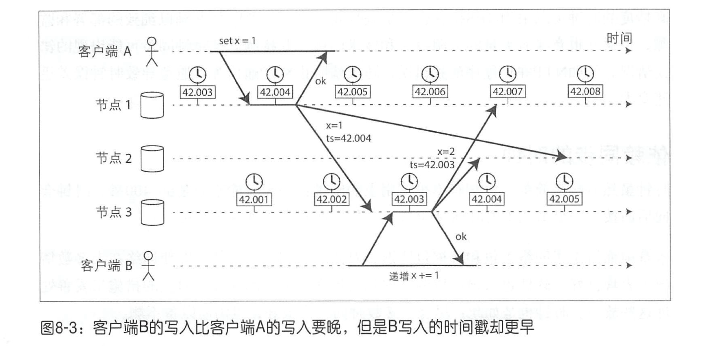
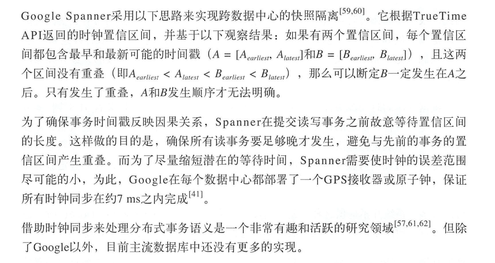
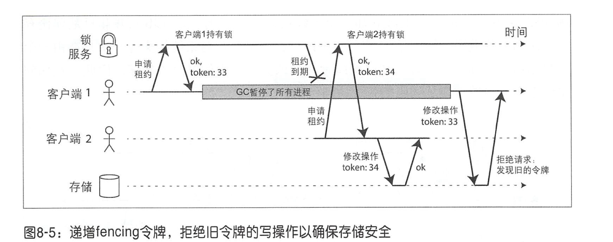

# 第八章：分布式系统的挑战

## 故障与部分失效

在分布式系统中，可能会出现系统的一部分工作正常，但其他某些部分出现难以预测的故障，我们称之为“部分失效”。

如果出现了问题，你可能会在应用堆栈的某个级别拿到了 一个关于错误的回复 ，但最好假定最终收不到任何错误报告。 接下来尝试重试（TCP重试是透明的， 但也可以在应用级别重试），等待超时之后，如果还是没有收到响应，则最终声明节点已经失效。

更好的做法是，超时设置并不是一个不变的常量，而是持续测量响应时间及其变化（抖动）， 然后根据最新的响应时间分布来自动调整。 可以用 Phi Accrual 故障检测器[30]完成，该检测器目前已在Akka 和 Cassandra[31]中使用 。TCP的重传超时也采用了类似的机制[27]。

### 延迟与资源利用率

如采资源总是静态分配（例如，专用硬件和预留带宽分自己），则某些环境下可以保证延迟的确定性。但是，这是以降低资源使用率为代价的，换句话说，其成本过于昂贵。而多租户、动态资源分配方式则可以提供更高的资源使用率，因而成本更低，当然也引入了可变延迟 的缺点 。

因此，网络中的可变延迟是成本与收益相互博弈的结果。


## 不可靠的时钟

网络上的每台机器都有自己的时钟硬件设备，通常是石英晶体振荡器。这些设备并非绝对准确， 即每台机器都维护自己本地的时间版本，可能比其他机器稍快或更慢。 可以在一定程度上同步机器之间的时钟， 最常用的方法也是网络时间协议 (Network Time Protocol , NTP），它可以根据一组专门的时间服务器来调整本地时间[37]，时间服务器则从精确更高的时间源（如GPS接收机）获取高精度时间。

### 单调时钟与墙上时钟

#### 墙上时钟

比如 Linux 的 clock_gettime（CLOCK_REALTIME) 和 Java 中的 System.currentTimeMillis() 会返回自纪元 1970年 1 月 1 日（ UTC ）以来的秒数和毫秒数，不含闰秒。

墙上时钟可以与NTP 同步。不太适合测量时间间隔[38] 。

#### 单调时钟

单调时钟更适合测量：持续时间段（时间间隔），例如超时或服务的响应时间：Linux 上的 clock_gettime（CLOCK_MONOTONIC）和  Java 中的 System.nanoTime() 返回的即是单调时钟。单调时钟的名字来源于它们保证总是向前（而不会出现墙上时钟的回拨现象）。

单调时钟的绝对值井没有任何意义，它可能是电脑启动以后经历的纳秒数或者其他含义。单调时钟不需要同步。

### 时钟同步与准确性

获取时钟的方法并非预想那样可靠或准确，硬件时钟和NTP可能会出现一些莫名其妙的现象，比如：

- 计算机中的石英钟不够精确，存在漂移现象（运行速度会加快或减慢）。时钟漂移主要取决于机器的温度。谷歌假设其服务器的时钟偏移为 200 ppm （百万分之一 ） [41]，相 当于如果每 30 秒与服务器重新同步一次，则可能出现的最大偏差为 6 毫秒，或者每天一次同步，则最大偏差为 17 秒。
- 如果时钟与 NTP 服务器的时钟差别太大，可能会出现拒绝同步，或者本地时钟将被强制重置[37]。在重置前后应用程序观察可能会看到时间突然倒退或突然跳跃的现象。
- 如果与 NTP 服务器连接失败（如防火墙），可能会很长一段时间没有留意到错误配置最终导致同步失败。
- 闰秒会产生一分钟为 59 秒或 61 秒的现象，这会在使一些对闰秒毫无防范的系统出现混乱[45]。而处理闰秒的推荐方式是，不管 NTP服务器具体如何实现 ，在NTP服务器汇报时间时故意做些调整 ，目的是在一天的周期内逐步调整闰秒 （称为拖尾 ）[47-49]。

### 依赖同步的时钟

如果应用需要精确同步的时钟，最好仔细监控所有节点上的时钟偏差。如果某个节点的时钟漂移超出上限， 应将其宣告为失效，并从集群中移除。这样的监控的目的是确保在造成重大影响之前尽早发现井处理问题。

#### 时间戳与事件顺序

跨节点的事件排序，如果它高度依赖时钟计时，就存在一定的技术风险。

比如下图中，节点 1 和节点 3 之间的时钟偏差小于 3ms。客户端 A 写入 x = 1 在客户端 B 写入 x = 2 之前发生，但是客户端 B 写入到节点 3 的时间戳却更早，因此当节点 2 收到这两个事件时，会根据时间戳错误地判断 x = 1 是最新值，然后决定丢弃 x = 2 ，就导致客户端 B 的增量操作丢失。



这种冲突解决策略被称为最后写入获胜（ LWW ），由于时钟的问题导致并不可靠。

逻辑时钟[56,57]是基于递增计数器，对于排序来说是更可靠的方式。逻辑时钟并不测量一天的某个时间点或时间间隔， 而是事件的相对顺序（事件发生的相对前后关系，例如数据复制写冲突，复制滞后问题）。与之对应的，墙上时钟和单调时钟都属于物理时钟。

#### 时钟的置信区间

我们不应该将时钟读数视为一个精确的时间点，而更应该视为带有置信区间的时间范围。例如，系统可能有95%的置信度认为目前时间介于 10.3 ~10.5 秒之间[58]。

Google Spanner 中的 TrueTime API[41] ，它会明确地报告本地时钟的置信区间。当查询当前时间时，你会得到两个值：[不早于，不晚于] 分别代表误差的最大偏差范围。基于上述两个时间戳，可以知道实际时间应在其范围之内。该间隔的范围主要取决于本地石英钟最后与高精时钟源同步后所经历的时间长短。

#### 全局快照的同步时钟

之前提到的全局快照，需要生成单调递增事务 ID。事务 ID 要求必须反映因果关系：事务 B 如果要读取事务 A 写入的值，则 B 的事务 ID 必须大于 A 的事务 ID ，否则快照将不一致。单机的事务 ID 很容易生成，但是当数据库分布在多台机器上（可能跨越多个数据中 心）时，则需要复杂的协调来产生全局的、单调递增的事务 ID （跨所有分区）。



> 还有一种分布式序列号生成器 ， 例如 Twitter 的 Snowflake ，它用更为扩展的方式来生成近似单调递增的唯一 ID 。 但通常无法保证与因果关系一致的顺序 。参考第九章的 “顺序保证”。

### 进程暂停

例子：假设数据库每个分区只有一个主节点，只有主节点可以接受写入。那么其他节点该如何确信该主节点没有被宣告失效，可以安全地写入呢？

一种思路是主节点从其他节点获得一个租约，类似一个带有超时的锁［63］。某一个时间只有一个节点可以拿到租约，某节点获得租约之后，在租约到期之前，它就是这段时间内的主节点。为了维持主节点的身份，节点必须在到期之前定期去更新租约 。如果节点发生了故障， 则续约失败，这样另一个节点到期之后就可以接管。

示例代码：

```java
while (true) {
  request = getIncomingRequest();
  // 确保租约还剩下至少 10 秒
  if (lease.expiryTimeMillis - System.currentTimeMillis() < 10000){
    lease = lease.renew();
  }

  if (lease.isValid()) {
    process(request);
  }
}
```

问题：

- 租约到期时间由另一台机器所设置，并与本地时钟进行比较。如果时钟之间有超过几秒的差异，那么就出问题。
- 如果程序出现了暂停，比如在执行 `lease.isValid()` 时用了 15 秒，那么当开始执行 `process(request)` 时租约已经过期了，此时主节点已经是其他节点了，它就不应该再执行请求了。

造成进程暂停的原因有很多，比如：虚拟机切换cpu调度；GC；IO 换页，休眠等导致的进程暂停，但线程无感知。

分布式系统中的一个节点必须假定，**执行过程中的任何时刻都可能被暂停相当长一段时间**，包括运行在某个函数中间 。暂停期间可能会一致将暂停的节点宣告为故障节点。最终，暂停的节点可能会回来继续运行，除非再次检查时钟，否则它对刚刚过去的暂停毫无意识。


## 知识，真相与谎言

本章到目前为止，已经探索了分布式系统与单节点程序的许多不同之处。例如，很少使用共享内存，通过不可靠网络传递消息且延迟不确定，可能遭受部分失效，不可靠的时钟以及进程暂停等。

### 真相由多数决定

单个节点不能根据自己的信息来判断自身的状态，分布式系统中一般使用多数投票算法来做决策，包括宣告某个节点失效与否。

### 主节点与锁

很多情况，我们需要在系统范围内只能有一个实例。比如防止脑裂等。

#### Fencing 令牌

假设每次锁服务在授予锁或租约时，还会同时返回一个fencing令牌，该令牌（数字）每授予一次就会递增（例如由锁服务增加） 。然后，要求客户端每次向存储系统发送写请求时，都必须包含所持有的 fencing 令牌。服务器可以根据令牌来拒绝过期的请求。

如下图所示，客户端 1 获取令牌 33，然后 GC 暂停了很久，租约到期，客户端 2 获取新令牌 34，向存储服务做修改。此时存储服务保存了最新的令牌 34， 之后再收到令牌 33 的修改操作时就会拒绝。



当使用 ZooKeeper 作为锁服务时， 可以用事务标识 zxid或节点版本 cversion 来充当 fencing 令牌。

### 拜占庭故障

fencing 令牌可以检测井阻止那些无意的误操作（例如节点并没有发现其租约已经过期）。但是，如果节点故意试图破坏系统，在发送消息时可以简单地伪造令牌即可。

如果节点存在“撒谎”的情况，例如，节点明明没有收到某条消息， 但却对外声称收到了，这种行为称为拜占庭故障，在这样不信任的环境中需要达成共识的问题也被称为拜占庭将军问题［77］。

如果某个系统中即使发生部分节点故障， 甚至不遵从协议， 或者恶意攻击 、干扰网络，但仍可继续正常运行，那么我们称之为拜占庭式容错系统。比如在航空航天领域 [81,82] 或者区块链领域 [83] 中都有实现。

但在本书中所讨论的系统基本不需要考虑拜占庭故障，因为大部分都是中心化的服务器来决定什么是可接受的客户端行为，什么是不允许的。去中心化的系统则必须考虑。

可以增加必要的机制来防范一些不那么恶意的谎言，比如：

- 由于硬件问题或操作系统、驱动程序 、路由器等方面的错误，导致网络数据包有时出现损坏。通常，可以借助 TCP/UDP 中内置的数据包校验和来发现这类问题，但有时他们会逃避检测 [85-87]。 此时，一个简单的防范措施是在应用层添加校验和。
- 对公众开放的应用必须仔细检查用户的所有输入。
- NTP客户端最好配置多个时间服务器。收到回应之后要评估时间偏差，使得多数服务器就一定的时间范围达成一致。


### 理论系统模型与现实

我们通过定义一些系统模型来形式化描述共识算法的前提条件。

计时方面的系统模型：

- 同步模型：假定网络延迟，进程暂停，时钟误差是有上限的。
- 部分同步模型：大部分情况下是同步模型，但有时会超过上限。
- 异步模型：一个算法不会对时机做任何的假设，甚至里面没有时钟（也没有超时机制）。

节点失效系统模型：

- 崩溃-中止模型：节点可能在任何时候失效，无法恢复。
- 崩溃-恢复模型：节点可能在任何时候失效，一段时间后恢复并再次响应，持久化数据不丢失，内存数据可能丢失。
- 拜占庭失效模型：节点可能发生任何事情，包括试图作弊和欺骗其他节点。

现实最普遍的是崩溃-恢复模型结合部分同步模型。


## 小结

本章讨论了分布式系统中可能发生的各种典型问题， 包括：延迟、时钟不同步和进程暂停。

部分失效可能是分布式系统的关键特征。

容忍错误：

1. 检测错误， 一般使用超时来检测，但是超时无法区分网络和节点故障。
2. 容忍失效，需要共识协议来做决策。


## 参考文献

1. Mark Cavage: Just No Getting Around It: You’re Building a Distributed System](http://queue.acm.org/detail.cfm?id=2482856),” *ACM Queue*, volume 11, number 4, pages 80-89, April 2013. [doi:10.1145/2466486.2482856](http://dx.doi.org/10.1145/2466486.2482856)
2. Jay Kreps: “[Getting Real About Distributed System Reliability](http://blog.empathybox.com/post/19574936361/getting-real-about-distributed-system-reliability),” *blog.empathybox.com*, March 19, 2012.
3. Sydney Padua: *The Thrilling Adventures of Lovelace and Babbage: The (Mostly) True Story of the First Computer*. Particular Books, April ISBN: 978-0-141-98151-2
4. Coda Hale: “[You Can’t Sacrifice Partition Tolerance](http://codahale.com/you-cant-sacrifice-partition-tolerance/),” *codahale.com*, October 7, 2010.
5. Jeff Hodges: “[Notes on Distributed Systems for Young Bloods](http://www.somethingsimilar.com/2013/01/14/notes-on-distributed-systems-for-young-bloods/),” *somethingsimilar.com*, January 14, 2013.
6. Antonio Regalado: “[Who Coined 'Cloud Computing’?](http://www.technologyreview.com/news/425970/who-coined-cloud-computing/),” *technologyreview.com*, October 31, 2011.
7. Luiz André Barroso, Jimmy Clidaras, and Urs Hölzle: “[The Datacenter as a Computer: An Introduction to the Design of Warehouse-Scale Machines, Second Edition](http://www.morganclaypool.com/doi/abs/10.2200/S00516ED2V01Y201306CAC024),” *Synthesis Lectures on Computer Architecture*, volume 8, number 3, Morgan & Claypool Publishers, July 2013.[doi:10.2200/S00516ED2V01Y201306CAC024](http://dx.doi.org/10.2200/S00516ED2V01Y201306CAC024), ISBN: 978-1-627-05010-4
8. David Fiala, Frank Mueller, Christian Engelmann, et al.: “[Detection and Correction of Silent Data Corruption for Large-Scale High-Performance Computing](http://moss.csc.ncsu.edu/~mueller/ftp/pub/mueller/papers/sc12.pdf),” at *International Conference for High Performance Computing, Networking, Storage and Analysis* (SC12), November 2012.
9. Arjun Singh, Joon Ong, Amit Agarwal, et al.: “[Jupiter Rising: A Decade of Clos Topologies and Centralized Control in Google’s Datacenter Network](http://conferences.sigcomm.org/sigcomm/2015/pdf/papers/p183.pdf),” at *Annual Conference of the ACM Special Interest Group on Data Communication* (SIGCOMM), August 2015. [doi:10.1145/2785956.2787508](http://dx.doi.org/10.1145/2785956.2787508)
10. Glenn K. Lockwood: “[Hadoop's Uncomfortable Fit in HPC](http://glennklockwood.blogspot.co.uk/2014/05/hadoops-uncomfortable-fit-in-hpc.html),” *glennklockwood.blogspot.co.uk*, May 16, 2014.
11. John von Neumann: “[Probabilistic Logics and the Synthesis of Reliable Organisms from Unreliable Components](https://ece.uwaterloo.ca/~ssundara/courses/prob_logics.pdf),” in *Automata Studies (AM-34)*, edited by Claude E. Shannon and John McCarthy, Princeton University Press, 1956. ISBN: 978-0-691-07916-5
12. Richard W. Hamming: *The Art of Doing Science and Engineering*. Taylor & Francis, 1997. ISBN: 978-9-056-99500-3
13. Claude E. Shannon: “[A Mathematical Theory of Communication](http://cs.brynmawr.edu/Courses/cs380/fall2012/shannon1948.pdf),” *The Bell System Technical Journal*, volume 27, number 3, pages 379–423 and 623–656, July 1948.
14. Peter Bailis and Kyle Kingsbury: “[The Network Is Reliable](https://queue.acm.org/detail.cfm?id=2655736),” *ACM Queue*, volume 12, number 7, pages 48-55, July 2014. [doi:10.1145/2639988.2639988](http://dx.doi.org/10.1145/2639988.2639988)
15. Joshua B. Leners, Trinabh Gupta, Marcos K. Aguilera, and Michael Walfish: “[Taming Uncertainty in Distributed Systems with Help from the Network](http://www.cs.nyu.edu/~mwalfish/papers/albatross-eurosys15.pdf),” at *10th European Conference on Computer Systems* (EuroSys), April 2015. [doi:10.1145/2741948.2741976](http://dx.doi.org/10.1145/2741948.2741976)
16. Phillipa Gill, Navendu Jain, and Nachiappan Nagappan: “[Understanding Network Failures in Data Centers: Measurement, Analysis, and Implications](http://conferences.sigcomm.org/sigcomm/2011/papers/sigcomm/p350.pdf),” at *ACM SIGCOMM Conference*, August 2011. [doi:10.1145/2018436.2018477](http://dx.doi.org/10.1145/2018436.2018477)
17. Mark Imbriaco: “[Downtime Last Saturday](https://github.com/blog/1364-downtime-last-saturday),” *github.com*, December 26, 2012.
18. Will Oremus: “[The Global Internet Is Being Attacked by Sharks, Google Confirms](http://www.slate.com/blogs/future_tense/2014/08/15/shark_attacks_threaten_google_s_undersea_internet_cables_video.html),” *slate.com*, August 15, 2014.
19. Marc A. Donges: “[Re: bnx2 cards Intermittantly Going Offline](http://www.spinics.net/lists/netdev/msg210485.html),” Message to Linux *netdev* mailing list, *spinics.net*, September 13, 2012.
20. Kyle Kingsbury: “[Call Me Maybe: Elasticsearch](https://aphyr.com/posts/317-call-me-maybe-elasticsearch),” *aphyr.com*, June 15, 2014.
21. Salvatore Sanfilippo: “[A Few Arguments About Redis Sentinel Properties and Fail Scenarios](http://antirez.com/news/80),” *antirez.com*, October 21, 2014.
22. Bert Hubert: “[The Ultimate SO_LINGER Page, or: Why Is My TCP Not Reliable](http://blog.netherlabs.nl/articles/2009/01/18/the-ultimate-so_linger-page-or-why-is-my-tcp-not-reliable),” *blog.netherlabs.nl*, January 18, 2009.
23. Nicolas Liochon: “[CAP: If All You Have Is a Timeout, Everything Looks Like a Partition](http://blog.thislongrun.com/2015/05/CAP-theorem-partition-timeout-zookeeper.html),” *blog.thislongrun.com*, May 25, 2015.
24. Jerome H. Saltzer, David P. Reed, and David D. Clark: “[End-To-End Arguments in System Design](http://www.ece.drexel.edu/courses/ECE-C631-501/SalRee1984.pdf),” *ACM Transactions on Computer Systems*, volume 2, number 4, pages 277–288, November 1984. [doi:10.1145/357401.357402](http://dx.doi.org/10.1145/357401.357402)
25. Matthew P. Grosvenor, Malte Schwarzkopf, Ionel Gog, et al.: “[Queues Don’t Matter When You Can JUMP Them!](https://www.usenix.org/system/files/conference/nsdi15/nsdi15-paper-grosvenor_update.pdf),” at *12th USENIX Symposium on Networked Systems Design and Implementation* (NSDI), May 2015.
26. Guohui Wang and T. S. Eugene Ng: “[The Impact of Virtualization on Network Performance of Amazon EC2 Data Center](http://www.cs.rice.edu/~eugeneng/papers/INFOCOM10-ec2.pdf),” at *29th IEEE International Conference on Computer Communications* (INFOCOM), March 2010. [doi:10.1109/INFCOM.2010.5461931](http://dx.doi.org/10.1109/INFCOM.2010.5461931)
27. Van Jacobson: “[Congestion Avoidance and Control](http://www.cs.usask.ca/ftp/pub/discus/seminars2002-2003/p314-jacobson.pdf),” at *ACM Symposium on Communications Architectures and Protocols* (SIGCOMM), August 1988. [doi:10.1145/52324.52356](http://dx.doi.org/10.1145/52324.52356)
28. Brandon Philips: “[etcd: Distributed Locking and Service Discovery](https://www.youtube.com/watch?v=HJIjTTHWYnE),” at *Strange Loop*, September 2014.
29. Steve Newman: “[A Systematic Look at EC2 I/O](http://blog.scalyr.com/2012/10/a-systematic-look-at-ec2-io/),” *blog.scalyr.com*, October 16, 2012.
30. Naohiro Hayashibara, Xavier Défago, Rami Yared, and Takuya Katayama: “[The ϕ Accrual Failure Detector](http://hdl.handle.net/10119/4784),” Japan Advanced Institute of Science and Technology, School of Information Science, Technical Report IS-RR-2004-010, May 2004.
31. Jeffrey Wang: “[Phi Accrual Failure Detector](http://ternarysearch.blogspot.co.uk/2013/08/phi-accrual-failure-detector.html),” *ternarysearch.blogspot.co.uk*, August 11, 2013.
32. Srinivasan Keshav: *An Engineering Approach to Computer Networking: ATM Networks, the Internet, and the Telephone Network*. Addison-Wesley Professional, May 1997. ISBN: 978-0-201-63442-6
33. Cisco, “[Integrated Services Digital Network](http://docwiki.cisco.com/wiki/Integrated_Services_Digital_Network),” *docwiki.cisco.com*.
34. Othmar Kyas: *ATM Networks*. International Thomson Publishing, 1995. ISBN: 978-1-850-32128-6
35. “[InfiniBand FAQ](http://www.mellanox.com/related-docs/whitepapers/InfiniBandFAQ_FQ_100.pdf),” Mellanox Technologies, December 22, 2014.
36. Jose Renato Santos, Yoshio Turner, and G. (John) Janakiraman: “[End-to-End Congestion Control for InfiniBand](http://www.hpl.hp.com/techreports/2002/HPL-2002-359.pdf),” at *22nd Annual Joint Conference of the IEEE Computer and Communications Societies* (INFOCOM), April 2003. Also published by HP Laboratories Palo Alto, Tech Report HPL-2002-359. [doi:10.1109/INFCOM.2003.1208949](http://dx.doi.org/10.1109/INFCOM.2003.1208949)
37. Ulrich Windl, David Dalton, Marc Martinec, and Dale R. Worley: “[The NTP FAQ and HOWTO](http://www.ntp.org/ntpfaq/NTP-a-faq.htm),” *ntp.org*, November 2006.
38. John Graham-Cumming: “[How and why the leap second affected Cloudflare DNS](https://blog.cloudflare.com/how-and-why-the-leap-second-affected-cloudflare-dns/),” *blog.cloudflare.com*, January 1, 2017.
39. David Holmes: “[Inside the Hotspot VM: Clocks, Timers and Scheduling Events – Part I – Windows](https://blogs.oracle.com/dholmes/entry/inside_the_hotspot_vm_clocks),” *blogs.oracle.com*, October 2, 2006.
40. Steve Loughran: “[Time on Multi-Core, Multi-Socket Servers](http://steveloughran.blogspot.co.uk/2015/09/time-on-multi-core-multi-socket-servers.html),” *steveloughran.blogspot.co.uk*, September 17, 2015.
41. James C. Corbett, Jeffrey Dean, Michael Epstein, et al.: “[Spanner: Google’s Globally-Distributed Database](http://research.google.com/archive/spanner.html),” at *10th USENIX Symposium on Operating System Design and Implementation* (OSDI), October 2012.
42. M. Caporaloni and R. Ambrosini: “[How Closely Can a Personal Computer Clock Track the UTC Timescale Via the Internet?](https://iopscience.iop.org/0143-0807/23/4/103/),” *European Journal of Physics*, volume 23, number 4, pages L17–L21, June 2012. [doi:10.1088/0143-0807/23/4/103](http://dx.doi.org/10.1088/0143-0807/23/4/103)
43. Nelson Minar: “[A Survey of the NTP Network](http://alumni.media.mit.edu/~nelson/research/ntp-survey99/),” *alumni.media.mit.edu*, December 1999.
44. Viliam Holub: “[Synchronizing Clocks in a Cassandra Cluster Pt. 1 – The Problem](https://blog.logentries.com/2014/03/synchronizing-clocks-in-a-cassandra-cluster-pt-1-the-problem/),” *blog.logentries.com*, March 14, 2014.
45. Poul-Henning Kamp: “[The One-Second War (What Time Will You Die?)](http://queue.acm.org/detail.cfm?id=1967009),” *ACM Queue*, volume 9, number 4, pages 44–48, April 2011. [doi:10.1145/1966989.1967009](http://dx.doi.org/10.1145/1966989.1967009)
46. Nelson Minar: “[Leap Second Crashes Half the Internet](http://www.somebits.com/weblog/tech/bad/leap-second-2012.html),” *somebits.com*, July 3, 2012.
47. Christopher Pascoe: “[Time, Technology and Leaping Seconds](http://googleblog.blogspot.co.uk/2011/09/time-technology-and-leaping-seconds.html),” *googleblog.blogspot.co.uk*, September 15, 2011.
48. Mingxue Zhao and Jeff Barr: “[Look Before You Leap – The Coming Leap Second and AWS](https://aws.amazon.com/blogs/aws/look-before-you-leap-the-coming-leap-second-and-aws/),” *aws.amazon.com*, May 18, 2015.
49. Darryl Veitch and Kanthaiah Vijayalayan: “[Network Timing and the 2015 Leap Second](http://crin.eng.uts.edu.au/~darryl/Publications/LeapSecond_camera.pdf),” at *17th International Conference on Passive and Active Measurement* (PAM), April 2016. [doi:10.1007/978-3-319-30505-9_29](http://dx.doi.org/10.1007/978-3-319-30505-9_29)
50. “[Timekeeping in VMware Virtual Machines](http://www.vmware.com/resources/techresources/238),” Information Guide, VMware, Inc., December 2011.
51. “[MiFID II / MiFIR: Regulatory Technical and Implementing Standards – Annex I (Draft)](https://www.esma.europa.eu/sites/default/files/library/2015/11/2015-esma-1464_annex_i_-_draft_rts_and_its_on_mifid_ii_and_mifir.pdf),” European Securities and Markets Authority, Report ESMA/2015/1464, September 2015.
52. Luke Bigum: “[Solving MiFID II Clock Synchronisation With Minimum Spend (Part 1)](https://www.lmax.com/blog/staff-blogs/2015/11/27/solving-mifid-ii-clock-synchronisation-minimum-spend-part-1/),” *lmax.com*, November 27, 2015.
53. Kyle Kingsbury: “[Call Me Maybe: Cassandra](https://aphyr.com/posts/294-call-me-maybe-cassandra/),” *aphyr.com*, September 24, 2013.
54. John Daily: “[Clocks Are Bad, or, Welcome to the Wonderful World of Distributed Systems](http://basho.com/clocks-are-bad-or-welcome-to-distributed-systems/),” *basho.com*, November 12, 2013.
55. Kyle Kingsbury: “[The Trouble with Timestamps](https://aphyr.com/posts/299-the-trouble-with-timestamps),” *aphyr.com*, October 12, 2013.
56. Leslie Lamport: “[Time, Clocks, and the Ordering of Events in a Distributed System](http://research.microsoft.com/en-US/um/people/Lamport/pubs/time-clocks.pdf),” *Communications of the ACM*, volume 21, number 7, pages 558–565, July 1978. [doi:10.1145/359545.359563](http://dx.doi.org/10.1145/359545.359563)
57. Sandeep Kulkarni, Murat Demirbas, Deepak Madeppa, et al.: “[Logical Physical Clocks and Consistent Snapshots in Globally Distributed Databases](http://www.cse.buffalo.edu/tech-reports/2014-04.pdf),” State University of New York at Buffalo, Computer Science and Engineering Technical Report 2014-04, May 2014.
58. Justin Sheehy: “[There Is No Now: Problems With Simultaneity in Distributed Systems](https://queue.acm.org/detail.cfm?id=2745385),” *ACM Queue*, volume 13, number 3, pages 36–41, March 2015. [doi:10.1145/2733108](http://dx.doi.org/10.1145/2733108)
59. Murat Demirbas: “[Spanner: Google's Globally-Distributed Database](http://muratbuffalo.blogspot.co.uk/2013/07/spanner-googles-globally-distributed_4.html),” *muratbuffalo.blogspot.co.uk*, July 4, 2013.
60. Dahlia Malkhi and Jean-Philippe Martin: “[Spanner's Concurrency Control](http://www.cs.cornell.edu/~ie53/publications/DC-col51-Sep13.pdf),” *ACM SIGACT News*, volume 44, number 3, pages 73–77, September 2013. [doi:10.1145/2527748.2527767](http://dx.doi.org/10.1145/2527748.2527767)
61. Manuel Bravo, Nuno Diegues, Jingna Zeng, et al.: “[On the Use of Clocks to Enforce Consistency in the Cloud](http://sites.computer.org/debull/A15mar/p18.pdf),” *IEEE Data Engineering Bulletin*, volume 38, number 1, pages 18–31, March 2015.
62. Spencer Kimball: “[Living Without Atomic Clocks](http://www.cockroachlabs.com/blog/living-without-atomic-clocks/),” *cockroachlabs.com*, February 17, 2016.
63. Cary G. Gray and David R. Cheriton:“[Leases: An Efficient Fault-Tolerant Mechanism for Distributed File Cache Consistency](http://web.stanford.edu/class/cs240/readings/89-leases.pdf),” at *12th ACM Symposium on Operating Systems Principles* (SOSP), December 1989. [doi:10.1145/74850.74870](http://dx.doi.org/10.1145/74850.74870)
64. Todd Lipcon: “[Avoiding Full GCs in Apache HBase with MemStore-Local Allocation Buffers: Part 1](http://blog.cloudera.com/blog/2011/02/avoiding-full-gcs-in-hbase-with-memstore-local-allocation-buffers-part-1/),” *blog.cloudera.com*, February 24, 2011.
65. Martin Thompson: “[Java Garbage Collection Distilled](http://mechanical-sympathy.blogspot.co.uk/2013/07/java-garbage-collection-distilled.html),” *mechanical-sympathy.blogspot.co.uk*, July 16, 2013.
66. Alexey Ragozin: “[How to Tame Java GC Pauses? Surviving 16GiB Heap and Greater](http://java.dzone.com/articles/how-tame-java-gc-pauses),” *java.dzone.com*, June 28, 2011.
67. Christopher Clark, Keir Fraser, Steven Hand, et al.: “[Live Migration of Virtual Machines](http://www.cl.cam.ac.uk/research/srg/netos/papers/2005-nsdi-migration.pdf),” at *2nd USENIX Symposium on Symposium on Networked Systems Design & Implementation* (NSDI), May 2005.
68. Mike Shaver: “[fsyncers and Curveballs](http://shaver.off.net/diary/2008/05/25/fsyncers-and-curveballs/),” *shaver.off.net*, May 25, 2008.
69. Zhenyun Zhuang and Cuong Tran: “[Eliminating Large JVM GC Pauses Caused by Background IO Traffic](https://engineering.linkedin.com/blog/2016/02/eliminating-large-jvm-gc-pauses-caused-by-background-io-traffic),” *engineering.linkedin.com*, February 10, 2016.
70. David Terei and Amit Levy: “[Blade: A Data Center Garbage Collector](http://arxiv.org/pdf/1504.02578.pdf),” arXiv:1504.02578, April 13, 2015.
71. Martin Maas, Tim Harris, Krste Asanović, and John Kubiatowicz: “[Trash Day: Coordinating Garbage Collection in Distributed Systems](https://timharris.uk/papers/2015-hotos.pdf),” at *15th USENIX Workshop on Hot Topics in Operating Systems* (HotOS), May 2015.
72. “[Predictable Low Latency](http://cdn2.hubspot.net/hubfs/1624455/Website_2016/content/White papers/Cinnober on GC pause free Java applications.pdf),” Cinnober Financial Technology AB, *cinnober.com*, November 24, 2013.
73. Martin Fowler: “[The LMAX Architecture](http://martinfowler.com/articles/lmax.html),” *martinfowler.com*, July 12, 2011.
74. Flavio P. Junqueira and Benjamin Reed: *ZooKeeper: Distributed Process Coordination*. O'Reilly Media, 2013. ISBN: 978-1-449-36130-3
75. Enis Söztutar: “[HBase and HDFS: Understanding Filesystem Usage in HBase](http://www.slideshare.net/enissoz/hbase-and-hdfs-understanding-filesystem-usage),” at *HBaseCon*, June 2013.
76. Caitie McCaffrey: “[Clients Are Jerks: AKA How Halo 4 DoSed the Services at Launch & How We Survived](http://caitiem.com/2015/06/23/clients-are-jerks-aka-how-halo-4-dosed-the-services-at-launch-how-we-survived/),” *caitiem.com*, June 23, 2015.
77. Leslie Lamport, Robert Shostak, and Marshall Pease: “[The Byzantine Generals Problem](http://research.microsoft.com/en-us/um/people/lamport/pubs/byz.pdf),” *ACM Transactions on Programming Languages and Systems* (TOPLAS), volume 4, number 3, pages 382–401, July 1982. [doi:10.1145/357172.357176](http://dx.doi.org/10.1145/357172.357176)
78. Jim N. Gray: “[Notes on Data Base Operating Systems](http://research.microsoft.com/en-us/um/people/gray/papers/DBOS.pdf),” in *Operating Systems: An Advanced Course*, Lecture Notes in Computer Science, volume 60, edited by R. Bayer, R. M. Graham, and G. Seegmüller, pages 393–481, Springer-Verlag, 1978. ISBN: 978-3-540-08755-7
79. Brian Palmer: “[How Complicated Was the Byzantine Empire?](http://www.slate.com/articles/news_and_politics/explainer/2011/10/the_byzantine_tax_code_how_complicated_was_byzantium_anyway_.html),” *slate.com*, October 20, 2011.
80. Leslie Lamport: “[My Writings](http://research.microsoft.com/en-us/um/people/lamport/pubs/pubs.html),” *research.microsoft.com*, December 16, 2014. This page can be found by searching the web for the 23-character string obtained by removing the hyphens from the string `allla-mport-spubso-ntheweb`.
81. John Rushby: “[Bus Architectures for Safety-Critical Embedded Systems](http://www.csl.sri.com/papers/emsoft01/emsoft01.pdf),” at *1st International Workshop on Embedded Software* (EMSOFT), October 2001.
82. Jake Edge: “[ELC: SpaceX Lessons Learned](http://lwn.net/Articles/540368/),” *lwn.net*, March 6, 2013.
83. Andrew Miller and Joseph J. LaViola, Jr.: “[Anonymous Byzantine Consensus from Moderately-Hard Puzzles: A Model for Bitcoin](http://nakamotoinstitute.org/static/docs/anonymous-byzantine-consensus.pdf),” University of Central Florida, Technical Report CS-TR-14-01, April 2014.
84. James Mickens: “[The Saddest Moment](https://www.usenix.org/system/files/login-logout_1305_mickens.pdf),” *USENIX ;login: logout*, May 2013.
85. Evan Gilman: “[The Discovery of Apache ZooKeeper’s Poison Packet](http://www.pagerduty.com/blog/the-discovery-of-apache-zookeepers-poison-packet/),” *pagerduty.com*, May 7, 2015.
86. Jonathan Stone and Craig Partridge: “[When the CRC and TCP Checksum Disagree](http://citeseerx.ist.psu.edu/viewdoc/download?doi=10.1.1.27.7611&rep=rep1&type=pdf),” at *ACM Conference on Applications, Technologies, Architectures, and Protocols for Computer Communication* (SIGCOMM), August 2000. [doi:10.1145/347059.347561](http://dx.doi.org/10.1145/347059.347561)
87. Evan Jones: “[How Both TCP and Ethernet Checksums Fail](http://www.evanjones.ca/tcp-and-ethernet-checksums-fail.html),” *evanjones.ca*, October 5, 2015.
88. Cynthia Dwork, Nancy Lynch, and Larry Stockmeyer: “[Consensus in the Presence of Partial Synchrony](http://www.net.t-labs.tu-berlin.de/~petr/ADC-07/papers/DLS88.pdf),” *Journal of the ACM*, volume 35, number 2, pages 288–323, April 1988. [doi:10.1145/42282.42283](http://dx.doi.org/10.1145/42282.42283)
89. Peter Bailis and Ali Ghodsi: “[Eventual Consistency Today: Limitations, Extensions, and Beyond](http://queue.acm.org/detail.cfm?id=2462076),” *ACM Queue*, volume 11, number 3, pages 55-63, March 2013. [doi:10.1145/2460276.2462076](http://dx.doi.org/10.1145/2460276.2462076)
90. Bowen Alpern and Fred B. Schneider: “[Defining Liveness](https://www.cs.cornell.edu/fbs/publications/DefLiveness.pdf),” *Information Processing Letters*, volume 21, number 4, pages 181–185, October 1985. [doi:10.1016/0020-0190(85)90056-0](http://dx.doi.org/10.1016/0020-0190(85)90056-0)
91. Flavio P. Junqueira: “[Dude, Where’s My Metadata?](http://fpj.me/2015/05/28/dude-wheres-my-metadata/),” *fpj.me*, May 28, 2015.
92. Scott Sanders: “[January 28th Incident Report](https://github.com/blog/2106-january-28th-incident-report),” *github.com*, February 3, 2016.
93. Jay Kreps: “[A Few Notes on Kafka and Jepsen](http://blog.empathybox.com/post/62279088548/a-few-notes-on-kafka-and-jepsen),” *blog.empathybox.com*, September 25, 2013.
94. Thanh Do, Mingzhe Hao, Tanakorn Leesatapornwongsa, et al.: “[Limplock: Understanding the Impact of Limpware on Scale-out Cloud Systems](http://ucare.cs.uchicago.edu/pdf/socc13-limplock.pdf),” at *4th ACM Symposium on Cloud Computing* (SoCC), October 2013. [doi:10.1145/2523616.2523627](http://dx.doi.org/10.1145/2523616.2523627)
95. Frank McSherry, Michael Isard, and Derek G. Murray: “[Scalability! But at What COST?](http://www.frankmcsherry.org/assets/COST.pdf),” at *15th USENIX Workshop on Hot Topics in Operating Systems* (HotOS), May 2015.