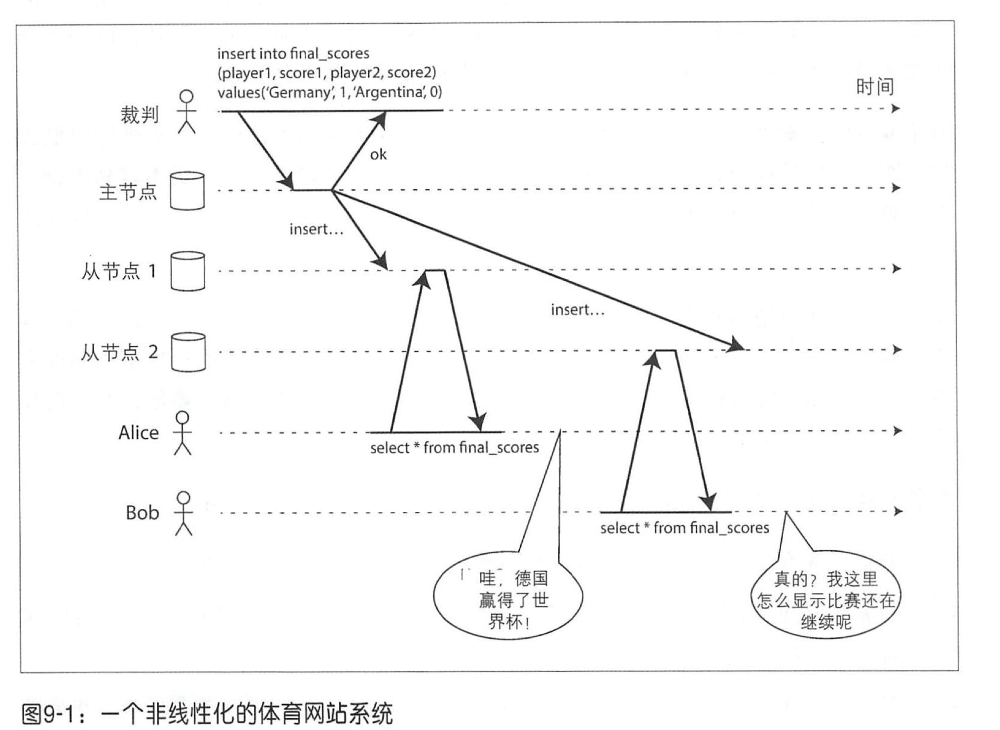
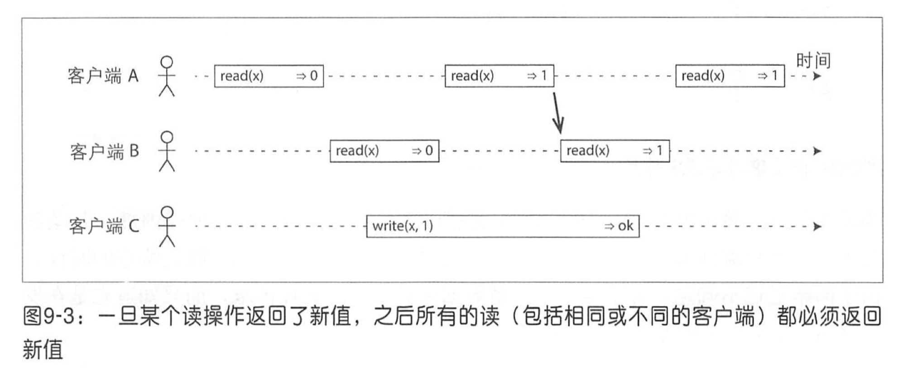
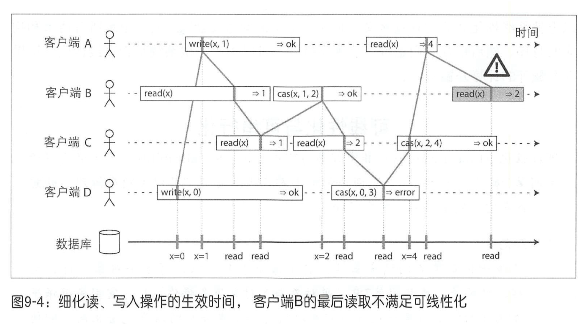
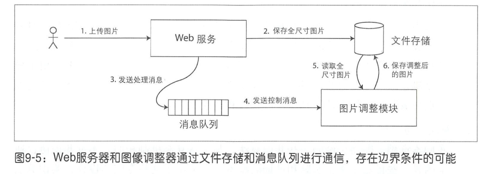
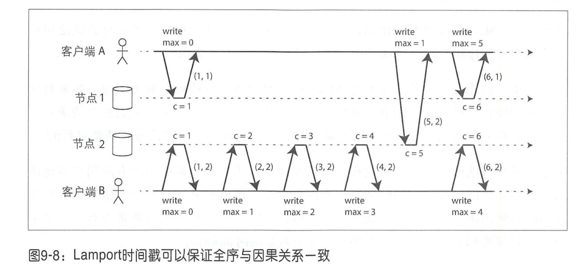
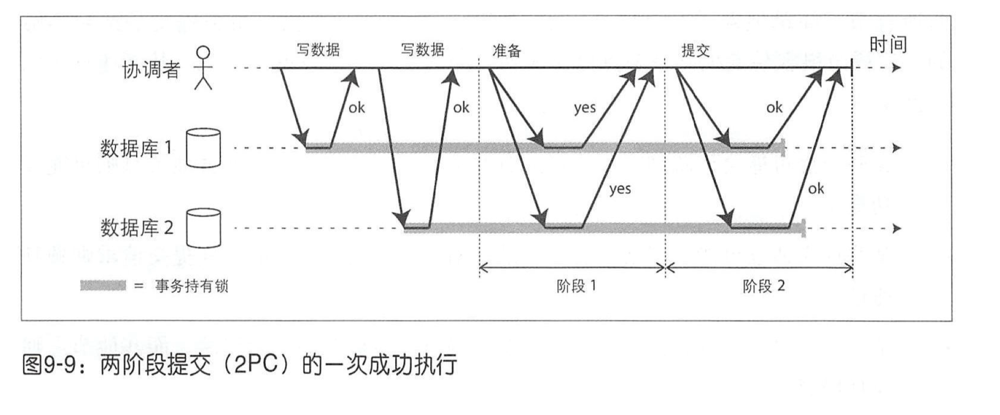
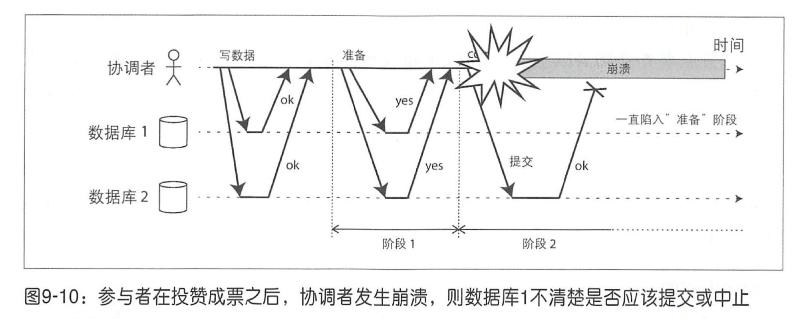

# 第九章：一致性与共识

## 可线性化

可线性化 [6]（也称为原子一致性 [7]，强一致性等 [8]）：让一个系统看起来好像只有一个数据副本， 且所有的操作都是原子的。

在一个可线性化的系统中， 一旦某个客户端成功提交写请求，所有客户端的读请求一定都能看到刚刚写入的值。这种看似单一副本的假象意味着它可以保证读取最近最新值，而不是过期的缓存。

上图 Bob 读到过期的结果，因此就不是线性化。

可线性化一个重要的约束：当一个客户端读取到最新值，则之后其他客户端读取到的都必须是新值（不一定是针对数据库，也可以是文件系统，kv存储等），如下图所示；

图 9-3 中的箭头表示时序依赖关系。客户端 A 首先读到新值 1，在 A 读取返回之后， B 开始读取，由于 B 的读取严格在 A 的读取之后发生，因此即使 C 的写入仍在进行之中，也必须返回 1。

另外，可线性化要求，如果连接这些标记的坚线，它们必须总是按时间箭头（从左到右）向前移动，而不能向后移动。这个要求确保了之前所讨论的就近性保证： 一旦新值被写入或读取，所有后续的读都看到的是最新的值，直到被再次覆盖。

上图中的 cas 是 compare and swap，即原子比较和设置。上图中客户端 B 的最后读取不满足可线性化，因为在 B 读取之前 A 已经读出 x = 4，所以 B 读取应该也是 4。

总结，可线性化：基本想法是让一个系统看起来只有一个数据副本，且当一个客户端读取到最新值，则之后其他客户端读取到的都必须是新值（不一定是针对数据库，也可以是文件系统，kv存储等），存在一条无分叉的时间线。

### 线性化的使用场景

- 加锁与主节点选举：比如 Zookeeper 和 etcd 都使用了支持容错的共识算法确保可线性化。来实现分布式锁和主节点选举。
- 约束与唯一性保证：硬性的唯一性约束， 常见如关系型数据库中主键的约束，需要线性化保证。
- 跨通道的时间依赖：如下图所示，web 服务器和调整模块之间存在两个不同的通信通道：文件存储器和消息队列。如果没有线性化的就近性保证，这两个通道之间存在竞争条件。消息队列可能比存储保存图片更快，这样图片调整模块可能读取的是旧版本或者读不到数据。

### 实现线性化系统

- 主从复制：部分支持可线性化。如果从主节点或者同步更新的从节点上读取，则可以满足线性化。但有些数据库采用了快照隔离的设计，或者实现时存在井发方面的bug [10]，就不满足可线性化。
- 共识算法：可线性化。
- 多主复制：不可线性化。
- 无主复制：可能不可线性化。

### 可线性化的代价

#### CAP

正式定义的 CAP 定理 [30] 范围很窄，它只考虑了一种一致性模型（即线性化）和一种故障（网络分区，节点仍处于活动状态但相互断开），而没有考虑网络延迟、节点失败或其他需要折中的情况。因此，尽管 CAP 在历史上具有重大的影响力，但对于一个具体的系统设计来说，它可能没有太大的实际价值 [9,40]。

分布式系统中还有很多有趣的研究结果 [41]，目前 CAP 已被更精确的研究成果所取代 [2,42]，所以它现在更多的是代表历史上曾经的一个关注热点而已。

> CAP 更准确的称呼应该是“网络分区情况下，选择一致还是可用 ”。

Attiya 和 Welch [47] 证明如果想要满足线性化， 那么读、写请求的响应时间至少要与网络中延迟成正比。 考虑到多数计算机网络高度不确定的网络延迟（参阅第7章 “超时与无限延迟”），线性化读写的性能势必非常差。 虽然没有足够快的线性化算法，但弱一致性模型的性能则快得多， 这种取舍对于延迟敏感的系统非常重要。

## 顺序保证

### 顺序与因果关系

因果关系对所发生的事件施加了某种排序：发送消息先于收到消息：问题出现在答案之前等。但因果顺序并非全序，而是偏序。

全序和偏序的差异也会体现在不同的数据库一致性模型中：

- 可线性化

在一个可线性化的系统中，存在全序操作关系。系统的行为就好像只有一个数据副本，且每个操作都是原子的，这意味着对于任何两个操作，我们总是可以指出哪个操作在先。

- 因果关系

如果两个操作都没有发生在对方之前，那么这两个操作是井发关系。换言之，如果两个事件是因果关系（ 一个发生在另一个之前），那么这两个事件可以被排序；而井发的事件则无法排序比较。这表明因果关系至少可以定义为偏序，而非全序。

在可线性化数据存储中不存在并发操作， 一定有一个时间线将所有操作都全序执行。单个时间轴，单个数据副本，没有并发。

#### 可线性化强于因果一致性

任何可线性化的系统都将正确地保证因果关系 [7]。 特别是如果系统存在多个通信通道（见图 9-5 中的消息队列和文件存储服务），可线性化确保了因果关系会自动全部保留，而不需要额外的工作（比如在不同组件之间的传递时间戳）。

因果一致性可以认为是，不会由于网络延迟而显著影响性能，又能对网络故障提供容错的最强的一致性模型 [2,42]。

### 序列号排序

可以使用序列号或时间戳来排序事件，时间戳可以只是一个逻辑时钟， 例如采用算法来产生一个数字序列用以识别操作，通常是递增的计数器。这样保证了全序关系。

#### Lamport时间戳

Lamport时间戳是一个值对（计数器，节点 ID）。计数器是已处理的请求数。

可以保证全序 ： 给定两个 Lamport 时间戳，计数器较大那个时间戳大；如计数器值正好相同，则节点 ID 越 大，时间戳越大。

每个节点以及每个客户端都跟踪迄今为止所见到的最大计数器值，井在每个请求中附带该最大计数器值。当节点收到某个请求（或者回复）时，如果发现请求内嵌的最大计数器值大于节点自身的计数器值，则它立即把自己的计数器修改为该最大值。

 Lamport 时间戳与版本向量的目的不同：版本向量用以区分两个操作是并发还是因果依赖，而Lamport时间戳则主要用于确保全序关系。即使 Lamport 时间戳与因果序一致，但根据其全序关系却无法区分两个操作属于并发关系，还是因果依赖关系 。 Lamport时间戳优于版本向量之处在于它更加紧凑和高效。

#### 时间戳排序依然不够

Lamport 时间戳问题的关键是，只有在收集了所有的请求信息之后，才能清楚这些请求之间的全序关系。 如果另一个节点执行了某些操作，但你无法知道那是什么，就无法构造出最终的请求序列。

要想知道什么时候全序关系已经确定就需要之后的“全序关系广播”。

### 全序关系广播

如前所述，主从复制首先确定某一个节点作为主节点，然后在主节点上顺序执行操作。接下来的主要挑战在于，如何扩展系统的吞吐量使之突破单一主节点的限制，以及如何处理主节点失效时的故障切换（参阅第5章“处理节点失效”）。在分布式系统研究文献中，这些问题被称为全序关系广播或者原子广播 [25,57,58]。

全序关系广播需要两个基本安全属性：

- 可靠发送 

  没有消息丢失，如果消息发送到了某一个节点，则它一定要发送到所有节点。

- 严格有序

  消息总是以相同的顺序发送给每个节点。

即使节点或网络出现了故障，全序关系广播算法的正确实现也必须保证上述两条。当然，网络中断时是不可能发送成功的，但算法要继续重试，直到最终网络修复，消息发送成功（且必须以正确的顺序发送）。

#### 使用全序关系广播

像 Zookeeper 和 etcd 这样的共识服务实际上就实现了序全关系广播。

用处：数据库复制（状态机复制），实现可串行化事务等，对于提供 fencing 令牌的锁服务也很有用。

#### 全序关系广播与线性化存储

全序关系广播是基于异步模型：保证消息以固定的顺序可靠地发送，但是不保证消息何时发送成功（因此某个接收者可能明显落后于其他接收者 ）。

而可线性化则强调就近性：读取时保证能够看到最新的写入值。

线性化的原子比较－设置（或自增 ）寄存器与全序关系广播二者都等价于共识问题［28,67］。

## 分布式事务与共识

有很多重要的场景都需要集群节点达成某种一致，比如：

- 主节点选举：对于主从复制的数据库，所有节点需要就谁来充当主节点达成一致。
- 原子事务提交：所有节点对事务的结果达成一致，要么全部成功提交，要么终止/回滚。

### 原子提交与两阶段提交

如果一部分节点提交了事务，而其他节点却放弃了事务，节点之间就会变得不一致。而且某个节点一旦提交了事务，即使事后发现其他节点发生中止，它也无法再撤销已提交的事务。

#### 两阶段提交

两阶段提交（ two-phase commit, 2PC ）是一种在多节点之间实现事务原子提交的算法，用来确保所有节点要么全部提交要么全部中止。它是分布式数据库中的经典算法之一 [13,35,75]。

2PC 引入了单节点事务所没有的一个新组件 ：协调者（也称为事务管理器）。

2PC 保证分布式原子性，但因为存在协调者，当协调者崩溃，各参与节点处于不确定状态，是否提交或回滚，所以不支持可终止性，不具备容错性。

### 实践中的分布式事务

#### XA

XA (eXtended Architecture, XA）是异构环境下实施两阶段提交的一个工业标准 [76,77]。XA并不是一个网络协议，而是一个与事务协调者进行通信的C API 。

#### 停顿时仍持有锁

数据库事务通常持有待修改行的行级独占锁，用以防止脏写。此外，如果要使用可串行化的隔离，则两阶段锁的数据库还会对事务曾经读取的行持有读－共享锁。因此如果协调者崩溃井且需要20分钟才能重启恢复，那么这些对象将被锁定20分钟；如果协调者的日志由于某种原因而彻底丢失，这些数据对象将永久处于加锁状态，至少管理员采用手动方式解决之前只能如此。

#### 从协调者故障中恢复

即使重启那些处于停顿状态的数据库节点也无法解决这个问题，这是由于 2PC 的正确实现要求即使发生了重启，也要继续保持重启之前事务的加锁（否则就会违背原子性保证）。唯一的出路只能是让管理员手动决定究竟是执行提交还是回滚。

许多 XA 的实现都支持某种紧急避险措施称之为启发式决策：这样参与者节点可以在紧急情况下单方面做出决定，放弃或者继续那些停顿的事务，而不需要等到协调者发出指令 [76,77,91]。

### 支持容错的共识

共识算法的性质：

- 协商一致性：所有节点都接受相同的决议。
- 诚实性：所有节点不能反悔，即对一项提议不能有两次决定。
- 合法性：如果决定了值v，则v一定是某个节点提出的。
- 可终止性：节点如果不崩溃则最终一定能达成决议；

可终止性引入了容错的思想。它重点强调一个共识算法不能原地空转，永远不做事情，换句话说，它必须取得实质性进展。即使某些节点出现了故障，其他节点也必须最终做出决定。可终止性属于一种活性，而另外三种则 属于安全性方面的属性。

而之前的两阶段提交就不支持可终止性和容错。

任何共识算法都需要至少大部分节点正确运行才能确保终止性 [67]。 而这个多数就可以安全地构成 quorum 。

#### 共识算法与全序广播

最著名的共识算法包括 VSR [94,95], Paxos [96-99], Raft [22, 100, 101], Zab [15, 21, 102]。

全序关系广播的要点是，消息按照相同的顺序发送到所有节点，有且只有一次 。

全序关系广播相当于持续的多轮共识（每一轮共识的决定对应于一条消息）：

- 由于协商一致性，所有节点决定以相同的顺序发送相同的消息。
- 由于诚实性，消息不能重复。
- 由于合法性，消息不会被破坏，也不是凭空捏造的。
- 由于可终止性，消息不会丢失。

#### 共识的局限性

主要包括：

- 节点投票的过程是一个同步复制过程。
- 共识体系需要严格的多数节点才能运行。如果由于网络故障切断了节点之间的连接，则只有多数节点所在的分区可以继续工作 ，剩下的少数节点分区则处于事实上的停顿状态。
- 多数共识算在是假定一组固定参与投票的节点集，即不能动态添加或删除节点。
- 共识系统通常依靠超时机制来检测节点失效。如果网络延迟比较大，那么可能会发生频繁的主节点选举，系统最终会花费更多的时间和资源在选举主节点上而不是原本的服务任务。

### 成员与协调服务

ZooKeeper 的实现其实模仿了 Google 的 Chubby 分布式锁服务 [14,98]，但它不仅实现了全序广播（因此实现了共识），还提供了以下特性：

- 线性化的原子操作。使用原子比较－设置操作，可以实现加锁服务。
- 操作全序。主要由全局递增的事务 ID zxid 和版本号 cversion 实现。
- 故障检测。通过交换心跳实现。
- 更改通知。订阅通知机制。

## 小结

线性化（一种流行的一 致性模型）：其目标是使多副本对外看起来好像是单一副本，然后所有操作以原子方式运行，就像一个单线程程序操作变量一样。主要问题在于性能，特别是在网络延迟较大的环境中。

因果关系对事件进行了某种排序（根据事件发生的原因结果依赖关系）。线性化是将所有操作都放在唯一的、全局有序时间线上，而因果性则不同，它为我们提供了一个弱一致性模型 ：允许存在某些井发事件，所以版本历史是一个包含多个分支与合井的时间线。因果一致性避免了线性化昂贵的协调开销，且对网络延迟的敏感性要低很多。

然而即使有了因果关系，还需要通过共识来查询其他节点是否存在竞争请求。

共识意味着就某一项提议，所有节点做出一致的决定，而且决定不可撤销。