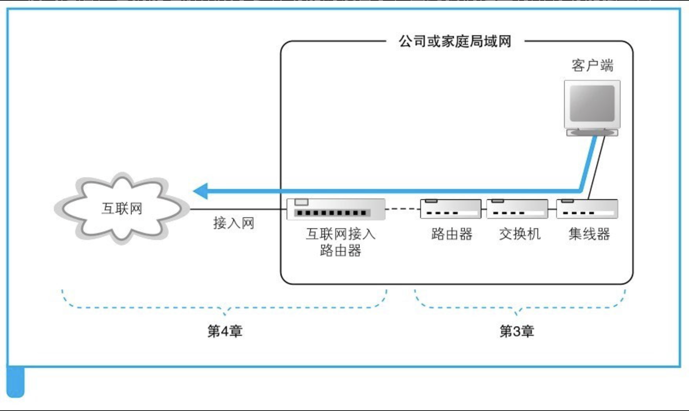
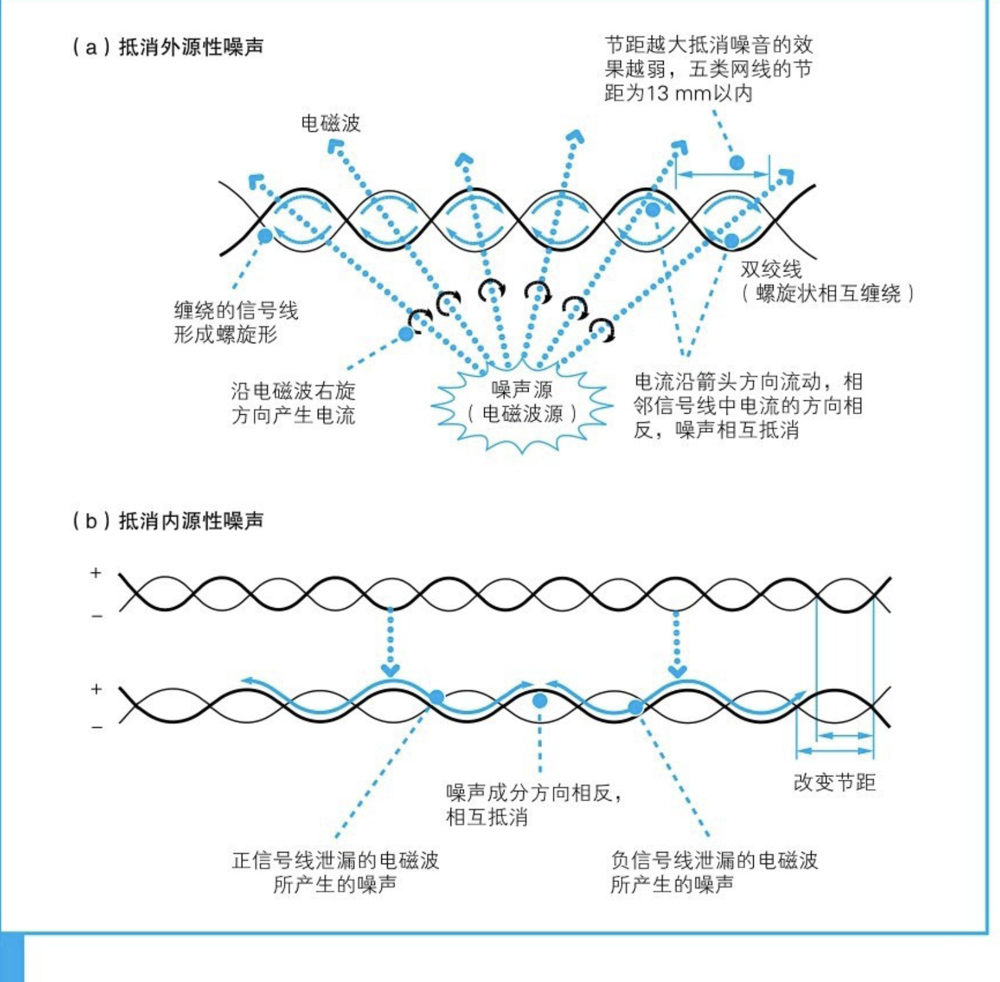
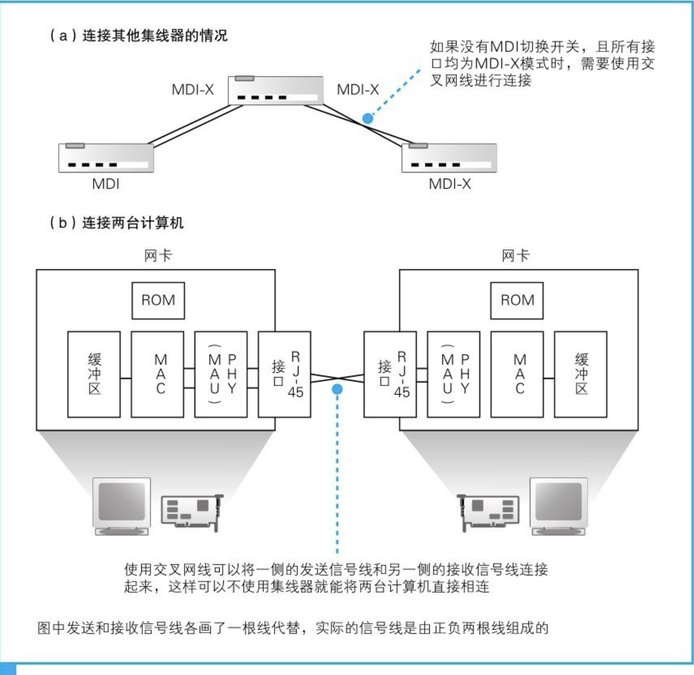

# 第三章：从网络到网络设备

## 3.1 信号在网线和集线器中传输

### 每个包都是独立传输的

从计算机发送出来的网络包会通过集线器、路由器等设备被转发，最终到达目的地。转发设备会根据包头部中的控制信息，在转发设备内部一个写有转发规则的表中进行查询，以此来判断包的目的地，然后将包朝目的地的方向进行转发。

局域网网线使用的是双绞线，其中“双绞”的意思就是以两根信号线为一组缠绕在一起，这种拧麻花一样的设计是为了抑制噪声的影响。

产生噪声的原因是网线周围的电磁波，当电磁波接触到金属等导体时，在其中就会产生电流。由于信号本身也是一种带有电压变化的电流，其本质和噪声产生的电流是一样的，所以信号和噪声的电流就会混杂在一起，导致信号的波形发生失真。

### 集线器将信号发往所有线路

集线器负责按照以太网的基本架构将信号广播出去。

集线器将信号发送给所有连接在它上面的线路。

## 3.2 交换机的包转发操作

交换机的设计是将网络包原样转发到目的地，交换机端口的MAC模块不具有MAC地址。交换机根据MAC地址表查找MAC地址，然后将信号发送到相应的端口。

### MAC 地址表的维护

维护操作分为两种：

- 收到包时，将发送方MAC地址以及其输入端口的号码写入MAC地址表中。
- 设备移动时，记录在表中几分钟都不使用就会删除。

交换机会自行更新或删除地址表中的记录，不需要手动维护。当地址表的内容出现异常时，只要重启一下交换机就可以重置地址表，也不需要手动进行维护。

### 特殊操作

- 交换机发现一个包要发回到原端口时，就会直接丢弃这个包。
- 地址表中找不到指定的MAC地址时，交换机，只能将包转发到除了源端口之外的所有端口上，无论该设备连接在哪个端口上都能收到这个包。这样做不会产生什么问题，因为以太网的设计本来就是将包发送到整个网络的，然后只有相应的接收者才接收包，而其他设备则会忽略这个包。目标设备会作出响应，只要返回了响应包，交换机就可以将它的地址写入地址表，下次也就不需要把包发到所有端口了。

### 全双工模式可以同时进行发送和接收

全双工模式是交换机特有的工作模式，它可以同时进行发送和接收操作，集线器不具备这样的特性。

在全双工模式下，无需等待其他信号结束就可以发送信号，因此它比半双工模式速度要快。由于双方可以同时发送数据，所以可同时传输的数据量也更大，性能也就更高。