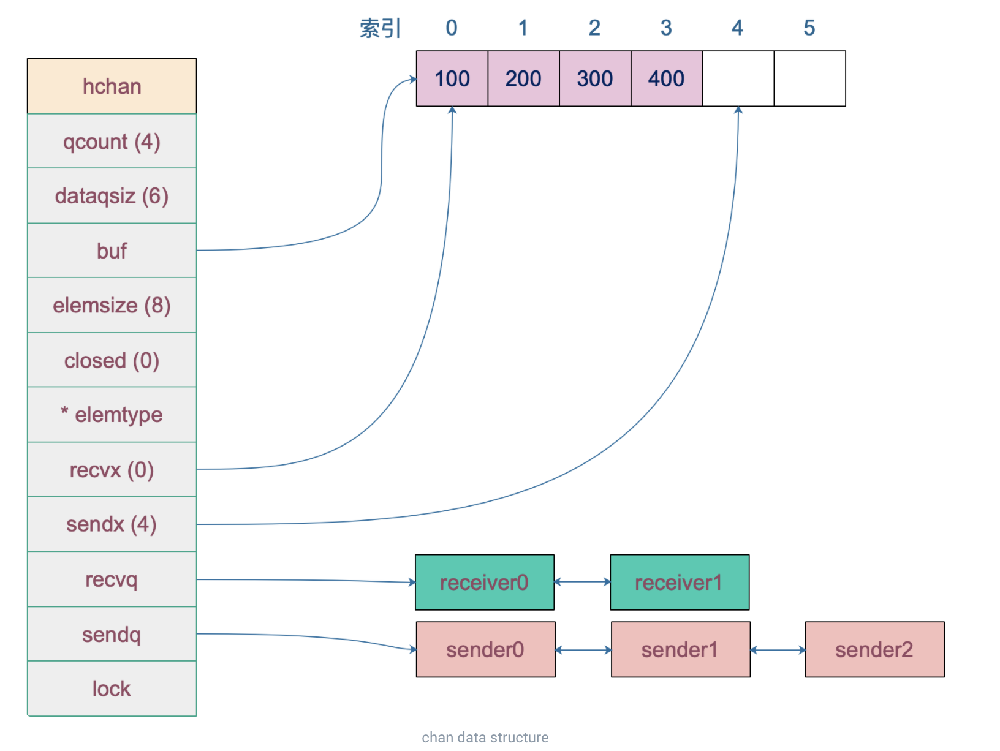
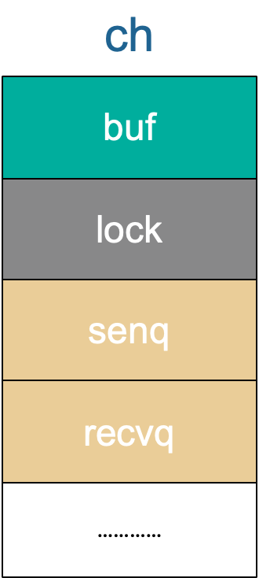
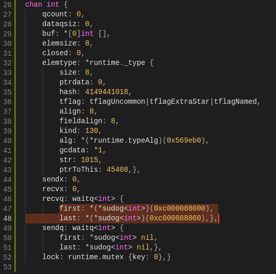
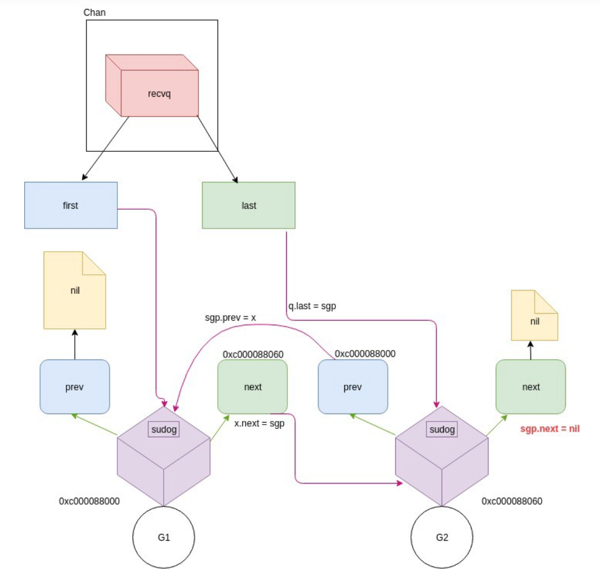
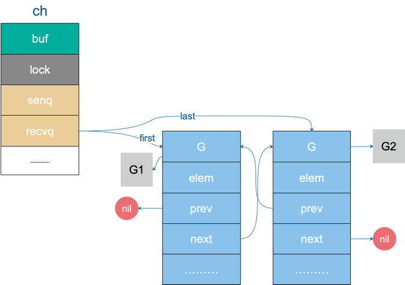
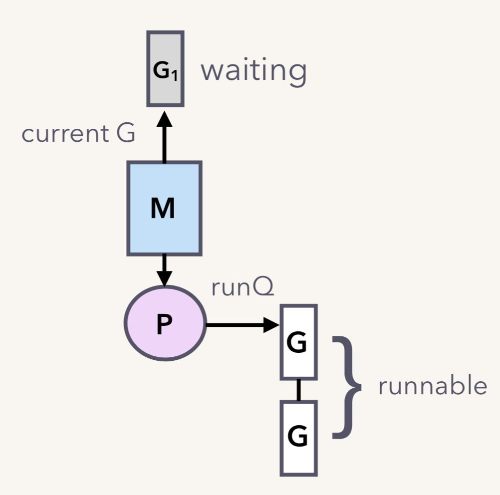
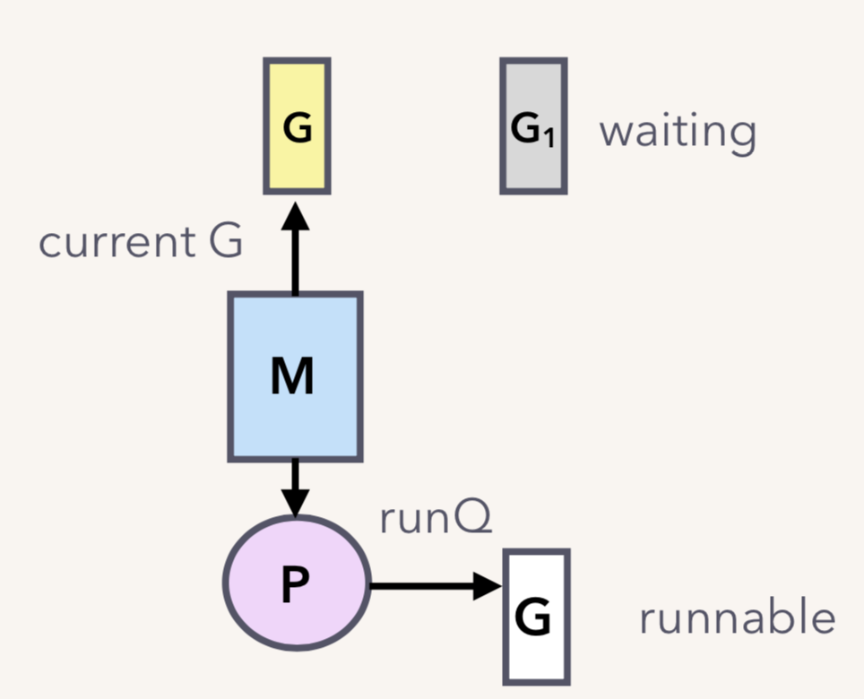
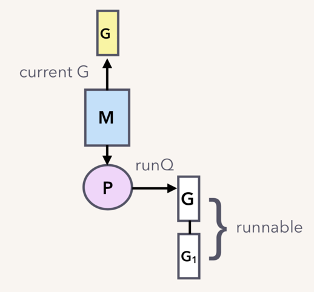
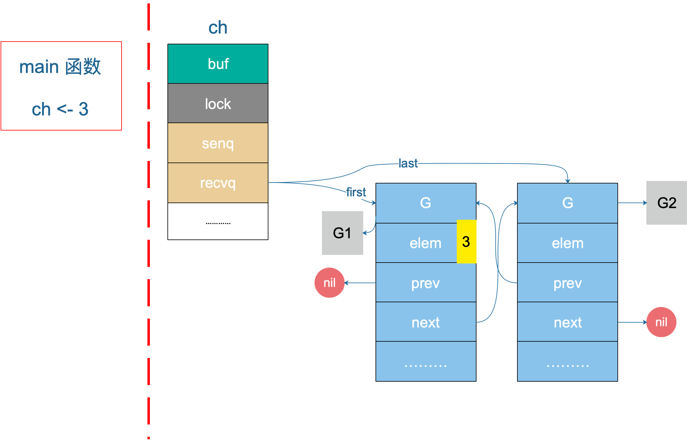
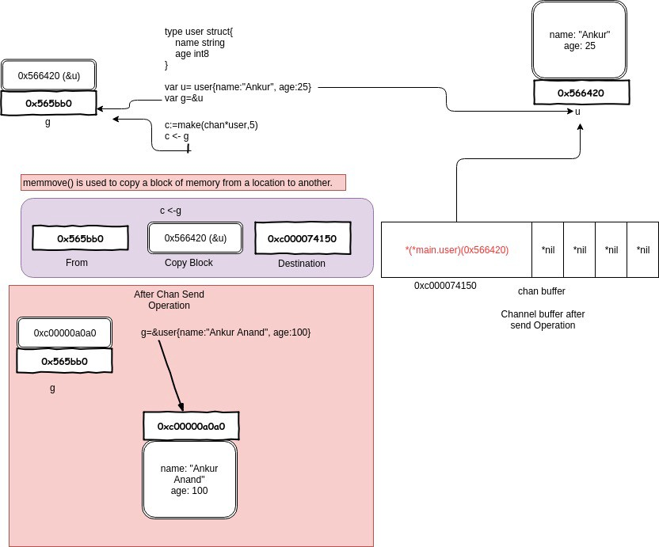

# Channel

## CSP

不要通过共享内存来通信，而要通过通信来实现内存共享。CSP 全称是 “Communicating Sequential Processes”。

## 数据结构

```go
type hchan struct {
    // chan 里元素数量
    qcount   uint
    // chan 底层循环数组的长度
    dataqsiz uint
    // 指向底层循环数组的指针
    // 只针对有缓冲的 channel
    buf      unsafe.Pointer
    // chan 中元素大小
    elemsize uint16
    // chan 是否被关闭的标志
    closed   uint32
    // chan 中元素类型
    elemtype *_type // element type
    // 已发送元素在循环数组中的索引
    sendx    uint   // send index
    // 已接收元素在循环数组中的索引
    recvx    uint   // receive index
    // 等待接收的 goroutine 队列
    recvq    waitq  // list of recv waiters
    // 等待发送的 goroutine 队列
    sendq    waitq  // list of send waiters

    // 保护 hchan 中所有字段
    lock mutex
}
```

`buf` 指向底层循环数组，只有缓冲型的 channel 才有。

`sendx`，`recvx` 均指向底层循环数组，表示当前可以发送和接收的元素位置索引值（相对于底层数组）。

`sendq`，`recvq` 分别表示被阻塞的 goroutine，这些 goroutine 由于尝试读取 channel 或向 channel 发送数据而被阻塞。

`waitq` 是 `sudog` 的一个双向链表，而 `sudog` 实际上是对 goroutine 的一个封装：

```go
type waitq struct {
    first *sudog
    last  *sudog
}
```

`lock` 用来保证每个读 channel 或写 channel 的操作都是原子的。

例如，创建一个容量为 6 的，元素为 int 型的 channel 数据结构如下 ：



### 创建

一般而言，使用 `make` 创建一个能收能发的通道：

```go
// 无缓冲通道
ch1 := make(chan int)
// 有缓冲通道
ch2 := make(chan int, 10)
```

最终创建 chan 的函数是 `makechan`：

```go
func makechan(t *chantype, size int64) *hchan
```

从函数原型来看，创建的 chan 是一个指针。所以我们能在函数间直接传递 channel，而不用传递 channel 的指针。

新建一个 chan 后，内存在堆上分配，大概长这样：


## Channel 接收数据的过程

```go
// 位于 src/runtime/chan.go

// chanrecv 函数接收 channel c 的元素并将其写入 ep 所指向的内存地址。
// 如果 ep 是 nil，说明忽略了接收值。
// 如果 block == false，即非阻塞型接收，在没有数据可接收的情况下，返回 (false, false)
// 否则，如果 c 处于关闭状态，将 ep 指向的地址清零，返回 (true, false)
// 否则，用返回值填充 ep 指向的内存地址。返回 (true, true)
// 如果 ep 非空，则应该指向堆或者函数调用者的栈

func chanrecv(c *hchan, ep unsafe.Pointer, block bool) (selected, received bool) {
    // 省略 debug 内容 …………

    // 如果是一个 nil 的 channel
    if c == nil {
        // 如果不阻塞，直接返回 (false, false)
        if !block {
            return
        }
        // 否则，接收一个 nil 的 channel，goroutine 挂起
        gopark(nil, nil, "chan receive (nil chan)", traceEvGoStop, 2)
        // 不会执行到这里
        throw("unreachable")
    }

    // 在非阻塞模式下，快速检测到失败，不用获取锁，快速返回
    // 当我们观察到 channel 没准备好接收：
    // 1. 非缓冲型，等待发送列队 sendq 里没有 goroutine 在等待
    // 2. 缓冲型，但 buf 里没有元素
    // 之后，又观察到 closed == 0，即 channel 未关闭。
    // 因为 channel 不可能被重复打开，所以前一个观测的时候 channel 也是未关闭的，
    // 因此在这种情况下可以直接宣布接收失败，返回 (false, false)
    if !block && (c.dataqsiz == 0 && c.sendq.first == nil ||
        c.dataqsiz > 0 && atomic.Loaduint(&c.qcount) == 0) &&
        atomic.Load(&c.closed) == 0 {
        return
    }

    var t0 int64
    if blockprofilerate > 0 {
        t0 = cputicks()
    }

    // 加锁
    lock(&c.lock)

    // channel 已关闭，并且循环数组 buf 里没有元素
    // 这里可以处理非缓冲型关闭 和 缓冲型关闭但 buf 无元素的情况
    // 也就是说即使是关闭状态，但在缓冲型的 channel，
    // buf 里有元素的情况下还能接收到元素
    if c.closed != 0 && c.qcount == 0 {
        if raceenabled {
            raceacquire(unsafe.Pointer(c))
        }
        // 解锁
        unlock(&c.lock)
        if ep != nil {
            // 从一个已关闭的 channel 执行接收操作，且未忽略返回值
            // 那么接收的值将是一个该类型的零值
            // typedmemclr 根据类型清理相应地址的内存
            typedmemclr(c.elemtype, ep)
        }
        // 从一个已关闭的 channel 接收，selected 会返回true
        return true, false
    }

    // 等待发送队列里有 goroutine 存在，说明 buf 是满的
    // 这有可能是：
    // 1. 非缓冲型的 channel
    // 2. 缓冲型的 channel，但 buf 满了
    // 针对 1，直接进行内存拷贝（从 sender goroutine -> receiver goroutine）
    // 针对 2，接收到循环数组头部的元素，并将发送者的元素放到循环数组尾部
    if sg := c.sendq.dequeue(); sg != nil {
        // Found a waiting sender. If buffer is size 0, receive value
        // directly from sender. Otherwise, receive from head of queue
        // and add sender's value to the tail of the queue (both map to
        // the same buffer slot because the queue is full).
        recv(c, sg, ep, func() { unlock(&c.lock) }, 3)
        return true, true
    }

    // 缓冲型，buf 里有元素，可以正常接收
    if c.qcount > 0 {
        // 直接从循环数组里找到要接收的元素
        qp := chanbuf(c, c.recvx)

        // …………

        // 代码里，没有忽略要接收的值，不是 "<- ch"，而是 "val <- ch"，ep 指向 val
        if ep != nil {
            typedmemmove(c.elemtype, ep, qp)
        }
        // 清理掉循环数组里相应位置的值
        typedmemclr(c.elemtype, qp)
        // 接收游标向前移动
        c.recvx++
        // 接收游标归零
        if c.recvx == c.dataqsiz {
            c.recvx = 0
        }
        // buf 数组里的元素个数减 1
        c.qcount--
        // 解锁
        unlock(&c.lock)
        return true, true
    }

    if !block {
        // 非阻塞接收，解锁。selected 返回 false，因为没有接收到值
        unlock(&c.lock)
        return false, false
    }

    // 接下来就是要被阻塞的情况了
    // 构造一个 sudog
    gp := getg()
    mysg := acquireSudog()
    mysg.releasetime = 0
    if t0 != 0 {
        mysg.releasetime = -1
    }

    // 待接收数据的地址保存下来
    mysg.elem = ep
    mysg.waitlink = nil
    gp.waiting = mysg
    mysg.g = gp
    mysg.selectdone = nil
    mysg.c = c
    gp.param = nil
    // 进入channel 的等待接收队列
    c.recvq.enqueue(mysg)
    // 将当前 goroutine 挂起
    goparkunlock(&c.lock, "chan receive", traceEvGoBlockRecv, 3)

    // 被唤醒了，接着从这里继续执行一些扫尾工作
    if mysg != gp.waiting {
        throw("G waiting list is corrupted")
    }
    gp.waiting = nil
    if mysg.releasetime > 0 {
        blockevent(mysg.releasetime-t0, 2)
    }
    closed := gp.param == nil
    gp.param = nil
    mysg.c = nil
    releaseSudog(mysg)
    return true, !closed
}
```


看例子：

```go
func goroutineA(a <-chan int) {
    val := <- a
    fmt.Println("G1 received data: ", val)
    return
}

func goroutineB(b <-chan int) {
    val := <- b
    fmt.Println("G2 received data: ", val)
    return
}

func main() {
    ch := make(chan int)
    go goroutineA(ch)
    go goroutineB(ch)
    ch <- 3
    time.Sleep(time.Second)
}
```

运行结果：

```shell
G2 received data:  3
```

多加几个 goroutine 会发生可能是头节点先接收或尾结点先接受到的情况。

channel 结构：



接着，第 15、16 行分别创建了一个 goroutine，各自执行了一个接收操作。通过前面的源码分析，我们知道，这两个 goroutine （后面称为 G1 和 G2 好了）都会被阻塞在接收操作。G1 和 G2 会挂在 channel 的 recq 队列中，形成一个双向循环链表。

在程序的 17 行之前，chan 的整体数据结构如下：



`buf` 指向一个长度为 0 的数组，qcount 为 0，表示 channel 中没有元素。重点关注 `recvq` 和 `sendq`，它们是 waitq 结构体，而 waitq 实际上就是一个双向链表，链表的元素是 sudog，里面包含 `g` 字段，`g` 表示一个 goroutine，所以 sudog 可以看成一个 goroutine。recvq 存储那些尝试读取 channel 但被阻塞的 goroutine，sendq 则存储那些尝试写入 channel，但被阻塞的 goroutine。

此时，我们可以看到，recvq 里挂了两个 goroutine，也就是前面启动的 G1 和 G2。因为没有 goroutine 接收，而 channel 又是无缓冲类型，所以 G1 和 G2 被阻塞。sendq 没有被阻塞的 goroutine。

`recvq` 的数据结构如下：



再从整体上来看一下 chan 此时的状态：



G1 和 G2 被挂起了，状态是 `WAITING`。假设我们只有一个 M，当 G1（`go goroutineA(ch)`） 运行到 `val := <- a` 时，它由本来的 running 状态变成了 waiting 状态（调用了 gopark 之后的结果）：



G1 脱离与 M 的关系，但调度器可不会让 M 闲着，所以会接着调度另一个 goroutine 来运行：



现在 G1 和 G2 都被挂起了，等待着一个 sender 往 channel 里发送数据，才能得到解救。

其实主要了解一下 channel 的内部数据结构以及接收数据过程即可。

## Channel 发送数据的过程

`sendDirect` 函数：

```go
// 向一个非缓冲型的 channel 发送数据、从一个无元素的（非缓冲型或缓冲型但空）的 channel
// 接收数据，都会导致一个 goroutine 直接操作另一个 goroutine 的栈
// 由于 GC 假设对栈的写操作只能发生在 goroutine 正在运行中并且由当前 goroutine 来写
// 所以这里实际上违反了这个假设。可能会造成一些问题，所以需要用到写屏障来规避
func sendDirect(t *_type, sg *sudog, src unsafe.Pointer) {
    // src 在当前 goroutine 的栈上，dst 是另一个 goroutine 的栈

    // 直接进行内存"搬迁"
    // 如果目标地址的栈发生了栈收缩，当我们读出了 sg.elem 后
    // 就不能修改真正的 dst 位置的值了
    // 因此需要在读和写之前加上一个屏障
    dst := sg.elem
    typeBitsBulkBarrier(t, uintptr(dst), uintptr(src), t.size)
    memmove(dst, src, t.size)
}
```

这里涉及到一个 goroutine 直接写另一个 goroutine 栈的操作，一般而言，不同 goroutine 的栈是各自独有的。而这也违反了 GC 的一些假设。为了不出问题，写的过程中增加了写屏障，保证正确地完成写操作。这样做的好处是减少了一次内存 copy：不用先拷贝到 channel 的 buf，直接由发送者到接收者，没有中间商赚差价，效率得以提高，完美。

还是上面那个例子，之前说到 G1 和 G2 现在被挂起来了，等待 sender 的解救。在第 17 行，主协程向 ch 发送了一个元素 3，来看下接下来会发生什么。

根据前面源码分析的结果，我们知道，sender 发现 ch 的 recvq 里有 receiver 在等待着接收，就会出队一个 sudog，把 recvq 里 first 指针的 sudo “推举”出来了，并将其加入到 P 的可运行 goroutine 队列中。

然后，sender 把发送元素拷贝到 sudog 的 elem 地址处，最后会调用 goready 将 G1 唤醒，状态变为 runnable。




当调度器光顾 G1 时，将 G1 变成 running 状态，执行 goroutineA 接下来的代码。G 表示其他可能有的 goroutine。

这里其实涉及到一个协程写另一个协程栈的操作。有两个 receiver 在 channel 的一边虎视眈眈地等着，这时 channel 另一边来了一个 sender 准备向 channel 发送数据，为了高效，用不着通过 channel 的 buf “中转”一次，直接从源地址把数据 copy 到目的地址就可以了，效率高啊！



上图是一个示意图，`3` 会被拷贝到 G1 栈上的某个位置，也就是 val 的地址处，保存在 elem 字段。

## 关闭 Channel

关闭某个 channel，会执行函数 `closechan`。close 逻辑比较简单，对于一个 channel，recvq 和 sendq 中分别保存了阻塞的发送者和接收者。关闭 channel 后，对于等待接收者而言，会收到一个相应类型的零值。对于等待发送者，会直接 panic。所以，在不了解 channel 还有没有接收者的情况下，不能贸然关闭 channel。

close 函数先上一把大锁，接着把所有挂在这个 channel 上的 sender 和 receiver 全都连成一个 sudog 链表，再解锁。最后，再将所有的 sudog 全都唤醒。唤醒之后，该干嘛干嘛。

##  操作 channel 的情况总结

总结一下操作 channel 的结果：

| 操作  | nil channel | closed channel     | not nil, not closed channel                                  |
| ----- | ----------- | ------------------ | ------------------------------------------------------------ |
| close | panic       | panic              | 正常                                                         |
| 读    | 阻塞        | 读到对应类型的零值 | 阻塞或正常读取数据。缓冲型 channel 为空或非缓冲型 channel 没有等待发送者时会阻塞 |
| 写    | 阻塞        | panic              | 阻塞或正常写入数据。非缓冲型 channel 没有等待接收者或缓冲型 channel buf 满时会被阻塞 |

总结一下，发生 panic 的情况有三种：向一个关闭的 channel 进行写操作；关闭一个 nil 的 channel；重复关闭一个 channel。

读、写一个 nil channel 都会被阻塞。


## 常见问题

### 从一个关闭的 channel 仍然能读出数据吗

从一个有缓冲的 channel 里读数据，当 channel 被关闭，依然能读出有效值。只有当返回的 ok 为 false 时，读出的数据才是无效的。

```go
func main() {
    ch := make(chan int, 5)
    ch <- 18
    close(ch)
    x, ok := <-ch
    if ok {
        fmt.Println("received: ", x)
    }

    x, ok = <-ch
    if !ok {
        fmt.Println("channel closed, data invalid.")
    }
}
```

运行结果：

```shell
received:  18
channel closed, data invalid.
```

先创建了一个有缓冲的 channel，向其发送一个元素，然后关闭此 channel。之后两次尝试从 channel 中读取数据，第一次仍然能正常读出值。第二次返回的 ok 为 false，说明 channel 已关闭，且通道里没有数据。

### 如何优雅地关闭 channel

关于 channel 的使用，有几点不方便的地方：

1. 在不改变 channel 自身状态的情况下，无法获知一个 channel 是否关闭。
2. 关闭一个 closed channel 会导致 panic。所以，如果关闭 channel 的一方在不知道 channel 是否处于关闭状态时就去贸然关闭 channel 是很危险的事情。
3. 向一个 closed channel 发送数据会导致 panic。所以，如果向 channel 发送数据的一方不知道 channel 是否处于关闭状态时就去贸然向 channel 发送数据是很危险的事情。

有一条广泛流传的关闭 channel 的原则：

> don't close a channel from the receiver side and don't close a channel if the channel has multiple concurrent senders.

不要从一个 receiver 侧关闭 channel，也不要在有多个 sender 时，关闭 channel。

比较好理解，向 channel 发送元素的就是 sender，因此 sender 可以决定何时不发送数据，并且关闭 channel。但是如果有多个 sender，某个 sender 同样没法确定其他 sender 的情况，这时也不能贸然关闭 channel。

但是上面所说的并不是最本质的，最本质的原则就只有一条：

> don't close (or send values to) closed channels.

有两个不那么优雅地关闭 channel 的方法：

1. 使用 defer-recover 机制，放心大胆地关闭 channel 或者向 channel 发送数据。即使发生了 panic，有 defer-recover 在兜底。
2. 使用 sync.Once 来保证只关闭一次。

例子：

```go
func SafeClose(ch chan T) (justClosed bool) {
    defer func() {
        if recover() != nil {
            justClosed = false
        }
    }()
    
    // assume ch != nil here.
    close(ch) // panic if ch is closed
    return true
}
```

```go
type MyChannel struct {
    C    chan T
    once sync.Once
}

func NewMyChannel() *MyChannel {
    return &MyChannel{C: make(chan T)}
}

func (mc *MyChannel) SafeClose() {
    mc.once.Do(func(){
        close(mc.C)
    })
}
```

```go
type MyChannel struct {
    C      chan T
    closed bool
    mutex  sync.Mutex
}

func NewMyChannel() *MyChannel {
    return &MyChannel{C: make(chan T)}
}

func (mc *MyChannel) SafeClose() {
    mc.mutex.Lock()
    if !mc.closed {
        close(mc.C)
        mc.closed = true
    }
    mc.mutex.Unlock()
}

func (mc *MyChannel) IsClosed() bool {
    mc.mutex.Lock()
    defer mc.mutex.Unlock()
    return mc.closed
}
```


那到底应该如何优雅地关闭 channel？

根据 sender 和 receiver 的个数，分下面几种情况：

1. 一个 sender，一个 receiver
2. 一个 sender， M 个 receiver
3. N 个 sender，一个 reciver
4. N 个 sender， M 个 receiver

对于 1，2，只有一个 sender 的情况就不用说了，直接从 sender 端关闭就好了，没有问题。重点关注第 3，4 种情况。

第 3 种情形下，优雅关闭 channel 的方法是：the only receiver says "please stop sending more" by closing an additional signal channel。

解决方案就是增加一个传递关闭信号的 channel，receiver 通过信号 channel 下达关闭数据 channel 指令。senders 监听到关闭信号后，停止接收数据。代码如下：

```go
func main() {
    rand.Seed(time.Now().UnixNano())

    const Max = 100000
    const NumSenders = 1000

    dataCh := make(chan int, 100)
    stopCh := make(chan struct{})

    // senders
    for i := 0; i < NumSenders; i++ {
        go func() {
            for {
                select {
                case <- stopCh:
                    return
                case dataCh <- rand.Intn(Max):
                }
            }
        }()
    }

    // the receiver
    go func() {
        for value := range dataCh {
            if value == Max-1 {
                fmt.Println("send stop signal to senders.")
                close(stopCh)
                return
            }

            fmt.Println(value)
        }
    }()

    select {
    case <- time.After(time.Hour):
    }
}
```

这里的 stopCh 就是信号 channel，它本身只有一个 sender，因此可以直接关闭它。senders 收到了关闭信号后，select 分支 “case <- stopCh” 被选中，退出函数，不再发送数据。

需要说明的是，上面的代码并没有明确关闭 dataCh。在 Go 语言中，对于一个 channel，如果最终没有任何 goroutine 引用它，不管 channel 有没有被关闭，最终都会被 gc 回收。所以，在这种情形下，所谓的优雅地关闭 channel 就是不关闭 channel，让 gc 代劳。

最后一种情况，优雅关闭 channel 的方法是：any one of them says "let's end the game" by notifying a moderator to close an additional signal channel。

和第 3 种情况不同，这里有 M 个 receiver，如果直接还是采取第 3 种解决方案，由 receiver 直接关闭 stopCh 的话，就会重复关闭一个 channel，导致 panic。因此需要增加一个中间人，M 个 receiver 都向它发送关闭 dataCh 的“请求”，中间人收到第一个请求后，就会直接下达关闭 dataCh 的指令（通过关闭 stopCh，这时就不会发生重复关闭的情况，因为 stopCh 的发送方只有中间人一个）。另外，这里的 N 个 sender 也可以向中间人发送关闭 dataCh 的请求。

```go
func main() {
    rand.Seed(time.Now().UnixNano())

    const Max = 100000
    const NumReceivers = 10
    const NumSenders = 1000

    dataCh := make(chan int, 100)
    stopCh := make(chan struct{})

    // It must be a buffered channel.
    toStop := make(chan string, 1)

    var stoppedBy string

    // moderator
    go func() {
        stoppedBy = <-toStop
        close(stopCh)
    }()

    // senders
    for i := 0; i < NumSenders; i++ {
        go func(id string) {
            for {
                value := rand.Intn(Max)
                if value == 0 {
                    select {
                    case toStop <- "sender#" + id:
                    default:
                    }
                    return
                }

                select {
                case <- stopCh:
                    return
                case dataCh <- value:
                }
            }
        }(strconv.Itoa(i))
    }

    // receivers
    for i := 0; i < NumReceivers; i++ {
        go func(id string) {
            for {
                select {
                case <- stopCh:
                    return
                case value := <-dataCh:
                    if value == Max-1 {
                        select {
                        case toStop <- "receiver#" + id:
                        default:
                        }
                        return
                    }

                    fmt.Println(value)
                }
            }
        }(strconv.Itoa(i))
    }

    select {
    case <- time.After(time.Hour):
    }

}
```

代码里 toStop 就是中间人的角色，使用它来接收 senders 和 receivers 发送过来的关闭 dataCh 请求。

这里将 toStop 声明成了一个 缓冲型的 channel。假设 toStop 声明的是一个非缓冲型的 channel，那么第一个发送的关闭 dataCh 请求可能会丢失。因为无论是 sender 还是 receiver 都是通过 select 语句来发送请求，如果中间人所在的 goroutine 没有准备好，那 select 语句就不会选中，直接走 default 选项，什么也不做。这样，第一个关闭 dataCh 的请求就会丢失。

如果，我们把 toStop 的容量声明成 Num(senders) + Num(receivers)，那发送 dataCh 请求的部分可以改成更简洁的形式：

```go
...
toStop := make(chan string, NumReceivers + NumSenders)
...
            value := rand.Intn(Max)
            if value == 0 {
                toStop <- "sender#" + id
                return
            }
...
                if value == Max-1 {
                    toStop <- "receiver#" + id
                    return
                }
...
```

直接向 toStop 发送请求，因为 toStop 容量足够大，所以不用担心阻塞，自然也就不用 select 语句再加一个 default case 来避免阻塞。

可以看到，这里同样没有真正关闭 dataCh，原样同第 3 种情况。

### Channel 发送和接收元素的本质是什么

Channel 发送和接收元素的本质是什么？

> All transfer of value on the go channels happens with the copy of value.

就是说 channel 的发送和接收操作本质上都是 “值的拷贝”，无论是从 sender goroutine 的栈到 chan buf，还是从 chan buf 到 receiver goroutine，或者是直接从 sender goroutine 到 receiver goroutine。

举一个例子：

```go
type user struct {
    name string
    age int8
}

var u = user{name: "Ankur", age: 25}
var g = &u

func modifyUser(pu *user) {
    fmt.Println("modifyUser Received Vaule", pu)
    pu.name = "Anand"
}

func printUser(u <-chan *user) {
    time.Sleep(2 * time.Second)
    fmt.Println("printUser goRoutine called", <-u)
}

func main() {
    c := make(chan *user, 5)
    c <- g
    fmt.Println(g)
    // modify g
    g = &user{name: "Ankur Anand", age: 100}
    go printUser(c)
    go modifyUser(g)
    time.Sleep(5 * time.Second)
    fmt.Println(g)
}
```

运行结果：

```shell
&{Ankur 25}
modifyUser Received Vaule &{Ankur Anand 100}
printUser goRoutine called &{Ankur 25}
&{Anand 100}
```

这里就是一个很好的 `share memory by communicating` 的例子。



一开始构造一个结构体 u，地址是 0x56420，图中地址上方就是它的内容。接着把 `&u` 赋值给指针 `g`，g 的地址是 0x565bb0，它的内容就是一个地址，指向 u。

main 程序里，先把 g 发送到 c，根据 `copy value` 的本质，进入到 chan buf 里的就是 `0x56420`，它是指针 g 的值（不是它指向的内容），所以打印从 channel 接收到的元素时，它就是 `&{Ankur 25}`。因此，这里并不是将指针 g “发送” 到了 channel 里，只是拷贝它的值而已。

再强调一次：

> Remember all transfer of value on the go channels happens with the copy of value.

### Channel 在什么情况下会引起资源泄漏

Channel 可能会引发 goroutine 泄漏。

泄漏的原因是 goroutine 操作 channel 后，处于发送或接收阻塞状态，而 channel 处于满或空的状态，一直得不到改变。同时，垃圾回收器也不会回收此类资源，进而导致 gouroutine 会一直处于等待队列中，不见天日。

另外，程序运行过程中，对于一个 channel，如果没有任何 goroutine 引用了，gc 会对其进行回收操作，不会引起内存泄漏。

### 关于 channel 的 happened-before 有哪些

维基百科上给的定义：

> In computer science, the happened-before relation (denoted: ->) is a relation between the result of two events, such that if one event should happen before another event, the result must reflect that, even if those events are in reality executed out of order (usually to optimize program flow).

简单来说就是如果事件 a 和事件 b 存在 happened-before 关系，即 a -> b，那么 a，b 完成后的结果一定要体现这种关系。由于现代编译器、CPU 会做各种优化，包括编译器重排、内存重排等等，在并发代码里，happened-before 限制就非常重要了。

根据晃岳攀老师在 Gopher China 2019 上的并发编程分享，关于 channel 的发送（send）、发送完成（send finished）、接收（receive）、接收完成（receive finished）的 happened-before 关系如下：

1. 第 n 个 `send` 一定 `happened before` 第 n 个 `receive finished`，无论是缓冲型还是非缓冲型的 channel。
2. 对于容量为 m 的缓冲型 channel，第 n 个 `receive` 一定 `happened before` 第 n+m 个 `send finished`。
3. 对于非缓冲型的 channel，第 n 个 `receive` 一定 `happened before` 第 n 个 `send finished`。
4. channel close 一定 `happened before` receiver 得到通知。

我们来逐条解释一下。

第一条，我们从源码的角度看也是对的，send 不一定是 `happened before` receive，因为有时候是先 receive，然后 goroutine 被挂起，之后被 sender 唤醒，send happened after receive。但不管怎样，要想完成接收，一定是要先有发送。

第二条，缓冲型的 channel，当第 n+m 个 send 发生后，有下面两种情况：

若第 n 个 receive 没发生。这时，channel 被填满了，send 就会被阻塞。那当第 n 个 receive 发生时，sender goroutine 会被唤醒，之后再继续发送过程。这样，第 n 个 `receive` 一定 `happened before` 第 n+m 个 `send finished`。

若第 n 个 receive 已经发生过了，这直接就符合了要求。

第三条，也是比较好理解的。第 n 个 send 如果被阻塞，sender goroutine 挂起，第 n 个 receive 这时到来，先于第 n 个 send finished。如果第 n 个 send 未被阻塞，说明第 n 个 receive 早就在那等着了，它不仅 happened before send finished，它还 happened before send。

第四条，回忆一下源码，先设置完 closed = 1，再唤醒等待的 receiver，并将零值拷贝给 receiver。

参考资料【鸟窝 并发编程分享】这篇博文的评论区有 PPT 的下载链接，这是晁老师在 Gopher 2019 大会上的演讲。

关于 happened before，这里再介绍一个柴大和曹大的新书《Go 语言高级编程》里面提到的一个例子。

书中 1.5 节先讲了顺序一致性的内存模型，这是并发编程的基础。

我们直接来看例子：

```go
var done = make(chan bool)
var msg string

func aGoroutine() {
    msg = "hello, world"
    done <- true
}

func main() {
    go aGoroutine()
    <-done
    println(msg)
}
```

先定义了一个 done channel 和一个待打印的字符串。在 main 函数里，启动一个 goroutine，等待从 done 里接收到一个值后，执行打印 msg 的操作。如果 main 函数中没有 `<-done` 这行代码，打印出来的 msg 为空，因为 aGoroutine 来不及被调度，还来不及给 msg 赋值，主程序就会退出。而在 Go 语言里，主协程退出时不会等待其他协程。

加了 `<-done` 这行代码后，就会阻塞在此。等 aGoroutine 里向 done 发送了一个值之后，才会被唤醒，继续执行打印 msg 的操作。而这在之前，msg 已经被赋值过了，所以会打印出 `hello, world`。

这里依赖的 happened before 就是前面讲的第一条。第一个 send 一定 happened before 第一个 receive finished，即 `done <- true` 先于 `<-done` 发生，这意味着 main 函数里执行完 `<-done` 后接着执行 `println(msg)` 这一行代码时，msg 已经被赋过值了，所以会打印出想要的结果。

进一步利用前面提到的第 3 条 happened before 规则，修改一下代码：

```go
var done = make(chan bool)
var msg string

func aGoroutine() {
    msg = "hello, world"
    <-done
}

func main() {
    go aGoroutine()
    done <- true
    println(msg)
}
```

同样可以得到相同的结果，为什么？根据第三条规则，对于非缓冲型的 channel，第一个 receive 一定 happened before 第一个 send finished。也就是说， 在 `done <- true` 完成之前，`<-done` 就已经发生了，也就意味着 msg 已经被赋上值了，最终也会打印出 `hello, world`。

### Channel 有哪些应用

与 timer 结合，一般有两种玩法：实现超时控制，实现定期执行某个任务。

有时候，需要执行某项操作，但又不想它耗费太长时间，上一个定时器就可以搞定：

```go
select {
    case <-time.After(100 * time.Millisecond):
    case <-s.stopc:
        return false
}
```

等待 100 ms 后，如果 s.stopc 还没有读出数据或者被关闭，就直接结束。这是来自 etcd 源码里的一个例子，这样的写法随处可见。

定时执行某个任务，也比较简单：

```go
func worker() {
    ticker := time.Tick(1 * time.Second)
    for {
        select {
        case <- ticker:
            // 执行定时任务
            fmt.Println("执行 1s 定时任务")
        }
    }
}
```


服务启动时，启动 n 个 worker，作为工作协程池，这些协程工作在一个 `for {}` 无限循环里，从某个 channel 消费工作任务并执行：

```go
func main() {
    taskCh := make(chan int, 100)
    go worker(taskCh)

    // 塞任务
    for i := 0; i < 10; i++ {
        taskCh <- i
    }

    // 等待 1 小时 
    select {
    case <-time.After(time.Hour):
    }
}

func worker(taskCh <-chan int) {
    const N = 5
    // 启动 5 个工作协程
    for i := 0; i < N; i++ {
        go func(id int) {
            for {
                task := <- taskCh
                fmt.Printf("finish task: %d by worker %d\n", task, id)
                time.Sleep(time.Second)
            }
        }(i)
    }
}
```

5 个工作协程在不断地从工作队列里取任务，生产方只管往 channel 发送任务即可，解耦生产方和消费方。

程序输出：

```shell
finish task: 1 by worker 4
finish task: 2 by worker 2
finish task: 4 by worker 3
finish task: 3 by worker 1
finish task: 0 by worker 0
finish task: 6 by worker 0
finish task: 8 by worker 3
finish task: 9 by worker 1
finish task: 7 by worker 4
finish task: 5 by worker 2
```


有时需要定时执行几百个任务，例如每天定时按城市来执行一些离线计算的任务。但是并发数又不能太高，因为任务执行过程依赖第三方的一些资源，对请求的速率有限制。这时就可以通过 channel 来控制并发数。

下面的例子来自《Go 语言高级编程》：

```go
var limit = make(chan int, 3)

func main() {
    // …………
    for _, w := range work {
        go func() {
            limit <- 1
            w()
            <-limit
        }()
    }
    // …………
}
```

构建一个缓冲型的 channel，容量为 3。接着遍历任务列表，每个任务启动一个 goroutine 去完成。真正执行任务，访问第三方的动作在 w() 中完成，在执行 w() 之前，先要从 limit 中拿“许可证”，拿到许可证之后，才能执行 w()，并且在执行完任务，要将“许可证”归还。这样就可以控制同时运行的 goroutine 数。

这里，`limit <- 1` 放在 func 内部而不是外部，原因是：

> 如果在外层，就是控制系统 goroutine 的数量，可能会阻塞 for 循环，影响业务逻辑。
>
> limit 其实和逻辑无关，只是性能调优，放在内层和外层的语义不太一样。

还有一点要注意的是，如果 w() 发生 panic，那“许可证”可能就还不回去了，因此需要使用 defer 来保证。