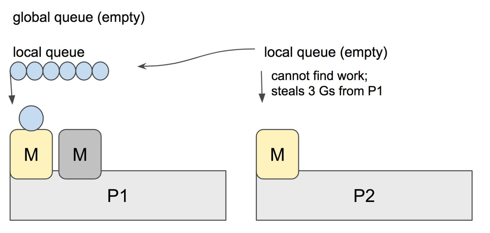

# 6. Go 并发调度

术语：

- G: **G**oroutine，即我们在 Go 程序中使用 `go` 关键字创建的执行体， goroutine；
- M: **M**achine，或 worker thread，即传统意义上的**线程（内核线程）**；
- P: **P**rocessor，即一种人为抽象的、用于执行 Go 代码被要求局部资源。只有当 M 与一个 P 关联后才能执行 Go 代码。除非 M 发生阻塞或在进行系统调用时间过长时，没有与之关联的 P。

Go调度器有两个不同的运行队列：

- GRQ，全局运行队列，尚未分配给 P 的 G
- LRQ，本地运行队列，每个 P 都有一个 LRQ，用于管理分配给 P 执行的 G

## 6.1 工作窃取式调度

Go scheduler 的职责就是将所有处于 runnable 的 goroutines 均匀分布到在 P 上运行的 M。

当一个 P 发现自己的 LRQ 已经没有 G 并且 GRQ 里也没有 G 时，会从其他 P “偷” 一些 G 来运行。看看这是什么精神！自己的工作做完了，为了全局的利益，主动为别人分担。这被称为 `Work-stealing`，Go 从 1.1 开始实现。

Go scheduler 使用 M:N 模型，在任一时刻，M 个 goroutines（G） 要分配到 N 个内核线程（M），这些 M 跑在个数最多为 GOMAXPROCS 的逻辑处理器（P）上。每个 M 必须依附于一个 P，每个 P 在同一时刻只能运行一个 M。如果 P 上的 M 阻塞了，那它就需要其他的 M 来运行 P 的 LRQ 里的 goroutines。


实际上，Go scheduler 每一轮调度要做的工作就是找到处于 runnable 的 goroutines，并执行它。找的顺序如下：

```go
runtime.schedule() {
    // only 1/61 of the time, check the global runnable queue for a G.
    // if not found, check the local queue.
    // if not found,
    //     try to steal from other Ps.
    //     if not, check the global runnable queue.
    //     if not found, poll network.
}
```

找到一个可执行的 goroutine 后，就会一直执行下去，直到被阻塞。

当 P2 上的一个 G 执行结束，它就会去 LRQ 获取下一个 G 来执行。如果 LRQ 已经空了，就是说本地可运行队列已经没有 G 需要执行，并且这时 GRQ 也没有 G 了。这时，P2 会随机选择一个 P（称为 P1），P2 会从 P1 的 LRQ “偷”过来一半的 G。



这样做的好处是，有更多的 P 可以一起工作，加速执行完所有的 G。

### M:N 模型

我们都知道，Go runtime 会负责 goroutine 的生老病死，从创建到销毁，都一手包办。Runtime 会在程序启动的时候，创建 M 个线程（CPU 执行调度的单位），之后创建的 N 个 goroutine 都会依附在这 M 个线程上执行。这就是 M:N 模型：


在同一时刻，一个线程上只能跑一个 goroutine。当 goroutine 发生阻塞（例如上篇文章提到的向一个 channel 发送数据，被阻塞）时，runtime 会把当前 goroutine 调度走，让其他 goroutine 来执行。目的就是不让一个线程闲着，榨干 CPU 的每一滴油水。


## 6.2 GPM 是什么

G、P、M 是 Go 调度器的三个核心组件，各司其职。在它们精密地配合下，Go 调度器得以高效运转，这也是 Go 天然支持高并发的内在动力。

### 数据结构

#### G 的结构

取 goroutine 的首字母，主要保存 goroutine 的一些状态信息以及 CPU 的一些寄存器的值，例如 IP 寄存器，以便在轮到本 goroutine 执行时，CPU 知道要从哪一条指令处开始执行。

当 goroutine 被调离 CPU 时，调度器负责把 CPU 寄存器的值保存在 g 对象的成员变量之中。

当 goroutine 被调度起来运行时，调度器又负责把 g 对象的成员变量所保存的寄存器值恢复到 CPU 的寄存器。

G 除了包含执行栈之外，还有很多与调试和 profiling 相关的字段。 一个 G 没有什么黑魔法，无非是将需要执行的函数参数进行了拷贝，保存了要执行的函数体的入口地址，用于执行。

#### M 的结构

取 machine 的首字母，它代表一个工作线程，或者说系统线程的实体。G 需要调度到 M 上才能运行，M 是真正工作的人。

当 M 没有工作可做的时候，在它休眠前，会“自旋”地来找工作。

#### P 的结构

取 processor 的首字母，为 M 的执行提供“上下文”，保存 M 执行 G 时的一些资源，例如本地可运行 G 队列，memeory cache 等。

P 只是处理器的抽象，而非处理器本身，它存在的意义在于实现工作窃取（work stealing）算法。 简单来说，每个 P 持有一个 G 的本地队列。

在没有 P 的情况下，所有的 G 只能放在一个全局的队列中。 当 M 执行完 G 而没有 G 可执行时，必须将队列锁住从而取值。

当引入了 P 之后，P 持有 G 的本地队列，而持有 P 的 M 执行完 G 后在 P 本地队列中没有 发现其他 G 可以执行时，虽然仍然会先检查全局队列、网络，但这时增加了一个从其他 P 的 队列偷取（steal）一个 G 来执行的过程。优先级为本地 > 全局 > 网络 > 偷取。


GPM 三足鼎力，共同成就 Go scheduler。G 需要在 M 上才能运行，M 依赖 P 提供的资源，P 则持有待运行的 G。你中有我，我中有你。

#### 调度器 `sched` 结构

调度器，所有 Goroutine 被调度的核心，存放了调度器持有的全局资源，访问这些资源需要持有锁：

- 管理了能够将 G 和 M 进行绑定的 M 队列
- 管理了空闲的 P 链表（队列）
- 管理了 G 的全局队列
- 管理了可被复用的 G 的全局缓存
- 管理了 defer 池

```go
type schedt struct {
	lock mutex

	pidle      puintptr	// 空闲 p 链表
	npidle     uint32	// 空闲 p 数量
	nmspinning uint32	// 自旋状态的 M 的数量
	runq       gQueue	// 全局 runnable G 队列
	runqsize   int32
	gFree struct {		// 有效 dead G 的全局缓存.
		lock    mutex
		stack   gList	// 包含栈的 Gs
		noStack gList	// 没有栈的 Gs
		n       int32
	}
	sudoglock  mutex	// sudog 结构的集中缓存
	sudogcache *sudog
	deferlock  mutex	// 不同大小的有效的 defer 结构的池
	deferpool  [5]*_defer
	
	...
}
```

Go scheduler 的核心思想是：

1. reuse threads；
2. 限制同时运行（不包含阻塞）的线程数为 N，N 等于 CPU 的核心数目；
3. 线程私有的 runqueues，并且可以从其他线程 stealing goroutine 来运行，线程阻塞后，可以将 runqueues 传递给其他线程。

为什么需要 P 这个组件，直接把 runqueues 放到 M 不行吗？

当一个线程阻塞的时候，将和它绑定的 P 上的 goroutines 转移到其他线程。

Go scheduler 会启动一个后台线程 sysmon，用来检测长时间（超过 10 ms）运行的 goroutine，将其调度到 global runqueues。这是一个全局的 runqueue，优先级比较低，以示惩罚。


关于 MPG，以下内容来自[《Go语言原本》](https://golang.design/under-the-hood/zh-cn/part2runtime/ch06sched/mpg/)

那么我们又应该如何设计一个通用且可扩展的调度器呢？我们很容易想到三种平凡的做法：

**设计 1: 集中式管理所有状态**

显然这种做法自然是不可取的，在多个并发实体之间集中管理所有状态这一共享资源，需要锁的支持， 当并发实体的数量增大时，将限制调度器的可扩展性。

**设计 2**: 每当需要就绪一个 G1 时，都让出一个 P，直接切换出 G2，再复始一个 M 来执行 G2。

因为复始的 M 可能在下一个瞬间又没有调度任务，则会发生线程颠簸（thrashing），进而我们又需要暂止这个线程。 另一方面，我们希望在相同的线程内保存维护 G，这种方式还会破坏计算的局部性原理。

**设计 3**: 任何时候当就绪一个 G、也存在一个空闲的 P 时，都复始一个额外的线程，不进行切换。

因为这个额外线程会在没有检查任何工作的情况下立即进行暂止，最终导致大量 M 的暂止和复始行为，产生大量开销。

基于以上考虑，目前的 Go 的调度器实现中设计了工作线程的**自旋（spinning）状态**：

1. 如果一个工作线程的本地队列、全局运行队列或网络轮询器（network poller）中均没有可调度的任务，则该线程成为自旋线程；
2. 满足该条件、被复始的线程也被称为自旋线程，对于这种线程，运行时不做任何事情。

自旋线程在进行暂止之前，会尝试从任务队列中寻找任务。当发现任务时，则会切换成非自旋状态， 开始执行 Goroutine。而找到不到任务时，则进行暂止。

当一个 Goroutine 准备就绪时，会首先检查自旋线程的数量，而不是去复始一个新的线程。

如果最后一个自旋线程发现工作并且停止自旋时，则复始一个新的自旋线程。 这个方法消除了不合理的线程复始峰值，且同时保证最终的最大 CPU 并行度利用率。

我们可以通过下图来直观理解工作线程的状态转换：

```
  如果存在空闲的 P，且存在暂止的 M，并就绪 G
          +------+
          v      |
执行 --> 自旋 --> 暂止
 ^        |
 +--------+
  如果发现工作
```

总的来说，调度器的方式可以概括为： **如果存在一个空闲的 P 并且没有自旋状态的工作线程 M，则当就绪一个 G 时，就复始一个额外的线程 M。** 这个方法消除了不合理的线程复始峰值，且同时保证最终的最大 CPU 并行度利用率。

这种设计的实现复杂性表现在进行自旋与非自旋线程状态转换时必须非常小心。 这种转换在提交一个新的 G 时发生竞争，最终导致任何一个工作线程都需要暂止对方。 如果双方均发生失败，则会以半静态 CPU 利用不足而结束调度。

因此，就绪一个 G 的通用流程为：

- 提交一个 G 到 per-P 的本地工作队列
- 执行 StoreLoad 风格的写屏障
- 检查 `sched.nmspinning` 数量

而从自旋到非自旋转换的一般流程为：

- 减少 `nmspinning` 的数量
- 执行 StoreLoad 风格的写屏障
- 在所有 per-P 本地任务队列检查新的工作

当然，此种复杂性在全局任务队列对全局队列并不适用的，因为当给一个全局队列提交工作时， 不进行线程的复始操作。

### 初始化

#### P 的初始化


通常情况下（在程序运行时不调整 P 的个数），P 只会在四种状态下进行切换。 当程序刚开始运行进行初始化时，所有的 P 都处于 `_Pgcstop` 状态， 随着 P 的初始化（`runtime.procresize`），会被置于 `_Pidle`。

当 M 需要运行时，会 `runtime.acquirep`，并通过 `runtime.releasep` 来释放。 当 G 执行时需要进入系统调用时，P 会被设置为 `_Psyscall`， 如果这个时候被系统监控抢夺（`runtime.retake`），则 P 会被重新修改为 `_Pidle`。 如果在程序运行中发生 GC，则 P 会被设置为 `_Pgcstop`， 并在 `runtime.startTheWorld` 时重新调整为 `_Pidle` 或者 `_Prunning`。

说明一下，上图省略了一些垃圾回收的状态。


#### G 的初始化


创建 G 的过程也是相对比较复杂的，我们来总结一下这个过程：

1. 首先尝试从 P 本地 gfree 链表或全局 gfree 队列获取已经执行过的 g
2. 初始化过程中程序无论是本地队列还是全局队列都不可能获取到 g，因此创建一个新的 g，并为其分配运行线程（执行栈），这时 g 处于 `_Gidle` 状态
3. 创建完成后，g 被更改为 `_Gdead` 状态，并根据要执行函数的入口地址和参数，初始化执行栈的 SP 和参数的入栈位置，并将需要的参数拷贝一份存入执行栈中
4. 根据 SP、参数，在 `g.sched` 中保存 SP 和 PC 指针来初始化 g 的运行现场
5. 将调用方、要执行的函数的入口 PC 进行保存，并将 g 的状态更改为 `_Grunnable`
6. 给 Goroutine 分配 id，并将其放入 P 本地队列的队头或全局队列（初始化阶段队列肯定不是满的，因此不可能放入全局队列）
7. 检查空闲的 P，将其唤醒，准备执行 G，但我们目前处于初始化阶段，主 Goroutine 尚未开始执行，因此这里不会唤醒 P。

值得一提的是，`newproc` 是由 `go:nosplit` 修饰的函数（见 [协作与抢占](https://golang.design/under-the-hood/zh-cn/part2runtime/ch06sched/preemption)）， 因此这个函数在执行过程中不会发生扩张和抢占，这个函数中的每一行代码都是深思熟虑过、确保能够在有限的栈空间内 完成执行。

### 小结

我们已经分析完了整个运行链条：`mcommoninit` –> `procresize` –> `newproc`。

在调度器的初始化过程中，首先通过 `mcommoninit` 对 M 的信号 G 进行初始化。 而后通过 `procresize` 创建与 CPU 核心数 (或与用户指定的 GOMAXPROCS) 相同的 P。 最后通过 `newproc` 创建包含可以运行要执行函数的执行栈、运行的 G，并将创建的 G 放入刚创建好的 P 的本地可运行队列（第一个入队的 G，也就是主 Goroutine 要执行的函数体）， 完成 G 的创建。

调度器的设计还是相当巧妙的。它通过引入一个 P，巧妙的减缓了全局锁的调用频率，进一步压榨了机器的性能。 Goroutine 本身也不是什么黑魔法，运行时只是将其作为一个需要运行的入口地址保存在了 G 中， 同时对调用的参数进行了一份拷贝。我们说 P 是处理器自身的抽象，但 P 只是一个纯粹的概念。相反，M 才是运行代码的真身。


同时可参考

[[典藏版] Golang 调度器 GMP 原理与调度全分析](https://learnku.com/articles/41728)


## 题

1. 为什么 go 的本地队列 size 是 256 呢？

参考：

256 run queue size is designed for the work-steal scheduler to prevent false sharing.

128 run queue size exactly fits one cache line. Since the run queue can be stolen half of the run queue from the tail by other Ps, 256 run queue size prevents false sharing when the work-steal happens on different cores.


作为缓存，本地g队列因为无锁所以应该是越大越好，比方说1<<10或者直接1<<16，这样g多的p关联到的m效率超高。

但是也有问题，本地g队列大了那么存g数量多了，全局g队列里面的g就少了甚至没有，运气不好的p所关联到的m只能去偷，但是偷的效率不高。

这样结局就是多核cpu中有几个核在那空转，这个违背了公平调度的原则。

我们平时把多余的钱存银行或者基金，身上只保留有限的钞票，没钱的人可以去银行或者基金借而不是去偷我的钱，其实我也没钱。如果没有银行那么当我们钱花光了只能自旋等死，为了生存我们只能组队夜里潜入马云家里，谁叫他富的流油。

也可以小一点，比如128、64或更小，这个golang团队会在公平和效率直接做个妥协然后脑门一拍得出个经验值，那行那就256吧。