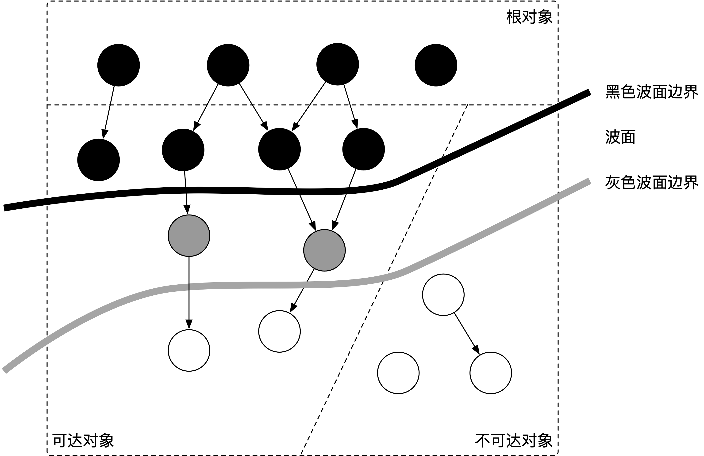
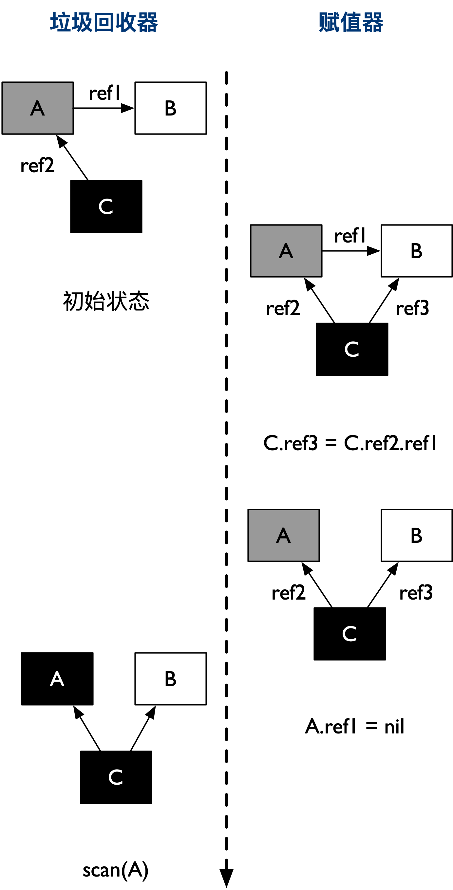
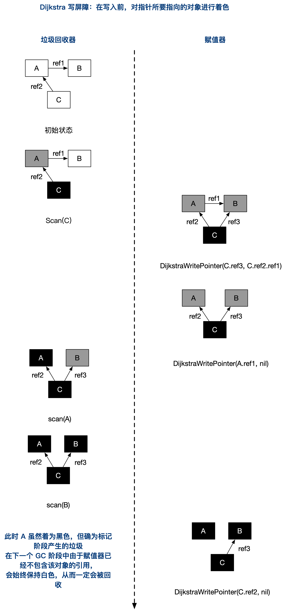
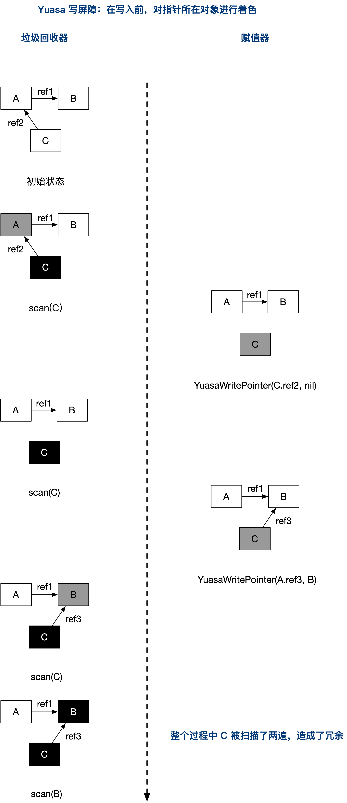
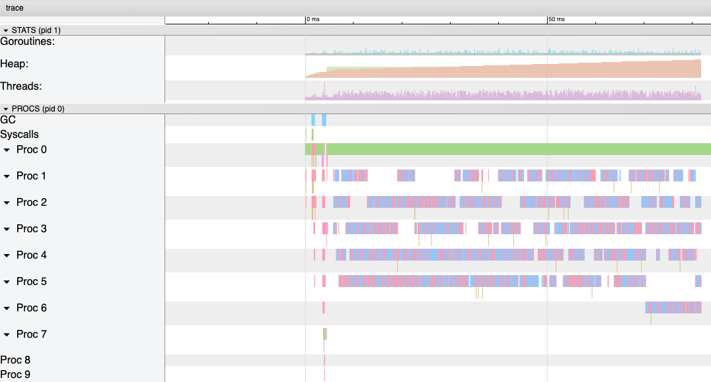
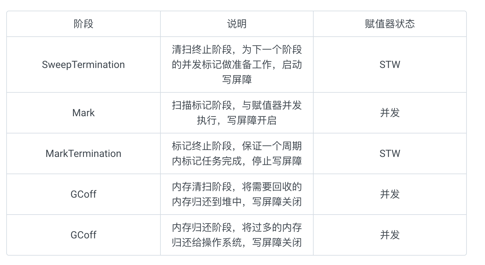
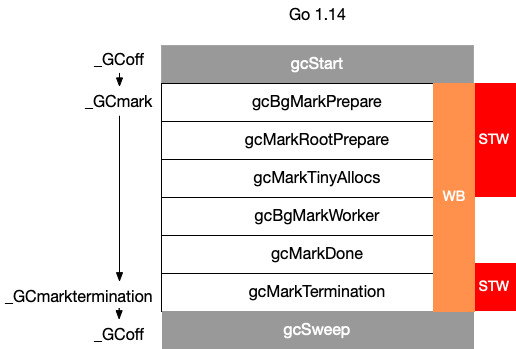

# 垃圾回收

## GC 的认识

### 什么是 GC，有什么作用？

`GC`，全称 `Garbage Collection`，即垃圾回收，是一种自动内存管理的机制。

当程序向操作系统申请的内存不再需要时，垃圾回收主动将其回收并供其他代码进行内存申请时候复用，或者将其归还给操作系统，这种针对内存级别资源的自动回收过程，即为垃圾回收。而负责垃圾回收的程序组件，即为垃圾回收器。

垃圾回收其实一个完美的 “Simplicity is Complicated” 的例子。一方面，程序员受益于 GC，无需操心、也不再需要对内存进行手动的申请和释放操作，GC 在程序运行时自动释放残留的内存。另一方面，GC 对程序员几乎不可见，仅在程序需要进行特殊优化时，通过提供可调控的 API，对 GC 的运行时机、运行开销进行把控的时候才得以现身。

通常，垃圾回收器的执行过程被划分为两个半独立的组件：

- 赋值器（Mutator）：这一名称本质上是在指代用户态的代码。因为对垃圾回收器而言，用户态的代码仅仅只是在修改对象之间的引用关系，也就是在对象图（对象之间引用关系的一个有向图）上进行操作。
- 回收器（Collector）：负责执行垃圾回收的代码。

### 根对象到底是什么？

根对象在垃圾回收的术语中又叫做根集合，它是垃圾回收器在标记过程时最先检查的对象，包括：

1. 全局变量：程序在编译期就能确定的那些存在于程序整个生命周期的变量。
2. 执行栈：每个 goroutine 都包含自己的执行栈，这些执行栈上包含栈上的变量及指向分配的堆内存区块的指针。
3. 寄存器：寄存器的值可能表示一个指针，参与计算的这些指针可能指向某些赋值器分配的堆内存区块。

### 常见的 GC 实现方式有哪些？Go 语言的 GC 使用的是什么？

所有的 GC 算法其存在形式可以归结为追踪（Tracing）和引用计数（Reference Counting）这两种形式的混合运用。

- 追踪式 GC

  从根对象出发，根据对象之间的引用信息，一步步推进直到扫描完毕整个堆并确定需要保留的对象，从而回收所有可回收的对象。Go、 Java、V8 对 JavaScript 的实现等均为追踪式 GC。

- 引用计数式 GC

  每个对象自身包含一个被引用的计数器，当计数器归零时自动得到回收。因为此方法缺陷较多，在追求高性能时通常不被应用。Python、Objective-C 等均为引用计数式 GC。

目前比较常见的 GC 实现方式包括：

- 追踪式，分为多种不同类型，例如：
  - 标记清扫：从根对象出发，将确定存活的对象进行标记，并清扫可以回收的对象。
  - 标记整理：为了解决内存碎片问题而提出，在标记过程中，将对象尽可能整理到一块连续的内存上。
  - 增量式：将标记与清扫的过程分批执行，每次执行很小的部分，从而增量的推进垃圾回收，达到近似实时、几乎无停顿的目的。
  - 增量整理：在增量式的基础上，增加对对象的整理过程。
  - 分代式：将对象根据存活时间的长短进行分类，存活时间小于某个值的为年轻代，存活时间大于某个值的为老年代，永远不会参与回收的对象为永久代。并根据分代假设（如果一个对象存活时间不长则倾向于被回收，如果一个对象已经存活很长时间则倾向于存活更长时间）对对象进行回收。
- 引用计数：根据对象自身的引用计数来回收，当引用计数归零时立即回收。

关于各类方法的详细介绍及其实现不在本文中详细讨论。对于 Go 而言，Go 的 GC 目前使用的是无分代（对象没有代际之分）、不整理（回收过程中不对对象进行移动与整理）、并发（与用户代码并发执行）的三色标记清扫算法。原因[1]在于：

1. 对象整理的优势是解决内存碎片问题以及“允许”使用顺序内存分配器。但 Go 运行时的分配算法基于 tcmalloc，基本上没有碎片问题。 并且顺序内存分配器在多线程的场景下并不适用。Go 使用的是基于 tcmalloc 的现代内存分配算法，对对象进行整理不会带来实质性的性能提升。
2. 分代 GC 依赖分代假设，即 GC 将主要的回收目标放在新创建的对象上（存活时间短，更倾向于被回收），而非频繁检查所有对象。但 Go 的编译器会通过**逃逸分析**将大部分新生对象存储在栈上（栈直接被回收），只有那些需要长期存在的对象才会被分配到需要进行垃圾回收的堆中。也就是说，分代 GC 回收的那些存活时间短的对象在 Go 中是直接被分配到栈上，当 goroutine 死亡后栈也会被直接回收，不需要 GC 的参与，进而分代假设并没有带来直接优势。并且 Go 的垃圾回收器与用户代码并发执行，使得 STW 的时间与对象的代际、对象的 size 没有关系。Go 团队更关注于如何更好地让 GC 与用户代码并发执行（使用适当的 CPU 来执行垃圾回收），而非减少停顿时间这一单一目标上。

### STW 是什么意思？

`STW` 可以是 `Stop the World` 的缩写，也可以是 `Start the World` 的缩写。通常意义上指指代从 `Stop the World` 这一动作发生时到 `Start the World` 这一动作发生时这一段时间间隔，即万物静止。STW 在垃圾回收过程中为了保证实现的正确性、防止无止境的内存增长等问题而不可避免的需要停止赋值器进一步操作对象图的一段过程。

在这个过程中整个用户代码被停止或者放缓执行， `STW` 越长，对用户代码造成的影响（例如延迟）就越大，早期 Go 对垃圾回收器的实现中 `STW` 长达几百毫秒，对时间敏感的实时通信等应用程序会造成巨大的影响。我们来看一个例子：

```go
package main

import (
    "runtime"
    "time"
)

func main() {
    go func() {
        for {
        }
    }()

    time.Sleep(time.Millisecond)
    runtime.GC()
    println("OK")
}
```

上面的这个程序在 Go 1.14 以前永远都不会输出 `OK`，其罪魁祸首是进入 STW 这一操作的执行无限制的被延长。

尽管 STW 如今已经优化到了半毫秒级别以下，但这个程序被卡死原因是由于需要进入 STW 导致的。原因在于，GC 在需要进入 STW 时，需要通知并让所有的用户态代码停止，但是 `for {}` 所在的 goroutine 永远都不会被中断，从而始终无法进入 STW 阶段。实际实践中也是如此，当程序的某个 goroutine 长时间得不到停止，强行拖慢进入 STW 的时机，这种情况下造成的影响（卡死）是非常可怕的。好在自 Go 1.14 之后，这类 goroutine 能够被异步地抢占，从而使得进入 STW 的时间不会超过抢占信号触发的周期，程序也不会因为仅仅等待一个 goroutine 的停止而停顿在进入 STW 之前的操作上。


## Go GC

从宏观的角度来看，Go 运行时的垃圾回收器主要包含五个阶段：

| 阶段     | 说明                                           | 赋值器状态 |
| -------- | ---------------------------------------------- | ---------- |
| 清扫终止 | 为下一个阶段的并发标记做准备工作，启动写屏障   | STW        |
| 标记     | 与赋值器并发执行，写屏障处于开启状态           | 并发       |
| 标记终止 | 保证一个周期内标记任务完成，停止写屏障         | STW        |
| 内存清扫 | 将需要回收的内存归还到堆中，写屏障处于关闭状态 | 并发       |
| 内存归还 | 将过多的内存归还给操作系统，写屏障处于关闭状态 | 并发       |

分代 GC 依赖分代假设，即 GC 将主要的回收目标放在新创建的对象上（存活时间短，更倾向于被回收）， 而非频繁检查所有对象。但 Go 的编译器会通过逃逸分析将大部分新生对象存储在栈上（栈直接被回收）， 只有那些需要长期存在的对象才会被分配到需要进行垃圾回收的堆中。 也就是说，分代 GC 回收的那些存活时间短的对象在 Go 中是直接被分配到栈上， 当 goroutine 死亡后栈也会被直接回收，不需要 GC 的参与，进而分代假设并没有带来直接优势。 并且 Go 的垃圾回收器与用户代码并发执行，使得 STW 的时间与对象的代际、对象的 size 没有关系。 Go 团队更关注于如何更好地让 GC 与用户代码并发执行（使用适当的 CPU 来执行垃圾回收）， 而非减少停顿时间这一单一目标上。


### 三色抽象

自动内存管理的另一个重要的组成部分便是自动回收。在自动内存回收中， 垃圾回收器扮演一个十分重要的角色。通常， 垃圾回收器的执行过程可根据代码的行为被划分为两个半独立的组件： 赋值器（Mutator）和回收器（Collector）。

赋值器一词最早由 Dijkstra 引入 [Dijkstra et al., 1978]，意指用户态代码。 因为对垃圾回收器而言，需要回收的内存是由用户态的代码产生的， 用户态代码仅仅只是在修改对象之间的引用关系（对象之间引用关系的一个有向图，即对象图） 进行操作。回收器即为程序运行时负责执行垃圾回收的代码。

#### 三色抽象及其不变性

从垃圾回收器的视角来看，三色抽象规定了三种不同类型的对象，并用不同的颜色相称：

- 白色对象（可能死亡）：未被回收器访问到的对象。在回收开始阶段，所有对象均为白色，当回收结束后，白色对象均不可达。
- 灰色对象（波面）：已被回收器访问到的对象，但回收器需要对其中的一个或多个指针进行扫描，因为他们可能还指向白色对象。
- 黑色对象（确定存活）：已被回收器访问到的对象，其中所有字段都已被扫描，黑色对象中任何一个指针都不可能直接指向白色对象。




这样三种不变性所定义的回收过程其实是一个 **波面（Wavefront）** 不断前进的过程， 这个波面同时也是黑色对象和白色对象的边界，灰色对象就是这个波面。

当垃圾回收开始时，只有白色对象。随着标记过程开始进行时，灰色对象开始出现（着色），这时候波面便开始扩大。当一个对象的所有子节点均完成扫描时，会被着色为黑色。当整个堆遍历完成时，只剩下黑色和白色对象，这时的黑色对象为可达对象，即存活；而白色对象为不可达对象，即死亡。这个过程可以视为以灰色对象为波面，将黑色对象和白色对象分离，使波面不断向前推进，直到所有可达的灰色对象都变为黑色对象为止的过程。

## 写屏障技术

屏障技术在本书指内存屏障（Memory Barrier）。 它保障了代码描述中对内存的操作顺序 **既不会在编译期被编译器进行调整，也不会在运行时被 CPU 的乱序执行所打乱**， 是一种语言与语言用户间的契约。

### 并行标记清理产生的问题

在没有用户态代码并发修改三色抽象的情况下，回收可以正常结束。但并发回收的根本问题在于， 用户态代码在回收过程中会并发的更新对象图，从而赋值器和回收器可能对对象图的结构产生不同的认知， 这时以一个固定的三色波面作为回收过程前进的边界则不再合理。

我们不妨考虑赋值器的写操作，假设某个灰色对象 A 指向白色对象 B， 而此时赋值器并发的将黑色对象 C 指向（ref3）了白色对象 B， 并将灰色对象 A 对白色对象 B 的引用移除（ref2），则在继续扫描的过程中， 白色对象 B 永远不会被标记为黑色对象了（回收器不会重新扫描黑色对象）。 进而产生被错误回收的对象 B，如图 1 所示。



### 弱三色不变性

垃圾回收器的正确性体现在：不应出现对象的丢失，也不应错误的回收还不需要回收的对象。 作为内存屏障的一种，写屏障（Write Barrier）是一个在并发垃圾回收器中才会出现的概念。

可以证明，当以下两个条件同时满足时会破坏垃圾回收器的正确性 [Wilson, 1992]：

- 条件 1: 赋值器修改对象图，导致某一黑色对象引用白色对象；
- 条件 2: 从灰色对象出发，到达白色对象的、未经访问过的路径被赋值器破坏。

只要能够避免其中任何一个条件，则不会出现对象丢失的情况，因为：

- 如果条件 1 被避免，则所有白色对象均被灰色对象引用，没有白色对象会被遗漏；
- 如果条件 2 被避免，即便白色对象的指针被写入到黑色对象中，但从灰色对象出发，总存在一条没有访问过的路径，从而找到到达白色对象的路径，白色对象最终不会被遗漏。

我们不妨将三色不变性所定义的波面根据这两个条件进行削弱：

- 当满足原有的三色不变性定义（或上面的两个条件都不满足时）的情况称为强三色不变性（strong tricolor invariant）
- 当赋值器令黑色对象引用白色对象时（满足条件 1 时）的情况称为弱三色不变性（weak tricolor invariant）

当赋值器进一步破坏灰色对象到达白色对象的路径时（进一步满足条件 2 时），即打破弱三色不变性， 也就破坏了回收器的正确性；或者说，在破坏强弱三色不变性时必须引入额外的辅助操作。 弱三色不变形的好处在于：**只要存在未访问的能够到达白色对象的路径，就可以将黑色对象指向白色对象。**

### 赋值器的颜色

如果我们考虑并发的用户态代码，回收器不允许同时停止所有赋值器， 就是涉及了存在的多个不同状态的赋值器。为了对概念加以明确，还需要换一个角度， 把回收器视为对象，把赋值器视为影响回收器这一对象的实际行为（即影响 GC 周期的长短）， 从而引入赋值器的颜色：

- 黑色赋值器：已经由回收器扫描过，不会再次对其进行扫描。
- 灰色赋值器：尚未被回收器扫描过，或尽管已经扫描过但仍需要重新扫描。

赋值器的颜色对回收周期的结束产生影响： 如果某种并发回收器允许灰色赋值器的存在，则必须在回收结束之前重新扫描对象图。 如果重新扫描过程中发现了新的灰色或白色对象，回收器还需要对新发现的对象进行追踪， 但是在新追踪的过程中，赋值器仍然可能在其根中插入新的非黑色的引用，如此往复， 直到重新扫描过程中没有发现新的白色或灰色对象。 于是，在允许灰色赋值器存在的算法，最坏的情况下， 回收器只能将所有赋值器线程停止才能完成其跟对象的完整扫描，也就是我们所说的 STW。

### 新分配对象的颜色

新的分配过程会导致赋值器持有新分配对象的引用。可想而知我们需要为新产生的对象分配适当的颜色。 可想而知，新分配对象的颜色会产生不同的影响：

1. 如果新分配的对象为黑色或者灰色，则赋值器直接将其视为无需回收的对象，写入堆中；
2. 如果新分配的对象为白色，则可以避免无意义的新对象保留到下一个垃圾回收的周期。

如果我们进一步思考，则能够发现，由于黑色赋值器由于已经被回收器扫描过， 不会再对其进行任何扫描，一旦其分配新的白色对象 则意味着会导致错误的回收。因此黑色赋值器不能产生白色对象， 除非赋值器能够保证分配的白色对象的引用能够被写入到灰色波面中， 但这实践起来并不容易。不难看出，为了简化实现复杂度，**令新分配的对象为黑色通常是安全的。**

### 赋值器屏障技术

我们在谈论垃圾回收器的写屏障时，其实是指赋值器的写屏障，即**赋值器屏障**。 赋值器屏障作为一种同步机制，使赋值器在进行指针写操作时，能够“通知”回收器，进而不会破坏弱三色不变性。

屏障上需要依赖多种操作来应对指针的插入和删除 [Pirinen, 1998]：

- 扩大波面：将白色对象着色成灰色
- 推进波面：扫描对象并将其着色为黑色
- 后退波面：将黑色对象回退到灰色

#### 灰色赋值器的 Dijkstra 插入屏障

**插入屏障（insertion barrier）技术**，又称为**增量更新屏障（incremental update）**[Wilson, 1992] 。 其核心思想是把赋值器对已存活的对象集合的插入行为通知给回收器，进而产生可能需要额外（重新）扫描的对象。 如果某一对象的引用被插入到已经被标记为黑色的对象中，这类屏障会**保守地**将其作为非白色存活对象（即灰色或黑色）， 以满足强三色不变性。

Dijkstra 插入屏障 [Dijkstra et al. 1978] 作为诸多插入屏障中的一种， 对于插入到黑色对象中的白色指针，无论其在未来是否会被赋值器删除，该屏障都会将其标记为可达（着色）。 在这种思想下，避免满足条件 1 的出现：

```go
// 灰色赋值器 Dijkstra 插入屏障
func DijkstraWritePointer(slot *unsafe.Pointer, ptr unsafe.Pointer) {
    shade(ptr)		// 这里会将 prt 标记为灰色，因此就算 *slot 是黑色，ptr 也不会是白色而违反条件1
    *slot = ptr
}
```

`shade(ptr)` 会将尚未变成灰色或黑色的指针 `ptr` 标记为灰色。通过保守的假设 `*slot` 可能会变为黑色， 并确保 `ptr` 不会在将赋值为 `*slot` 前变为白色，进而确保了强三色不变性。

图 2 展示了三个对象之间，赋值器和回收器的对 ABC 对象图的操作，赋值器修改 ABC 之间的引用关系，而回收器根据引用关系进一步修改 ABC 各自的颜色。



Dijkstra 屏障的优势在于：

1. 性能优势：它不需要对指针进行任何处理，因为指针的读操作通常比写操作高出一个或更多数量级。
2. 前进保障：与 Steele 写屏障不同，对象可从白色到灰色单调转换为黑色，因此总工作量受到堆大小的限制。

Dijkstra 写屏障的缺点在于对性能的权衡：

但存在两个缺点：

- 由于 Dijkstra 插入屏障的保守，在一次回收过程中可能会产生一部分被染黑的垃圾对象，只有在下一个回收过程中才会被回收（如上图的 A 对象）；
- 在标记阶段中，每次进行指针赋值操作时，都需要引入写屏障，这无疑会增加大量性能开销，为了避免造成性能问题，可以选择关闭栈上的指针写操作的 Dijkstra 屏障。当发生栈上的写操作时，将栈标记为恒灰（permagrey）的，但此举产生了灰色赋值器，将会需要标记终止阶段 STW 时对这些栈进行重新扫描。


#### 黑色赋值器的 Yuasa 删除屏障

**删除屏障（deletion barrier）技术**，又称为**基于起始快照的屏障（snapshot-at-the-beginning）**。 其思想是当赋值器从灰色或白色对象中删除白色指针时，通过写屏障将这一行为通知给并发执行的回收器。 这一过程很像是在操纵对象图之前对图进行了一次快照。

如果一个指针位于波面之前，则删除屏障会保守地将目标对象标记为非白色存活对象，进而避免条件 2 来满足弱三色不变性。 具体来说，Yuasa 删除屏障 [Yuasa, 1990] 在回收过程中，对于被赋值器删除最后一个指向这个对象导致该对象不可达的情况， 仍将其对象进行着色：

```go
// 黑色赋值器 Yuasa 屏障
func YuasaWritePointer(slot *unsafe.Pointer, ptr unsafe.Pointer) {
    shade(*slot)
    *slot = ptr
}
```

为了防止丢失从灰色对象到白色对象的路径，应该假设 *slot 可能会变为黑色， 为了确保 ptr 不会在被赋值到 *slot 前变为白色，shade(*slot) 会先将 *slot 标记为灰色， 进而该写操作总是创造了一条灰色到灰色或者灰色到白色对象的路径，进而避免了条件 2。

Yuasa 删除屏障的优势则在于不需要标记结束阶段的重新扫描， 结束时候能够准确的回收所有需要回收的白色对象。 缺陷是 Yuasa 删除屏障会拦截写操作，进而导致波面的退后，产生冗余的扫描，



（ 上图右边应该是 YuasaWritePointer(C.ref3, B) ）


### 混合写屏障

在诸多屏障技术中，Go 使用了 Dijkstra 与 Yuasa 屏障的结合， 即**混合写屏障（Hybrid write barrier）技术** [Clements and Hudson, 2016]。 Go 在 1.8 的时候为了简化 GC 的流程，同时减少标记终止阶段的重扫成本， 将 Dijkstra 插入屏障和 Yuasa 删除屏障进行混合，形成混合写屏障，沿用至今。

#### 基本思想

该屏障提出时的基本思想是：对正在被覆盖的对象进行着色，且如果当前栈未扫描完成， 则同样对指针进行着色。

但在最终实现时原提案 [Clements and Hudson, 2016] 中对 ptr 的着色还额外包含 对执行栈的着色检查，但由于时间有限，并未完整实现过，所以混合写屏障在目前的实现是：

```go
// 混合写屏障
func HybridWritePointerSimple(slot *unsafe.Pointer, ptr unsafe.Pointer) {
	shade(*slot)
	shade(ptr)
	*slot = ptr
}
```

在 Go 1.8 之前，为了减少写屏障的成本，Go 选择没有启用栈上写操作的写屏障， 赋值器总是可以通过将一个单一的指针移动到某个已经被扫描后的栈， 从而导致某个白色对象被标记为灰色进而隐藏到黑色对象之下，进而需要对栈的重新扫描， 甚至导致栈总是灰色的，因此需要 STW。

混合写屏障消除了栈的重扫过程，一旦栈被扫描变为黑色，则它会继续保持黑色， 并要求将对象分配为黑色。


### 小结

并发回收的屏障技术归根结底就是在利用内存写屏障来保证强三色不变性和弱三色不变性。 早期的 Go 团队实践中选择了从提出较早的 Dijkstra 插入屏障出发， 不可避免的在为了保证强三色不变性的情况下，需要对栈进行重扫。 而在后期的实践中，Go 团队提出了将 Dijkstra 和 Yuasa 屏障结合的混合屏障， 将强三色不变性进行了弱化，从而消除了对栈的重新扫描这一硬性要求，使得在未来实现全面并发 GC 成为可能。


## 常见问题

### 有了 GC，为什么还会发生内存泄露？

在一个具有 GC 的语言中，我们常说的内存泄漏，用严谨的话来说应该是：预期的能很快被释放的内存由于附着在了长期存活的内存上、或生命期意外地被延长，导致预计能够立即回收的内存而长时间得不到回收。

在 Go 中，由于 goroutine 的存在，所谓的内存泄漏除了附着在长期对象上之外，还存在多种不同的形式。

#### 形式1：预期能被快速释放的内存因被根对象引用而没有得到迅速释放

当有一个全局对象时，可能不经意间将某个变量附着在其上，且忽略的将其进行释放，则该内存永远不会得到释放。例如：

```go
var cache = map[interface{}]interface{}{}

func keepalloc() {
    for i := 0; i < 10000; i++ {
        m := make([]byte, 1<<10)
        cache[i] = m
    }
}
```

#### 形式2：goroutine 泄漏

Goroutine 作为一种逻辑上理解的轻量级线程，需要维护执行用户代码的上下文信息。在运行过程中也需要消耗一定的内存来保存这类信息，而这些内存在目前版本的 Go 中是不会被释放的。因此，如果一个程序持续不断地产生新的 goroutine、且不结束已经创建的 goroutine 并复用这部分内存，就会造成内存泄漏的现象，例如：

```go
func keepalloc2() {
    for i := 0; i < 100000; i++ {
        go func() {
            select {}
        }()
    }
}
```

#### 验证

我们可以通过如下形式来调用上述两个函数：

```go
package main

import (
    "os"
    "runtime/trace"
)

func main() {
    f, _ := os.Create("trace.out")
    defer f.Close()
    trace.Start(f)
    defer trace.Stop()
    keepalloc()
    keepalloc2()
}
```

会看到程序中生成了 `trace.out` 文件，我们可以使用 `go tool trace trace.out` 命令得到下图：



可以看到，途中的 Heap 在持续增长，没有内存被回收，产生了内存泄漏的现象。

### Go 语言中 GC 的流程是什么？

当前版本的 Go 以 STW 为界限，可以将 GC 划分为五个阶段：



具体而言，各个阶段的触发函数分别为：



###  触发 GC 的时机是什么？

Go 语言中对 GC 的触发时机存在两种形式：

1. **主动触发**，通过调用 runtime.GC 来触发 GC，此调用阻塞式地等待当前 GC 运行完毕。
2. **被动触发**，分为两种方式：
   - 使用系统监控，当超过两分钟没有产生任何 GC 时，强制触发 GC。
   - 使用步调（Pacing）算法，其核心思想是控制内存增长的比例。

通过 `GOGC` 或者 `debug.SetGCPercent` 进行控制（他们控制的是同一个变量，即堆的增长率 $\rho$）。整个算法的设计考虑的是优化问题：如果设上一次 GC 完成时，内存的数量为 $H_m$（heap marked），估计需要触发 GC 时的堆大小 $H_T$（heap trigger），使得完成 GC 时候的目标堆大小 $H_g$（heap goal） 与实际完成时候的堆大小 $H_a$（heap actual）最为接近，即： $\min |H_g - H_a| = \min|(1+\rho)H_m - H_a|$。


除此之外，步调算法还需要考虑 CPU 利用率的问题，显然我们不应该让垃圾回收器占用过多的 CPU，即不应该让每个负责执行用户 goroutine 的线程都在执行标记过程。理想情况下，在用户代码满载的时候，GC 的 CPU 使用率不应该超过 25%，即另一个优化问题：如果设 $u_g$为目标 CPU 使用率（goal utilization），而 $u_a$为实际 CPU 使用率（actual utilization），则 $\min|u_g - u_a|$。

计算 $H_T$ 的最终结论（从 Go 1.10 时开始 $h_t$ 增加了上界 $0.95 \rho$，从 Go 1.14 开始时 $h_t$ 增加了下界 0.6）

### 如果内存分配速度超过了标记清除的速度怎么办？

目前的 Go 实现中，当 GC 触发后，会首先进入并发标记的阶段。并发标记会设置一个标志，并在 mallocgc 调用时进行检查。当存在新的内存分配时，会暂停分配内存过快的那些 goroutine，并将其转去执行一些辅助标记（Mark Assist）的工作，从而达到放缓继续分配、辅助 GC 的标记工作的目的。

编译器会分析用户代码，并在需要分配内存的位置，将申请内存的操作翻译为 `mallocgc` 调用，而 `mallocgc` 的实现决定了标记辅助的实现，其伪代码思路如下：

```go
func mallocgc(t typ.Type, size uint64) {
    if enableMarkAssist {
        // 进行标记辅助，此时用户代码没有得到执行
        (...)
    }
    // 执行内存分配
    (...)
}
```

###  GC 关注的指标有哪些？

Go 的 GC 被设计为成比例触发、大部分工作与赋值器并发、不分代、无内存移动且会主动向操作系统归还申请的内存。因此最主要关注的、能够影响赋值器的性能指标有：

- CPU 利用率：回收算法会在多大程度上拖慢程序？有时候，这个是通过回收占用的 CPU 时间与其它 CPU 时间的百分比来描述的。
- GC 停顿时间：回收器会造成多长时间的停顿？目前的 GC 中需要考虑 STW 和 Mark Assist 两个部分可能造成的停顿。
- GC 停顿频率：回收器造成的停顿频率是怎样的？目前的 GC 中需要考虑 STW 和 Mark Assist 两个部分可能造成的停顿。
- GC 可扩展性：当堆内存变大时，垃圾回收器的性能如何？但大部分的程序可能并不一定关心这个问题。

### Go 的 GC 如何调优？

Go 的 GC 被设计为极致简洁，与较为成熟的 Java GC 的数十个可控参数相比，严格意义上来讲，Go 可供用户调整的参数只有 GOGC 环境变量。当我们谈论 GC 调优时，通常是指减少用户代码对 GC 产生的压力，这一方面包含了减少用户代码分配内存的数量（即对程序的代码行为进行调优），另一方面包含了最小化 Go 的 GC 对 CPU 的使用率（即调整 GOGC）。

GC 的调优是在特定场景下产生的，并非所有程序都需要针对 GC 进行调优。只有那些对执行延迟非常敏感、 当 GC 的开销成为程序性能瓶颈的程序，才需要针对 GC 进行性能调优，几乎不存在于实际开发中 99% 的情况。 除此之外，Go 的 GC 也仍然有一定的可改进的空间，也有部分 GC 造成的问题，目前仍属于 Open Problem。

总的来说，我们可以在现在的开发中处理的有以下几种情况：

1. 1.

   对停顿敏感：GC 过程中产生的长时间停顿、或由于需要执行 GC 而没有执行用户代码，导致需要立即执行的用户代码执行滞后。

2. 2.

   对资源消耗敏感：对于频繁分配内存的应用而言，频繁分配内存增加 GC 的工作量，原本可以充分利用 CPU 的应用不得不频繁地执行垃圾回收，影响用户代码对 CPU 的利用率，进而影响用户代码的执行效率。

从这两点来看，所谓 GC 调优的核心思想也就是充分的围绕上面的两点来展开：优化内存的申请速度，尽可能的少申请内存，复用已申请的内存。或者简单来说，不外乎这三个关键字：**控制、减少、复用**。

我们将通过三个实际例子介绍如何定位 GC 的存在的问题，并一步一步进行性能调优。当然，在实际情况中问题远比这些例子要复杂，这里也只是讨论调优的核心思想，更多的时候也只能具体问题具体分析。

#### 例1：合理化内存分配的速度、提高赋值器的 CPU 利用率

我们来看这样一个例子。在这个例子中，`concat` 函数负责拼接一些长度不确定的字符串。并且为了快速完成任务，出于某种原因，在两个嵌套的 for 循环中一口气创建了 800 个 goroutine。在 main 函数中，启动了一个 goroutine 并在程序结束前不断的触发 GC，并尝试输出 GC 的平均执行时间：

```go
package main

import (
    "fmt"
    "os"
    "runtime"
    "runtime/trace"
    "sync/atomic"
    "time"
)

var (
    stop  int32
    count int64
    sum   time.Duration
)

func concat() {
    for n := 0; n < 100; n++ {
        for i := 0; i < 8; i++ {
            go func() {
                s := "Go GC"
                s += " " + "Hello"
                s += " " + "World"
                _ = s
            }()
        }
    }
}

func main() {
    f, _ := os.Create("trace.out")
    defer f.Close()
    trace.Start(f)
    defer trace.Stop()

    go func() {
        var t time.Time
        for atomic.LoadInt32(&stop) == 0 {
            t = time.Now()
            runtime.GC()
            sum += time.Since(t)
            count++
        }
        fmt.Printf("GC spend avg: %v\n", time.Duration(int64(sum)/count))
    }()

    concat()
    atomic.StoreInt32(&stop, 1)
}
```

同时创建大量 goroutine 对调度器产生的压力确实不小，我们不妨将这一产生速率减慢，一批一批地创建 goroutine：

```go
func concat() {
    wg := sync.WaitGroup{}
    for n := 0; n < 100; n++ {
        wg.Add(8)
        for i := 0; i < 8; i++ {
            go func() {
                s := "Go GC"
                s += " " + "Hello"
                s += " " + "World"
                _ = s
                wg.Done()
            }()
        }
        wg.Wait()
    }
}
```

当然，这个程序仍然有优化空间，例如我们其实没有必要等待很多 goroutine 同时执行完毕才去执行下一组 goroutine。而可以当一个 goroutine 执行完毕时，直接启动一个新的 goroutine，也就是 goroutine 池的使用。 有兴趣的读者可以沿着这个思路进一步优化这个程序中赋值器对 CPU 的使用率。

#### 例2：降低并复用已经申请的内存

我们通过一个非常简单的 Web 程序来说明复用内存的重要性。在这个程序中，每当产生一个 `/example2` 的请求时，都会创建一段内存，并用于进行一些后续的工作。

```go
package main

import (
    "fmt"
    "net/http"
    _ "net/http/pprof"
)

func newBuf() []byte {
    return make([]byte, 10<<20)
}

func main() {
    go func() {
        http.ListenAndServe("localhost:6060", nil)
    }()

    http.HandleFunc("/example2", func(w http.ResponseWriter, r *http.Request) {
        b := newBuf()

        // 模拟执行一些工作
        for idx := range b {
            b[idx] = 1
        }

        fmt.Fprintf(w, "done, %v", r.URL.Path[1:])
    })
    http.ListenAndServe(":8080", nil)
}
```

可见 `newBuf` 产生的申请的内存过多，现在我们使用 sync.Pool 来复用 `newBuf` 所产生的对象：

```go
package main

import (
    "fmt"
    "net/http"
    _ "net/http/pprof"
    "sync"
)

// 使用 sync.Pool 复用需要的 buf
var bufPool = sync.Pool{
    New: func() interface{} {
        return make([]byte, 10<<20)
    },
}

func main() {
    go func() {
        http.ListenAndServe("localhost:6060", nil)
    }()
    http.HandleFunc("/example2", func(w http.ResponseWriter, r *http.Request) {
        b := bufPool.Get().([]byte)
        for idx := range b {
            b[idx] = 0
        }
        fmt.Fprintf(w, "done, %v", r.URL.Path[1:])
        bufPool.Put(b)
    })
    http.ListenAndServe(":8080", nil)
}
```

sync.Pool 是内存复用的一个最为显著的例子，从语言层面上还有很多类似的例子，例如在例 1 中，`concat` 函数可以预先分配一定长度的缓存，而后再通过 append 的方式将字符串存储到缓存中：

```go
func concat() {
    wg := sync.WaitGroup{}
    for n := 0; n < 100; n++ {
        wg.Add(8)
        for i := 0; i < 8; i++ {
            go func() {
                s := make([]byte, 0, 20)
                s = append(s, "Go GC"...)
                s = append(s, ' ')
                s = append(s, "Hello"...)
                s = append(s, ' ')
                s = append(s, "World"...)
                _ = string(s)
                wg.Done()
            }()
        }
        wg.Wait()
    }
}
```

原因在于 `+` 运算符会随着字符串长度的增加而申请更多的内存，并将内容从原来的内存位置拷贝到新的内存位置，造成大量不必要的内存分配，先提前分配好足够的内存，再慢慢地填充，也是一种减少内存分配、复用内存形式的一种表现。

#### 例3：调整 GOGC

我们已经知道了 GC 的触发原则是由步调算法来控制的，其关键在于估计下一次需要触发 GC 时，堆的大小。可想而知，如果我们在遇到海量请求的时，为了避免 GC 频繁触发，是否可以通过将 GOGC 的值设置得更大，让 GC 触发的时间变得更晚，从而减少其触发频率，进而增加用户代码对机器的使用率呢？答案是肯定的。

我们可以非常简单粗暴的将 GOGC 调整为 1000，来执行上一个例子中未复用对象之前的程序：

```go
$ GOGC=1000 ./main
```

在实际实践中可表现为需要紧急处理一些由 GC 带来的瓶颈时，人为将 GOGC 调大，加钱加内存，扛过这一段峰值流量时期。

当然，这种做法其实是治标不治本，并没有从根本上解决内存分配过于频繁的问题，极端情况下，反而会由于 GOGC 太大而导致回收不及时而耗费更多的时间来清理产生的垃圾，这对时间不算敏感的应用还好，但对实时性要求较高的程序来说就是致命的打击了。

因此这时更妥当的做法仍然是，定位问题的所在，并从代码层面上进行优化。

#### 小结

通过上面的三个例子我们可以看到在 GC 调优过程中 `go tool pprof` 和 `go tool trace` 的强大作用是帮助我们快速定位 GC 导致瓶颈的具体位置，但这些例子中仅仅覆盖了其功能的很小一部分，我们也没有必要完整覆盖所有的功能，因为总是可以通过http pprof 官方文档[7]、runtime pprof官方文档[8]以及 trace 官方文档[9]来举一反三。

现在我们来总结一下前面三个例子中的优化情况：

1. 控制内存分配的速度，限制 goroutine 的数量，从而提高赋值器对 CPU 的利用率。
2. 减少并复用内存，例如使用 sync.Pool 来复用需要频繁创建临时对象，例如提前分配足够的内存来降低多余的拷贝。
3. 需要时，增大 GOGC 的值，降低 GC 的运行频率。

这三种情况几乎涵盖了 GC 调优中的核心思路，虽然从语言上还有很多小技巧可说，但我们并不会在这里事无巨细的进行总结。实际情况也是千变万化，我们更应该着重于培养具体问题具体分析的能力。

当然，我们还应该谨记 **过早优化是万恶之源**这一警语，在没有遇到应用的真正瓶颈时，将宝贵的时间分配在开发中其他优先级更高的任务上。