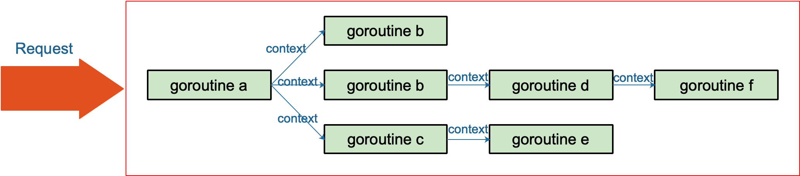
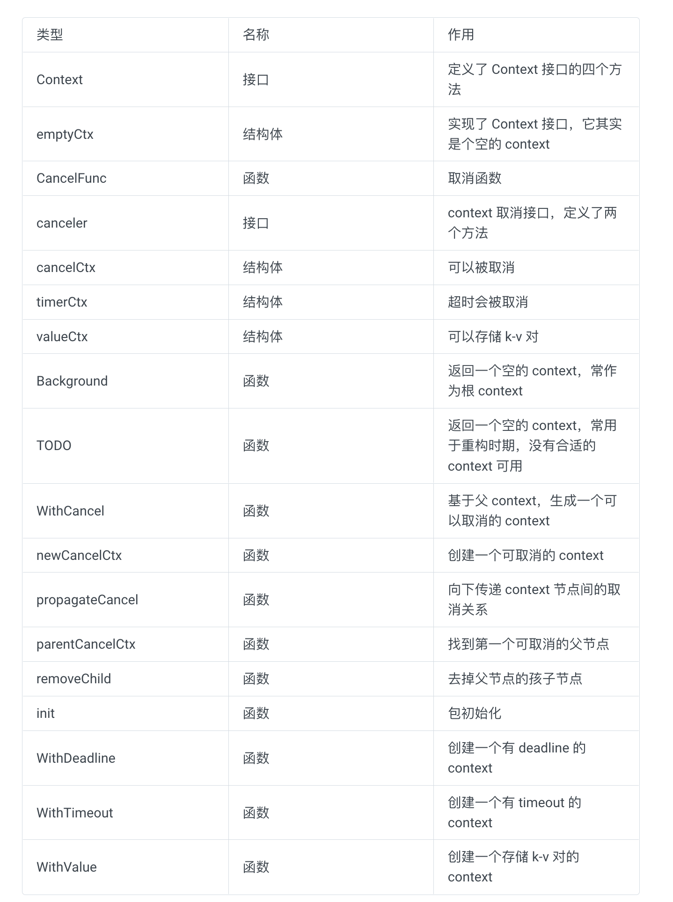
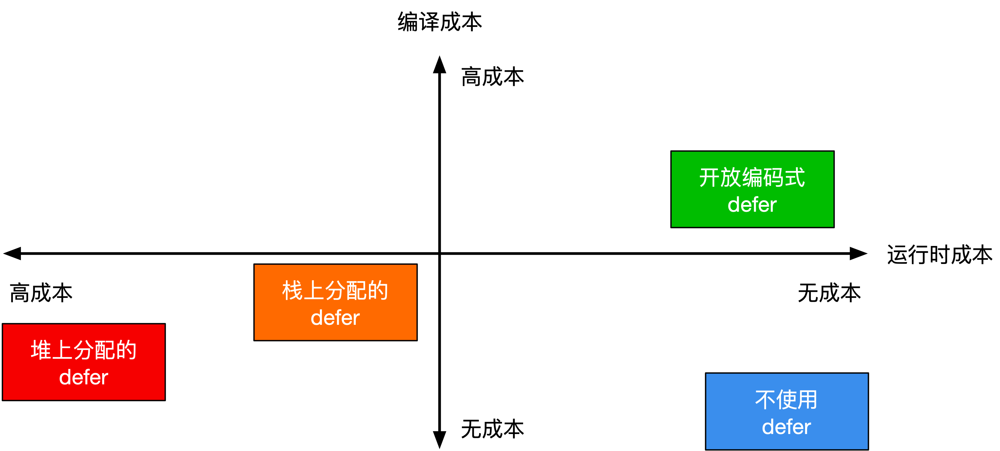

# 标准库

## Context

Go 1.7 标准库引入 context，中文译作“上下文”，准确说它是 goroutine 的上下文，包含 goroutine 的运行状态、环境、现场等信息。

context 主要用来在 goroutine 之间传递上下文信息，包括：取消信号、超时时间、截止时间、k-v 等。

随着 context 包的引入，标准库中很多接口因此加上了 context 参数，例如 database/sql 包。context 几乎成为了并发控制和超时控制的标准做法。

> context.Context 类型的值可以协调多个 groutine 中的代码执行“取消”操作，并且可以存储键值对。最重要的是它是并发安全的。
>
> 与它协作的 API 都可以由外部控制执行“取消”操作，例如：取消一个 HTTP 请求的执行。

### 作用

在 Go 的 server 里，通常每来一个请求都会启动若干个 goroutine 同时工作：有些去数据库拿数据，有些调用下游接口获取相关数据……

这些 goroutine 需要共享这个请求的基本数据，例如登陆的 token，处理请求的最大超时时间（如果超过此值再返回数据，请求方因为超时接收不到）等等。当请求被取消或是处理时间太长，这有可能是使用者关闭了浏览器或是已经超过了请求方规定的超时时间，请求方直接放弃了这次请求结果。这时，所有正在为这个请求工作的 goroutine 需要快速退出，因为它们的“工作成果”不再被需要了。在相关联的 goroutine 都退出后，系统就可以回收相关的资源。

再多说一点，Go 语言中的 server 实际上是一个“协程模型”，也就是说一个协程处理一个请求。例如在业务的高峰期，某个下游服务的响应变慢，而当前系统的请求又没有超时控制，或者超时时间设置地过大，那么等待下游服务返回数据的协程就会越来越多。而我们知道，协程是要消耗系统资源的，后果就是协程数激增，内存占用飙涨，甚至导致服务不可用。更严重的会导致雪崩效应，整个服务对外表现为不可用，这肯定是 P0 级别的事故。这时，肯定有人要背锅了。

其实前面描述的 P0 级别事故，通过设置“允许下游最长处理时间”就可以避免。例如，给下游设置的 timeout 是 50 ms，如果超过这个值还没有接收到返回数据，就直接向客户端返回一个默认值或者错误。例如，返回商品的一个默认库存数量。注意，这里设置的超时时间和创建一个 http client 设置的读写超时时间不一样，这里不详细展开。可以去看看参考资料`【Go 在今日头条的实践】`一文，有很精彩的论述。

context 包就是为了解决上面所说的这些问题而开发的：在 一组 goroutine 之间传递共享的值、取消信号、deadline……



一句话：context 用来解决 goroutine 之间`退出通知`、`元数据传递`的功能。

【引申1】举例说明 context 在实际项目中如何使用。

context 使用起来非常方便。源码里对外提供了一个创建根节点 context 的函数：

```go
func Background() Context
```

background 是一个空的 context， 它不能被取消，没有值，也没有超时时间。

有了根节点 context，又提供了四个函数创建子节点 context：

```go
func WithCancel(parent Context) (ctx Context, cancel CancelFunc)
func WithDeadline(parent Context, deadline time.Time) (Context, CancelFunc)
func WithTimeout(parent Context, timeout time.Duration) (Context, CancelFunc)
func WithValue(parent Context, key, val interface{}) Context
```

context 会在函数传递间传递。只需要在适当的时间调用 cancel 函数向 goroutines 发出取消信号或者调用 Value 函数取出 context 中的值。

在官方博客里，对于使用 context 提出了几点建议：

1. Do not store Contexts inside a struct type; instead, pass a Context explicitly to each function that needs it. The Context should be the first parameter, typically named ctx.
2. Do not pass a nil Context, even if a function permits it. Pass context.TODO if you are unsure about which Context to use.
3. Use context Values only for request-scoped data that transits processes and APIs, not for passing optional parameters to functions.
4. The same Context may be passed to functions running in different goroutines; Contexts are safe for simultaneous use by multiple goroutines.

我翻译一下：

1. 不要将 Context 塞到结构体里。直接将 Context 类型作为函数的第一参数，而且一般都命名为 ctx。
2. 不要向函数传入一个 nil 的 context，如果你实在不知道传什么，标准库给你准备好了一个 context：todo。
3. 不要把本应该作为函数参数的类型塞到 context 中，context 存储的应该是一些共同的数据。例如：登陆的 session、cookie 等。
4. 同一个 context 可能会被传递到多个 goroutine，别担心，context 是并发安全的。

### 传递共享的数据

对于 Web 服务端开发，往往希望将一个请求处理的整个过程串起来，这就非常依赖于 Thread Local（对于 Go 可理解为单个协程所独有） 的变量，而在 Go 语言中并没有这个概念，因此需要在函数调用的时候传递 context。

例子：

```go
package main

import (
    "context"
    "fmt"
)

func main() {
    ctx := context.Background()
    process(ctx)

    ctx = context.WithValue(ctx, "traceId", "qcrao-2019")
    process(ctx)
}

func process(ctx context.Context) {
    traceId, ok := ctx.Value("traceId").(string)
    if ok {
        fmt.Printf("process over. trace_id=%s\n", traceId)
    } else {
        fmt.Printf("process over. no trace_id\n")
    }
}
```


```go
const requestIDKey int = 0

func WithRequestID(next http.Handler) http.Handler {
    return http.HandlerFunc(
        func(rw http.ResponseWriter, req *http.Request) {
            // 从 header 中提取 request-id
            reqID := req.Header.Get("X-Request-ID")
            // 创建 valueCtx。使用自定义的类型，不容易冲突
            ctx := context.WithValue(
                req.Context(), requestIDKey, reqID)

            // 创建新的请求
            req = req.WithContext(ctx)

            // 调用 HTTP 处理函数
            next.ServeHTTP(rw, req)
        }
    )
}

// 获取 request-id
func GetRequestID(ctx context.Context) string {
    ctx.Value(requestIDKey).(string)
}

func Handle(rw http.ResponseWriter, req *http.Request) {
    // 拿到 reqId，后面可以记录日志等等
    reqID := GetRequestID(req.Context())
    ...
}

func main() {
    handler := WithRequestID(http.HandlerFunc(Handle))
    http.ListenAndServe("/", handler)
}
```


### 取消 goroutine

例子：

```go
func Perform(ctx context.Context) {
    for {
        calculatePos()
        sendResult()

        select {
        case <-ctx.Done():
            // 被取消，直接返回
            return
        case <-time.After(time.Second):
            // block 1 秒钟 
        }
    }
}
```

主流程可能是这样的：

```go
ctx, cancel := context.WithTimeout(context.Background(), time.Hour)
go Perform(ctx)

// ……
// app 端返回页面，调用cancel 函数
cancel()
```

使用 context.WithTimeout 设置协程超时时间，perform 函数里 ctx.Done() 返回一个 Channel，这个 Channel 会在当前工作完成或者上下文被取消后关闭，然后直接返回，这样就能控制协程的超时退出。

### 防止 goroutine 泄漏

例子：

```go
func gen(ctx context.Context) <-chan int {
    ch := make(chan int)
    go func() {
        var n int
        for {
            select {
            case <-ctx.Done():
                return
            case ch <- n:
                n++
                time.Sleep(time.Second)
            }
        }
    }()
    return ch
}

func main() {
    // 注意这里，使用 withCancel 来设置取消 goroutine 的信号
    ctx, cancel := context.WithCancel(context.Background())
    defer cancel() // 避免其他地方忘记 cancel，且重复调用不影响

    for n := range gen(ctx) {
        fmt.Println(n)
        if n == 5 {
            cancel()
            break
        }
    }
    // ……
}
```

增加一个 context，在 break 前调用 cancel 函数，取消 goroutine。gen 函数在接收到取消信号后，直接退出，系统回收资源。

### Context 如何被取消



上面这张表展示了 context 的所有函数、接口、结构体，可以纵览全局，可以在读完文章后，再回头细看。

整体类图如下：


### 接口

#### Context

```go
type Context interface {
    // 当 context 被取消或者到了 deadline，返回一个被关闭的 channel
    Done() <-chan struct{}

    // 在 channel Done 关闭后，返回 context 取消原因
    Err() error

    // 返回 context 是否会被取消以及自动取消时间（即 deadline）
    Deadline() (deadline time.Time, ok bool)

    // 获取 key 对应的 value
    Value(key interface{}) interface{}
}
```

`Context` 是一个接口，定义了 4 个方法，它们都是`幂等`的。也就是说连续多次调用同一个方法，得到的结果都是相同的。

`Done()` 返回一个 channel，可以表示 context 被取消的信号：当这个 channel 被关闭时，说明 context 被取消了。注意，这是一个只读的channel。 我们又知道，读一个关闭的 channel 会读出相应类型的零值。并且源码里没有地方会向这个 channel 里面塞入值。换句话说，这是一个 `receive-only` 的 channel。因此在子协程里读这个 channel，除非被关闭，否则读不出来任何东西。也正是利用了这一点，子协程从 channel 里读出了值（零值）后，就可以做一些收尾工作，尽快退出。

`Err()` 返回一个错误，表示 channel 被关闭的原因。例如是被取消，还是超时。

`Deadline()` 返回 context 的截止时间，通过此时间，函数就可以决定是否进行接下来的操作，如果时间太短，就可以不往下做了，否则浪费系统资源。当然，也可以用这个 deadline 来设置一个 I/O 操作的超时时间。

`Value()` 获取之前设置的 key 对应的 value。

#### Canceler

```go
type canceler interface {
    cancel(removeFromParent bool, err error)
    Done() <-chan struct{}
}
```

实现了上面定义的两个方法的 Context，就表明该 Context 是可取消的。源码中有两个类型实现了 canceler 接口：`*cancelCtx` 和 `*timerCtx`。注意是加了 `*` 号的，是这两个结构体的指针实现了 canceler 接口。

Context 接口设计成这个样子的原因：

- “取消”操作应该是建议性，而非强制性

caller 不应该去关心、干涉 callee 的情况，决定如何以及何时 return 是 callee 的责任。caller 只需发送“取消”信息，callee 根据收到的信息来做进一步的决策，因此接口并没有定义 cancel 方法。

- “取消”操作应该可传递

“取消”某个函数时，和它相关联的其他函数也应该“取消”。因此，`Done()` 方法返回一个只读的 channel，所有相关函数监听此 channel。一旦 channel 关闭，通过 channel 的“广播机制”，所有监听者都能收到。


### 结构体

#### emptyCtx

源码中定义了 `Context` 接口后，并且给出了一个实现：

```go
type emptyCtx int

func (*emptyCtx) Deadline() (deadline time.Time, ok bool) {
    return
}

func (*emptyCtx) Done() <-chan struct{} {
    return nil
}

func (*emptyCtx) Err() error {
    return nil
}

func (*emptyCtx) Value(key interface{}) interface{} {
    return nil
}
```

这实际上是一个空的 context，永远不会被 cancel，没有存储值，也没有 deadline。

它被包装成：

```go
var (
    background = new(emptyCtx)
    todo       = new(emptyCtx)
)
func Background() Context {
    return background
}

func TODO() Context {
    return todo
}
```

background 通常用在 main 函数中，作为所有 context 的根节点。

todo 通常用在并不知道传递什么 context的情形。例如，调用一个需要传递 context 参数的函数，你手头并没有其他 context 可以传递，这时就可以传递 todo。这常常发生在重构进行中，给一些函数添加了一个 Context 参数，但不知道要传什么，就用 todo “占个位子”，最终要换成其他 context。

#### cancelCtx

todo

#### timerCtx

todo

### Context.Value 的查找过程是怎样的

```go
type valueCtx struct {
    Context
    key, val interface{}
}
```

它实现了两个方法：

```go
func (c *valueCtx) String() string {
    return fmt.Sprintf("%v.WithValue(%#v, %#v)", c.Context, c.key, c.val)
}

func (c *valueCtx) Value(key interface{}) interface{} {
    if c.key == key {
        return c.val
    }
    return c.Context.Value(key)
}
```

创建 valueCtx 的函数：

```go
func WithValue(parent Context, key, val interface{}) Context {
    if key == nil {
        panic("nil key")
    }
    if !reflect.TypeOf(key).Comparable() {
        panic("key is not comparable")
    }
    return &valueCtx{parent, key, val}
}
```

对 key 的要求是可比较，因为之后需要通过 key 取出 context 中的值，可比较是必须的。

通过层层传递 context，最终形成这样一棵树：


和链表有点像，只是它的方向相反：Context 指向它的父节点，链表则指向下一个节点。通过 WithValue 函数，可以创建层层的 valueCtx，存储 goroutine 间可以共享的变量。

取值的过程，实际上是一个递归查找的过程：

```go
func (c *valueCtx) Value(key interface{}) interface{} {
    if c.key == key {
        return c.val
    }
    return c.Context.Value(key)
}
```

它会顺着链路一直往上找，比较当前节点的 key 是否是要找的 key，如果是，则直接返回 value。否则，一直顺着 context 往前，最终找到根节点（一般是 emptyCtx），直接返回一个 nil。所以用 Value 方法的时候要判断结果是否为 nil。

因为查找方向是往上走的，所以，父节点没法获取子节点存储的值，子节点却可以获取父节点的值。

`WithValue` 创建 context 节点的过程实际上就是创建链表节点的过程。两个节点的 key 值是可以相等的，但它们是两个不同的 context 节点。查找的时候，会向上查找到最后一个挂载的 context 节点，也就是离得比较近的一个父节点 context。所以，整体上而言，用 `WithValue` 构造的其实是一个低效率的链表。

如果你接手过项目，肯定经历过这样的窘境：在一个处理过程中，有若干子函数、子协程。各种不同的地方会向 context 里塞入各种不同的 k-v 对，最后在某个地方使用。

你根本就不知道什么时候什么地方传了什么值？这些值会不会被“覆盖”（底层是两个不同的 context 节点，查找的时候，只会返回一个结果）？你肯定会崩溃的。

而这也是 `context.Value` 最受争议的地方。很多人建议尽量不要通过 context 传值。


## defer

以下内容来自 [《Go 语言原本》](https://golang.design/under-the-hood/zh-cn/part1basic/ch03lang/defer/#341-defer-)。

defer 的语义表明，它会在函数返回、产生恐慌或者 `runtime.Goexit` 时被调用。直觉上看， defer 应该由编译器直接将需要的函数调用插入到该调用的地方，似乎是一个编译期特性， 不应该存在运行时性能问题，非常类似于 C++ 的 RAII 范式（当离开资源的作用域时， 自动执行析构函数）。 但实际情况是，由于 defer 并没有与其依赖资源挂钩，也允许在条件、循环语句中出现， 从而不再是一个作用域相关的概念，这就是使得 defer 的语义变得相对复杂。 在一些复杂情况下，无法在编译期决定存在多少个 defer 调用。

例如，在一个执行次数不确定的 for 循环中，defer 的执行次数是随机的：

```go
func randomDefers() {
	rand.Seed(time.Now().UnixNano())
	for rand.Intn(100) > 42 {
		defer func() {
			println("golang-design/under-the-hood")
		}()
	}
}
```

因而 defer 并不是免费的午餐，在一个复杂的调用中，当无法直接确定需要的产生的延迟调用的数量时， 延迟语句将导致运行性能的下降。

对于延迟语句而言，其中间表示会产生三种不同的延迟形式， 第一种是最一般情况下的在**堆上分配**的延迟语句，第二种是允许在**栈上分配**的延迟语句， 最后一种则是 **开放编码式(Open-coded)** 的延迟语句。

```go
// src/cmd/compile/internal/gc/ssa.go
func (s *state) stmt(n *Node) {
	...
	switch n.Op {
	case ODEFER:
		// 开放编码式 defer
		if s.hasOpenDefers {
			s.openDeferRecord(n.Left)
		} else {
			// 堆上分配的 defer
			d := callDefer
			if n.Esc == EscNever {
				// 栈上分配的 defer
				d = callDeferStack
			}
			s.call(n.Left, d)
		}
	case ...
	}
	...
}
```

### 在堆上分配的 defer

在堆上分配的原因是 defer 语句出现 在了循环语句里，或者无法执行更高阶的编译器优化导致的。如果一个与 defer 出现在循环语句中， 则可执行的次数可能无法在编译期决定；如果一个调用中 defer 由于数量过多等原因， 不能被编译器进行开放编码，则也会在堆上分配 defer。

总之，由于这种不确定性的存在，在堆上分配的 defer 需要最多的运行时支持， 因而产生的运行时开销也最大。

在defer出现的地方，Go 语言的编译器插入了指令call runtime.deferproc，然后在函数返回之前的地方，插入指令call runtime.deferreturn。

普通的函数返回时，汇编代码类似：

```
add xx SP
return
```

如果其中包含了defer语句，则汇编代码是：

```
call runtime.deferreturn，
add xx SP
return
```

一个函数中的延迟语句会被保存为一个 `_defer` 记录的链表，附着在一个 Goroutine 上。 `_defer` 记录的具体结构也非常简单，主要包含了参与调用的参数大小、 当前 defer 语句所在函数的 PC 和 SP 寄存器、被 defer 的函数的入口地址以及串联 多个 defer 的 link 链表，该链表指向下一个需要执行的 defer。


调用`runtime.deferproc`时会将需要`defer`的表达式记录在表中，而在调用`runtime.deferreturn`的时候，则会依次从`_defer`表中出栈并执行。

###  在栈上创建 defer

在默认情况下， `runtime._defer` 结构体都会在堆上分配，如果我们能够将部分结构体分配到栈上就可以节约内存分配带来的额外开销。

在栈上分配 defer 的好处在于函数返回后 `_defer` 便已得到释放， 不再需要考虑内存分配时产生的性能开销，只需要适当的维护 `_defer` 的链表即可。

Go 语言团队在 1.13 中对 `defer` 关键字进行了优化，当该关键字在函数体中最多执行一次时，编译期间的 `cmd/compile/internal/gc.state.call` 会将结构体分配到栈上并调用 `runtime.deferprocStack`。


### 开放编码式 defer

开放编码式 defer 进化为一个仅编译期特性（不依赖运行时），即在函数末尾直接对延迟函数进行调用， 做到几乎不需要额外的开销。这类几乎不需要额外运行时性能开销的 defer，正是开放编码式 defer。

允许进行 defer 的开放编码的主要条件 （此处略去了一些常见生产环境无关的条件，例如启用竞争检查时也不能对 defer 进行开放编码）：

1. 没有禁用编译器优化，即没有设置 `-gcflags "-N"`
2. 存在 defer 调用
3. 函数内 defer 的数量不超过 8 个、且返回语句与延迟语句个数的乘积不超过 15
4. 没有与 defer 发生在循环语句中

#### 延迟比特

使用延迟比特的核心思想可以用下面的伪代码来概括。 在创建延迟调用的阶段，首先通过延迟比特的特定位置记录哪些带条件的 defer 被触发。 这个延迟比特是一个长度为 8 位的二进制码（也是硬件架构里最小、最通用的情况）， 以每一位是否被设置为 1，来判断延迟语句是否在运行时被设置，如果设置，则发生调用。 否则则不调用。


```go
deferBits = 0           // 初始值 00000000
deferBits |= 1 << 0     // 遇到第一个 defer，设置为 00000001
_f1 = f1
_a1 = a1
if cond {
	// 如果第二个 defer 被设置，则设置为 00000011，否则依然为 00000001
	deferBits |= 1 << 1
	_f2 = f2
	_a2 = a2
}
```

在退出位置，再重新根据被标记的延迟比特，反向推导哪些位置的 defer 需要被触发，从而 执行延迟调用：

```go
exit:
// 按顺序倒序检查延迟比特。如果第二个 defer 被设置，则
//   00000011 & 00000010 == 00000010，即延迟比特不为零，应该调用 f2。
// 如果第二个 defer 没有被设置，则 
//   00000001 & 00000010 == 00000000，即延迟比特为零，不应该调用 f2。
if deferBits & 1 << 1 != 0 { // 00000011 & 00000010 != 0
	deferBits &^= 1<<1       // 00000001
	_f2(_a2)
}
// 同理，由于 00000001 & 00000001 == 00000001，因此延迟比特不为零，应该调用 f1
if deferBits && 1 << 0 != 0 {
	deferBits &^= 1<<0
	_f1(_a1)
}
```


如下图所示，其中 8 个比特的倒数第二个比特在函数返回前被设置成了 1，那么该比特位对应的函数会在函数返回前执行：


延迟比特的作用就是标记哪些 `defer` 关键字在函数中被执行，这样在函数返回时可以根据对应 `deferBits` 的内容确定执行的函数，而正是因为 `deferBits` 的大小仅为 8 比特，所以该优化的启用条件为函数中的 `defer` 关键字少于 8 个。

### 小结

**图 3.4.2：不同类型 defer 的编译与运行时成本之间的取舍**

我们最后来总结一下 defer 的基本工作原理以及三种 defer 的性能取舍，见图 3.4.2。

1. 对于开放编码式 defer 而言：
   - 编译器会直接将所需的参数进行存储，并在返回语句的末尾插入被延迟的调用；
   - 当整个调用中逻辑上会执行的 defer 不超过 15 个（例如七个 defer 作用在两个返回语句）、总 defer 数量不超过 8 个、且没有出现在循环语句中时，会激活使用此类 defer；
   - 此类 defer 的唯一的运行时成本就是存储参与延迟调用的相关信息，运行时性能最好。
2. 对于栈上分配的 defer 而言：
   - 编译器会直接在栈上记录一个 `_defer` 记录，该记录不涉及内存分配，并将其作为参数，传入被翻译为 `deferprocStack` 的延迟语句，在延迟调用的位置将 `_defer` 压入 Goroutine 对应的延迟调用链表中；
   - 在函数末尾处，通过编译器的配合，在调用被 defer 的函数前，调用 `deferreturn`，将被延迟的调用出栈并执行；
   - 此类 defer 的唯一运行时成本是从 `_defer` 记录中将参数复制出，以及从延迟调用记录链表出栈的成本，运行时性能其次。
3. 对于堆上分配的 defer 而言：
   - 编译器首先会将延迟语句翻译为一个 `deferproc` 调用，进而从运行时分配一个用于记录被延迟调用的 `_defer` 记录，并将被延迟的调用的入口地址及其参数复制保存，入栈到 Goroutine 对应的延迟调用链表中；
   - 在函数末尾处，通过编译器的配合，在调用被 defer 的函数前，调用 `deferreturn`，从而将 `_defer` 实例归还到资源池，而后通过模拟尾递归的方式来对需要 defer 的函数进行调用。
   - 此类 defer 的主要性能问题存在于每个 defer 语句产生记录时的内存分配，记录参数和完成调用时的参数移动时的系统调用，运行时性能最差。